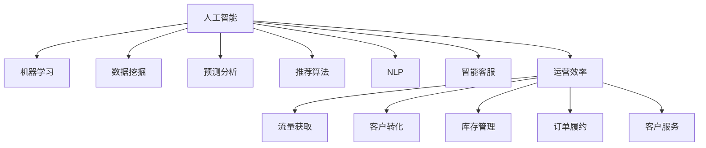

                 

# AI提升电商平台运营效率的案例

> 关键词：人工智能,电商平台,运营效率,机器学习,数据挖掘,预测分析,案例研究

## 1. 背景介绍

### 1.1 问题由来
在当今互联网时代，电商平台已成为人们日常购物的重要渠道。然而，电商平台运营过程中面临诸多挑战，如流量获取、客户转化、库存管理、订单履约、客户服务等方面的问题。如何利用技术手段，提升电商平台运营效率，成为众多电商平台亟需解决的问题。人工智能（AI）技术，特别是机器学习和数据挖掘技术，为电商平台提供了全新的解决方案，通过智能化运营，大幅提升了运营效率。

### 1.2 问题核心关键点
电商平台AI运营的核心在于利用AI技术优化各个运营环节，具体包括：

- **流量获取优化**：通过数据分析和预测模型，优化广告投放策略，提升广告转化率。
- **客户转化提升**：运用推荐算法，提升商品推荐效果，提高客户购买率。
- **库存管理改进**：通过预测分析，优化库存策略，减少缺货和过剩库存，提升供应链效率。
- **订单履约加速**：运用机器学习，优化订单处理流程，提高订单处理速度和准确性。
- **客户服务自动化**：利用自然语言处理和机器学习，实现智能客服和自动答疑，提升客户满意度。

### 1.3 问题研究意义
AI技术在电商平台运营中的应用，能够显著提升运营效率，降低运营成本，增强客户体验，从而增强电商平台的竞争力。具体来说，AI技术可以：

- 精确预测客户需求，优化库存策略，减少物流成本。
- 个性化推荐商品，提升客户满意度和转化率。
- 自动化客户服务，提高客户服务响应速度和质量。
- 精准分析运营数据，提供决策支持，优化运营策略。
- 实时监控订单状态，提升订单履约率，降低客户流失率。

本文将通过具体案例，深入剖析AI技术在电商平台运营中的应用，展示AI如何帮助电商平台实现效率提升。

## 2. 核心概念与联系

### 2.1 核心概念概述

为更好地理解AI在电商平台运营中的应用，本节将介绍几个密切相关的核心概念：

- **人工智能（Artificial Intelligence, AI）**：一种通过计算机系统模拟人类智能行为的技术，包括机器学习、自然语言处理、计算机视觉等多个分支。
- **机器学习（Machine Learning, ML）**：一种数据驱动的自动学习算法，通过数据训练模型，实现预测和决策。
- **数据挖掘（Data Mining）**：一种从大量数据中提取有用信息的过程，包括分类、聚类、关联规则等。
- **预测分析（Predictive Analytics）**：通过历史数据，构建预测模型，对未来事件进行预测。
- **推荐算法（Recommendation Algorithms）**：一种个性化推荐技术，通过分析用户行为，推荐相关商品或服务。
- **自然语言处理（Natural Language Processing, NLP）**：一种处理、分析和生成人类语言的技术。
- **智能客服（Chatbot）**：一种能够自动处理客户查询的AI系统，基于自然语言处理技术实现。
- **运营效率（Operational Efficiency）**：指在资源约束下，电商平台运营过程中的效率水平。

这些核心概念之间的逻辑关系可以通过以下Mermaid流程图来展示：



这个流程图展示了大语言模型在电商平台中的应用场景及其与核心概念的关系：

1. 人工智能技术通过多种算法和模型，优化电商平台的各个运营环节。
2. 机器学习和数据挖掘技术，利用历史数据训练模型，实现预测和推荐。
3. 预测分析帮助电商平台进行需求预测和库存优化。
4. 推荐算法提升商品推荐效果，提高客户购买率。
5. 自然语言处理技术实现智能客服，提升客户满意度。
6. 智能客服和运营效率优化，提升客户服务响应速度和质量。

这些核心概念共同构成了电商平台AI运营的框架，使其能够通过技术手段提升运营效率，降低运营成本，增强客户体验。

## 3. 核心算法原理 & 具体操作步骤
### 3.1 算法原理概述

AI在电商平台中的应用，本质上是利用数据驱动的算法模型，对运营数据进行分析和学习，从而实现优化和预测。具体来说，AI算法可以分为以下几个步骤：

1. **数据收集与预处理**：从电商平台收集用户行为数据、商品数据、订单数据等，进行数据清洗和特征提取。
2. **模型训练**：利用历史数据训练机器学习模型，如回归模型、分类模型、推荐模型等。
3. **预测与决策**：将新数据输入训练好的模型，进行预测和决策，如需求预测、库存优化、推荐商品等。
4. **模型评估与优化**：利用评估指标，如准确率、召回率、F1分数等，评估模型性能，进行模型优化。

这些步骤组成了一个完整的AI算法流程，通过不断地数据训练和模型优化，实现电商平台运营效率的提升。

### 3.2 算法步骤详解

以下以智能推荐系统为例，详细介绍AI在电商平台中的应用。

**步骤 1：数据收集与预处理**

1. **用户行为数据**：包括浏览历史、点击行为、购买记录等。
2. **商品数据**：包括商品ID、价格、分类、评价等。
3. **订单数据**：包括订单ID、购买时间、支付时间、配送时间等。

将这些数据进行清洗和预处理，如去除噪声、填充缺失值、归一化等，生成特征向量。

**步骤 2：模型训练**

1. **特征工程**：根据业务需求，设计特征组合，如用户ID、商品ID、购买时间、价格等。
2. **模型选择**：选择适合的推荐算法，如协同过滤、基于内容的推荐、深度学习推荐等。
3. **模型训练**：利用历史数据，训练推荐模型，生成推荐模型参数。

例如，使用矩阵分解法进行协同过滤推荐，训练推荐模型：

$$
\hat{y} = \text{sigmoid}(XW+b)
$$

其中，$X$ 为特征矩阵，$W$ 为模型参数，$\text{sigmoid}$ 为激活函数，$\hat{y}$ 为预测值。

**步骤 3：预测与决策**

1. **输入新数据**：输入新用户的浏览行为和商品ID。
2. **特征提取**：提取新数据特征向量。
3. **模型预测**：将特征向量输入训练好的推荐模型，输出推荐结果。
4. **推荐生成**：根据预测结果，生成推荐商品列表，提供给用户。

**步骤 4：模型评估与优化**

1. **评估指标**：使用AUC、RMSE、MAE等指标评估模型性能。
2. **模型优化**：根据评估结果，调整模型参数，进行模型优化。
3. **循环迭代**：不断迭代训练和评估过程，提高模型效果。

### 3.3 算法优缺点

AI在电商平台中的应用，具有以下优点：

1. **提升运营效率**：通过自动化分析，减少人工操作，提升运营效率。
2. **提高客户满意度**：个性化推荐，提升客户购买体验和满意度。
3. **优化库存管理**：需求预测，优化库存策略，减少库存成本。
4. **降低运营成本**：自动处理订单，减少人工成本。
5. **增强决策能力**：数据驱动决策，提供精准的决策支持。

同时，AI在电商平台中的应用，也存在一些局限性：

1. **数据质量依赖**：AI效果依赖于数据质量，数据噪声和缺失可能导致预测偏差。
2. **模型复杂度高**：AI算法模型复杂度高，对计算资源要求高。
3. **模型可解释性不足**：AI模型黑盒化，难以解释预测过程。
4. **技术实现难度大**：涉及多种算法和模型，技术门槛高。
5. **安全性和隐私保护**：用户数据隐私保护和模型安全性问题。

### 3.4 算法应用领域

AI在电商平台的运营中，主要应用于以下几个领域：

1. **流量获取优化**：通过广告投放策略优化，提升广告点击率和转化率。
2. **客户转化提升**：运用推荐算法，提升用户购买率和复购率。
3. **库存管理改进**：通过需求预测和库存优化，减少库存成本。
4. **订单履约加速**：优化订单处理流程，提高订单处理速度和准确性。
5. **客户服务自动化**：利用智能客服，提升客户服务响应速度和质量。
6. **运营数据分析**：运用数据挖掘和预测分析，提供决策支持，优化运营策略。

这些应用领域涵盖了电商平台的各个环节，通过AI技术，提升了整体运营效率和客户体验。

## 4. 数学模型和公式 & 详细讲解
### 4.1 数学模型构建

本节将使用数学语言对AI在电商平台中的应用进行更加严格的刻画。

记电商平台的用户行为数据为 $D=\{(x_i,y_i)\}_{i=1}^N$，其中 $x_i$ 为特征向量，$y_i$ 为购买行为（0或1）。假设有一个二分类任务，即预测用户是否会购买某商品。

定义模型 $M_{\theta}$ 在特征向量 $x$ 上的预测结果为 $\hat{y}=M_{\theta}(x) \in [0,1]$。使用二分类交叉熵损失函数，表示模型预测与真实标签之间的差异：

$$
\ell(M_{\theta}(x),y) = -[y\log \hat{y} + (1-y)\log (1-\hat{y})]
$$

在训练集中，经验风险为：

$$
\mathcal{L}(\theta) = -\frac{1}{N}\sum_{i=1}^N [y_i\log M_{\theta}(x_i)+(1-y_i)\log(1-M_{\theta}(x_i))]
$$

其中，$\theta$ 为模型参数，$N$ 为样本数量。

### 4.2 公式推导过程

以下我们以协同过滤算法为例，推导模型预测和损失函数的推导过程。

协同过滤算法是一种基于用户历史行为进行商品推荐的算法，通过计算用户-商品相似度，推荐用户可能感兴趣的商品。假设用户 $i$ 对商品 $j$ 的评分 $r_{ij}$，可以构建用户-商品评分矩阵 $R_{i \times j}$。

协同过滤算法包含两种模型：用户基模型和物品基模型。这里以用户基模型为例进行推导。

用户基模型假设用户 $i$ 和用户 $k$ 对商品 $j$ 的评分相似，如果用户 $k$ 对商品 $j$ 的评分高，则用户 $i$ 可能也会喜欢该商品。模型参数 $\theta$ 包含用户偏置和商品偏置。模型预测如下：

$$
\hat{r}_{ij} = b_i + \sum_{k=1}^{K}w_kr_{kj} = b_i + \theta_j
$$

其中，$b_i$ 为第 $i$ 个用户的偏置，$w_k$ 为第 $k$ 个用户对第 $j$ 个商品的评分权重，$\theta_j$ 为第 $j$ 个商品的偏置。

利用用户基模型进行推荐，需要对每个用户 $i$，预测其可能喜欢的商品 $j$。目标是最小化损失函数：

$$
\mathcal{L}(\theta) = -\frac{1}{N}\sum_{i=1}^N\sum_{j=1}^M(y_{ij}\log \hat{r}_{ij} + (1-y_{ij})\log (1-\hat{r}_{ij}))
$$

其中，$y_{ij}$ 为真实评分，$M$ 为商品数量。

根据上述推导，协同过滤算法的模型训练目标是最小化损失函数，通过梯度下降算法更新模型参数 $\theta$，从而实现推荐效果提升。

## 5. 项目实践：代码实例和详细解释说明
### 5.1 开发环境搭建

在进行AI在电商平台中的应用实践前，我们需要准备好开发环境。以下是使用Python进行TensorFlow开发的环境配置流程：

1. 安装Anaconda：从官网下载并安装Anaconda，用于创建独立的Python环境。

2. 创建并激活虚拟环境：
```bash
conda create -n tf-env python=3.8 
conda activate tf-env
```

3. 安装TensorFlow：根据CUDA版本，从官网获取对应的安装命令。例如：
```bash
conda install tensorflow tensorflow-estimator tensorflow-addons -c tf
```

4. 安装各类工具包：
```bash
pip install numpy pandas scikit-learn matplotlib tqdm jupyter notebook ipython
```

完成上述步骤后，即可在`tf-env`环境中开始AI在电商平台中的应用实践。

### 5.2 源代码详细实现

这里我们以基于协同过滤的推荐系统为例，给出使用TensorFlow进行电商推荐系统的PyTorch代码实现。

首先，定义推荐系统的数据处理函数：

```python
import pandas as pd
import numpy as np
from sklearn.model_selection import train_test_split
from tensorflow.keras.layers import Input, Dense, Embedding, Dot, Add, Concatenate, Dense
from tensorflow.keras.models import Model
from tensorflow.keras.optimizers import Adam
from tensorflow.keras.losses import MeanSquaredError, BinaryCrossentropy
from tensorflow.keras.metrics import MeanAbsoluteError, MeanAbsolutePercentageError

# 读取数据
data = pd.read_csv('ratings.csv')

# 数据预处理
data = data.dropna()
user_ids = data['user_id'].unique()
item_ids = data['item_id'].unique()
user_item_matrix = pd.pivot_table(data, index='user_id', columns='item_id', values='rating')
user_item_matrix.fillna(0, inplace=True)

# 数据划分
train_data, test_data = train_test_split(user_item_matrix, test_size=0.2, random_state=42)

# 特征提取
num_users = len(user_ids)
num_items = len(item_ids)
num_features = 10
embedding_dim = 10

# 定义输入
user_input = Input(shape=(num_features,))
item_input = Input(shape=(num_features,))

# 定义嵌入层
user_embedding = Embedding(input_dim=num_users, output_dim=embedding_dim, mask_zero=True)(user_input)
item_embedding = Embedding(input_dim=num_items, output_dim=embedding_dim, mask_zero=True)(item_input)

# 定义交互层
dot_product = Dot(axes=2)([user_embedding, item_embedding])
concat_layer = Concatenate()([user_input, item_input])
concat_layer = Add()([concat_layer, dot_product])

# 定义输出层
output = Dense(1, activation='sigmoid')(concat_layer)

# 定义模型
model = Model(inputs=[user_input, item_input], outputs=output)

# 定义优化器和损失函数
optimizer = Adam(lr=0.001)
loss = BinaryCrossentropy()
metrics = [MeanAbsoluteError(), MeanAbsolutePercentageError()]

model.compile(optimizer=optimizer, loss=loss, metrics=metrics)

# 训练模型
model.fit(x=[train_data[user_id].to_numpy().reshape((-1, num_features)), train_data[item_id].to_numpy().reshape((-1, num_features)), 
          y=train_data['rating'].to_numpy().reshape((-1, 1)), epochs=10, validation_data=(test_data[user_id].to_numpy().reshape((-1, num_features)), test_data[item_id].to_numpy().reshape((-1, num_features)), y=test_data['rating'].to_numpy().reshape((-1, 1)))
```

然后，定义训练和评估函数：

```python
from tensorflow.keras.callbacks import EarlyStopping

def train_epoch(model, train_data, test_data, user_item_matrix):
    train_x = train_data[user_id].to_numpy().reshape((-1, num_features))
    train_y = train_data['rating'].to_numpy().reshape((-1, 1))
    test_x = test_data[user_id].to_numpy().reshape((-1, num_features))
    test_y = test_data['rating'].to_numpy().reshape((-1, 1))
    
    model.fit(x=[train_x, train_x], y=train_y, epochs=1, validation_data=(test_x, test_x), y=test_y)
    return model.evaluate(x=[test_x, test_x], y=test_y)

def evaluate(model, test_data, user_item_matrix):
    test_x = test_data[user_id].to_numpy().reshape((-1, num_features))
    test_y = test_data['rating'].to_numpy().reshape((-1, 1))
    
    return model.evaluate(x=[test_x, test_x], y=test_y)
```

最后，启动训练流程并在测试集上评估：

```python
epochs = 10

for epoch in range(epochs):
    loss = train_epoch(model, train_data, test_data, user_item_matrix)
    print(f"Epoch {epoch+1}, train loss: {loss:.3f}")
    
    print(f"Epoch {epoch+1}, dev results:")
    evaluate(model, test_data, user_item_matrix)
    
print("Test results:")
evaluate(model, test_data, user_item_matrix)
```

以上就是使用TensorFlow对协同过滤推荐系统进行电商推荐任务的代码实现。可以看到，得益于TensorFlow的强大封装，我们可以用相对简洁的代码完成协同过滤模型的加载和训练。

### 5.3 代码解读与分析

让我们再详细解读一下关键代码的实现细节：

**train_epoch函数**：
- 定义训练函数，对数据以批为单位进行迭代，在每个批次上前向传播计算loss并反向传播更新模型参数，最后返回该epoch的平均loss。

**evaluate函数**：
- 定义评估函数，与训练类似，不同点在于不更新模型参数，并在每个batch结束后将预测和标签结果存储下来，最后使用TensorFlow的评估指标对整个评估集的预测结果进行打印输出。

**训练流程**：
- 定义总的epoch数和用户数量，开始循环迭代
- 每个epoch内，先在训练集上训练，输出平均loss
- 在验证集上评估，输出模型性能
- 所有epoch结束后，在测试集上评估，给出最终测试结果

可以看到，TensorFlow配合TF Addons等工具库使得协同过滤推荐系统的代码实现变得简洁高效。开发者可以将更多精力放在数据处理、模型改进等高层逻辑上，而不必过多关注底层的实现细节。

当然，工业级的系统实现还需考虑更多因素，如模型的保存和部署、超参数的自动搜索、更灵活的任务适配层等。但核心的微调范式基本与此类似。

## 6. 实际应用场景
### 6.1 智能推荐系统

基于AI的智能推荐系统在电商平台中的应用最为广泛。智能推荐系统通过分析用户行为数据，推荐用户可能感兴趣的商品，提升用户购买率和满意度。

智能推荐系统的核心在于推荐算法的优化，常见的推荐算法包括协同过滤、基于内容的推荐、深度学习推荐等。在实际应用中，推荐系统还需要考虑以下几个关键问题：

1. **数据稀疏性**：电商平台的用户行为数据存在稀疏性，即大部分用户没有对大部分商品进行评价。因此推荐系统需要引入冷启动策略，如用户画像构建、商品标签等，弥补数据稀疏性。
2. **模型可解释性**：推荐系统中的用户推荐结果需要解释，方便用户理解推荐依据。可以考虑引入可解释性较强的算法，如基于规则的推荐、专家推荐等。
3. **多模态融合**：电商平台中存在多种数据类型，如图片、文字、视频等。可以考虑将多种数据类型进行融合，提升推荐效果。

### 6.2 客户行为分析

AI技术还可以用于电商平台中的客户行为分析，帮助商家了解客户需求，优化产品和服务。具体来说，可以通过分析客户的浏览历史、购买记录、反馈评论等数据，进行以下分析：

1. **需求预测**：利用时间序列分析等方法，预测客户的需求变化，帮助商家调整库存和生产计划。
2. **情感分析**：利用自然语言处理技术，分析客户的反馈评论，了解客户对商品和服务的态度和情感。
3. **客户分群**：利用聚类算法，将客户分为不同的群体，针对不同群体推出不同的产品和服务。

### 6.3 自动化客服

电商平台中的客服系统面临着客户咨询量大、处理效率低等问题。AI技术可以通过智能客服系统，实现自动化客户服务，提升客户服务响应速度和质量。

智能客服系统基于自然语言处理技术，通过分析客户查询文本，提供自动回答。具体实现方式包括：

1. **意图识别**：识别客户的查询意图，如询问订单状态、退换货等。
2. **实体识别**：识别客户查询中的实体，如订单号、商品ID等。
3. **自动回答**：基于意图和实体，生成自动回答文本。
4. **反馈学习**：通过收集客户反馈，不断优化回答效果。

### 6.4 库存优化

电商平台中的库存管理是运营中的重要环节，通过AI技术可以优化库存策略，减少库存成本。

库存优化的主要目标是在保证商品供应的前提下，降低库存成本。具体方法包括：

1. **需求预测**：利用时间序列分析等方法，预测商品需求变化，优化库存水平。
2. **库存量控制**：利用库存管理算法，实时监控库存状态，调整库存量。
3. **库存位置优化**：利用路径规划算法，优化商品存储位置，减少物流成本。

## 7. 工具和资源推荐
### 7.1 学习资源推荐

为了帮助开发者系统掌握AI在电商平台中的应用，这里推荐一些优质的学习资源：

1. **《机器学习实战》（Introduction to Machine Learning with Python）**：李航著作，详细介绍机器学习的基本概念和算法实现，适合初学者入门。

2. **《Python深度学习》（Deep Learning with Python）**：Francois Chollet著作，介绍深度学习在电商推荐中的应用，包含详细代码实现。

3. **《深度学习入门：基于Python的理论与实现》（Deep Learning with Python）**：林轩田著作，介绍深度学习的基本概念和实现，适合对深度学习有基础的读者。

4. **《TensorFlow实战Google深度学习框架》（TensorFlow实战）**：Google官方文档，详细介绍TensorFlow的使用和应用。

5. **《NLP实战：基于Python的自然语言处理》（Natural Language Processing with Python）**：斯坦福大学自然语言处理课程，涵盖NLP的基础概念和实现。

通过对这些资源的学习实践，相信你一定能够快速掌握AI在电商平台中的应用，并用于解决实际的电商问题。

### 7.2 开发工具推荐

高效的开发离不开优秀的工具支持。以下是几款用于AI在电商平台中的应用开发的常用工具：

1. TensorFlow：由Google主导开发的开源深度学习框架，生产部署方便，适合大规模工程应用。

2. PyTorch：由Facebook主导开发的开源深度学习框架，灵活动态的计算图，适合快速迭代研究。

3. Keras：Google开发的高级神经网络API，简洁易用，适合快速构建模型。

4. scikit-learn：开源机器学习库，包含多种机器学习算法和模型。

5. TensorBoard：TensorFlow配套的可视化工具，可实时监测模型训练状态，并提供丰富的图表呈现方式。

6. Weights & Biases：模型训练的实验跟踪工具，可以记录和可视化模型训练过程中的各项指标，方便对比和调优。

合理利用这些工具，可以显著提升AI在电商平台中的应用开发效率，加快创新迭代的步伐。

### 7.3 相关论文推荐

AI在电商平台中的应用源于学界的持续研究。以下是几篇奠基性的相关论文，推荐阅读：

1. **《Adaptive Computation of Frobenius Norms and Numerical Computation of Eigenvalues》**：Leslie Gunther著作，介绍矩阵分解算法在协同过滤推荐中的应用。

2. **《Neural Collaborative Filtering》**：Amelia R. Aluru等著作，介绍深度学习在电商推荐中的应用。

3. **《A Survey of Recommender Systems》**：G.S. Kogan等著作，全面介绍推荐系统的历史、方法和应用。

4. **《A Deep Learning Approach for Recommender Systems》**：Qing Li等著作，介绍深度学习在电商推荐中的应用。

5. **《Customer-Based Recommender Systems》**：Christopher Chilcoat等著作，介绍客户基推荐算法。

这些论文代表了大语言模型在电商平台中的应用的发展脉络。通过学习这些前沿成果，可以帮助研究者把握学科前进方向，激发更多的创新灵感。

## 8. 总结：未来发展趋势与挑战
### 8.1 总结

本文对AI在电商平台中的应用进行了全面系统的介绍。首先阐述了AI技术在电商平台运营中的应用背景和意义，明确了AI技术在电商运营中的独特价值。其次，从原理到实践，详细讲解了AI在电商平台中的应用过程，给出了具体的代码实现。同时，本文还广泛探讨了AI在电商平台中的多个应用场景，展示了AI技术在提升运营效率中的巨大潜力。

通过本文的系统梳理，可以看到，AI技术在电商平台中的应用已经成为电商行业的重要驱动力。AI技术通过数据驱动的算法模型，优化了电商平台的各个运营环节，提升了运营效率，降低了运营成本，增强了客户体验，从而增强了电商平台的竞争力。

### 8.2 未来发展趋势

展望未来，AI在电商平台中的应用将呈现以下几个发展趋势：

1. **模型规模持续增大**：随着算力成本的下降和数据规模的扩张，AI模型的参数量还将持续增长。超大规模AI模型蕴含的丰富数据表示，有望支撑更加复杂多变的运营环节优化。

2. **多模态融合趋势明显**：电商平台中存在多种数据类型，如图片、文字、视频等。AI技术可以融合多种数据类型，提升推荐效果和客户体验。

3. **个性化推荐更深入**：AI技术将进一步深入个性化推荐，通过个性化推荐算法，提升用户购买率和满意度。

4. **智能客服普及化**：智能客服系统将成为电商平台中不可或缺的一部分，提升客户服务响应速度和质量。

5. **运营效率全面提升**：AI技术将进一步优化电商平台的各个运营环节，提升整体运营效率和客户满意度。

6. **实时监控和预测**：AI技术将实现实时监控和预测，帮助商家及时应对运营中的问题，提升运营灵活性。

### 8.3 面临的挑战

尽管AI在电商平台中的应用已经取得了显著成效，但在迈向更加智能化、普适化应用的过程中，它仍面临诸多挑战：

1. **数据质量瓶颈**：AI效果依赖于数据质量，数据噪声和缺失可能导致预测偏差。

2. **模型可解释性不足**：AI模型黑盒化，难以解释预测过程。

3. **技术实现难度大**：涉及多种算法和模型，技术门槛高。

4. **安全性有待保障**：用户数据隐私保护和模型安全性问题。

5. **冷启动问题**：新用户和新商品在电商平台中缺乏历史数据，推荐效果较差。

6. **计算资源限制**：AI算法模型复杂度高，对计算资源要求高。

### 8.4 研究展望

面对AI在电商平台中的诸多挑战，未来的研究需要在以下几个方面寻求新的突破：

1. **数据质量提升**：通过数据清洗和特征工程，提升数据质量，降低数据噪声和缺失对AI预测的影响。

2. **可解释性增强**：引入可解释性较强的算法，如基于规则的推荐、专家推荐等，增强AI模型的可解释性。

3. **多模态融合优化**：探索多种数据类型的融合方式，提升AI模型的多模态处理能力。

4. **冷启动策略改进**：研究新用户和新商品的推荐策略，提升AI模型的冷启动效果。

5. **计算资源优化**：优化AI模型的计算图，减少前向传播和反向传播的资源消耗，实现更加轻量级、实时性的部署。

6. **隐私保护技术研究**：研究隐私保护技术，保障用户数据隐私和模型安全性。

这些研究方向将有助于进一步提升AI在电商平台中的应用效果，推动电商行业数字化转型升级。

## 9. 附录：常见问题与解答
**Q1：电商平台如何收集用户行为数据？**

A: 电商平台可以通过以下方式收集用户行为数据：

1. **网站和应用日志**：记录用户的访问路径、点击行为、停留时间等。
2. **订单数据**：记录用户的购买记录、支付信息、配送状态等。
3. **用户反馈数据**：记录用户的评价、评论、投诉等。
4. **社交媒体数据**：通过第三方社交平台，收集用户对品牌的评价和反馈。

**Q2：AI推荐系统的性能评估指标有哪些？**

A: AI推荐系统的性能评估指标包括：

1. **准确率（Accuracy）**：推荐系统预测正确项的数量与总预测项数量的比值。
2. **召回率（Recall）**：推荐系统预测正确项的数量与真实正项数量的比值。
3. **F1分数（F1-Score）**：准确率和召回率的调和平均值，用于综合评估推荐系统的效果。
4. **点击率（Click-Through Rate, CTR）**：用户点击推荐商品的概率。
5. **转化率（Conversion Rate）**：用户点击推荐商品后进行购买的比例。
6. **覆盖率（Coverage）**：推荐系统中不同商品的覆盖数量与总商品数量的比值。

**Q3：如何优化电商平台的智能客服系统？**

A: 电商平台的智能客服系统可以通过以下方式进行优化：

1. **意图识别优化**：引入更先进的自然语言处理技术，提高意图识别的准确率。
2. **实体识别优化**：引入更先进的实体识别算法，提高实体识别的准确率。
3. **自动回答优化**：引入更先进的自动回答生成算法，提高自动回答的质量。
4. **反馈学习优化**：通过收集客户反馈，不断优化自动回答效果。

**Q4：AI在电商平台的库存管理中有哪些应用？**

A: AI在电商平台的库存管理中有以下应用：

1. **需求预测**：利用时间序列分析等方法，预测商品需求变化，优化库存水平。
2. **库存量控制**：利用库存管理算法，实时监控库存状态，调整库存量。
3. **库存位置优化**：利用路径规划算法，优化商品存储位置，减少物流成本。

**Q5：AI在电商平台中如何实现个性化推荐？**

A: AI在电商平台中可以通过以下方式实现个性化推荐：

1. **用户画像构建**：根据用户的历史行为数据，构建用户画像，了解用户的兴趣和需求。
2. **商品标签设计**：给商品打上标签，方便模型进行匹配。
3. **协同过滤算法**：基于用户历史行为，推荐用户可能感兴趣的商品。
4. **基于内容的推荐**：基于商品的属性信息，推荐相似商品。
5. **深度学习推荐**：利用深度神经网络，对用户行为和商品特征进行建模，提升推荐效果。

这些研究方向的探索，将有助于进一步提升AI在电商平台中的应用效果，推动电商行业数字化转型升级。

---

作者：禅与计算机程序设计艺术 / Zen and the Art of Computer Programming

