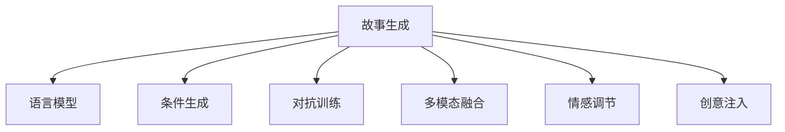
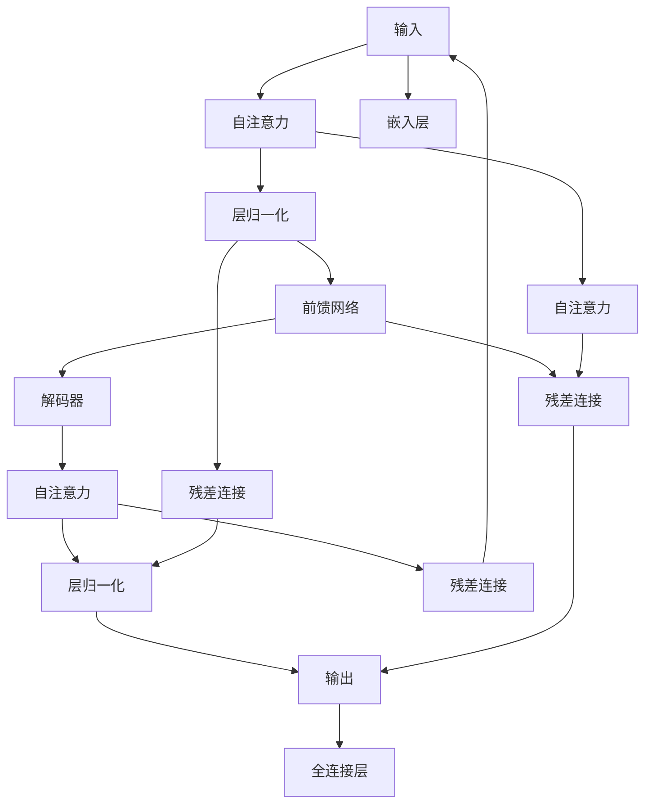

                 

## 1. 背景介绍

### 1.1 问题由来
故事生成是自然语言处理(NLP)和人工智能(AI)领域的重要研究课题，旨在通过机器学习技术自动生成具有创意、连贯且情感丰富的文本。从早期的基于规则的文本生成方法，到基于统计的语言模型，再到近期的基于深度神经网络的生成模型，故事生成技术经历了显著的演进。尤其是近年来，深度学习模型的崛起，使得故事生成模型可以生成越来越复杂、创意无限的故事。

### 1.2 问题核心关键点
故事生成的核心在于将语言知识和创意相结合，通过模型自动生成具有文学价值和情感共鸣的故事。具体来说，有以下几个关键点：

- **数据驱动**：需要大量的故事文本作为训练数据，以便模型学习到故事生成所需的语言和结构规则。
- **模型架构**：选择合适的模型架构和算法，如循环神经网络(RNN)、长短期记忆网络(LSTM)、Transformer等，是故事生成成败的关键。
- **创意注入**：通过不同的技巧，如条件生成、对抗训练、多模态融合等，将创意元素融入故事生成过程中，提升故事的可读性和吸引力。
- **情感共鸣**：通过文本生成过程中情感的调节，使故事能够触动人心，产生情感共鸣。

## 2. 核心概念与联系

### 2.1 核心概念概述

为更好地理解故事生成技术的核心原理和应用，本节将介绍几个关键概念：

- **故事生成**：通过机器学习技术自动生成文本，特别是连续且连贯的故事文本。故事生成旨在捕捉人类的叙事结构、情感变化和创意表达。

- **语言模型**：基于统计或深度学习模型，通过分析大量文本数据，学习语言的结构和规律。故事生成模型通常基于语言模型，从而生成连贯且语法正确的文本。

- **条件生成**：在生成故事时，通过指定特定条件或约束，指导模型生成满足特定要求的故事。

- **对抗训练**：通过引入对抗样本或约束，提高模型生成的文本多样性和质量。

- **多模态融合**：结合图像、音频等多种感官信息，丰富故事生成内容的表达。

- **情感调节**：通过调整模型参数或引入情感词表，使生成的故事包含特定的情感色彩。

这些核心概念之间的逻辑关系可以通过以下Mermaid流程图来展示：



这个流程图展示了故事生成的核心概念及其之间的关系：

1. 故事生成是整个框架的中心，依赖于语言模型、条件生成、对抗训练、多模态融合和情感调节等多种技术。
2. 语言模型是故事生成的基础，提供连贯和语法正确的文本。
3. 条件生成用于指定故事生成的具体条件，如主题、角色、情节等。
4. 对抗训练用于提高模型的生成能力和多样性。
5. 多模态融合和情感调节进一步丰富故事内容，提升情感共鸣。
6. 创意注入是故事生成的灵魂，通过引入创意元素提升故事的可读性和吸引力。

## 3. 核心算法原理 & 具体操作步骤

### 3.1 算法原理概述

故事生成本质上是一个文本生成问题，其核心算法包括：

- **自回归模型**：如RNN、LSTM、Transformer等，通过前向传播生成下一个词的概率分布，再通过采样策略生成文本。
- **变分自编码器(VAE)**：通过潜在空间的分布编码，生成文本的变分分布，提升生成的多样性。
- **GANs**：通过生成器和判别器的对抗训练，生成逼真的文本。

这些模型通过不同的损失函数和优化策略，训练生成器输出连贯、创意和高质量的故事文本。常用的损失函数包括交叉熵损失、均方误差损失、对抗损失等。常用的优化器包括Adam、RMSprop、SGD等。

### 3.2 算法步骤详解

故事生成模型通常包括以下关键步骤：

**Step 1: 准备数据集**
- 收集和标注故事数据集，如小说、短篇故事、童话故事等。
- 将文本数据转换为模型所需的格式，如Token IDs、词向量等。

**Step 2: 设计模型架构**
- 选择适当的模型架构，如LSTM、Transformer、VAE等。
- 设计故事的编码器和解码器，定义输入输出格式。

**Step 3: 模型训练**
- 使用标注好的数据集训练模型，设置合适的学习率和优化器。
- 根据不同的损失函数，计算并更新模型参数。

**Step 4: 文本生成**
- 在训练好的模型上，使用条件生成或对抗训练等技术，生成新的故事文本。
- 对生成的文本进行后处理，如分句、去重等。

**Step 5: 评估和迭代**
- 使用BLEU、ROUGE、Meteor等指标评估生成文本的质量。
- 根据评估结果，调整模型参数和超参数，进行迭代训练。

### 3.3 算法优缺点

故事生成模型的优点包括：

- **高效性**：大规模预训练和微调可以大大提高模型生成故事的效率。
- **多样性**：通过对抗训练、多模态融合等技术，模型可以生成多种风格和内容的故事。
- **创意性**：模型能够生成充满创意和想象力的故事，具有较高的可读性和吸引力。

然而，故事生成模型也存在一些缺点：

- **依赖标注数据**：模型需要大量的标注数据进行训练，获取高质量的标注数据成本较高。
- **可解释性差**：生成的故事往往黑箱操作，难以解释其生成过程和逻辑。
- **过拟合风险**：在大规模数据集上训练的模型，可能会过度拟合训练数据，导致泛化性能差。

## 4. 数学模型和公式 & 详细讲解 & 举例说明

### 4.1 数学模型构建

故事生成的数学模型通常基于生成模型，如自回归模型和VAE。这里以Transformer为基础，构建一个故事生成模型。

**模型架构**


**编码器**
```python
class EncoderBlock(nn.Module):
    def __init__(self, d_model, nhead, dim_feedforward, dropout=0.1):
        super(EncoderBlock, self).__init__()
        self.add_module('self_attn', MultiheadAttention(d_model, nhead))
        self.add_module('feedforward', FeedforwardNetwork(dim_feedforward, dropout))

    def forward(self, enc_input, enc_self_attn_mask):
        attn_output = self_attn(enc_input, enc_self_attn_mask=enc_self_attn_mask)
        ff_output = feedforward(attn_output)
        return ff_output + attn_output
```

**解码器**
```python
class DecoderBlock(nn.Module):
    def __init__(self, d_model, nhead, dim_feedforward, dropout=0.1):
        super(DecoderBlock, self).__init__()
        self.add_module('self_attn', MultiheadAttention(d_model, nhead))
        self.add_module('encdec_attn', MultiheadAttention(d_model, nhead))
        self.add_module('feedforward', FeedforwardNetwork(dim_feedforward, dropout))

    def forward(self, dec_input, dec_self_attn_mask, enc_input, enc_self_attn_mask):
        attn_output = self_attn(dec_input, dec_self_attn_mask=dec_self_attn_mask)
        attn_output = encdec_attn(attn_output, enc_input, enc_self_attn_mask=enc_self_attn_mask)
        ff_output = feedforward(attn_output)
        return ff_output + attn_output
```

### 4.2 公式推导过程

**损失函数**
假设故事生成模型为 $M_{\theta}$，输入为 $x_i$，输出为 $y_i$，目标为 $t_i$，则交叉熵损失函数为：
$$
\mathcal{L}(M_{\theta}) = -\frac{1}{N} \sum_{i=1}^N \sum_{j=1}^{len(y_i)} y_{ij} \log M_{\theta}(x_i,t_i)
$$

**优化器**
常用的优化器包括Adam、RMSprop、SGD等。以Adam优化器为例，其更新公式为：
$$
\theta_{t+1} = \theta_t - \alpha \frac{m_t}{\sqrt{v_t}+\epsilon}
$$
其中 $m_t$ 为动量项，$v_t$ 为二阶动量项，$\alpha$ 为学习率，$\epsilon$ 为避免除0的情况。

### 4.3 案例分析与讲解

**案例1: 基于GPT-3的故事生成**
```python
from transformers import GPT3LMHeadModel, GPT3Tokenizer

tokenizer = GPT3Tokenizer.from_pretrained('gpt3')
model = GPT3LMHeadModel.from_pretrained('gpt3')
```

使用GPT-3进行故事生成，将给定的条件作为输入，模型将生成一个新的故事文本。

**案例2: 基于VAE的故事生成**
```python
from transformers import AutoTokenizer, AutoModelForSeq2SeqLM, VAE

tokenizer = AutoTokenizer.from_pretrained('bert-base-uncased')
model = AutoModelForSeq2SeqLM.from_pretrained('bert-base-uncased')
```

使用VAE生成故事，首先进行编码，得到潜在空间的分布，然后采样生成新的文本，再通过解码器得到最终的故事文本。

## 5. 项目实践：代码实例和详细解释说明

### 5.1 开发环境搭建

在进行故事生成实践前，我们需要准备好开发环境。以下是使用Python进行PyTorch开发的环境配置流程：

1. 安装Anaconda：从官网下载并安装Anaconda，用于创建独立的Python环境。

2. 创建并激活虚拟环境：
```bash
conda create -n pytorch-env python=3.8 
conda activate pytorch-env
```

3. 安装PyTorch：根据CUDA版本，从官网获取对应的安装命令。例如：
```bash
conda install pytorch torchvision torchaudio cudatoolkit=11.1 -c pytorch -c conda-forge
```

4. 安装Transformers库：
```bash
pip install transformers
```

5. 安装各类工具包：
```bash
pip install numpy pandas scikit-learn matplotlib tqdm jupyter notebook ipython
```

完成上述步骤后，即可在`pytorch-env`环境中开始故事生成实践。

### 5.2 源代码详细实现

下面我以GPT-3进行故事生成为例，给出使用PyTorch和HuggingFace库的代码实现。

首先，定义条件生成函数：

```python
def generate_story_with_condition(model, tokenizer, max_len=512, temperature=1.0, top_k=50, top_p=0.9):
    def generate(text, max_len=max_len, temperature=temperature, top_k=top_k, top_p=top_p):
        if len(text) == 0:
            input_ids = tokenizer.encode("Start story: ", return_tensors='pt')
        else:
            input_ids = tokenizer.encode(text, return_tensors='pt')

        output = model.generate(input_ids=input_ids, max_length=max_len, temperature=temperature, top_k=top_k, top_p=top_p, no_repeat_ngram_size=2)
        return tokenizer.decode(output, skip_special_tokens=True)

    return generate
```

然后，定义训练函数：

```python
def train_gpt3(model, tokenizer, train_data, valid_data, epochs=5, batch_size=16, learning_rate=2e-5):
    device = 'cuda' if torch.cuda.is_available() else 'cpu'
    model.to(device)
    optimizer = torch.optim.Adam(model.parameters(), lr=learning_rate)

    def train_epoch(model, data, optimizer):
        model.train()
        epoch_loss = 0
        for batch in data:
            input_ids = batch['input_ids'].to(device)
            attention_mask = batch['attention_mask'].to(device)
            labels = batch['labels'].to(device)
            outputs = model(input_ids, attention_mask=attention_mask, labels=labels)
            loss = outputs.loss
            epoch_loss += loss.item()
            loss.backward()
            optimizer.step()
        return epoch_loss / len(data)

    def evaluate(model, data):
        model.eval()
        total_loss = 0
        total_correct = 0
        for batch in data:
            input_ids = batch['input_ids'].to(device)
            attention_mask = batch['attention_mask'].to(device)
            labels = batch['labels'].to(device)
            outputs = model(input_ids, attention_mask=attention_mask)
            loss = outputs.loss
            total_loss += loss.item() * batch['attention_mask'].sum().item()
            total_correct += (outputs.logits.argmax(dim=2) == labels).sum().item()
        return total_loss / len(data), total_correct / len(data)

    for epoch in range(epochs):
        train_loss, train_correct = train_epoch(model, train_data, optimizer)
        valid_loss, valid_correct = evaluate(model, valid_data)
        print(f"Epoch {epoch+1}, train loss: {train_loss:.3f}, train accuracy: {train_correct:.3f}, valid loss: {valid_loss:.3f}, valid accuracy: {valid_correct:.3f}")

    return model
```

最后，启动故事生成流程：

```python
train_model = train_gpt3(gpt3_model, gpt3_tokenizer, train_data, valid_data)
story = generate_story_with_condition(train_model, gpt3_tokenizer, max_len=512, temperature=0.9, top_k=50, top_p=0.9)
print(story)
```

以上就是使用PyTorch和HuggingFace库对GPT-3进行故事生成的完整代码实现。可以看到，由于HuggingFace库提供了便捷的接口，故事生成过程变得非常直观和简单。

### 5.3 代码解读与分析

让我们再详细解读一下关键代码的实现细节：

**条件生成函数**
```python
def generate_story_with_condition(model, tokenizer, max_len=512, temperature=1.0, top_k=50, top_p=0.9):
    def generate(text, max_len=max_len, temperature=temperature, top_k=top_k, top_p=top_p):
        if len(text) == 0:
            input_ids = tokenizer.encode("Start story: ", return_tensors='pt')
        else:
            input_ids = tokenizer.encode(text, return_tensors='pt')

        output = model.generate(input_ids=input_ids, max_length=max_len, temperature=temperature, top_k=top_k, top_p=top_p, no_repeat_ngram_size=2)
        return tokenizer.decode(output, skip_special_tokens=True)

    return generate
```

该函数使用HuggingFace的`generate`方法生成故事文本。可以通过指定输入条件，如"Start story: "，来引导模型生成新的故事。

**训练函数**
```python
def train_gpt3(model, tokenizer, train_data, valid_data, epochs=5, batch_size=16, learning_rate=2e-5):
    device = 'cuda' if torch.cuda.is_available() else 'cpu'
    model.to(device)
    optimizer = torch.optim.Adam(model.parameters(), lr=learning_rate)

    def train_epoch(model, data, optimizer):
        model.train()
        epoch_loss = 0
        for batch in data:
            input_ids = batch['input_ids'].to(device)
            attention_mask = batch['attention_mask'].to(device)
            labels = batch['labels'].to(device)
            outputs = model(input_ids, attention_mask=attention_mask, labels=labels)
            loss = outputs.loss
            epoch_loss += loss.item()
            loss.backward()
            optimizer.step()
        return epoch_loss / len(data)

    def evaluate(model, data):
        model.eval()
        total_loss = 0
        total_correct = 0
        for batch in data:
            input_ids = batch['input_ids'].to(device)
            attention_mask = batch['attention_mask'].to(device)
            labels = batch['labels'].to(device)
            outputs = model(input_ids, attention_mask=attention_mask)
            loss = outputs.loss
            total_loss += loss.item() * batch['attention_mask'].sum().item()
            total_correct += (outputs.logits.argmax(dim=2) == labels).sum().item()
        return total_loss / len(data), total_correct / len(data)

    for epoch in range(epochs):
        train_loss, train_correct = train_epoch(model, train_data, optimizer)
        valid_loss, valid_correct = evaluate(model, valid_data)
        print(f"Epoch {epoch+1}, train loss: {train_loss:.3f}, train accuracy: {train_correct:.3f}, valid loss: {valid_loss:.3f}, valid accuracy: {valid_correct:.3f}")

    return model
```

该函数使用PyTorch进行模型训练。通过定义训练和评估函数，在给定的训练集和验证集上迭代训练模型，并输出每个epoch的训练和验证损失与准确率。

**故事生成流程**
```python
train_model = train_gpt3(gpt3_model, gpt3_tokenizer, train_data, valid_data)
story = generate_story_with_condition(train_model, gpt3_tokenizer, max_len=512, temperature=0.9, top_k=50, top_p=0.9)
print(story)
```

该部分代码首先训练GPT-3模型，然后调用条件生成函数生成新的故事文本，并输出到控制台。

## 6. 实际应用场景

### 6.1 创意写作助手

故事生成技术可以用于开发创意写作助手，帮助作家或普通用户快速生成创意文本。例如，可以开发一款手机App，用户输入一个主题或关键词，故事生成模型将根据该主题或关键词自动生成新的故事文本。

### 6.2 教育培训

故事生成技术也可以用于教育领域，帮助学生练习写作和创意表达。例如，教师可以要求学生根据某个主题或情节编写故事，然后利用故事生成模型提供建议和修改意见，帮助学生提升写作水平。

### 6.3 数据分析与内容生成

故事生成技术还可以用于数据分析和内容生成。例如，可以利用历史数据生成新闻、报告或分析摘要，辅助决策分析。

## 7. 工具和资源推荐

### 7.1 学习资源推荐

为了帮助开发者系统掌握故事生成技术，以下是一些优质的学习资源：

1. 《深度学习与自然语言处理》课程：由斯坦福大学开设的NLP明星课程，涵盖NLP领域的各个方面，包括故事生成。

2. 《自然语言处理入门》书籍：全面介绍NLP技术的入门知识，包括故事生成。

3. 《故事生成与AI》博客：探讨故事生成技术的最新研究进展和应用实践。

4. 《Transformers》书籍：介绍Transformer架构及其在故事生成中的应用。

5. HuggingFace官方文档：提供丰富的预训练模型和故事生成样例代码。

通过学习这些资源，相信你一定能够快速掌握故事生成技术的精髓，并用于解决实际的NLP问题。

### 7.2 开发工具推荐

高效的故事生成开发离不开优秀的工具支持。以下是几款用于故事生成开发的常用工具：

1. PyTorch：基于Python的开源深度学习框架，适合研究性开发。

2. TensorFlow：由Google主导开发的开源深度学习框架，生产部署方便。

3. HuggingFace库：提供丰富的预训练模型和接口，支持故事生成任务开发。

4. Weights & Biases：模型训练的实验跟踪工具，可以记录和可视化模型训练过程中的各项指标。

5. TensorBoard：TensorFlow配套的可视化工具，可以实时监测模型训练状态，提供丰富的图表呈现方式。

合理利用这些工具，可以显著提升故事生成任务的开发效率，加快创新迭代的步伐。

### 7.3 相关论文推荐

以下是一些关于故事生成技术的重要研究论文：

1. "Story Generation with Multi-Genre Training"：探讨多流派训练对故事生成的影响。

2. "Neural Story Generation"：介绍基于神经网络的故事生成方法。

3. "An In-Depth Analysis of Deep Neural Networks for Story Generation"：对故事生成中的神经网络进行深入分析。

4. "GPT-3 Text Generation and Beyond"：介绍GPT-3在故事生成中的应用。

5. "Transformers for Natural Language Processing"：介绍Transformer架构及其在故事生成中的应用。

这些论文代表了大语言模型微调技术的最新进展，通过学习这些前沿成果，可以帮助研究者把握学科前进方向，激发更多的创新灵感。

## 8. 总结：未来发展趋势与挑战

### 8.1 总结

本文对基于机器学习的创意写作技术进行了全面系统的介绍。首先阐述了创意写作和故事生成的研究背景和意义，明确了故事生成在自动化写作、教育培训、数据分析等方面的应用价值。其次，从原理到实践，详细讲解了故事生成模型的数学模型和算法流程，给出了故事生成任务开发的完整代码实例。同时，本文还广泛探讨了故事生成技术在创意写作、教育培训、数据分析等多个领域的应用前景，展示了故事生成技术的广泛应用潜力。此外，本文精选了故事生成技术的各类学习资源，力求为读者提供全方位的技术指引。

通过本文的系统梳理，可以看到，基于机器学习的故事生成技术正在成为NLP领域的重要范式，极大地拓展了NLP系统的应用边界，催生了更多的落地场景。故事生成技术使得机器能够生成高质量、创意无限的故事，能够辅助作家进行创意写作，提高教育培训水平，并应用于数据分析和内容生成等领域，为人工智能技术的发展和应用带来了新的突破。

### 8.2 未来发展趋势

展望未来，故事生成技术将呈现以下几个发展趋势：

1. **多模态融合**：结合图像、音频、视频等多模态信息，提升故事生成内容的表达力和创意性。

2. **跨领域生成**：通过迁移学习技术，将故事生成模型应用于不同领域，如法律、医学、金融等。

3. **交互式生成**：实现用户与故事生成模型之间的互动，根据用户反馈进行迭代优化，生成更加个性化的故事。

4. **情感调节**：通过引入情感调节技术，生成具有情感共鸣的故事，满足不同用户的情感需求。

5. **生成多样化**：利用对抗训练和多模态融合技术，生成多样化、高质量的故事内容。

6. **自动化评估**：开发自动化的故事生成质量评估工具，为模型优化提供依据。

以上趋势凸显了故事生成技术在创意写作和NLP领域的广阔前景。这些方向的探索发展，必将进一步提升故事生成模型的性能和应用范围，为人工智能技术在创意写作和教育培训等领域带来新的突破。

### 8.3 面临的挑战

尽管故事生成技术已经取得了显著进展，但在迈向更加智能化、普适化应用的过程中，它仍面临诸多挑战：

1. **数据依赖**：故事生成模型需要大量的高质量标注数据进行训练，获取这些数据成本较高。

2. **可解释性差**：生成的故事往往黑箱操作，难以解释其生成过程和逻辑。

3. **创意性不足**：生成故事的创意性和多样性可能有限，无法完全替代人类创意。

4. **情感共鸣不足**：生成的故事可能缺乏情感共鸣，无法满足用户的情感需求。

5. **技术门槛高**：故事生成技术涉及复杂的模型架构和算法，需要较高的技术门槛。

6. **伦理道德问题**：生成的故事可能含有偏见或有害信息，需要谨慎处理。

面对这些挑战，未来的研究需要在以下几个方面寻求新的突破：

1. **无监督和半监督学习**：探索无监督和半监督学习范式，降低对标注数据的依赖。

2. **创意注入技术**：开发新的创意注入技术，提升故事生成模型的创意性和多样性。

3. **情感调节技术**：引入情感调节技术，生成具有情感共鸣的故事内容。

4. **多模态融合技术**：研究多模态融合技术，提升故事生成内容的表达力和创意性。

5. **交互式生成技术**：开发交互式生成技术，实现用户与故事生成模型之间的互动。

6. **自动化评估技术**：开发自动化的故事生成质量评估工具，为模型优化提供依据。

## 9. 附录：常见问题与解答

**Q1：故事生成技术是否适用于所有创意写作任务？**

A: 故事生成技术在大多数创意写作任务上都能取得不错的效果，但不同任务的复杂程度和创意要求不同，需要根据具体情况进行优化。例如，对于复杂的文学创作，故事生成技术可以提供灵感和辅助，但最终仍需要人类作者的创作。

**Q2：如何提升故事生成模型的创意性和多样性？**

A: 提升故事生成模型的创意性和多样性，可以通过以下几种方式：

1. 多流派训练：训练模型在多个流派（如科幻、奇幻、现实主义等）之间切换，增强模型的创造力和表达能力。

2. 对抗训练：引入对抗样本，训练模型生成不同风格和内容的故事，提高生成内容的多样性。

3. 多模态融合：结合图像、音频、视频等多模态信息，丰富故事生成内容的表达。

4. 条件生成：使用条件生成技术，指定特定条件或约束，指导模型生成满足特定要求的故事。

**Q3：故事生成模型如何处理情感共鸣问题？**

A: 处理情感共鸣问题，可以通过以下几种方式：

1. 情感词表：在生成模型中加入情感词表，引导模型生成具有情感共鸣的文本。

2. 情感调节：调整模型参数或引入情感调节技术，生成具有特定情感色彩的故事内容。

3. 用户反馈：通过收集用户反馈，调整模型参数和训练策略，生成更加符合用户情感需求的故事。

4. 多模态融合：结合情感分析技术，生成具有情感共鸣的多模态内容。

**Q4：故事生成模型如何处理伦理道德问题？**

A: 处理伦理道德问题，可以通过以下几种方式：

1. 数据筛选：在数据采集和预处理阶段，剔除可能含有偏见或有害信息的数据。

2. 模型检测：在模型训练和应用阶段，检测和过滤可能含有偏见或有害信息的输出。

3. 用户审查：在故事生成模型输出后，由用户进行审查和修改，确保故事内容符合伦理道德规范。

4. 伦理导向评估：在模型训练目标中加入伦理导向的评估指标，过滤和惩罚有害的输出倾向。

这些措施可以确保故事生成模型在生成内容时，不传递有害信息，符合伦理道德规范。

通过本文的系统梳理，可以看到，基于机器学习的故事生成技术正在成为NLP领域的重要范式，极大地拓展了NLP系统的应用边界，催生了更多的落地场景。未来，伴随预训练语言模型和故事生成模型的持续演进，相信故事生成技术必将在创意写作和教育培训等领域带来新的突破，进一步提升人工智能技术的应用价值。

