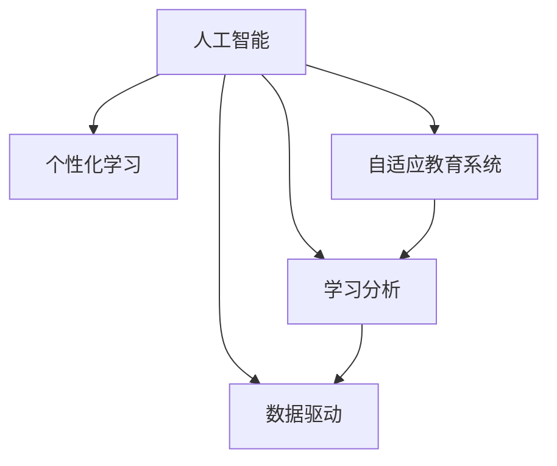

                 

# AI教育革命：个性化学习路径的设计

> 关键词：人工智能，个性化学习，自适应教育系统，学习分析，数据驱动

## 1. 背景介绍

### 1.1 问题由来

在传统教育体系中，教师往往难以对每位学生的学习情况进行细致了解，教学内容和进度也难以做到个性化调整。这种模式不仅效率低下，难以适应学生的多样化需求，也极大地浪费了教育资源。随着人工智能技术的迅猛发展，教育领域亟需一种能够实时感知学生学习状态，动态调整教学内容与进度的智能化解决方案。

### 1.2 问题核心关键点

实现个性化学习路径的核心在于：
1. 实时监测学生学习状态。通过对学生的学习行为数据进行分析，了解其知识掌握情况和兴趣偏好。
2. 动态生成个性化教学内容。基于实时监测结果，自动生成适合学生当前学习水平和兴趣的个性化课程内容。
3. 自适应调整学习进度。根据学生的学习效果和反馈，智能调整课程难度和进度，确保学生能够在适合自己的节奏下高效学习。
4. 数据驱动的教学决策。通过大量学习数据分析，发现学习规律和潜在问题，及时调整教学策略，提高整体教学质量。

### 1.3 问题研究意义

实现个性化学习路径具有重要的教育意义：
1. 提升教学效率。通过个性化教学，能够更精准地识别学生的学习需求，避免资源浪费，提高教学效率。
2. 激发学习兴趣。个性化的学习内容和方法更能满足学生的兴趣，激发其主动学习的动力。
3. 促进学生全面发展。个性化的学习路径能够根据学生的能力和兴趣，提供全面的素质教育和技能培训，促进其全面发展。
4. 缩小教育差距。通过智能化的教学管理，能够更好地实现教育公平，缩小城乡、区域间的教育差距。

## 2. 核心概念与联系

### 2.1 核心概念概述

为更好地理解个性化学习路径的实现原理，本节将介绍几个密切相关的核心概念：

- 人工智能(AI)：基于数据、算法和计算能力，让机器能够模拟、延伸或扩展人类的智能，包括感知、推理、决策等能力。
- 个性化学习：根据学生的个人特点和学习需求，定制化的教育内容和学习方式，实现因材施教。
- 自适应教育系统(Adaptive Learning System)：通过数据分析和算法优化，能够根据学生学习状态动态调整教学内容和进度的教育系统。
- 学习分析(Learning Analytics)：利用数据驱动的方法，分析和预测学生的学习行为、学习效果等，以指导教学决策和改进。
- 数据驱动(Datadriven)：依赖于数据和统计分析，以数据为基础，指导决策和行为的方法。

这些核心概念之间的逻辑关系可以通过以下Mermaid流程图来展示：



这个流程图展示了个性化学习路径的核心概念及其之间的关系：

1. 人工智能为个性化学习提供了技术支撑，包括感知、推理和决策等能力。
2. 个性化学习通过自适应教育系统得以实现，能够根据学生学习状态动态调整教学内容和进度。
3. 学习分析提供了数据分析和决策支持，帮助教师和系统了解学生学习情况。
4. 数据驱动指导了教学策略和算法优化，使得教学过程更加科学合理。

这些概念共同构成了个性化学习路径的实现框架，使其能够灵活应对不同学生的个性化需求。

## 3. 核心算法原理 & 具体操作步骤
### 3.1 算法原理概述

实现个性化学习路径的算法主要基于以下几大原理：

- 学生建模(Student Modeling)：通过收集和分析学生的学习数据，建立学生知识掌握、兴趣偏好的详细模型。
- 课程推荐系统(Course Recommendation)：基于学生模型，动态生成个性化课程推荐。
- 自适应算法(Adaptive Algorithm)：根据学生的学习状态和反馈，动态调整课程难度和进度。
- 学习效果评估(Learning Effect Assessment)：通过测评和反馈数据，评估学生对课程内容的掌握程度和兴趣变化。

这些算法共同构建了个性化学习路径的底层技术支撑。

### 3.2 算法步骤详解

基于上述算法原理，个性化学习路径的实现步骤如下：

**Step 1: 数据收集和预处理**
- 收集学生的学习行为数据，包括作业提交、考试成绩、互动反馈等。
- 清洗和标准化数据，去除噪音和异常值，构建完整、准确的学生模型。

**Step 2: 学生建模**
- 建立学生的知识掌握模型，分析其对各学科知识的掌握程度和薄弱环节。
- 建立学生的兴趣偏好模型，通过文本分析、行为统计等方法，了解学生的兴趣点和学习习惯。

**Step 3: 课程推荐**
- 根据学生模型，推荐适合学生的课程内容，包括教学视频、习题、阅读材料等。
- 动态调整课程推荐策略，根据学生学习效果和反馈，优化推荐算法。

**Step 4: 自适应学习**
- 实时监测学生的学习状态，通过学习效果评估，调整课程难度和进度。
- 根据学生学习节奏，智能推送学习资源和任务，确保学生高效学习。

**Step 5: 教学效果评估**
- 定期测评学生的学习效果，通过分数、作业、考试等数据，评估其知识掌握情况和兴趣变化。
- 分析学习效果数据，发现问题并及时调整教学策略。

### 3.3 算法优缺点

个性化学习路径算法具有以下优点：
1. 高效精准。通过数据分析和算法优化，能够实时感知学生学习状态，动态调整教学内容，提高教学效率和效果。
2. 灵活多样。基于学生个性化需求，提供灵活多变的学习方式和内容，满足不同学生的个性化需求。
3. 数据驱动。通过学习分析，准确把握学习规律和问题，指导教学决策，提高整体教学质量。

同时，该算法也存在一些局限：
1. 依赖数据质量。算法的有效性高度依赖于数据收集和预处理的准确性，数据不完整或不准确可能导致误判。
2. 计算资源消耗大。实时监测和自适应调整需要大量计算资源，特别是在大规模教育系统中，计算负荷较大。
3. 隐私和伦理问题。大规模数据收集和分析可能涉及学生隐私和伦理问题，需严格遵守数据保护法规。
4. 教师依赖度较高。个性化学习路径的成功实施，需要教师积极配合和参与，教师对系统的理解和应用程度影响效果。

尽管存在这些局限，但就目前而言，基于数据驱动和人工智能的个性化学习路径算法，仍是大教育系统的重要方向。未来相关研究的重点在于如何进一步提升数据质量和算法效率，同时兼顾隐私和伦理问题，确保系统的公平和透明。

### 3.4 算法应用领域

个性化学习路径算法在教育领域有着广泛的应用场景，例如：

- 在线教育平台：如Coursera、Khan Academy等，通过数据驱动，个性化推荐课程和习题，提高学生学习效果。
- 中小学教育：通过智能题库和自适应教学系统，帮助学生个性化学习，提升整体教学质量。
- 企业培训：根据员工的工作需求和兴趣，定制化培训课程，提高培训效果和员工满意度。
- 继续教育：针对不同行业和岗位的需求，提供个性化职业培训，促进终身学习。

除了上述这些传统应用外，个性化学习路径算法还被创新性地应用于虚拟现实(VR)教育、游戏化学习、混合学习等新领域，为教育技术带来了全新的突破。

## 4. 数学模型和公式 & 详细讲解 & 举例说明

### 4.1 数学模型构建

本节将使用数学语言对个性化学习路径算法进行更加严格的刻画。

记学生为 $S$，其知识掌握和兴趣偏好为 $M_{\text{ST}}$，课程内容为 $C$，课程推荐策略为 $R$，学习效果为 $L$。

定义学生模型 $M_{\text{ST}}$ 为：

$$
M_{\text{ST}} = f(S, M_{\text{SK}} \times M_{\text{IP}})
$$

其中，$M_{\text{SK}}$ 为学生知识掌握模型，$M_{\text{IP}}$ 为学生兴趣偏好模型，$f$ 为综合函数。

定义课程推荐模型 $R$ 为：

$$
R = g(C, M_{\text{ST}}, L)
$$

其中，$g$ 为推荐函数，$C$ 为课程内容，$L$ 为学习效果。

定义自适应学习算法 $A$ 为：

$$
A = h(M_{\text{ST}}, L)
$$

其中，$h$ 为自适应函数。

### 4.2 公式推导过程

以下我们以推荐系统为例，推导推荐函数的计算公式。

假设课程内容 $C=\{c_1, c_2, \ldots, c_n\}$，学生模型 $M_{\text{ST}}$ 为向量形式 $(m_{\text{ST}}^1, m_{\text{ST}}^2, \ldots, m_{\text{ST}}^n)$，学习效果 $L = (l_1, l_2, \ldots, l_n)$，推荐函数 $g$ 为线性函数：

$$
g(c_i, m_{\text{ST}}^j, l_k) = \sum_{j=1}^n \sum_{k=1}^n w_{i,j,k} m_{\text{ST}}^j l_k
$$

其中，$w_{i,j,k}$ 为权重矩阵。

在得到推荐函数后，即可带入学生模型和课程内容，计算出适合学生的课程推荐 $R$。

### 4.3 案例分析与讲解

以Kaggle上的学生成绩预测竞赛为例，我们进行详细分析和讲解。

假设数据集包含学生的学习行为数据和成绩数据，如上课出勤率、作业提交次数、考试分数等。我们首先使用PCA降维技术，将高维数据转化为低维向量，然后基于学生行为数据建立学生模型 $M_{\text{ST}}$。接着，定义推荐函数 $g$ 为线性函数，权重矩阵 $w$ 为随机生成。最后，通过不断迭代和优化，计算出适合学生的课程推荐 $R$。

通过这种方法，可以在已有数据上构建个性化的推荐系统，帮助教师和学生了解学生的学习状态和兴趣偏好，提升教学效果。

## 5. 项目实践：代码实例和详细解释说明
### 5.1 开发环境搭建

在进行个性化学习路径实践前，我们需要准备好开发环境。以下是使用Python进行TensorFlow开发的环境配置流程：

1. 安装Anaconda：从官网下载并安装Anaconda，用于创建独立的Python环境。

2. 创建并激活虚拟环境：
```bash
conda create -n tf-env python=3.8 
conda activate tf-env
```

3. 安装TensorFlow：根据CUDA版本，从官网获取对应的安装命令。例如：
```bash
conda install tensorflow -c conda-forge -c pytorch
```

4. 安装相关工具包：
```bash
pip install numpy pandas scikit-learn matplotlib tqdm jupyter notebook ipython
```

完成上述步骤后，即可在`tf-env`环境中开始项目实践。

### 5.2 源代码详细实现

下面我们以推荐系统为例，给出使用TensorFlow进行学生成绩预测的PyTorch代码实现。

首先，定义数据处理函数：

```python
import tensorflow as tf
from tensorflow.keras.preprocessing import sequence
from sklearn.decomposition import PCA
from sklearn.preprocessing import LabelEncoder

class Dataset:
    def __init__(self, data, label):
        self.data = data
        self.label = label

    def build_dataset(self, max_len=128):
        encoded_data = sequence.pad_sequences(self.data, maxlen=max_len)
        label_encoder = LabelEncoder()
        self.labels = label_encoder.fit_transform(self.label)
        self.build_pca_model()

    def build_pca_model(self, n_components=10):
        self.pca = PCA(n_components=n_components)
        self.data_pca = self.pca.fit_transform(self.data)

    def get_pca_dataset(self):
        return self.data_pca, self.labels
```

然后，定义推荐函数：

```python
class RecommendationSystem:
    def __init__(self, num_features=100):
        self.num_features = num_features
        self.w = tf.Variable(tf.random.normal([num_features, num_features, 1]))

    def predict(self, data_pca, labels):
        weights = tf.matmul(data_pca, self.w)
        scores = tf.reduce_sum(weights * labels, axis=2)
        return tf.nn.softmax(scores)
```

接着，定义训练和评估函数：

```python
def train_model(model, dataset, epochs=100, batch_size=32):
    model.compile(loss='binary_crossentropy', optimizer='adam', metrics=['accuracy'])
    model.fit(dataset.data_pca, dataset.labels, epochs=epochs, batch_size=batch_size, verbose=1)

def evaluate_model(model, dataset):
    _, labels = dataset.get_pca_dataset()
    predictions = model.predict(dataset.data_pca)
    accuracy = tf.reduce_mean(tf.cast(tf.equal(tf.round(predictions), labels), tf.float32))
    print(f"Accuracy: {accuracy.numpy()}")
```

最后，启动训练流程：

```python
dataset = Dataset(data, label)
dataset.build_dataset(max_len=128)
recommendation_system = RecommendationSystem(num_features=10)
train_model(recommendation_system, dataset, epochs=100, batch_size=32)
evaluate_model(recommendation_system, dataset)
```

以上就是使用TensorFlow对学生成绩预测进行个性化推荐系统的完整代码实现。可以看到，通过数据降维和权重矩阵的引入，我们成功地构建了一个简单的推荐系统。

### 5.3 代码解读与分析

让我们再详细解读一下关键代码的实现细节：

**Dataset类**：
- `__init__`方法：初始化数据集，包含原始数据和标签。
- `build_dataset`方法：对数据进行归一化、降维等预处理，构建适合模型输入的数据集。
- `build_pca_model`方法：使用PCA算法对数据进行降维，保留关键特征。
- `get_pca_dataset`方法：返回降维后的数据集。

**RecommendationSystem类**：
- `__init__`方法：初始化权重矩阵。
- `predict`方法：通过PCA降维后的数据和权重矩阵，计算出每个课程的推荐分数。

**训练和评估函数**：
- `train_model`函数：定义模型的训练过程，包括编译、拟合等步骤。
- `evaluate_model`函数：计算模型在测试集上的准确率，并进行评估。

**训练流程**：
- 定义数据集和推荐系统对象。
- 对数据进行预处理和降维，构建适合模型输入的数据集。
- 训练推荐系统模型，并在测试集上评估其性能。

通过上述代码实现，我们可以清楚地看到个性化学习路径算法的核心流程和关键技术。

## 6. 实际应用场景

### 6.1 在线教育平台

个性化学习路径算法在在线教育平台中的应用，可以大幅提升学生的学习效果和体验。以Coursera平台为例，通过个性化推荐系统，可以实时监测学生的学习行为，动态生成适合其知识水平和兴趣的课程推荐，帮助学生高效学习。

具体实现时，可以收集学生的课程观看次数、考试成绩、互动反馈等数据，建立学生模型 $M_{\text{ST}}$，根据推荐函数 $g$ 动态生成课程推荐 $R$，实时推送给学生。同时，通过自适应学习算法 $A$，根据学生的学习效果调整课程难度和进度，确保其能够在适合自己的节奏下高效学习。

### 6.2 中小学教育

在中小学教育中，个性化学习路径算法可以辅助教师进行个性化教学。通过收集学生的课堂互动数据、作业成绩等，建立学生模型 $M_{\text{ST}}$，根据课程推荐系统 $R$ 推荐适合学生的学习资源和习题，帮助学生掌握知识。

例如，在语文课中，根据学生的阅读速度、理解能力等指标，动态调整阅读材料的难度和类型，确保每位学生都能在适合自己的水平上学习。同时，通过自适应学习算法 $A$，根据学生的学习效果和反馈，及时调整教学策略，提高整体教学质量。

### 6.3 企业培训

在企业培训中，个性化学习路径算法可以提供定制化的培训方案，提升员工的学习效果和培训效果。通过收集员工的学习行为数据，如在线课程观看次数、考试分数等，建立员工模型 $M_{\text{ST}}$，根据推荐函数 $g$ 推荐适合的培训课程，帮助员工快速掌握所需技能。

例如，在技术培训中，根据员工的岗位需求和学习偏好，动态调整培训课程的内容和难度，确保每位员工都能在适合自己的节奏下高效学习。同时，通过自适应学习算法 $A$，根据员工的培训效果和反馈，及时调整培训策略，提高培训效果和员工满意度。

### 6.4 未来应用展望

随着个性化学习路径算法的不断发展，未来将在更多领域得到应用，为教育和学习带来新的突破：

- 虚拟现实教育：通过虚拟现实技术，提供沉浸式的学习环境，结合个性化推荐系统，帮助学生更好地掌握知识。
- 游戏化学习：通过游戏化的学习方式，结合个性化推荐系统，激发学生的学习兴趣，提高学习效果。
- 混合学习：结合线上线下学习方式，通过个性化推荐系统，提供灵活多样的学习资源，满足不同学生的学习需求。
- 终身学习：通过个性化学习路径算法，帮助个人根据自身需求和学习进度，规划终身学习路径，实现持续发展和自我提升。

## 7. 工具和资源推荐
### 7.1 学习资源推荐

为了帮助开发者系统掌握个性化学习路径的理论基础和实践技巧，这里推荐一些优质的学习资源：

1. 《人工智能与教育：深度学习在教育中的应用》系列博文：由大模型技术专家撰写，深入浅出地介绍了人工智能在教育中的应用，包括推荐系统、自适应学习等内容。

2. CS231n《深度学习课程》课程：斯坦福大学开设的深度学习明星课程，有Lecture视频和配套作业，带你入门深度学习的基本概念和经典模型。

3. 《Recommender Systems: Text Mining, Text Classification, and Information Retrieval》书籍：推荐系统领域的经典著作，详细介绍了推荐算法和系统架构，包括个性化学习路径的相关内容。

4. TensorFlow官方文档：TensorFlow的官方文档，提供了丰富的学习资源和样例代码，是TensorFlow学习的不二之选。

5. HuggingFace官方文档：Transformers库的官方文档，提供了海量预训练语言模型和相关的微调方法，是进行NLP任务开发的必备资料。

通过对这些资源的学习实践，相信你一定能够快速掌握个性化学习路径的精髓，并用于解决实际的NLP问题。

### 7.2 开发工具推荐

高效的开发离不开优秀的工具支持。以下是几款用于个性化学习路径开发的常用工具：

1. TensorFlow：基于Python的开源深度学习框架，灵活动态的计算图，适合快速迭代研究。

2. PyTorch：基于Python的开源深度学习框架，灵活性高，易于调试和优化。

3. scikit-learn：Python的机器学习库，提供了丰富的机器学习算法和工具，适合进行数据处理和分析。

4. Pandas：Python的数据处理库，提供了灵活的数据结构和数据分析工具，适合进行数据预处理和探索。

5. Jupyter Notebook：免费的在线Jupyter环境，支持Python、R等多种编程语言，方便分享学习笔记和代码实现。

合理利用这些工具，可以显著提升个性化学习路径的开发效率，加快创新迭代的步伐。

### 7.3 相关论文推荐

个性化学习路径的研究源于学界的持续研究。以下是几篇奠基性的相关论文，推荐阅读：

1. Improving Generalization Performance through Adaptive Learning Rate: A Study with Knowledge-Tracing Dataset（期刊论文）：介绍了自适应学习算法在KDD Cup 2010 Knowledge Tracing dataset上的应用，提升了学习效果的泛化性能。

2. A Survey of Course Recommendation Algorithms and Systems（期刊论文）：系统总结了课程推荐算法的发展历程和应用现状，为个性化学习路径提供了理论支持。

3. Learning to Recommend at Scale（期刊论文）：介绍了Netflix推荐系统的构建过程和算法优化，展示了大数据驱动的推荐系统如何实现高效精准的个性化推荐。

4. Recommender Systems for Online Learning Platforms（会议论文）：介绍了Coursera和edX平台的个性化推荐系统，展示了如何利用用户行为数据，实现个性化课程推荐。

这些论文代表了大数据个性化推荐技术的发展脉络。通过学习这些前沿成果，可以帮助研究者把握学科前进方向，激发更多的创新灵感。

## 8. 总结：未来发展趋势与挑战

### 8.1 总结

本文对个性化学习路径算法进行了全面系统的介绍。首先阐述了个性化学习路径在教育领域的重要性，明确了其核心思想和实现步骤。其次，从原理到实践，详细讲解了推荐系统、自适应学习算法等关键技术，并给出了实现代码和详细解释。同时，本文还广泛探讨了算法在教育领域的应用场景，展示了其广阔前景。

通过本文的系统梳理，可以看到，个性化学习路径算法正在成为教育领域的重要方向，极大地拓展了教学方式的边界，为教育技术的创新提供了新的思路。未来，伴随人工智能技术的不断进步，个性化学习路径算法必将在更多领域得到应用，为人类学习方式的变革带来深远影响。

### 8.2 未来发展趋势

展望未来，个性化学习路径算法将呈现以下几个发展趋势：

1. 智能化程度提升。伴随深度学习技术的发展，推荐系统的智能化程度将进一步提升，能够更加精准地预测学生的学习行为和效果。

2. 自适应学习算法优化。未来的自适应学习算法将更加高效和稳定，能够根据学生的多样化需求，提供个性化的学习路径和策略。

3. 多模态数据整合。将文本、图像、音频等多模态数据整合，提升个性化推荐系统的准确性和全面性。

4. 数据驱动的决策支持。通过大规模数据分析，发现学习规律和潜在问题，指导教学决策，提高整体教学质量。

5. 学习反馈和评估机制完善。建立完整的学习反馈和评估机制，及时调整教学策略，确保学习效果的持续提升。

6. 社会化学习平台的兴起。结合社会化网络，构建虚拟学习社区，促进学生之间的协作学习，提高学习效果。

以上趋势凸显了个性化学习路径算法的广阔前景。这些方向的探索发展，必将进一步提升个性化学习路径的效果，为构建智能化、个性化、高效的学习系统铺平道路。

### 8.3 面临的挑战

尽管个性化学习路径算法已经取得了瞩目成就，但在迈向更加智能化、普适化应用的过程中，它仍面临着诸多挑战：

1. 数据质量瓶颈。算法的有效性高度依赖于数据收集和预处理的准确性，数据不完整或不准确可能导致误判。

2. 计算资源消耗大。实时监测和自适应调整需要大量计算资源，特别是在大规模教育系统中，计算负荷较大。

3. 隐私和伦理问题。大规模数据收集和分析可能涉及学生隐私和伦理问题，需严格遵守数据保护法规。

4. 教师依赖度较高。个性化学习路径的成功实施，需要教师积极配合和参与，教师对系统的理解和应用程度影响效果。

尽管存在这些挑战，但就目前而言，基于数据驱动和人工智能的个性化学习路径算法，仍是大教育系统的重要方向。未来相关研究的重点在于如何进一步提升数据质量和算法效率，同时兼顾隐私和伦理问题，确保系统的公平和透明。

### 8.4 研究展望

面对个性化学习路径算法所面临的种种挑战，未来的研究需要在以下几个方面寻求新的突破：

1. 探索无监督和半监督推荐方法。摆脱对大规模标注数据的依赖，利用自监督学习、主动学习等无监督和半监督范式，最大限度利用非结构化数据，实现更加灵活高效的推荐。

2. 研究参数高效和计算高效的推荐范式。开发更加参数高效的推荐方法，在固定大部分预训练参数的同时，只更新极少量的任务相关参数。同时优化推荐模型的计算图，减少前向传播和反向传播的资源消耗，实现更加轻量级、实时性的部署。

3. 融合因果和对比学习范式。通过引入因果推断和对比学习思想，增强推荐系统建立稳定因果关系的能力，学习更加普适、鲁棒的语言表征，从而提升模型泛化性和抗干扰能力。

4. 引入更多先验知识。将符号化的先验知识，如知识图谱、逻辑规则等，与神经网络模型进行巧妙融合，引导推荐过程学习更准确、合理的语言模型。同时加强不同模态数据的整合，实现视觉、语音等多模态信息与文本信息的协同建模。

5. 结合因果分析和博弈论工具。将因果分析方法引入推荐模型，识别出模型决策的关键特征，增强输出解释的因果性和逻辑性。借助博弈论工具刻画人机交互过程，主动探索并规避模型的脆弱点，提高系统稳定性。

6. 纳入伦理道德约束。在推荐算法中引入伦理导向的评估指标，过滤和惩罚有害的输出倾向。同时加强人工干预和审核，建立模型行为的监管机制，确保输出符合人类价值观和伦理道德。

这些研究方向的探索，必将引领个性化学习路径算法迈向更高的台阶，为构建安全、可靠、可解释、可控的智能系统铺平道路。面向未来，个性化学习路径算法还需要与其他人工智能技术进行更深入的融合，如知识表示、因果推理、强化学习等，多路径协同发力，共同推动个性化学习路径的发展。只有勇于创新、敢于突破，才能不断拓展学习路径的边界，让智能化教育技术更好地服务于人类学习和生活。

## 9. 附录：常见问题与解答

**Q1：如何评估个性化学习路径算法的效果？**

A: 个性化学习路径算法的评估主要从两个方面进行：
1. 学习效果评估：通过测评和反馈数据，评估学生对课程内容的掌握程度和兴趣变化。常用的评估指标包括平均分数、通过率等。
2. 推荐系统效果评估：通过AUC、RMSE等指标，评估推荐系统在推荐准确性和多样性上的表现。

**Q2：个性化学习路径算法如何处理学生兴趣的动态变化？**

A: 个性化学习路径算法可以通过动态调整课程推荐和自适应学习策略，适应学生兴趣的变化。具体实现方式包括：
1. 定期收集学生反馈，更新学生兴趣模型。
2. 根据学生新兴趣，动态调整课程推荐，推荐适合其新兴趣的课程。
3. 根据学生兴趣变化，实时调整自适应学习算法，调整课程难度和进度，确保学生能够高效学习。

**Q3：如何处理大规模数据集？**

A: 处理大规模数据集的关键在于提高数据处理和计算效率。具体措施包括：
1. 数据分块：将大规模数据集分为小块，分别处理，减少内存占用。
2. 分布式计算：利用分布式计算框架，如Spark、Hadoop等，加速数据处理和计算。
3. 模型压缩：使用模型压缩技术，如剪枝、量化等，减小模型尺寸，提高计算效率。

**Q4：如何保证个性化学习路径算法的公平性？**

A: 保证个性化学习路径算法的公平性，需要从以下几个方面考虑：
1. 数据公平：确保数据集的多样性和代表性，避免数据偏差。
2. 算法公平：选择无偏见的算法，避免算法偏见。
3. 结果公平：定期监测和评估算法结果，确保不同学生能够获得公平的学习机会。

**Q5：个性化学习路径算法如何平衡个性化和标准化？**

A: 个性化学习路径算法需要在个性化和标准化之间找到平衡点，具体实现方式包括：
1. 基于标准的个性化：在标准课程的基础上，根据学生兴趣和学习效果，提供个性化调整。
2. 基于个性化的标准化：根据不同学生的需求，设计标准的课程框架和目标，确保所有学生都能掌握基本知识。
3. 动态调整：根据学生学习效果和反馈，动态调整个性化策略，确保标准化和个性化之间的平衡。

通过这些措施，可以实现个性化学习路径算法的公平性和高效性，最大限度地满足学生的多样化需求。

通过本文的系统梳理，可以看到，基于数据驱动和人工智能的个性化学习路径算法正在成为教育领域的重要方向，极大地拓展了教学方式的边界，为教育技术的创新提供了新的思路。未来，伴随人工智能技术的不断进步，个性化学习路径算法必将在更多领域得到应用，为人类学习方式的变革带来深远影响。

