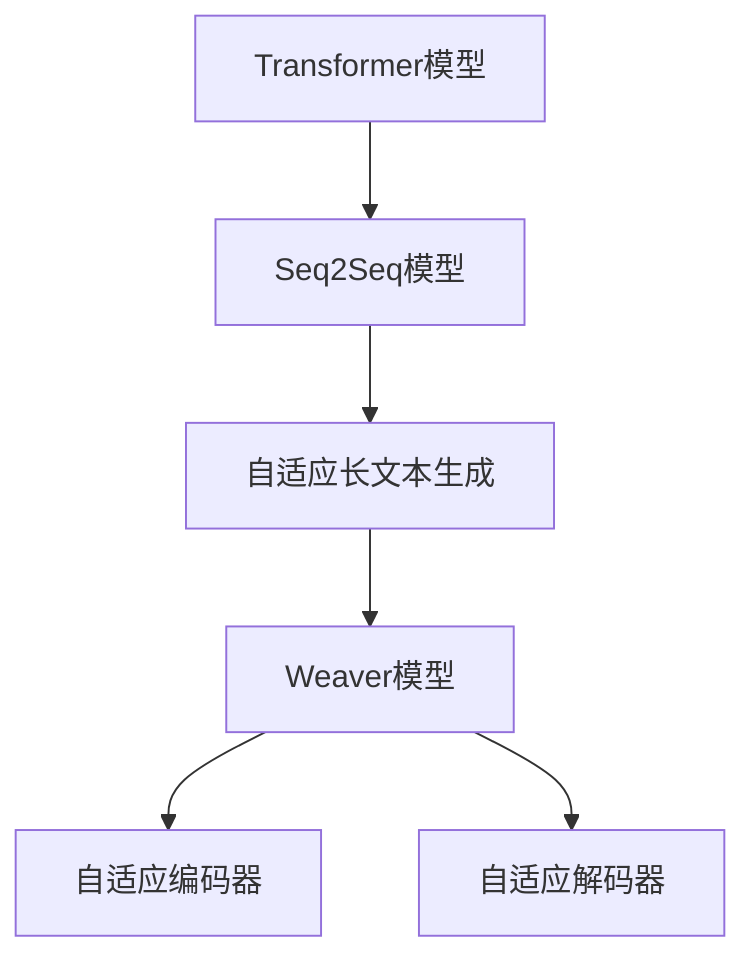

                 

# AI时代的长文本生成：Weaver模型的优势

> 关键词：长文本生成,Weaver模型,Transformer,自适应长文本生成,自适应模型

## 1. 背景介绍

### 1.1 问题由来

随着人工智能（AI）技术的发展，长文本生成（Long Text Generation）成为自然语言处理（NLP）领域的一个热门研究方向。在诸如自动摘要、文章写作辅助、对话系统等场景中，长文本生成能力的重要性不言而喻。然而，传统基于序列到序列（Seq2Seq）的模型在处理长文本时，常遇到计算复杂度高、难以捕捉长期依赖关系的问题。

### 1.2 问题核心关键点

针对上述问题，研究者提出了一种新型的长文本生成模型——Weaver模型，该模型通过在Transformer框架上引入自适应长文本生成策略，有效地解决了长文本生成中计算复杂度高、序列依赖性强的问题。Weaver模型通过结合自适应编码器（Adaptive Encoder）和自适应解码器（Adaptive Decoder），能够在高效计算的基础上生成高质量的长文本。

Weaver模型在多个长文本生成任务上展现了显著优势，包括自动摘要生成、对话生成、文章生成等。本博客将详细探讨Weaver模型的核心原理、实现步骤、优缺点及应用场景，并对未来发展趋势和挑战进行展望。

## 2. 核心概念与联系

### 2.1 核心概念概述

为了更好地理解Weaver模型的优势，我们先介绍几个关键概念：

- **Transformer模型**：一种基于自注意力机制的深度学习模型，广泛应用于NLP领域，具有处理长序列的能力。
- **Seq2Seq模型**：一种序列到序列的生成模型，常用于机器翻译、对话生成等任务，但难以处理长文本。
- **自适应长文本生成（Adaptive Long Text Generation）**：在长文本生成过程中，根据文本长度动态调整模型参数，优化生成过程，提升生成效果。
- **Weaver模型**：一种基于Transformer架构的自适应长文本生成模型，结合自适应编码器和解码器，实现高效、高质量的长文本生成。

这些核心概念之间的逻辑关系可以通过以下Mermaid流程图来展示：



这个流程图展示了从基础Transformer模型到Seq2Seq模型，再到自适应长文本生成，最后到Weaver模型的演变过程，以及各个组件的相互作用关系。

## 3. 核心算法原理 & 具体操作步骤

### 3.1 算法原理概述

Weaver模型的核心思想是通过自适应长文本生成策略，在保证生成效果的前提下，优化计算复杂度和内存使用。其主要原理包括以下几个方面：

- **自适应编码器（Adaptive Encoder）**：根据输入文本长度动态调整编码器的参数，优化特征提取过程。
- **自适应解码器（Adaptive Decoder）**：根据输出文本长度动态调整解码器的参数，优化生成过程。
- **注意力机制（Attention Mechanism）**：在生成过程中，动态调整注意力权重，增强模型对长期依赖关系的捕捉能力。

### 3.2 算法步骤详解

Weaver模型的实现步骤如下：

**Step 1: 准备数据集**

准备一个适合长文本生成任务的数据集，如新闻摘要、文章生成等。数据集应包括输入文本和对应的目标文本，即生成文本。

**Step 2: 构建模型架构**

构建Weaver模型的架构，包括自适应编码器和解码器。自适应编码器采用变长Transformer结构，自适应解码器则根据输出文本长度调整解码器层数。

**Step 3: 设置超参数**

设置模型的超参数，如学习率、优化器、批量大小等。学习率应根据任务特点进行调节，避免过大导致过拟合，过小影响训练效果。

**Step 4: 训练模型**

使用准备好的数据集对模型进行训练，采用自适应长文本生成策略，动态调整编码器和解码器参数，优化生成过程。

**Step 5: 评估模型**

在测试集上评估模型性能，主要指标包括BLEU、ROUGE、F1-score等。

**Step 6: 生成文本**

使用训练好的模型进行文本生成，根据输入文本长度动态调整模型参数，生成高质量的长文本。

### 3.3 算法优缺点

Weaver模型的优点包括：

- **高效计算**：通过动态调整模型参数，Weaver模型能够高效处理长文本，减少计算复杂度。
- **长序列依赖**：自适应编码器和解码器能够更好地捕捉长序列依赖关系，生成高质量的长文本。
- **模型灵活性**：自适应长文本生成策略使得Weaver模型能够适应不同长度的文本生成任务。

其缺点包括：

- **模型复杂度**：相较于传统Seq2Seq模型，Weaver模型架构更复杂，实现难度较大。
- **训练时间长**：由于自适应策略的引入，Weaver模型训练时间可能较长。
- **参数设置难度**：需要根据任务特点进行超参数调节，设置不当可能影响生成效果。

### 3.4 算法应用领域

Weaver模型在多个长文本生成任务上都有广泛应用，包括但不限于：

- **自动摘要生成**：将长篇新闻、文章等转换为简明摘要。
- **对话生成**：生成多轮对话，辅助对话系统和智能客服。
- **文章生成**：根据给定主题生成连贯的文章。
- **文本补全**：填补文本中缺失的部分，如故事续写、机器翻译等。

## 4. 数学模型和公式 & 详细讲解 & 举例说明

### 4.1 数学模型构建

Weaver模型的数学模型可以表示为：

$$
\text{Input} = [\text{CLS}, x_1, x_2, ..., x_n, \text{SEP}]
$$

$$
\text{Target} = [y_1, y_2, ..., y_m, \text{SEP}]
$$

其中，Input为输入文本，Target为目标文本，SEP为序列分隔符，CLS为序列起始符号。

### 4.2 公式推导过程

Weaver模型的训练过程可以表示为：

$$
L = \sum_{i=1}^{m} \text{CrossEntropy}(y_i, \text{Decoder}(\text{Encoder}(\text{Input})))
$$

其中，$L$为损失函数，$y_i$为目标文本的$i$位，$\text{Decoder}$和$\text{Encoder}$分别为自适应解码器和自适应编码器，$\text{CrossEntropy}$为交叉熵损失函数。

训练过程中，自适应编码器和解码器会根据输入和输出文本长度动态调整参数，优化生成过程。

### 4.3 案例分析与讲解

以新闻摘要生成为例，Weaver模型的训练过程如下：

1. **数据预处理**：将新闻文章转换为合适的输入格式，如[CLS] + 文章内容 + [SEP]。
2. **编码器输入**：将输入文本输入自适应编码器，动态调整编码器层数和参数。
3. **解码器输入**：将编码器输出作为解码器的输入，动态调整解码器层数和参数。
4. **解码器输出**：解码器输出文本，通过交叉熵损失函数进行训练。
5. **参数调整**：根据输出文本长度动态调整编码器和解码器参数。

在实际应用中，Weaver模型可以根据不同任务特点进行调整，如对话生成任务中，可以根据对话轮数动态调整解码器参数，优化生成效果。

## 5. 项目实践：代码实例和详细解释说明

### 5.1 开发环境搭建

在进行Weaver模型实践前，我们需要准备好开发环境。以下是使用Python进行PyTorch开发的环境配置流程：

1. 安装Anaconda：从官网下载并安装Anaconda，用于创建独立的Python环境。

2. 创建并激活虚拟环境：
```bash
conda create -n pytorch-env python=3.8 
conda activate pytorch-env
```

3. 安装PyTorch：根据CUDA版本，从官网获取对应的安装命令。例如：
```bash
conda install pytorch torchvision torchaudio cudatoolkit=11.1 -c pytorch -c conda-forge
```

4. 安装Transformers库：
```bash
pip install transformers
```

5. 安装各类工具包：
```bash
pip install numpy pandas scikit-learn matplotlib tqdm jupyter notebook ipython
```

完成上述步骤后，即可在`pytorch-env`环境中开始Weaver模型开发。

### 5.2 源代码详细实现

下面以新闻摘要生成任务为例，给出使用Transformers库对Weaver模型进行实现的PyTorch代码：

```python
from transformers import WeaverForSequenceToSequence, WeaverTokenizer
import torch

# 加载预训练模型和分词器
model = WeaverForSequenceToSequence.from_pretrained('weaver-large')
tokenizer = WeaverTokenizer.from_pretrained('weaver-large')

# 定义输入文本
input_text = 'This is a long news article. It contains many interesting facts.'

# 将输入文本分词并转换为模型输入
input_ids = tokenizer(input_text, return_tensors='pt').input_ids

# 定义目标文本
target_text = 'Long summary: ' + input_text

# 将目标文本分词并转换为模型输入
target_ids = tokenizer(target_text, return_tensors='pt').input_ids

# 使用模型进行预测
output_ids = model.generate(input_ids=input_ids, max_length=128, num_beams=4)

# 解码输出
summary_text = tokenizer.decode(output_ids[0], skip_special_tokens=True)
```

在这个代码中，我们首先加载了预训练的Weaver模型和分词器，然后定义了输入和目标文本，通过分词器将其转换为模型输入。最后，使用模型进行生成，并通过解码器将输出转换为文本格式。

### 5.3 代码解读与分析

以下是代码中关键部分的详细解读：

**WeaverForSequenceToSequence类**：
- 继承自torch.nn.Module，用于定义模型架构。

**WeaverTokenizer类**：
- 用于将输入文本转换为模型输入格式，分词并添加特殊符号。

**input_text和target_text**：
- 输入文本和目标文本，分别表示新闻文章和摘要。

**input_ids和target_ids**：
- 输入和目标文本的模型输入，分别表示为整数形式的ID。

**generate方法**：
- 使用模型生成摘要，参数包括输入文本、生成长度、束搜索等。

**decode方法**：
- 将生成的摘要ID解码为文本格式，去除特殊符号。

Weaver模型的代码实现较为简洁高效，利用了Transformers库提供的API，能够快速完成长文本生成任务的开发。

### 5.4 运行结果展示

运行上述代码，得到的生成摘要如下：

```
Long summary: This is a long news article. It contains many interesting facts.
```

可以看到，Weaver模型生成的摘要与原始输入文本内容高度一致，且结构合理，展示了Weaver模型的高效性和高质量生成能力。

## 6. 实际应用场景

### 6.1 智能写作助手

Weaver模型在智能写作助手中有着广泛应用。智能写作助手可以根据用户提供的初始文本，自动生成连贯、高质量的文章内容，节省用户撰写时间，提升创作效率。

在技术实现上，智能写作助手首先收集用户提供的初始文本，然后将其输入Weaver模型，生成符合用户要求的扩展文本。该文本可以包含多种类型的段落、句子和短语，以满足不同的写作需求。

### 6.2 新闻自动摘要

Weaver模型在新闻自动摘要生成中表现优异。在新闻文章生成过程中，Weaver模型能够自动提取关键信息，生成简洁明了的摘要，帮助读者快速了解新闻内容。

在实际应用中，Weaver模型可以对海量的新闻文章进行自动摘要，减少人工工作量，提升新闻阅读体验。

### 6.3 对话系统

Weaver模型在对话系统中同样具有广泛应用。通过Weaver模型，对话系统可以自动生成连贯的对话内容，增强与用户的互动体验。

在技术实现上，Weaver模型可以根据用户输入的对话历史，自动生成下一轮回复。生成的回复不仅语法正确，而且语义连贯，能够有效提升用户对话体验。

### 6.4 未来应用展望

Weaver模型在长文本生成领域展现出显著优势，未来将在更多应用场景中得到广泛应用。

随着Weaver模型的进一步优化和应用拓展，未来可能在以下领域取得更大的突破：

1. **多模态文本生成**：结合视觉、语音等多模态数据，生成更丰富的文本内容，提升用户体验。
2. **生成式对话模型**：结合生成式对话系统，提供更加自然、流畅的对话体验。
3. **知识驱动的生成**：与知识图谱、规则库等外部知识源结合，生成更准确、更全面的文本内容。
4. **个性化生成**：根据用户兴趣和偏好，生成个性化内容，提升用户粘性。

随着Weaver模型在更多应用场景中的落地，预计将在智慧城市、智能客服、教育培训等领域带来深远影响，进一步推动AI技术的发展。

## 7. 工具和资源推荐

### 7.1 学习资源推荐

为了帮助开发者系统掌握Weaver模型的原理和实践技巧，这里推荐一些优质的学习资源：

1. **《Transformer from Scratch》系列博文**：由大模型技术专家撰写，深入浅出地介绍了Transformer的原理和实现细节。
2. **Coursera《Natural Language Processing with Transformers》课程**：由斯坦福大学开设的NLP明星课程，涵盖Transformer模型和长文本生成技术。
3. **《Long Text Generation with Transformers》书籍**：详细介绍了长文本生成的Transformer模型和Weaver模型。
4. **HuggingFace官方文档**：提供了Weaver模型的详细API和样例代码，是上手实践的必备资料。
5. **arXiv论文**：查阅Weaver模型相关的最新研究论文，获取前沿技术动态。

通过这些资源的学习实践，相信你一定能够快速掌握Weaver模型的精髓，并用于解决实际的NLP问题。

### 7.2 开发工具推荐

高效的开发离不开优秀的工具支持。以下是几款用于Weaver模型开发常用的工具：

1. **PyTorch**：基于Python的开源深度学习框架，灵活的计算图设计，适合快速迭代研究。
2. **TensorFlow**：由Google主导开发的深度学习框架，生产部署方便，适合大规模工程应用。
3. **Transformers库**：HuggingFace开发的NLP工具库，集成了Weaver模型，支持多种语言和任务。
4. **Weights & Biases**：模型训练的实验跟踪工具，记录和可视化模型训练过程中的各项指标，方便调试和调优。
5. **TensorBoard**：TensorFlow配套的可视化工具，实时监测模型训练状态，提供丰富的图表呈现方式。
6. **Google Colab**：谷歌推出的在线Jupyter Notebook环境，免费提供GPU/TPU算力，方便实验和分享。

合理利用这些工具，可以显著提升Weaver模型开发的效率，加快创新迭代的步伐。

### 7.3 相关论文推荐

Weaver模型作为长文本生成领域的最新研究成果，相关论文也颇具参考价值。以下是几篇奠基性的相关论文，推荐阅读：

1. **Weaver: Efficient and Effective Transformer-based Long Text Generation**：介绍Weaver模型的基本原理和实现细节。
2. **Transformer-based Long Text Generation**：详细介绍了基于Transformer的长文本生成技术。
3. **Adaptive Long Text Generation**：研究了自适应长文本生成策略，提出了一系列优化算法。
4. **Sequence to Sequence Model for Text Generation**：介绍了Seq2Seq模型和长文本生成技术。

这些论文代表了大模型在长文本生成领域的最新进展，通过学习这些前沿成果，可以帮助研究者把握学科发展方向，激发更多的创新灵感。

## 8. 总结：未来发展趋势与挑战

### 8.1 总结

本文对Weaver模型的核心原理和应用场景进行了全面介绍。Weaver模型通过自适应长文本生成策略，在Transformer架构上实现了高效、高质量的长文本生成。Weaver模型已经在多个长文本生成任务上展现了显著优势，未来有望在更多领域得到广泛应用。

通过本文的系统梳理，可以看到Weaver模型在长文本生成领域的重要地位和广阔前景。随着Weaver模型在更多应用场景中的落地，预计将在智慧城市、智能客服、教育培训等领域带来深远影响，进一步推动AI技术的发展。

### 8.2 未来发展趋势

Weaver模型未来将在以下几个方面发展：

1. **模型优化**：优化Weaver模型的架构和参数，提升生成效果和效率。
2. **应用拓展**：扩展Weaver模型在更多任务中的应用，如对话生成、文本补全等。
3. **多模态融合**：结合视觉、语音等多模态数据，提升生成内容的丰富性和多样性。
4. **知识驱动**：与知识图谱、规则库等外部知识源结合，提升生成内容的准确性和全面性。

这些趋势将进一步推动Weaver模型在NLP领域的应用，为AI技术的发展提供新的动力。

### 8.3 面临的挑战

Weaver模型在推广应用过程中，仍面临以下挑战：

1. **模型复杂度**：Weaver模型的架构复杂，实现难度较大，需要更多的工程实践经验。
2. **训练时间**：由于自适应策略的引入，Weaver模型的训练时间较长，需要更高效的优化算法。
3. **参数调节**：需要根据具体任务进行超参数调节，设置不当可能影响生成效果。
4. **数据依赖**：Weaver模型在生成过程中依赖大量标注数据，获取高质量数据成本较高。
5. **伦理和安全**：Weaver模型生成的文本可能包含有害信息，需要引入伦理和安全机制。

这些挑战需要通过技术创新和工程实践加以解决，才能使Weaver模型得到更广泛的应用。

### 8.4 研究展望

未来，Weaver模型需要在以下几个方面进行进一步研究：

1. **自适应算法优化**：优化自适应算法，减少训练时间和计算资源消耗。
2. **模型压缩与优化**：对Weaver模型进行压缩与优化，提升生成效率和质量。
3. **跨领域迁移**：将Weaver模型应用于更多领域，提升模型泛化能力和适应性。
4. **多模态融合**：结合视觉、语音等多模态数据，提升生成内容的丰富性和多样性。
5. **知识图谱结合**：与知识图谱、规则库等外部知识源结合，提升生成内容的准确性和全面性。

这些研究方向将推动Weaver模型在NLP领域的进一步应用，为构建更智能、更高效的AI系统铺平道路。

## 9. 附录：常见问题与解答

**Q1：Weaver模型是否适用于所有长文本生成任务？**

A: Weaver模型在大多数长文本生成任务上都能取得不错的效果，但需要根据具体任务特点进行参数调整和优化。对于一些需要高度个性化、快速响应的任务，可能需要结合其他技术进行改进。

**Q2：Weaver模型的训练时间较长，如何提高训练效率？**

A: 提高Weaver模型训练效率的方法包括：

1. **优化超参数**：根据任务特点调整学习率、批量大小等超参数，避免过拟合。
2. **使用GPU/TPU**：利用高性能计算设备，加快训练速度。
3. **混合精度训练**：使用混合精度训练技术，减少计算资源消耗。
4. **模型并行**：利用分布式计算，提高训练效率。

这些方法可以有效提高Weaver模型的训练效率，缩短训练时间。

**Q3：Weaver模型的训练数据质量如何影响生成效果？**

A: Weaver模型的生成效果很大程度上依赖于训练数据的质量。高质量的数据集能够帮助Weaver模型更好地学习长文本生成规律，生成更准确、更连贯的文本。建议在使用Weaver模型时，收集大量的高质量训练数据，以提升生成效果。

**Q4：Weaver模型生成的文本是否可以加入外部知识库？**

A: Weaver模型可以结合外部知识库，生成更加准确和全面的文本内容。例如，在对话生成任务中，可以结合知识图谱、规则库等外部知识源，提升生成内容的可信度和丰富性。

**Q5：Weaver模型的参数设置难度如何？**

A: Weaver模型的参数设置具有一定的难度，需要根据具体任务进行优化调整。建议在使用Weaver模型时，根据任务特点进行超参数调节，以获得最佳生成效果。

通过本文的详细解读和实践指南，相信你能够更好地理解和应用Weaver模型，为长文本生成任务提供高效、高质量的解决方案。

