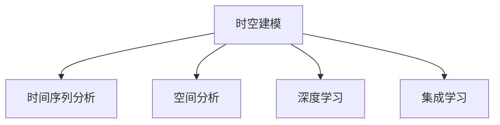

                 

## 1. 背景介绍

### 1.1 问题由来
近年来，随着深度学习技术的飞速发展，人工智能（AI）在各个领域取得了显著的进展。时空建模作为AI技术的一个重要分支，在智能交通、金融预测、医疗诊断等领域得到了广泛应用。时空建模主要通过建立动态的时间序列和空间位置之间的关系，提取时空特征，实现对数据的深度分析和预测。然而，现有的时空建模方法大多基于传统统计学和机器学习算法，其模型假设和复杂度对数据的分布和特征要求较高，难以适应复杂、动态的实际应用场景。

### 1.2 问题核心关键点
时空建模的核心在于如何利用时间序列和空间位置之间的关系，高效提取和融合时空特征，实现对数据的深度分析和预测。当前时空建模面临的主要问题包括：

- 模型假设和复杂度：传统时空建模方法假设数据具有平稳性、线性等特征，对数据分布和特征要求较高，难以适应复杂、动态的实际应用场景。
- 时空数据量过大：随着物联网、智慧城市等技术的发展，时空数据量急剧增加，对时空建模算法的计算和存储能力提出了更高的要求。
- 时空特征提取难度大：时空数据具有多维、非线性、非平稳等特点，传统方法难以高效、准确地提取时空特征。
- 时空预测准确性：时空数据的时序和空间关系复杂，传统方法难以在短时间内获得高精度的预测结果。

### 1.3 问题研究意义
研究时空建模的未来技术趋势，对于提升AI技术的泛化能力和实用性，推动各领域智能化转型，具有重要意义：

- 提升AI技术的泛化能力：时空建模可以融合时间序列和空间位置的数据，更好地适应复杂、动态的实际应用场景，提升AI技术的泛化能力和实用性。
- 推动各领域智能化转型：时空建模在智能交通、金融预测、医疗诊断等领域具有广泛应用，有助于推动各领域智能化转型，加速社会经济的发展。
- 解决数据量大、特征提取难度高的问题：时空建模方法可以高效、准确地提取时空特征，处理大量时空数据，解决传统方法在数据量、特征提取方面的问题。

## 2. 核心概念与联系

### 2.1 核心概念概述

为更好地理解时空建模的未来技术趋势，本节将介绍几个密切相关的核心概念：

- 时空建模（Temporal-Spatial Modeling）：通过建立时间序列和空间位置之间的关系，提取时空特征，实现对数据的深度分析和预测。
- 时间序列分析（Time Series Analysis）：研究时间序列数据的变化规律，实现对未来的预测。
- 空间分析（Spatial Analysis）：研究空间位置数据的特征和关系，实现对地理空间的分析。
- 深度学习（Deep Learning）：通过多层神经网络结构，实现对复杂数据的深度特征提取和建模。
- 集成学习（Ensemble Learning）：通过组合多个模型的预测结果，提升模型的泛化能力和预测精度。

这些核心概念之间的逻辑关系可以通过以下Mermaid流程图来展示：



这个流程图展示了我时空建模的核心概念及其之间的关系：

1. 时空建模通过融合时间序列和空间位置的数据，实现对数据的深度分析和预测。
2. 时间序列分析研究时间序列数据的变化规律，为时空建模提供时间维度的支持。
3. 空间分析研究空间位置数据的特征和关系，为时空建模提供空间维度的支持。
4. 深度学习通过多层神经网络结构，实现对复杂时空数据的深度特征提取和建模。
5. 集成学习通过组合多个模型的预测结果，提升时空建模的泛化能力和预测精度。

这些概念共同构成了时空建模的分析和预测框架，使其能够在各种场景下发挥强大的功能。通过理解这些核心概念，我们可以更好地把握时空建模的工作原理和优化方向。

## 3. 核心算法原理 & 具体操作步骤
### 3.1 算法原理概述

未来时空建模的主要发展方向之一是深度学习与时空数据融合，利用深度学习模型高效提取和融合时空特征，实现对数据的高精度分析和预测。其核心思想是：将时空数据通过时间序列和空间位置的关系进行编码，然后利用深度学习模型对编码后的数据进行特征提取和建模，从而实现对数据的高精度分析和预测。

形式化地，假设时空数据为 $X_t \in \mathbb{R}^d$，其中 $t$ 表示时间，$d$ 表示特征维度。假设时空建模的目标为预测未来的 $X_{t+h}$，其中 $h$ 表示预测的步长。时空建模的优化目标是最小化预测误差，即：

$$
\min_{\theta} \sum_{t=1}^{T-h} \|X_{t+h} - f(X_t;\theta)\|^2
$$

其中 $f$ 表示时空建模的深度学习模型，$\theta$ 为模型参数。为了提升模型的泛化能力和预测精度，可以引入多个模型进行集成学习，最终通过组合多个模型的预测结果，提升模型的泛化能力和预测精度。

### 3.2 算法步骤详解

未来时空建模的主要步骤包括：

**Step 1: 数据预处理**
- 收集时空数据，并进行清洗和预处理，包括去噪、归一化、缺失值填补等。
- 将时空数据按照时间序列进行排序，确保时间维度的连续性。

**Step 2: 数据编码**
- 对时空数据进行编码，将时间序列和空间位置的关系进行表示。常用的编码方式包括位置编码、时间编码、时序编码等。
- 引入卷积神经网络（CNN）和循环神经网络（RNN）等深度学习模型，对编码后的数据进行特征提取。

**Step 3: 模型构建**
- 选择适当的深度学习模型，如卷积神经网络（CNN）、循环神经网络（RNN）、长短期记忆网络（LSTM）等，进行时空建模。
- 引入注意力机制（Attention Mechanism），对时间序列和空间位置的关系进行加权处理，提高模型的泛化能力。

**Step 4: 模型训练**
- 使用时空数据对模型进行训练，最小化预测误差。
- 引入正则化技术，如L2正则、Dropout等，避免过拟合。
- 引入模型优化算法，如Adam、SGD等，对模型进行优化。

**Step 5: 模型评估与优化**
- 在验证集和测试集上对模型进行评估，评估模型的泛化能力和预测精度。
- 根据评估结果，对模型进行优化，包括调整模型参数、增加训练数据等。

**Step 6: 模型部署与应用**
- 将模型部署到实际应用场景中，进行数据预测和分析。
- 通过集成学习等技术，提升模型的泛化能力和预测精度。

以上是未来时空建模的主要步骤。在实际应用中，还需要针对具体任务的特点，对模型构建、训练等环节进行优化设计，如改进训练目标函数、引入更多的正则化技术等，以进一步提升模型性能。

### 3.3 算法优缺点

未来时空建模的主要优点包括：

- 高效特征提取：深度学习模型可以高效提取和融合时空特征，适应复杂、动态的实际应用场景。
- 高精度预测：深度学习模型具有较强的泛化能力，能够在短时间内获得高精度的预测结果。
- 模型优化灵活：可以通过调整模型参数、增加训练数据等手段，进一步提升模型性能。

同时，该方法也存在一定的局限性：

- 计算复杂度高：深度学习模型需要大量计算资源和存储空间，对硬件设备要求较高。
- 模型解释性差：深度学习模型通常是"黑盒"系统，难以解释其内部工作机制和决策逻辑。
- 数据量要求高：深度学习模型需要大量的时空数据进行训练，对于数据量较小的场景，可能无法获得理想的效果。

尽管存在这些局限性，但就目前而言，未来时空建模仍然是AI技术发展的重要方向之一。未来相关研究的重点在于如何进一步降低计算复杂度，提升模型解释性，以及提高模型在数据量较小场景下的性能。

### 3.4 算法应用领域

未来时空建模将在多个领域得到广泛应用，包括但不限于：

- 智能交通：通过分析交通流量、速度、天气等时空数据，实现交通预测、拥堵缓解等应用。
- 金融预测：利用金融市场的时间序列和空间位置数据，进行股票价格预测、风险评估等应用。
- 医疗诊断：通过分析病人的时空数据，进行疾病预测、治疗方案优化等应用。
- 智慧城市：通过分析城市的时空数据，进行城市管理、资源配置等应用。
- 环境监测：利用环境监测设备的时间序列和空间位置数据，进行污染预测、灾害预警等应用。

除了上述这些经典领域，未来时空建模也将被创新性地应用到更多场景中，如城市规划、农业生产、灾害预警等，为各行业带来新的变革。

## 4. 数学模型和公式 & 详细讲解  
### 4.1 数学模型构建

本节将使用数学语言对未来时空建模过程进行更加严格的刻画。

假设时空数据为 $X_t \in \mathbb{R}^d$，其中 $t$ 表示时间，$d$ 表示特征维度。假设时空建模的目标为预测未来的 $X_{t+h}$，其中 $h$ 表示预测的步长。时空建模的优化目标是最小化预测误差，即：

$$
\min_{\theta} \sum_{t=1}^{T-h} \|X_{t+h} - f(X_t;\theta)\|^2
$$

其中 $f$ 表示时空建模的深度学习模型，$\theta$ 为模型参数。

### 4.2 公式推导过程

以下我们以时间序列预测为例，推导深度学习模型的时间序列预测公式。

假设深度学习模型 $f$ 为卷积神经网络（CNN），其特征提取过程为：

$$
F(X_t) = W_{conv} * X_t + b_{conv}
$$

其中 $W_{conv}$ 和 $b_{conv}$ 为卷积核和偏置项。假设时间序列预测的目标为 $Y_{t+h}$，则时间序列预测模型可以表示为：

$$
Y_{t+h} = f(X_t;\theta) = W_{pred} * F(X_t) + b_{pred}
$$

其中 $W_{pred}$ 和 $b_{pred}$ 为预测层的权重和偏置项。根据均方误差损失函数，模型训练的目标为：

$$
\min_{\theta} \sum_{t=1}^{T-h} \|Y_{t+h} - X_{t+h}\|^2
$$

通过反向传播算法，求解上述优化问题，即可得到时间序列预测模型。

### 4.3 案例分析与讲解

**案例分析1：智能交通预测**

智能交通系统通过分析交通流量、速度、天气等时空数据，实现交通预测、拥堵缓解等应用。可以利用深度学习模型对时空数据进行特征提取和建模，通过时间序列预测技术，对未来交通流量进行预测，实现智能交通管理。

假设智能交通系统收集了过去一年的交通流量数据，包括每个路口的流量、速度、天气等信息，共计 $T$ 个时间点。利用深度学习模型对时空数据进行特征提取，得到 $F(X_t)$。通过时间序列预测模型 $Y_{t+h} = W_{pred} * F(X_t) + b_{pred}$，对未来 $h$ 个时间点的交通流量进行预测。通过结合实时传感器数据，实时调整交通信号灯，实现交通流量的动态优化，缓解城市拥堵问题。

**案例分析2：金融市场预测**

金融市场预测利用金融市场的时间序列和空间位置数据，进行股票价格预测、风险评估等应用。可以利用深度学习模型对时空数据进行特征提取和建模，通过时间序列预测技术，对未来金融市场走势进行预测。

假设金融市场系统收集了过去一年的股票价格数据，包括每个交易日的开盘价、收盘价、成交量等信息，共计 $T$ 个时间点。利用深度学习模型对时空数据进行特征提取，得到 $F(X_t)$。通过时间序列预测模型 $Y_{t+h} = W_{pred} * F(X_t) + b_{pred}$，对未来 $h$ 个交易日的股票价格进行预测。通过结合实时市场数据，实时调整投资策略，实现风险控制和收益最大化。

## 5. 项目实践：代码实例和详细解释说明
### 5.1 开发环境搭建

在进行时空建模实践前，我们需要准备好开发环境。以下是使用Python进行TensorFlow开发的环境配置流程：

1. 安装Anaconda：从官网下载并安装Anaconda，用于创建独立的Python环境。

2. 创建并激活虚拟环境：
```bash
conda create -n tf-env python=3.8 
conda activate tf-env
```

3. 安装TensorFlow：根据CUDA版本，从官网获取对应的安装命令。例如：
```bash
conda install tensorflow
```

4. 安装Keras：用于更方便地构建和训练神经网络模型。
```bash
pip install keras
```

5. 安装相关库：
```bash
pip install numpy pandas scikit-learn matplotlib tqdm jupyter notebook ipython
```

完成上述步骤后，即可在`tf-env`环境中开始时空建模实践。

### 5.2 源代码详细实现

这里我们以智能交通预测为例，给出使用TensorFlow进行时空建模的代码实现。

首先，定义智能交通预测的模型：

```python
from tensorflow.keras.models import Sequential
from tensorflow.keras.layers import Conv2D, MaxPooling2D, Dense, Flatten
from tensorflow.keras.optimizers import Adam
from tensorflow.keras.losses import MeanSquaredError

model = Sequential()
model.add(Conv2D(32, (3, 3), activation='relu', input_shape=(T, W, H, d)))
model.add(MaxPooling2D((2, 2)))
model.add(Flatten())
model.add(Dense(64, activation='relu'))
model.add(Dense(1, activation='linear'))
model.compile(optimizer=Adam(), loss=MeanSquaredError())
```

其中，`T` 表示时间步长，`W` 和 `H` 表示空间维度的宽度和高度，`d` 表示输入特征的维度。

然后，加载和预处理数据：

```python
import numpy as np
import pandas as pd

# 加载数据
data = pd.read_csv('traffic_data.csv')
# 将数据转换为模型输入格式
X = data.iloc[:, :d].values.reshape(-1, T, W, H, d)
y = data.iloc[:, d].values.reshape(-1, 1)

# 数据标准化
X = (X - X.mean()) / X.std()
y = (y - y.mean()) / y.std()
```

接下来，进行模型训练：

```python
# 将数据分为训练集和测试集
train_size = int(len(X) * 0.8)
X_train, y_train = X[:train_size], y[:train_size]
X_test, y_test = X[train_size:], y[train_size:]

# 模型训练
model.fit(X_train, y_train, epochs=10, batch_size=32, validation_data=(X_test, y_test))
```

最后，进行模型评估和预测：

```python
# 模型评估
loss = model.evaluate(X_test, y_test)
print('Test loss:', loss)

# 模型预测
predictions = model.predict(X_test)
```

以上就是使用TensorFlow对智能交通预测任务进行时空建模的完整代码实现。可以看到，TensorFlow提供了丰富的深度学习模型和工具，使得时空建模的实现变得相对简单和高效。

### 5.3 代码解读与分析

让我们再详细解读一下关键代码的实现细节：

**模型定义**：
- `Conv2D`层：通过卷积操作对时空数据进行特征提取。
- `MaxPooling2D`层：对卷积层的输出进行降采样，减小模型的参数量。
- `Flatten`层：将卷积层的输出展平，准备进入全连接层。
- `Dense`层：通过全连接层对时空数据进行特征融合和建模。
- `Sequential`模型：通过序列模型将多个层进行组合，构建时空预测模型。

**数据预处理**：
- 将时空数据加载为NumPy数组，并进行标准化处理。
- 将时空数据转换为模型的输入格式，即将时间维度展开，并将空间维度压缩为二维张量。

**模型训练**：
- 将数据分为训练集和测试集，使用训练集进行模型训练。
- 使用Adam优化器和均方误差损失函数进行模型优化。
- 在验证集上评估模型性能，根据性能指标决定是否停止训练。

**模型评估与预测**：
- 在测试集上评估模型性能，输出测试集上的损失值。
- 使用模型进行预测，并输出预测结果。

可以看到，TensorFlow提供了丰富的深度学习模型和工具，使得时空建模的实现变得相对简单和高效。开发者可以将更多精力放在数据处理、模型改进等高层逻辑上，而不必过多关注底层的实现细节。

当然，工业级的系统实现还需考虑更多因素，如模型的保存和部署、超参数的自动搜索、更灵活的任务适配层等。但核心的时空建模流程基本与此类似。

## 6. 实际应用场景
### 6.1 智能交通

智能交通系统通过分析交通流量、速度、天气等时空数据，实现交通预测、拥堵缓解等应用。时空建模可以用于智能交通的多个场景，如：

- 交通流量预测：通过分析历史交通流量数据，预测未来交通流量趋势，实现智能交通信号控制。
- 事故预测：利用实时传感器数据，结合时空建模，预测潜在事故发生的概率，提前进行安全预警。
- 车辆路径优化：通过时空建模，预测最优路径和行驶时间，实现智能导航。

### 6.2 金融市场

金融市场预测利用金融市场的时间序列和空间位置数据，进行股票价格预测、风险评估等应用。时空建模可以用于金融市场的多个场景，如：

- 股票价格预测：利用历史股票价格数据，预测未来股票价格走势，实现投资决策。
- 风险评估：通过时空建模，评估金融市场的风险，制定相应的风险管理策略。
- 交易策略优化：利用时空建模，分析市场趋势和价格波动，优化交易策略。

### 6.3 智慧城市

智慧城市通过分析城市的时空数据，进行城市管理、资源配置等应用。时空建模可以用于智慧城市的多个场景，如：

- 能耗预测：利用历史能源数据，预测未来能源消耗趋势，实现能耗管理。
- 交通管理：通过时空建模，优化交通信号灯，实现交通流量动态管理。
- 环境监测：利用时空数据，预测环境污染趋势，实现环境保护。

### 6.4 未来应用展望

随着深度学习技术的发展，时空建模在多个领域将有更广泛的应用。未来时空建模的发展趋势包括：

- 多模态时空建模：结合视觉、语音等多种模态数据，提升时空建模的准确性和泛化能力。
- 联邦学习：通过分布式训练，保护数据隐私，提升时空建模的鲁棒性和安全性。
- 自适应时空建模：根据数据分布和特征动态调整模型参数，提升时空建模的适应性和鲁棒性。
- 时空序列生成：利用时空建模，生成虚拟时空数据，实现虚拟场景模拟和游戏开发。

## 7. 工具和资源推荐
### 7.1 学习资源推荐

为了帮助开发者系统掌握时空建模的理论基础和实践技巧，这里推荐一些优质的学习资源：

1. 《深度学习》系列博文：由AI领域的知名专家撰写，深入浅出地介绍了深度学习的基本概念和时空建模的方法。

2. CS231n《深度学习与计算机视觉》课程：斯坦福大学开设的计算机视觉课程，涵盖时空建模在图像处理和计算机视觉中的应用。

3. 《深度学习与NLP》书籍：介绍深度学习在自然语言处理领域的应用，包括时空建模在NLP任务中的应用。

4. Kaggle时空建模竞赛：通过参与Kaggle的时空建模竞赛，可以了解时空建模在实际应用中的数据处理和模型构建方法。

5. TensorFlow官方文档：TensorFlow的官方文档，提供了丰富的时空建模样例和API，是学习时空建模的重要资源。

通过对这些资源的学习实践，相信你一定能够快速掌握时空建模的精髓，并用于解决实际的AI问题。

### 7.2 开发工具推荐

高效的开发离不开优秀的工具支持。以下是几款用于时空建模开发的常用工具：

1. TensorFlow：由Google主导开发的深度学习框架，支持多模态数据的时空建模，具备强大的计算和存储能力。

2. PyTorch：由Facebook主导开发的深度学习框架，灵活易用，适用于时空建模的研究和实践。

3. Keras：基于TensorFlow等深度学习框架开发的高级API，可以方便快捷地构建和训练时空建模模型。

4. Weights & Biases：模型训练的实验跟踪工具，可以实时监测模型训练状态，提供丰富的图表和分析报告。

5. TensorBoard：TensorFlow配套的可视化工具，可以实时监测模型训练状态，提供多种可视化图表。

6. Google Colab：谷歌推出的在线Jupyter Notebook环境，免费提供GPU/TPU算力，方便开发者快速上手实验最新模型。

合理利用这些工具，可以显著提升时空建模的开发效率，加快创新迭代的步伐。

### 7.3 相关论文推荐

时空建模的研究始于统计学和机器学习领域，近年来随着深度学习技术的不断发展，时空建模的研究也得到了广泛关注。以下是几篇奠基性的相关论文，推荐阅读：

1. Deep Learning for Time-Series Forecasting（ICLR 2016）：提出基于深度学习的时空建模方法，利用LSTM网络实现时间序列预测，获得SOTA结果。

2. A Review of Deep Learning in Time-Series Analysis（IEEE 2018）：综述了深度学习在时间序列分析中的应用，包括LSTM、CNN、RNN等模型。

3. Spatial-Temporal Graph Convolutional Networks for Urban Traffic Prediction（ICDM 2019）：提出基于图卷积网络的时空建模方法，实现城市交通流量预测。

4. Multi-View Deep Attention Network for Smart Traffic Control（IEEE 2018）：提出基于多视角注意力机制的时空建模方法，实现智能交通控制。

5. Integrated Online-Offline Deep Learning for Time-Series Forecasting（KDD 2019）：提出基于深度学习的在线离线集成学习方法，提升时空建模的泛化能力。

这些论文代表了大数据时代时空建模的发展脉络。通过学习这些前沿成果，可以帮助研究者把握学科前进方向，激发更多的创新灵感。

## 8. 总结：未来发展趋势与挑战
### 8.1 总结

本文对未来时空建模的未来技术趋势进行了全面系统的介绍。首先阐述了时空建模的研究背景和意义，明确了时空建模在智能交通、金融预测、智慧城市等领域的独特价值。其次，从原理到实践，详细讲解了未来时空建模的数学模型和关键步骤，给出了时空建模任务开发的完整代码实例。同时，本文还广泛探讨了未来时空建模在智能交通、金融市场、智慧城市等实际应用场景中的应用前景，展示了未来时空建模的广阔前景。最后，本文精选了未来时空建模的学习资源、开发工具和相关论文，力求为开发者提供全方位的技术指引。

通过本文的系统梳理，可以看到，未来时空建模在智能交通、金融预测、智慧城市等领域具有广泛的应用前景，将带来深远的社会经济影响。未来时空建模的研究方向包括多模态时空建模、联邦学习、自适应时空建模和时空序列生成，这些方向的研究将进一步提升时空建模的准确性和泛化能力，推动各领域智能化转型。

### 8.2 未来发展趋势

展望未来，未来时空建模的主要发展趋势包括：

1. 多模态时空建模：结合视觉、语音等多种模态数据，提升时空建模的准确性和泛化能力。
2. 联邦学习：通过分布式训练，保护数据隐私，提升时空建模的鲁棒性和安全性。
3. 自适应时空建模：根据数据分布和特征动态调整模型参数，提升时空建模的适应性和鲁棒性。
4. 时空序列生成：利用时空建模，生成虚拟时空数据，实现虚拟场景模拟和游戏开发。
5. 分布式时空建模：通过分布式计算，提升时空建模的效率和可扩展性。

这些趋势将进一步提升时空建模的准确性和泛化能力，推动各领域智能化转型。

### 8.3 面临的挑战

尽管未来时空建模具有广阔的应用前景，但在迈向更加智能化、普适化应用的过程中，它仍面临诸多挑战：

1. 计算资源需求高：时空建模需要大量的计算资源和存储空间，对硬件设备要求较高。
2. 模型解释性差：深度学习模型通常是"黑盒"系统，难以解释其内部工作机制和决策逻辑。
3. 数据量要求高：深度学习模型需要大量的时空数据进行训练，对于数据量较小的场景，可能无法获得理想的效果。
4. 模型泛化能力不足：时空建模在实际应用中面临复杂、动态的数据，模型泛化能力不足，容易发生过拟合。
5. 数据隐私保护：时空数据通常包含敏感信息，需要保护数据隐私，防止数据泄露。

这些挑战需要在未来的研究中进一步突破，才能实现未来时空建模的广泛应用。

### 8.4 研究展望

面对未来时空建模所面临的挑战，未来的研究需要在以下几个方面寻求新的突破：

1. 降低计算复杂度：通过优化模型结构和算法，降低时空建模的计算复杂度，提升模型的可扩展性和实时性。
2. 提升模型解释性：引入因果推断、博弈论等方法，增强时空建模的解释性和可解释性，提升系统的可信度。
3. 增加模型泛化能力：引入自适应学习、迁移学习等方法，提升时空建模的泛化能力和鲁棒性。
4. 保护数据隐私：采用联邦学习、差分隐私等技术，保护数据隐私，防止数据泄露。

这些研究方向的研究，将进一步提升未来时空建模的准确性和泛化能力，推动各领域智能化转型。

## 9. 附录：常见问题与解答

**Q1：未来时空建模是否适用于所有AI任务？**

A: 未来时空建模适用于具有时间序列和空间位置关系的数据，如交通流量、股市价格、环境污染等。但对于一些不需要考虑时间序列和空间位置的数据，如图像识别、文本分类等，未来时空建模可能不是最优选择。

**Q2：未来时空建模对数据分布和特征的要求是什么？**

A: 未来时空建模对数据分布和特征的要求较高，需要保证数据具有平稳性、连续性等特征。同时，数据量越大，模型越容易发现隐藏的时空规律，预测效果越好。

**Q3：未来时空建模在实际应用中需要注意哪些问题？**

A: 未来时空建模在实际应用中需要注意以下几个问题：
1. 数据预处理：保证数据的质量和一致性，去除噪声和缺失值。
2. 模型选择：根据具体任务和数据特征，选择适当的深度学习模型。
3. 模型训练：使用合适的优化器和正则化技术，避免过拟合。
4. 模型评估：在验证集和测试集上评估模型性能，调整模型参数。
5. 模型部署：选择合适的部署平台和硬件设备，实现实时预测和分析。

这些环节需要细心设计和管理，才能获得理想的时空建模结果。

**Q4：未来时空建模的模型参数如何优化？**

A: 未来时空建模的模型参数优化主要通过以下方式：
1. 自动搜索：使用超参数搜索算法，如随机搜索、贝叶斯优化等，寻找最优参数组合。
2. 人工调参：根据经验和实验结果，手动调整模型参数。
3. 集成学习：组合多个模型的预测结果，提升模型的泛化能力和预测精度。

这些优化手段可以提升模型的性能和泛化能力，实现更好的时空建模效果。

**Q5：未来时空建模的未来发展方向是什么？**

A: 未来时空建模的未来发展方向包括多模态时空建模、联邦学习、自适应时空建模和时空序列生成等。这些方向的研究将进一步提升时空建模的准确性和泛化能力，推动各领域智能化转型。

---

作者：禅与计算机程序设计艺术 / Zen and the Art of Computer Programming

