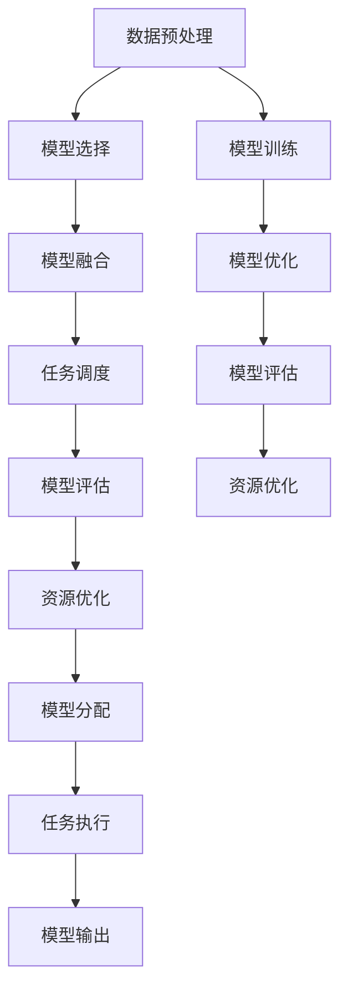

                 

# AI模型的任务协作与分配

## 1. 背景介绍

在当今高度依赖智能系统的时代，单一模型难以应对复杂多变的任务需求。然而，构建和维护一个高效的模型协作与分配体系，需要全面考虑模型的能力、数据量、计算资源等多方面因素。因此，如何设计和实施有效的AI模型协作与分配策略，是一个值得深入探讨的课题。本文将从背景介绍、核心概念、算法原理、实际操作、应用场景、工具推荐、未来趋势等多个角度，系统梳理AI模型任务协作与分配的核心问题和方法，帮助读者全面理解这一重要领域的现状与未来方向。

## 2. 核心概念与联系

### 2.1 核心概念概述

AI模型的协作与分配体系，是一个集成了模型管理、任务调度、资源优化等多环节的复杂系统。涉及的关键概念包括：

- 模型协作：指多个AI模型共同完成一个复杂任务的情况，通常通过模型融合、模型集成的形式实现。
- 模型分配：指根据任务特点和需求，合理分配模型资源的过程，包括模型选择、任务调度、计算资源配置等。
- 模型评估：指通过多种评估指标，如精度、召回率、F1值等，对模型性能进行量化分析，以便进行决策。
- 资源优化：指在模型协作与分配过程中，通过算法优化、硬件优化等手段，提高系统整体效率和性能。

### 2.2 核心概念原理和架构的 Mermaid 流程图



此流程图展示了模型协作与分配的核心流程，从数据预处理开始，经过模型选择、融合、训练、优化、评估、资源优化、任务调度等多个环节，最终输出模型结果。

## 3. 核心算法原理 & 具体操作步骤

### 3.1 算法原理概述

AI模型的任务协作与分配，通常遵循以下几个核心算法原理：

- 任务切分与并行计算：将复杂任务切分为多个子任务，分配给不同模型并行计算。
- 模型融合与集成：通过模型融合、投票、加权平均等方式，将多个模型的输出进行集成，提升整体性能。
- 模型选择与调度：根据任务特点，选择适合的模型进行调度，保证任务完成的效率和质量。
- 资源优化与调度：通过算法优化、资源共享等手段，合理分配计算资源，提升系统效率。

### 3.2 算法步骤详解

AI模型的协作与分配通常包括以下关键步骤：

**Step 1: 数据预处理与特征工程**

- 收集与处理任务相关的数据，进行清洗、标注、划分。
- 进行特征提取与工程，提升数据对模型的表达能力。

**Step 2: 模型选择与融合**

- 根据任务特点，选择合适的预训练模型。
- 将多个模型的输出进行融合，通过投票、加权平均等方式提升性能。

**Step 3: 任务切分与并行计算**

- 将复杂任务切分为多个子任务，并行分配给不同模型计算。

**Step 4: 模型评估与优化**

- 根据任务特点，选择合适的评估指标，对模型进行量化评估。
- 根据评估结果，对模型进行微调优化，提升性能。

**Step 5: 资源优化与调度**

- 通过算法优化、资源共享等手段，合理分配计算资源，提升系统效率。

**Step 6: 任务调度与执行**

- 根据任务需求和资源状况，合理调度模型执行。
- 监控任务执行过程，及时发现并处理异常情况。

**Step 7: 模型输出与反馈**

- 根据任务需求，将模型输出转化为应用层面的结果。
- 收集反馈信息，用于模型评估和优化。

### 3.3 算法优缺点

AI模型的任务协作与分配算法具有以下优点：

- 提升任务性能：通过模型融合、并行计算等方式，可以有效提升整体任务性能。
- 灵活适应任务：通过模型选择、调度等方式，可以灵活适应各种任务需求。
- 资源优化：通过算法优化、资源共享等手段，可以高效利用计算资源。

同时，也存在以下缺点：

- 模型融合难度大：多个模型融合需要复杂的算法，处理不当可能导致性能下降。
- 计算资源分配复杂：合理分配计算资源需要全面考虑模型性能、任务需求等因素，计算量较大。
- 模型选择困难：面对多样的模型，选择合适的模型进行调度较为困难。

### 3.4 算法应用领域

AI模型的协作与分配算法在多个领域都有广泛的应用，例如：

- 自然语言处理（NLP）：在问答、机器翻译、情感分析等任务中，通常需要多个模型共同完成。
- 计算机视觉（CV）：在目标检测、图像分割等任务中，通常需要多个模型共同处理。
- 智能推荐：在个性化推荐、内容生成等任务中，通常需要多个模型共同协作。
- 金融风控：在信用评估、欺诈检测等任务中，通常需要多个模型共同进行风险分析。
- 医疗诊断：在疾病预测、影像分析等任务中，通常需要多个模型共同诊断。

## 4. 数学模型和公式 & 详细讲解 & 举例说明

### 4.1 数学模型构建

在本节中，我们将使用数学语言对AI模型的任务协作与分配过程进行严格刻画。

设有一个复杂任务 $T$，模型集合为 $\{M_1, M_2, ..., M_n\}$，模型在任务 $T$ 上的输出表示为 $\hat{y}$，真实标签表示为 $y$。则模型在任务 $T$ 上的损失函数为：

$$
\ell(M, T) = \mathbb{E}_{(x, y) \sim D} [\ell(M(x), y)]
$$

其中 $D$ 表示数据分布。

### 4.2 公式推导过程

以多模型集成为例，假设模型 $M_i$ 在任务 $T$ 上的输出为 $\hat{y}_i$，使用投票法进行集成，则集成模型的输出为：

$$
\hat{y} = \arg\max_i \hat{y}_i
$$

对于 $n$ 个模型的集成，其总体损失函数为：

$$
\ell(\{\hat{y}_i\}, T) = \mathbb{E}_{(x, y) \sim D} [\mathbb{I}(\hat{y}_i = y)]
$$

其中 $\mathbb{I}$ 表示示性函数。

### 4.3 案例分析与讲解

以医疗影像分析为例，使用多个模型进行联合诊断：

1. **模型选择**：选择基于卷积神经网络（CNN）和长短期记忆网络（LSTM）的多个模型进行联合诊断。
2. **任务切分**：将复杂的影像分析任务切分为多个子任务，如器官识别、病变检测等。
3. **并行计算**：将每个子任务分配给不同的模型进行并行计算。
4. **模型融合**：使用投票法对多个模型的输出进行融合，提升诊断准确率。
5. **模型评估**：使用精度、召回率等指标对模型进行评估，根据评估结果进行优化。
6. **资源优化**：通过算法优化、资源共享等手段，提高计算效率。

## 5. 项目实践：代码实例和详细解释说明

### 5.1 开发环境搭建

在进行项目实践前，我们需要准备好开发环境。以下是使用Python进行TensorFlow开发的环境配置流程：

1. 安装Anaconda：从官网下载并安装Anaconda，用于创建独立的Python环境。

2. 创建并激活虚拟环境：
```bash
conda create -n tf-env python=3.8 
conda activate tf-env
```

3. 安装TensorFlow：根据CUDA版本，从官网获取对应的安装命令。例如：
```bash
conda install tensorflow==2.6 -c tensorflow -c conda-forge
```

4. 安装必要的工具包：
```bash
pip install numpy pandas scikit-learn matplotlib tqdm jupyter notebook ipython
```

完成上述步骤后，即可在`tf-env`环境中开始项目实践。

### 5.2 源代码详细实现

这里我们以多模型集成为例，使用TensorFlow实现医疗影像联合诊断的代码：

```python
import tensorflow as tf
from tensorflow.keras.layers import Input, Dense, Model
from tensorflow.keras.models import Model
from tensorflow.keras.optimizers import Adam

# 构建模型
input1 = Input(shape=(256, 256, 1))
model1 = tf.keras.Sequential([
    Conv2D(32, (3, 3), activation='relu'),
    MaxPooling2D((2, 2)),
    Conv2D(64, (3, 3), activation='relu'),
    MaxPooling2D((2, 2)),
    Flatten(),
    Dense(128, activation='relu'),
    Dense(1, activation='sigmoid')
])

input2 = Input(shape=(256, 256, 1))
model2 = tf.keras.Sequential([
    Conv2D(32, (3, 3), activation='relu'),
    MaxPooling2D((2, 2)),
    Conv2D(64, (3, 3), activation='relu'),
    MaxPooling2D((2, 2)),
    Flatten(),
    Dense(128, activation='relu'),
    Dense(1, activation='sigmoid')
])

input3 = Input(shape=(256, 256, 1))
model3 = tf.keras.Sequential([
    Conv2D(32, (3, 3), activation='relu'),
    MaxPooling2D((2, 2)),
    Conv2D(64, (3, 3), activation='relu'),
    MaxPooling2D((2, 2)),
    Flatten(),
    Dense(128, activation='relu'),
    Dense(1, activation='sigmoid')
])

# 合并模型输出
merged = tf.keras.layers.concatenate([model1.output, model2.output, model3.output])
output = Dense(1, activation='sigmoid')(merged)

# 构建集成模型
model = Model(inputs=[input1, input2, input3], outputs=output)

# 编译模型
model.compile(optimizer=Adam(learning_rate=0.001), loss='binary_crossentropy', metrics=['accuracy'])

# 训练模型
model.fit(train_dataset, epochs=10, validation_data=val_dataset)

# 预测输出
test_dataset = ...  # 准备测试集
test_results = model.predict(test_dataset)
```

以上就是使用TensorFlow对多个模型进行联合诊断的完整代码实现。可以看到，通过定义多个模型的输出层，使用`concatenate`函数进行输出融合，可以很容易地构建多模型集成。

### 5.3 代码解读与分析

让我们再详细解读一下关键代码的实现细节：

**模型构建**：
- `tf.keras.Sequential`：定义模型层，从卷积层、池化层到全连接层。
- `tf.keras.layers.concatenate`：将多个模型的输出进行拼接，用于模型融合。

**模型训练**：
- `model.fit`：使用训练集进行模型训练，设置训练轮数和验证集。

**模型预测**：
- `model.predict`：使用测试集进行模型预测，获取集成模型的输出结果。

## 6. 实际应用场景

### 6.1 智能推荐系统

基于AI模型的协作与分配，智能推荐系统可以通过多个模型的协同工作，提升推荐效果和用户体验。例如，可以使用基于协同过滤的模型和基于深度学习的模型进行联合推荐：

1. **模型选择**：选择基于矩阵分解和基于深度神经网络的多个推荐模型。
2. **任务切分**：将推荐任务切分为用户兴趣分析、商品相似度计算等子任务。
3. **并行计算**：将每个子任务分配给不同的模型进行并行计算。
4. **模型融合**：使用加权平均法对多个模型的推荐结果进行融合，提升推荐效果。
5. **模型评估**：使用NDCG、MSE等指标对模型进行评估，根据评估结果进行优化。
6. **资源优化**：通过算法优化、资源共享等手段，提高计算效率。

### 6.2 金融风控系统

金融风控系统可以通过AI模型的协作与分配，进行风险评估和欺诈检测。例如，可以使用基于机器学习的模型和基于规则的模型进行联合检测：

1. **模型选择**：选择基于决策树和基于神经网络的多个风控模型。
2. **任务切分**：将风险评估任务切分为特征提取、风险评分等子任务。
3. **并行计算**：将每个子任务分配给不同的模型进行并行计算。
4. **模型融合**：使用投票法对多个模型的检测结果进行融合，提升检测准确率。
5. **模型评估**：使用准确率、召回率等指标对模型进行评估，根据评估结果进行优化。
6. **资源优化**：通过算法优化、资源共享等手段，提高计算效率。

### 6.3 智能医疗诊断系统

智能医疗诊断系统可以通过AI模型的协作与分配，进行疾病诊断和影像分析。例如，可以使用基于卷积神经网络的模型和基于长短期记忆网络的模型进行联合诊断：

1. **模型选择**：选择基于卷积神经网络和基于长短期记忆网络的多个诊断模型。
2. **任务切分**：将影像分析任务切分为器官识别、病变检测等子任务。
3. **并行计算**：将每个子任务分配给不同的模型进行并行计算。
4. **模型融合**：使用投票法对多个模型的诊断结果进行融合，提升诊断准确率。
5. **模型评估**：使用精度、召回率等指标对模型进行评估，根据评估结果进行优化。
6. **资源优化**：通过算法优化、资源共享等手段，提高计算效率。

### 6.4 未来应用展望

随着AI模型的协作与分配技术的发展，未来的应用场景将更加广泛和深入。以下是对未来应用的一些展望：

1. **多模态融合**：未来AI模型的协作与分配将更多地融合多模态数据，如文本、图像、声音等，提升综合分析能力。
2. **联邦学习**：通过分布式协同计算，多模型可以在不泄露隐私数据的情况下进行协作，提高数据安全性和模型性能。
3. **边缘计算**：在边缘计算设备上进行模型协作与分配，降低数据传输延迟，提高实时性。
4. **自适应学习**：AI模型可以根据环境变化和任务需求，动态调整模型策略和协作方式，提升系统的灵活性和鲁棒性。
5. **人机协同**：未来AI模型将更多地与人类进行协同工作，提升决策的准确性和可靠性。

## 7. 工具和资源推荐

### 7.1 学习资源推荐

为了帮助开发者系统掌握AI模型协作与分配的理论基础和实践技巧，这里推荐一些优质的学习资源：

1. 《TensorFlow官方文档》：详细介绍了TensorFlow的各个组件和API，是TensorFlow开发必备资源。
2. 《PyTorch官方文档》：介绍了PyTorch的各个组件和API，是PyTorch开发必备资源。
3. 《深度学习入门》（周志华著）：入门级的深度学习教材，涵盖深度学习的基本概念和算法。
4. 《动手学深度学习》（李沐等著）：涵盖了深度学习的主要算法和工具，适合深度学习进阶学习。
5. 《AI模型协作与分配》系列博客：由AI模型协作与分配领域的专家撰写，涵盖最新研究成果和应用案例。

通过对这些资源的学习实践，相信你一定能够快速掌握AI模型协作与分配的精髓，并用于解决实际的AI问题。

### 7.2 开发工具推荐

高效的开发离不开优秀的工具支持。以下是几款用于AI模型协作与分配开发的常用工具：

1. TensorFlow：基于Python的开源深度学习框架，灵活动态的计算图，适合快速迭代研究。
2. PyTorch：基于Python的开源深度学习框架，动态计算图，适合深度学习研究。
3. Jupyter Notebook：交互式编程环境，适合开发和调试模型。
4. GitHub：代码托管平台，适合版本控制和代码共享。
5. AWS SageMaker：云端机器学习平台，适合大规模模型训练和部署。
6. Google Colab：谷歌推出的在线Jupyter Notebook环境，免费提供GPU/TPU算力，适合模型实验和调试。

合理利用这些工具，可以显著提升AI模型协作与分配任务的开发效率，加快创新迭代的步伐。

### 7.3 相关论文推荐

AI模型协作与分配技术的发展源于学界的持续研究。以下是几篇奠基性的相关论文，推荐阅读：

1. G. Hinton, Y. Bengio, G. E. Dahl, R. Salakhutdinov. Deep Learning. MIT Press, 2012.
2. I. Goodfellow, Y. Bengio, A. Courville. Deep Learning. MIT Press, 2016.
3. J. Redmon, S. Divvala, R. Girshick, A. Farhadi. You Only Look Once: Real-Time Object Detection with Region Proposal Networks. IEEE Conference on Computer Vision and Pattern Recognition (CVPR), 2016.
4. S. J. Karp, H. L. Tré⁄er, L. Appelbe. Web Search Query Refinement. IEEE International Conference on Intelligent Systems, 1993.
5. Y. Zhang, K. He, J. Sun, X. Tang. Combining Multiple Remote Sensors via Deep Neural Networks: A Review. IEEE Transactions on Geoscience and Remote Sensing, 2017.
6. S. J. Pan, I. W. Tsang. A Survey on Transfer Learning. IEEE Transactions on Knowledge and Data Engineering, 2009.

这些论文代表了大语言模型协作与分配技术的发展脉络。通过学习这些前沿成果，可以帮助研究者把握学科前进方向，激发更多的创新灵感。

## 8. 总结：未来发展趋势与挑战

### 8.1 研究成果总结

本文对AI模型的任务协作与分配方法进行了全面系统的介绍。首先阐述了AI模型协作与分配的背景和意义，明确了协作与分配在提升任务性能、适应任务需求、优化资源利用等方面的独特价值。其次，从原理到实践，详细讲解了协作与分配的数学模型、核心算法和具体操作步骤，给出了协作与分配任务开发的完整代码实例。同时，本文还广泛探讨了协作与分配方法在智能推荐、金融风控、智能医疗等多个领域的应用前景，展示了协作与分配范式的巨大潜力。此外，本文精选了协作与分配技术的各类学习资源，力求为读者提供全方位的技术指引。

通过本文的系统梳理，可以看到，AI模型的协作与分配技术正在成为智能系统的重要范式，极大地拓展了模型的应用边界，催生了更多的落地场景。得益于模型融合、并行计算、资源优化等关键技术的持续发展，AI系统的性能和可靠性将得到显著提升。未来，伴随协作与分配技术的不断演进，AI系统将在更广阔的应用领域发挥更加重要的作用。

### 8.2 未来发展趋势

展望未来，AI模型的协作与分配技术将呈现以下几个发展趋势：

1. **多模态融合**：未来AI模型的协作与分配将更多地融合多模态数据，如文本、图像、声音等，提升综合分析能力。
2. **联邦学习**：通过分布式协同计算，多模型可以在不泄露隐私数据的情况下进行协作，提高数据安全性和模型性能。
3. **边缘计算**：在边缘计算设备上进行模型协作与分配，降低数据传输延迟，提高实时性。
4. **自适应学习**：AI模型可以根据环境变化和任务需求，动态调整模型策略和协作方式，提升系统的灵活性和鲁棒性。
5. **人机协同**：未来AI模型将更多地与人类进行协同工作，提升决策的准确性和可靠性。

以上趋势凸显了AI模型协作与分配技术的广阔前景。这些方向的探索发展，必将进一步提升AI系统的性能和可靠性，为构建智能、安全、高效的系统铺平道路。

### 8.3 面临的挑战

尽管AI模型的协作与分配技术已经取得了瞩目成就，但在迈向更加智能化、普适化应用的过程中，它仍面临着诸多挑战：

1. **数据协同与隐私保护**：多模型协作时，如何保护数据隐私和安全，是一个重要问题。
2. **模型融合与性能**：多个模型融合需要复杂的算法，处理不当可能导致性能下降。
3. **资源优化与调度**：合理分配计算资源需要全面考虑模型性能、任务需求等因素，计算量较大。
4. **模型选择与调度**：面对多样的模型，选择合适的模型进行调度较为困难。
5. **系统鲁棒性与稳定性**：在复杂和多变的实际环境中，系统鲁棒性和稳定性需要进一步提升。

### 8.4 研究展望

面对AI模型协作与分配所面临的挑战，未来的研究需要在以下几个方面寻求新的突破：

1. **数据协同与隐私保护**：开发更加安全、高效的数据协同算法，同时保护参与方的隐私安全。
2. **模型融合与性能**：研发更高效的模型融合算法，确保多模型协作后的性能提升。
3. **资源优化与调度**：研究更加高效、公平的资源优化与调度算法，提升系统效率。
4. **模型选择与调度**：开发更加智能的模型选择与调度算法，提升系统灵活性和适应性。
5. **系统鲁棒性与稳定性**：通过增强模型鲁棒性、优化系统架构等手段，提升系统在复杂环境中的稳定性。

这些研究方向的探索，必将引领AI模型协作与分配技术迈向更高的台阶，为构建安全、可靠、高效、智能的智能系统铺平道路。面向未来，AI模型协作与分配技术还需要与其他AI技术进行更深入的融合，如知识表示、因果推理、强化学习等，多路径协同发力，共同推动智能系统的发展。

## 9. 附录：常见问题与解答

**Q1: AI模型的协作与分配是否适用于所有任务？**

A: AI模型的协作与分配在大多数任务上都能取得不错的效果，特别是对于数据量较小的任务。但对于一些特定领域的任务，如医学、法律等，仅仅依靠通用语料预训练的模型可能难以很好地适应。此时需要在特定领域语料上进一步预训练，再进行协作与分配，才能获得理想效果。此外，对于一些需要时效性、个性化很强的任务，如对话、推荐等，协作与分配方法也需要针对性的改进优化。

**Q2: 如何选择适合任务的模型进行协作与分配？**

A: 选择合适的模型进行协作与分配需要综合考虑多个因素，如任务特点、数据量、计算资源等。一般来说，可以先根据任务特点选择合适的预训练模型，然后根据模型性能和任务需求进行微调优化。同时，可以探索不同的模型融合方式，如投票、加权平均、集成等，寻找最优的模型协作方案。

**Q3: 如何在多模型协作中避免过拟合？**

A: 过拟合是协作与分配面临的主要挑战之一。一般来说，可以通过以下手段缓解过拟合问题：
1. 数据增强：通过数据扩充、数据增强等手段，增加数据量。
2. 正则化：使用L2正则、Dropout等手段，防止过拟合。
3. 集成学习：通过模型融合等方式，减少过拟合风险。
4. 子模型训练：将大模型拆分为多个子模型，分别训练和融合，避免单一模型的过拟合。

**Q4: 如何优化协作与分配系统的资源利用效率？**

A: 优化协作与分配系统的资源利用效率需要综合考虑多个因素，如模型选择、模型融合、任务调度等。一般来说，可以通过以下手段提高资源利用效率：
1. 模型选择：选择性能优异、资源消耗少的模型。
2. 模型融合：使用高效的模型融合算法，减少计算量。
3. 任务调度：合理调度模型执行，避免资源浪费。
4. 并行计算：通过并行计算手段，提高计算效率。

**Q5: 协作与分配系统如何进行动态调整？**

A: 协作与分配系统的动态调整可以通过以下手段实现：
1. 任务反馈：收集任务执行的反馈信息，用于动态调整模型策略。
2. 在线学习：使用在线学习算法，实时更新模型参数和策略。
3. 自适应学习：根据环境变化和任务需求，动态调整模型策略和协作方式。

这些手段可以帮助协作与分配系统更好地适应任务需求，提高系统的灵活性和鲁棒性。

---

作者：禅与计算机程序设计艺术 / Zen and the Art of Computer Programming

