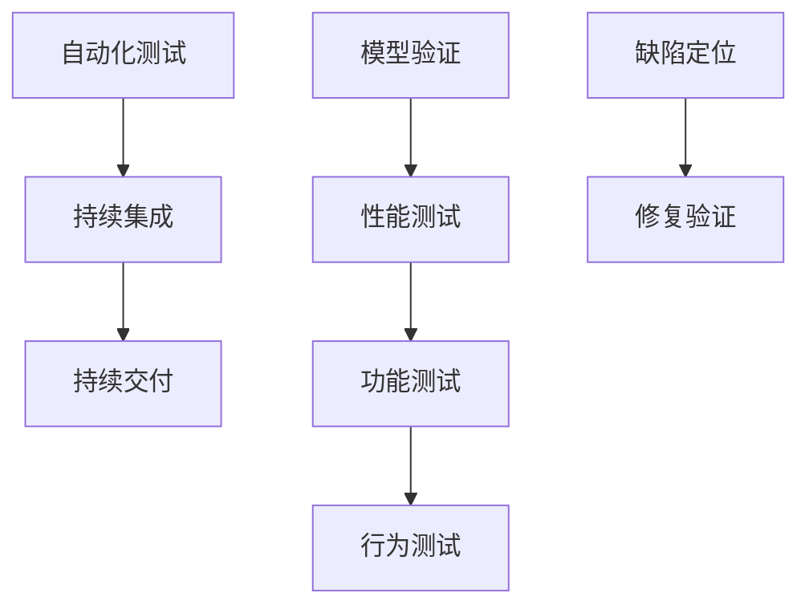

                 

# AI测试与质量保证原理与代码实战案例讲解

> 关键词：人工智能,测试,质量保证,自动化测试,深度学习,机器学习,模型验证,性能测试,功能测试

## 1. 背景介绍

### 1.1 问题由来

在现代软件开发过程中，人工智能(AI)技术的日益普及，使得软件系统中包含了越来越多的AI模块。这些AI模块涉及深度学习、机器学习等复杂算法，对测试和质量保证带来了新的挑战。如何高效、全面、准确地进行AI测试，以保障AI系统在实际应用中的稳定性和可靠性，成为当前软件开发的重要课题。

### 1.2 问题核心关键点

AI测试与质量保证的核心关键点包括：
- 自动化测试框架的选择
- 测试用例的设计与生成
- 模型验证与性能评估
- 功能测试与行为测试
- 缺陷定位与修复验证
- 持续集成与持续交付

这些关键点围绕着AI模型的质量保证，共同构成了AI测试与质量保证的体系框架。只有全面考虑这些因素，才能实现高效、全面的AI测试与质量保证。

### 1.3 问题研究意义

深入研究和实践AI测试与质量保证，具有以下重要意义：
- 提升AI系统的可靠性和稳定性，减少系统故障和运行风险。
- 加速AI系统从开发到部署的进程，缩短产品上市时间，提升市场竞争力。
- 帮助团队更早发现和修复缺陷，降低修复成本，提高开发效率。
- 促进AI技术的落地应用，推动AI技术在各行业的广泛普及。

## 2. 核心概念与联系

### 2.1 核心概念概述

为更好地理解AI测试与质量保证，本节将介绍几个密切相关的核心概念：

- 自动化测试(Automated Testing)：使用自动化工具和脚本，自动化执行测试用例，以减少人工干预，提高测试效率。
- 持续集成(Continuous Integration, CI)：将代码提交到中央仓库后，自动化构建和运行测试用例，及早发现并解决潜在问题。
- 持续交付(Continuous Delivery, CD)：通过自动化测试和部署，将软件产品快速交付给用户，保障交付质量。
- 模型验证(Model Validation)：通过人工或自动化手段，验证AI模型的准确性和可靠性，确保模型性能满足要求。
- 性能测试(Performance Testing)：评估AI系统在不同负载和场景下的运行性能，如响应时间、资源消耗等。
- 功能测试(Functional Testing)：验证AI系统是否符合设计要求，是否能正确执行预期功能。
- 行为测试(Behavior Testing)：验证AI系统是否具有预期的行为特征，如输入输出关系、决策路径等。
- 缺陷定位(Defect Localization)：确定软件系统中缺陷的具体位置，帮助开发者快速修复问题。
- 修复验证(Defect Fix Verification)：验证修复后系统是否符合预期，问题是否真正解决。

这些核心概念之间的逻辑关系可以通过以下Mermaid流程图来展示：



这个流程图展示了一系列相关概念之间的联系：

1. 自动化测试是持续集成和持续交付的基础。
2. 模型验证、性能测试、功能测试和行为测试是评估AI系统质量的关键环节。
3. 缺陷定位和修复验证确保了问题及时发现和有效解决。

这些概念共同构成了AI测试与质量保证的基本框架，使得AI系统在开发和部署过程中能够全面、系统地进行测试与验证，确保系统稳定可靠。

## 3. 核心算法原理 & 具体操作步骤

### 3.1 算法原理概述

AI测试与质量保证的基本原理可以概括为：使用自动化测试工具和框架，结合模型验证、性能测试等手段，对AI系统进行全面评估，确保其符合设计要求和性能指标，同时在持续集成和持续交付的流程中，及时发现和修复问题。

### 3.2 算法步骤详解

AI测试与质量保证的一般流程包括以下几个关键步骤：

**Step 1: 准备测试环境**
- 选择合适的测试框架和工具，如TensorFlow、PyTorch等。
- 搭建测试环境，包括硬件设备、软件平台等。
- 准备测试数据集，包含训练数据、验证数据和测试数据。

**Step 2: 设计测试用例**
- 根据AI系统的功能和行为需求，设计覆盖各个方面的测试用例。
- 使用自动化测试工具生成测试脚本，如Jest、pytest等。
- 对测试用例进行分组，确保覆盖面广且效率高。

**Step 3: 执行自动化测试**
- 使用测试框架自动执行测试用例。
- 在测试过程中记录测试结果，包括通过/失败、运行时间等。
- 记录并分析测试日志，定位测试问题。

**Step 4: 进行模型验证**
- 对AI模型的输出结果进行人工验证或使用自动化工具验证，确保模型准确性和可靠性。
- 使用各种性能指标评估模型性能，如准确率、召回率、F1值等。
- 验证模型在不同数据分布和样本规模下的表现。

**Step 5: 执行性能测试**
- 使用负载测试工具，如JMeter、Gatling等，模拟系统负载。
- 测试系统在不同负载下的响应时间和资源消耗。
- 分析性能瓶颈，优化系统性能。

**Step 6: 执行功能测试和行为测试**
- 验证AI系统是否按照设计要求正确执行功能。
- 使用测试用例和行为脚本，验证系统行为。
- 确保系统在不同场景和输入条件下的行为一致性。

**Step 7: 缺陷定位和修复验证**
- 使用静态和动态代码分析工具，定位系统中的潜在缺陷。
- 根据缺陷报告，定位具体代码行或组件。
- 对修复后的代码进行回归测试，验证问题是否真正解决。

**Step 8: 持续集成和持续交付**
- 将代码变更提交到中央仓库，触发持续集成流程。
- 自动化构建和运行测试用例，确保代码变更通过测试。
- 自动化部署到生产环境，交付稳定、可靠的系统。

以上是AI测试与质量保证的一般流程。在实际应用中，还需要根据具体任务和系统特点，对各个环节进行优化设计，如改进测试用例设计方法、优化性能测试工具、增强缺陷定位能力等。

### 3.3 算法优缺点

AI测试与质量保证的优点包括：
- 自动化测试可以大幅度提升测试效率，减少人工干预。
- 持续集成和持续交付能够加速产品迭代，提升交付质量。
- 模型验证和性能测试能够全面评估AI系统的准确性和稳定性。
- 功能测试和行为测试能够确保系统行为符合预期，增强系统可靠性。
- 缺陷定位和修复验证能够及时发现并修复问题，保障系统质量。

同时，该方法也存在一定的局限性：
- 测试用例设计可能存在不足，无法完全覆盖系统各个方面。
- 自动化测试工具和框架可能存在学习曲线，需要一定时间掌握。
- 模型验证和性能测试可能需要人工介入，耗时较多。
- 持续集成和持续交付流程可能涉及多方面系统，复杂度较高。

尽管存在这些局限性，但就目前而言，基于自动化测试和持续交付的AI测试与质量保证方法仍是最主流的范式。未来相关研究的重点在于如何进一步优化测试用例设计、提高自动化测试工具的易用性和功能，以及增强缺陷定位和修复验证的自动化能力。

### 3.4 算法应用领域

AI测试与质量保证的应用领域广泛，涵盖了各个行业和领域，例如：

- 智能推荐系统：在推荐算法、系统架构、模型训练等方面进行全面测试，确保推荐结果准确性和系统稳定性。
- 语音识别系统：对语音识别模型进行模型验证、性能测试、功能测试和行为测试，确保系统在不同环境和口音下的准确性和鲁棒性。
- 图像识别系统：测试图像识别模型在不同分辨率、光照条件和视角下的表现，确保系统具有鲁棒性和泛化能力。
- 自然语言处理系统：测试自然语言处理模型在语言理解、生成、翻译等方面的性能，确保系统具有高度准确性和流畅性。
- 智能搜索系统：测试搜索算法、系统架构、用户体验等方面的功能，确保系统快速响应和准确搜索。
- 智能监控系统：测试监控模型在不同场景下的性能，确保系统在实时监控任务中具有高可靠性和稳定性。

除了上述这些经典应用外，AI测试与质量保证还被创新性地应用于更多场景中，如可解释性、安全性、隐私保护等，为AI技术的落地应用提供了坚实保障。

## 4. 数学模型和公式 & 详细讲解 & 举例说明

### 4.1 数学模型构建

本节将使用数学语言对AI测试与质量保证的基本模型进行更加严格的刻画。

假设AI系统包含多个模块，每个模块的输出为 $y_i$，输入为 $x_i$，对应模块的损失函数为 $L_i(y_i, x_i)$。AI系统的整体损失函数为 $L=\sum_{i=1}^n L_i(y_i, x_i)$。

**Step 1: 模型验证**
- 使用数据集 $D_v=\{(x_{vi}, y_{vi})\}_{i=1}^m$ 验证模型性能。
- 计算模型在验证集上的损失函数 $L_v=\frac{1}{m}\sum_{i=1}^m L_i(y_{vi}, x_{vi})$。
- 使用混淆矩阵、ROC曲线等指标评估模型表现。

**Step 2: 性能测试**
- 使用负载测试工具 $T$，模拟系统负载 $L$，运行时间 $t$。
- 计算性能指标 $P=\frac{1}{n}\sum_{i=1}^n \frac{t_i}{t}$，其中 $t_i$ 为第 $i$ 次测试的运行时间。
- 分析性能瓶颈，优化系统性能。

**Step 3: 功能测试**
- 使用测试用例 $C=\{(x_{ci}, y_{ci})\}_{i=1}^p$，验证系统功能。
- 计算功能测试通过率 $F=\frac{p_F}{p}$，其中 $p_F$ 为通过功能测试的用例数。
- 确保系统满足设计要求。

**Step 4: 行为测试**
- 使用行为脚本 $B$，验证系统行为。
- 计算行为测试通过率 $B=\frac{p_B}{p}$，其中 $p_B$ 为通过行为测试的用例数。
- 确保系统在不同场景和输入条件下的行为一致性。

### 4.2 公式推导过程

以下我们以语音识别系统为例，推导模型验证和性能测试的数学模型和公式。

**模型验证**
- 假设语音识别模型的输出为 $y$，输入为 $x$，对应的损失函数为 $L(y, x)$。
- 使用验证集 $D_v=\{(x_{vi}, y_{vi})\}_{i=1}^m$，计算模型在验证集上的损失函数 $L_v=\frac{1}{m}\sum_{i=1}^m L(y_{vi}, x_{vi})$。
- 使用混淆矩阵 $M$ 评估模型表现，其中 $M_{ij}$ 表示模型预测第 $j$ 类时的正确率。
- 计算模型准确率 $A=\frac{p_A}{p}$，召回率 $R=\frac{p_R}{p}$，F1值 $F_1=\frac{2AR}{A+R}$，其中 $p_A$ 为正确预测的正样本数，$p_R$ 为正确预测的负样本数，$p$ 为总样本数。

**性能测试**
- 假设语音识别系统在单位时间 $t$ 内处理的语音信号数量为 $N$，处理每段语音的时间为 $t_s$。
- 使用负载测试工具 $T$，模拟系统负载 $L$，运行时间 $t$。
- 计算性能指标 $P=\frac{1}{n}\sum_{i=1}^n \frac{t_i}{t}$，其中 $t_i$ 为第 $i$ 次测试的运行时间。
- 分析性能瓶颈，优化系统性能。

### 4.3 案例分析与讲解

**案例1：智能推荐系统**
- 设计测试用例，涵盖不同类型用户和推荐结果。
- 使用自动化测试工具执行测试，记录测试结果。
- 对推荐结果进行人工验证，计算推荐准确率和召回率。
- 在持续集成流程中，自动化运行测试，确保代码变更通过测试。
- 对推荐模型进行模型验证，确保模型准确性和鲁棒性。
- 进行性能测试，确保系统在并发用户下的稳定性和响应速度。

**案例2：语音识别系统**
- 设计测试用例，涵盖不同环境、口音和语速。
- 使用自动化测试工具执行测试，记录测试结果。
- 对语音识别结果进行人工验证，计算识别准确率和召回率。
- 进行模型验证，确保模型在不同数据分布下的准确性。
- 进行性能测试，确保系统在高负载下的稳定性和响应速度。
- 进行行为测试，确保系统在不同场景下的行为一致性。

## 5. 项目实践：代码实例和详细解释说明

### 5.1 开发环境搭建

在进行AI测试与质量保证实践前，我们需要准备好开发环境。以下是使用Python进行PyTorch开发的环境配置流程：

1. 安装Anaconda：从官网下载并安装Anaconda，用于创建独立的Python环境。

2. 创建并激活虚拟环境：
```bash
conda create -n pytorch-env python=3.8 
conda activate pytorch-env
```

3. 安装PyTorch：根据CUDA版本，从官网获取对应的安装命令。例如：
```bash
conda install pytorch torchvision torchaudio cudatoolkit=11.1 -c pytorch -c conda-forge
```

4. 安装TensorFlow：
```bash
pip install tensorflow==2.6
```

5. 安装各类工具包：
```bash
pip install numpy pandas scikit-learn matplotlib tqdm jupyter notebook ipython
```

完成上述步骤后，即可在`pytorch-env`环境中开始AI测试与质量保证实践。

### 5.2 源代码详细实现

这里我们以语音识别系统为例，给出使用PyTorch和TensorFlow进行模型验证和性能测试的PyTorch代码实现。

**模型验证**
```python
import torch
import torch.nn as nn
import torch.optim as optim

# 加载模型
model = torch.load('model.pt')

# 加载验证集数据
valid_data = ...

# 定义损失函数
criterion = nn.CrossEntropyLoss()

# 定义优化器
optimizer = optim.Adam(model.parameters(), lr=0.001)

# 模型验证
valid_loss = []
valid_acc = []
for batch in valid_data:
    inputs, labels = batch
    optimizer.zero_grad()
    outputs = model(inputs)
    loss = criterion(outputs, labels)
    loss.backward()
    optimizer.step()
    valid_loss.append(loss.item())
    valid_acc.append(nn.functional.cross_entropy(outputs, labels).item())

# 计算平均损失和准确率
valid_loss = sum(valid_loss) / len(valid_loss)
valid_acc = sum(valid_acc) / len(valid_acc)
print(f'验证集损失：{valid_loss:.4f}, 验证集准确率：{valid_acc:.4f}')
```

**性能测试**
```python
import tensorflow as tf
import tensorflow_datasets as tfds

# 加载性能测试数据集
ds, info = tfds.load('speech_commands', with_info=True, as_supervised=True)

# 定义模型
model = tf.keras.Sequential([
    tf.keras.layers.Conv2D(32, kernel_size=(3, 3), activation='relu', input_shape=(128, 128, 1)),
    tf.keras.layers.MaxPooling2D(pool_size=(2, 2)),
    tf.keras.layers.Flatten(),
    tf.keras.layers.Dense(128, activation='relu'),
    tf.keras.layers.Dense(num_classes, activation='softmax')
])

# 编译模型
model.compile(optimizer='adam', loss='categorical_crossentropy', metrics=['accuracy'])

# 定义性能测试数据生成器
def generate_test_data(batch_size=64):
    test_data = ...
    test_labels = ...
    while True:
        for i in range(0, len(test_data), batch_size):
            yield (test_data[i:i+batch_size], test_labels[i:i+batch_size])

# 性能测试
test_loss, test_acc = model.evaluate(test_data_generator, verbose=0)
print(f'性能测试损失：{test_loss:.4f}, 性能测试准确率：{test_acc:.4f}')
```

### 5.3 代码解读与分析

让我们再详细解读一下关键代码的实现细节：

**模型验证代码**
- 使用PyTorch的模型加载功能，加载训练好的模型。
- 加载验证集数据，包括输入和标签。
- 定义损失函数和优化器，准备模型训练。
- 在每个批次上前向传播计算损失，反向传播更新模型参数，并记录损失和准确率。
- 计算平均损失和准确率，输出结果。

**性能测试代码**
- 使用TensorFlow和TensorFlow Datasets加载性能测试数据集。
- 定义模型结构，包括卷积层、池化层和全连接层等。
- 编译模型，指定优化器、损失函数和评估指标。
- 定义性能测试数据生成器，用于模拟系统负载。
- 使用模型evaluate方法计算性能测试结果，输出结果。

## 6. 实际应用场景
### 6.1 智能推荐系统

智能推荐系统是AI测试与质量保证的重要应用场景之一。推荐系统通过用户的历史行为数据，预测其对新物品的兴趣，从而推荐最合适的物品。智能推荐系统涉及深度学习、机器学习等多个技术环节，对测试与质量保证提出了较高要求。

在测试与质量保证过程中，需要重点关注以下方面：
- 数据测试：测试推荐系统的训练数据和验证数据是否符合设计要求。
- 模型验证：验证推荐模型在真实场景中的准确性和鲁棒性。
- 性能测试：测试推荐系统的响应速度和并发性能。
- 行为测试：测试推荐系统在不同场景和用户行为下的行为一致性。
- 缺陷定位：检测推荐系统中的潜在缺陷，并及时修复。
- 持续集成和持续交付：确保代码变更能够在短时间内通过测试并交付生产环境。

### 6.2 语音识别系统

语音识别系统是AI测试与质量保证的另一个重要应用场景。语音识别系统将语音信号转换为文本，广泛应用于智能助手、语音搜索等领域。语音识别系统涉及复杂的音频信号处理和深度学习模型，对测试与质量保证提出了较高要求。

在测试与质量保证过程中，需要重点关注以下方面：
- 数据测试：测试语音识别系统的训练数据和验证数据是否符合设计要求。
- 模型验证：验证语音识别模型在各种口音和环境下的准确性和鲁棒性。
- 性能测试：测试语音识别系统的响应速度和并发性能。
- 行为测试：测试语音识别系统在不同场景和用户行为下的行为一致性。
- 缺陷定位：检测语音识别系统中的潜在缺陷，并及时修复。
- 持续集成和持续交付：确保代码变更能够在短时间内通过测试并交付生产环境。

## 7. 工具和资源推荐
### 7.1 学习资源推荐

为了帮助开发者系统掌握AI测试与质量保证的理论基础和实践技巧，这里推荐一些优质的学习资源：

1. 《软件测试的艺术》系列书籍：详细介绍了软件测试的基本概念和测试方法，涵盖了功能测试、性能测试、安全测试等多个方面。

2. 《机器学习实战》系列书籍：深入浅出地介绍了机器学习的基本原理和应用，涵盖了深度学习、模型验证、性能评估等多个方面。

3. 《测试驱动开发：打造可信赖的软件》书籍：介绍了测试驱动开发的理念和实践，强调了早期测试和持续测试的重要性。

4. 《持续集成与持续交付》书籍：详细介绍了持续集成和持续交付的基本概念和实践方法，涵盖了CI/CD工具、自动化测试、持续交付等多个方面。

5. 《TensorFlow实战》书籍：详细介绍了TensorFlow的基本原理和应用，涵盖了模型构建、性能评估、行为测试等多个方面。

6. 《测试用例设计与自动化测试实践》课程：由知名软件测试专家讲授，深入浅出地介绍了测试用例设计方法和自动化测试工具，强调了自动化测试的重要性。

通过对这些资源的学习实践，相信你一定能够快速掌握AI测试与质量保证的精髓，并用于解决实际的测试与质量保证问题。

### 7.2 开发工具推荐

高效的开发离不开优秀的工具支持。以下是几款用于AI测试与质量保证开发的常用工具：

1. PyTorch：基于Python的开源深度学习框架，灵活动态的计算图，适合快速迭代研究。TensorFlow：由Google主导开发的开源深度学习框架，生产部署方便，适合大规模工程应用。

2. Jest：JavaScript测试框架，支持异步测试、覆盖率分析、断言等功能，适合前端测试。pytest：Python测试框架，支持单元测试、集成测试、功能测试等多种测试类型。

3. JUnit：Java测试框架，支持单元测试、覆盖率分析、断言等功能，适合Java应用测试。NUnit：.NET测试框架，支持单元测试、覆盖率分析、断言等功能，适合.NET应用测试。

4. Selenium：Web自动化测试工具，支持跨浏览器测试、模拟用户行为等功能，适合Web应用测试。Appium：移动应用自动化测试工具，支持iOS和Android应用的自动化测试，适合移动应用测试。

5. JMeter：负载测试工具，支持模拟多种负载场景，适合性能测试。Gatling：负载测试工具，支持高并发测试、分布式测试等功能，适合性能测试。

6. Snyk：安全测试工具，支持依赖扫描、漏洞检测、安全评估等功能，适合代码安全测试。Veracode：安全测试工具，支持静态分析、动态测试、安全评估等功能，适合代码安全测试。

合理利用这些工具，可以显著提升AI测试与质量保证的开发效率，加快创新迭代的步伐。

### 7.3 相关论文推荐

AI测试与质量保证的发展源于学界的持续研究。以下是几篇奠基性的相关论文，推荐阅读：

1. "Test Case Generation and Validation Techniques for Deep Neural Networks"：介绍AI模型测试用例生成和验证的基本方法，涵盖了自动化测试和模型验证技术。

2. "Model Validation and Debugging in Deep Learning"：探讨AI模型验证和调试的最新技术，强调了模型验证和缺陷定位的重要性。

3. "Performance Testing of Machine Learning Models"：介绍AI模型性能测试的最新技术，涵盖了性能测试工具和评估方法。

4. "Behavior Testing of AI Systems"：探讨AI系统行为测试的最新技术，强调了行为测试和系统行为一致性的重要性。

5. "Automated Testing of AI Systems"：探讨AI系统自动化测试的最新技术，强调了自动化测试工具和框架的重要性。

这些论文代表了大语言模型微调技术的发展脉络。通过学习这些前沿成果，可以帮助研究者把握学科前进方向，激发更多的创新灵感。

## 8. 总结：未来发展趋势与挑战

### 8.1 总结

本文对AI测试与质量保证的基本原理和实践方法进行了全面系统的介绍。首先阐述了AI测试与质量保证的背景和意义，明确了测试与质量保证在AI系统开发和部署中的重要地位。其次，从原理到实践，详细讲解了自动化测试、模型验证、性能测试、功能测试、行为测试、缺陷定位和持续集成等核心技术，给出了测试用例设计、自动化测试工具选择、模型验证方法、性能测试工具使用等具体指导。同时，本文还通过多个实际案例，展示了AI测试与质量保证的实际应用，提供了丰富的项目实践经验。

通过本文的系统梳理，可以看到，AI测试与质量保证在AI系统的开发和部署过程中起着至关重要的作用，能够全面保障系统的稳定性和可靠性。未来，随着AI技术在各行业的广泛应用，AI测试与质量保证也将发挥更加重要的作用，推动AI技术的成熟化和产业化。

### 8.2 未来发展趋势

展望未来，AI测试与质量保证的发展趋势主要包括以下几个方向：

1. 自动化测试技术将进一步提升。随着自动化测试工具的不断优化，测试用例设计和执行的自动化水平将进一步提高，减少人工干预，提升测试效率。

2. 持续集成和持续交付将成为常态。随着DevOps技术的普及，持续集成和持续交付流程将更加成熟，加速AI系统的迭代和交付。

3. 模型验证和性能测试将更加全面。未来的AI系统将涉及更多复杂算法和模型，需要更加全面、深入的模型验证和性能测试，以确保系统准确性和稳定性。

4. 行为测试和系统行为一致性将得到更多重视。未来的AI系统将具有更高的自主性和智能性，需要更加全面、深入的行为测试，确保系统行为一致性。

5. 缺陷定位和修复验证将更加高效。未来的AI系统将包含更多代码和模型，需要更加高效、精确的缺陷定位和修复验证技术，确保系统质量。

6. 安全测试和隐私保护将更加严格。未来的AI系统将涉及更多用户数据和敏感信息，需要更加严格的安全测试和隐私保护措施，保障用户数据安全。

### 8.3 面临的挑战

尽管AI测试与质量保证技术已经取得了瞩目成就，但在迈向更加智能化、普适化应用的过程中，它仍面临诸多挑战：

1. 测试用例设计可能存在不足，无法完全覆盖系统各个方面。

2. 自动化测试工具和框架可能存在学习曲线，需要一定时间掌握。

3. 模型验证和性能测试可能需要人工介入，耗时较多。

4. 持续集成和持续交付流程可能涉及多方面系统，复杂度较高。

5. 缺陷定位和修复验证需要准确高效，难度较大。

6. 安全测试和隐私保护需要严格规范，需要投入更多资源。

尽管存在这些挑战，但相信随着学界和产业界的共同努力，这些挑战终将一一被克服，AI测试与质量保证必将在构建安全、可靠、可解释、可控的智能系统铺平道路。面向未来，AI测试与质量保证技术还需要与其他人工智能技术进行更深入的融合，如知识表示、因果推理、强化学习等，多路径协同发力，共同推动自然语言理解和智能交互系统的进步。

### 8.4 研究展望

未来AI测试与质量保证的研究方向主要包括以下几个方面：

1. 探索无监督和半监督测试方法。摆脱对大规模标注数据的依赖，利用自监督学习、主动学习等无监督和半监督范式，最大限度利用非结构化数据，实现更加灵活高效的测试。

2. 研究参数高效和计算高效的测试范式。开发更加参数高效的测试方法，在固定大部分测试数据的情况下，只调整极少量的测试用例，减小测试成本。

3. 融合因果和对比学习范式。通过引入因果推断和对比学习思想，增强测试系统的建立稳定因果关系的能力，学习更加普适、鲁棒的语言表征，从而提升测试系统的泛化性和抗干扰能力。

4. 引入更多先验知识。将符号化的先验知识，如知识图谱、逻辑规则等，与神经网络模型进行巧妙融合，引导测试过程学习更准确、合理的语言模型。同时加强不同模态数据的整合，实现视觉、语音等多模态信息与文本信息的协同建模。

5. 结合因果分析和博弈论工具。将因果分析方法引入测试系统，识别出测试系统的决策关键特征，增强输出解释的因果性和逻辑性。借助博弈论工具刻画人机交互过程，主动探索并规避测试系统的脆弱点，提高系统稳定性。

6. 纳入伦理道德约束。在测试目标中引入伦理导向的评估指标，过滤和惩罚有偏见、有害的输出倾向。同时加强人工干预和审核，建立测试系统的监管机制，确保输出符合人类价值观和伦理道德。

这些研究方向凸显了AI测试与质量保证技术的广阔前景。这些方向的探索发展，必将进一步提升AI测试与质量保证的性能和应用范围，为构建安全、可靠、可解释、可控的智能系统铺平道路。

## 9. 附录：常见问题与解答

**Q1: AI测试与质量保证是否可以适用于所有AI系统？**

A: AI测试与质量保证在大多数AI系统中都能适用，但对于一些特定领域的AI系统，如医疗、法律等，仅仅依靠通用的测试方法可能无法完全适应。此时需要在特定领域进行针对性地测试方法研究。

**Q2: 如何选择适合自己的测试框架和工具？**

A: 选择测试框架和工具时，应考虑以下几个因素：
1. 系统的技术栈和语言。如系统使用Python，可以选择PyTorch、TensorFlow等深度学习框架。
2. 测试需求和目标。如需要自动化测试，可以选择Jest、pytest等测试框架。
3. 团队的技术水平和学习成本。如团队对特定工具熟悉，可以选择该工具。

**Q3: 如何进行模型验证？**

A: 模型验证的常用方法包括：
1. 使用测试集验证模型性能。
2. 进行交叉验证，评估模型在不同数据集上的表现。
3. 进行对抗性测试，评估模型在对抗样本下的鲁棒性。
4. 进行可视化分析，分析模型的决策过程和特征重要性。

**Q4: 如何进行性能测试？**

A: 性能测试的常用方法包括：
1. 使用负载测试工具，模拟系统负载。
2. 测量系统的响应时间和资源消耗。
3. 分析性能瓶颈，优化系统性能。

**Q5: 如何进行功能测试？**

A: 功能测试的常用方法包括：
1. 设计测试用例，涵盖系统各个功能点。
2. 使用测试框架，自动化执行测试用例。
3. 分析测试结果，确保系统功能正确性。

**Q6: 如何进行行为测试？**

A: 行为测试的常用方法包括：
1. 设计行为测试用例，验证系统行为。
2. 使用测试框架，自动化执行行为测试。
3. 分析行为测试结果，确保系统行为一致性。

**Q7: 如何进行缺陷定位？**

A: 缺陷定位的常用方法包括：
1. 使用静态和动态代码分析工具，分析代码中的潜在缺陷。
2. 使用日志分析工具，分析系统运行时的异常和错误。
3. 根据缺陷报告，定位具体代码行或组件。

**Q8: 如何进行持续集成和持续交付？**

A: 持续集成和持续交付的常用方法包括：
1. 使用CI/CD工具，自动化构建和运行测试用例。
2. 使用自动化部署工具，将代码变更快速部署到生产环境。
3. 设置自动化测试和部署流程，确保代码变更快速通过测试并交付生产环境。

---

作者：禅与计算机程序设计艺术 / Zen and the Art of Computer Programming

