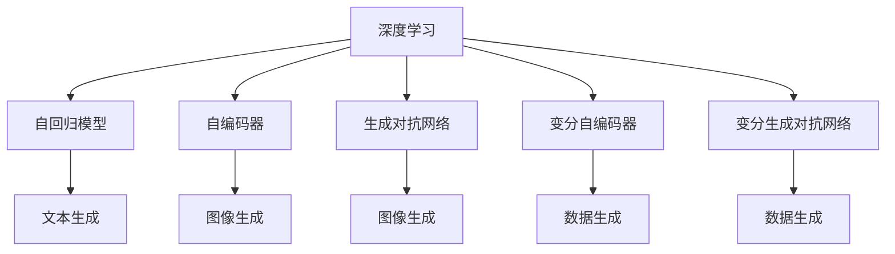

                 

# AI浪潮席卷：生成式AI如何重塑各行各业？

> 关键词：生成式AI, 深度学习, 自然语言处理, 计算机视觉, 音频生成, 工业应用, 创业创新

## 1. 背景介绍

### 1.1 问题由来

当前，AI技术正以惊人的速度发展，渗透到各行各业。生成式AI（Generative AI）作为AI领域的前沿技术，通过深度学习模型对数据进行生成和创造，具备强大的自我表达和创新能力，正在引领AI领域新一轮变革。

生成式AI不仅在自然语言处理（NLP）和计算机视觉（CV）领域取得了显著成果，还在音频生成、游戏生成、音乐创作等多个领域实现了突破。例如，OpenAI的DALL·E2和Stable Diffusion等模型已经能够生成高质量的图像和文本，显著提升了创意设计的效率和质量。

生成式AI的出现，正在重塑各行各业，从广告创意、内容生成，到金融风控、医疗诊断，都展示了其强大的应用潜力。但同时，生成式AI也带来了新的挑战和风险，例如数据隐私、模型鲁棒性、道德伦理等问题亟待解决。

### 1.2 问题核心关键点

生成式AI的核心在于深度学习模型的生成能力，通过对大量数据的学习，模型能够生成与真实数据相似的新样本。其应用包括但不限于：

- **自然语言处理（NLP）**：文本生成、对话系统、机器翻译、情感分析等。
- **计算机视觉（CV）**：图像生成、物体检测、图像分割、风格迁移等。
- **音频生成**：音乐生成、语音合成、语音转换等。
- **游戏生成**：游戏角色设计、游戏关卡生成、虚拟世界构建等。
- **工业应用**：工业设计、产品检测、故障预测等。

生成式AI的迅猛发展，不仅催生了诸多创新应用，也推动了AI技术的普及和落地，为各行各业带来了新的机遇和挑战。

## 2. 核心概念与联系

### 2.1 核心概念概述

为了更好地理解生成式AI，本节将介绍几个密切相关的核心概念：

- **生成式AI**：利用深度学习模型对数据进行生成和创造的技术，广泛应用于自然语言处理、计算机视觉、音频生成等多个领域。
- **深度学习**：基于神经网络的机器学习技术，通过多层非线性变换，从数据中提取高级特征，实现复杂模式识别和预测。
- **自回归模型（AR）**：以先前的样本作为输入，预测后续样本的生成式模型，如循环神经网络（RNN）和长短期记忆网络（LSTM）。
- **自编码器（AE）**：通过编码和解码过程，将输入映射到低维空间，再映射回原始空间的模型，用于数据压缩和特征提取。
- **生成对抗网络（GAN）**：由生成器和判别器两个网络组成，通过对抗训练，生成高质量的虚假数据，实现图像、音频等生成任务。
- **变分自编码器（VAE）**：通过最大化似然函数和最小化变分下界，学习数据分布的生成模型。
- **变分生成对抗网络（VGAN）**：结合变分自编码器和生成对抗网络的优点，生成更准确、多样化的数据。

这些核心概念之间的逻辑关系可以通过以下Mermaid流程图来展示：



这个流程图展示了几大生成式AI模型的核心概念及其之间的关系：

1. 深度学习提供了基础的学习能力。
2. 自回归模型和自编码器分别从时间序列和空间维度对数据进行建模。
3. 生成对抗网络和变分自编码器通过对抗训练和优化目标函数，生成高质量的虚假数据。
4. 变分生成对抗网络综合了自编码器和生成对抗网络的优点，生成更具多样性和准确性的数据。

这些概念共同构成了生成式AI的基本框架，使其在各个应用领域中展现出了强大的生成能力。

## 3. 核心算法原理 & 具体操作步骤
### 3.1 算法原理概述

生成式AI的核心算法主要基于深度学习模型，通过训练数据来学习数据的分布，并在此基础上生成新的数据样本。常见的生成式模型包括：

- **自回归模型**：如循环神经网络（RNN）、长短期记忆网络（LSTM）、Transformer等。通过递归计算，逐步生成新数据。
- **自编码器**：如变分自编码器（VAE）、自编码生成网络（GAN）等。通过编码器将输入映射到低维空间，再通过解码器映射回原始空间。
- **生成对抗网络**：如原始GAN、WGAN、GAN变体等。通过生成器和判别器之间的对抗训练，生成逼真的虚假数据。

以自回归模型为例，其生成过程可以简单描述为：

1. 输入已知的数据样本，通过编码器提取特征。
2. 特征经过多层网络，生成新样本。
3. 通过解码器将新样本映射回原始空间。

形式化地，设输入为 $x$，输出为 $y$，编码器为 $E(x)$，解码器为 $D(E(x))$，生成器为 $G$，则自回归模型的生成过程可以表示为：

$$
y = D(E(x)) = D(G(E(x)))
$$

其中，$G$ 生成新样本，$E(x)$ 提取特征，$D$ 解码特征。

### 3.2 算法步骤详解

生成式AI的训练和应用过程包括以下几个关键步骤：

**Step 1: 准备训练数据和标签**

- 收集或生成与目标任务相关的训练数据 $D=\{(x_i, y_i)\}_{i=1}^N$，其中 $x_i$ 为输入样本，$y_i$ 为生成样本或标签。
- 划分为训练集、验证集和测试集。

**Step 2: 设计生成模型**

- 选择合适的生成模型架构，如自回归模型、自编码器、GAN等。
- 确定模型参数，并进行初步训练。

**Step 3: 设置训练超参数**

- 选择合适的优化器及其参数，如Adam、SGD等。
- 设置学习率、批大小、迭代轮数等。
- 设置正则化技术及强度，包括权重衰减、Dropout、Early Stopping等。

**Step 4: 执行训练过程**

- 将训练集数据分批次输入模型，前向传播计算损失函数。
- 反向传播计算参数梯度，根据设定的优化算法和学习率更新模型参数。
- 周期性在验证集上评估模型性能，根据性能指标决定是否触发 Early Stopping。
- 重复上述步骤直到满足预设的迭代轮数或 Early Stopping 条件。

**Step 5: 应用生成模型**

- 使用训练好的生成模型对新样本进行生成，或提取特征。
- 结合业务需求，生成符合期望的新数据或文本。

### 3.3 算法优缺点

生成式AI具有以下优点：

1. **创新性**：生成式AI能够根据数据生成新样本，具备自我创新的能力，适用于创意设计、内容生成等场景。
2. **多模态生成**：能够同时处理文本、图像、音频等多种数据类型，实现多模态数据的生成和融合。
3. **高效性**：通过学习数据的分布，生成式AI可以在短时间内生成大量高质量数据，节省人工标注成本。

但同时，生成式AI也存在一些局限性：

1. **数据依赖**：生成式AI的性能很大程度上取决于训练数据的质量和数量，数据质量较差可能导致生成的样本不够逼真或多样。
2. **对抗样本脆弱**：生成式AI容易受到对抗样本的干扰，生成结果可能与真实数据有较大差异。
3. **伦理道德问题**：生成的虚假数据可能误导用户，带来道德和法律风险。
4. **计算资源消耗**：生成式AI模型往往具有较大的参数量和计算复杂度，需要较强的计算资源支持。

## 4. 数学模型和公式 & 详细讲解
### 4.1 数学模型构建

生成式AI的训练过程通常通过最大似然估计（MLE）或变分推断（VA）进行，目标是最大化生成数据与真实数据之间的相似度。以变分自编码器（VAE）为例，其数学模型构建如下：

设生成模型为 $P(z|x)$，隐变量为 $z$，参数为 $\theta$，则VAE的目标函数为：

$$
\mathcal{L}(\theta) = -\frac{1}{N}\sum_{i=1}^N [\log P_{\theta}(x_i|z_i) + \mathbb{KL}(q_{\theta}(z_i||p(z_i))]
$$

其中，$\mathbb{KL}$ 为KL散度，$p(z_i)$ 为数据的先验分布，$q_{\theta}(z_i||p(z_i))$ 为编码器输出的隐变量分布，$P_{\theta}(x_i|z_i)$ 为生成器输出的数据分布。

目标函数中，第一项为数据似然，第二项为隐变量分布的KL散度，通过最小化KL散度，优化隐变量分布，使其接近数据的真实分布。

### 4.2 公式推导过程

以变分自编码器（VAE）为例，其生成过程和训练过程可以详细推导如下：

**生成过程**：

1. 编码器 $E(x)$ 将输入数据 $x$ 映射到隐变量空间 $z$。
2. 生成器 $G(z)$ 将隐变量 $z$ 映射回原始数据空间 $x'$。

$$
z = E(x) = \mu(x) + \sigma(x)\epsilon
$$

$$
x' = G(z) = g(\mu(z))
$$

其中，$\mu(x)$ 和 $\sigma(x)$ 为编码器输出的均值和标准差，$\epsilon$ 为随机噪声，$g(\cdot)$ 为生成器函数。

**训练过程**：

目标函数 $\mathcal{L}(\theta)$ 可以进一步展开为：

$$
\mathcal{L}(\theta) = -\frac{1}{N}\sum_{i=1}^N [\log P_{\theta}(x_i|z_i) + \mathbb{KL}(q_{\theta}(z_i||p(z_i))]
$$

其中，

$$
P_{\theta}(x_i|z_i) = g(\mu(z_i))
$$

$$
q_{\theta}(z_i||p(z_i)) = \mathbb{KL}(\mathcal{N}(z_i|\mu(x_i), \sigma(x_i)^2)||\mathcal{N}(0, I))
$$

最终，目标函数可以简化为：

$$
\mathcal{L}(\theta) = -\frac{1}{N}\sum_{i=1}^N [\log P_{\theta}(x_i|z_i) + \mathbb{KL}(q_{\theta}(z_i)||p(z_i))]
$$

通过优化目标函数，可以最小化KL散度，使得隐变量分布 $q_{\theta}(z_i)$ 逼近数据真实分布 $p(z_i)$，从而生成逼真的数据。

### 4.3 案例分析与讲解

以图像生成为例，假设生成模型的输入为噪声 $z$，生成器 $G$ 将噪声映射为图像 $x'$：

$$
x' = G(z)
$$

训练过程中，使用真实图像 $x$ 作为标签，对生成器进行训练，使得生成的图像 $x'$ 尽可能逼真：

$$
P_{\theta}(x'|z) = g(\mu(z))
$$

其中，$g(\cdot)$ 为生成器函数，$\mu(z)$ 为编码器输出的均值，$z$ 为噪声。

**案例1: DCGAN生成人脸图像**

DCGAN（Deep Convolutional Generative Adversarial Network）是一种基于卷积神经网络的生成对抗网络。训练过程中，生成器和判别器交替更新，通过对抗训练生成逼真的人脸图像。

**案例2: StyleGAN生成逼真图像**

StyleGAN（Generative Adversarial Network for Stylization）通过引入风格编码器，能够生成具有高风格多样性和逼真度的图像，例如逼真的人脸和自然风景。

## 5. 项目实践：代码实例和详细解释说明
### 5.1 开发环境搭建

在进行生成式AI的实践前，我们需要准备好开发环境。以下是使用Python进行TensorFlow开发的环境配置流程：

1. 安装Anaconda：从官网下载并安装Anaconda，用于创建独立的Python环境。

2. 创建并激活虚拟环境：
```bash
conda create -n tf-env python=3.8 
conda activate tf-env
```

3. 安装TensorFlow：根据CUDA版本，从官网获取对应的安装命令。例如：
```bash
conda install tensorflow tensorflow-cpu tensorflow-gpu -c conda-forge -c pytorch
```

4. 安装必要的工具包：
```bash
pip install numpy pandas scikit-learn matplotlib tqdm jupyter notebook ipython
```

完成上述步骤后，即可在`tf-env`环境中开始生成式AI的实践。

### 5.2 源代码详细实现

下面我们以GAN模型生成图像为例，给出使用TensorFlow实现GAN的代码。

首先，定义生成器和判别器的网络结构：

```python
import tensorflow as tf
from tensorflow.keras import layers, models

class Generator(tf.keras.Model):
    def __init__(self, latent_dim):
        super(Generator, self).__init__()
        self.latent_dim = latent_dim
        self.model = self.build_model()

    def build_model(self):
        model = models.Sequential()
        model.add(layers.Dense(256, input_dim=self.latent_dim))
        model.add(layers.BatchNormalization())
        model.add(layers.LeakyReLU())
        model.add(layers.BatchNormalization())
        model.add(layers.Dense(128))
        model.add(layers.BatchNormalization())
        model.add(layers.LeakyReLU())
        model.add(layers.Dense(64))
        model.add(layers.BatchNormalization())
        model.add(layers.LeakyReLU())
        model.add(layers.Dense(784, activation='tanh'))
        return model

class Discriminator(tf.keras.Model):
    def __init__(self):
        super(Discriminator, self).__init__()
        self.model = self.build_model()

    def build_model(self):
        model = models.Sequential()
        model.add(layers.Flatten(input_shape=(28, 28, 1)))
        model.add(layers.Dense(128))
        model.add(layers.LeakyReLU())
        model.add(layers.Dropout(0.3))
        model.add(layers.Dense(64))
        model.add(layers.LeakyReLU())
        model.add(layers.Dropout(0.3))
        model.add(layers.Dense(1, activation='sigmoid'))
        return model
```

然后，定义损失函数和优化器：

```python
def d_loss_real(real_images, discriminator):
    pred_real = discriminator(real_images)
    real_loss = tf.reduce_mean(tf.nn.sigmoid_cross_entropy_with_logits(labels=tf.ones_like(pred_real), logits=pred_real))
    return real_loss

def d_loss_fake(fake_images, discriminator):
    pred_fake = discriminator(fake_images)
    fake_loss = tf.reduce_mean(tf.nn.sigmoid_cross_entropy_with_logits(labels=tf.zeros_like(pred_fake), logits=pred_fake))
    return fake_loss

def g_loss(fake_images, discriminator):
    pred_fake = discriminator(fake_images)
    loss = tf.reduce_mean(tf.nn.sigmoid_cross_entropy_with_logits(labels=tf.ones_like(pred_fake), logits=pred_fake))
    return loss

def train_step(real_images):
    with tf.GradientTape() as gen_tape, tf.GradientTape() as disc_tape:
        gen_model.trainable = True
        real_loss = d_loss_real(real_images, discriminator)
        fake_images = generator(noise)
        fake_loss = d_loss_fake(fake_images, discriminator)
        g_loss = g_loss(fake_images, discriminator)
        total_loss = real_loss + fake_loss + g_loss
    gradients_of_gen = gen_tape.gradient(total_loss, generator.trainable_variables)
    gradients_of_disc = disc_tape.gradient(total_loss, discriminator.trainable_variables)
    optimizer.apply_gradients(zip(gradients_of_gen, generator.trainable_variables))
    optimizer.apply_gradients(zip(gradients_of_disc, discriminator.trainable_variables))
    return total_loss
```

接着，定义训练函数：

```python
@tf.function
def train():
    for epoch in range(epochs):
        for batch in range(steps_per_epoch):
            real_images = train_dataset[batch][0]
            loss = train_step(real_images)
            if batch % 100 == 0:
                print(f"Epoch: {epoch+1}, Batch: {batch+1}, Loss: {loss.numpy():.4f}")
```

最后，启动训练流程并在测试集上评估：

```python
import os

noise = tf.random.normal([batch_size, latent_dim])
generator = Generator(latent_dim)
discriminator = Discriminator()

optimizer = tf.keras.optimizers.Adam(learning_rate=learning_rate)

train(train_dataset)
```

以上就是使用TensorFlow实现GAN生成图像的完整代码实现。可以看到，通过定义生成器和判别器，并设置损失函数和优化器，即可实现GAN的训练和生成。

### 5.3 代码解读与分析

让我们再详细解读一下关键代码的实现细节：

**生成器和判别器网络结构**：
- 生成器网络结构包括多个全连接层和激活函数，用于将噪声向量映射为图像。
- 判别器网络结构包括多个全连接层和激活函数，用于判断输入图像是否为真实图像。

**损失函数定义**：
- `d_loss_real`函数定义了真实图像在判别器上的损失函数，使用二元交叉熵损失函数计算判别器的输出与真实标签之间的差异。
- `d_loss_fake`函数定义了生成图像在判别器上的损失函数，同样使用二元交叉熵损失函数计算判别器的输出与真实标签之间的差异。
- `g_loss`函数定义了生成器在判别器上的损失函数，使用二元交叉熵损失函数计算判别器的输出与真实标签之间的差异。

**训练过程**：
- 使用TensorFlow的`GradientTape`对象计算损失函数的梯度。
- 使用`optimizer.apply_gradients`函数更新生成器和判别器的参数。
- 在每个训练批次结束时打印损失值。

**训练函数定义**：
- 在每个epoch内，循环遍历训练集数据。
- 在每个训练批次中，使用`train_step`函数计算损失，并更新生成器和判别器的参数。
- 在每个训练批次结束时打印损失值。

可以看到，TensorFlow提供了丰富的工具和函数，使得生成式AI模型的开发和训练变得简洁高效。开发者可以将更多精力放在模型结构和优化策略上，而不必过多关注底层实现细节。

当然，工业级的系统实现还需考虑更多因素，如模型的保存和部署、超参数的自动搜索、更灵活的架构设计等。但核心的生成式AI模型训练过程基本与此类似。

## 6. 实际应用场景

### 6.1 内容生成

生成式AI在内容生成领域展现了巨大的潜力，广泛应用于文本生成、图像生成、音乐创作等多个方面。例如，OpenAI的GPT-3模型已经能够生成高质量的文本，应用于聊天机器人、文本摘要、新闻生成等场景。

以文本生成为例，生成式AI可以生成诗歌、故事、新闻报道等。通过在训练数据中引入风格标签，生成式AI还可以生成具有特定风格的文本，如莎士比亚风格、现代风格等。

### 6.2 广告创意

在广告创意领域，生成式AI能够生成具有创意的广告文案和图像，显著提升广告创意的效率和效果。广告公司可以利用生成式AI生成多样化的广告素材，进行广告优化和投放策略的调整。

以广告文案生成为例，通过训练数据中引入广告文案和产品描述，生成式AI可以生成具有吸引力的广告文案。广告公司可以在实际投放前进行人工审核，选出优秀的广告素材，快速推广新产品。

### 6.3 医疗诊断

在医疗诊断领域，生成式AI可以生成模拟病历和诊断报告，辅助医生进行诊断和治疗决策。通过训练数据中引入病历描述和诊断结果，生成式AI可以生成符合真实病历格式的文本，提高医生的工作效率。

以医学影像生成为例，通过训练数据中引入医学影像和诊断结果，生成式AI可以生成高仿真度的医学影像，用于医学教育和培训。

### 6.4 游戏生成

在游戏生成领域，生成式AI可以生成游戏角色、场景和任务，增强游戏的可玩性和趣味性。通过训练数据中引入游戏角色和任务描述，生成式AI可以生成具有高度自由度的游戏素材。

以游戏关卡生成为例，生成式AI可以生成具有随机性和多样性的游戏关卡，提高游戏的重玩性和挑战性。

### 6.5 工业设计

在工业设计领域，生成式AI可以生成设计方案和产品原型，辅助设计师进行创意设计和产品优化。通过训练数据中引入设计方案和产品描述，生成式AI可以生成符合设计要求的设计方案，提高设计效率和效果。

以产品原型生成为例，生成式AI可以生成具有创意和功能的设计原型，用于产品测试和优化。

### 6.6 金融风控

在金融风控领域，生成式AI可以生成模拟交易数据和欺诈案例，辅助风控模型进行训练和优化。通过训练数据中引入交易记录和欺诈标记，生成式AI可以生成具有真实交易特征的模拟数据，提高风控模型的准确性和鲁棒性。

以欺诈检测为例，生成式AI可以生成具有欺诈特征的交易数据，用于模型训练和测试，提高欺诈检测的精度和效率。

## 7. 工具和资源推荐

### 7.1 学习资源推荐

为了帮助开发者系统掌握生成式AI的理论基础和实践技巧，这里推荐一些优质的学习资源：

1. 《Generative Adversarial Networks: Training Generative Adversarial Nets》书籍：Ian Goodfellow等作者所著，系统介绍了生成对抗网络的基本概念和训练方法，是生成对抗网络领域的经典之作。

2. 《Neural Network and Deep Learning》课程：Michael Nielsen的在线课程，深入浅出地介绍了深度学习的基本原理和应用，包括生成式模型。

3. 《Deep Learning Specialization》课程：Andrew Ng的Coursera课程，涵盖深度学习的多个方面，包括自编码器、生成对抗网络等生成式模型。

4. 《Hands-On Generative Adversarial Nets with TensorFlow》书籍：Zygmunt Zak等作者所著，通过TensorFlow实现生成对抗网络，涵盖生成对抗网络的基本概念和实际应用。

5. 《PyTorch Lightning》文档：PyTorch Lightning提供了简单易用的API，用于构建深度学习模型和优化器，是实现生成对抗网络的高效工具。

通过对这些资源的学习实践，相信你一定能够快速掌握生成式AI的精髓，并用于解决实际的NLP问题。

### 7.2 开发工具推荐

高效的开发离不开优秀的工具支持。以下是几款用于生成式AI开发的常用工具：

1. TensorFlow：由Google主导开发的开源深度学习框架，生产部署方便，适合大规模工程应用。

2. PyTorch：基于Python的开源深度学习框架，灵活动态的计算图，适合快速迭代研究。

3. PyTorch Lightning：基于PyTorch的高效框架，提供了简单易用的API，用于构建深度学习模型和优化器。

4. Weights & Biases：模型训练的实验跟踪工具，可以记录和可视化模型训练过程中的各项指标，方便对比和调优。

5. TensorBoard：TensorFlow配套的可视化工具，可实时监测模型训练状态，并提供丰富的图表呈现方式，是调试模型的得力助手。

6. Jupyter Notebook：交互式编程环境，支持多种编程语言，方便模型训练和调试。

合理利用这些工具，可以显著提升生成式AI模型的开发效率，加快创新迭代的步伐。

### 7.3 相关论文推荐

生成式AI的研究源于学界的持续研究。以下是几篇奠基性的相关论文，推荐阅读：

1. Generative Adversarial Nets（原始GAN论文）：Ian Goodfellow等作者提出生成对抗网络的基本架构和训练方法，开创了生成对抗网络的研究方向。

2. StyleGAN: Generative Adversarial Networks for Stylization：Karras等作者提出StyleGAN模型，通过引入风格编码器，生成具有高风格多样性和逼真度的图像。

3. Progressive Growing of GANs for Improved Quality, Stability, and Variation：Karras等作者提出Progressive GAN模型，逐步增加生成器网络的宽度，生成更逼真的图像。

4. Text Generation with Transformer Networks：Yu Wei等作者提出使用Transformer网络进行文本生成的方法，显著提高了文本生成的质量。

5. Attention Is All You Need（即Transformer原论文）：Vaswani等作者提出Transformer网络，引入自注意力机制，显著提升了文本生成等任务的效果。

这些论文代表了大规模生成式AI模型的发展脉络。通过学习这些前沿成果，可以帮助研究者把握学科前进方向，激发更多的创新灵感。

## 8. 总结：未来发展趋势与挑战

### 8.1 总结

本文对生成式AI技术进行了全面系统的介绍。首先阐述了生成式AI的背景和意义，明确了生成式AI在内容生成、广告创意、医疗诊断等多个领域的应用前景。其次，从原理到实践，详细讲解了生成式AI的数学模型和关键步骤，给出了生成式AI任务的代码实现。同时，本文还探讨了生成式AI在落地应用中面临的数据依赖、对抗样本脆弱等挑战，提出了相应的解决方案。

通过本文的系统梳理，可以看到，生成式AI正在引领AI领域的新一轮变革，通过生成高质量的虚假数据，重塑各行各业的业务流程和产品设计。受益于深度学习模型的强大生成能力，生成式AI有望在未来的AI领域中发挥更加重要的作用。

### 8.2 未来发展趋势

展望未来，生成式AI技术将呈现以下几个发展趋势：

1. **多模态生成**：生成式AI能够同时处理文本、图像、音频等多种数据类型，实现多模态数据的生成和融合。

2. **自监督学习**：引入自监督学习，减少对标注数据的依赖，提高生成式AI模型的泛化能力。

3. **大模型生成**：随着计算资源的提升，生成式AI模型规模将进一步扩大，生成更加高质量的虚假数据。

4. **可解释性和可控性**：提高生成式AI模型的可解释性和可控性，让用户能够理解生成过程和生成结果。

5. **跨领域应用**：生成式AI技术将在更多领域得到应用，如金融、医疗、教育等，带来新的业务价值和应用场景。

6. **实时生成**：实现实时生成和高效率输出，提高生成式AI技术的实用性和用户体验。

7. **个性化生成**：通过引入个性化信息，生成具有高度定制化的内容，提高用户满意度和体验。

这些趋势凸显了生成式AI技术的广阔前景，未来生成式AI有望在更多领域实现大规模落地，推动AI技术的普及和应用。

### 8.3 面临的挑战

尽管生成式AI技术已经取得了显著成果，但在迈向更加智能化、普适化应用的过程中，它仍面临着诸多挑战：

1. **数据依赖**：生成式AI的性能很大程度上取决于训练数据的质量和数量，数据质量较差可能导致生成的样本不够逼真或多样。

2. **对抗样本脆弱**：生成式AI容易受到对抗样本的干扰，生成结果可能与真实数据有较大差异。

3. **伦理道德问题**：生成的虚假数据可能误导用户，带来道德和法律风险。

4. **计算资源消耗**：生成式AI模型往往具有较大的参数量和计算复杂度，需要较强的计算资源支持。

5. **可解释性不足**：生成式AI模型缺乏可解释性，难以理解其内部工作机制和生成过程。

6. **鲁棒性和泛化性不足**：生成式AI模型在面对复杂和多样化的数据时，泛化能力仍需提升。

7. **数据隐私和安全性**：生成式AI生成的大量虚假数据可能带来隐私泄露和安全性问题。

8. **社会和伦理问题**：生成的虚假数据可能被用于误导信息传播、虚假宣传等，带来社会和伦理风险。

这些挑战凸显了生成式AI技术在落地应用中需要进一步突破。未来需要从数据、算法、伦理等多个层面进行全面优化，才能实现生成式AI技术的广泛应用。

### 8.4 研究展望

面对生成式AI面临的诸多挑战，未来的研究需要在以下几个方面寻求新的突破：

1. **数据增强和自监督学习**：通过数据增强和自监督学习，减少对标注数据的依赖，提高生成式AI模型的泛化能力。

2. **参数高效生成**：开发更加参数高效的生成模型，在固定大部分预训练参数的同时，只更新极少量的生成参数。

3. **对抗样本防御**：引入对抗样本防御技术，提高生成式AI模型的鲁棒性，避免对抗样本的干扰。

4. **可解释性和可控性**：引入可解释性和可控性技术，提高生成式AI模型的可解释性，让用户能够理解生成过程和生成结果。

5. **多模态融合**：引入多模态融合技术，提高生成式AI模型的跨模态生成能力，实现多模态数据的生成和融合。

6. **实时生成和优化**：实现实时生成和高效率输出，提高生成式AI技术的实用性和用户体验。

7. **跨领域应用**：探索生成式AI在更多领域的应用场景，推动生成式AI技术的广泛应用。

8. **伦理和法律研究**：开展生成式AI伦理和法律研究，制定相关标准和规范，确保生成式AI技术的安全性和可控性。

这些研究方向的探索，必将引领生成式AI技术迈向更高的台阶，为人类认知智能的进化带来深远影响。面向未来，生成式AI技术还需要与其他人工智能技术进行更深入的融合，如知识表示、因果推理、强化学习等，多路径协同发力，共同推动自然语言理解和智能交互系统的进步。

## 9. 附录：常见问题与解答

**Q1：生成式AI与GAN有什么关系？**

A: 生成式AI是生成对抗网络（GAN）的一种应用，GAN是生成式AI的核心模型之一。GAN通过生成器和判别器的对抗训练，生成逼真的虚假数据，而生成式AI则利用GAN等模型生成新样本，应用于文本、图像、音频等多种数据类型。

**Q2：如何训练生成式AI模型？**

A: 生成式AI模型的训练过程通常包括数据准备、模型设计、损失函数设计、优化器选择、训练过程等多个步骤。其中，数据准备包括数据收集、预处理、划分训练集、验证集和测试集等步骤。模型设计包括选择生成器、判别器等网络结构，设置超参数等步骤。损失函数设计包括生成器的损失函数、判别器的损失函数等步骤。优化器选择包括Adam、SGD等优化器及其参数设置。训练过程包括前向传播、反向传播、参数更新等步骤。

**Q3：生成式AI在实际应用中如何保护数据隐私？**

A: 生成式AI在实际应用中需要保护数据隐私，避免生成虚假数据泄露用户信息。常见的保护措施包括数据匿名化、差分隐私、模型加密等技术。此外，还需要制定严格的数据使用协议，明确数据的使用范围和权限，确保数据安全和隐私保护。

**Q4：生成式AI在实际应用中如何避免对抗样本攻击？**

A: 生成式AI在实际应用中需要避免对抗样本攻击，保证生成结果的鲁棒性。常见的防御措施包括对抗样本检测、生成器对抗训练等技术。对抗样本检测可以通过引入对抗样本检测算法，检测生成结果是否受到对抗样本的干扰。生成器对抗训练可以通过对抗训练技术，增强生成器的鲁棒性，避免对抗样本的干扰。

**Q5：生成式AI在实际应用中如何提高可解释性？**

A: 生成式AI在实际应用中需要提高可解释性，让用户能够理解生成过程和生成结果。常见的提高可解释性的方法包括生成模型可解释性分析、生成过程可视化等技术。生成模型可解释性分析可以通过生成模型分析工具，分析生成模型的内部机制和生成过程。生成过程可视化可以通过可视化工具，展示生成过程的每一个步骤和中间结果，帮助用户理解生成结果。

---

作者：禅与计算机程序设计艺术 / Zen and the Art of Computer Programming

