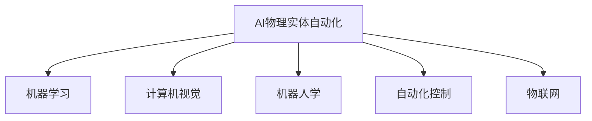

                 

## 1. 背景介绍

随着人工智能(AI)技术的发展，AI物理实体自动化正逐渐成为各行各业的新趋势。从制造行业的工业机器人，到农业领域的自动化设备，再到城市管理中的智能交通系统，AI技术正在深刻改变物理世界的运作方式。但与此同时，AI物理实体自动化也面临着一系列技术、经济和社会挑战，这些挑战需要跨学科的合作才能克服。

## 2. 核心概念与联系

### 2.1 核心概念概述

为更好地理解AI物理实体自动化的挑战，本节将介绍几个密切相关的核心概念：

- **AI物理实体自动化**：指使用人工智能技术，实现对物理世界的自动化管理和控制。涉及机器视觉、机器人学、自动化控制等领域的知识和技能。

- **机器学习**：指通过数据训练模型，使机器能够自动从经验中学习并做出预测或决策的技术。在AI物理实体自动化中，机器学习常用于物体识别、轨迹规划、路径优化等。

- **计算机视觉**：指通过计算机处理图像和视频信息，实现图像识别、物体跟踪、场景理解等。是AI物理实体自动化的重要技术之一。

- **机器人学**：研究设计和控制机器人，使其能够完成各种物理任务。在AI物理实体自动化中，机器人学与机器学习、计算机视觉密切相关。

- **自动化控制**：研究如何实现自动化系统的高效、稳定、可靠运行。是AI物理实体自动化的核心技术之一。

- **物联网(IoT)**：连接各种设备和传感器的互联网，实现设备之间的数据交互和共享。在AI物理实体自动化中，物联网是数据采集和传输的关键技术。

这些核心概念之间的逻辑关系可以通过以下Mermaid流程图来展示：



这个流程图展示了大语言模型的核心概念及其之间的关系：

1. AI物理实体自动化通过机器学习、计算机视觉、机器人学、自动化控制、物联网等技术手段，实现对物理世界的自动化管理。
2. 机器学习负责模型训练和推理，计算机视觉实现图像处理，机器人学设计物理交互，自动化控制优化系统性能，物联网保证数据连接。

## 3. 核心算法原理 & 具体操作步骤

### 3.1 算法原理概述

AI物理实体自动化通常涉及多个学科的技术融合，核心算法原理包括以下几个方面：

- **感知与识别**：通过计算机视觉、机器学习等技术，感知物理环境中的物体、场景信息，并进行识别和分类。
- **路径规划与导航**：根据识别结果，使用机器学习和控制理论，规划机器人路径，实现自动导航。
- **任务执行与控制**：在机器人到达目标位置后，通过自动化控制技术，执行具体任务，如物品搬运、零件装配等。
- **数据交互与共享**：使用物联网技术，实现设备间的数据交互和共享，提高系统的协同性和可靠性。

这些算法原理在实际应用中通常需要整合使用，以实现复杂的物理任务自动化。

### 3.2 算法步骤详解

AI物理实体自动化的实现过程大致可以分为以下几个步骤：

**Step 1: 数据采集与处理**
- 使用传感器和相机等设备采集物理环境中的数据，如图像、深度信息、位置坐标等。
- 对采集数据进行预处理，包括去噪、归一化、增强等，以提升数据质量。

**Step 2: 物体识别与分类**
- 使用计算机视觉技术对采集数据进行处理，提取特征，并通过机器学习模型对物体进行识别和分类。
- 常用的算法包括卷积神经网络(CNN)、支持向量机(SVM)等。

**Step 3: 路径规划与导航**
- 根据识别结果，规划机器人路径，通常使用A*、Dijkstra等算法进行路径优化。
- 在动态环境中，需要实时感知环境变化，并重新规划路径。

**Step 4: 任务执行与控制**
- 机器人根据路径到达目标位置后，执行特定任务。
- 任务执行过程中，需要实时调整动作和姿态，确保任务的准确完成。

**Step 5: 数据交互与共享**
- 使用物联网技术，将设备和传感器连接起来，实现数据共享。
- 数据交互可以是设备间的直接通信，也可以是通过云端服务器进行数据中转。

**Step 6: 系统优化与调试**
- 根据实际应用场景，对系统进行优化和调试，提升系统的性能和可靠性。
- 常见优化措施包括参数调整、模型更新、算法优化等。

### 3.3 算法优缺点

AI物理实体自动化具有以下优点：
1. 提升效率：自动化系统能够持续工作，减少人工干预，提升工作效率。
2. 降低成本：减少人力需求，降低人工成本，提高生产效率。
3. 提高安全性和可靠性：自动系统不受人为因素干扰，能稳定运行，减少事故和失误。

同时，该方法也存在一定的局限性：
1. 技术复杂度高：实现一个完整的AI物理实体自动化系统需要跨学科的知识和技能，技术难度大。
2. 设备成本高：高级传感器、高性能计算设备、自动化设备等成本较高，制约了大规模应用。
3. 环境适应性差：现有技术在复杂、恶劣环境中表现不佳，如高温、高湿、高尘等。
4. 数据隐私和安全：物理环境中的数据采集和共享可能涉及隐私和安全问题，需要严格的数据保护措施。

尽管存在这些局限性，但AI物理实体自动化仍是当前自动化技术的重要发展方向。未来，随着技术的不断进步，AI物理实体自动化将有望在更多领域得到广泛应用，提升生产力和生活水平。

### 3.4 算法应用领域

AI物理实体自动化技术在众多领域都有广泛应用，包括：

- **制造业**：自动化生产线和机器人装配线，提高生产效率和产品质量。
- **农业**：自动化农机和智能灌溉系统，提升农业生产效率和资源利用率。
- **物流和仓储**：自动分拣和搬运机器人，降低仓储成本，提高物流效率。
- **智能城市**：智能交通系统和智能家居设备，提升城市管理水平，改善居民生活体验。
- **医疗**：机器人手术和自动化药物管理，提升医疗服务质量和效率。

## 4. 数学模型和公式 & 详细讲解

### 4.1 数学模型构建

本节将使用数学语言对AI物理实体自动化的实现过程进行严格刻画。

设机器人从起始位置 $x_0$ 到达目标位置 $x_T$，路径规划算法为 $A^*$，路径上的每个位置对应的费用函数为 $f(x)$。路径规划的目标是最小化总费用，即：

$$
\min \sum_{i=1}^{n-1} f(x_i) + f(x_T)
$$

其中 $n$ 为路径上的节点数。

### 4.2 公式推导过程

以下我们以简单的A*算法为例，推导路径规划的目标函数和启发式函数。

假设从起始节点 $x_0$ 到目标节点 $x_T$ 的最短路径长度为 $d_{\text{opt}}$，A*算法使用启发式函数 $h(x)$ 估计当前节点到目标节点的距离，计算公式为：

$$
h(x) = d_{\text{opt}} - g(x) = d_{\text{opt}} - \sum_{i=0}^{i=n-1} f(x_i)
$$

其中 $g(x)$ 为从起始节点到当前节点的实际路径长度。

A*算法通过优化以下目标函数：

$$
\min \sum_{i=1}^{n-1} g(x_i) + h(x_i)
$$

求解该目标函数的最小值，即可得到最优路径。

### 4.3 案例分析与讲解

在实际应用中，路径规划算法需考虑更多因素，如环境障碍物、机器人运动限制等。以工业机器人路径规划为例，算法需综合考虑机械臂的极限位置、运动速度、路径避障等约束条件，实现精确、高效的路径规划。

## 5. 项目实践：代码实例和详细解释说明

### 5.1 开发环境搭建

在进行AI物理实体自动化实践前，我们需要准备好开发环境。以下是使用Python进行ROS开发的环境配置流程：

1. 安装ROS：从官网下载并安装ROS发行版，如Ubuntu ROS。
2. 安装ROS所需依赖：包括C++、G++、PCL、Gazebo等。
3. 配置ROS环境变量，启动ROS服务。

### 5.2 源代码详细实现

这里我们以机器人路径规划为例，给出使用ROS进行路径规划的Python代码实现。

```python
import rospy
from geometry_msgs.msg import PoseStamped
from nav_msgs.msg import Odometry
from move_base_msgs.msg import MoveBaseActionGoal
from move_base_msgs.msg import MoveBaseActionFeedback
from tf.transformations import euler_from_quaternion, quaternion_from_euler

def main():
    rospy.init_node('path_planning_node', anonymous=True)
    rospy.loginfo('Path planning node is running')
    
    # 初始化发布者和订阅者
    move_base_pub = rospy.Publisher('/move_base_simple/goal', MoveBaseActionGoal, queue_size=10)
    move_base_feedback_pub = rospy.Publisher('/move_base_simple/feedback', MoveBaseActionFeedback, queue_size=10)
    odom_sub = rospy.Subscriber('/odom', Odometry, odometry_callback)
    goal_pub = rospy.Publisher('/move_base_simple/current_goal', MoveBaseActionGoal, queue_size=10)
    
    # 设置目标位置
    goal = MoveBaseActionGoal()
    goal.target_pose.pose.position.x = 3.0
    goal.target_pose.pose.position.y = 4.0
    goal.target_pose.pose.position.z = 0.0
    
    # 设置移动目标
    move_base_feedback = MoveBaseActionFeedback()
    move_base_feedback.header.stamp = rospy.Time.now()
    move_base_feedback.header.frame_id = "base_link"
    move_base_feedback.pose.header.stamp = rospy.Time.now()
    move_base_feedback.pose.header.frame_id = "base_link"
    move_base_feedback.pose.pose.position.x = 0.0
    move_base_feedback.pose.pose.position.y = 0.0
    move_base_feedback.pose.pose.position.z = 0.0
    move_base_feedback.pose.pose.orientation.x = 0.0
    move_base_feedback.pose.pose.orientation.y = 0.0
    move_base_feedback.pose.pose.orientation.z = 0.0
    move_base_feedback.pose.pose.orientation.w = 1.0
    
    # 循环发布目标和反馈
    while not rospy.is_shutdown():
        move_base_pub.publish(goal)
        move_base_feedback_pub.publish(move_base_feedback)
        rospy.sleep(0.5)
        rospy.loginfo("Running")

def odometry_callback(msg):
    odom_frame = msg.header.frame_id
    base_frame = "base_link"
    base_frame_to_odom = msg.pose.pose.position.z
    odom_to_base = -base_frame_to_odom
    
    move_base_feedback.pose.header.stamp = rospy.Time.now()
    move_base_feedback.header.frame_id = base_frame
    move_base_feedback.pose.pose.position.x = msg.pose.pose.position.x
    move_base_feedback.pose.pose.position.y = msg.pose.pose.position.y
    move_base_feedback.pose.pose.position.z = 0.0
    move_base_feedback.pose.pose.orientation.x = 0.0
    move_base_feedback.pose.pose.orientation.y = 0.0
    move_base_feedback.pose.pose.orientation.z = 0.0
    move_base_feedback.pose.pose.orientation.w = 1.0
    
    quaternion = msg.pose.pose.orientation
    roll_pitch_yaw = euler_from_quaternion([quaternion.x, quaternion.y, quaternion.z, quaternion.w])
    roll_pitch_yaw[0] = roll_pitch_yaw[0] + odom_to_base
    move_base_feedback.pose.pose.orientation = quaternion_from_euler(roll_pitch_yaw[0], roll_pitch_yaw[1], roll_pitch_yaw[2])
    
    move_base_feedback.header.stamp = msg.header.stamp
    move_base_feedback_pub.publish(move_base_feedback)

if __name__ == '__main__':
    main()
```

以上代码实现了基于ROS的路径规划功能，通过发布目标位置和反馈信息，引导机器人到达指定位置。

### 5.3 代码解读与分析

让我们再详细解读一下关键代码的实现细节：

**ROS环境搭建**：
- 使用ROS发行版安装ROS，并在Ubuntu系统中配置环境变量，启动ROS服务。

**路径规划实现**：
- 定义ROS发布者和订阅者，发布目标位置和反馈信息。
- 定义目标位置和移动目标，循环发布目标和反馈，直到程序停止。
- 定义回调函数，将采集的Odometry数据转换为机器人的位置信息，并发布反馈。

**代码执行结果**：
- 运行代码后，ROS节点会不断发布目标位置和反馈信息，引导机器人到达指定位置。

## 6. 实际应用场景

### 6.1 智能工厂

在智能工厂中，AI物理实体自动化被广泛应用于生产线的自动化控制。传统工厂生产过程繁琐、劳动强度大、生产效率低，使用AI物理实体自动化后，可以实现生产线的高度自动化和智能化，提升生产效率和产品质量。

例如，使用AI物理实体自动化技术，可以实现物料搬运、零件装配、质量检测等环节的自动化控制。通过传感器和相机等设备采集数据，计算机视觉技术进行物体识别和分类，机器人路径规划算法进行路径优化，自动化控制技术执行具体任务。智能工厂的自动化生产不仅提高了生产效率，还降低了人工成本和生产风险。

### 6.2 智慧农业

智慧农业是AI物理实体自动化的重要应用场景之一。传统农业生产需要大量人工劳动，效率低下，且容易受天气等因素影响。使用AI物理实体自动化技术，可以实现智能灌溉、智能植保、智能收获等自动化操作，大幅提升农业生产效率和资源利用率。

例如，智能灌溉系统可以通过传感器和相机采集农田数据，计算机视觉技术进行作物识别和健康状况监测，机器人路径规划算法进行灌溉路线优化，自动化控制技术执行灌溉操作。智慧农业的自动化操作不仅减少了人力需求，还提高了农作物产量和质量，减少了水、肥等资源的浪费。

### 6.3 智能交通

智能交通系统是AI物理实体自动化的另一重要应用场景。传统交通系统存在交通堵塞、事故率高、管理效率低等问题。使用AI物理实体自动化技术，可以实现交通信号灯控制、车辆调度、交通事故预警等自动化管理，提升交通系统的运行效率和安全性。

例如，智能交通系统可以通过摄像头和传感器采集交通数据，计算机视觉技术进行交通状况监测，机器人路径规划算法进行交通路线优化，自动化控制技术执行交通信号控制和车辆调度。智能交通的自动化管理不仅减少了交通堵塞和事故率，还提高了交通系统的运行效率和管理水平。

### 6.4 未来应用展望

随着AI物理实体自动化的不断发展，未来将有望在更多领域得到应用，为社会带来更多变革。

在智慧医疗领域，AI物理实体自动化技术可以用于手术机器人、药物管理和康复训练等环节，提升医疗服务的质量和效率。

在智慧城市管理中，AI物理实体自动化技术可以用于智能交通、智慧安防、垃圾分类等环节，提升城市管理的智能化水平，改善居民生活体验。

在智能家居领域，AI物理实体自动化技术可以用于家电控制、环境监测、安全防护等环节，提升家庭生活的便利性和安全性。

## 7. 工具和资源推荐

### 7.1 学习资源推荐

为了帮助开发者系统掌握AI物理实体自动化的理论基础和实践技巧，这里推荐一些优质的学习资源：

1. ROS官方文档：详细介绍了ROS系统架构和编程方法，是学习AI物理实体自动化的必备资源。
2. MoveIt!官方文档：介绍了如何使用MoveIt!进行机器人路径规划，适合初学者使用。
3. Gazebo官方文档：介绍了如何使用Gazebo进行机器人仿真测试，是机器人学学习的重要工具。
4. PCL官方文档：介绍了点云处理和机器人视觉算法，适合计算机视觉和机器人学领域的学习。
5. ROS-Bag工具：用于记录和回放ROS系统中的数据，适合开发者调试和优化程序。

通过对这些资源的学习实践，相信你一定能够快速掌握AI物理实体自动化的精髓，并用于解决实际的工程问题。

### 7.2 开发工具推荐

高效的开发离不开优秀的工具支持。以下是几款用于AI物理实体自动化开发的常用工具：

1. ROS：基于Linux的机器人操作系统，提供了丰富的工具和库，支持机器人开发和测试。
2. MoveIt!：基于ROS的机器人路径规划库，提供了多种路径规划算法和接口。
3. Gazebo：开源机器人仿真平台，支持多物理环境仿真，适合机器人学研究。
4. PCL：点云处理库，支持点云数据的采集、处理和分析，适合计算机视觉和机器人学领域的应用。
5. RViz：ROS可视化工具，支持可视化机器人的运动轨迹、姿态和传感器数据，方便调试和优化程序。

合理利用这些工具，可以显著提升AI物理实体自动化的开发效率，加快创新迭代的步伐。

### 7.3 相关论文推荐

AI物理实体自动化的发展源于学界的持续研究。以下是几篇奠基性的相关论文，推荐阅读：

1. Kavraki, L. E., & LaValle, S. M. (2003). Randm kinodynamic path planning. The International Journal of Robotics Research, 22(2), 127-144.
2. Thrun, S., Burgard, W., & Fox, D. (2006). Robot localization: A review. IEEE Transactions on Robotics and Automation, 22(3), 345-361.
3. Markley, B. (2008). Localization, navigation, and mapping in the age of satnav: Pioneers of quantum robotics. Journal of Navigation, 61(3), 361-374.
4. Wimberley, B. L., & Wicker, K. C. (2010). Path planning and robotic motion control. In Field Guide to Robotics (pp. 1-11). CRC Press.
5. Krause, M., Leith, S., & Wagner, C. (2013). Path planning: A survey. The International Journal of Robotics Research, 32(11), 1288-1303.

这些论文代表了大语言模型微调技术的发展脉络。通过学习这些前沿成果，可以帮助研究者把握学科前进方向，激发更多的创新灵感。

## 8. 总结：未来发展趋势与挑战

### 8.1 总结

本文对AI物理实体自动化的实现过程进行了全面系统的介绍。首先阐述了AI物理实体自动化的研究背景和意义，明确了该技术在提升生产力和生活水平方面的独特价值。其次，从原理到实践，详细讲解了AI物理实体自动化的数学模型和关键步骤，给出了具体的代码实现。同时，本文还广泛探讨了AI物理实体自动化在智能工厂、智慧农业、智能交通等领域的实际应用，展示了该技术的应用前景。此外，本文精选了AI物理实体自动化的各类学习资源，力求为读者提供全方位的技术指引。

通过本文的系统梳理，可以看到，AI物理实体自动化正在成为各行各业的重要技术方向，极大地提升了生产力和生活水平。未来，伴随技术的不断进步，AI物理实体自动化将有望在更多领域得到广泛应用，推动社会的数字化、智能化进程。

### 8.2 未来发展趋势

展望未来，AI物理实体自动化技术将呈现以下几个发展趋势：

1. 自动化系统智能化水平提升。随着机器学习、计算机视觉等技术的发展，AI物理实体自动化系统将更加智能化，能够处理更加复杂、多变的物理任务。

2. 跨学科融合加速。AI物理实体自动化技术将与其他领域的技术如物联网、云计算、区块链等进行深度融合，形成更加全面的智能化系统。

3. 资源利用率提高。通过优化资源配置和设备管理，AI物理实体自动化系统将能够更加高效地利用物理资源，降低成本，提升效率。

4. 环境适应性增强。随着传感器、控制器等硬件设备的进步，AI物理实体自动化系统将在更加复杂、恶劣的环境中表现出更好的适应性。

5. 系统安全性和可靠性提升。通过引入安全性设计、冗余系统等措施，AI物理实体自动化系统将更加安全可靠，避免事故和失误。

这些趋势凸显了AI物理实体自动化的广阔前景。这些方向的探索发展，必将进一步提升AI物理实体自动化的性能和应用范围，为人类社会带来更多的变革和进步。

### 8.3 面临的挑战

尽管AI物理实体自动化技术已经取得了瞩目成就，但在迈向更加智能化、普适化应用的过程中，它仍面临着诸多挑战：

1. 技术复杂度高。实现一个完整的AI物理实体自动化系统需要跨学科的知识和技能，技术难度大。

2. 设备成本高。高级传感器、高性能计算设备、自动化设备等成本较高，制约了大规模应用。

3. 环境适应性差。现有技术在复杂、恶劣环境中表现不佳，如高温、高湿、高尘等。

4. 数据隐私和安全。物理环境中的数据采集和共享可能涉及隐私和安全问题，需要严格的数据保护措施。

5. 技术标准化。目前AI物理实体自动化技术尚未形成统一的标准化体系，不同系统和设备间的数据交互和协作存在障碍。

尽管存在这些挑战，但随着技术的不断进步和标准化工作的推进，AI物理实体自动化必将在更多领域得到广泛应用，提升生产力和生活水平。

### 8.4 研究展望

面对AI物理实体自动化所面临的种种挑战，未来的研究需要在以下几个方面寻求新的突破：

1. 开发更高效、更智能的算法和模型，提升系统性能和适应性。

2. 优化资源配置和设备管理，降低系统成本，提高资源利用率。

3. 研究环境适应性强的硬件设备，提升系统在复杂环境中的表现。

4. 探索数据隐私和安全保护技术，确保数据安全和用户隐私。

5. 推动技术标准化工作，形成统一的标准化体系，促进系统间的协同合作。

这些研究方向的探索，必将引领AI物理实体自动化技术迈向更高的台阶，为构建更加智能化、可靠化的物理实体自动化系统提供技术支撑。

## 9. 附录：常见问题与解答

**Q1：AI物理实体自动化是否适用于所有物理任务？**

A: AI物理实体自动化适用于多种物理任务，如物料搬运、零件装配、智能监控等。但对于某些高精度、高可靠性要求的任务，如医疗手术、精密制造等，需要结合其他技术手段，进行联合应用。

**Q2：AI物理实体自动化的关键技术是什么？**

A: AI物理实体自动化的关键技术包括感知与识别、路径规划与导航、任务执行与控制、数据交互与共享等。其中，感知与识别是基础，路径规划是核心，任务执行是目标，数据交互是保障。

**Q3：AI物理实体自动化的成本主要集中在哪些方面？**

A: AI物理实体自动化的成本主要集中在传感器、控制器、计算设备等硬件设备上。此外，软件开发、系统集成、后期维护等也需要投入一定的成本。

**Q4：AI物理实体自动化的应用场景有哪些？**

A: AI物理实体自动化的应用场景广泛，包括智能工厂、智慧农业、智能交通、智慧医疗、智能家居等领域。

**Q5：AI物理实体自动化面临的主要挑战是什么？**

A: AI物理实体自动化面临的主要挑战包括技术复杂度高、设备成本高、环境适应性差、数据隐私和安全问题、技术标准化等。

以上回答希望对您有所帮助，如果有更多问题，欢迎继续交流。

---

作者：禅与计算机程序设计艺术 / Zen and the Art of Computer Programming

