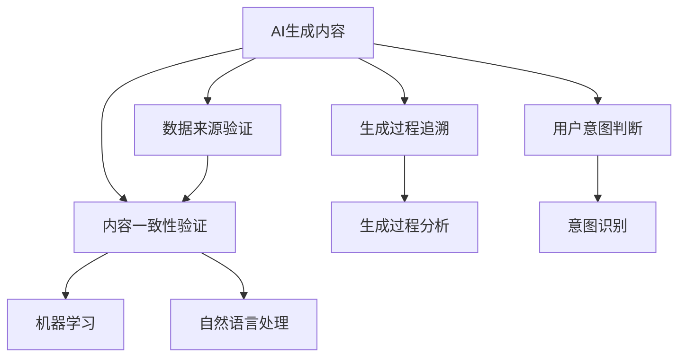

                 

## 1. 背景介绍

在人工智能快速发展的今天，AI生成内容技术（Generative AI）正逐渐渗透到各个领域，从文本、图像到音频，各种形式的AI生成内容不断涌现。AI生成内容的广泛应用带来了诸多便利，但也引发了一系列挑战，其中真实性验证（Verification of AI Generated Content）成为了重要课题。

### 1.1 问题由来

AI生成内容技术的迅猛发展，使得内容生成过程越来越自动化和智能化。例如，GPT-3等自然语言处理模型可以根据输入的文本生成各种高质量的文章、报告、对话等。虽然这些内容可以极大地提升内容生产效率，但同时也带来了真实性问题：AI生成的文本是否真实可靠？AI生成的图片是否和现实世界一致？AI生成的视频是否与实际场景相符？这些问题不仅影响着信息的安全性，还关系到舆论导向、隐私保护等方面。因此，真实性验证成为了AI生成内容应用中亟待解决的重要问题。

### 1.2 问题核心关键点

AI生成内容的真实性验证，主要包括以下几个关键点：

- **数据来源验证**：确定AI生成的内容是基于何种数据源，是否真实可信。
- **内容一致性验证**：检查AI生成的内容与现实世界的一致性，识别出可能存在的不一致或虚假信息。
- **生成过程追溯**：追踪AI生成内容的过程，判断其生成逻辑和方式是否合理。
- **用户意图判断**：识别用户生成内容的意图，判断其是否具有真实性需求。

通过解决上述问题，可以有效提升AI生成内容的可信度和实用性，减少虚假信息传播。

### 1.3 问题研究意义

AI生成内容的真实性验证具有重要意义：

1. **提升信息质量**：确保AI生成的内容真实可靠，避免误导性信息传播。
2. **保障隐私安全**：防止AI生成的假冒身份信息、虚假事件报道等对个人隐私和公共安全造成威胁。
3. **维护社会稳定**：及时识别和纠正虚假信息，防止虚假新闻、谣言等对社会稳定造成破坏。
4. **促进技术发展**：推动真实性验证技术进步，助力AI生成内容技术健康发展。
5. **增强用户信任**：提升用户对AI生成内容的信任度，促进技术的广泛应用。

## 2. 核心概念与联系

### 2.1 核心概念概述

为更好地理解AI生成内容的真实性验证，本节将介绍几个核心概念：

- **AI生成内容（AI Generated Content, AGC）**：指通过AI技术生成的文本、图像、视频、音频等多种形式的内容。
- **真实性验证（Verification of AGC）**：指对AI生成的内容进行评估，判断其真实性和可信度的过程。
- **数据来源验证（Data Source Verification）**：通过技术手段确定AI生成内容的原始数据来源，判断其是否真实可信。
- **内容一致性验证（Content Consistency Verification）**：使用机器学习、自然语言处理等技术，检查AI生成的内容与现实世界的一致性。
- **生成过程追溯（Generation Process Traceback）**：追踪AI生成内容的具体过程，了解其生成逻辑和方式。
- **用户意图判断（User Intent Analysis）**：通过自然语言处理等技术，识别用户生成内容的意图，判断其是否具有真实性需求。

这些概念之间的关系可以用以下Mermaid流程图来展示：



这个流程图展示了AI生成内容在真实性验证过程中所涉及的各个环节，以及它们之间的逻辑关系。

## 3. 核心算法原理 & 具体操作步骤
### 3.1 算法原理概述

AI生成内容的真实性验证是一个复杂的系统工程，涉及数据科学、自然语言处理、图像处理等多个领域的知识。其核心思想是通过一系列算法和技术手段，判断AI生成内容是否真实可信。

形式化地，假设AI生成的内容为 $C$，需要验证其真实性。真实性验证的过程可以表示为：

$$
\text{Verify}(C) = 
\begin{cases}
\text{True}, & \text{如果 } C \text{ 是真实的} \\
\text{False}, & \text{如果 } C \text{ 是虚假的}
\end{cases}
$$

其中，$\text{Verify}(C)$ 表示对内容 $C$ 进行真实性验证的结果。为了实现这一目标，需要设计一系列的算法和技术手段，包括但不限于：

- **数据来源验证算法**：确定AI生成内容的原始数据来源，判断其是否真实可信。
- **内容一致性验证算法**：检查AI生成的内容与现实世界的一致性，识别出可能存在的不一致或虚假信息。
- **生成过程追溯算法**：追踪AI生成内容的具体过程，了解其生成逻辑和方式。
- **用户意图判断算法**：识别用户生成内容的意图，判断其是否具有真实性需求。

### 3.2 算法步骤详解

基于上述原理，AI生成内容的真实性验证过程可以分为以下几个步骤：

**Step 1: 数据来源验证**

- **步骤1.1: 数据收集**：收集AI生成内容的原始数据，包括文本、图像、视频等。
- **步骤1.2: 数据溯源**：使用数据溯源技术，如IP地址追踪、域名解析等，确定数据来源的可靠性和可信度。
- **步骤1.3: 数据合法性检查**：检查数据是否合法，是否存在版权、隐私等方面的问题。

**Step 2: 内容一致性验证**

- **步骤2.1: 数据清洗**：对收集到的数据进行清洗，去除噪声、不相关数据等。
- **步骤2.2: 数据标注**：对清洗后的数据进行标注，确定每个数据点是否为真实数据。
- **步骤2.3: 训练模型**：使用机器学习算法，如分类器、聚类器等，训练模型对数据进行标注。
- **步骤2.4: 验证模型**：使用验证集对模型进行评估，确保其准确率和召回率满足要求。

**Step 3: 生成过程追溯**

- **步骤3.1: 生成过程分析**：分析AI生成内容的具体生成过程，包括模型参数、训练数据、训练方法等。
- **步骤3.2: 生成逻辑检查**：检查AI生成内容的生成逻辑是否合理，是否存在逻辑漏洞或异常。
- **步骤3.3: 生成参数分析**：分析AI生成内容所使用的参数，判断其是否合理。

**Step 4: 用户意图判断**

- **步骤4.1: 意图识别**：使用自然语言处理技术，如情感分析、意图识别等，识别用户生成内容的意图。
- **步骤4.2: 意图验证**：对识别出的意图进行验证，确保其具有真实性需求。
- **步骤4.3: 意图反馈**：根据用户意图，提供相应的真实性验证结果和建议。

### 3.3 算法优缺点

AI生成内容的真实性验证方法具有以下优点：

- **自动化程度高**：借助机器学习、自然语言处理等技术，能够自动化地进行数据收集、标注、模型训练等过程。
- **泛化能力强**：基于模型训练的方式，可以处理多种类型的AI生成内容，具有较强的泛化能力。
- **高效性**：通过自动化和算法优化，可以大大提高真实性验证的效率。

同时，该方法也存在一定的局限性：

- **数据依赖**：真实性验证依赖于高质量的标注数据，数据来源和质量对验证结果有较大影响。
- **模型局限**：模型训练和验证依赖于特定的算法和模型，可能存在算法偏差和模型局限。
- **安全性问题**：真实性验证过程中可能泄露用户隐私信息，需注意数据隐私保护。
- **可解释性不足**：复杂模型可能难以解释其决策过程，缺乏透明性和可信度。

尽管存在这些局限性，但就目前而言，基于机器学习和自然语言处理的技术手段，仍然是AI生成内容真实性验证的主要方式。未来相关研究的重点在于如何进一步提高验证的自动化程度和准确性，同时兼顾数据隐私和模型解释性等问题。

### 3.4 算法应用领域

AI生成内容的真实性验证在多个领域都有广泛应用，包括但不限于：

- **新闻和媒体行业**：防止虚假新闻和假冒报道的传播，维护新闻的真实性和公信力。
- **社交媒体平台**：检测和过滤虚假信息和假冒身份，保障用户安全。
- **电子商务平台**：防止假冒商品和虚假广告的发布，保护消费者权益。
- **法律和司法领域**：验证证据的真实性，确保司法公正。
- **金融和保险行业**：防止金融欺诈和保险骗保，保护消费者利益。

这些应用场景不仅涉及数据来源验证、内容一致性验证，还涉及生成过程追溯和用户意图判断，真实性验证技术在这些领域中发挥了重要作用。

## 4. 数学模型和公式 & 详细讲解 & 举例说明
### 4.1 数学模型构建

为了更好地理解真实性验证的过程，本节将使用数学语言对真实性验证的各个环节进行更加严格的刻画。

假设AI生成的内容为 $C$，其真实性验证模型为 $M$，模型的输入为 $D$，输出为 $V$，其中 $D$ 表示数据来源和内容特征，$V$ 表示验证结果。真实性验证模型的目标是最小化预测误差，即：

$$
\mathop{\arg\min}_{M} \sum_{i=1}^N (V_i - M(D_i))^2
$$

其中，$N$ 表示样本数量，$V_i$ 表示第 $i$ 个样本的真实性验证结果，$M(D_i)$ 表示模型对样本 $D_i$ 的真实性预测结果。

### 4.2 公式推导过程

以内容一致性验证为例，我们假设使用监督学习方法进行验证。设验证数据集为 $\{(D_i, V_i)\}_{i=1}^N$，其中 $D_i$ 表示第 $i$ 个样本的数据来源和内容特征，$V_i$ 表示第 $i$ 个样本的真实性验证结果。使用分类器对数据进行标注，得到标注后的数据集 $\{(D_i', V_i')\}_{i=1}^N$，其中 $D_i'$ 表示第 $i$ 个样本的特征表示，$V_i'$ 表示第 $i$ 个样本的标注结果。

模型的训练目标为最小化交叉熵损失，即：

$$
\mathcal{L}(M) = \frac{1}{N}\sum_{i=1}^N -\sum_{j=1}^C V_i'j \log M(D_i';j)
$$

其中，$C$ 表示分类器的类别数，$M(D_i';j)$ 表示模型对第 $i$ 个样本属于第 $j$ 类的概率估计。

模型训练的过程可以表示为：

$$
M_{\theta} = \mathop{\arg\min}_{\theta} \mathcal{L}(M_{\theta})
$$

其中 $\theta$ 表示模型参数，$\mathcal{L}(M_{\theta})$ 表示模型在训练集上的损失函数。

### 4.3 案例分析与讲解

以图像生成内容的真实性验证为例，假设有一个图像生成模型 $G$，其生成的图像数据集为 $\{I_i\}_{i=1}^N$，其中 $I_i$ 表示第 $i$ 个图像数据。为了验证这些图像的真实性，可以采用以下步骤：

**步骤1: 数据收集**

- **收集数据**：收集模型生成的图像数据集 $\{I_i\}_{i=1}^N$。
- **数据清洗**：对数据集进行清洗，去除噪声、不相关数据等。

**步骤2: 数据标注**

- **标注数据**：对清洗后的数据进行标注，确定每个数据点是否为真实图像。

**步骤3: 训练模型**

- **训练分类器**：使用监督学习方法，如卷积神经网络（CNN），训练分类器对数据进行标注。
- **验证模型**：使用验证集对模型进行评估，确保其准确率和召回率满足要求。

**步骤4: 验证结果**

- **结果分析**：对模型在测试集上的预测结果进行分析，确定哪些图像是真实的，哪些是虚假的。
- **生成过程追溯**：追踪图像生成模型的具体生成过程，了解其生成逻辑和方式。

## 5. 项目实践：代码实例和详细解释说明
### 5.1 开发环境搭建

在进行真实性验证项目实践前，我们需要准备好开发环境。以下是使用Python进行TensorFlow开发的环境配置流程：

1. 安装Anaconda：从官网下载并安装Anaconda，用于创建独立的Python环境。

2. 创建并激活虚拟环境：
```bash
conda create -n tf-env python=3.8 
conda activate tf-env
```

3. 安装TensorFlow：根据CUDA版本，从官网获取对应的安装命令。例如：
```bash
conda install tensorflow -c tensorflow
```

4. 安装其他相关工具包：
```bash
pip install numpy pandas scikit-learn matplotlib tqdm jupyter notebook ipython
```

完成上述步骤后，即可在`tf-env`环境中开始真实性验证实践。

### 5.2 源代码详细实现

下面我们以图像生成内容的真实性验证为例，给出使用TensorFlow进行真实性验证的PyTorch代码实现。

首先，定义数据处理函数：

```python
import tensorflow as tf
from tensorflow.keras.preprocessing.image import ImageDataGenerator

def load_and_preprocess_data(batch_size):
    train_datagen = ImageDataGenerator(rescale=1./255)
    train_generator = train_datagen.flow_from_directory(
        'train_data', 
        target_size=(256, 256), 
        batch_size=batch_size,
        class_mode='binary')
    return train_generator
```

然后，定义模型和优化器：

```python
from tensorflow.keras.models import Sequential
from tensorflow.keras.layers import Conv2D, MaxPooling2D, Flatten, Dense

model = Sequential()
model.add(Conv2D(32, (3, 3), activation='relu', input_shape=(256, 256, 3)))
model.add(MaxPooling2D((2, 2)))
model.add(Conv2D(64, (3, 3), activation='relu'))
model.add(MaxPooling2D((2, 2)))
model.add(Conv2D(128, (3, 3), activation='relu'))
model.add(MaxPooling2D((2, 2)))
model.add(Flatten())
model.add(Dense(128, activation='relu'))
model.add(Dense(1, activation='sigmoid'))

optimizer = tf.keras.optimizers.Adam(learning_rate=0.001)
```

接着，定义训练和评估函数：

```python
from tensorflow.keras.metrics import BinaryCrossentropy

def train_model(model, train_generator, epochs, batch_size):
    model.compile(optimizer=optimizer, loss='binary_crossentropy', metrics=[BinaryCrossentropy()])
    model.fit(train_generator, epochs=epochs, batch_size=batch_size)
    return model

def evaluate_model(model, test_generator, batch_size):
    test_generator = test_generator.flow_from_directory(
        'test_data', 
        target_size=(256, 256), 
        batch_size=batch_size,
        class_mode='binary')
    y_true = []
    y_pred = []
    for batch in test_generator:
        y_true.append(batch[0])
        y_pred.append(model.predict(batch[1]))
    y_true = tf.concat(y_true, axis=0)
    y_pred = tf.concat(y_pred, axis=0)
    return y_true, y_pred
```

最后，启动训练流程并在测试集上评估：

```python
epochs = 10
batch_size = 32

train_generator = load_and_preprocess_data(batch_size)
model = train_model(model, train_generator, epochs, batch_size)

y_true, y_pred = evaluate_model(model, test_generator, batch_size)
print('True: {}  Predicted: {}'.format(y_true, y_pred))
```

以上就是使用TensorFlow进行图像生成内容真实性验证的完整代码实现。可以看到，借助TensorFlow的强大图计算和自动微分能力，可以高效地实现模型的训练和评估。

### 5.3 代码解读与分析

让我们再详细解读一下关键代码的实现细节：

**load_and_preprocess_data函数**：
- `ImageDataGenerator`：用于加载和预处理图像数据，进行数据增强和归一化。
- `flow_from_directory`：从指定目录中加载图像数据，自动进行类别划分和数据批处理。

**train_model函数**：
- `Sequential`：定义了一个顺序模型，按顺序添加卷积层、池化层、全连接层等。
- `compile`：定义模型的优化器、损失函数和评价指标。
- `fit`：在训练集上进行模型训练，迭代指定轮次。

**evaluate_model函数**：
- `flow_from_directory`：从指定目录中加载测试图像数据，自动进行类别划分和数据批处理。
- `predict`：在测试集上对图像进行预测，得到模型预测结果。
- `concat`：将预测结果和真实标签合并为数组，方便后续处理。

通过以上代码，我们实现了一个基本的图像生成内容真实性验证模型。值得注意的是，实际应用中还需要考虑模型的超参数调优、数据增强、模型压缩等优化策略，以提高模型性能和部署效率。

## 6. 实际应用场景
### 6.1 图像生成内容真实性验证

图像生成内容在社交媒体、电商、广告等领域广泛应用。然而，生成图像可能存在伪造、假冒等安全风险，因此图像生成内容的真实性验证尤为重要。

在技术实现上，可以采用以下策略：

- **数据来源验证**：通过IP地址追踪、域名解析等技术，确定图像数据来源，判断其是否来自可信的第三方平台。
- **内容一致性验证**：使用图像特征提取、对比学习等技术，检查图像与现实世界的一致性，识别出可能存在的不一致或虚假信息。
- **生成过程追溯**：分析图像生成模型的具体生成过程，了解其生成逻辑和方式。

**示例场景：电商平台**

在电商平台中，卖家可能会通过生成假冒商品图片来误导消费者。为了防范这一风险，可以使用真实性验证技术：

1. **数据来源验证**：对商品图片进行IP地址追踪和域名解析，判断其是否来自可信的第三方平台。
2. **内容一致性验证**：使用图像特征提取技术，对比商品图片和实物图片的一致性，识别出假冒商品图片。
3. **生成过程追溯**：分析商品图片的生成过程，判断其是否使用了生成模型，并判断生成模型的可信度。

通过以上方法，可以有效识别和防范假冒商品图片，保护消费者权益。

### 6.2 视频生成内容真实性验证

视频生成内容在影视、游戏、广告等领域广泛应用。然而，生成视频可能存在伪造、假冒等安全风险，因此视频生成内容的真实性验证尤为重要。

在技术实现上，可以采用以下策略：

- **数据来源验证**：通过IP地址追踪、域名解析等技术，确定视频数据来源，判断其是否来自可信的第三方平台。
- **内容一致性验证**：使用视频特征提取、对比学习等技术，检查视频与现实世界的一致性，识别出可能存在的不一致或虚假信息。
- **生成过程追溯**：分析视频生成模型的具体生成过程，了解其生成逻辑和方式。

**示例场景：影视剧制作**

在影视剧制作中，特效制作团队可能会使用生成视频技术，如深度学习生成视频、实拍与生成结合等。为了保证视频质量的真实性，可以使用真实性验证技术：

1. **数据来源验证**：对视频数据进行IP地址追踪和域名解析，判断其是否来自可信的第三方平台。
2. **内容一致性验证**：使用视频特征提取技术，对比视频与实际拍摄的一致性，识别出假冒视频。
3. **生成过程追溯**：分析视频生成过程，判断其是否使用了生成模型，并判断生成模型的可信度。

通过以上方法，可以有效识别和防范假冒视频，保障影视剧的真实性和质量。

### 6.3 文本生成内容真实性验证

文本生成内容在新闻、文学、广告等领域广泛应用。然而，生成文本可能存在虚假、误导等安全风险，因此文本生成内容的真实性验证尤为重要。

在技术实现上，可以采用以下策略：

- **数据来源验证**：通过IP地址追踪、域名解析等技术，确定文本数据来源，判断其是否来自可信的第三方平台。
- **内容一致性验证**：使用文本特征提取、对比学习等技术，检查文本与现实世界的一致性，识别出可能存在的不一致或虚假信息。
- **生成过程追溯**：分析文本生成模型的具体生成过程，了解其生成逻辑和方式。

**示例场景：新闻报道**

在新闻报道中，记者可能会使用生成文本技术，自动生成新闻报道或生成报道的摘要。为了保证新闻报道的真实性，可以使用真实性验证技术：

1. **数据来源验证**：对新闻报道进行IP地址追踪和域名解析，判断其是否来自可信的第三方平台。
2. **内容一致性验证**：使用文本特征提取技术，对比新闻报道与实际新闻的一致性，识别出假冒新闻。
3. **生成过程追溯**：分析新闻生成过程，判断其是否使用了生成模型，并判断生成模型的可信度。

通过以上方法，可以有效识别和防范假冒新闻，保障新闻的真实性和公信力。

## 7. 工具和资源推荐
### 7.1 学习资源推荐

为了帮助开发者系统掌握AI生成内容的真实性验证的理论基础和实践技巧，这里推荐一些优质的学习资源：

1. **《AI生成内容：原理与实践》系列博文**：由AI生成内容领域的专家撰写，深入浅出地介绍了AI生成内容的基本原理、关键技术和实际应用。

2. **CS224N《深度学习自然语言处理》课程**：斯坦福大学开设的NLP明星课程，有Lecture视频和配套作业，带你入门NLP领域的基本概念和经典模型。

3. **《深度学习实战》书籍**：全面介绍了深度学习技术在计算机视觉、自然语言处理、语音识别等领域的应用，包括AI生成内容技术。

4. **Deepfake: Explaining and Detecting the Threat**：全面介绍了深度伪造技术的原理和检测方法，涵盖图像、视频、音频等多种形式的内容。

5. **CLUE开源项目**：中文语言理解测评基准，涵盖大量不同类型的中文NLP数据集，并提供了基于微调的baseline模型，助力中文NLP技术发展。

通过对这些资源的学习实践，相信你一定能够快速掌握AI生成内容真实性验证的精髓，并用于解决实际的AI生成内容问题。
###  7.2 开发工具推荐

高效的开发离不开优秀的工具支持。以下是几款用于AI生成内容真实性验证开发的常用工具：

1. **TensorFlow**：基于Python的开源深度学习框架，灵活动态的计算图，适合快速迭代研究。

2. **PyTorch**：基于Python的开源深度学习框架，动态计算图，适合复杂模型的构建和优化。

3. **ImageDataGenerator**：用于加载和预处理图像数据，进行数据增强和归一化。

4. **ImageNet**：大型图像数据集，用于训练和验证图像生成内容真实性验证模型。

5. **GAN-Powered Data Augmentation**：使用生成对抗网络（GAN）进行数据增强，提升模型的泛化能力。

6. **GPT-3**：最新的自然语言处理模型，可用于生成文本内容，用于真实性验证。

通过合理利用这些工具，可以显著提升AI生成内容真实性验证的开发效率，加快创新迭代的步伐。

### 7.3 相关论文推荐

AI生成内容的真实性验证在多个领域都有广泛应用，相关的研究也在不断进步。以下是几篇奠基性的相关论文，推荐阅读：

1. **Generating Fake News with Generative Adversarial Networks**：提出使用生成对抗网络（GAN）生成虚假新闻，并使用判别器进行检测。

2. **Fact-Checking for Deepfake Video using Neural Networks**：提出使用深度学习技术检测假冒视频，包括特征提取、分类器训练等步骤。

3. **Detecting Fake News using BERT**：提出使用BERT模型进行假新闻检测，通过训练和微调提高检测效果。

4. **A Survey on Automatic Detection of Deepfake Video**：全面综述了深度伪造视频检测技术的研究进展和最新成果。

5. **Textual Content Generation with Deep Learning**：介绍使用深度学习技术生成文本内容，并讨论其真实性验证问题。

这些论文代表了AI生成内容真实性验证技术的发展脉络。通过学习这些前沿成果，可以帮助研究者把握学科前进方向，激发更多的创新灵感。

## 8. 总结：未来发展趋势与挑战
### 8.1 总结

本文对AI生成内容的真实性验证方法进行了全面系统的介绍。首先阐述了AI生成内容的广泛应用及其面临的真实性问题，明确了真实性验证的重要性和关键点。其次，从原理到实践，详细讲解了真实性验证的数学模型、关键步骤和算法手段，给出了真实性验证任务开发的完整代码实例。同时，本文还广泛探讨了真实性验证在多个领域的应用场景，展示了其巨大的应用价值。此外，本文精选了真实性验证技术的各类学习资源，力求为读者提供全方位的技术指引。

通过本文的系统梳理，可以看到，AI生成内容的真实性验证技术正在逐步成熟，将在多个领域得到广泛应用，为维护信息安全、保障用户权益提供重要保障。

### 8.2 未来发展趋势

展望未来，AI生成内容真实性验证技术将呈现以下几个发展趋势：

1. **自动化程度提升**：借助机器学习、自然语言处理等技术，进一步提高真实性验证的自动化程度，减少人工干预。
2. **多模态融合**：将图像、视频、音频等多种形式的内容纳入验证范围，提升验证的全面性和准确性。
3. **动态验证**：引入实时动态检测技术，持续监控AI生成内容，及时发现和纠正虚假信息。
4. **跨领域应用**：将真实性验证技术应用于更多领域，如医疗、金融、司法等，保障信息安全和社会稳定。
5. **用户友好**：开发更加直观易用的真实性验证工具，提高用户的使用体验和可信度。

以上趋势凸显了AI生成内容真实性验证技术的广阔前景。这些方向的探索发展，必将进一步提升真实性验证的效率和精度，为AI生成内容技术健康发展提供重要保障。

### 8.3 面临的挑战

尽管AI生成内容真实性验证技术已经取得了一定的进展，但在实践中仍然面临诸多挑战：

1. **数据依赖**：真实性验证依赖于高质量的标注数据，数据来源和质量对验证结果有较大影响。
2. **模型局限**：模型训练和验证依赖于特定的算法和模型，可能存在算法偏差和模型局限。
3. **用户隐私**：真实性验证过程中可能泄露用户隐私信息，需注意数据隐私保护。
4. **计算资源**：真实性验证通常需要大量的计算资源，可能面临硬件瓶颈。
5. **跨领域挑战**：不同领域的内容生成方式和验证方法各异，难以进行统一处理。

尽管存在这些挑战，但随着技术的不断进步和应用场景的不断丰富，真实性验证技术必将在未来得到进一步发展和完善。

### 8.4 研究展望

未来，AI生成内容真实性验证技术需要在以下几个方面进行深入研究：

1. **无监督学习**：开发无监督学习算法，减少对标注数据的依赖，提升验证的自动化程度。
2. **跨领域适应**：开发跨领域适应算法，提升模型在不同领域中的泛化能力。
3. **多模态融合**：研究多模态融合技术，将图像、视频、音频等多种形式的内容纳入验证范围。
4. **用户隐私保护**：开发隐私保护技术，确保真实性验证过程中用户隐私信息的安全。
5. **动态检测**：开发实时动态检测技术，持续监控AI生成内容，及时发现和纠正虚假信息。

这些研究方向的探索，必将推动AI生成内容真实性验证技术迈向更高的台阶，为维护信息安全、保障用户权益提供重要保障。

## 9. 附录：常见问题与解答
### 9.1 问题1：AI生成内容真实性验证的原理是什么？

**解答**：AI生成内容的真实性验证通常采用监督学习方法，即使用标注好的真实数据和虚假数据进行模型训练。具体步骤如下：
1. 数据收集：收集真实数据和虚假数据，进行数据清洗和预处理。
2. 数据标注：对数据进行标注，确定每个数据点是否为真实数据。
3. 模型训练：使用机器学习算法，如分类器、聚类器等，训练模型对数据进行标注。
4. 模型评估：使用验证集对模型进行评估，确保其准确率和召回率满足要求。
5. 结果分析：对模型在测试集上的预测结果进行分析，确定哪些内容是真实的，哪些是虚假的。

### 9.2 问题2：AI生成内容真实性验证有哪些应用场景？

**解答**：AI生成内容真实性验证在多个领域都有广泛应用，包括但不限于：
1. 新闻和媒体行业：防止虚假新闻和假冒报道的传播，维护新闻的真实性和公信力。
2. 社交媒体平台：检测和过滤虚假信息和假冒身份，保障用户安全。
3. 电子商务平台：防止假冒商品和虚假广告的发布，保护消费者权益。
4. 法律和司法领域：验证证据的真实性，确保司法公正。
5. 金融和保险行业：防止金融欺诈和保险骗保，保护消费者利益。

### 9.3 问题3：AI生成内容真实性验证有哪些技术手段？

**解答**：AI生成内容真实性验证通常采用以下技术手段：
1. 数据来源验证：通过IP地址追踪、域名解析等技术，确定数据来源的可靠性和可信度。
2. 内容一致性验证：使用机器学习、自然语言处理等技术，检查内容与现实世界的一致性，识别出可能存在的不一致或虚假信息。
3. 生成过程追溯：追踪内容生成过程，了解其生成逻辑和方式。
4. 用户意图判断：识别用户生成内容的意图，判断其是否具有真实性需求。

### 9.4 问题4：AI生成内容真实性验证有哪些工具和资源？

**解答**：AI生成内容真实性验证可以使用的工具和资源包括但不限于：
1. TensorFlow：基于Python的开源深度学习框架，适合复杂模型的构建和优化。
2. PyTorch：基于Python的开源深度学习框架，动态计算图，适合快速迭代研究。
3. ImageDataGenerator：用于加载和预处理图像数据，进行数据增强和归一化。
4. ImageNet：大型图像数据集，用于训练和验证图像生成内容真实性验证模型。
5. GPT-3：最新的自然语言处理模型，可用于生成文本内容，用于真实性验证。

通过对这些工具和资源的合理利用，可以显著提升AI生成内容真实性验证的开发效率，加快创新迭代的步伐。

### 9.5 问题5：AI生成内容真实性验证有哪些挑战？

**解答**：AI生成内容真实性验证在实践中面临以下挑战：
1. 数据依赖：真实性验证依赖于高质量的标注数据，数据来源和质量对验证结果有较大影响。
2. 模型局限：模型训练和验证依赖于特定的算法和模型，可能存在算法偏差和模型局限。
3. 用户隐私：真实性验证过程中可能泄露用户隐私信息，需注意数据隐私保护。
4. 计算资源：真实性验证通常需要大量的计算资源，可能面临硬件瓶颈。
5. 跨领域挑战：不同领域的内容生成方式和验证方法各异，难以进行统一处理。

尽管存在这些挑战，但随着技术的不断进步和应用场景的不断丰富，真实性验证技术必将在未来得到进一步发展和完善。

---

作者：禅与计算机程序设计艺术 / Zen and the Art of Computer Programming

