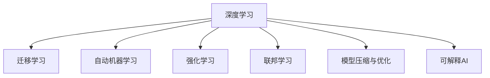

                 

# AI编程的新思维与技术挑战

## 1. 背景介绍

### 1.1 问题由来
当前，人工智能（AI）编程正面临着前所未有的技术变革和应用挑战。从传统的机器学习和深度学习，到新兴的强化学习、迁移学习和自动机器学习（AutoML），AI编程范式的迭代更新极大地提升了模型的表现力和自动化程度。然而，随着模型的复杂度不断攀升，AI编程面临的工程挑战也在不断加剧。

### 1.2 问题核心关键点
当前AI编程的核心挑战主要体现在以下几个方面：

1. **模型复杂性提升**：大模型的参数量和计算复杂度不断增长，增加了训练和推理的难度。
2. **数据需求激增**：越来越多的应用场景需要依赖大规模标注数据，数据获取和标注成本高昂。
3. **计算资源需求增加**：高性能计算资源如GPU/TPU等成为瓶颈，优化资源利用效率成为关键。
4. **模型可解释性需求增强**：AI应用场景对模型决策的可解释性和透明度的要求越来越高。
5. **应用场景多样化**：AI技术的应用场景从传统的计算机视觉、自然语言处理扩展到医疗、金融、智能制造等更多领域。

### 1.3 问题研究意义
研究AI编程的新思维与技术挑战，对于提升AI技术的工程可实现性和应用落地速度，具有重要意义：

1. **提升模型性能**：优化AI编程范式和工具，提高模型的训练效率和性能。
2. **降低成本**：减少数据和计算资源的消耗，降低AI应用的成本。
3. **促进应用普及**：通过自动化和高效的AI编程工具，加速AI技术在各个行业的应用。
4. **增强模型可解释性**：确保AI决策的透明性和可理解性，提升用户信任和满意度。

## 2. 核心概念与联系

### 2.1 核心概念概述

为更好地理解AI编程的新思维与技术挑战，本节将介绍几个密切相关的核心概念：

- **深度学习**：基于神经网络的机器学习模型，通过多层非线性变换提取特征，广泛应用于图像识别、语音识别、自然语言处理等领域。
- **迁移学习**：利用已有模型在特定任务上的知识，在新任务上进行微调，加速模型训练和提高模型性能。
- **自动机器学习（AutoML）**：利用自动化技术进行模型选择、超参数调优和特征工程等，降低人工干预，提高AI应用的效率和可扩展性。
- **强化学习**：通过与环境的交互，优化模型策略，广泛应用于游戏、机器人控制、自动驾驶等场景。
- **联邦学习**：在分布式环境下，各参与方在不共享本地数据的情况下，协同训练模型，保护隐私和安全。
- **模型压缩与优化**：通过量化、剪枝、蒸馏等技术，减少模型参数和计算量，提升模型效率和资源利用率。
- **可解释AI（XAI）**：研究如何使AI模型的决策过程透明、可解释，增强用户信任和模型鲁棒性。

这些核心概念之间的逻辑关系可以通过以下Mermaid流程图来展示：



这个流程图展示了几大AI编程核心概念及其之间的关系：

1. 深度学习作为基础，通过迁移学习和自动机器学习进行模型优化和加速。
2. 强化学习在特定的交互式场景中表现优异，而联邦学习则适应分布式数据处理。
3. 模型压缩与优化进一步提升了模型的效率和资源利用率。
4. 可解释AI为模型决策过程提供了透明性和可理解性，增强了用户信任和模型鲁棒性。

## 3. 核心算法原理 & 具体操作步骤
### 3.1 算法原理概述

AI编程的新思维与技术挑战，涉及多个前沿算法和技术的结合应用。其核心思想是：通过优化算法和工具，提升模型的训练效率和性能，同时降低资源消耗和成本，增强模型的可解释性和透明度。

形式化地，假设有一项AI编程任务，其目标是通过优化模型和数据，提高模型在特定任务上的性能，即：

$$
\maximize \mathcal{P}(M, D) \text{ subject to } \mathcal{C}(M, D)
$$

其中，$M$ 表示模型，$D$ 表示数据，$\mathcal{P}$ 表示性能指标，$\mathcal{C}$ 表示约束条件，如计算资源、数据隐私等。

优化目标是通过调整模型结构和参数，以及优化数据处理流程，最大化性能指标，同时满足约束条件。

### 3.2 算法步骤详解

AI编程的新思维与技术挑战，主要包括以下几个关键步骤：

**Step 1: 模型选择与预处理**
- 选择合适的深度学习模型，如卷积神经网络（CNN）、循环神经网络（RNN）、Transformer等，根据任务特性设计合适的网络结构和层数。
- 对数据进行预处理，包括数据增强、标准化、归一化等，提升数据质量和模型训练效果。

**Step 2: 迁移学习与微调**
- 利用迁移学习，利用已有模型在特定任务上的知识，进行模型微调，加速模型训练。
- 使用正则化技术，如L2正则、Dropout、Early Stopping等，防止模型过拟合。
- 应用对抗训练，引入对抗样本，提高模型鲁棒性和泛化能力。

**Step 3: 超参数调优与自动化**
- 利用自动机器学习工具，进行超参数自动调优，如网格搜索、贝叶斯优化等，找到最优超参数组合。
- 使用自动化工具，如Hyperopt、MLflow等，管理模型训练和部署流程，提高模型开发效率。

**Step 4: 模型压缩与优化**
- 使用量化、剪枝、蒸馏等技术，减少模型参数和计算量，提升模型效率和资源利用率。
- 使用混合精度训练和模型并行化等技术，优化模型计算图和资源分配。

**Step 5: 模型评估与部署**
- 使用评估指标，如准确率、召回率、F1分数等，评估模型性能。
- 将模型封装为服务或API接口，方便在实际应用中进行调用和集成。

### 3.3 算法优缺点

AI编程的新思维与技术挑战，具有以下优点：
1. 提升模型性能：通过优化算法和工具，加速模型训练，提升模型性能。
2. 降低成本：减少数据和计算资源的消耗，降低AI应用的成本。
3. 促进应用普及：通过自动化和高效的AI编程工具，加速AI技术在各个行业的应用。
4. 增强模型可解释性：确保AI决策的透明性和可理解性，提升用户信任和满意度。

同时，该方法也存在一定的局限性：
1. 对数据的依赖性：AI编程依赖于高质量的标注数据，数据获取和标注成本较高。
2. 模型的可解释性：虽然部分模型和工具可以增强模型可解释性，但仍有部分复杂模型难以解释。
3. 资源限制：高性能计算资源如GPU/TPU等成为瓶颈，优化资源利用效率成为关键。
4. 算法复杂度：优化算法和工具的选择和调优，需要较高的专业知识和经验。

尽管存在这些局限性，但就目前而言，AI编程的新思维与技术挑战仍是AI应用的主流范式。未来相关研究的重点在于如何进一步降低AI编程对标注数据的依赖，提高模型的可解释性，优化资源利用效率，同时兼顾算法的复杂度。

### 3.4 算法应用领域

AI编程的新思维与技术挑战，在多个领域得到了广泛应用，例如：

- **计算机视觉**：如图像分类、目标检测、人脸识别等任务，利用迁移学习和自动机器学习进行模型优化。
- **自然语言处理**：如文本分类、情感分析、机器翻译等任务，通过迁移学习和预训练模型加速模型训练。
- **语音识别**：如语音转文本、语音命令识别等任务，利用深度学习模型和迁移学习进行优化。
- **自动驾驶**：如目标检测、路径规划、行为预测等任务，结合强化学习和联邦学习进行模型优化。
- **医疗诊断**：如医学影像分析、疾病预测等任务，通过迁移学习和可解释AI进行模型优化。

除了上述这些经典任务外，AI编程的新思维与技术挑战还被创新性地应用到更多场景中，如智能制造、智能家居、智慧城市等，为各行各业带来变革性影响。

## 4. 数学模型和公式 & 详细讲解 & 举例说明（备注：数学公式请使用latex格式，latex嵌入文中独立段落使用 $$，段落内使用 $)
### 4.1 数学模型构建

本节将使用数学语言对AI编程的新思维与技术挑战进行更加严格的刻画。

假设有一项计算机视觉任务的训练数据集为 $D=\{(x_i, y_i)\}_{i=1}^N, x_i \in \mathbb{R}^m, y_i \in \{0,1\}$，其中 $x_i$ 为输入图像，$y_i$ 为图像标签。模型的目标是通过优化模型参数 $\theta$，最小化损失函数 $\mathcal{L}(\theta, D)$，即：

$$
\theta^* = \mathop{\arg\min}_{\theta} \mathcal{L}(\theta, D)
$$

其中，$\mathcal{L}(\theta, D)$ 为模型的损失函数，可以选用交叉熵损失、均方误差损失等。模型的优化目标是通过调整模型参数 $\theta$，最小化损失函数 $\mathcal{L}(\theta, D)$，提升模型性能。

### 4.2 公式推导过程

以下我们以图像分类任务为例，推导交叉熵损失函数及其梯度的计算公式。

假设模型 $M_{\theta}$ 在输入 $x$ 上的输出为 $\hat{y}=M_{\theta}(x) \in [0,1]$，表示样本属于正类的概率。真实标签 $y \in \{0,1\}$。则二分类交叉熵损失函数定义为：

$$
\ell(M_{\theta}(x),y) = -[y\log \hat{y} + (1-y)\log (1-\hat{y})]
$$

将其代入损失函数公式，得：

$$
\mathcal{L}(\theta) = -\frac{1}{N}\sum_{i=1}^N [y_i\log M_{\theta}(x_i)+(1-y_i)\log(1-M_{\theta}(x_i))]
$$

根据链式法则，损失函数对参数 $\theta_k$ 的梯度为：

$$
\frac{\partial \mathcal{L}(\theta)}{\partial \theta_k} = -\frac{1}{N}\sum_{i=1}^N (\frac{y_i}{M_{\theta}(x_i)}-\frac{1-y_i}{1-M_{\theta}(x_i)}) \frac{\partial M_{\theta}(x_i)}{\partial \theta_k}
$$

其中 $\frac{\partial M_{\theta}(x_i)}{\partial \theta_k}$ 可进一步递归展开，利用自动微分技术完成计算。

在得到损失函数的梯度后，即可带入参数更新公式，完成模型的迭代优化。重复上述过程直至收敛，最终得到适应特定任务的最优模型参数 $\theta^*$。

## 5. 项目实践：代码实例和详细解释说明
### 5.1 开发环境搭建

在进行AI编程实践前，我们需要准备好开发环境。以下是使用Python进行TensorFlow开发的环境配置流程：

1. 安装Anaconda：从官网下载并安装Anaconda，用于创建独立的Python环境。

2. 创建并激活虚拟环境：
```bash
conda create -n tf-env python=3.8 
conda activate tf-env
```

3. 安装TensorFlow：根据CUDA版本，从官网获取对应的安装命令。例如：
```bash
conda install tensorflow==2.7 -c conda-forge
```

4. 安装Keras：
```bash
pip install keras
```

5. 安装各类工具包：
```bash
pip install numpy pandas scikit-learn matplotlib tqdm jupyter notebook ipython
```

完成上述步骤后，即可在`tf-env`环境中开始AI编程实践。

### 5.2 源代码详细实现

这里我们以图像分类任务为例，给出使用TensorFlow进行模型训练的PyTorch代码实现。

首先，定义模型和优化器：

```python
from tensorflow.keras import layers, models

def build_model(input_shape, num_classes):
    model = models.Sequential([
        layers.Conv2D(32, (3,3), activation='relu', input_shape=input_shape),
        layers.MaxPooling2D((2,2)),
        layers.Conv2D(64, (3,3), activation='relu'),
        layers.MaxPooling2D((2,2)),
        layers.Conv2D(128, (3,3), activation='relu'),
        layers.MaxPooling2D((2,2)),
        layers.Flatten(),
        layers.Dense(512, activation='relu'),
        layers.Dense(num_classes, activation='softmax')
    ])
    return model

model = build_model(input_shape=(224, 224, 3), num_classes=10)
optimizer = tf.keras.optimizers.Adam(learning_rate=0.001)
```

然后，定义损失函数和评估指标：

```python
criterion = tf.keras.losses.SparseCategoricalCrossentropy(from_logits=True)
metrics = [tf.keras.metrics.SparseCategoricalAccuracy('accuracy')]
```

接着，定义训练和评估函数：

```python
def train_step(model, batch):
    with tf.GradientTape() as tape:
        features, labels = batch
        predictions = model(features)
        loss = criterion(labels, predictions)
    gradients = tape.gradient(loss, model.trainable_variables)
    optimizer.apply_gradients(zip(gradients, model.trainable_variables))
    return loss

def evaluate_step(model, batch):
    features, labels = batch
    predictions = model(features)
    return tf.keras.metrics.sparse_categorical_accuracy(labels, predictions)
```

最后，启动训练流程并在验证集上评估：

```python
epochs = 10
batch_size = 32

for epoch in range(epochs):
    train_loss = 0
    train_acc = 0
    for batch in train_dataset:
        loss = train_step(model, batch)
        train_loss += loss
        train_acc += evaluate_step(model, batch)
    print(f"Epoch {epoch+1}, train loss: {train_loss/N}, train acc: {train_acc/N}")
    
    val_loss = 0
    val_acc = 0
    for batch in val_dataset:
        loss = train_step(model, batch)
        val_loss += loss
        val_acc += evaluate_step(model, batch)
    print(f"Epoch {epoch+1}, val loss: {val_loss/N}, val acc: {val_acc/N}")
```

以上就是使用TensorFlow进行图像分类任务训练的完整代码实现。可以看到，TensorFlow提供了丰富的深度学习组件，使得模型构建和训练变得简洁高效。

### 5.3 代码解读与分析

让我们再详细解读一下关键代码的实现细节：

**build_model函数**：
- 定义了一个包含多个卷积层和全连接层的卷积神经网络模型，并返回模型实例。
- 模型架构包括卷积层、池化层、全连接层等，每个层通过指定卷积核大小、激活函数和参数数量进行设置。

**train_step函数**：
- 定义了一个训练步骤函数，用于在每个批次上计算损失和梯度，并使用Adam优化器更新模型参数。
- 使用tf.GradientTape自动记录梯度，通过apply_gradients方法更新模型参数。

**evaluate_step函数**：
- 定义了一个评估步骤函数，用于在每个批次上计算评估指标。
- 使用keras.metrics模块的sparse_categorical_accuracy函数计算模型预测的准确率。

**训练流程**：
- 定义了总的epoch数和batch size，开始循环迭代
- 每个epoch内，先在训练集上训练，输出平均loss和acc
- 在验证集上评估，输出平均loss和acc
- 重复上述过程直至所有epoch结束

可以看到，TensorFlow使得AI编程的模型构建和训练过程变得简单高效。开发者可以将更多精力放在模型改进和数据处理等高层逻辑上，而不必过多关注底层的实现细节。

当然，工业级的系统实现还需考虑更多因素，如模型的保存和部署、超参数的自动搜索、更灵活的任务适配层等。但核心的AI编程范式基本与此类似。

## 6. 实际应用场景
### 6.1 智能制造

基于AI编程的新思维与技术挑战，智能制造系统能够实现高效的设备预测维护、质量检测、生产优化等功能。通过利用AI编程技术，智能制造系统可以实时采集设备运行数据，预测设备故障，提前进行维护，减少停机时间，提高生产效率。

在技术实现上，可以收集设备的历史运行数据，使用深度学习模型进行特征提取和模式识别，预测设备故障。使用自动机器学习工具，进行模型选择和超参数调优，确保模型在特定制造环境中表现优异。

### 6.2 智慧城市

基于AI编程的新思维与技术挑战，智慧城市系统能够实现交通管理、环境监测、公共安全等功能。通过利用AI编程技术，智慧城市系统可以实时采集城市运行数据，进行分析和预测，优化城市运行效率，提升市民生活质量。

在技术实现上，可以收集城市交通、环境、安防等数据，使用深度学习模型进行实时分析。使用联邦学习技术，在各数据中心进行模型分布式训练，保护数据隐私。通过自动机器学习工具，进行模型优化和超参数调优，确保模型在城市环境中表现优异。

### 6.3 金融科技

基于AI编程的新思维与技术挑战，金融科技系统能够实现智能投顾、风险评估、反欺诈等功能。通过利用AI编程技术，金融科技系统可以实时分析市场数据，预测股票趋势，推荐投资组合，降低投资风险。

在技术实现上，可以收集市场交易数据、公司财报等数据，使用深度学习模型进行实时分析。使用自动机器学习工具，进行模型选择和超参数调优，确保模型在金融市场中表现优异。通过可解释AI技术，增强模型决策的透明性和可理解性，提升用户信任和满意度。

### 6.4 未来应用展望

随着AI编程的新思维与技术挑战的不断发展，AI技术将在更多领域得到应用，为各行各业带来变革性影响。

在智慧医疗领域，基于AI编程的诊断系统能够进行疾病预测、影像分析、智能问诊等功能，辅助医生诊疗，提升医疗服务的智能化水平。

在智能教育领域，基于AI编程的学习系统能够进行作业批改、学情分析、知识推荐等功能，因材施教，促进教育公平，提高教学质量。

在智能家居领域，基于AI编程的智能系统能够进行环境感知、智能控制、语音交互等功能，提升家居生活的智能化和便捷性。

此外，在农业、能源、环保等更多领域，基于AI编程的技术也将不断涌现，为社会可持续发展提供新的动力。

## 7. 工具和资源推荐
### 7.1 学习资源推荐

为了帮助开发者系统掌握AI编程的新思维与技术挑战的理论基础和实践技巧，这里推荐一些优质的学习资源：

1. Deep Learning Specialization（深度学习专项课程）：由Andrew Ng教授主讲的Coursera课程，系统介绍深度学习的基本概念和前沿技术。

2. TensorFlow官方文档：TensorFlow的官方文档，提供详细的使用指南和样例代码，是学习TensorFlow的最佳资源。

3. PyTorch官方文档：PyTorch的官方文档，提供丰富的深度学习组件和样例代码，是学习PyTorch的好帮手。

4. AutoML with H2O：AutoML的工具包H2O的官方文档和示例代码，帮助用户进行自动机器学习和模型优化。

5. Scikit-Learn官方文档：Scikit-Learn的官方文档，提供丰富的机器学习组件和样例代码，是学习机器学习的基础资源。

通过对这些资源的学习实践，相信你一定能够快速掌握AI编程的新思维与技术挑战的精髓，并用于解决实际的AI问题。

### 7.2 开发工具推荐

高效的开发离不开优秀的工具支持。以下是几款用于AI编程的新思维与技术挑战开发的常用工具：

1. TensorFlow：由Google主导开发的开源深度学习框架，生产部署方便，适合大规模工程应用。

2. PyTorch：基于Python的开源深度学习框架，灵活动态的计算图，适合快速迭代研究。

3. Scikit-Learn：基于Python的机器学习库，提供丰富的机器学习组件和样例代码，适合各种机器学习任务。

4. H2O：自动机器学习工具，提供自动特征工程、模型选择和超参数调优等功能，降低AI应用的复杂度。

5. MLflow：模型管理和自动化工具，提供模型训练、部署和监控的功能，加速AI模型开发和部署。

6. Jupyter Notebook：开源的交互式开发环境，支持Python、R等多种语言，方便进行模型开发和数据处理。

合理利用这些工具，可以显著提升AI编程的开发效率，加快创新迭代的步伐。

### 7.3 相关论文推荐

AI编程的新思维与技术挑战的发展源于学界的持续研究。以下是几篇奠基性的相关论文，推荐阅读：

1. Learning to Train：提出一种学习训练数据生成过程的方法，提升模型训练效率和泛化能力。

2. A Survey on Deep Learning in Recommendation Systems：综述了深度学习在推荐系统中的应用，包括模型构建、特征工程、评估指标等。

3. Attention is All You Need：提出Transformer结构，开启了NLP领域的预训练大模型时代。

4. Evolution Strategies for Deep Learning：提出进化策略优化算法，适用于大规模高维问题，提升模型训练的稳定性和收敛速度。

5. AutoML with H2O：介绍H2O自动机器学习工具，展示了如何利用自动机器学习提高模型开发效率。

这些论文代表了大语言模型微调技术的发展脉络。通过学习这些前沿成果，可以帮助研究者把握学科前进方向，激发更多的创新灵感。

## 8. 总结：未来发展趋势与挑战

### 8.1 总结

本文对AI编程的新思维与技术挑战进行了全面系统的介绍。首先阐述了AI编程在模型复杂性提升、数据需求激增、计算资源限制、模型可解释性增强等方面的核心挑战。其次，从原理到实践，详细讲解了AI编程的优化算法和工具，给出了AI编程任务开发的完整代码实例。同时，本文还广泛探讨了AI编程方法在智能制造、智慧城市、金融科技等众多领域的应用前景，展示了AI编程范式的巨大潜力。此外，本文精选了AI编程的技术资源，力求为读者提供全方位的技术指引。

通过本文的系统梳理，可以看到，AI编程的新思维与技术挑战正在成为AI应用的主流范式，极大地拓展了AI模型的应用边界，催生了更多的落地场景。受益于大规模数据和计算资源的推动，AI编程技术将在各个行业得到广泛应用，为人类生产生活方式带来深刻变革。

### 8.2 未来发展趋势

展望未来，AI编程的新思维与技术挑战将呈现以下几个发展趋势：

1. 模型规模持续增大。随着算力成本的下降和数据规模的扩张，AI编程任务的模型参数量和计算复杂度将不断增长。

2. 数据需求激增。越来越多的应用场景需要依赖大规模标注数据，数据获取和标注成本高昂。

3. 计算资源需求增加。高性能计算资源如GPU/TPU等成为瓶颈，优化资源利用效率成为关键。

4. 模型可解释性增强。确保AI决策的透明性和可理解性，提升用户信任和满意度。

5. 应用场景多样化。AI编程的应用场景从传统的计算机视觉、自然语言处理扩展到医疗、金融、智能制造等更多领域。

以上趋势凸显了AI编程的新思维与技术挑战的广阔前景。这些方向的探索发展，必将进一步提升AI编程的效率和性能，为各行各业带来变革性影响。

### 8.3 面临的挑战

尽管AI编程的新思维与技术挑战已经取得了瞩目成就，但在迈向更加智能化、普适化应用的过程中，它仍面临着诸多挑战：

1. 标注成本瓶颈。虽然AI编程依赖于标注数据，但对于长尾应用场景，难以获得充足的高质量标注数据，成为制约AI编程性能的瓶颈。

2. 模型的可解释性。虽然部分模型和工具可以增强模型可解释性，但仍有部分复杂模型难以解释。

3. 资源限制。高性能计算资源如GPU/TPU等成为瓶颈，优化资源利用效率成为关键。

4. 算法复杂度。优化算法和工具的选择和调优，需要较高的专业知识和经验。

尽管存在这些挑战，但就目前而言，AI编程的新思维与技术挑战仍是AI应用的主流范式。未来相关研究的重点在于如何进一步降低AI编程对标注数据的依赖，提高模型的可解释性，优化资源利用效率，同时兼顾算法的复杂度。

### 8.4 研究展望

面向未来，AI编程的新思维与技术挑战需要在以下几个方面寻求新的突破：

1. 探索无监督和半监督AI编程方法。摆脱对大规模标注数据的依赖，利用自监督学习、主动学习等无监督和半监督范式，最大限度利用非结构化数据，实现更加灵活高效的AI编程。

2. 研究参数高效和计算高效的AI编程范式。开发更加参数高效的AI编程方法，在固定大部分预训练参数的同时，只更新极少量的任务相关参数。同时优化AI编程模型的计算图，减少前向传播和反向传播的资源消耗，实现更加轻量级、实时性的部署。

3. 引入更多先验知识。将符号化的先验知识，如知识图谱、逻辑规则等，与神经网络模型进行巧妙融合，引导AI编程过程学习更准确、合理的语言模型。同时加强不同模态数据的整合，实现视觉、语音等多模态信息与文本信息的协同建模。

4. 结合因果分析和博弈论工具。将因果分析方法引入AI编程模型，识别出模型决策的关键特征，增强输出解释的因果性和逻辑性。借助博弈论工具刻画人机交互过程，主动探索并规避模型的脆弱点，提高系统稳定性。

这些研究方向的探索，必将引领AI编程的新思维与技术挑战迈向更高的台阶，为构建安全、可靠、可解释、可控的智能系统铺平道路。面向未来，AI编程的新思维与技术挑战还需要与其他人工智能技术进行更深入的融合，如知识表示、因果推理、强化学习等，多路径协同发力，共同推动自然语言理解和智能交互系统的进步。只有勇于创新、敢于突破，才能不断拓展语言模型的边界，让智能技术更好地造福人类社会。

## 9. 附录：常见问题与解答

**Q1：AI编程的新思维与技术挑战是否适用于所有AI任务？**

A: AI编程的新思维与技术挑战在大多数AI任务上都能取得不错的效果，特别是对于数据量较小的任务。但对于一些特定领域的任务，如医学、法律等，仅仅依靠通用语料预训练的模型可能难以很好地适应。此时需要在特定领域语料上进一步预训练，再进行编程，才能获得理想效果。此外，对于一些需要时效性、个性化很强的任务，如对话、推荐等，编程方法也需要针对性的改进优化。

**Q2：AI编程的新思维与技术挑战的超参数调优方法有哪些？**

A: 超参数调优是AI编程的重要环节，常用的超参数调优方法包括：

1. 网格搜索（Grid Search）：对超参数空间进行网格遍历，找到最优超参数组合。

2. 随机搜索（Random Search）：在超参数空间内随机选取点，通过多次运行寻找最优超参数组合。

3. 贝叶斯优化（Bayesian Optimization）：利用先验知识，通过高斯过程模型预测超参数性能，引导搜索过程。

4. 自动机器学习工具（AutoML）：使用自动机器学习工具，如Hyperopt、MLflow等，自动调优超参数，提高模型开发效率。

这些方法各有优缺点，需要根据具体任务和数据特点进行选择。

**Q3：AI编程的新思维与技术挑战在工业应用中需要注意哪些问题？**

A: 将AI编程的新思维与技术挑战转化为实际应用，还需要考虑以下问题：

1. 模型裁剪：去除不必要的层和参数，减小模型尺寸，加快推理速度。

2. 量化加速：将浮点模型转为定点模型，压缩存储空间，提高计算效率。

3. 服务化封装：将模型封装为标准化服务接口，便于集成调用。

4. 弹性伸缩：根据请求流量动态调整资源配置，平衡服务质量和成本。

5. 监控告警：实时采集系统指标，设置异常告警阈值，确保服务稳定性。

6. 安全防护：采用访问鉴权、数据脱敏等措施，保障数据和模型安全。

AI编程的新思维与技术挑战需要从数据、算法、工程、业务等多个维度协同发力，才能真正实现人工智能技术在垂直行业的规模化落地。

---

作者：禅与计算机程序设计艺术 / Zen and the Art of Computer Programming

