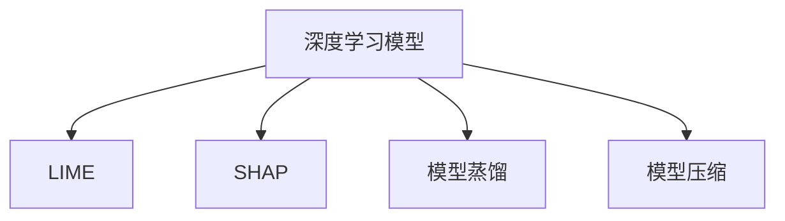

                 

## 1. 背景介绍

### 1.1 问题由来

随着人工智能（AI）技术的发展，深度学习模型，尤其是基于神经网络的大模型（如Transformer架构的BERT、GPT-3等）在自然语言处理（NLP）、计算机视觉（CV）、语音识别（ASR）等领域取得了突破性进展。这些模型往往具有极高的预测准确率和泛化能力，但同时也伴随着“黑盒”特性，即其决策过程难以解释和理解。

这种“黑盒”特性在诸如金融风控、医疗诊断、司法判决等高风险领域尤其令人担忧。如何提升模型的可解释性，使其决策过程透明、可靠，成为学术界和产业界关注的焦点。传统基于规则的模型可能解释性较好，但难以应对复杂数据变化，深度学习模型虽然具备强大的预测能力，但其决策过程的不可解释性却限制了其应用场景。

### 1.2 问题核心关键点

AI解释性研究主要关注如何更好地理解深度学习模型的决策过程，提升模型的可解释性和透明度，从而使模型决策更可信、可靠。这涉及以下几个关键问题：

- **模型结构透明性**：即通过简化模型结构或使用可解释性较强的组件，使模型决策过程更易于理解。
- **特征重要性分析**：分析模型在不同特征上的权重分布，以理解模型对输入数据不同维度的依赖程度。
- **模型行为解释**：通过可视化模型输出和内部状态，帮助用户理解模型决策背后的逻辑。
- **可解释模型训练**：在模型训练过程中，引入可解释性约束，提升模型的可解释性。

### 1.3 问题研究意义

提升AI模型的可解释性具有重要意义：

- **增强模型可信度**：解释性强的模型能够提供明确的决策依据，提高模型在关键领域的应用可信度。
- **促进模型优化**：通过理解模型性能瓶颈和薄弱环节，有助于针对性地改进模型。
- **提升用户体验**：模型决策的可解释性有助于用户理解和信任AI系统，增强系统可用性和满意度。
- **支持法律合规**：对于法律和合规性要求高的领域，模型的可解释性是其能否应用的前提条件。
- **推动AI技术普及**：可解释性强的AI模型更易于被大众接受和理解，有助于AI技术的普及和应用推广。

## 2. 核心概念与联系

### 2.1 核心概念概述

为更好地理解AI解释性的提升方法，本节将介绍几个密切相关的核心概念：

- **深度学习模型（Deep Learning Model）**：以多层神经网络为代表，通过大量数据进行训练，学习输入与输出之间的关系。
- **可解释性（Explainability）**：指模型决策过程的透明性和可理解性，包括模型如何得出最终预测。
- **局部可解释模型（Local Interpretable Model-agnostic Explanations, LIME）**：通过在局部样本区域逼近模型预测，获得模型在特定样本上的解释性。
- **全局可解释模型（Global Interpretable Model-agnostic Explanations, SHAP）**：基于Shapley值原理，对模型在全局样本集上的行为进行解释。
- **模型蒸馏（Model Distillation）**：通过训练一个小型轻量级模型（通常为线性或浅层模型）来逼近大模型的行为，实现模型的可解释性提升。
- **模型压缩（Model Compression）**：通过减少模型参数量和复杂度，提升模型的解释性。

这些核心概念之间的逻辑关系可以通过以下Mermaid流程图来展示：



这个流程图展示了大语言模型与可解释性提升方法之间的关系：

1. 深度学习模型通过数据训练获得预测能力。
2. LIME和SHAP等可解释性方法基于深度学习模型，逼近其局部或全局行为，提供模型决策的解释。
3. 模型蒸馏和压缩则通过简化模型结构，提升模型可解释性。

## 3. 核心算法原理 & 具体操作步骤

### 3.1 算法原理概述

AI解释性提升的核心思想是通过对深度学习模型的决策过程进行分析和可视化，提升模型的透明度和可解释性。常用的方法包括局部可解释性（LIME）、全局可解释性（SHAP）、模型蒸馏和模型压缩等。

基于LIME和SHAP的解释方法通常从两个维度对模型进行解释：
- **局部解释**：通过在特定样本区域逼近模型行为，解释模型在该区域上的决策依据。
- **全局解释**：从模型在全局样本集上的行为出发，解释模型整体的预测逻辑。

模型蒸馏和压缩则从模型结构出发，通过简化模型和参数，提升模型的可解释性。

### 3.2 算法步骤详解

以LIME算法为例，其核心步骤如下：

1. **数据准备**：选择一组样本 $(x_i, y_i)$，其中 $x_i$ 为输入，$y_i$ 为标签。
2. **模型逼近**：使用一个简单的模型（如线性模型、决策树等）逼近原始模型的预测行为，在特定样本 $x_i$ 处得到预测 $\hat{y_i}$。
3. **损失函数优化**：定义损失函数 $L(\hat{y_i}, y_i)$，如均方误差等，并优化简单模型，使其在样本 $x_i$ 处的预测 $\hat{y_i}$ 逼近真实标签 $y_i$。
4. **特征权重计算**：通过计算简单模型在每个特征上的权重分布，解释原始模型在样本 $x_i$ 处的决策逻辑。

### 3.3 算法优缺点

LIME算法的主要优点包括：

- **适用于复杂模型**：LIME算法对任何类型的深度学习模型（包括黑盒模型）都有效。
- **局部解释性强**：能够解释模型在单个样本上的行为，提供细致的决策依据。
- **易于理解**：通过简单的线性模型逼近复杂模型，易于向非专业用户解释。

然而，LIME也存在一些缺点：

- **依赖样本分布**：LIME在训练模型逼近时，对样本分布有较强依赖，可能导致解释失效。
- **计算复杂度较高**：对每个样本都需要训练一个逼近模型，计算成本较高。
- **解释结果易受干扰**：局部解释可能受到噪声样本或异常值的影响，导致解释结果不准确。

### 3.4 算法应用领域

AI解释性提升方法在多个领域有着广泛的应用：

- **金融风控**：在贷款审批、信用评估等场景，需要高透明度的决策依据，以降低风险和纠纷。
- **医疗诊断**：在临床诊断、病理分析等场景，需要明确解释模型如何得出诊断结果，以增强医生的信任。
- **司法判决**：在案件判决、法律推理等场景，需要解释模型依据哪些特征得出判决，以符合法律要求。
- **市场营销**：在广告投放、用户画像分析等场景，需要理解模型推荐逻辑，以优化营销策略。
- **智能制造**：在工业预测、设备维护等场景，需要解释模型如何优化生产流程，以提升效率和安全性。

## 4. 数学模型和公式 & 详细讲解 & 举例说明

### 4.1 数学模型构建

LIME算法的数学模型基于泰勒展开和线性回归。假设有一个复杂模型 $M$ 和一个简单模型 $F$，以及一个样本 $x$，LIME的目标是找到一个简单的线性模型 $F(x)$，使其在样本 $x$ 处的预测逼近复杂模型 $M(x)$ 的预测，同时满足损失函数 $L(y, M(x))$。

数学公式表达如下：

$$
\min_{\beta} \sum_{i=1}^n L(y_i, M(x_i) + \sum_{j=1}^d \beta_j f_j(x_i))
$$

其中 $\beta$ 为简单模型中每个特征的权重，$f_j(x)$ 表示模型在特征 $j$ 上的线性逼近，$L(y, M(x))$ 为预测损失函数，通常为均方误差或交叉熵等。

### 4.2 公式推导过程

LIME的推导主要基于泰勒展开和线性回归。假设 $M(x)$ 在样本 $x$ 处的二阶泰勒展开近似为：

$$
M(x) \approx M(x_0) + \nabla_{x}M(x_0)(x-x_0) + \frac{1}{2}(x-x_0)^T H(x)(x-x_0)
$$

其中 $M(x_0)$ 为 $M(x)$ 在 $x_0$ 处的值，$\nabla_{x}M(x_0)$ 为 $M(x)$ 在 $x_0$ 处的梯度，$H(x)$ 为 $M(x)$ 在 $x_0$ 处的Hessian矩阵。

为了逼近 $M(x)$ 的预测，LIME使用一个线性模型 $F(x)$：

$$
F(x) = \sum_{j=1}^d \beta_j f_j(x)
$$

其中 $f_j(x)$ 为模型在特征 $j$ 上的线性逼近，$\beta_j$ 为权重。LIME的目标是找到 $\beta$，使得 $F(x)$ 在 $x$ 处的预测逼近 $M(x)$ 的预测，并最小化损失函数：

$$
\min_{\beta} \sum_{i=1}^n L(y_i, M(x_i) + \sum_{j=1}^d \beta_j f_j(x_i))
$$

通过求解上述优化问题，LIME得到 $x$ 处的特征权重 $\beta$，从而解释模型在 $x$ 处的预测。

### 4.3 案例分析与讲解

以下以一个简单的线性回归为例，展示LIME的计算过程：

假设有一个复杂模型 $M$ 和一个样本 $x$，$M(x)$ 的预测为 $2x_1 + 3x_2$。为了使用LIME逼近 $M(x)$ 的预测，需要训练一个线性模型 $F(x)$，使其在 $x$ 处的预测等于 $M(x)$ 的预测。

首先，定义LIME的损失函数为均方误差：

$$
L(y, M(x) + \sum_{j=1}^d \beta_j f_j(x)) = \frac{1}{n} \sum_{i=1}^n (y_i - (2x_{i1} + 3x_{i2} + \sum_{j=1}^d \beta_j x_{ij})^2
$$

然后，求解上述优化问题，得到 $\beta$：

$$
\beta = \arg\min_{\beta} \frac{1}{n} \sum_{i=1}^n (y_i - (2x_{i1} + 3x_{i2} + \sum_{j=1}^d \beta_j x_{ij})^2
$$

假设经过优化，得到 $\beta_1 = 0.5, \beta_2 = 1.5$，则LIME得到的逼近模型 $F(x)$ 为 $0.5x_1 + 1.5x_2$。在样本 $x$ 处，$F(x)$ 的预测为 $0.5x_1 + 1.5x_2$，从而解释了模型在 $x$ 处的预测。

## 5. 项目实践：代码实例和详细解释说明

### 5.1 开发环境搭建

在进行AI解释性提升实践前，我们需要准备好开发环境。以下是使用Python进行Scikit-learn开发的环境配置流程：

1. 安装Anaconda：从官网下载并安装Anaconda，用于创建独立的Python环境。

2. 创建并激活虚拟环境：
```bash
conda create -n pytorch-env python=3.8 
conda activate pytorch-env
```

3. 安装Scikit-learn：
```bash
pip install scikit-learn
```

4. 安装NumPy、Pandas等工具包：
```bash
pip install numpy pandas
```

5. 安装相关依赖库：
```bash
pip install matplotlib seaborn imblearn
```

完成上述步骤后，即可在`pytorch-env`环境中开始解释性提升实践。

### 5.2 源代码详细实现

下面我们以一个简单的线性回归模型为例，展示LIME算法的实现。

首先，定义LIME所需的函数和类：

```python
from sklearn.linear_model import LinearRegression
from sklearn.metrics import mean_squared_error
from sklearn.preprocessing import StandardScaler

class LIMEClassifier:
    def __init__(self, model, num_features):
        self.model = model
        self.num_features = num_features
        self.scaler = StandardScaler()
        self.reg = LinearRegression(n_jobs=-1)
    
    def fit(self, X, y):
        self.model.fit(X, y)
        X_scaled = self.scaler.fit_transform(X)
        for i in range(X.shape[0]):
            x_i = X_scaled[i,:].reshape(1,-1)
            y_i = self.model.predict(x_i)
            X_i, y_i = self.scaler.inverse_transform(X_scaled)
            self.reg.fit(X_i[i,:].reshape(1,-1), y_i)
            alpha = self.reg.coef_
    
    def predict(self, X):
        X_scaled = self.scaler.transform(X)
        preds = []
        for i in range(X.shape[0]):
            x_i = X_scaled[i,:].reshape(1,-1)
            x_i_scaled = self.scaler.inverse_transform(X_scaled)
            pred = self.reg.predict(x_i_scaled[i,:].reshape(1,-1))
            preds.append(pred[0])
        return preds
```

然后，使用LIME对模型进行解释性分析：

```python
from sklearn.datasets import make_classification
from sklearn.model_selection import train_test_split
import matplotlib.pyplot as plt

# 生成模拟数据
X, y = make_classification(n_samples=1000, n_features=2, n_informative=2, n_redundant=0, random_state=42)

# 划分训练集和测试集
X_train, X_test, y_train, y_test = train_test_split(X, y, test_size=0.2, random_state=42)

# 加载模型
from sklearn.linear_model import LogisticRegression
model = LogisticRegression()

# 拟合模型
model.fit(X_train, y_train)

# 创建LIME实例
lime = LIMEClassifier(model, num_features=2)

# 解释模型
lime.fit(X_train, y_train)

# 绘制LIME解释结果
plt.scatter(X_train[:, 0], X_train[:, 1], c=y_train)
for i in range(X_train.shape[0]):
    x_i = X_train[i,:].reshape(1,-1)
    y_i = model.predict(x_i)
    alpha = lime.reg.coef_
    plt.plot(x_i[0,0], x_i[0,1], 'ro', markersize=10)
    plt.text(x_i[0,0], x_i[0,1], f'predict={y_i[0]}, lime={alpha[0]}, alpha={alpha[1]}', fontsize=10)
plt.show()
```

### 5.3 代码解读与分析

让我们再详细解读一下关键代码的实现细节：

**LIMEClassifier类**：
- `__init__`方法：初始化模型和特征数量。
- `fit`方法：对每个样本训练一个线性回归模型，逼近复杂模型的预测。
- `predict`方法：对新样本进行预测。

**训练和解释流程**：
- 生成模拟数据集。
- 划分训练集和测试集。
- 加载模型并拟合。
- 创建LIME实例。
- 使用LIME对模型进行解释。
- 绘制LIME解释结果，显示每个样本的解释性。

可以看到，Scikit-learn的LIME实现简洁高效，能够快速实现对模型的解释性分析。在实际应用中，需要根据具体任务的特点，选择合适的解释方法和可视化工具，以达到最佳的解释效果。

## 6. 实际应用场景

### 6.1 金融风控

在金融风控领域，模型的可解释性尤为重要。贷款审批、信用评估等场景下，需要模型能够提供明确的风险评估依据，以便投资者和监管机构理解和信任。通过LIME等解释方法，可以详细解释模型如何评估贷款申请人的信用风险，并提供具体的风险指标，提升模型的可信度和透明度。

### 6.2 医疗诊断

在医疗诊断领域，模型的可解释性直接关系到患者和医生的信任。病理学分析、临床诊断等场景下，模型需要能够清晰解释其诊断依据，帮助医生理解诊断结果。通过LIME等解释方法，可以详细解释模型对病理学切片、影像学图像的分析过程，提供具体的诊断依据，增强医生的信任。

### 6.3 司法判决

在司法判决领域，模型的可解释性关系到判决的公正性和透明度。案件判决、法律推理等场景下，模型需要能够清晰解释其依据哪些特征得出判决，以便法院和律师理解判决依据。通过LIME等解释方法，可以详细解释模型如何分析案件证据，提供具体的判决依据，增强司法系统的可信度。

### 6.4 未来应用展望

随着AI解释性研究的不断深入，未来在以下领域将有更多应用：

- **司法公正**：通过AI解释性，提升司法判决的透明度和公正性，保障公民权利。
- **公共决策**：通过AI解释性，辅助政府决策，提高政策制定的科学性和透明度。
- **环境保护**：通过AI解释性，解释模型对环境数据的分析过程，提供科学的环保决策依据。
- **教育评估**：通过AI解释性，解释模型对学生学习的分析过程，提供个性化的教育方案。
- **智能家居**：通过AI解释性，解释模型对家居环境的分析过程，提供智能化的生活建议。

## 7. 工具和资源推荐

### 7.1 学习资源推荐

为了帮助开发者系统掌握AI解释性的理论基础和实践技巧，这里推荐一些优质的学习资源：

1. **《机器学习解释性与透明性》（Explainable Artificial Intelligence: Understanding the Black Boxes and Results》）**：讲解AI解释性方法和工具的基本原理和应用场景，适合入门学习。

2. **《深度学习解释性》（Deep Learning Explained）**：由Google资深AI工程师撰写，详细介绍了深度学习模型和解释性工具，适合进阶学习。

3. **LIME官方文档**：LIME的官方文档提供了详细的算法介绍和代码实现，适合深入研究。

4. **SHAP官方文档**：SHAP的官方文档提供了全面的解释性方法和应用示例，适合深入研究。

5. **Kaggle数据集和竞赛**：Kaggle提供了大量AI解释性相关的数据集和竞赛，可以实践和检验解释性方法的效果。

通过对这些资源的学习实践，相信你一定能够快速掌握AI解释性的精髓，并用于解决实际的AI问题。

### 7.2 开发工具推荐

高效的开发离不开优秀的工具支持。以下是几款用于AI解释性提升开发的常用工具：

1. **Scikit-learn**：Python的机器学习库，提供了丰富的解释性方法实现，包括LIME、SHAP等。

2. **TensorFlow**：Google主导的开源深度学习框架，支持多种解释性工具和可视化方法。

3. **Keras**：基于TensorFlow和Theano的高级深度学习库，提供了便捷的模型构建和解释性分析工具。

4. **Jupyter Notebook**：Python的交互式开发环境，支持代码编写、解释性分析、可视化展示等多种功能。

5. **Microsoft Azure**：提供了AI解释性工具和平台，支持多模型的解释性分析和可视化展示。

合理利用这些工具，可以显著提升AI解释性提升任务的开发效率，加快创新迭代的步伐。

### 7.3 相关论文推荐

AI解释性研究的发展离不开学界的持续推动。以下是几篇奠基性的相关论文，推荐阅读：

1. **LIME算法**：
   - Ribeiro, M., Singh, S., & Guestrin, C. (2016). "Why should I trust you?" Explaining the predictions of any classifier. In Proceedings of the 22nd ACM SIGKDD international conference on Knowledge discovery and data mining (pp. 1135-1144).

2. **SHAP算法**：
   - Lundberg, S. M., & Lee, S.-I. (2017). A unified approach to interpreting model predictions. In Advances in Neural Information Processing Systems (pp. 4765-4775).

3. **模型蒸馏**：
   - Ba, J., Kiros, R., & Hinton, G. (2014). Approximating networks of stochastic neurons with deep feedforward networks. In International Conference on Machine Learning (pp. 1386-1394).

4. **模型压缩**：
   - Han, S., Wang, X., & Deered, L. (2015). Deep compression: Compressing deep neural networks with pruning, trained quantization and Huffman coding. In International Conference on Machine Learning (pp. 1787-1796).

这些论文代表了大语言模型解释性研究的发展脉络。通过学习这些前沿成果，可以帮助研究者把握学科前进方向，激发更多的创新灵感。

## 8. 总结：未来发展趋势与挑战

### 8.1 总结

本文对AI解释性提升方法进行了全面系统的介绍。首先阐述了AI解释性的研究背景和意义，明确了其重要性。其次，从原理到实践，详细讲解了AI解释性的数学模型和关键算法，提供了完整的代码实例。同时，本文还广泛探讨了AI解释性在金融风控、医疗诊断、司法判决等多个领域的应用前景，展示了其广泛的应用价值。此外，本文精选了AI解释性的各类学习资源，力求为读者提供全方位的技术指引。

通过本文的系统梳理，可以看到，AI解释性提升方法已经成为AI技术应用的重要范式，极大地增强了AI模型的可信度和透明度，推动了AI技术的普及和应用。未来，伴随AI解释性研究的不断深入，相信更多领域的AI系统将具备更高的解释性，从而更好地服务人类社会。

### 8.2 未来发展趋势

AI解释性研究将呈现以下几个发展趋势：

1. **解释性方法的融合**：未来的AI解释性方法将更加注重与其他AI技术（如知识图谱、强化学习等）的融合，提升模型的解释性和性能。
2. **多模型集成解释**：未来的AI解释性方法将更加注重多模型集成解释，提供更全面、更可信的解释结果。
3. **自动化解释生成**：未来的AI解释性方法将更加注重自动化解释生成，提高解释结果的可操作性和可理解性。
4. **跨领域解释性**：未来的AI解释性方法将更加注重跨领域解释性，适应更多样化的应用场景。
5. **交互式解释系统**：未来的AI解释性方法将更加注重交互式解释系统，提供更直观、更个性化的解释体验。

以上趋势凸显了AI解释性研究的广阔前景。这些方向的探索发展，必将进一步提升AI模型的可信度，促进AI技术的普及和应用。

### 8.3 面临的挑战

尽管AI解释性研究已经取得了显著进展，但在迈向更加智能化、普适化应用的过程中，仍面临诸多挑战：

1. **解释结果的可信性**：如何确保解释结果的准确性和可信度，避免误导性或片面性解释，是一个重要问题。
2. **计算资源消耗**：解释性方法通常需要额外的计算资源，如何平衡解释性和计算效率，是一个技术难题。
3. **用户理解门槛**：如何设计简单易懂的解释界面，使非专业用户也能理解解释结果，是一个重要挑战。
4. **解释结果的多样性**：不同用户对同一解释结果的理解可能存在差异，如何提供多样化解释，满足不同用户的需求，是一个技术难题。
5. **数据隐私和安全**：如何保护用户数据隐私，防止解释过程中泄露敏感信息，是一个重要挑战。

正视AI解释性面临的这些挑战，积极应对并寻求突破，将是大语言模型解释性走向成熟的必由之路。相信随着学界和产业界的共同努力，这些挑战终将一一被克服，AI解释性必将在构建安全、可靠、可解释、可控的智能系统中扮演越来越重要的角色。

### 8.4 研究展望

面对AI解释性研究所面临的挑战，未来的研究需要在以下几个方面寻求新的突破：

1. **多模态解释**：将符号化的先验知识，如知识图谱、逻辑规则等，与神经网络模型进行巧妙融合，引导解释过程学习更准确、合理的解释逻辑。
2. **因果解释**：将因果分析方法引入AI解释性，识别出模型决策的关键特征，增强解释结果的因果性和逻辑性。
3. **道德和伦理约束**：在模型训练目标中引入伦理导向的评估指标，过滤和惩罚有偏见、有害的输出倾向，确保解释结果符合人类价值观和伦理道德。
4. **跨领域解释**：研究跨领域解释方法，提升模型在不同领域、不同任务上的解释性。

这些研究方向的前沿探索，必将引领AI解释性研究走向更高的台阶，为构建安全、可靠、可解释、可控的智能系统铺平道路。面向未来，AI解释性研究还需要与其他人工智能技术进行更深入的融合，如知识表示、因果推理、强化学习等，多路径协同发力，共同推动AI技术的进步。只有勇于创新、敢于突破，才能不断拓展AI解释性的边界，让AI技术更好地造福人类社会。

## 9. 附录：常见问题与解答

**Q1：AI解释性提升是否会削弱模型的预测性能？**

A: AI解释性提升方法通常会引入额外的计算和存储资源，如LIME等局部解释方法需要在每个样本上训练一个简单的逼近模型，可能导致解释性和性能之间的权衡。然而，通过优化算法和模型结构，可以减小这种影响，同时在提升解释性的同时，不显著降低模型的预测性能。

**Q2：如何选择适合的AI解释性方法？**

A: 选择适合的AI解释性方法需要根据具体任务和模型特性来决定。对于分类任务，LIME、SHAP等局部和全局解释方法都是不错的选择。对于回归任务，SHAP值方法可能更合适。同时，也可以结合多种解释方法，提供多维度的解释结果。

**Q3：AI解释性提升是否适用于所有模型？**

A: AI解释性提升方法通常对任何类型的深度学习模型（包括黑盒模型）都有效。但对于简单的线性模型或决策树模型，可能不需要复杂的解释方法。

**Q4：AI解释性提升的计算复杂度如何？**

A: 解释性提升方法的计算复杂度通常较高，尤其是LIME等方法需要在每个样本上训练一个简单的逼近模型，导致计算成本较高。但可以通过优化算法和并行计算等手段，提高解释性提升的效率。

**Q5：AI解释性提升对数据分布的依赖性如何？**

A: AI解释性提升方法对数据分布有较强依赖，特别是在LIME等局部解释方法中，需要在每个样本上训练一个逼近模型，对数据分布和噪声敏感。可以通过数据增强和样本平衡等手段，缓解对数据分布的依赖。

通过本文的系统梳理，可以看到，AI解释性提升方法已经成为AI技术应用的重要范式，极大地增强了AI模型的可信度和透明度，推动了AI技术的普及和应用。未来，伴随AI解释性研究的不断深入，相信更多领域的AI系统将具备更高的解释性，从而更好地服务人类社会。

