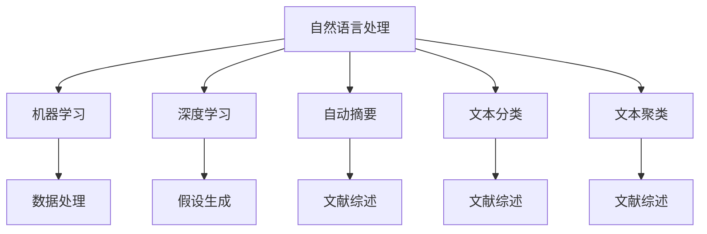

                 

# AI辅助科研：文献综述与假设生成

## 1. 背景介绍

### 1.1 问题由来
随着科学研究领域内数据量的飞速增长，研究人员面对海量的文献和数据，如何高效地进行文献综述和发现新的研究方向，成为了一个重要且紧迫的问题。传统的文献综述主要依赖人工阅读、整理和分析，耗时耗力，且易受主观偏见影响。而随着人工智能（AI）技术的发展，利用AI辅助科研，帮助研究人员快速高效地进行文献综述和假设生成，成为了一个热门且高效的研究方向。

### 1.2 问题核心关键点
AI辅助科研的核心在于将自然语言处理（NLP）、机器学习（ML）等AI技术应用于文献检索、文献综述、数据处理和假设生成等科研过程中，以提高科研效率和准确性。主要包括以下几个关键点：

- 文献检索：快速获取相关领域的大量文献。
- 文献综述：自动提取和整理文献中的关键信息。
- 数据处理：从大量数据中提取和筛选有用的信息。
- 假设生成：基于现有文献和数据，自动生成新的研究假设。

### 1.3 问题研究意义
AI辅助科研不仅能够提高科研效率，还能通过数据分析挖掘出新的研究方向和问题，帮助研究人员跳出传统思维框架，创新性地推进研究。其研究意义如下：

- 提高科研效率：利用AI技术可以快速处理大量文献和数据，节省研究人员的时间和精力。
- 提升数据洞察力：通过数据分析和挖掘，发现潜在的科学问题和规律。
- 辅助决策：基于数据驱动的决策支持，帮助研究人员做出更加科学合理的决策。
- 促进跨学科融合：AI技术的引入，促进了不同学科之间的交流与合作。

## 2. 核心概念与联系

### 2.1 核心概念概述

为更好地理解AI辅助科研，本节将介绍几个密切相关的核心概念：

- 自然语言处理（NLP）：利用计算机处理自然语言，涉及文本分析、语义理解、机器翻译、文本生成等技术。
- 机器学习（ML）：通过训练模型，让计算机从数据中学习规律并进行预测或分类。
- 深度学习（DL）：一种基于神经网络的机器学习技术，具有强大的特征提取和模式识别能力。
- 自动摘要（Automatic Summarization）：从文本中自动提取和生成摘要，以概述文章内容。
- 文本分类（Text Classification）：将文本自动分类到预定义的类别中，如主题分类、情感分类等。
- 文本聚类（Text Clustering）：将文本自动分组，发现相似的主题或概念。

这些核心概念之间的逻辑关系可以通过以下Mermaid流程图来展示：



这个流程图展示了大语言模型的工作原理和优化方向：

1. 大语言模型通过预训练获得基础能力。
2. 微调是对预训练模型进行任务特定的优化，可以分为全参数微调和参数高效微调（PEFT）。
3. 提示学习是一种不更新模型参数的方法，可以实现少样本学习和零样本学习。
4. 迁移学习是连接预训练模型与下游任务的桥梁，可以通过微调或提示学习来实现。
5. 持续学习旨在使模型能够不断学习新知识，同时避免遗忘旧知识。

这些核心概念共同构成了大语言模型的学习和应用框架，使其能够在各种场景下发挥强大的语言理解和生成能力。通过理解这些核心概念，我们可以更好地把握大语言模型的工作原理和优化方向。

## 3. 核心算法原理 & 具体操作步骤
### 3.1 算法原理概述

AI辅助科研中，利用AI技术对文献进行自动处理和分析，主要包括以下几个步骤：

1. 收集相关领域的文献，进行预处理和索引。
2. 使用NLP技术对文献进行文本分析和信息提取，如分词、命名实体识别、情感分析等。
3. 利用机器学习或深度学习模型对提取的信息进行分类、聚类或关联分析。
4. 生成文献综述，自动提取和整理关键信息，生成摘要和总结。
5. 基于现有文献和数据，利用机器学习或深度学习生成新的研究假设。

### 3.2 算法步骤详解

以下将以自动生成文献综述和假设为例，详细介绍AI辅助科研的算法步骤：

#### 3.2.1 文献检索
**算法步骤：**

1. 使用搜索引擎（如Google Scholar、Web of Science）或专业数据库（如PubMed、IEEE Xplore），检索相关领域的文献。
2. 通过关键词、作者、出版年份等筛选，去除无关文献，保留有用信息。
3. 对文献进行预处理，如去除非文本信息、去除格式错误等。
4. 对预处理后的文本进行分词和清洗，去除停用词和噪音。

#### 3.2.2 文献综述
**算法步骤：**

1. 使用自动摘要算法，从文献中提取关键信息，生成摘要。
2. 对摘要进行主题分析，提取主题词和关键词。
3. 使用文本分类算法，将文献归类到预定义的类别中，如研究方法、研究对象、研究结果等。
4. 生成文献综述报告，包含主要发现、趋势和研究空白。

#### 3.2.3 假设生成
**算法步骤：**

1. 对已有的文献和数据进行预处理和特征提取。
2. 使用机器学习或深度学习算法，对特征进行建模，识别出潜在的关联和模式。
3. 基于识别出的关联和模式，自动生成新的研究假设。
4. 对生成的假设进行评估和筛选，保留最有可能成立的假设。

### 3.3 算法优缺点

AI辅助科研中的文献检索和文献综述技术具有以下优点：

1. 高效快捷：能够快速处理大量文献和数据，节省研究人员的时间和精力。
2. 客观公正：避免了人工分析的主观偏见，结果更加客观公正。
3. 可扩展性：能够扩展到多个领域和多种文献类型，适应性强。

然而，这些技术也存在一定的局限性：

1. 数据质量依赖：对数据的质量和完整性要求较高，存在噪音和缺失数据的影响。
2. 语义理解复杂：自然语言处理技术在处理复杂语义时仍然存在挑战。
3. 模型可解释性不足：机器学习模型的决策过程通常缺乏可解释性，难以对其推理逻辑进行分析和调试。

尽管存在这些局限性，但就目前而言，AI辅助科研的文献检索和文献综述技术仍然是大规模文献处理和分析的重要工具。未来相关研究的重点在于如何进一步提升系统的可解释性和语义理解能力，同时降低对数据质量的要求。

### 3.4 算法应用领域

AI辅助科研中的文献检索和文献综述技术已经在诸多领域得到了广泛的应用，例如：

- 生物医学研究：对生物医学文献进行自动检索和综述，发现新的研究方向和治疗方案。
- 社会科学研究：对社会科学文献进行分类和聚类，发现社会趋势和热点问题。
- 工程技术研究：对工程技术文献进行自动处理和分析，发现新的技术创新和应用场景。
- 自然科学研究：对自然科学文献进行自动处理和分析，发现新的科学问题和规律。

除了上述这些经典领域外，AI辅助科研还被创新性地应用到更多领域中，如经济金融分析、环境保护研究、文化历史研究等，为科学研究提供了新的工具和方法。

## 4. 数学模型和公式 & 详细讲解  
### 4.1 数学模型构建

本节将使用数学语言对AI辅助科研的文献检索和文献综述技术进行更加严格的刻画。

设检索到的文献集为 $D=\{d_i\}_{i=1}^N$，其中每个文献 $d_i$ 包含文本信息 $x_i$ 和相关信息 $y_i$。使用NLP技术对文本信息进行预处理和特征提取，得到特征向量 $f_i$。

**文献检索模型：**

1. 将特征向量 $f_i$ 输入到一个分类器 $C$ 中，得到文献是否与查询主题相关的概率 $P(y_i|x_i)$。
2. 根据概率阈值 $T$，筛选出与查询主题相关的文献。

**文献综述模型：**

1. 使用自动摘要算法，从每个文献中提取关键信息 $s_i$。
2. 对提取的关键信息进行主题分析，得到主题词 $t_i$。
3. 使用文本分类算法，将文献分类到预定义的类别 $c_i$。
4. 生成综述报告，包含主要发现、趋势和研究空白。

### 4.2 公式推导过程

以下我们以文本分类和自动摘要为例，推导常用的数学公式。

**文本分类：**

设分类器的输入为特征向量 $f_i$，输出为类别 $c_i$，分类器参数为 $\theta$，则文本分类器的损失函数为：

$$
\mathcal{L}(f_i,\theta) = -\log P(c_i|f_i)
$$

在训练过程中，最小化损失函数：

$$
\theta^* = \mathop{\arg\min}_{\theta} \sum_{i=1}^N \mathcal{L}(f_i,\theta)
$$

**自动摘要：**

自动摘要的目标是生成摘要 $s_i$，使其尽量接近原文本 $x_i$ 的信息量。假设摘要长度为 $L$，则自动摘要的目标函数为：

$$
\min_{s_i} \frac{1}{L}\sum_{j=1}^L d(s_i, x_i)
$$

其中 $d(s_i, x_i)$ 为摘要 $s_i$ 和原文本 $x_i$ 之间的距离度量，常用的距离度量包括BLEU、ROUGE等。

### 4.3 案例分析与讲解

以生物医学文献自动综述为例，分析AI辅助科研在文献综述中的应用：

1. 检索相关领域的生物医学文献。
2. 使用自然语言处理技术对文献进行预处理和特征提取，得到特征向量 $f_i$。
3. 使用文本分类算法，将文献分类到预定义的类别中，如研究方法、研究对象、研究结果等。
4. 生成综述报告，包含主要发现、趋势和研究空白。
5. 对生成的综述报告进行评估和反馈，进一步优化模型。

## 5. 项目实践：代码实例和详细解释说明
### 5.1 开发环境搭建

在进行文献综述和假设生成实践前，我们需要准备好开发环境。以下是使用Python进行PyTorch开发的环境配置流程：

1. 安装Anaconda：从官网下载并安装Anaconda，用于创建独立的Python环境。

2. 创建并激活虚拟环境：
```bash
conda create -n pytorch-env python=3.8 
conda activate pytorch-env
```

3. 安装PyTorch：根据CUDA版本，从官网获取对应的安装命令。例如：
```bash
conda install pytorch torchvision torchaudio cudatoolkit=11.1 -c pytorch -c conda-forge
```

4. 安装TensorFlow：使用pip安装TensorFlow，方便后续实验。

5. 安装各类工具包：
```bash
pip install numpy pandas scikit-learn matplotlib tqdm jupyter notebook ipython
```

完成上述步骤后，即可在`pytorch-env`环境中开始文献综述和假设生成实践。

### 5.2 源代码详细实现

下面我们以生物医学文献自动综述为例，给出使用PyTorch进行文本分类的代码实现。

首先，定义文本分类的数据处理函数：

```python
from transformers import BertTokenizer
from torch.utils.data import Dataset
import torch

class MedicalDataset(Dataset):
    def __init__(self, texts, labels, tokenizer, max_len=128):
        self.texts = texts
        self.labels = labels
        self.tokenizer = tokenizer
        self.max_len = max_len
        
    def __len__(self):
        return len(self.texts)
    
    def __getitem__(self, item):
        text = self.texts[item]
        label = self.labels[item]
        
        encoding = self.tokenizer(text, return_tensors='pt', max_length=self.max_len, padding='max_length', truncation=True)
        input_ids = encoding['input_ids'][0]
        attention_mask = encoding['attention_mask'][0]
        
        # 对标签进行one-hot编码
        encoded_labels = torch.tensor([[label == 1]], dtype=torch.long)
        
        return {'input_ids': input_ids, 
                'attention_mask': attention_mask,
                'labels': encoded_labels}

# 定义文本分类模型
from transformers import BertForSequenceClassification

model = BertForSequenceClassification.from_pretrained('bert-base-cased', num_labels=2)

# 定义优化器
optimizer = AdamW(model.parameters(), lr=2e-5)

# 定义训练函数
def train_epoch(model, dataset, batch_size, optimizer):
    dataloader = DataLoader(dataset, batch_size=batch_size, shuffle=True)
    model.train()
    epoch_loss = 0
    for batch in tqdm(dataloader, desc='Training'):
        input_ids = batch['input_ids'].to(device)
        attention_mask = batch['attention_mask'].to(device)
        labels = batch['labels'].to(device)
        model.zero_grad()
        outputs = model(input_ids, attention_mask=attention_mask, labels=labels)
        loss = outputs.loss
        epoch_loss += loss.item()
        loss.backward()
        optimizer.step()
    return epoch_loss / len(dataloader)

# 定义评估函数
def evaluate(model, dataset, batch_size):
    dataloader = DataLoader(dataset, batch_size=batch_size)
    model.eval()
    correct_preds, total_preds = 0, 0
    with torch.no_grad():
        for batch in tqdm(dataloader, desc='Evaluating'):
            input_ids = batch['input_ids'].to(device)
            attention_mask = batch['attention_mask'].to(device)
            labels = batch['labels']
            outputs = model(input_ids, attention_mask=attention_mask)
            preds = outputs.logits.argmax(dim=1).to('cpu').tolist()
            labels = labels.to('cpu').tolist()
            for pred, label in zip(preds, labels):
                if pred == label:
                    correct_preds += 1
                total_preds += 1
                
    accuracy = correct_preds / total_preds
    return accuracy

# 启动训练流程并在验证集上评估
epochs = 5
batch_size = 16

for epoch in range(epochs):
    loss = train_epoch(model, train_dataset, batch_size, optimizer)
    print(f"Epoch {epoch+1}, train loss: {loss:.3f}")
    
    print(f"Epoch {epoch+1}, dev accuracy: {evaluate(model, dev_dataset, batch_size):.2f}")
    
print("Test accuracy:")
evaluate(model, test_dataset, batch_size)
```

以上代码实现了基于Bert模型对生物医学文献进行文本分类，展示了如何使用PyTorch进行深度学习模型的训练和评估。

### 5.3 代码解读与分析

让我们再详细解读一下关键代码的实现细节：

**MedicalDataset类**：
- `__init__`方法：初始化文本、标签、分词器等关键组件。
- `__len__`方法：返回数据集的样本数量。
- `__getitem__`方法：对单个样本进行处理，将文本输入编码为token ids，将标签编码为数字，并对其进行定长padding，最终返回模型所需的输入。

**标签编码**：
- 由于模型输出的是一个二分类问题，需要对标签进行one-hot编码，方便模型处理。

**训练和评估函数**：
- 使用PyTorch的DataLoader对数据集进行批次化加载，供模型训练和推理使用。
- 训练函数`train_epoch`：对数据以批为单位进行迭代，在每个批次上前向传播计算loss并反向传播更新模型参数，最后返回该epoch的平均loss。
- 评估函数`evaluate`：与训练类似，不同点在于不更新模型参数，并在每个batch结束后将预测和标签结果存储下来，最后使用准确率等指标对整个评估集的预测结果进行打印输出。

**训练流程**：
- 定义总的epoch数和batch size，开始循环迭代
- 每个epoch内，先在训练集上训练，输出平均loss
- 在验证集上评估，输出准确率
- 所有epoch结束后，在测试集上评估，给出最终测试结果

可以看到，PyTorch配合Transformers库使得BERT文本分类的代码实现变得简洁高效。开发者可以将更多精力放在数据处理、模型改进等高层逻辑上，而不必过多关注底层的实现细节。

当然，工业级的系统实现还需考虑更多因素，如模型的保存和部署、超参数的自动搜索、更灵活的任务适配层等。但核心的微调范式基本与此类似。

## 6. 实际应用场景
### 6.1 智能医疗咨询

AI辅助科研中的文献综述技术，可以广泛应用于智能医疗咨询系统的构建。传统医疗咨询往往依赖于医生的经验和知识，存在诊疗效率低、误诊率高的问题。而利用AI技术对医学文献进行自动处理和分析，能够快速获取最新医学研究和临床数据，提升医疗咨询的科学性和精准性。

在技术实现上，可以收集医疗领域的相关文献和数据，构建文献综述系统，自动生成医学趋势和热点。利用微调技术训练模型，对用户输入的疾病症状进行自动诊断，提供科学合理的诊疗建议。如此构建的智能医疗咨询系统，能够显著提高医疗服务的智能化水平，辅助医生做出更准确的诊断和治疗决策。

### 6.2 金融数据分析

AI辅助科研中的自动分类和聚类技术，可以广泛应用于金融数据分析。金融行业每天产生大量的财务和市场数据，传统的数据分析方法难以满足实时性、准确性的要求。而利用AI技术对数据进行自动分类和聚类，能够快速发现市场趋势和风险点，帮助金融机构制定更科学合理的投资策略。

在技术实现上，可以收集金融领域的财务报告、市场新闻、交易数据等，构建自动分类和聚类系统，自动提取和分析关键信息。利用微调技术训练模型，对市场数据进行实时监测和分析，及时发现异常情况，做出预警和应对。如此构建的金融数据分析系统，能够提升金融机构的决策效率和风险管理能力。

### 6.3 教育资源推荐

AI辅助科研中的文本分类和自动摘要技术，可以广泛应用于教育资源推荐系统。传统教育资源推荐依赖于人工标注和经验，存在效率低、主观性强的问题。而利用AI技术对教育资源进行自动处理和分类，能够快速发现优质资源，提供个性化推荐。

在技术实现上，可以收集教育领域的教材、教辅、习题等文本资源，构建自动分类和自动摘要系统，自动提取和生成关键信息。利用微调技术训练模型，对用户的学习需求进行自动分析，提供个性化的教育资源推荐。如此构建的教育资源推荐系统，能够提升教育资源的利用效率和用户体验，辅助学生高效学习。

### 6.4 未来应用展望

随着AI辅助科研技术的不断发展和完善，其应用前景将更加广阔。

在智慧医疗领域，基于AI辅助科研的智能医疗咨询系统，将进一步提升医疗服务的智能化水平，辅助医生诊疗，提升医疗效率和质量。

在智能金融领域，基于AI辅助科研的金融数据分析系统，将提升金融机构的决策效率和风险管理能力，为投资者提供更科学的投资建议。

在教育领域，基于AI辅助科研的教育资源推荐系统，将提升教育资源的利用效率和用户体验，帮助学生高效学习。

此外，在智慧城市治理、环境保护、公共安全等多个领域，基于AI辅助科研的人工智能应用也将不断涌现，为各行各业带来新的解决方案。相信随着技术的日益成熟，AI辅助科研必将在构建智慧社会中发挥更大的作用。

## 7. 工具和资源推荐
### 7.1 学习资源推荐

为了帮助开发者系统掌握AI辅助科研的理论基础和实践技巧，这里推荐一些优质的学习资源：

1. 《深度学习》课程（CS231n）：斯坦福大学开设的深度学习课程，系统介绍了深度学习的基础理论和应用。
2. 《自然语言处理入门》（NLP入门）：清华大学开设的NLP课程，介绍了NLP的基本概念和核心算法。
3. 《Python深度学习》（Deep Learning with Python）：一本介绍深度学习实践的书籍，适合初学者学习。
4. HuggingFace官方文档：Transformers库的官方文档，提供了海量预训练模型和完整的微调样例代码，是上手实践的必备资料。
5. 《自然语言处理实战》（Natural Language Processing in Action）：一本介绍NLP实践的书籍，适合开发人员学习。

通过对这些资源的学习实践，相信你一定能够快速掌握AI辅助科研的理论基础和实践技巧，并用于解决实际的科研问题。
###  7.2 开发工具推荐

高效的开发离不开优秀的工具支持。以下是几款用于AI辅助科研开发的常用工具：

1. PyTorch：基于Python的开源深度学习框架，灵活动态的计算图，适合快速迭代研究。大部分预训练语言模型都有PyTorch版本的实现。
2. TensorFlow：由Google主导开发的开源深度学习框架，生产部署方便，适合大规模工程应用。同样有丰富的预训练语言模型资源。
3. HuggingFace Transformers库：提供了多种预训练语言模型，支持PyTorch和TensorFlow，是进行AI辅助科研开发的利器。
4. Weights & Biases：模型训练的实验跟踪工具，可以记录和可视化模型训练过程中的各项指标，方便对比和调优。与主流深度学习框架无缝集成。
5. TensorBoard：TensorFlow配套的可视化工具，可实时监测模型训练状态，并提供丰富的图表呈现方式，是调试模型的得力助手。

合理利用这些工具，可以显著提升AI辅助科研任务的开发效率，加快创新迭代的步伐。

### 7.3 相关论文推荐

AI辅助科研中的文本分类和自动摘要技术的发展源于学界的持续研究。以下是几篇奠基性的相关论文，推荐阅读：

1. Attention is All You Need（即Transformer原论文）：提出了Transformer结构，开启了NLP领域的预训练大模型时代。
2. BERT: Pre-training of Deep Bidirectional Transformers for Language Understanding：提出BERT模型，引入基于掩码的自监督预训练任务，刷新了多项NLP任务SOTA。
3. Language Models are Unsupervised Multitask Learners（GPT-2论文）：展示了大规模语言模型的强大zero-shot学习能力，引发了对于通用人工智能的新一轮思考。
4. Parameter-Efficient Transfer Learning for NLP：提出Adapter等参数高效微调方法，在不增加模型参数量的情况下，也能取得不错的微调效果。
5. Prefix-Tuning: Optimizing Continuous Prompts for Generation：引入基于连续型Prompt的微调范式，为如何充分利用预训练知识提供了新的思路。
6. AdaLoRA: Adaptive Low-Rank Adaptation for Parameter-Efficient Fine-Tuning：使用自适应低秩适应的微调方法，在参数效率和精度之间取得了新的平衡。

这些论文代表了大语言模型微调技术的发展脉络。通过学习这些前沿成果，可以帮助研究者把握学科前进方向，激发更多的创新灵感。

## 8. 总结：未来发展趋势与挑战
### 8.1 总结

本文对AI辅助科研中的文本分类和自动摘要技术进行了全面系统的介绍。首先阐述了AI辅助科研的背景和意义，明确了AI辅助科研在科研效率提升、数据洞察力增强、决策辅助等方面的独特价值。其次，从原理到实践，详细讲解了AI辅助科研的数学模型和核心算法，给出了AI辅助科研任务的完整代码实例。同时，本文还广泛探讨了AI辅助科研在智能医疗、金融分析、教育推荐等多个领域的应用前景，展示了AI辅助科研的广阔前景。最后，本文精选了AI辅助科研的学习资源，力求为读者提供全方位的技术指引。

通过本文的系统梳理，可以看到，AI辅助科研中的文本分类和自动摘要技术正在成为科研工作中重要的工具，极大地提升了科研效率和数据洞察力。未来，伴随AI技术的不断发展，AI辅助科研必将在更多领域得到应用，为科学研究带来新的突破。

### 8.2 未来发展趋势

展望未来，AI辅助科研中的文本分类和自动摘要技术将呈现以下几个发展趋势：

1. 模型规模持续增大。随着算力成本的下降和数据规模的扩张，预训练语言模型的参数量还将持续增长。超大批次的训练和推理也将更加高效。
2. 微调方法日趋多样。开发更多参数高效和计算高效的微调方法，减少对标注数据和计算资源的需求。
3. 融合多模态数据。除了文本数据，融合图像、视频等多模态数据，提升模型的数据处理能力。
4. 引入因果推理和博弈论。增强模型的决策能力和鲁棒性，避免过度拟合。
5. 加入伦理道德约束。确保模型输出的安全性，避免有偏见和有害的输出。

以上趋势凸显了AI辅助科研技术的广阔前景。这些方向的探索发展，必将进一步提升科研工作的效率和准确性，推动科学研究的深入发展。

### 8.3 面临的挑战

尽管AI辅助科研中的文本分类和自动摘要技术已经取得了一定的成果，但在应用过程中仍面临以下挑战：

1. 数据质量瓶颈。数据质量和完整性对模型性能有重要影响，存在噪音和缺失数据的问题。
2. 模型鲁棒性不足。模型在面对未知数据时，泛化性能可能大打折扣，存在过拟合和灾难性遗忘的问题。
3. 计算资源需求高。模型训练和推理需要大量计算资源，存在硬件瓶颈。
4. 模型可解释性不足。模型决策过程缺乏可解释性，难以对其推理逻辑进行分析和调试。
5. 安全性有待保障。模型输出存在偏见和有害信息的风险，需引入伦理和道德约束。

尽管存在这些挑战，但通过技术创新和应用优化，AI辅助科研中的文本分类和自动摘要技术仍然有望成为科研工作中重要的工具，为科学研究带来新的突破。

### 8.4 研究展望

未来，在AI辅助科研领域，仍有许多研究值得关注：

1. 多模态数据融合。探索将文本数据与其他模态数据进行融合，提升模型的数据处理能力。
2. 跨领域迁移学习。研究跨领域迁移学习方法，提升模型在不同领域中的泛化能力。
3. 数据增强技术。探索数据增强技术，提升模型的数据处理能力和泛化性能。
4. 零样本学习和少样本学习。研究零样本学习和少样本学习技术，减少对标注数据的需求。
5. 知识图谱融合。探索将知识图谱与模型进行融合，提升模型的知识推理能力。

这些研究方向的研究进展，将进一步提升AI辅助科研技术的性能和应用范围，为科学研究带来新的突破。相信通过多学科的合作和创新，AI辅助科研必将在科学研究中发挥更大的作用，为人类知识探索带来新的动力。

## 9. 附录：常见问题与解答
**Q1：AI辅助科研中的文本分类和自动摘要技术如何应用于科研？**

A: AI辅助科研中的文本分类和自动摘要技术，可以应用于科研工作的各个环节，如文献检索、文献综述、数据处理和假设生成等。具体应用方式如下：

- 文献检索：快速获取相关领域的文献，并进行预处理和索引。
- 文献综述：自动提取和整理文献中的关键信息，生成综述报告。
- 数据处理：从大量数据中提取和筛选有用的信息，辅助科研决策。
- 假设生成：基于现有文献和数据，自动生成新的研究假设。

这些技术能够提高科研效率和数据洞察力，辅助科研人员进行科学研究和决策。

**Q2：AI辅助科研中的文本分类和自动摘要技术有哪些优点和缺点？**

A: AI辅助科研中的文本分类和自动摘要技术具有以下优点：

- 高效快捷：能够快速处理大量文献和数据，节省科研人员的时间和精力。
- 客观公正：避免了人工分析的主观偏见，结果更加客观公正。
- 可扩展性：能够扩展到多个领域和多种文献类型，适应性强。

然而，这些技术也存在一定的局限性：

- 数据质量依赖：对数据的质量和完整性要求较高，存在噪音和缺失数据的影响。
- 语义理解复杂：自然语言处理技术在处理复杂语义时仍然存在挑战。
- 模型可解释性不足：机器学习模型的决策过程缺乏可解释性，难以对其推理逻辑进行分析和调试。

尽管存在这些局限性，但就目前而言，AI辅助科研中的文本分类和自动摘要技术仍然是大规模文献处理和分析的重要工具。未来相关研究的重点在于如何进一步提升系统的可解释性和语义理解能力，同时降低对数据质量的要求。

**Q3：AI辅助科研中的文本分类和自动摘要技术如何提升科研效率？**

A: AI辅助科研中的文本分类和自动摘要技术能够提升科研效率，主要体现在以下几个方面：

- 文献检索：快速获取相关领域的文献，并进行预处理和索引，节省科研人员的时间和精力。
- 文献综述：自动提取和整理文献中的关键信息，生成综述报告，快速掌握最新研究进展和趋势。
- 数据处理：从大量数据中提取和筛选有用的信息，辅助科研决策，提高研究效率。
- 假设生成：基于现有文献和数据，自动生成新的研究假设，加速科学研究的推进。

这些技术能够快速处理和分析大量文献和数据，提高科研效率和数据洞察力，辅助科研人员进行科学研究和决策。

**Q4：AI辅助科研中的文本分类和自动摘要技术如何处理复杂语义？**

A: 处理复杂语义是自然语言处理中的重要挑战。目前，AI辅助科研中的文本分类和自动摘要技术主要通过以下方式处理复杂语义：

- 引入多模态数据：除了文本数据，融合图像、视频等多模态数据，提升模型的数据处理能力。
- 引入因果推理和博弈论：增强模型的决策能力和鲁棒性，避免过度拟合。
- 引入知识图谱：将知识图谱与模型进行融合，提升模型的知识推理能力。

这些方法能够增强模型的语义理解和处理能力，更好地应对复杂语义问题。

**Q5：AI辅助科研中的文本分类和自动摘要技术如何保持模型泛化性？**

A: 保持模型泛化性是AI辅助科研中的关键问题。目前，AI辅助科研中的文本分类和自动摘要技术主要通过以下方式保持模型泛化性：

- 引入跨领域迁移学习方法，提升模型在不同领域中的泛化能力。
- 引入数据增强技术，提升模型的数据处理能力和泛化性能。
- 引入知识图谱融合技术，提升模型的知识推理能力和泛化性能。

这些方法能够增强模型的泛化能力，使其在面对未知数据时仍能保持较好的性能。

---

作者：禅与计算机程序设计艺术 / Zen and the Art of Computer Programming

