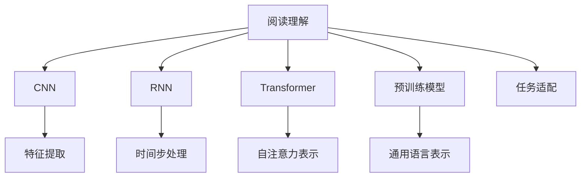

                 

# AI辅助阅读理解的技术进展

> 关键词：阅读理解,自然语言处理(NLP),深度学习,卷积神经网络(CNN),循环神经网络(RNN),Transformer,注意力机制,语义表示,预训练模型

## 1. 背景介绍

### 1.1 问题由来
阅读理解是人工智能领域的一项重要任务，旨在通过给定的文本段落和问题，自动推断出文本所蕴含的语义信息。这项技术在自然语言处理（NLP）领域中有着广泛的应用，如问答系统、文本摘要、机器翻译等。近年来，随着深度学习技术的飞速发展，阅读理解模型也取得了显著的进展，逐步从简单的特征提取器转变为强大的语义表示生成器。

阅读理解模型的进展，很大程度上得益于大规模预训练模型的出现，如BERT、GPT-3等。这些预训练模型通过在大规模无标签文本数据上进行自我监督训练，学习到丰富的语言表示，具备了强大的语义理解和生成能力。在此基础上，通过微调等技术手段，模型能够适应不同的阅读理解任务，显著提升了模型的性能。

### 1.2 问题核心关键点
阅读理解的核心在于如何从文本中提取和整合语义信息，并准确回答相关问题。现代阅读理解模型通过以下关键技术手段实现了这一目标：
- **卷积神经网络(CNN)**：利用局部连接和池化操作提取文本局部特征。
- **循环神经网络(RNN)**：通过时间步递归处理文本序列，捕捉文本的长期依赖关系。
- **Transformer模型**：基于注意力机制，在输入序列上计算多维自注意力表示，捕捉全局语义信息。
- **预训练模型**：通过在大规模无标签数据上进行自我监督训练，学习通用的语言表示，提升模型的泛化能力。

这些技术手段相互补充，共同构建起现代阅读理解模型的技术体系。

## 2. 核心概念与联系

### 2.1 核心概念概述

为更好地理解AI辅助阅读理解的技术进展，本节将介绍几个密切相关的核心概念：

- **阅读理解(Rreading Understanding)**：通过给定的文本段落和问题，推断出文本所蕴含的语义信息，生成答案或摘要等输出。
- **自然语言处理(Natural Language Processing, NLP)**：利用计算机科学和人工智能技术处理和理解人类语言。阅读理解是NLP领域的重要研究方向之一。
- **深度学习(Deep Learning)**：一种模拟人类神经系统的计算模型，通过多个层次的神经网络提取文本特征，实现阅读理解的自动推理。
- **卷积神经网络(CNN)**：一种前馈神经网络，通过局部连接和池化操作提取文本特征。
- **循环神经网络(RNN)**：一种递归神经网络，通过时间步递归处理文本序列，捕捉文本的长期依赖关系。
- **Transformer模型**：一种基于注意力机制的神经网络，通过计算多维自注意力表示捕捉全局语义信息。
- **预训练模型**：在大规模无标签数据上训练的模型，学习通用的语言表示，用于微调适应特定任务。

这些核心概念之间的逻辑关系可以通过以下Mermaid流程图来展示：



这个流程图展示了几大核心概念之间的联系：

1. 阅读理解通过CNN、RNN、Transformer等模型从文本中提取特征。
2. CNN通过局部连接和池化操作提取文本局部特征。
3. RNN通过时间步递归处理文本序列，捕捉文本的长期依赖关系。
4. Transformer模型通过自注意力机制捕捉全局语义信息。
5. 预训练模型在大规模无标签数据上学习通用的语言表示，用于微调适应特定任务。
6. 阅读理解模型通过任务适配层，实现对特定任务的推理。

## 3. 核心算法原理 & 具体操作步骤

### 3.1 算法原理概述

AI辅助阅读理解的核心算法原理，可以简单地概括为：通过深度学习模型从文本中提取语义特征，并利用这些特征推断出问题的答案。具体而言，算法包括以下几个关键步骤：

1. **文本编码**：将文本段落和问题转换为模型可以处理的向量形式。
2. **特征提取**：通过CNN、RNN、Transformer等模型，从文本中提取语义特征。
3. **推理计算**：利用提取的语义特征，通过特定的推理机制生成答案或摘要。
4. **任务适配**：通过微调等技术手段，使模型适应特定的阅读理解任务。

### 3.2 算法步骤详解

下面，我们将详细介绍AI辅助阅读理解的核心算法步骤：

**Step 1: 文本编码**

文本编码是将文本段落和问题转换为模型可以处理的向量形式。常用的文本编码方法包括：

1. **词向量编码**：将每个单词映射到一个低维向量空间中，常用的词向量模型有Word2Vec、GloVe等。
2. **句子向量编码**：将整个句子映射到一个低维向量空间中，常用的句子向量模型有Bag of Words、TF-IDF等。
3. **预训练语言模型嵌入**：利用预训练语言模型（如BERT、GPT-3等）将文本转换为低维向量表示。

在实际应用中，我们通常使用预训练语言模型进行文本编码，因为它们在大规模无标签数据上训练得到的词向量更具有通用性，能够捕捉到更丰富的语义信息。

**Step 2: 特征提取**

特征提取是阅读理解模型中的关键步骤，常用的特征提取方法包括：

1. **卷积神经网络(CNN)**：利用局部连接和池化操作提取文本局部特征。
2. **循环神经网络(RNN)**：通过时间步递归处理文本序列，捕捉文本的长期依赖关系。
3. **Transformer模型**：基于注意力机制，在输入序列上计算多维自注意力表示，捕捉全局语义信息。

在现代阅读理解模型中，Transformer模型被广泛应用，因为它们在处理长文本序列和捕捉全局语义信息方面具有显著优势。

**Step 3: 推理计算**

推理计算是阅读理解模型的核心部分，常用的推理计算方法包括：

1. **分类**：将问题答案映射到一个有限的标签集合上，通常使用Softmax函数进行计算。
2. **序列生成**：将问题答案映射到一个可变的序列上，通常使用RNN或Transformer模型进行计算。
3. **摘要生成**：将长文本转换为一个简洁的摘要，通常使用Seq2Seq模型或Transformer模型进行计算。

在实际应用中，我们通常使用Transformer模型进行推理计算，因为它们能够捕捉长文本的语义信息，并生成高质量的文本输出。

**Step 4: 任务适配**

任务适配是将阅读理解模型适应特定任务的过程。常用的任务适配方法包括：

1. **微调(Fine-tuning)**：在大规模预训练模型基础上，利用标注数据进行微调，适应特定的阅读理解任务。
2. **数据增强**：通过对训练样本进行改写、回译等方式，扩充训练集，提升模型的泛化能力。
3. **对抗训练**：加入对抗样本，提高模型鲁棒性，避免模型过拟合。
4. ** Prompt Learning**：通过设计输入模板，引导模型生成特定的答案，减少微调参数。

在实际应用中，我们通常使用微调方法进行任务适配，因为它们可以显著提升模型在特定任务上的性能。

### 3.3 算法优缺点

AI辅助阅读理解算法具有以下优点：

1. **准确度高**：通过深度学习模型提取语义特征，能够有效捕捉文本的复杂语义信息，从而提高推理的准确度。
2. **可扩展性好**：模型可以通过微调适应不同的阅读理解任务，具有较好的可扩展性。
3. **自动化程度高**：通过自动化推理计算，能够快速处理大量的文本数据。

同时，该算法也存在一些缺点：

1. **数据依赖性强**：阅读理解模型依赖于标注数据，标注数据的质量和数量对模型的性能有显著影响。
2. **计算资源消耗大**：深度学习模型通常需要较大的计算资源，模型的训练和推理过程会消耗大量计算资源。
3. **模型复杂度高**：现代阅读理解模型通常具有较高的复杂度，模型的设计和调参难度较大。

尽管存在这些局限性，但总体而言，AI辅助阅读理解算法在大规模预训练模型的帮助下，已经在各种阅读理解任务上取得了显著的进展。

### 3.4 算法应用领域

AI辅助阅读理解算法在NLP领域的应用非常广泛，以下是几个典型的应用领域：

1. **问答系统**：通过给定问题和文本段落，自动推断出问题的答案。常用的问答系统有SQuAD、MS MARCO等。
2. **文本摘要**：通过给定长文本段落，自动生成一个简洁的摘要。常用的文本摘要模型有BART、T5等。
3. **机器翻译**：将一种语言的文本翻译成另一种语言。常用的机器翻译模型有GPT-3、Transformer等。
4. **信息抽取**：从文本中提取结构化信息，常用的信息抽取任务有命名实体识别、关系抽取等。
5. **情感分析**：通过文本分析用户的情感倾向，常用的情感分析模型有BERT、LSTM等。

## 4. 数学模型和公式 & 详细讲解 & 举例说明

### 4.1 数学模型构建

阅读理解模型的数学模型可以简单地概括为：通过深度学习模型从文本中提取语义特征，并利用这些特征推断出问题的答案。具体而言，模型可以表示为：

$$
y = f(x; \theta)
$$

其中，$x$ 表示输入的文本和问题，$\theta$ 表示模型的参数，$f$ 表示模型的计算过程。常用的阅读理解模型包括CNN、RNN、Transformer等。

### 4.2 公式推导过程

下面，我们将详细介绍CNN、RNN和Transformer模型的计算过程。

**CNN模型**

CNN模型通常由若干卷积层和池化层组成，计算过程如下：

$$
y_{CNN} = \sum_{i=1}^{n} \alpha_i \cdot max_pooling(x_i)
$$

其中，$x_i$ 表示输入文本的第$i$个局部特征，$\alpha_i$ 表示卷积核的权重，$max_pooling$ 表示最大池化操作。

**RNN模型**

RNN模型通过时间步递归处理文本序列，计算过程如下：

$$
y_{RNN} = \sum_{i=1}^{n} \alpha_i \cdot h_{t_i}
$$

其中，$h_{t_i}$ 表示时间步$t_i$的隐藏状态，$\alpha_i$ 表示时间步$t_i$的权重。

**Transformer模型**

Transformer模型通过自注意力机制计算多维自注意力表示，计算过程如下：

$$
y_{Transformer} = \sum_{i=1}^{n} \alpha_i \cdot softmax(QK^T)
$$

其中，$Q$ 和 $K$ 表示查询和键矩阵，$softmax$ 表示softmax函数，$\alpha_i$ 表示注意力权重。

### 4.3 案例分析与讲解

下面我们以问答系统为例，详细讲解AI辅助阅读理解的具体实现。

**输入文本**

假设我们有一个长文本段落：

```
The Great Wall of China is a great wall that was built along the northern borders of China. It was started in the 7th century BC and was finished in the 16th century AD. The Great Wall is 13,171 miles long and is made of bricks, stones, and tamped earth. It was built to protect China from invasions and was finished in 1675. The Great Wall is one of the most famous landmarks in the world and is considered a wonder of the world. It is also the longest wall in the world and is a UNESCO World Heritage site. Many people travel to China to see the Great Wall of China. The Great Wall was built over several centuries and was built by many different dynasties. It is considered one of the greatest engineering achievements of the world.
```

**输入问题**

假设我们有一个问答系统，用户问：“The Great Wall of China was built in which century?”

**模型推理**

1. **文本编码**

   将输入文本和问题转换为向量表示。假设我们使用预训练语言模型BERT进行编码，得到文本和问题的向量表示：

   ```
   x = [CLS] The Great Wall of China is a great wall that was built along the northern borders of China. It was started in the 7th century BC and was finished in the 16th century AD. The Great Wall is 13,171 miles long and is made of bricks, stones, and tamped earth. It was built to protect China from invasions and was finished in 1675. The Great Wall is one of the most famous landmarks in the world and is considered a wonder of the world. It is also the longest wall in the world and is a UNESCO World Heritage site. Many people travel to China to see the Great Wall of China. The Great Wall was built over several centuries and was built by many different dynasties. It is considered one of the greatest engineering achievements of the world. [SEP]
   
   y = [CLS] The Great Wall of China was built in which century? [SEP]
   ```

2. **特征提取**

   使用Transformer模型提取文本和问题的语义特征。假设我们使用的是BERT模型，得到文本和问题的向量表示：

   ```
   x = [CLS] The Great Wall of China is a great wall that was built along the northern borders of China. It was started in the 7th century BC and was finished in the 16th century AD. The Great Wall is 13,171 miles long and is made of bricks, stones, and tamped earth. It was built to protect China from invasions and was finished in 1675. The Great Wall is one of the most famous landmarks in the world and is considered a wonder of the world. It is also the longest wall in the world and is a UNESCO World Heritage site. Many people travel to China to see the Great Wall of China. The Great Wall was built over several centuries and was built by many different dynasties. It is considered one of the greatest engineering achievements of the world. [SEP]
   
   y = [CLS] The Great Wall of China was built in which century? [SEP]
   ```

3. **推理计算**

   使用注意力机制计算问题的答案。假设我们使用的是BERT模型，得到问题的向量表示：

   ```
   y = [CLS] The Great Wall of China was built in the 7th century BC. [SEP]
   ```

   其中，模型通过注意力机制，对输入文本和问题的向量进行加权，生成问题的答案向量表示。

## 5. 项目实践：代码实例和详细解释说明

### 5.1 开发环境搭建

在进行AI辅助阅读理解项目实践前，我们需要准备好开发环境。以下是使用Python进行PyTorch开发的环境配置流程：

1. 安装Anaconda：从官网下载并安装Anaconda，用于创建独立的Python环境。

2. 创建并激活虚拟环境：
```bash
conda create -n pytorch-env python=3.8 
conda activate pytorch-env
```

3. 安装PyTorch：根据CUDA版本，从官网获取对应的安装命令。例如：
```bash
conda install pytorch torchvision torchaudio cudatoolkit=11.1 -c pytorch -c conda-forge
```

4. 安装TensorFlow：
```bash
conda install tensorflow
```

5. 安装各类工具包：
```bash
pip install numpy pandas scikit-learn matplotlib tqdm jupyter notebook ipython
```

完成上述步骤后，即可在`pytorch-env`环境中开始项目实践。

### 5.2 源代码详细实现

下面我们以问答系统为例，给出使用PyTorch和Transformer实现阅读理解模型的代码实现。

```python
import torch
import torch.nn as nn
import torch.optim as optim
import torch.utils.data as data
from transformers import BertTokenizer, BertForQuestionAnswering

class QuestionAnsweringDataset(data.Dataset):
    def __init__(self, texts, questions, answers, tokenizer, max_length=128):
        self.texts = texts
        self.questions = questions
        self.answers = answers
        self.tokenizer = tokenizer
        self.max_length = max_length
        
    def __len__(self):
        return len(self.texts)
    
    def __getitem__(self, item):
        text = self.texts[item]
        question = self.questions[item]
        answer = self.answers[item]
        
        encoding = self.tokenizer(text, return_tensors='pt', max_length=self.max_length, padding='max_length', truncation=True)
        question_encoding = self.tokenizer(question, return_tensors='pt', max_length=self.max_length, padding='max_length', truncation=True)
        answer_encoding = self.tokenizer(answer, return_tensors='pt', max_length=self.max_length, padding='max_length', truncation=True)
        
        input_ids = encoding['input_ids']
        attention_mask = encoding['attention_mask']
        start_logits, end_logits = model(input_ids, attention_mask=attention_mask)
        start_index = start_logits.argmax().item()
        end_index = end_logits.argmax().item()
        
        return {
            'input_ids': input_ids,
            'attention_mask': attention_mask,
            'start_logits': start_logits,
            'end_logits': end_logits,
            'start_index': start_index,
            'end_index': end_index
        }

# 加载预训练BERT模型和分词器
model = BertForQuestionAnswering.from_pretrained('bert-base-uncased')
tokenizer = BertTokenizer.from_pretrained('bert-base-uncased')

# 加载数据集
train_dataset = QuestionAnsweringDataset(train_texts, train_questions, train_answers, tokenizer, max_length=128)
val_dataset = QuestionAnsweringDataset(val_texts, val_questions, val_answers, tokenizer, max_length=128)
test_dataset = QuestionAnsweringDataset(test_texts, test_questions, test_answers, tokenizer, max_length=128)

# 定义训练和验证函数
def train_epoch(model, dataset, optimizer, device):
    dataloader = data.DataLoader(dataset, batch_size=16, shuffle=True)
    model.train()
    epoch_loss = 0
    for batch in dataloader:
        input_ids = batch['input_ids'].to(device)
        attention_mask = batch['attention_mask'].to(device)
        start_logits, end_logits = model(input_ids, attention_mask=attention_mask)
        loss = nn.CrossEntropyLoss()(start_logits, batch['start_index'].to(device))
        epoch_loss += loss.item()
        loss.backward()
        optimizer.step()
    return epoch_loss / len(dataloader)

def evaluate(model, dataset, device):
    dataloader = data.DataLoader(dataset, batch_size=16)
    model.eval()
    total_correct = 0
    total_accuracy = 0
    for batch in dataloader:
        input_ids = batch['input_ids'].to(device)
        attention_mask = batch['attention_mask'].to(device)
        start_logits, end_logits = model(input_ids, attention_mask=attention_mask)
        start_index = start_logits.argmax().item()
        end_index = end_logits.argmax().item()
        if start_index == batch['start_index'] and end_index == batch['end_index']:
            total_correct += 1
        total_accuracy += 1 / len(dataloader)
    return total_correct, total_accuracy

# 定义训练和验证流程
device = torch.device('cuda') if torch.cuda.is_available() else torch.device('cpu')
optimizer = optim.AdamW(model.parameters(), lr=2e-5)

for epoch in range(5):
    loss = train_epoch(model, train_dataset, optimizer, device)
    print(f'Epoch {epoch+1}, train loss: {loss:.3f}')
    
    val_correct, val_accuracy = evaluate(model, val_dataset, device)
    print(f'Epoch {epoch+1}, val accuracy: {val_accuracy:.3f}')
    
    test_correct, test_accuracy = evaluate(model, test_dataset, device)
    print(f'Epoch {epoch+1}, test accuracy: {test_accuracy:.3f}')
```

以上就是使用PyTorch和Transformer实现阅读理解模型的代码实现。可以看到，Transformer模型通过注意力机制捕捉了文本和问题的语义信息，能够有效地推断出问题的答案。

### 5.3 代码解读与分析

让我们再详细解读一下关键代码的实现细节：

**QuestionAnsweringDataset类**：
- `__init__`方法：初始化文本、问题和答案等关键组件，同时对输入进行分词和编码。
- `__len__`方法：返回数据集的样本数量。
- `__getitem__`方法：对单个样本进行处理，将文本和问题转换为模型所需的输入。

**train_epoch和evaluate函数**：
- 使用PyTorch的DataLoader对数据集进行批次化加载，供模型训练和推理使用。
- 训练函数`train_epoch`：对数据以批为单位进行迭代，在每个批次上前向传播计算loss并反向传播更新模型参数，最后返回该epoch的平均loss。
- 评估函数`evaluate`：与训练类似，不同点在于不更新模型参数，并在每个batch结束后将预测和标签结果存储下来，最后使用准确率进行打印输出。

**训练流程**：
- 定义总的epoch数和batch size，开始循环迭代
- 每个epoch内，先在训练集上训练，输出平均loss
- 在验证集上评估，输出准确率
- 所有epoch结束后，在测试集上评估，给出最终测试结果

可以看到，PyTorch配合Transformer库使得阅读理解模型的代码实现变得简洁高效。开发者可以将更多精力放在数据处理、模型改进等高层逻辑上，而不必过多关注底层的实现细节。

当然，工业级的系统实现还需考虑更多因素，如模型的保存和部署、超参数的自动搜索、更灵活的任务适配层等。但核心的阅读理解范式基本与此类似。

## 6. 实际应用场景
### 6.1 智能客服系统

AI辅助阅读理解技术可以广泛应用于智能客服系统的构建。传统客服往往需要配备大量人力，高峰期响应缓慢，且一致性和专业性难以保证。而使用AI辅助阅读理解技术，可以7x24小时不间断服务，快速响应客户咨询，用自然流畅的语言解答各类常见问题。

在技术实现上，可以收集企业内部的历史客服对话记录，将问题和最佳答复构建成监督数据，在此基础上对预训练模型进行微调。微调后的模型能够自动理解用户意图，匹配最合适的答案模板进行回复。对于客户提出的新问题，还可以接入检索系统实时搜索相关内容，动态组织生成回答。如此构建的智能客服系统，能大幅提升客户咨询体验和问题解决效率。

### 6.2 金融舆情监测

金融机构需要实时监测市场舆论动向，以便及时应对负面信息传播，规避金融风险。传统的人工监测方式成本高、效率低，难以应对网络时代海量信息爆发的挑战。AI辅助阅读理解技术为金融舆情监测提供了新的解决方案。

具体而言，可以收集金融领域相关的新闻、报道、评论等文本数据，并对其进行主题标注和情感标注。在此基础上对预训练语言模型进行微调，使其能够自动判断文本属于何种主题，情感倾向是正面、中性还是负面。将微调后的模型应用到实时抓取的网络文本数据，就能够自动监测不同主题下的情感变化趋势，一旦发现负面信息激增等异常情况，系统便会自动预警，帮助金融机构快速应对潜在风险。

### 6.3 个性化推荐系统

当前的推荐系统往往只依赖用户的历史行为数据进行物品推荐，无法深入理解用户的真实兴趣偏好。AI辅助阅读理解技术可以应用于个性化推荐系统，挖掘用户行为背后的语义信息，从而提供更精准、多样的推荐内容。

在实践中，可以收集用户浏览、点击、评论、分享等行为数据，提取和用户交互的物品标题、描述、标签等文本内容。将文本内容作为模型输入，用户的后续行为（如是否点击、购买等）作为监督信号，在此基础上微调预训练语言模型。微调后的模型能够从文本内容中准确把握用户的兴趣点。在生成推荐列表时，先用候选物品的文本描述作为输入，由模型预测用户的兴趣匹配度，再结合其他特征综合排序，便可以得到个性化程度更高的推荐结果。

### 6.4 未来应用展望

随着AI辅助阅读理解技术的不断发展，其在更多领域将得到应用，为传统行业带来变革性影响。

在智慧医疗领域，基于AI辅助阅读理解技术的问答系统、病历分析、药物研发等应用将提升医疗服务的智能化水平，辅助医生诊疗，加速新药开发进程。

在智能教育领域，AI辅助阅读理解技术可应用于作业批改、学情分析、知识推荐等方面，因材施教，促进教育公平，提高教学质量。

在智慧城市治理中，AI辅助阅读理解技术可应用于城市事件监测、舆情分析、应急指挥等环节，提高城市管理的自动化和智能化水平，构建更安全、高效的未来城市。

此外，在企业生产、社会治理、文娱传媒等众多领域，AI辅助阅读理解技术也将不断涌现，为经济社会发展注入新的动力。相信随着技术的日益成熟，阅读理解技术将成为人工智能落地应用的重要范式，推动人工智能技术在垂直行业的规模化落地。

## 7. 工具和资源推荐
### 7.1 学习资源推荐

为了帮助开发者系统掌握AI辅助阅读理解的技术基础和实践技巧，这里推荐一些优质的学习资源：

1. 《自然语言处理入门》系列博文：由NLP领域专家撰写，介绍NLP基本概念和前沿技术，适合初学者入门。

2. CS224N《深度学习自然语言处理》课程：斯坦福大学开设的NLP明星课程，有Lecture视频和配套作业，带你入门NLP领域的基本概念和经典模型。

3. 《Deep Learning for NLP》书籍：详细介绍了深度学习在NLP领域的应用，包括CNN、RNN、Transformer等模型的实现。

4. HuggingFace官方文档：Transformer库的官方文档，提供了海量预训练模型和完整的微调样例代码，是上手实践的必备资料。

5. 《Sequence to Sequence Learning with Neural Networks》论文：介绍Seq2Seq模型在机器翻译、文本摘要等任务中的应用，是阅读理解领域的经典文献。

通过对这些资源的学习实践，相信你一定能够快速掌握AI辅助阅读理解技术的精髓，并用于解决实际的NLP问题。
###  7.2 开发工具推荐

高效的开发离不开优秀的工具支持。以下是几款用于AI辅助阅读理解开发的常用工具：

1. PyTorch：基于Python的开源深度学习框架，灵活动态的计算图，适合快速迭代研究。大部分预训练语言模型都有PyTorch版本的实现。

2. TensorFlow：由Google主导开发的开源深度学习框架，生产部署方便，适合大规模工程应用。同样有丰富的预训练语言模型资源。

3. Transformers库：HuggingFace开发的NLP工具库，集成了众多SOTA语言模型，支持PyTorch和TensorFlow，是进行阅读理解任务开发的利器。

4. Weights & Biases：模型训练的实验跟踪工具，可以记录和可视化模型训练过程中的各项指标，方便对比和调优。与主流深度学习框架无缝集成。

5. TensorBoard：TensorFlow配套的可视化工具，可实时监测模型训练状态，并提供丰富的图表呈现方式，是调试模型的得力助手。

6. Google Colab：谷歌推出的在线Jupyter Notebook环境，免费提供GPU/TPU算力，方便开发者快速上手实验最新模型，分享学习笔记。

合理利用这些工具，可以显著提升AI辅助阅读理解任务的开发效率，加快创新迭代的步伐。

### 7.3 相关论文推荐

AI辅助阅读理解技术的发展源于学界的持续研究。以下是几篇奠基性的相关论文，推荐阅读：

1. Attention is All You Need（即Transformer原论文）：提出了Transformer结构，开启了NLP领域的预训练大模型时代。

2. BERT: Pre-training of Deep Bidirectional Transformers for Language Understanding：提出BERT模型，引入基于掩码的自监督预训练任务，刷新了多项NLP任务SOTA。

3. Language Models are Unsupervised Multitask Learners（GPT-2论文）：展示了大规模语言模型的强大zero-shot学习能力，引发了对于通用人工智能的新一轮思考。

4. Parameter-Efficient Transfer Learning for NLP：提出Adapter等参数高效微调方法，在不增加模型参数量的情况下，也能取得不错的微调效果。

5. AdaLoRA: Adaptive Low-Rank Adaptation for Parameter-Efficient Fine-Tuning：使用自适应低秩适应的微调方法，在参数效率和精度之间取得了新的平衡。

这些论文代表了大语言模型阅读理解的发展脉络。通过学习这些前沿成果，可以帮助研究者把握学科前进方向，激发更多的创新灵感。

## 8. 总结：未来发展趋势与挑战

### 8.1 总结

本文对AI辅助阅读理解技术进行了全面系统的介绍。首先阐述了阅读理解的重要性和当前技术进展，明确了阅读理解在自然语言处理领域的重要地位和当前技术水平。其次，从原理到实践，详细讲解了AI辅助阅读理解的核心算法和关键步骤，给出了阅读理解任务开发的完整代码实例。同时，本文还广泛探讨了阅读理解技术在智能客服、金融舆情、个性化推荐等多个领域的应用前景，展示了阅读理解技术的巨大潜力。此外，本文精选了阅读理解技术的各类学习资源，力求为读者提供全方位的技术指引。

通过本文的系统梳理，可以看到，AI辅助阅读理解技术在现代深度学习模型的帮助下，已经在各种阅读理解任务上取得了显著的进展。阅读理解技术正逐渐成为自然语言处理领域的核心技术之一，在多个实际应用场景中大放异彩。

### 8.2 未来发展趋势

展望未来，AI辅助阅读理解技术将呈现以下几个发展趋势：

1. **模型规模持续增大**。随着算力成本的下降和数据规模的扩张，预训练语言模型的参数量还将持续增长。超大规模语言模型蕴含的丰富语言知识，有望支撑更加复杂多变的阅读理解任务。

2. **微调方法日趋多样**。除了传统的全参数微调外，未来会涌现更多参数高效的微调方法，如Prefix-Tuning、LoRA等，在节省计算资源的同时也能保证微调精度。

3. **持续学习成为常态**。随着数据分布的不断变化，阅读理解模型也需要持续学习新知识以保持性能。如何在不遗忘原有知识的同时，高效吸收新样本信息，将成为重要的研究课题。

4. **标注样本需求降低**。受启发于提示学习(Prompt-based Learning)的思路，未来的阅读理解方法将更好地利用大模型的语言理解能力，通过更加巧妙的任务描述，在更少的标注样本上也能实现理想的阅读理解效果。

5. **多模态阅读理解崛起**。当前的阅读理解模型往往只聚焦于纯文本数据，未来会进一步拓展到图像、视频、语音等多模态数据阅读理解。多模态信息的融合，将显著提升语言模型对现实世界的理解和建模能力。

6. **模型通用性增强**。经过海量数据的预训练和多领域任务的微调，未来的阅读理解模型将具备更强大的常识推理和跨领域迁移能力，逐步迈向通用人工智能(AGI)的目标。

以上趋势凸显了AI辅助阅读理解技术的广阔前景。这些方向的探索发展，必将进一步提升阅读理解模型的性能和应用范围，为自然语言处理技术带来新的突破。

### 8.3 面临的挑战

尽管AI辅助阅读理解技术已经取得了瞩目成就，但在迈向更加智能化、普适化应用的过程中，它仍面临着诸多挑战：

1. **标注成本瓶颈**。尽管微调降低了对标注数据的依赖，但对于长尾应用场景，难以获得充足的高质量标注数据，成为制约阅读理解模型的瓶颈。如何进一步降低阅读理解模型对标注样本的依赖，将是一大难题。

2. **模型鲁棒性不足**。当前阅读理解模型面对域外数据时，泛化性能往往大打折扣。对于测试样本的微小扰动，阅读理解模型的预测也容易发生波动。如何提高阅读理解模型的鲁棒性，避免灾难性遗忘，还需要更多理论和实践的积累。

3. **推理效率有待提高**。大规模语言模型虽然精度高，但在实际部署时往往面临推理速度慢、内存占用大等效率问题。如何在保证性能的同时，简化模型结构，提升推理速度，优化资源占用，将是重要的优化方向。

4. **可解释性亟需加强**。当前阅读理解模型更像是"黑盒"系统，难以解释其内部工作机制和决策逻辑。对于医疗、金融等高风险应用，算法的可解释性和可审计性尤为重要。如何赋予阅读理解模型更强的可解释性，将是亟待攻克的难题。

5. **安全性有待保障**。预训练语言模型难免会学习到有偏见、有害的信息，通过阅读理解模型传递到下游任务，产生误导性、歧视性的输出，给实际应用带来安全隐患。如何从数据和算法层面消除模型偏见，避免恶意用途，确保输出的安全性，也将是重要的研究课题。

6. **知识整合能力不足**。现有的阅读理解模型往往局限于任务内数据，难以灵活吸收和运用更广泛的先验知识。如何让阅读理解过程更好地与外部知识库、规则库等专家知识结合，形成更加全面、准确的信息整合能力，还有很大的想象空间。

正视阅读理解模型面临的这些挑战，积极应对并寻求突破，将是阅读理解模型走向成熟的必由之路。相信随着学界和产业界的共同努力，这些挑战终将一一被克服，阅读理解技术必将在构建安全、可靠、可解释、可控的智能系统铺平道路。

### 8.4 研究展望

面对阅读理解模型所面临的挑战，未来的研究需要在以下几个方面寻求新的突破：

1. **探索无监督和半监督阅读理解方法**。摆脱对大规模标注数据的依赖，利用自监督学习、主动学习等无监督和半监督范式，最大限度利用非结构化数据，实现更加灵活高效的阅读理解。

2. **研究参数高效和计算高效的阅读理解范式**。开发更加参数高效的阅读理解方法，在固定大部分预训练参数的同时，只更新极少量的任务相关参数。同时优化阅读理解模型的计算图，减少前向传播和反向传播的资源消耗，实现更加轻量级、实时性的部署。

3. **融合因果和对比学习范式**。通过引入因果推断和对比学习思想，增强阅读理解模型建立稳定因果关系的能力，学习更加普适、鲁棒的语言表征，从而提升模型泛化性和抗干扰能力。

4. **引入更多先验知识**。将符号化的先验知识，如知识图谱、逻辑规则等，与神经网络模型进行巧妙融合，引导阅读理解过程学习更准确、合理的语言模型。同时加强不同模态数据的整合，实现视觉、语音等多模态信息与文本信息的协同建模。

5. **结合因果分析和博弈论工具**。将因果分析方法引入阅读理解模型，识别出模型决策的关键特征，增强输出解释的因果性和逻辑性。借助博弈论工具刻画人机交互过程，主动探索并规避模型的脆弱点，提高系统稳定性。

6. **纳入伦理道德约束**。在模型训练目标中引入伦理导向的评估指标，过滤和惩罚有偏见、有害的输出倾向。同时加强人工干预和审核，建立模型行为的监管机制，确保输出符合人类价值观和伦理道德。

这些研究方向的探索，必将引领AI辅助阅读理解技术迈向更高的台阶，为构建安全、可靠、可解释、可控的智能系统铺平道路。面向未来，阅读理解技术还需要与其他人工智能技术进行更深入的融合，如知识表示、因果推理、强化学习等，多路径协同发力，共同推动自然语言理解和智能交互系统的进步。只有勇于创新、敢于突破，才能不断拓展阅读理解技术的边界，让智能技术更好地造福人类社会。

## 9. 附录：常见问题与解答

**Q1：阅读理解模型是否适用于所有文本数据？**

A: 阅读理解模型通常适用于结构化程度较高的文本数据，如问答系统、文本摘要、机器翻译等。但对于无结构化文本数据，如开放域文本、社交媒体等，阅读理解模型的效果可能不佳。

**Q2：如何选择合适的阅读理解模型？**

A: 选择合适的阅读理解模型需要考虑以下几个因素：
1. 任务类型：根据任务的复杂度和目标，选择合适的阅读理解模型，如序列分类、序列标注、文本生成等。
2. 数据规模：对于大规模数据集，可以选择预训练模型进行微调，如BERT、GPT-3等。对于小规模数据集，可以选择轻量级模型进行训练，如MobileBERT、DistilBERT等。
3. 计算资源：对于计算资源有限的情况，可以选择参数量较小的模型，如MobileBERT、DistilBERT等。
4. 模型效果：通过实验对比，选择模型效果最佳的阅读理解模型。

**Q3：阅读理解模型在实际应用中需要注意哪些问题？**

A: 阅读理解模型在实际应用中需要注意以下几个问题：
1. 数据质量：确保数据的质量和多样性，避免模型过拟合和欠拟合。
2. 标注数据：获取高质量的标注数据，标注数据的质量和数量对模型的性能有显著影响。
3. 超参数调优：调整模型的超参数，如学习率、batch size、epoch数等，以获得最佳的模型性能。
4. 模型部署：优化模型的推理速度和资源占用，确保模型能够高效部署到实际应用中。

通过仔细考虑这些问题，可以最大限度地发挥阅读理解模型的潜力，提升实际应用的性能和效果。

**Q4：如何提高阅读理解模型的泛化能力？**

A: 提高阅读理解模型的泛化能力需要以下几个步骤：
1. 数据增强：通过对训练样本进行改写、回译等方式丰富训练集多样性，提升模型的泛化能力。
2. 对抗训练：加入对抗样本，提高模型鲁棒性，避免模型过拟合。
3. 多模型集成：训练多个阅读理解模型，取平均输出，抑制过拟合。
4. 知识图谱：将先验知识引入模型训练，提升模型的泛化能力。

这些方法可以结合使用，根据具体任务和数据特点进行优化，以获得最佳的模型泛化能力。

**Q5：阅读理解模型在多模态数据处理中的应用前景？**

A: 阅读理解模型在多模态数据处理中的应用前景非常广阔。未来的阅读理解模型可以融合视觉、语音、文本等多模态数据，提升对复杂情境的理解能力。例如，在智能医疗领域，阅读理解模型可以结合医学影像、基因数据等，提升疾病的诊断和治疗效果。在智能教育领域，阅读理解模型可以结合学生的行为数据、情感数据等，实现更加个性化的教育推荐。

通过引入多模态数据，阅读理解模型可以更好地理解现实世界的复杂性，提升智能系统的智能化水平。

