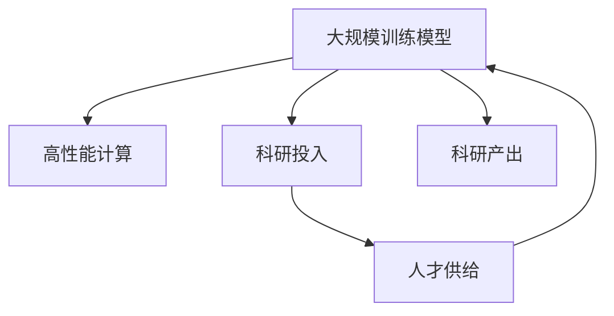

                 

# AI领域的人才稀缺:大规模训练模型的难题

> 关键词：大规模训练模型，人才稀缺，深度学习，高性能计算，科研投入

## 1. 背景介绍

### 1.1 问题由来

近年来，人工智能(AI)领域尤其是深度学习(DL)领域取得了飞速发展，越来越多的复杂任务得以解决，人们对AI的依赖也越来越深。然而，AI领域的人才短缺问题也日益凸显，成为制约其发展的关键瓶颈。

### 1.2 问题核心关键点

人工智能领域人才短缺，主要体现在以下几个方面：

- **高门槛**：AI研究需要深厚的数学、统计、编程、算法等多学科知识，门槛高，非科班出身者难以进入。
- **高成本**：深度学习模型的训练和优化，特别是大规模模型，需要强大的计算资源和科研资金投入，使得只有少数研究机构和企业能够持续进行前沿探索。
- **持续性需求**：AI研究需要大量实验数据和长时间积累，模型参数和超参数需要不断调整优化，非一蹴而就，人才流动性强。
- **应用广泛**：AI技术已经渗透到各个行业，使得AI人才需求迅速扩张，供不应求。

### 1.3 问题研究意义

解决AI领域人才短缺问题，不仅有助于提升科研创新效率，加速AI技术的落地应用，还能激发更多人的兴趣和参与，推动AI事业的持续发展。

## 2. 核心概念与联系

### 2.1 核心概念概述

为更好地理解大规模训练模型在人才短缺问题中的挑战，本节将介绍几个密切相关的核心概念：

- **大规模训练模型**：如BERT、GPT等深度学习模型，具有亿计参数规模，需要强大的计算资源进行训练和优化。
- **高性能计算(HPC)**：指使用专门的硬件和软件，通过并行计算、分布式计算等方式，加速大规模数据处理和模型训练的过程。
- **科研投入**：包括资金、设备、人才等各方面资源，用于支持深度学习模型的研究、开发和部署。
- **人才供给**：包括现有的人才数量、质量、分布和流动性，影响AI领域的人才供需平衡。
- **科研产出**：指科研人员在深度学习领域的创新成果、论文发表、专利申请等。

这些核心概念之间的逻辑关系可以通过以下Mermaid流程图来展示：



这个流程图展示了大规模训练模型在人才短缺问题中的核心概念及其之间的关系：

1. 大规模训练模型需要高性能计算和科研投入的支撑，才能顺利进行训练和优化。
2. 人才供给的多少直接影响科研产出。
3. 科研产出越多，说明科研投入和人才供给得到充分利用，有助于推动行业发展。

## 3. 核心算法原理 & 具体操作步骤
### 3.1 算法原理概述

大规模训练模型在数据密集型任务上的训练和优化过程，可以抽象为以下步骤：

1. **数据准备**：收集和预处理大规模数据集。
2. **模型初始化**：定义和初始化模型结构，包括网络层、激活函数、损失函数等。
3. **模型训练**：使用反向传播算法更新模型参数，最小化损失函数。
4. **模型优化**：使用各种优化器对模型进行调优，加速训练过程。
5. **模型评估**：在验证集上评估模型性能，决定是否停止训练。

### 3.2 算法步骤详解

下面以BERT模型的训练为例，详细介绍大规模训练模型的具体操作步骤。

#### 3.2.1 数据准备

BERT模型需要大规模的无标签文本数据进行预训练。可以采用以下方法收集数据：

- 从互联网抓取公开数据集，如维基百科、新闻、书籍等。
- 使用数据爬虫工具抓取特定领域的数据，如医疗、金融、教育等。
- 进行数据预处理，如去除噪音、分词、去重等。

#### 3.2.2 模型初始化

BERT模型是一个典型的Transformer模型，包括Transformer编码器层和池化层。初始化过程需要设置模型的超参数，如学习率、批大小、层数、head数等。可以使用TensorFlow、PyTorch等框架进行模型定义。

#### 3.2.3 模型训练

模型训练是整个流程的核心，通常需要在大规模分布式计算环境中进行。具体步骤如下：

- 划分训练集和验证集。
- 定义损失函数，如交叉熵损失、均方误差损失等。
- 使用反向传播算法计算梯度，更新模型参数。
- 使用优化器如Adam、SGD等进行模型优化。
- 在验证集上评估模型性能，决定是否停止训练。

#### 3.2.4 模型优化

模型优化是提高模型性能的关键步骤。常见的优化方法包括：

- **学习率调度**：随着训练进程逐渐减小学习率。
- **正则化**：使用L2正则、Dropout等方法避免过拟合。
- **混合精度训练**：使用低精度浮点数据类型，减少计算资源消耗。
- **分布式训练**：使用多个计算节点并行计算，加速训练速度。

#### 3.2.5 模型评估

模型评估是判断模型是否过拟合的关键步骤。常用的评估指标包括：

- **精度(Accuracy)**：模型正确分类的比例。
- **召回率(Recall)**：模型正确识别正样本的比例。
- **F1值(F1-score)**：综合考虑精度和召回率的指标。
- **ROC曲线(AUC)**：评估二分类模型的性能。

### 3.3 算法优缺点

大规模训练模型具有以下优点：

- **性能优越**：通过大量的数据和计算资源，训练出的模型具有较高的精度和泛化能力。
- **适用广泛**：可以应用于各种复杂的NLP任务，如情感分析、文本生成、机器翻译等。
- **可扩展性强**：可以在分布式计算环境下进行训练，支持模型规模的不断扩展。

同时，大规模训练模型也存在一定的缺点：

- **计算资源需求高**：需要大量的GPU、TPU等高性能计算资源，对硬件要求高。
- **时间成本高**：训练过程时间长，需要数天甚至数周。
- **科研投入大**：需要高额的科研资金和设备投入，非小企业能承担。
- **人才短缺**：需要深厚的高端人才进行模型设计和优化，但这样的人才数量有限。

### 3.4 算法应用领域

大规模训练模型已经在多个领域得到应用，例如：

- **自然语言处理(NLP)**：如BERT、GPT等模型在情感分析、文本生成、机器翻译等任务上取得了优异的性能。
- **计算机视觉(CV)**：如ResNet、Inception等模型在图像分类、目标检测、人脸识别等任务上表现出色。
- **语音识别(SR)**：如Tacotron、WaveNet等模型在语音合成、语音识别等任务上取得了进步。
- **推荐系统(Recommender Systems)**：如FM、PR、DNN等模型在电商、音乐、新闻等推荐场景上表现优异。

## 4. 数学模型和公式 & 详细讲解 & 举例说明
### 4.1 数学模型构建

大规模训练模型的训练过程可以抽象为以下数学模型：

设模型参数为 $\theta$，输入数据为 $x$，目标变量为 $y$，损失函数为 $L(\theta, x, y)$，优化目标为 $\min_{\theta} L(\theta, x, y)$。通过反向传播算法和优化器，不断更新参数 $\theta$，直至最小化损失函数。

### 4.2 公式推导过程

以BERT模型的损失函数为例，推导过程如下：

1. 定义输入数据和目标变量：
   - 输入数据 $x = [x_1, x_2, ..., x_n]$，表示一个文本序列。
   - 目标变量 $y$ 表示文本分类标签。

2. 定义模型输出：
   - 使用BERT模型处理输入数据 $x$，得到模型输出 $h(x)$。
   - $h(x)$ 包含多个输出向量，每个向量对应一个词向量。

3. 定义损失函数：
   - 使用交叉熵损失函数，计算模型输出与真实标签之间的差异。
   - 定义损失函数为 $L(\theta, x, y) = -\sum_{i=1}^n y_i \log h(x)_i + (1 - y_i) \log (1 - h(x)_i)$。

4. 使用反向传播算法计算梯度：
   - 对 $L(\theta, x, y)$ 求偏导数，得到损失函数的梯度。
   - 使用Adam等优化算法，根据梯度更新模型参数 $\theta$。

### 4.3 案例分析与讲解

假设有一个文本分类任务，输入数据 $x = [x_1, x_2, ..., x_n]$，目标变量 $y = [y_1, y_2, ..., y_n]$，其中 $y_i \in \{0, 1\}$，表示文本是否属于正面情感。使用BERT模型进行训练和优化，步骤如下：

1. 准备数据集：收集10万条情感分类数据，分为训练集和验证集。
2. 初始化模型：定义BERT模型，设置超参数。
3. 训练模型：在分布式计算环境中，使用Adam优化器进行训练，每2000个batch输出验证集上的精度。
4. 优化模型：使用学习率衰减、正则化等方法，进一步优化模型参数。
5. 评估模型：在测试集上评估模型精度，取平均作为最终结果。

## 5. 项目实践：代码实例和详细解释说明
### 5.1 开发环境搭建

为了进行大规模训练模型的开发，需要搭建高性能计算环境。以下是搭建步骤：

1. 安装Anaconda：从官网下载并安装Anaconda，用于创建独立的Python环境。
2. 创建并激活虚拟环境：
```bash
conda create -n dl-env python=3.8 
conda activate dl-env
```
3. 安装深度学习框架：
```bash
pip install torch torchvision torchaudio
```
4. 安装高性能计算库：
```bash
pip install distributed dask horovod
```

### 5.2 源代码详细实现

下面以BERT模型为例，给出使用TensorFlow进行情感分类任务的代码实现。

```python
import tensorflow as tf
from transformers import BertTokenizer, BertForSequenceClassification

# 初始化数据集
train_data = load_train_data()
dev_data = load_dev_data()
test_data = load_test_data()

# 初始化模型和分词器
model_name = 'bert-base-uncased'
tokenizer = BertTokenizer.from_pretrained(model_name)
model = BertForSequenceClassification.from_pretrained(model_name, num_labels=2)

# 准备数据
train_input = tokenizer(train_data, padding=True, truncation=True, max_length=512)
dev_input = tokenizer(dev_data, padding=True, truncation=True, max_length=512)
test_input = tokenizer(test_data, padding=True, truncation=True, max_length=512)

# 定义输入和标签
train_dataset = tf.data.Dataset.from_tensor_slices((train_input['input_ids'], train_input['attention_mask'], train_input['labels']))
dev_dataset = tf.data.Dataset.from_tensor_slices((dev_input['input_ids'], dev_input['attention_mask'], dev_input['labels']))
test_dataset = tf.data.Dataset.from_tensor_slices((test_input['input_ids'], test_input['attention_mask'], test_input['labels']))

# 训练模型
optimizer = tf.keras.optimizers.Adam(learning_rate=2e-5)
loss = tf.keras.losses.SparseCategoricalCrossentropy(from_logits=True)
metric = tf.keras.metrics.SparseCategoricalAccuracy('accuracy')

@tf.function
def train_step(inputs, labels):
    with tf.GradientTape() as tape:
        outputs = model(inputs, attention_mask=inputs['attention_mask'])
        loss_value = loss(labels, outputs)
    gradients = tape.gradient(loss_value, model.trainable_variables)
    optimizer.apply_gradients(zip(gradients, model.trainable_variables))
    return loss_value

@tf.function
def evaluate_step(inputs, labels):
    outputs = model(inputs, attention_mask=inputs['attention_mask'])
    return metric(labels, outputs)

# 定义训练和评估函数
def train_epoch(model, dataset, batch_size, optimizer, loss, metric):
    for epoch in range(epochs):
        for batch in dataset:
            loss_value = train_step(batch)
            if batch['labels'].shape[0] % 500 == 0:
                metric_result = evaluate_step(dev_input)
                print(f'Epoch {epoch+1}, loss={loss_value:.4f}, accuracy={metric_result:.4f}')

# 训练模型
train_epoch(model, train_dataset, batch_size, optimizer, loss, metric)
```

### 5.3 代码解读与分析

上述代码实现了使用BERT模型进行情感分类任务的训练过程。下面我们详细解读关键代码：

**数据准备**：
- `train_data`, `dev_data`, `test_data` 是预处理好的数据集，包括输入数据 `input_ids`、掩码 `attention_mask` 和标签 `labels`。
- `tokenizer` 是BERT模型的分词器，用于将文本转换为token ids。
- `model` 是BERT模型，包含多个Transformer编码器和池化层。

**模型定义**：
- `optimizer` 是Adam优化器，用于更新模型参数。
- `loss` 是交叉熵损失函数，用于计算模型输出与真实标签之间的差异。
- `metric` 是准确率指标，用于评估模型性能。

**训练和评估函数**：
- `train_step` 是训练步骤函数，计算模型输出、损失和梯度，更新模型参数。
- `evaluate_step` 是评估步骤函数，计算模型输出和准确率。
- `train_epoch` 是整个训练循环，每轮迭代一次数据集，计算损失和准确率。

**训练流程**：
- 定义多个参数，包括超参数、优化器、损失函数和准确率指标。
- 使用 `train_step` 函数进行模型训练，每轮迭代一次数据集，输出损失和准确率。
- 使用 `evaluate_step` 函数在验证集上进行模型评估，每500个batch输出一次结果。
- 重复上述步骤，直到训练结束。

## 6. 实际应用场景
### 6.1 智能客服系统

智能客服系统是大规模训练模型的典型应用场景之一。传统客服系统依赖大量人力，响应速度慢，无法24小时服务。使用大规模训练模型进行微调，可以实时响应客户咨询，提升客户体验。

具体实现步骤如下：

1. 收集企业内部客服对话数据，将其分为训练集和验证集。
2. 使用BERT等模型进行预训练，然后微调以适配企业特定的客服任务。
3. 将微调后的模型部署到生产环境，实时接收客户咨询并给出最佳答复。
4. 持续收集客户反馈，不断优化模型，提升服务质量。

### 6.2 金融舆情监测

金融舆情监测需要实时分析网络舆论，及时发现负面信息。大规模训练模型可以自动理解文本内容，快速识别负面情感。

具体实现步骤如下：
1. 收集金融领域的文本数据，如新闻、评论、博客等。
2. 使用BERT等模型进行预训练，然后微调以适配金融舆情监测任务。
3. 实时抓取网络文本数据，进行情感分析和舆情监测。
4. 根据监测结果，及时发出预警，辅助金融决策。

### 6.3 个性化推荐系统

个性化推荐系统需要大规模数据进行训练，使用大规模训练模型进行微调，可以更精准地预测用户兴趣，提供个性化推荐。

具体实现步骤如下：
1. 收集用户行为数据，如浏览记录、点击记录、评分记录等。
2. 使用BERT等模型进行预训练，然后微调以适配推荐系统任务。
3. 实时接收用户输入，预测其兴趣，生成推荐结果。
4. 持续收集用户反馈，不断优化推荐算法。

## 7. 工具和资源推荐
### 7.1 学习资源推荐

为了帮助开发者掌握大规模训练模型在实际应用中的方法和技巧，以下是一些推荐的学习资源：

1. 《深度学习入门》：李沐著，系统介绍了深度学习的基本概念和算法。
2. 《Python深度学习》：François Chollet著，介绍了TensorFlow和Keras的使用方法。
3. 《TensorFlow实战Google AI》：张伟栋著，介绍了TensorFlow的高级应用和最佳实践。
4. 《大规模分布式深度学习》：Wang等著，介绍了分布式计算和大规模模型训练的技术。
5. 《自然语言处理综述》：Jurafsky等著，系统介绍了NLP领域的最新进展和前沿技术。

### 7.2 开发工具推荐

为了方便大规模训练模型的开发和部署，以下是一些推荐的开发工具：

1. PyTorch：由Facebook开发的深度学习框架，灵活性高，支持GPU加速。
2. TensorFlow：由Google开发的深度学习框架，生产环境部署方便。
3. Jupyter Notebook：Python开发的交互式编程环境，方便开发和实验。
4. Google Colab：Google提供的云端Jupyter Notebook环境，免费使用GPU/TPU资源。
5. VS Code：微软开发的集成开发环境，支持Python开发。

### 7.3 相关论文推荐

大规模训练模型在AI领域的研究已经取得了丰硕成果，以下是一些推荐的相关论文：

1. BERT: Pre-training of Deep Bidirectional Transformers for Language Understanding：提出BERT模型，引入掩码语言模型预训练任务，提升了模型性能。
2. Attention is All You Need：提出Transformer模型，展示了自注意力机制在NLP任务中的优越性。
3. Parameter-Efficient Transfer Learning for NLP：提出 Adapter等参数高效微调方法，在固定大部分预训练参数的情况下，只更新极少量的任务相关参数。
4. Improving Language Understanding by Generative Pre-training：提出GPT模型，展示了语言模型的生成能力在预训练中的重要性。
5. Deep Residual Learning for Image Recognition：提出ResNet模型，展示了深度残差网络的性能优越性。

## 8. 总结：未来发展趋势与挑战
### 8.1 总结

本文对大规模训练模型在AI领域的应用进行了全面系统的介绍。首先阐述了深度学习模型的训练和优化过程，明确了其在人才短缺问题中的挑战。其次，从原理到实践，详细讲解了科研投入与人才供给之间的关系，提供了大规模训练模型的代码实现和评估方法。同时，本文还探讨了模型在智能客服、金融舆情、个性化推荐等多个行业领域的应用前景，展示了其强大的性能和应用潜力。最后，本文推荐了相关的学习资源、开发工具和论文，帮助读者深入理解和应用大规模训练模型。

通过本文的系统梳理，可以看到，大规模训练模型在AI领域的应用前景广阔，但也面临着计算资源需求高、科研投入大、人才短缺等挑战。未来，需要在计算资源、科研投入、人才培养等方面进行持续优化，推动AI技术的普及和应用。

### 8.2 未来发展趋势

展望未来，大规模训练模型将呈现以下几个发展趋势：

1. **计算资源优化**：随着计算硬件的发展，未来大规模模型的训练将更加高效。分布式计算、GPU/TPU等高性能设备的应用，将大大降低计算成本。
2. **科研投入增加**：政府和企业将加大对AI领域的科研投入，支持更多的高端人才进行研究探索。
3. **人才培训加强**：高校和科研机构将加强AI相关课程的开设，培养更多AI人才，缓解人才短缺问题。
4. **应用场景丰富**：AI技术将在更多领域得到应用，如智慧医疗、智能制造、金融科技等，推动各行业数字化转型。
5. **模型架构创新**：未来将涌现更多创新的模型架构，如Transformer的变体、神经网络的结构优化等，提升模型的效率和性能。

### 8.3 面临的挑战

尽管大规模训练模型在AI领域的应用取得了显著进展，但仍面临诸多挑战：

1. **计算资源瓶颈**：大规模模型训练需要强大的计算资源，对硬件的要求较高。如何优化计算资源的使用，提高训练效率，是一个重要问题。
2. **科研投入不足**：AI领域的高端人才稀缺，科研投入不足，难以支撑大规模模型训练的持续探索。如何吸引更多的高端人才，加大科研投入，是一个亟待解决的问题。
3. **模型鲁棒性不足**：大规模模型在面对特定领域的任务时，泛化性能不足。如何提高模型的鲁棒性，增强模型的跨领域迁移能力，是一个重要的研究方向。
4. **知识表示困难**：大规模模型难以表示复杂的人类知识，难以理解文本中的上下文和语义关系。如何通过知识图谱、符号化规则等方法，增强模型的知识表示能力，是一个重要的研究方向。
5. **数据隐私问题**：大规模模型训练需要大量数据，但数据隐私问题日益突出。如何保护用户隐私，确保数据安全，是一个重要的研究方向。

### 8.4 研究展望

解决大规模训练模型在AI领域面临的挑战，需要从多个方面进行研究探索：

1. **知识表示方法**：通过知识图谱、符号化规则等方法，增强模型的知识表示能力，提升模型的性能和鲁棒性。
2. **分布式计算技术**：优化分布式计算架构，提高大规模模型的训练效率，降低计算资源的使用成本。
3. **跨领域迁移学习**：研究跨领域迁移学习算法，提高模型的泛化能力和鲁棒性，增强模型的适应性。
4. **数据隐私保护**：研究数据隐私保护技术，保护用户隐私，确保数据安全。
5. **人才培养机制**：加强高校和科研机构对AI领域的人才培养，推动AI技术的持续发展和普及应用。

总之，大规模训练模型在AI领域的应用前景广阔，但也需要从计算资源、科研投入、人才培养等多个方面进行深入研究，才能更好地推动AI技术的普及和应用，造福人类社会。

## 9. 附录：常见问题与解答

**Q1：大规模训练模型在应用中是否需要大量的标注数据？**

A: 大规模训练模型在应用中通常需要大量的标注数据进行微调，以适应特定任务的性能需求。但对于无监督学习或半监督学习模型，仅需要少量的标注数据即可完成训练。

**Q2：大规模训练模型在落地部署时需要注意哪些问题？**

A: 大规模训练模型在落地部署时需要注意以下问题：
1. 模型裁剪：去除不必要的层和参数，减小模型尺寸，加快推理速度。
2. 量化加速：使用低精度浮点数据类型，压缩存储空间，提高计算效率。
3. 服务化封装：将模型封装为标准化服务接口，便于集成调用。
4. 弹性伸缩：根据请求流量动态调整资源配置，平衡服务质量和成本。
5. 监控告警：实时采集系统指标，设置异常告警阈值，确保服务稳定性。
6. 安全防护：采用访问鉴权、数据脱敏等措施，保障数据和模型安全。

**Q3：大规模训练模型在训练过程中如何避免过拟合？**

A: 大规模训练模型在训练过程中可以使用以下方法避免过拟合：
1. 数据增强：通过回译、近义替换等方式扩充训练集。
2. 正则化：使用L2正则、Dropout、Early Stopping等方法避免过拟合。
3. 对抗训练：引入对抗样本，提高模型鲁棒性。
4. 参数高效微调：只调整少量参数(如Adapter、Prefix等)，减小过拟合风险。
5. 多模型集成：训练多个模型，取平均输出，抑制过拟合。

**Q4：大规模训练模型在实际应用中如何提升性能？**

A: 大规模训练模型在实际应用中可以通过以下方法提升性能：
1. 持续优化模型架构：通过创新架构设计，提高模型效率和性能。
2. 数据预处理：通过数据清洗、特征工程等手段，提升数据质量，增强模型性能。
3. 优化模型参数：通过超参数调优、模型裁剪等手段，优化模型性能。
4. 引入先验知识：通过知识图谱、符号化规则等方法，增强模型的知识表示能力，提升模型性能。
5. 动态学习：通过在线学习、自适应学习等方法，使模型能够不断学习和适应新数据，提升模型性能。

**Q5：大规模训练模型在科研投入中需要注意哪些问题？**

A: 大规模训练模型在科研投入中需要注意以下问题：
1. 科研方向选择：需要关注前沿技术和应用场景，选择有潜力的研究方向。
2. 计算资源优化：需要优化计算资源的使用，提高训练效率。
3. 科研团队建设：需要建立稳定的科研团队，保证研究的持续性和稳定性。
4. 科研资金管理：需要科学管理科研资金，确保资金使用的高效和合理。
5. 科研产出评估：需要建立科学的科研产出评估体系，保证科研投入的回报率。

综上所述，大规模训练模型在AI领域的应用前景广阔，但也需要从计算资源、科研投入、人才培养等多个方面进行深入研究，才能更好地推动AI技术的普及和应用，造福人类社会。

---

作者：禅与计算机程序设计艺术 / Zen and the Art of Computer Programming

