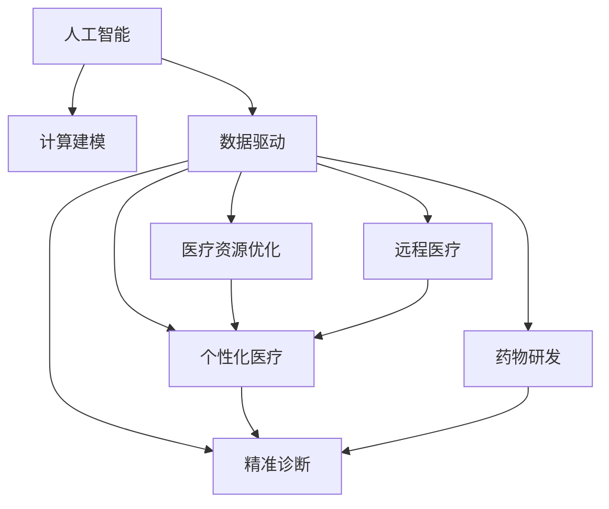

                 

# AI驱动的创新：人类计算在医疗行业的创新应用

> 关键词：人工智能,医疗健康,计算建模,数据驱动,疾病预测,个性化治疗,医疗资源优化,远程医疗

## 1. 背景介绍

在过去数十年间，人工智能(AI)技术在医疗健康领域的应用日趋成熟，成为推动行业变革的重要驱动力。随着数据科学和计算技术的发展，AI正从传统的疾病诊断和图像识别等任务，逐步扩展到更复杂的预测和决策场景中，帮助医生更精准地理解疾病机理，制定个性化治疗方案，优化医疗资源配置，改善患者诊疗体验。

### 1.1 问题由来

当前，全球医疗健康系统面临严峻挑战，如老龄化加剧、医疗资源分布不均、疾病负担日增等。这些问题促使医疗行业加速引入AI技术，以实现更高效、更精准的诊疗服务。AI驱动的医疗创新，有望通过数据驱动的计算建模，全面优化医疗系统的各个环节，提升整体医疗水平，让健康服务更加普惠。

### 1.2 问题核心关键点

在AI驱动的医疗创新中，计算建模和数据驱动是两大核心技术。具体来说：

- **计算建模**：利用数学模型和计算技术，模拟疾病机理和诊疗过程，为医学决策提供科学依据。
- **数据驱动**：通过收集、分析和利用海量医疗数据，优化诊疗策略和资源配置，提升医疗服务质量和效率。

### 1.3 问题研究意义

AI在医疗健康领域的创新应用，不仅提高了诊疗准确性和效率，也为患者带来了更好的健康管理体验。具体意义包括：

1. **个性化医疗**：利用AI技术，通过分析患者的基因、病史、生活习惯等数据，制定个性化治疗方案，提升治疗效果。
2. **精准诊断**：通过AI算法，可以更准确地识别和诊断早期疾病，减少误诊和漏诊，提高患者生存率。
3. **医疗资源优化**：AI能够帮助医疗机构更合理地分配资源，如床位、医护人员等，减轻患者等待时间，提升医疗服务可及性。
4. **远程医疗**：借助AI技术，实现远程诊疗和健康监测，为偏远地区提供医疗服务，缩小城乡医疗差距。
5. **药物研发**：AI加速药物发现和设计，提高研发效率和成功率，加速新药上市。

## 2. 核心概念与联系

### 2.1 核心概念概述

为更好地理解AI在医疗健康领域的创新应用，本节将介绍几个关键概念及其相互联系：

- **人工智能**：指通过算法和计算，使计算机模拟人类的智能行为，实现自动化决策和任务执行。
- **计算建模**：通过构建数学模型和计算模型，模拟复杂的系统行为，为医疗决策提供依据。
- **数据驱动**：利用数据挖掘和机器学习技术，从海量数据中提取知识，优化医疗服务。
- **个性化医疗**：根据患者的个体特征，制定个性化治疗方案，提高诊疗效果。
- **精准诊断**：利用AI算法，提高疾病检测的准确性和早期发现率。
- **医疗资源优化**：通过优化资源配置，提升医疗服务的可及性和效率。
- **远程医疗**：借助AI技术，实现远程诊疗和健康监测，提高医疗服务的可及性和便捷性。
- **药物研发**：利用AI加速药物发现和设计，提高研发效率和成功率。

这些核心概念共同构成了AI驱动的医疗健康应用框架，旨在通过计算建模和数据驱动，全面提升医疗系统的效能。

### 2.2 核心概念原理和架构的 Mermaid 流程图



这个流程图展示了人工智能在医疗健康领域的应用路径，各概念之间的联系和相互作用：

1. **人工智能**是核心驱动力，通过计算建模和数据驱动，实现具体应用。
2. **计算建模**用于模拟疾病机理和治疗过程，提供科学依据。
3. **数据驱动**通过分析大量医疗数据，优化诊疗策略和资源配置。
4. **个性化医疗、精准诊断、医疗资源优化、远程医疗、药物研发**均为数据驱动和计算建模的实际应用场景，互为支撑。

## 3. 核心算法原理 & 具体操作步骤
### 3.1 算法原理概述

AI在医疗健康领域的应用，主要基于计算建模和数据驱动的算法原理。通过构建数学模型，模拟疾病发展和治疗过程，同时利用机器学习和数据分析技术，从大量医疗数据中提取知识，用于优化诊疗决策和资源配置。

### 3.2 算法步骤详解

AI驱动的医疗应用，通常包括以下关键步骤：

**Step 1: 数据收集与预处理**
- 收集结构化（如电子病历、影像数据等）和非结构化（如病历记录、患者反馈等）医疗数据。
- 对数据进行清洗、去噪、标注等预处理，确保数据质量和可用性。

**Step 2: 构建计算模型**
- 根据具体应用场景，选择合适的数学模型和计算模型，如回归模型、分类模型、决策树等。
- 设计模型参数和结构，选择合适的算法进行训练和验证。

**Step 3: 数据驱动建模**
- 利用机器学习算法（如随机森林、深度学习等），对收集到的医疗数据进行建模和训练。
- 选择适当的评估指标（如准确率、召回率、F1-score等），评估模型性能。
- 针对特定应用，对模型进行优化和调整，提升模型精度和泛化能力。

**Step 4: 模型评估与验证**
- 在验证集上评估模型性能，确认模型是否具有良好的泛化能力。
- 利用交叉验证、留一法等技术，避免过拟合和欠拟合。

**Step 5: 实际应用与优化**
- 将训练好的模型应用于实际医疗场景，如疾病预测、诊断、治疗方案推荐等。
- 通过反馈和调整，持续优化模型，提升其在实际应用中的表现。

### 3.3 算法优缺点

AI驱动的医疗应用，具有以下优点：

1. **高效性**：AI算法能够快速处理海量数据，提高诊疗效率。
2. **准确性**：通过大数据和深度学习，AI能够提供更准确的诊断和治疗建议。
3. **灵活性**：AI算法可以灵活适应各种应用场景，如个性化医疗、精准诊断等。
4. **可扩展性**：AI模型可以不断更新和优化，适应技术进步和数据变化。

同时，也存在以下缺点：

1. **数据隐私与安全**：医疗数据涉及患者隐私，保护数据安全是应用AI的重要前提。
2. **模型解释性**：复杂的AI模型（如深度学习）常常被视为"黑盒"，其决策过程缺乏可解释性。
3. **依赖高质量数据**：AI模型的效果高度依赖于数据质量和标注的准确性。
4. **计算资源需求高**：AI模型通常需要高性能计算资源，对硬件和软件环境要求较高。

### 3.4 算法应用领域

AI在医疗健康领域的应用，涵盖多个领域，具体包括：

- **疾病预测与预防**：利用AI算法，通过分析基因数据、生活史数据等，预测疾病发生风险，进行早期干预。
- **精准诊断与影像分析**：通过AI技术，提高影像诊断的准确性和速度，辅助医生进行精准诊断。
- **个性化医疗与治疗方案推荐**：利用患者基因组、病史等数据，制定个性化治疗方案，提升治疗效果。
- **医疗资源优化与调度**：通过AI技术，优化医院资源配置，减少等待时间，提升医疗服务效率。
- **远程医疗与健康监测**：利用AI技术，实现远程诊疗、健康监测和管理，提高医疗服务的可及性。
- **药物研发与新药发现**：通过AI技术，加速药物发现和设计，提高研发效率和成功率。

## 4. 数学模型和公式 & 详细讲解 & 举例说明

### 4.1 数学模型构建

在AI驱动的医疗应用中，数学模型的构建是关键步骤之一。以下以疾病预测为例，介绍常用数学模型的构建方法：

假设某疾病的发生概率由以下因素决定：基因型、年龄、生活习惯、环境因素等。记这些因素的向量表示为 $x=(x_1, x_2, ..., x_n)$，其中 $x_i$ 为第 $i$ 个因素的数值。疾病发生的概率 $P(y=1|x)$ 可以用逻辑回归模型表示为：

$$
P(y=1|x) = \frac{1}{1+\exp(-\beta_0 - \beta_1 x_1 - ... - \beta_n x_n)}
$$

其中 $\beta_0, \beta_1, ..., \beta_n$ 为模型参数，需要通过训练数据进行估计。

### 4.2 公式推导过程

根据上述逻辑回归模型，可以推导出模型参数的估计方法：

$$
\hat{\beta} = \arg\min_{\beta} -\frac{1}{N}\sum_{i=1}^N y_i \log P(y=1|x_i) + (1-y_i) \log (1-P(y=1|x_i))
$$

其中 $y_i$ 为样本 $i$ 的标签，即 $y_i=1$ 表示样本 $i$ 患有该疾病，$y_i=0$ 表示样本 $i$ 未患该疾病。

使用梯度下降等优化算法，求解上述最优化问题，即可得到最优的模型参数 $\hat{\beta}$。

### 4.3 案例分析与讲解

**案例分析：个性化医疗的计算建模**

假设某患者 $i$ 的基因型、年龄、生活习惯等数据为 $x_i=(x_{i,1}, x_{i,2}, ..., x_{i,n})$，利用逻辑回归模型，计算患者 $i$ 患某种疾病的概率 $P(y=1|x_i)$。

具体步骤如下：

1. 收集大量患病和未患病的患者数据，标记为 $\{(x_j, y_j)\}_{j=1}^M$。
2. 构建逻辑回归模型，利用数据集进行训练和验证。
3. 利用训练好的模型，对患者 $i$ 的数据 $x_i$ 进行预测，得到患病的概率 $P(y=1|x_i)$。
4. 根据预测结果，制定个性化的治疗方案，如饮食、运动、药物等。

## 5. 项目实践：代码实例和详细解释说明

### 5.1 开发环境搭建

在AI驱动的医疗应用中，开发环境搭建是关键。以下是基于Python进行深度学习开发的常见环境配置流程：

1. 安装Anaconda：从官网下载并安装Anaconda，用于创建独立的Python环境。
2. 创建并激活虚拟环境：
```bash
conda create -n pytorch-env python=3.8 
conda activate pytorch-env
```

3. 安装PyTorch：根据CUDA版本，从官网获取对应的安装命令。例如：
```bash
conda install pytorch torchvision torchaudio cudatoolkit=11.1 -c pytorch -c conda-forge
```

4. 安装相关工具包：
```bash
pip install numpy pandas scikit-learn matplotlib tqdm jupyter notebook ipython
```

完成上述步骤后，即可在`pytorch-env`环境中开始开发实践。

### 5.2 源代码详细实现

以下以疾病预测为例，使用PyTorch进行逻辑回归模型的实现：

```python
import torch
import torch.nn as nn
import torch.optim as optim

# 定义模型
class LogisticRegression(nn.Module):
    def __init__(self, input_size):
        super(LogisticRegression, self).__init__()
        self.linear = nn.Linear(input_size, 1)
        
    def forward(self, x):
        return torch.sigmoid(self.linear(x))

# 定义数据集
class DiseaseDataset(Dataset):
    def __init__(self, data, targets, transform=None):
        self.data = data
        self.targets = targets
        self.transform = transform
        
    def __len__(self):
        return len(self.data)
    
    def __getitem__(self, idx):
        x, y = self.data[idx], self.targets[idx]
        if self.transform:
            x = self.transform(x)
        return x, y

# 定义训练函数
def train(model, device, train_loader, optimizer, num_epochs, batch_size):
    model.train()
    for epoch in range(num_epochs):
        for batch_idx, (data, targets) in enumerate(train_loader):
            data, targets = data.to(device), targets.to(device)
            optimizer.zero_grad()
            output = model(data)
            loss = nn.BCELoss()(output, targets)
            loss.backward()
            optimizer.step()
            if (batch_idx+1) % 100 == 0:
                print(f'Epoch {epoch+1}, Batch {batch_idx+1}, Loss: {loss.item()}')

# 定义测试函数
def evaluate(model, device, test_loader):
    model.eval()
    with torch.no_grad():
        correct = 0
        total = 0
        for data, targets in test_loader:
            data, targets = data.to(device), targets.to(device)
            output = model(data)
            _, predicted = torch.max(output.data, 1)
            total += targets.size(0)
            correct += (predicted == targets).sum().item()
        print(f'Accuracy of the model on the {len(test_loader.dataset)} samples: {100 * correct / total:.2f}%')

# 定义数据预处理
from sklearn.preprocessing import StandardScaler

def preprocess(data):
    scaler = StandardScaler()
    scaled_data = scaler.fit_transform(data)
    return scaled_data

# 加载数据
from sklearn.datasets import load_breast_cancer
data, targets = load_breast_cancer(return_X_y=True)
data = preprocess(data)

# 划分训练集和测试集
train_size = int(0.8 * len(data))
train_data, test_data = data[:train_size], data[train_size:]

# 构建数据集
train_dataset = DiseaseDataset(train_data, targets)
test_dataset = DiseaseDataset(test_data, targets)

# 定义模型、优化器和设备
model = LogisticRegression(input_size=30)
optimizer = optim.SGD(model.parameters(), lr=0.01)
device = torch.device('cuda' if torch.cuda.is_available() else 'cpu')
model.to(device)

# 训练模型
train(model, device, train_loader(train_dataset, batch_size=32), optimizer, num_epochs=10)

# 测试模型
evaluate(model, device, test_loader(test_dataset, batch_size=32))
```

### 5.3 代码解读与分析

**代码解读**：

1. **定义模型**：定义逻辑回归模型 `LogisticRegression`，包含一个线性层。
2. **定义数据集**：定义疾病预测的数据集 `DiseaseDataset`，包含数据和标签。
3. **定义训练函数**：实现训练过程，使用SGD优化器进行模型参数的更新。
4. **定义测试函数**：实现模型在测试集上的性能评估。
5. **数据预处理**：对数据进行标准化处理。
6. **加载数据和划分数据集**：使用乳腺癌数据集，划分训练集和测试集。
7. **构建数据集和加载模型、优化器、设备**：使用PyTorch构建模型，设置优化器和设备。
8. **训练和测试模型**：调用训练函数和测试函数进行模型训练和性能评估。

**代码分析**：

1. **模型定义**：逻辑回归模型为线性模型，简单高效，适合处理多维数据。
2. **数据预处理**：对数据进行标准化处理，提高了模型训练的速度和效果。
3. **训练函数**：使用了SGD优化器，适合处理大规模数据集。
4. **测试函数**：使用准确率作为评估指标，直观反映了模型性能。

## 6. 实际应用场景

### 6.1 疾病预测与预防

AI在疾病预测和预防中的应用，主要通过分析患者基因、生活习惯、环境因素等数据，预测疾病发生风险，进行早期干预。例如，通过AI模型，医生可以根据患者的基因信息和生活习惯，预测其患有某种疾病的概率，并提供相应的预防措施。

**实际应用**：某基因公司利用AI模型，对大量基因数据进行分析，预测糖尿病风险。模型通过逻辑回归算法，分析年龄、体重、饮食、运动等因素，准确预测患者患糖尿病的概率，并给出预防建议。

### 6.2 精准诊断与影像分析

AI在精准诊断中的应用，主要通过分析医学影像数据，识别病变区域，提高诊断的准确性和速度。例如，AI模型能够快速分析CT、MRI等影像数据，识别早期癌症、心脏病等病变，辅助医生进行精准诊断。

**实际应用**：某医院使用深度学习模型分析CT影像数据，识别早期肺癌病变区域。模型通过卷积神经网络(CNN)，自动分析影像特征，准确识别病变区域，提高诊断准确性。

### 6.3 个性化医疗与治疗方案推荐

AI在个性化医疗中的应用，主要通过分析患者基因组、病史、生活习惯等数据，制定个性化治疗方案，提升治疗效果。例如，AI模型可以根据患者的基因信息和生活习惯，制定个性化的饮食、运动、药物等治疗方案。

**实际应用**：某医疗机构利用AI模型，分析患者的基因数据和生活习惯，推荐个性化的治疗方案。模型通过回归算法，综合分析各项数据，生成个性化的饮食和运动方案，提升治疗效果。

### 6.4 医疗资源优化与调度

AI在医疗资源优化中的应用，主要通过分析医院的资源配置和使用情况，优化资源分配，提高医疗服务效率。例如，AI模型可以预测急诊室的病患流量，优化医护人员和床位资源的配置，缩短患者等待时间。

**实际应用**：某医院使用AI模型预测急诊室的病患流量，优化医护人员和床位资源的配置。模型通过时间序列分析，预测未来病患流量，动态调整资源配置，缩短患者等待时间。

### 6.5 远程医疗与健康监测

AI在远程医疗中的应用，主要通过分析患者的生活数据，进行健康监测和管理，提高医疗服务的可及性。例如，AI模型可以通过分析智能穿戴设备收集的数据，监测患者的心率、血压等健康指标，提供健康建议和预警。

**实际应用**：某健康公司利用AI模型，分析智能穿戴设备收集的数据，监测患者的心率和血压。模型通过时间序列分析，预测异常健康指标，提供健康建议和预警，保障患者健康。

### 6.6 药物研发与新药发现

AI在新药发现和药物研发中的应用，主要通过分析化合物的分子结构和药效数据，加速药物研发进程。例如，AI模型可以根据化合物的分子结构，预测其药效和副作用，优化药物设计。

**实际应用**：某药企利用AI模型，分析化合物的分子结构和药效数据，加速新药研发。模型通过深度学习算法，预测化合物药效和副作用，优化药物设计，缩短研发周期。

## 7. 工具和资源推荐

### 7.1 学习资源推荐

为了帮助开发者系统掌握AI在医疗健康领域的应用，这里推荐一些优质的学习资源：

1. 《深度学习在医疗健康领域的应用》系列博文：由深度学习专家撰写，深入浅出地介绍了AI在医疗健康领域的应用实例和核心技术。

2. Coursera《深度学习在医疗中的应用》课程：斯坦福大学开设的深度学习课程，涵盖医疗领域的数据驱动和计算建模方法。

3. 《AI在医疗健康领域的应用》书籍：详细介绍了AI在医疗健康领域的多个应用场景，包括疾病预测、精准诊断、个性化医疗等。

4. 《医学大数据与人工智能》系列公开课：汇集了国内外知名专家，深入讲解AI在医疗健康领域的应用方法和技术。

5. Kaggle《医疗健康数据集》竞赛：通过实际竞赛，练习数据预处理、模型构建和优化技能，提升实战能力。

### 7.2 开发工具推荐

高效的开发离不开优秀的工具支持。以下是几款用于AI医疗开发常用的工具：

1. PyTorch：基于Python的开源深度学习框架，灵活动态的计算图，适合快速迭代研究。

2. TensorFlow：由Google主导开发的开源深度学习框架，生产部署方便，适合大规模工程应用。

3. Scikit-learn：基于Python的机器学习库，提供丰富的数据预处理和模型构建功能。

4. Pandas：基于Python的数据处理库，提供高效的数据读写和分析功能。

5. Weights & Biases：模型训练的实验跟踪工具，可以记录和可视化模型训练过程中的各项指标。

6. TensorBoard：TensorFlow配套的可视化工具，可实时监测模型训练状态，并提供丰富的图表呈现方式。

### 7.3 相关论文推荐

AI在医疗健康领域的发展，离不开持续的研究和创新。以下是几篇奠基性的相关论文，推荐阅读：

1. "A Survey of Artificial Intelligence in Medicine"：全面综述了AI在医疗健康领域的应用现状和发展趋势。

2. "Deep Learning for Healthcare"：深度学习在医疗领域的应用综述，涵盖疾病预测、影像分析、个性化医疗等多个方面。

3. "AI in Drug Discovery and Development"：AI在新药研发中的应用综述，介绍了AI在药物设计、药物筛选和临床试验中的应用。

4. "Machine Learning in Predicting Outcomes and Improving Patient Care"：利用机器学习进行疾病预测和患者管理的综述，展示了AI在医疗健康领域的应用前景。

5. "Natural Language Processing for Medical Documentation"：自然语言处理在医疗文档中的应用综述，展示了AI在电子病历和健康监测中的应用。

这些论文代表了大数据和AI在医疗健康领域的研究方向，阅读这些论文将有助于深入理解AI技术在医疗健康领域的应用现状和未来发展趋势。

## 8. 总结：未来发展趋势与挑战

### 8.1 总结

AI在医疗健康领域的应用，通过数据驱动的计算建模和深度学习技术，极大地提升了医疗服务的质量和效率。从疾病预测、精准诊断到个性化医疗，AI在各个环节都展现了强大的应用潜力。通过本文的系统梳理，可以看到，AI技术在医疗健康领域的广泛应用，为医疗行业带来了深刻的变革。

### 8.2 未来发展趋势

展望未来，AI在医疗健康领域的应用将呈现以下几个趋势：

1. **多模态数据融合**：AI将结合多模态数据（如基因数据、影像数据、生物标志物等），构建更全面、准确的健康模型。
2. **个性化医疗普及**：随着AI技术的发展，个性化医疗将变得更加普及和精准，提供更符合个体需求的诊疗方案。
3. **远程医疗普及**：远程医疗将成为医疗健康领域的重要组成部分，通过AI技术，实现远程诊疗和健康监测。
4. **实时数据分析**：实时数据驱动的AI模型将成为医疗健康领域的重要工具，实现实时健康监测和预警。
5. **智能辅助诊疗**：AI将与医生协同工作，提供智能辅助诊断和治疗建议，提升医疗服务水平。

### 8.3 面临的挑战

尽管AI在医疗健康领域的应用前景广阔，但也面临诸多挑战：

1. **数据隐私和安全**：医疗数据涉及患者隐私，保护数据安全是应用AI的重要前提。
2. **模型可解释性**：复杂的AI模型常常被视为"黑盒"，其决策过程缺乏可解释性。
3. **高质量数据需求**：AI模型的效果高度依赖于数据质量和标注的准确性。
4. **计算资源需求**：AI模型通常需要高性能计算资源，对硬件和软件环境要求较高。

### 8.4 研究展望

面对AI在医疗健康领域的应用挑战，未来的研究需要在以下几个方面寻求新的突破：

1. **数据隐私保护**：开发隐私保护技术，确保医疗数据的保密性和安全性。
2. **模型可解释性**：引入可解释性算法，增强AI模型的决策透明度和可信度。
3. **数据自动化标注**：利用自动化标注技术，减少人工标注工作量，提高数据质量。
4. **多模态数据融合**：开发高效的多模态数据融合算法，提高数据利用效率和模型性能。
5. **实时数据分析**：开发实时数据分析技术，实现对医疗数据的实时监控和预警。

这些研究方向的探索，将进一步推动AI在医疗健康领域的应用，为构建高效、智能、安全的医疗系统铺平道路。面向未来，AI驱动的医疗创新必将成为推动医疗健康事业发展的重要引擎。

## 9. 附录：常见问题与解答

**Q1：AI在医疗健康领域的应用是否会替代医生？**

A: AI在医疗健康领域的应用，更多的是辅助医生进行诊断和治疗，而不是替代医生。AI通过数据分析和计算建模，提供科学依据和辅助决策，帮助医生提高诊疗准确性和效率，但最终的诊疗决策权仍在于医生。

**Q2：AI在医疗健康领域的应用是否会引发伦理问题？**

A: AI在医疗健康领域的应用，涉及隐私保护、数据安全、决策透明等伦理问题。需要建立严格的伦理规范和技术标准，确保AI应用的安全性和可信度。

**Q3：AI在医疗健康领域的应用是否会降低医疗服务的可及性？**

A: 通过远程医疗等形式，AI技术可以显著提高医疗服务的可及性，特别是在偏远地区。AI模型能够实时分析患者数据，提供诊断和治疗建议，缩短患者等待时间。

**Q4：AI在医疗健康领域的应用是否会降低医疗服务的质量？**

A: 通过数据驱动的计算建模和深度学习技术，AI在医疗健康领域的应用，能够提供更加精准的诊断和治疗方案，提升医疗服务的质量和效率。

---

作者：禅与计算机程序设计艺术 / Zen and the Art of Computer Programming

