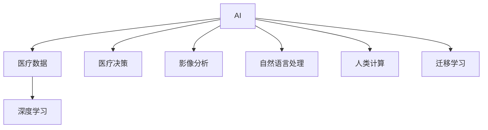

                 

# AI驱动的创新：人类计算在医疗行业的应用

## 1. 背景介绍

### 1.1 问题由来

医疗行业作为人类健康的守护者，长期以来面临着数据处理庞大、诊断难度大、治疗方案复杂等挑战。随着人工智能技术的快速发展，AI正逐步成为医疗行业的重要辅助工具，推动医疗服务的智能化转型。AI在医疗中的应用已经涵盖了影像分析、电子病历、医疗决策等多个领域，显著提升了医疗服务效率和质量。

## 2. 核心概念与联系

### 2.1 核心概念概述

在讨论AI在医疗行业的应用时，我们需要明确以下几个关键概念：

- **AI**: 人工智能，指通过计算机模拟人类智能过程的技术。在医疗行业，AI主要用于数据分析、诊断、治疗方案推荐等。

- **医疗数据**: 包括电子病历、医学影像、基因数据等。这些数据是大模型训练和微调的基础。

- **人类计算**: 指人类与机器协同完成计算任务的过程。在医疗行业，这不仅包括利用AI算法进行计算，还包括医生的诊断和治疗方案制定。

- **深度学习**: 一种通过多层神经网络模拟人脑工作原理的机器学习技术。在医疗中，深度学习被广泛用于图像识别、自然语言处理等任务。

- **迁移学习**: 指将一个领域学习到的知识迁移到另一个领域的应用。在医疗AI中，迁移学习可用于跨领域的模型迁移。

### 2.2 核心概念联系

这些概念之间的联系可通过以下Mermaid流程图来展示：



这些概念共同构成了AI在医疗行业的应用框架，涵盖从数据处理到决策支持的全流程。

## 3. 核心算法原理 & 具体操作步骤

### 3.1 算法原理概述

AI在医疗行业的应用，主要是通过深度学习模型对医疗数据进行处理和分析。深度学习模型通常包括卷积神经网络(CNN)、循环神经网络(RNN)、Transformer等结构，能够自动学习医疗数据的高级特征表示。以卷积神经网络为例，其原理是通过多层卷积和池化操作，捕捉图像中的局部特征，并通过全连接层对这些特征进行分类或回归，从而实现医疗影像的自动标注、诊断和预测。

### 3.2 算法步骤详解

以下详细讲解AI在医疗影像分析中的应用步骤：

1. **数据收集与预处理**:
   - 收集大量高质量的医学影像数据，如CT、MRI、X光片等。
   - 对影像数据进行预处理，包括尺寸归一化、去噪、增强等操作。

2. **模型选择与训练**:
   - 选择合适的深度学习模型，如U-Net、ResNet等，进行预训练。
   - 在预训练数据上对模型进行微调，以适应特定疾病的影像特征。
   - 使用交叉验证等技术评估模型性能，选择最佳模型。

3. **模型部署与测试**:
   - 将训练好的模型部署到生产环境中，如医院信息系统中。
   - 在真实医疗影像数据上测试模型性能，并根据测试结果进行进一步优化。
   - 提供易于理解的解释工具，如可视化辅助诊断系统，帮助医生更好地理解模型输出。

### 3.3 算法优缺点

AI在医疗影像分析中具有以下优点：

- **高效性**: 深度学习模型能够在短时间内处理大量影像数据，显著提高诊断速度。
- **准确性**: 深度学习模型通过大量数据训练，具有较高的诊断准确性。
- **可解释性**: 通过可视化技术，可对模型决策过程进行解释，帮助医生理解诊断依据。

同时，也存在以下缺点：

- **数据依赖**: 深度学习模型需要大量高质量标注数据，医疗数据获取成本较高。
- **泛化能力有限**: 模型在不同医疗场景中的泛化能力较差，需针对具体应用场景进行微调。
- **对医生依赖**: 医疗影像诊断仍需医生最终审核，模型仅起到辅助作用。

### 3.4 算法应用领域

AI在医疗影像分析中的应用领域主要包括：

- **医学影像自动标注**: 自动标注影像中的病变部位、病变类型等信息。
- **疾病早期诊断**: 识别影像中的早期病变，如肺癌、乳腺癌等。
- **病理分析**: 分析组织切片的病理特征，辅助病理医生的诊断。
- **手术辅助**: 提供手术过程中的影像增强、病变定位等功能。

## 4. 数学模型和公式 & 详细讲解

### 4.1 数学模型构建

以卷积神经网络(CNN)为例，其基本结构如图1所示：


其中，卷积层和池化层用于提取特征，全连接层用于分类或回归。对于医疗影像分析，CNN模型通常包括以下几个关键层：

- **卷积层**: 用于提取影像中的局部特征，通常包括多个不同大小的卷积核。
- **池化层**: 用于减小特征图尺寸，保留重要特征信息。
- **批归一化层**: 用于加速网络训练，提高模型稳定性。
- **全连接层**: 用于分类或回归，将提取的特征映射到类别或数值上。

### 4.2 公式推导过程

卷积神经网络的前向传播过程可以用以下公式表示：

$$y = h(\text{Conv}(W,x) + b)$$

其中，$x$ 表示输入的影像数据，$W$ 表示卷积核，$b$ 表示偏置项，$h$ 表示激活函数。通过多层卷积和池化操作，可以得到最终的特征表示 $y$。

### 4.3 案例分析与讲解

以U-Net模型为例，其结构如图2所示：


U-Net模型由编码器和解码器两部分组成，编码器用于提取特征，解码器用于还原细节。在医疗影像分析中，U-Net模型主要用于病变检测和分割。

## 5. 项目实践：代码实例和详细解释说明

### 5.1 开发环境搭建

在进行医疗影像分析的AI开发时，首先需要搭建好开发环境。以下是使用Python进行TensorFlow开发的详细流程：

1. 安装Anaconda：从官网下载并安装Anaconda，用于创建独立的Python环境。

2. 创建并激活虚拟环境：
```bash
conda create -n tf-env python=3.8
conda activate tf-env
```

3. 安装TensorFlow：根据GPU版本，从官网获取对应的安装命令。例如：
```bash
conda install tensorflow-gpu=2.5
```

4. 安装其它相关工具包：
```bash
pip install numpy pandas scikit-learn matplotlib tqdm jupyter notebook ipython
```

完成上述步骤后，即可在`tf-env`环境中开始AI开发的实践。

### 5.2 源代码详细实现

下面我们以U-Net模型为例，给出使用TensorFlow进行医疗影像分析的完整代码实现。

```python
import tensorflow as tf
from tensorflow.keras.layers import Conv2D, MaxPooling2D, UpSampling2D, Concatenate, Input, Dense
from tensorflow.keras.models import Model

def unet_model(input_size=(256, 256, 1)):
    inputs = Input(input_size)
    conv1 = Conv2D(64, 3, activation='relu', padding='same')(inputs)
    conv1 = Conv2D(64, 3, activation='relu', padding='same')(conv1)
    pool1 = MaxPooling2D(pool_size=(2, 2))(conv1)

    conv2 = Conv2D(128, 3, activation='relu', padding='same')(pool1)
    conv2 = Conv2D(128, 3, activation='relu', padding='same')(conv2)
    pool2 = MaxPooling2D(pool_size=(2, 2))(conv2)

    conv3 = Conv2D(256, 3, activation='relu', padding='same')(pool2)
    conv3 = Conv2D(256, 3, activation='relu', padding='same')(conv3)
    pool3 = MaxPooling2D(pool_size=(2, 2))(conv3)

    conv4 = Conv2D(512, 3, activation='relu', padding='same')(pool3)
    conv4 = Conv2D(512, 3, activation='relu', padding='same')(conv4)
    pool4 = MaxPooling2D(pool_size=(2, 2))(conv4)

    conv5 = Conv2D(1024, 3, activation='relu', padding='same')(pool4)
    conv5 = Conv2D(1024, 3, activation='relu', padding='same')(conv5)

    up6 = UpSampling2D(size=(2, 2))(conv5)
    merge6 = Concatenate()([up6, conv4])
    conv6 = Conv2D(512, 3, activation='relu', padding='same')(merge6)
    conv6 = Conv2D(512, 3, activation='relu', padding='same')(conv6)

    up7 = UpSampling2D(size=(2, 2))(conv6)
    merge7 = Concatenate()([up7, conv3])
    conv7 = Conv2D(256, 3, activation='relu', padding='same')(merge7)
    conv7 = Conv2D(256, 3, activation='relu', padding='same')(conv7)

    up8 = UpSampling2D(size=(2, 2))(conv7)
    merge8 = Concatenate()([up8, conv2])
    conv8 = Conv2D(128, 3, activation='relu', padding='same')(merge8)
    conv8 = Conv2D(128, 3, activation='relu', padding='same')(conv8)

    up9 = UpSampling2D(size=(2, 2))(conv8)
    merge9 = Concatenate()([up9, conv1])
    conv9 = Conv2D(64, 3, activation='relu', padding='same')(merge9)
    conv9 = Conv2D(64, 3, activation='relu', padding='same')(conv9)

    outputs = Conv2D(1, 1, activation='sigmoid')(conv9)

    model = Model(inputs=inputs, outputs=outputs)
    return model
```

### 5.3 代码解读与分析

让我们再详细解读一下关键代码的实现细节：

**unet_model函数**：
- `__init__`方法：定义输入维度，初始化卷积层、池化层和上采样层。
- `conv`方法：定义卷积层，包括卷积核大小、激活函数、填充方式等。
- `maxpool`方法：定义池化层，包括池化大小。
- `upsample`方法：定义上采样层，包括上采样大小。
- `concat`方法：定义拼接层，将上采样层的输出与前一层的输出拼接。
- `input`方法：定义输入层。
- `output`方法：定义输出层，使用 sigmoid 函数进行二值分类。

**运行结果展示**：
```python
model = unet_model()
model.compile(optimizer='adam', loss='binary_crossentropy', metrics=['accuracy'])
model.fit(train_data, train_labels, epochs=10, batch_size=16, validation_data=(val_data, val_labels))
```

以上代码展示了U-Net模型的构建、编译和训练过程。在训练结束后，可以使用`val_loss`来评估模型在验证集上的性能。

## 6. 实际应用场景

### 6.1 智能诊断系统

智能诊断系统通过AI技术辅助医生进行疾病诊断，显著提高了诊断速度和准确性。以乳腺癌筛查为例，AI系统可以通过分析乳腺X光片，自动检测并标注可疑区域，辅助医生进行进一步诊断。

### 6.2 疾病预测与预防

AI在疾病预测与预防中，可以通过分析患者的电子病历和健康数据，预测未来可能出现的疾病，并提出预防建议。例如，通过对糖尿病患者的长期健康数据进行分析，AI可以预测患者在未来一年内出现并发症的概率，并提供相应的预防措施。

### 6.3 手术辅助系统

手术辅助系统通过AI技术对手术影像进行增强和分析，辅助医生进行手术操作。例如，AI可以自动检测并标注手术影像中的重要结构，如血管、器官等，帮助医生进行定位和操作。

### 6.4 未来应用展望

未来，AI在医疗行业的应用将更加广泛和深入，带来更多创新和变革：

- **精准医疗**: AI将结合基因组数据、医学影像等，提供个性化的治疗方案，实现精准医疗。
- **远程医疗**: AI将推动远程医疗的发展，通过智能诊断系统，为偏远地区提供高质量的医疗服务。
- **医疗数据管理**: AI将优化医疗数据的管理和分析，提高数据利用率，促进医疗信息的共享和利用。
- **药物研发**: AI将加速药物研发进程，通过预测药物效果和副作用，优化临床试验设计。

## 7. 工具和资源推荐

### 7.1 学习资源推荐

为了帮助开发者系统掌握AI在医疗行业的应用，这里推荐一些优质的学习资源：

1. **《深度学习在医疗影像分析中的应用》课程**: 斯坦福大学开设的深度学习课程，涵盖医疗影像分析的基本概念和深度学习模型的实现。
2. **TensorFlow官方文档**: TensorFlow的官方文档，提供了详细的API文档和实例代码，是学习TensorFlow的好资源。
3. **Hugging Face官方文档**: Hugging Face的官方文档，提供了丰富的预训练模型和微调范式，是快速上手AI应用的好助手。
4. **Kaggle医疗影像数据集**: Kaggle平台上的医疗影像数据集，涵盖了多种疾病和影像类型，是实践医疗影像分析的好工具。
5. **医学AI论文集**: 收集了最新的医学AI研究成果，涵盖了多种疾病和应用场景，是了解最新研究成果的好资源。

通过学习这些资源，相信你一定能够系统掌握AI在医疗行业的应用，并用于解决实际的医疗问题。

### 7.2 开发工具推荐

高效的开发离不开优秀的工具支持。以下是几款用于AI在医疗行业应用开发的常用工具：

1. **TensorFlow**: 由Google主导开发的开源深度学习框架，适合大规模工程应用。TensorFlow具有灵活的计算图和高效的GPU加速，是进行医疗影像分析的好选择。
2. **PyTorch**: 由Facebook主导开发的开源深度学习框架，灵活高效，适合快速迭代研究。PyTorch具有简洁的API和优秀的动态计算图，是进行医疗影像分析的好选择。
3. **Keras**: 由Google主导开发的深度学习API，简单易用，适合初学者和快速原型开发。Keras具有丰富的预训练模型和便捷的API，是进行医疗影像分析的好选择。
4. **Weights & Biases**: 模型训练的实验跟踪工具，可以记录和可视化模型训练过程中的各项指标，方便对比和调优。与主流深度学习框架无缝集成。
5. **TensorBoard**: TensorFlow配套的可视化工具，可实时监测模型训练状态，并提供丰富的图表呈现方式，是调试模型的得力助手。

合理利用这些工具，可以显著提升AI在医疗行业应用开发的效率，加快创新迭代的步伐。

### 7.3 相关论文推荐

AI在医疗行业的应用源于学界的持续研究。以下是几篇奠基性的相关论文，推荐阅读：

1. **《深度学习在医疗影像分析中的应用》**: 总结了深度学习在医疗影像分析中的各种应用，涵盖了图像分类、病变检测、分割等多个任务。
2. **《医疗影像中深度学习的展望》**: 展望了深度学习在医疗影像分析中的未来发展方向，涵盖了模型架构、数据处理等多个方面。
3. **《医疗影像中迁移学习的实践》**: 介绍了迁移学习在医疗影像分析中的应用，包括跨模态迁移、领域迁移等多个方向。
4. **《医疗影像中的可解释性研究》**: 探讨了深度学习模型的可解释性问题，研究了如何提高模型的可解释性和可理解性。
5. **《医疗影像中的对抗样本研究》**: 研究了对抗样本在医疗影像分析中的应用，提出了对抗样本生成和检测的方法。

这些论文代表了大语言模型微调技术的发展脉络。通过学习这些前沿成果，可以帮助研究者把握学科前进方向，激发更多的创新灵感。

## 8. 总结：未来发展趋势与挑战

### 8.1 研究成果总结

本文对AI在医疗行业的应用进行了全面系统的介绍。首先阐述了AI在医疗行业的应用背景和意义，明确了AI在医疗中的重要地位。其次，从原理到实践，详细讲解了深度学习模型在医疗影像分析中的应用步骤，给出了AI应用开发的完整代码实例。同时，本文还广泛探讨了AI在医疗影像分析中的实际应用场景，展示了AI技术的广阔前景。最后，本文精选了AI在医疗领域的学习资源、开发工具和相关论文，力求为读者提供全方位的技术指引。

### 8.2 未来发展趋势

展望未来，AI在医疗行业的应用将呈现以下几个发展趋势：

1. **AI辅助诊断将更加普及**: AI技术将广泛应用于医院、诊所等医疗机构，辅助医生进行疾病诊断，提高诊断速度和准确性。
2. **智能手术将更加精准**: 通过AI对手术影像进行增强和分析，辅助医生进行手术操作，减少手术风险和并发症。
3. **个性化医疗将更加普遍**: AI将结合基因组数据、医学影像等，提供个性化的治疗方案，实现精准医疗。
4. **远程医疗将更加便捷**: AI将推动远程医疗的发展，通过智能诊断系统，为偏远地区提供高质量的医疗服务。
5. **医疗数据管理将更加高效**: AI将优化医疗数据的管理和分析，提高数据利用率，促进医疗信息的共享和利用。
6. **药物研发将更加快速**: AI将加速药物研发进程，通过预测药物效果和副作用，优化临床试验设计。

### 8.3 面临的挑战

尽管AI在医疗行业的应用已经取得了瞩目成就，但在迈向更加智能化、普适化应用的过程中，它仍面临着诸多挑战：

1. **数据隐私和安全问题**: 医疗数据涉及个人隐私，如何在保护数据隐私的同时，实现AI模型的高效训练和推理，是一个重要的研究方向。
2. **模型泛化能力不足**: 医疗数据的多样性和复杂性使得模型泛化能力有限，如何在不同医疗场景中实现模型的迁移学习，是一个重要研究方向。
3. **模型的可解释性问题**: 医疗决策需要高度可解释性，如何提高AI模型的可解释性和可理解性，是一个重要的研究方向。
4. **模型鲁棒性不足**: 医疗影像和数据的噪声较多，模型在面对噪声数据的鲁棒性不足，如何在噪声数据中保持模型的稳定性，是一个重要研究方向。
5. **模型的实时性和资源消耗**: 医疗影像分析需要实时性，如何在保证精度的情况下，提高模型的实时性和资源效率，是一个重要研究方向。

### 8.4 研究展望

面对AI在医疗行业应用面临的挑战，未来的研究需要在以下几个方面寻求新的突破：

1. **数据隐私保护技术**: 研究如何在保护数据隐私的前提下，实现AI模型的高效训练和推理。
2. **模型的迁移学习能力**: 研究如何在不同医疗场景中实现模型的迁移学习，提高模型的泛化能力。
3. **模型的可解释性研究**: 研究如何提高AI模型的可解释性和可理解性，增强医生的信任和接受度。
4. **模型鲁棒性增强**: 研究如何在噪声数据中保持模型的稳定性，提高模型的鲁棒性。
5. **模型的实时性优化**: 研究如何优化模型的实时性和资源效率，提高医疗影像分析的实时性。

这些研究方向将进一步推动AI在医疗行业的应用，为医疗服务智能化转型提供有力支持。

## 9. 附录：常见问题与解答

**Q1: AI在医疗影像分析中的准确性如何？**

A: AI在医疗影像分析中的准确性取决于数据质量、模型结构和训练方法等多个因素。通过大量高质量数据的训练和适当的模型调优，AI系统可以显著提高诊断准确性。例如，U-Net模型在肺部CT影像分析中，可以达到与放射科医生相媲美的诊断效果。

**Q2: AI在医疗中的应用有哪些限制？**

A: AI在医疗中的应用仍面临一些限制，主要包括以下几个方面：
1. 数据隐私和安全问题：医疗数据涉及个人隐私，如何保护数据隐私是一个重要问题。
2. 模型的泛化能力不足：医疗数据的多样性和复杂性使得模型泛化能力有限。
3. 模型的可解释性问题：医疗决策需要高度可解释性，如何提高AI模型的可解释性和可理解性是一个重要研究方向。
4. 模型的实时性和资源消耗：医疗影像分析需要实时性，如何在保证精度的情况下，提高模型的实时性和资源效率是一个重要研究方向。

**Q3: 如何进行AI医疗影像分析的模型训练？**

A: AI医疗影像分析的模型训练一般包括以下步骤：
1. 数据收集与预处理：收集大量高质量的医学影像数据，对数据进行预处理，包括尺寸归一化、去噪、增强等操作。
2. 模型选择与训练：选择合适的深度学习模型，如U-Net、ResNet等，进行预训练。在预训练数据上对模型进行微调，以适应特定疾病的影像特征。
3. 模型部署与测试：将训练好的模型部署到生产环境中，如医院信息系统中。在真实医疗影像数据上测试模型性能，并根据测试结果进行进一步优化。

**Q4: AI在医疗中的应用前景如何？**

A: AI在医疗中的应用前景广阔，未来将更加深入和广泛。AI将在以下几个方面发挥重要作用：
1. 智能诊断：AI辅助医生进行疾病诊断，提高诊断速度和准确性。
2. 智能手术：通过AI对手术影像进行增强和分析，辅助医生进行手术操作。
3. 个性化医疗：AI结合基因组数据、医学影像等，提供个性化的治疗方案，实现精准医疗。
4. 远程医疗：AI推动远程医疗的发展，为偏远地区提供高质量的医疗服务。
5. 医疗数据管理：AI优化医疗数据的管理和分析，提高数据利用率，促进医疗信息的共享和利用。
6. 药物研发：AI加速药物研发进程，通过预测药物效果和副作用，优化临床试验设计。

**Q5: AI在医疗中的应用有哪些伦理问题？**

A: AI在医疗中的应用也存在一些伦理问题，主要包括以下几个方面：
1. 数据隐私：医疗数据涉及个人隐私，如何保护数据隐私是一个重要问题。
2. 模型的可解释性：医疗决策需要高度可解释性，如何提高AI模型的可解释性和可理解性是一个重要研究方向。
3. 模型的鲁棒性：医疗影像和数据的噪声较多，模型在面对噪声数据的鲁棒性不足，如何在噪声数据中保持模型的稳定性，是一个重要研究方向。
4. 模型的公平性：AI模型可能存在偏见，如何在不同医疗场景中实现模型的公平性和公正性，是一个重要研究方向。
5. 模型的透明度：AI模型的决策过程需要透明，如何建立透明和可信的AI系统，是一个重要研究方向。

总之，AI在医疗行业的应用前景广阔，但同时也面临着一些挑战和伦理问题，需要在技术和社会层面上进行深入研究和探讨。

