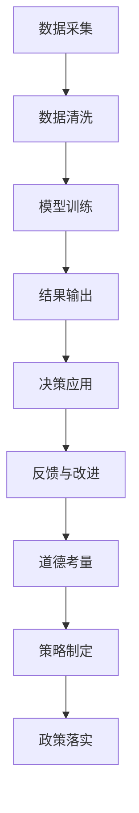

                 

# AI驱动的创新：人类计算在商业中的道德考虑因素与策略

## 1. 背景介绍

### 1.1 问题由来

随着人工智能(AI)技术的迅猛发展，AI在商业中的应用日益广泛。AI驱动的创新不仅提高了企业的运营效率，还打开了新的商业模式，但同时也引发了一系列道德伦理问题。例如，数据隐私、算法偏见、决策透明性等问题逐渐成为公众关注的焦点。如何在追求技术进步的同时，确保AI应用的道德底线，是一个亟待解决的现实问题。

### 1.2 问题核心关键点

AI在商业中的应用，本质上是通过数据驱动的计算过程，优化决策过程、提升运营效率和用户体验。然而，这一过程涉及到海量数据的采集与处理、模型的训练与优化、结果的输出与应用等多个环节。这些环节中潜在的道德风险，包括但不限于：

- **数据隐私**：企业在采集和使用数据时，可能侵犯用户的隐私权。
- **算法偏见**：AI模型基于历史数据训练，可能继承甚至放大数据中的偏见，导致不公平决策。
- **决策透明性**：AI模型的内部运作机制复杂，其决策过程难以解释，用户难以理解和信任。
- **责任归属**：当AI系统出现错误或误导性输出时，责任如何界定，对谁负责。

这些道德风险不仅关系到用户权益的保护，还影响着AI技术的健康发展和社会的信任感。因此，探讨AI在商业应用中的道德考虑因素，提出合理的策略和规范，对于推动AI技术的可持续发展具有重要意义。

### 1.3 问题研究意义

对AI驱动的商业创新进行道德考量和规范，有助于：

- **保障用户权益**：确保用户数据隐私得到尊重，避免偏见和歧视，增强用户对AI系统的信任感。
- **促进公平公正**：消除数据偏见，保证AI决策的公正性和透明性，避免对特定群体的歧视。
- **提升社会信任**：通过规范AI应用，增强公众对AI技术的理解和信任，促进AI技术的广泛应用。
- **推动技术进步**：确保AI技术的健康发展，鼓励负责任的创新实践，引导AI应用向更良性的方向发展。

## 2. 核心概念与联系

### 2.1 核心概念概述

为了更好地理解AI驱动的商业创新中的道德考量，需要明确几个关键概念：

- **AI驱动的商业创新**：利用AI技术进行决策、运营和产品创新的商业模式。
- **数据隐私**：保护用户数据不被非法获取、使用或共享的权利。
- **算法偏见**：指AI模型基于训练数据中的偏差，导致输出结果不公平或不准确。
- **决策透明性**：指AI系统决策过程的可解释性，使用户能够理解和信任AI系统的输出。
- **责任归属**：指在AI系统出现错误或误导性输出时，责任归属的明确性。

这些核心概念共同构成了AI商业应用中的道德框架，指导企业在追求技术进步的同时，确保道德底线的坚守。

### 2.2 核心概念原理和架构的 Mermaid 流程图



该图展示了AI在商业应用中的核心流程及其道德考量的关键点：

1. 数据采集：从各种渠道获取数据。
2. 数据清洗：处理噪声和缺失值，保护数据隐私。
3. 模型训练：基于数据训练AI模型，确保算法公正。
4. 结果输出：根据模型输出进行决策。
5. 决策应用：将决策结果应用于业务运营。
6. 反馈与改进：根据实际效果进行模型调整和优化。
7. 道德考量：在各个环节中考虑数据隐私、算法偏见、决策透明性和责任归属。
8. 策略制定：根据道德考量制定相关策略。
9. 政策落实：将策略落实到实际应用中。

## 3. 核心算法原理 & 具体操作步骤

### 3.1 算法原理概述

AI驱动的商业创新，主要是通过数据驱动的计算过程，优化决策和运营。这一过程可以分为以下几个步骤：

1. **数据采集与清洗**：从不同渠道获取数据，并进行预处理，确保数据质量。
2. **模型训练与优化**：基于数据训练AI模型，通过不断优化提升模型性能。
3. **结果输出与应用**：根据模型输出进行决策，并应用于业务运营。
4. **反馈与改进**：根据实际效果调整模型和优化算法，提升系统性能。

在每个步骤中，都涉及到数据隐私、算法偏见、决策透明性和责任归属等道德考量因素。如何平衡技术进步与道德底线，是关键问题。

### 3.2 算法步骤详解

#### 数据采集与清洗

1. **数据来源**：从用户、合作伙伴、公开数据源等渠道获取数据。
2. **数据隐私**：确保数据采集过程符合隐私保护法规，如GDPR、CCPA等。
3. **数据清洗**：处理噪声、缺失值，避免数据偏见，保护用户隐私。

#### 模型训练与优化

1. **模型选择**：选择适合的机器学习或深度学习模型，如决策树、随机森林、神经网络等。
2. **数据预处理**：对数据进行标准化、归一化等预处理，确保模型输入的一致性。
3. **模型训练**：基于数据训练模型，优化模型参数，提升模型性能。
4. **算法公正性**：确保模型训练过程中不引入偏见，使用多样性数据，避免算法偏见。

#### 结果输出与应用

1. **结果输出**：根据模型输出进行决策，如推荐产品、优化运营等。
2. **决策透明性**：记录决策过程，提供决策依据，增强用户信任。
3. **决策应用**：将决策结果应用于业务运营，如自动化、智能化等。

#### 反馈与改进

1. **结果反馈**：收集反馈数据，评估决策效果。
2. **模型调整**：根据反馈数据调整模型参数，优化算法。
3. **持续改进**：通过不断迭代，提升模型性能，确保决策的准确性和公正性。

### 3.3 算法优缺点

#### 优点

1. **高效性**：数据驱动的计算过程可以大幅提升决策效率和运营效率。
2. **准确性**：通过优化算法，AI模型在处理大量数据时具有较高的准确性。
3. **适应性**：AI模型可以根据反馈数据不断优化，适应业务需求的变化。

#### 缺点

1. **数据依赖性**：模型的性能依赖于数据质量，数据偏差可能导致模型偏见。
2. **解释性不足**：AI模型的决策过程复杂，难以解释，影响用户信任。
3. **隐私风险**：数据采集和处理过程中可能侵犯用户隐私。

### 3.4 算法应用领域

AI驱动的商业创新在多个领域得到了广泛应用，包括但不限于：

- **零售业**：个性化推荐、库存管理、价格优化等。
- **金融业**：信用评估、风险管理、自动化交易等。
- **医疗健康**：疾病诊断、治疗方案、患者管理等。
- **制造业**：质量控制、设备维护、供应链优化等。
- **交通物流**：路线规划、货物调度、安全监控等。
- **娱乐媒体**：内容推荐、广告投放、用户行为分析等。

## 4. 数学模型和公式 & 详细讲解 & 举例说明

### 4.1 数学模型构建

在AI商业应用中，常见的数学模型包括线性回归、逻辑回归、决策树、随机森林、神经网络等。以神经网络为例，其数学模型构建如下：

设输入为 $X=\{(x_1, y_1), (x_2, y_2), \ldots, (x_n, y_n)\}$，其中 $x_i$ 为输入特征，$y_i$ 为输出标签。神经网络模型为 $f(X; \theta)$，其中 $\theta$ 为模型参数。

### 4.2 公式推导过程

以神经网络为例，其前向传播和反向传播过程如下：

前向传播：
$$
z^{[l]} = W^{[l]} x^{[l-1]} + b^{[l]}
$$
$$
a^{[l]} = g(z^{[l]})
$$
其中 $z^{[l]}$ 为线性变换后的结果，$g(\cdot)$ 为激活函数，$W^{[l]}$ 为权重矩阵，$b^{[l]}$ 为偏置向量。

反向传播：
$$
\Delta^{[l]} = \frac{\partial L}{\partial z^{[l]}}
$$
$$
\Delta^{[l-1]} = \Delta^{[l]} \cdot \frac{\partial z^{[l]}}{\partial z^{[l-1]}} \cdot \frac{\partial g(z^{[l]})}{\partial z^{[l]}}
$$
其中 $L$ 为损失函数，$\Delta^{[l]}$ 为误差项。

### 4.3 案例分析与讲解

假设一个电商平台的个性化推荐系统，通过神经网络模型进行用户行为分析，推荐相关产品。模型输入为用户的浏览记录、购买历史等，输出为推荐产品的ID。

模型训练时，使用交叉熵损失函数：
$$
L = -\frac{1}{N} \sum_{i=1}^N \sum_{j=1}^M y_j \log p_j(x_i)
$$
其中 $y_j$ 为标签，$p_j(x_i)$ 为模型输出的概率分布。

## 5. 项目实践：代码实例和详细解释说明

### 5.1 开发环境搭建

1. **环境安装**：安装Python、PyTorch、TensorFlow等深度学习框架，以及相关的工具包如numpy、pandas、scikit-learn等。
2. **数据准备**：收集并预处理数据，确保数据隐私和质量。
3. **模型搭建**：使用神经网络模型，如卷积神经网络、循环神经网络等。
4. **训练与优化**：使用优化算法如Adam、SGD等进行模型训练，确保算法公正。

### 5.2 源代码详细实现

以下是一个简单的神经网络模型的Python代码实现，用于电商平台的个性化推荐系统：

```python
import torch
import torch.nn as nn
import torch.optim as optim

class Net(nn.Module):
    def __init__(self):
        super(Net, self).__init__()
        self.fc1 = nn.Linear(100, 50)
        self.fc2 = nn.Linear(50, 30)
        self.fc3 = nn.Linear(30, 10)
        self.softmax = nn.Softmax(dim=1)
        
    def forward(self, x):
        x = torch.relu(self.fc1(x))
        x = torch.relu(self.fc2(x))
        x = self.fc3(x)
        x = self.softmax(x)
        return x

# 准备数据
train_data = ...
train_labels = ...
test_data = ...
test_labels = ...

# 初始化模型和优化器
model = Net()
optimizer = optim.Adam(model.parameters(), lr=0.001)
criterion = nn.CrossEntropyLoss()

# 训练模型
for epoch in range(10):
    model.train()
    optimizer.zero_grad()
    outputs = model(train_data)
    loss = criterion(outputs, train_labels)
    loss.backward()
    optimizer.step()
    
    model.eval()
    with torch.no_grad():
        test_outputs = model(test_data)
        test_loss = criterion(test_outputs, test_labels)
        print(f'Epoch {epoch+1}, Test Loss: {test_loss:.4f}')

# 应用模型
new_data = ...
new_outputs = model(new_data)
print(f'推荐产品ID: {new_outputs.argmax()}')
```

### 5.3 代码解读与分析

上述代码实现了简单的神经网络模型，用于电商平台的个性化推荐系统。具体分析如下：

- **模型结构**：包含三个全连接层，每个层后接激活函数，输出层使用Softmax激活函数，用于多分类任务。
- **数据准备**：使用PyTorch的Tensor和Dataset类准备训练和测试数据。
- **模型初始化**：使用Adam优化器进行模型参数优化，交叉熵损失函数用于模型训练。
- **训练过程**：在前向传播中计算损失，反向传播更新模型参数。
- **模型应用**：使用训练好的模型对新数据进行预测，输出推荐产品ID。

## 6. 实际应用场景

### 6.1 智能客服系统

AI驱动的智能客服系统可以大幅提升客户服务效率，但同时也面临数据隐私、算法偏见和决策透明性等道德问题。

**解决方案**：
1. **数据隐私**：确保客户数据在采集和使用过程中符合隐私保护法规，如GDPR、CCPA等。
2. **算法公正性**：使用多样性数据训练模型，避免数据偏见。
3. **决策透明性**：记录客服对话过程，提供决策依据，增强用户信任。

### 6.2 金融风控系统

AI在金融风控中的应用，如信用评估、风险管理等，具有重要的经济价值，但也存在算法偏见和决策透明性等道德风险。

**解决方案**：
1. **数据隐私**：确保数据采集和使用过程中符合隐私保护法规，如GDPR、CCPA等。
2. **算法公正性**：使用多样性数据训练模型，避免数据偏见。
3. **决策透明性**：提供决策依据，增强用户信任。

### 6.3 医疗健康系统

AI在医疗健康中的应用，如疾病诊断、治疗方案等，具有显著的医疗价值，但也面临数据隐私和算法偏见等道德风险。

**解决方案**：
1. **数据隐私**：确保患者数据在采集和使用过程中符合隐私保护法规，如HIPAA等。
2. **算法公正性**：使用多样性数据训练模型，避免数据偏见。
3. **决策透明性**：提供决策依据，增强患者信任。

## 7. 工具和资源推荐

### 7.1 学习资源推荐

为了系统掌握AI驱动的商业创新的道德考量，推荐以下学习资源：

1. **《AI伦理学》**：由斯坦福大学教授编写，系统讲解AI伦理学的基本概念和应用。
2. **《道德机器》**：由哲学家和工程师合著，探讨AI决策中的伦理问题。
3. **《数据隐私与AI》**：由隐私保护专家撰写，介绍数据隐私保护的基本技术和法规。
4. **《AI伦理框架》**：由知名AI公司发布，提供AI伦理建设的指南和工具。
5. **在线课程**：Coursera、edX等平台提供多门AI伦理和数据隐私相关的课程。

### 7.2 开发工具推荐

1. **Python**：Python是AI开发的主流语言，具有丰富的库和工具支持。
2. **PyTorch**：深度学习框架，支持动态计算图，适合快速迭代研究。
3. **TensorFlow**：深度学习框架，支持静态计算图，适合大规模工程应用。
4. **Jupyter Notebook**：交互式编程环境，便于研究和分享。
5. **Weights & Biases**：实验跟踪工具，记录和可视化模型训练过程。

### 7.3 相关论文推荐

1. **《机器学习中的公平与透明》**：探讨AI模型中的算法公正性和决策透明性。
2. **《数据隐私保护技术》**：介绍数据隐私保护的基本技术和方法。
3. **《AI伦理与治理》**：探讨AI伦理与治理的基本原则和应用场景。

## 8. 总结：未来发展趋势与挑战

### 8.1 研究成果总结

AI驱动的商业创新在多个领域得到广泛应用，但也面临数据隐私、算法偏见和决策透明性等道德挑战。通过系统研究，提出了数据隐私保护、算法公正性和决策透明性等道德考量因素，并提供了相关策略和工具。

### 8.2 未来发展趋势

未来，AI驱动的商业创新将继续在各个领域得到广泛应用，但同时也面临更多的道德挑战。预计有以下发展趋势：

1. **AI伦理建设**：AI伦理建设将成为AI技术发展的重点之一，通过制定伦理规范和指南，指导AI技术的健康发展。
2. **数据隐私保护**：数据隐私保护技术将不断进步，确保用户数据的安全和隐私。
3. **算法公正性**：算法公正性将成为AI技术应用的重要标准，确保模型不引入偏见。
4. **决策透明性**：决策透明性将成为AI技术应用的关键要求，确保决策过程的可解释性和可信度。
5. **持续改进**：AI系统需要不断迭代优化，适应业务需求的变化，确保系统的稳定性和有效性。

### 8.3 面临的挑战

尽管AI驱动的商业创新带来了诸多便利，但也面临诸多挑战：

1. **数据隐私**：在数据采集和使用过程中，如何保护用户隐私。
2. **算法偏见**：在模型训练过程中，如何避免数据偏见。
3. **决策透明性**：如何增强AI系统的决策透明性，增强用户信任。
4. **责任归属**：在AI系统出现错误或误导性输出时，如何界定责任。
5. **技术进步**：如何在追求技术进步的同时，确保道德底线。

### 8.4 研究展望

未来，AI驱动的商业创新需要更多的道德考量和规范，确保技术的健康发展和社会的信任。以下研究方向值得探索：

1. **AI伦理框架建设**：构建AI伦理框架，制定伦理规范和指南。
2. **数据隐私保护技术**：研究新的数据隐私保护技术，确保用户数据安全。
3. **算法公正性**：开发算法公正性检测工具，确保模型不引入偏见。
4. **决策透明性**：研究决策透明性增强技术，提升AI系统的可信度。
5. **责任归属机制**：制定责任归属机制，确保AI系统出现错误时责任明确。

通过不断探索和创新，推动AI技术的可持续发展，确保其公平、公正、透明和安全，才能实现AI技术的广泛应用和深入人心。

## 9. 附录：常见问题与解答

**Q1：AI驱动的商业创新中，如何确保数据隐私保护？**

A: 确保数据隐私保护的方法包括：
1. 数据匿名化：通过数据脱敏、伪匿名化等方法，确保数据无法追溯到个人。
2. 数据加密：使用加密技术保护数据传输和存储的安全性。
3. 数据访问控制：限制数据访问权限，确保数据仅在必要情况下使用。
4. 隐私保护法规：遵守相关隐私保护法规，如GDPR、CCPA等。

**Q2：AI模型中的算法偏见如何避免？**

A: 避免算法偏见的方法包括：
1. 多样性数据：使用多样性数据训练模型，避免数据集中偏见。
2. 公平性指标：引入公平性指标，评估模型在不同群体上的表现。
3. 偏差检测：使用偏差检测工具，识别和修正模型中的偏见。
4. 算法公平性约束：在模型训练过程中引入公平性约束，确保模型公正。

**Q3：AI系统的决策透明性如何增强？**

A: 增强AI系统决策透明性的方法包括：
1. 决策过程记录：记录AI系统的决策过程，提供决策依据。
2. 可解释性模型：使用可解释性模型，如线性回归、决策树等，增强决策过程的可解释性。
3. 决策可视化：使用可视化工具，展示决策过程和结果。
4. 用户反馈机制：建立用户反馈机制，收集用户对决策的意见和建议。

**Q4：AI系统出现错误或误导性输出时，责任如何界定？**

A: 界定AI系统错误或误导性输出责任的方法包括：
1. 系统设计文档：提供系统设计文档，明确系统功能和限制。
2. 使用协议：明确用户和系统之间的使用协议，界定双方的责任。
3. 第三方审核：引入第三方机构对AI系统进行审核和监督。
4. 法律规定：遵循相关法律法规，明确责任归属。

---

作者：禅与计算机程序设计艺术 / Zen and the Art of Computer Programming

