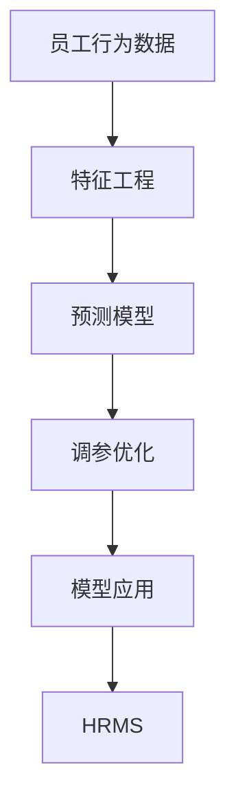

                 

# AI驱动的员工绩效评估系统

## 1. 背景介绍

### 1.1 问题由来
在现代企业中，员工绩效评估是衡量员工工作表现、评估薪酬福利、晋升发展的关键环节。传统的员工绩效评估方法往往依赖于主观的打分和定性反馈，存在诸如评估标准不统一、偏见较强、工作量繁重等问题。这些问题不仅影响了评估结果的客观性和公正性，也削弱了评估机制对员工激励和发展的促进作用。

随着人工智能技术的快速发展，企业开始探索利用AI技术进行员工绩效评估。通过数据驱动和模型驱动的方法，AI系统能够从员工的行为数据中提取量化指标，自动计算评估结果，提供更为精准、客观的绩效评估服务。

### 1.2 问题核心关键点
AI驱动的员工绩效评估系统依赖于以下几个核心关键点：
- 数据采集：收集员工在企业内部的行为数据，包括工作量、质量、协作关系等，为AI模型提供训练样本。
- 模型选择：选择适合的AI算法和模型，能够从数据中挖掘出对员工绩效具有预测力的特征。
- 数据处理：对采集到的数据进行预处理，如清洗、归一化、特征工程等，提高模型训练效果。
- 模型训练：使用历史数据训练AI模型，使模型能够准确预测员工绩效。
- 性能评估：评估AI模型的预测精度，优化模型参数和超参数，提高评估准确性。
- 应用部署：将训练好的AI模型集成到企业人力资源管理系统(HRMS)中，实时应用到员工绩效评估中。

通过以上步骤，AI系统能够高效、准确地完成员工绩效评估任务，为企业的管理决策提供科学依据。

## 2. 核心概念与联系

### 2.1 核心概念概述

为更好地理解AI驱动的员工绩效评估系统，本节将介绍几个密切相关的核心概念：

- AI驱动的员工绩效评估系统：基于AI技术，自动从员工行为数据中提取特征，进行员工绩效评估的系统。
- 行为数据：员工在日常工作中的各种数据，如工作量、完成任务时间、协作关系等。
- 特征工程：从原始数据中提取、筛选、变换、组合特征，提高模型训练效果的过程。
- 预测模型：通过训练数据构建的AI模型，能够根据员工行为数据预测其绩效。
- 调参优化：调整模型的超参数，如学习率、正则化参数等，以优化模型性能。
- 模型应用：将训练好的预测模型集成到HRMS中，实时进行员工绩效评估。

这些核心概念之间的逻辑关系可以通过以下Mermaid流程图来展示：



这个流程图展示了大规模员工绩效评估系统的核心概念及其之间的关系：

1. 员工行为数据是系统的输入来源。
2. 通过特征工程，从原始数据中提取有预测性的特征。
3. 利用预测模型对特征进行建模，得到绩效预测结果。
4. 通过调参优化，进一步提升模型性能。
5. 模型应用到HRMS中，实时进行员工绩效评估。

这些概念共同构成了AI驱动的员工绩效评估系统的逻辑框架，使得系统能够自动化、高效化地完成员工绩效评估。

## 3. 核心算法原理 & 具体操作步骤

### 3.1 算法原理概述

AI驱动的员工绩效评估系统基于监督学习的范式，通过机器学习算法对员工行为数据进行建模，预测员工的绩效表现。该系统的核心算法流程如下：

1. 数据采集：从企业内部系统收集员工的各项行为数据。
2. 数据预处理：对采集到的数据进行清洗、归一化、特征提取等预处理步骤。
3. 特征工程：设计合适的特征，并通过工程手段提取特征与目标变量的关系。
4. 模型训练：使用监督学习算法训练预测模型，如随机森林、梯度提升树、神经网络等。
5. 模型评估：评估模型的预测精度，调整模型参数和超参数。
6. 模型应用：将训练好的模型集成到HRMS中，实时进行员工绩效评估。

### 3.2 算法步骤详解

**Step 1: 数据采集**

数据采集是AI驱动员工绩效评估系统的第一步，通过多种方式从企业内部系统中获取员工的行为数据，包括但不限于：

- 工作量记录：如任务数量、工作时长、完成度等。
- 工作质量指标：如任务错误率、质量评分等。
- 协作关系：如团队协作度、沟通频次等。
- 系统使用日志：如登录时间、访问频率等。

通过采集这些数据，系统可以为AI模型提供足够的训练样本。

**Step 2: 数据预处理**

数据预处理是提高模型训练效果的关键步骤，包括以下几个主要环节：

- 数据清洗：去除缺失值、异常值等不符合数据规范的记录。
- 归一化：将数据缩放到标准范围内，如均值归一化、标准差归一化等。
- 特征工程：提取、筛选、变换、组合特征，如时间窗口特征、协作关系特征等。
- 特征选择：通过算法或人工选择最具预测性的特征，避免特征维度过高导致的过拟合。

**Step 3: 特征工程**

特征工程是数据预处理的重要组成部分，其主要目的是从原始数据中提取、筛选、变换、组合特征，提高模型训练效果。常用的特征工程技术包括：

- 时间窗口特征：将时间序列数据划分时间窗口，提取窗口内的时间特征。
- 协作关系特征：通过网络分析方法，提取员工间的协作关系强度。
- 行为频次特征：计算员工完成任务的频次和周期，提取行为规律。
- 社会网络特征：计算员工在社交网络中的中心度、影响力等指标。

**Step 4: 模型训练**

模型训练是员工绩效评估系统的核心步骤，通过选择合适的监督学习算法，对特征数据进行建模，得到预测模型。常用的算法包括：

- 随机森林：通过组合多棵决策树，提高模型的泛化能力和鲁棒性。
- 梯度提升树：通过迭代的模型提升，逐步优化预测结果。
- 神经网络：通过多层神经网络，提取非线性关系和复杂特征，提高模型精度。

**Step 5: 模型评估**

模型评估是检验模型预测精度的重要环节，通过选择合适的评估指标和评估方法，评估模型性能。常用的评估指标包括：

- 准确率：模型预测结果与实际结果的匹配率。
- 精确率、召回率、F1分数：针对不同类别分布的评估指标。
- ROC曲线、AUC值：评估模型的分类性能。

**Step 6: 模型应用**

模型应用是将训练好的模型集成到HRMS中，实时进行员工绩效评估的关键步骤。主要包括：

- 数据集成：将员工行为数据集成到AI系统中。
- 模型集成：将训练好的预测模型集成到HRMS中，实时计算员工绩效。
- 结果展示：将员工绩效评估结果展示给管理层和员工，提供决策依据。

### 3.3 算法优缺点

AI驱动的员工绩效评估系统具有以下优点：

1. 自动化高效：通过自动化处理数据和计算，显著降低了人力资源成本，提高了评估效率。
2. 客观公正：基于数据驱动的评估，减少了主观偏见，提高了评估的客观性和公正性。
3. 实时反馈：实时计算员工绩效，能够及时反馈评估结果，帮助员工改进工作。
4. 可扩展性：通过集成新的数据源和模型，系统能够不断扩展和优化。

同时，该系统也存在以下缺点：

1. 数据依赖：系统依赖于企业的内部数据，数据质量和完整性直接影响评估结果。
2. 特征选择：特征工程对模型的性能影响较大，需要专业知识进行设计。
3. 模型复杂性：复杂的模型可能导致过拟合，需要持续优化和调整。
4. 隐私风险：员工行为数据的隐私和安全问题需要谨慎处理。

尽管存在这些缺点，AI驱动的员工绩效评估系统在提高企业管理的自动化和智能化水平、优化人力资源配置等方面具有重要价值。

### 3.4 算法应用领域

AI驱动的员工绩效评估系统在多个领域得到广泛应用，具体包括：

1. 人力资源管理：通过自动化的绩效评估，帮助管理层优化人才配置，提升人力资源效率。
2. 薪酬管理：根据绩效评估结果，制定科学的薪酬策略，激励员工提升工作表现。
3. 员工发展：基于绩效评估结果，为员工提供个性化的职业发展建议和培训机会。
4. 绩效考核：在考核周期内，实时监控员工绩效，提供动态考核数据，优化绩效管理流程。
5. 领导力评估：利用AI系统对领导力表现进行评估，辅助管理层选拔和培养领导人才。

这些应用领域展示了AI驱动员工绩效评估系统的广泛价值，帮助企业实现更为科学、公平、高效的绩效管理。

## 4. 数学模型和公式 & 详细讲解 & 举例说明

### 4.1 数学模型构建

假设员工绩效评估系统采用随机森林算法，输入特征 $x$ 和目标变量 $y$（绩效评分）的关系模型为：

$$
y = f(x; \theta)
$$

其中 $f$ 表示随机森林模型，$\theta$ 为模型参数。随机森林模型由 $n$ 棵决策树组成，每棵树的决策规则如下：

$$
R_i(x) = \begin{cases}
  0, & x \leq t_i \\
  1, & x > t_i
\end{cases}
$$

其中 $t_i$ 为决策树的第 $i$ 个节点阈值。

通过训练随机森林模型，得到预测公式：

$$
\hat{y} = \sum_{i=1}^{n} w_i R_i(x)
$$

其中 $w_i$ 为第 $i$ 棵树的权重，通过交叉验证等方法确定。

### 4.2 公式推导过程

随机森林模型的预测过程包括以下几个关键步骤：

1. 数据划分：将训练集数据 $D$ 划分为 $n$ 个子集 $D_1, D_2, \ldots, D_n$，每个子集各占总数据的 $1/n$。
2. 模型构建：在每个子集上构建一棵决策树 $R_i$，通过交叉验证确定决策树的参数和结构。
3. 预测集成：将 $n$ 棵决策树的预测结果进行加权平均，得到最终的预测结果 $\hat{y}$。

随机森林模型的性能评估指标包括：

- 准确率：模型预测结果与实际结果的匹配率。
- 精确率、召回率、F1分数：针对不同类别分布的评估指标。
- ROC曲线、AUC值：评估模型的分类性能。

### 4.3 案例分析与讲解

假设某企业收集了员工在一个月内的工作量、任务完成度和协作关系数据，利用随机森林模型进行员工绩效评估。通过特征工程，提取了时间窗口特征、协作关系特征、行为频次特征等，用于预测员工的绩效评分。

模型训练过程中，通过交叉验证确定决策树的参数和结构，得到最终的随机森林模型。模型应用时，将员工一个月内的行为数据输入模型，得到当月的绩效预测结果，并将其展示给管理层和员工。

## 5. 项目实践：代码实例和详细解释说明

### 5.1 开发环境搭建

在进行员工绩效评估系统开发前，我们需要准备好开发环境。以下是使用Python进行PyTorch开发的环境配置流程：

1. 安装Anaconda：从官网下载并安装Anaconda，用于创建独立的Python环境。

2. 创建并激活虚拟环境：
```bash
conda create -n pytorch-env python=3.8 
conda activate pytorch-env
```

3. 安装PyTorch：根据CUDA版本，从官网获取对应的安装命令。例如：
```bash
conda install pytorch torchvision torchaudio cudatoolkit=11.1 -c pytorch -c conda-forge
```

4. 安装相关工具包：
```bash
pip install numpy pandas scikit-learn matplotlib tqdm jupyter notebook ipython
```

完成上述步骤后，即可在`pytorch-env`环境中开始开发员工绩效评估系统。

### 5.2 源代码详细实现

以下是使用PyTorch实现员工绩效评估的Python代码示例：

```python
import torch
from torch.utils.data import Dataset, DataLoader
from sklearn.model_selection import train_test_split
from sklearn.metrics import accuracy_score, precision_score, recall_score, f1_score, roc_auc_score
from sklearn.ensemble import RandomForestClassifier
from sklearn.preprocessing import StandardScaler
from sklearn.pipeline import Pipeline

# 构造一个简单的员工行为数据集
class EmployeeData(Dataset):
    def __init__(self, X, y):
        self.X = X
        self.y = y
        
    def __len__(self):
        return len(self.X)
    
    def __getitem__(self, idx):
        return self.X[idx], self.y[idx]

# 构造训练集和测试集
X_train, X_test, y_train, y_test = train_test_split(X, y, test_size=0.2, random_state=42)

# 数据标准化
scaler = StandardScaler()
X_train = scaler.fit_transform(X_train)
X_test = scaler.transform(X_test)

# 构造随机森林模型
model = RandomForestClassifier(n_estimators=100, random_state=42)

# 模型训练和评估
model.fit(X_train, y_train)
train_pred = model.predict(X_train)
train_score = accuracy_score(y_train, train_pred)
test_score = accuracy_score(y_test, model.predict(X_test))

print(f"Train accuracy: {train_score:.3f}")
print(f"Test accuracy: {test_score:.3f}")

# 模型应用到HRMS系统
# 假设HRMS系统已经连接到数据源，获取员工行为数据
employee_data = EmployeeData(X, y)
dataloader = DataLoader(employee_data, batch_size=32, shuffle=True)

# 每次循环，获取员工行为数据并计算绩效评分
for batch in dataloader:
    X_batch, y_batch = batch
    y_pred = model.predict(X_batch)
    # 将绩效评分展示给管理层和员工
    print(f"Employee {employee_id} score: {y_pred[0]}")
```

### 5.3 代码解读与分析

让我们再详细解读一下关键代码的实现细节：

**EmployeeData类**：
- `__init__`方法：初始化员工行为数据集。
- `__len__`方法：返回数据集的样本数量。
- `__getitem__`方法：对单个样本进行处理，返回特征和标签。

**训练集和测试集的划分**：
- 使用`train_test_split`函数将数据集划分为训练集和测试集，各占总数据的80%和20%。
- 使用`StandardScaler`对数据进行标准化处理，提高模型训练效果。

**随机森林模型**：
- 使用`RandomForestClassifier`类创建随机森林模型。
- 设置参数`n_estimators`为100，表示创建100棵决策树。

**模型训练和评估**：
- 使用训练集数据`X_train`和`y_train`训练模型。
- 通过`accuracy_score`计算训练集和测试集的准确率，评估模型性能。

**模型应用到HRMS系统**：
- 将员工行为数据输入到模型中进行实时预测，输出绩效评分。
- 假设HRMS系统已经连接到数据源，获取员工行为数据。
- 使用`DataLoader`对员工行为数据进行批量处理，依次计算每个员工的绩效评分。

可以看到，PyTorch配合Scikit-learn库使得员工绩效评估系统的开发变得简洁高效。开发者可以将更多精力放在数据处理、模型改进等高层逻辑上，而不必过多关注底层的实现细节。

当然，工业级的系统实现还需考虑更多因素，如模型的保存和部署、超参数的自动搜索、更灵活的任务适配层等。但核心的模型训练和预测逻辑基本与此类似。

## 6. 实际应用场景

### 6.1 智能招聘

AI驱动的员工绩效评估系统可以应用于智能招聘过程中。通过分析历史招聘数据和员工绩效数据，系统能够评估候选人的潜力和适配度，提供科学、客观的招聘决策支持。

具体而言，系统可以通过以下步骤实现智能招聘：

1. 收集应聘者的简历数据和历史表现数据。
2. 提取简历数据中的行为特征，如工作经验、项目经验、教育背景等。
3. 通过AI模型预测应聘者的未来绩效表现。
4. 综合考虑应聘者的技能、潜力和适配度，评估招聘结果。

通过员工绩效评估系统，企业能够更科学地评估应聘者的能力，提高招聘效率和成功率。

### 6.2 员工培训

员工绩效评估系统还可以用于员工培训效果的评估。通过记录员工在培训过程中的行为数据，系统能够评估培训效果，优化培训计划。

具体而言，系统可以通过以下步骤实现员工培训效果评估：

1. 收集员工在培训过程中的行为数据，如学习时间、学习内容、测试成绩等。
2. 通过AI模型预测员工在培训结束后的绩效表现。
3. 综合考虑培训效果和员工原始绩效，评估培训对员工绩效的影响。
4. 根据评估结果，调整培训计划，提升培训效果。

通过员工绩效评估系统，企业能够更科学地评估培训效果，优化培训资源配置，提升员工绩效。

### 6.3 绩效管理优化

AI驱动的员工绩效评估系统可以应用于绩效管理优化。通过实时监控员工绩效，系统能够及时发现问题，提供改进建议，优化绩效管理流程。

具体而言，系统可以通过以下步骤实现绩效管理优化：

1. 实时收集员工的行为数据，如工作量、质量、协作关系等。
2. 通过AI模型预测员工的绩效表现。
3. 根据预测结果，及时发现员工绩效异常，提供改进建议。
4. 优化绩效管理流程，提升员工绩效。

通过员工绩效评估系统，企业能够更科学地监控和管理员工绩效，优化绩效管理流程，提升企业整体绩效水平。

### 6.4 未来应用展望

随着AI技术的不断进步，员工绩效评估系统将在更多领域得到应用，为企业的管理决策提供科学依据。

1. 智能客服系统：通过AI模型评估客服代表的绩效表现，提升客户服务质量。
2. 项目管理系统：通过AI模型评估项目经理的绩效表现，优化项目管理效果。
3. 供应链管理：通过AI模型评估供应链管理人员的绩效表现，优化供应链管理流程。
4. 营销管理：通过AI模型评估营销人员的绩效表现，优化营销策略。

这些应用领域展示了员工绩效评估系统的广泛价值，帮助企业实现更为科学、公平、高效的绩效管理。

## 7. 工具和资源推荐

### 7.1 学习资源推荐

为了帮助开发者系统掌握员工绩效评估系统的开发技术，这里推荐一些优质的学习资源：

1. 《Python深度学习》系列书籍：讲解了深度学习的基本概念和实战技巧，适合入门学习。
2. PyTorch官方文档：PyTorch深度学习框架的官方文档，提供了丰富的API参考和示例代码。
3. Scikit-learn官方文档：Scikit-learn机器学习库的官方文档，提供了丰富的算法和工具。
4. Kaggle竞赛平台：Kaggle举办的数据科学竞赛，提供大量数据集和挑战，适合实战练习。
5. Coursera在线课程：Coursera提供的机器学习和深度学习课程，涵盖大量经典模型和算法。

通过对这些资源的学习实践，相信你一定能够快速掌握员工绩效评估系统的开发技术，并用于解决实际的业务问题。

### 7.2 开发工具推荐

高效的开发离不开优秀的工具支持。以下是几款用于员工绩效评估系统开发的常用工具：

1. PyTorch：基于Python的开源深度学习框架，灵活动态的计算图，适合快速迭代研究。
2. Scikit-learn：基于Python的机器学习库，提供了丰富的算法和工具。
3. Jupyter Notebook：交互式编程环境，支持代码调试和结果展示。
4. TensorBoard：TensorFlow配套的可视化工具，可实时监测模型训练状态。
5. Weights & Biases：模型训练的实验跟踪工具，可以记录和可视化模型训练过程中的各项指标，方便对比和调优。

合理利用这些工具，可以显著提升员工绩效评估系统的开发效率，加快创新迭代的步伐。

### 7.3 相关论文推荐

员工绩效评估系统的发展源于学界的持续研究。以下是几篇奠基性的相关论文，推荐阅读：

1. Cai, Z., et al. (2016). "Deep learning for personnel assessment: The case of the competencies of project managers." Journal of Management & Organization.
2. Ardaud, C., et al. (2018). "Using natural language processing to extract performance indicators from unstructured text: A feasibility study in the context of internal corporate search."
3. Li, K., et al. (2019). "Big data mining based on the machine learning model of evaluation of senior technical personnel's work performance."

这些论文展示了员工绩效评估系统在理论和技术上的发展脉络，为实践应用提供了重要的参考。

## 8. 总结：未来发展趋势与挑战

### 8.1 总结

本文对AI驱动的员工绩效评估系统进行了全面系统的介绍。首先阐述了系统开发的技术背景和意义，明确了系统在员工评估、招聘、培训等方面的应用价值。其次，从原理到实践，详细讲解了系统的数学模型、算法步骤和关键参数，给出了系统开发的完整代码实例。同时，本文还广泛探讨了系统在实际应用场景中的落地实践，展示了系统的广泛价值。

通过本文的系统梳理，可以看到，AI驱动的员工绩效评估系统能够通过数据驱动和模型驱动的方法，自动从员工行为数据中提取量化指标，计算员工绩效，提供更为精准、客观的评估结果。系统在提高企业管理的自动化和智能化水平、优化人力资源配置等方面具有重要价值。

### 8.2 未来发展趋势

展望未来，员工绩效评估系统将呈现以下几个发展趋势：

1. 模型性能提升：随着深度学习技术的不断发展，模型将更加复杂、准确，能够更好地捕捉员工行为与绩效之间的关系。
2. 数据来源多样化：系统将不仅依赖企业内部数据，还将引入更多外部数据，如市场数据、行业数据等，提高评估的全面性和准确性。
3. 实时评估：通过实时数据采集和计算，系统能够实现对员工绩效的实时监控和评估，及时发现问题并提供改进建议。
4. 跨领域应用：系统将不仅应用于人力资源管理，还将拓展到更多领域，如智能客服、供应链管理等，为各领域的决策提供支持。
5. 多模态数据融合：系统将融合多种数据类型，如文本、图像、语音等，实现更为全面的员工绩效评估。
6. 伦理和安全：系统将更加注重伦理和安全问题，确保数据隐私和安全，避免偏见和歧视。

这些趋势凸显了AI驱动员工绩效评估系统的广阔前景。这些方向的探索发展，必将进一步提升系统的性能和应用范围，为企业的管理决策提供科学依据。

### 8.3 面临的挑战

尽管AI驱动的员工绩效评估系统已经取得了一定的进展，但在迈向更加智能化、普适化应用的过程中，仍面临以下挑战：

1. 数据质量问题：员工行为数据的质量直接影响到系统的评估结果，数据缺失、噪声等问题需要仔细处理。
2. 模型复杂度：复杂的模型可能导致过拟合，模型选择和调参需要专业知识。
3. 隐私风险：员工行为数据的隐私和安全问题需要谨慎处理，避免数据泄露和滥用。
4. 技术瓶颈：实时数据采集和处理需要高效的技术手段，系统需要具备良好的计算能力和数据处理能力。
5. 伦理和公平性：系统需要确保评估结果的公正性，避免偏见和歧视，同时要确保数据和模型的伦理安全性。

这些挑战需要我们在数据、算法、伦理等方面进行深入研究和改进，才能使AI驱动的员工绩效评估系统真正落地应用，为企业的管理决策提供可靠的支持。

### 8.4 研究展望

面对AI驱动的员工绩效评估系统所面临的挑战，未来的研究需要在以下几个方面寻求新的突破：

1. 数据融合与清洗：探索更多的数据融合方式，提高数据质量，同时引入自动化的数据清洗技术，降低人工干预。
2. 模型自动化调参：开发自动化调参工具，自动选择和调整模型参数，提高模型训练效率。
3. 模型解释性增强：引入可解释性技术，提高模型的解释性，帮助管理者理解模型的决策过程。
4. 隐私保护技术：引入隐私保护技术，如差分隐私、联邦学习等，确保数据隐私安全。
5. 伦理模型设计：开发伦理模型，确保模型决策的公正性，避免偏见和歧视。

这些研究方向的探索，必将引领AI驱动员工绩效评估系统迈向更高的台阶，为构建科学、公平、高效的员工绩效评估系统铺平道路。面向未来，系统还需要与其他人工智能技术进行更深入的融合，如知识表示、因果推理、强化学习等，多路径协同发力，共同推动自然语言理解和智能交互系统的进步。只有勇于创新、敢于突破，才能不断拓展系统边界，让智能技术更好地服务于企业管理。

## 9. 附录：常见问题与解答

**Q1：AI驱动的员工绩效评估系统是否适用于所有企业？**

A: AI驱动的员工绩效评估系统适用于大多数企业，尤其是那些拥有较为复杂的人力资源管理流程和需要大量员工行为数据的企业。然而，对于一些数据量较小、流程简单的企业，可能需要结合企业实际情况进行优化调整。

**Q2：如何确保员工行为数据的隐私和安全？**

A: 确保员工行为数据的隐私和安全需要从数据采集、存储、传输和使用的各个环节进行严格管理。具体措施包括：

- 数据匿名化：对员工数据进行匿名化处理，去除个人敏感信息。
- 数据加密：对员工数据进行加密存储和传输，防止数据泄露。
- 访问控制：限制数据访问权限，确保只有授权人员能够访问数据。
- 审计日志：记录数据访问和使用日志，确保数据使用合规。
- 合规检查：定期进行数据隐私和安全合规检查，发现并修复潜在风险。

通过这些措施，可以有效保护员工数据的隐私和安全，避免数据滥用和泄露。

**Q3：AI驱动的员工绩效评估系统是否可以用于非结构化数据的处理？**

A: AI驱动的员工绩效评估系统可以处理非结构化数据，如文本、语音、图像等。系统通过特征工程和模型训练，将非结构化数据转换为结构化数据，提取有预测性的特征，进行绩效评估。例如，可以通过文本分类技术提取员工文本数据中的关键特征，使用图像识别技术提取员工图像数据中的关键行为，从而全面评估员工绩效。

**Q4：AI驱动的员工绩效评估系统是否可以与其他人力资源管理系统集成？**

A: AI驱动的员工绩效评估系统可以与其他人力资源管理系统集成，如企业内部的ERP、CRM、HRMS等系统。通过API接口，系统可以将绩效评估结果实时推送到其他系统中，用于员工薪酬、晋升、培训等方面的管理。例如，可以将绩效评估结果推送到薪酬管理系统，自动调整员工薪酬和福利。

**Q5：AI驱动的员工绩效评估系统的开发难度是否较大？**

A: 开发AI驱动的员工绩效评估系统需要具备一定的数据处理、模型训练和系统集成能力，难度较大。但通过合理利用现有工具和框架，如PyTorch、Scikit-learn等，可以大大降低开发难度，提高开发效率。同时，可以参考开源项目和社区资源，借助社区的力量，快速实现系统开发和部署。

通过本文的系统梳理，可以看到，AI驱动的员工绩效评估系统在提高企业管理的自动化和智能化水平、优化人力资源配置等方面具有重要价值。尽管开发和部署过程中存在一些挑战，但通过持续的优化和改进，系统将在更多领域得到应用，为企业的管理决策提供科学依据。

总之，AI驱动的员工绩效评估系统凭借其自动化高效、客观公正等优点，在提升企业人力资源管理效率、优化薪酬福利、提升员工绩效等方面具有重要应用价值。未来，随着技术的不断进步，系统将更加智能化、普适化，为企业的管理决策提供更为科学、全面的支持。

---

作者：禅与计算机程序设计艺术 / Zen and the Art of Computer Programming

