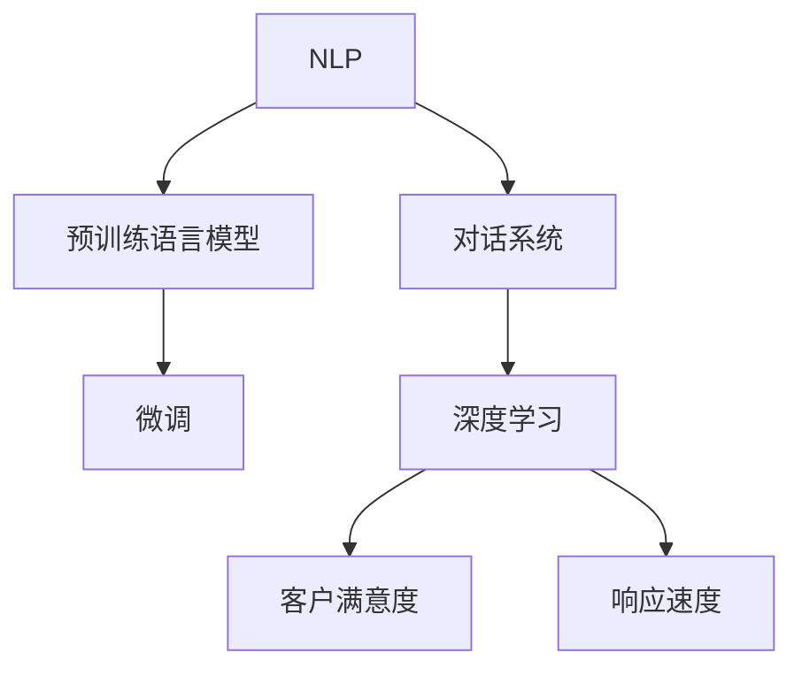

                 

# AI驱动的智能客服:提升服务质量与效率

> 关键词：智能客服,自然语言处理(NLP),对话系统,微调(Fine-tuning),深度学习,客户满意度,响应速度,聊天机器人,FAQ库

## 1. 背景介绍

### 1.1 问题由来

在数字化时代，企业与客户的沟通方式发生了巨大变化。传统的电话、邮件等沟通手段逐渐被更加快速便捷的互联网服务所替代，特别是随着移动互联网的普及，智能手机已成为人们日常沟通的主要设备。而智能客服系统作为企业与客户之间沟通的桥梁，在提升客户体验、降低运营成本、优化业务流程等方面发挥了重要作用。

然而，传统客服系统面临诸多挑战。例如，响应速度慢、理解力不足、服务质量不高等问题，常常导致客户投诉增加，影响企业声誉。智能客服系统通过引入人工智能技术，可以有效提升服务效率和质量，改善客户体验。

### 1.2 问题核心关键点

智能客服系统主要通过以下三个方面来提升服务质量与效率：

1. **自然语言处理(NLP)**：通过对自然语言的处理和理解，智能客服系统能够识别和理解客户的意图，提供更加个性化的服务。
2. **对话系统**：基于机器学习技术，智能客服系统能够模拟人类对话，自动回答问题，提升响应速度和准确性。
3. **微调**：利用预训练的语言模型，通过微调算法，智能客服系统能够不断优化自身的知识库和语言理解能力，从而适应不同的应用场景。

智能客服系统的核心在于通过预训练语言模型和微调技术，构建高效、智能的对话系统。通过持续学习和优化，智能客服系统能够不断提升服务质量和效率，满足客户日益增长的需求。

### 1.3 问题研究意义

智能客服系统的研究具有重要意义：

1. **提升客户体验**：智能客服系统能够24小时不间断地提供服务，显著提升响应速度和准确性，改善客户体验。
2. **降低运营成本**：通过自动化处理客户咨询，智能客服系统可以有效减少人力成本，提高运营效率。
3. **优化业务流程**：智能客服系统能够快速分析和反馈客户需求，帮助企业优化产品和服务，提升业务竞争力。

总之，智能客服系统是数字化时代企业提升客户服务质量、优化运营流程的重要手段，具有广阔的应用前景。

## 2. 核心概念与联系

### 2.1 核心概念概述

为更好地理解智能客服系统的核心概念，本节将介绍几个密切相关的核心概念：

- **自然语言处理(NLP)**：研究如何让计算机理解、处理、生成自然语言的技术，是智能客服系统的重要基础。
- **对话系统**：通过模拟人类对话，自动回答问题，是智能客服系统的主要功能模块。
- **预训练语言模型**：如BERT、GPT等，在大规模无标签文本数据上训练得到的模型，具备强大的语言理解和生成能力。
- **微调(Fine-tuning)**：指在预训练模型的基础上，使用下游任务的少量标注数据，通过有监督学习优化模型在该任务上的性能。
- **深度学习**：通过神经网络模型，智能客服系统能够学习并理解复杂的语言模式和逻辑结构。
- **客户满意度**：衡量智能客服系统服务质量的关键指标，通过客户反馈来评估和优化系统。
- **响应速度**：衡量智能客服系统服务效率的重要指标，直接影响客户体验。

这些核心概念之间的逻辑关系可以通过以下Mermaid流程图来展示：



这个流程图展示了他的核心概念及其之间的关系：

1. 自然语言处理(NLP)是智能客服系统的基础。
2. 对话系统是智能客服系统的核心功能模块，基于NLP技术实现。
3. 预训练语言模型提供强大的语言理解能力，为对话系统提供支撑。
4. 微调技术用于优化对话系统的性能，提高系统适应性。
5. 深度学习用于模型训练和优化，提升系统的智能水平。
6. 客户满意度和响应速度是评估智能客服系统性能的关键指标。

这些核心概念共同构成了智能客服系统的技术框架，使得系统能够在各种场景下提供高效、智能的客户服务。

## 3. 核心算法原理 & 具体操作步骤

### 3.1 算法原理概述

智能客服系统的核心算法包括自然语言处理、对话系统和微调等。这些算法相互配合，共同实现高效、智能的客户服务。

自然语言处理(NLP)通过分词、词性标注、句法分析等技术，理解客户的输入文本。对话系统通过深度学习模型，模拟人类对话，自动回答客户问题。微调技术则通过预训练语言模型的优化，提升对话系统的语言理解和生成能力，使其更加智能和准确。

### 3.2 算法步骤详解

基于自然语言处理、对话系统和微调的智能客服系统构建过程包括以下几个关键步骤：

**Step 1: 数据准备**
- 收集客户的输入文本和对应的响应文本，构建训练数据集。
- 进行文本清洗、分词、标注等预处理，准备训练样本。

**Step 2: 模型选择和微调**
- 选择合适的预训练语言模型，如BERT、GPT等。
- 在预训练模型的基础上，使用客户咨询数据进行微调，优化模型的语言理解和生成能力。

**Step 3: 对话系统设计**
- 设计对话系统框架，包括意图识别、对话管理和响应生成等模块。
- 使用深度学习模型，如LSTM、Transformer等，构建对话系统。

**Step 4: 模型训练和评估**
- 使用训练数据集，训练对话系统模型。
- 在验证集上评估模型性能，调整模型参数。
- 在测试集上评估最终模型性能，优化系统响应速度和准确性。

**Step 5: 系统部署和优化**
- 将训练好的模型部署到生产环境。
- 持续收集客户反馈，优化模型和系统。
- 定期进行系统维护和更新，保证系统稳定运行。

以上是智能客服系统构建的一般流程。在实际应用中，还需要针对具体任务的特点，对各个环节进行优化设计，如改进对话系统，引入更丰富的自然语言处理技术等，以进一步提升系统性能。

### 3.3 算法优缺点

智能客服系统通过预训练语言模型和微调技术，具有以下优点：

1. **响应速度快**：智能客服系统能够快速理解客户输入，提供实时响应。
2. **准确率高**：微调技术能够优化对话系统的语言理解和生成能力，提高回答的准确性。
3. **服务范围广**：能够处理多种语言和方言，提供多语言服务。
4. **适应性强**：通过微调技术，系统能够不断优化，适应不同的应用场景和客户需求。

同时，该系统也存在一些局限性：

1. **初始化数据要求高**：需要高质量的标注数据，用于训练和微调模型。
2. **模型复杂度高**：预训练语言模型和深度学习模型的计算量较大，对硬件资源要求高。
3. **维护成本高**：需要持续收集客户反馈，优化和更新系统。

尽管存在这些局限性，但智能客服系统仍然是大规模客户服务的重要手段，具有广泛的应用前景。

### 3.4 算法应用领域

智能客服系统已经在多个行业得到应用，如：

- **金融行业**：智能客服系统能够处理客户的查询、投诉、咨询等业务，提升服务效率和客户满意度。
- **电商行业**：智能客服系统能够提供24小时在线客服，解答客户的订单、退换货等问题，提升客户体验。
- **医疗行业**：智能客服系统能够提供健康咨询、预约挂号等服务，减轻医院服务压力。
- **旅游行业**：智能客服系统能够提供行程查询、预订等服务，提升客户体验。
- **物流行业**：智能客服系统能够处理客户的物流查询、投诉等问题，提升物流服务质量。

此外，智能客服系统还被应用于企业内部的客服支持、客户关系管理等领域，助力企业提升运营效率和服务质量。

## 4. 数学模型和公式 & 详细讲解 & 举例说明

### 4.1 数学模型构建

智能客服系统主要涉及自然语言处理和深度学习模型。以下以BERT为例，介绍智能客服系统的数学模型构建过程。

**意图识别模型**：

- 输入：用户输入文本 $x$
- 输出：意图标签 $y$
- 模型：BERT + 全连接层

定义意图识别模型的损失函数为：

$$
L_{intent} = -\frac{1}{N}\sum_{i=1}^N \log p(y_i | x_i)
$$

其中，$p(y_i | x_i)$ 表示模型在输入文本 $x_i$ 下，输出标签 $y_i$ 的概率。

**对话管理模型**：

- 输入：用户输入文本 $x$ 和历史对话记录 $H$
- 输出：下一步响应 $y$
- 模型：Transformer + 注意力机制

定义对话管理模型的损失函数为：

$$
L_{dialog} = -\frac{1}{N}\sum_{i=1}^N \log p(y_i | x_i, H)
$$

其中，$p(y_i | x_i, H)$ 表示模型在输入文本 $x_i$ 和历史对话记录 $H$ 下，输出响应 $y_i$ 的概率。

### 4.2 公式推导过程

以下我们以BERT模型为例，推导智能客服系统中的意图识别模型的损失函数及其梯度计算公式。

假设模型 $M_{intent}$ 在输入 $x$ 上的输出为 $\hat{y}=M_{intent}(x)$，表示模型在输入文本 $x$ 下，输出标签 $y$ 的概率。定义交叉熵损失函数为：

$$
L_{intent} = -\frac{1}{N}\sum_{i=1}^N \log p(y_i | x_i)
$$

其中，$p(y_i | x_i)$ 表示模型在输入文本 $x_i$ 下，输出标签 $y_i$ 的概率。

将模型 $M_{intent}$ 视为分类器，使用交叉熵损失函数计算模型在训练集上的损失，定义优化目标：

$$
\min_{\theta} \mathcal{L}_{intent}(\theta)
$$

其中，$\theta$ 表示模型的参数。

通过梯度下降等优化算法，模型参数 $\theta$ 不断更新，最小化损失函数 $\mathcal{L}_{intent}$，使得模型输出逼近真实标签。重复上述过程直至收敛，最终得到最优模型参数 $\theta^*$。

### 4.3 案例分析与讲解

假设智能客服系统中的意图识别模型使用BERT模型进行训练。首先，收集客户的输入文本和对应的意图标签，构建训练数据集。然后，使用BERT模型对输入文本进行编码，得到词向量表示。接着，将词向量表示输入全连接层，输出意图标签。最后，通过交叉熵损失函数计算模型在训练集上的损失，使用梯度下降等优化算法更新模型参数，最小化损失函数，得到最优模型参数。

## 5. 项目实践：代码实例和详细解释说明

### 5.1 开发环境搭建

在进行智能客服系统开发前，我们需要准备好开发环境。以下是使用Python进行PyTorch开发的环境配置流程：

1. 安装Anaconda：从官网下载并安装Anaconda，用于创建独立的Python环境。

2. 创建并激活虚拟环境：
```bash
conda create -n pytorch-env python=3.8 
conda activate pytorch-env
```

3. 安装PyTorch：根据CUDA版本，从官网获取对应的安装命令。例如：
```bash
conda install pytorch torchvision torchaudio cudatoolkit=11.1 -c pytorch -c conda-forge
```

4. 安装Transformers库：
```bash
pip install transformers
```

5. 安装各类工具包：
```bash
pip install numpy pandas scikit-learn matplotlib tqdm jupyter notebook ipython
```

完成上述步骤后，即可在`pytorch-env`环境中开始智能客服系统的开发。

### 5.2 源代码详细实现

下面我们以基于BERT的智能客服系统为例，给出使用Transformers库进行意图识别和对话系统构建的PyTorch代码实现。

首先，定义意图识别模型：

```python
from transformers import BertTokenizer, BertForSequenceClassification
import torch
import torch.nn as nn

class IntentClassifier(nn.Module):
    def __init__(self, num_labels=6):
        super(IntentClassifier, self).__init__()
        self.num_labels = num_labels
        self.bert = BertForSequenceClassification.from_pretrained('bert-base-uncased', num_labels=num_labels)
    
    def forward(self, input_ids, attention_mask):
        logits = self.bert(input_ids=input_ids, attention_mask=attention_mask)[0]
        return logits
```

然后，定义对话管理模型：

```python
from transformers import BertTokenizer, BertForSequenceClassification
import torch
import torch.nn as nn
from transformers import AutoTokenizer, AutoModelForCausalLM

class DialogueManager(nn.Module):
    def __init__(self, num_labels=6, hidden_size=768, num_heads=12, num_layers=12):
        super(DialogueManager, self).__init__()
        self.tokenizer = BertTokenizer.from_pretrained('bert-base-uncased')
        self.model = BertForSequenceClassification.from_pretrained('bert-base-uncased', num_labels=num_labels)
        self.linear = nn.Linear(hidden_size, num_labels)
    
    def forward(self, input_ids, attention_mask, hidden_states):
        outputs = self.model(input_ids=input_ids, attention_mask=attention_mask)
        logits = self.linear(outputs.logits)
        return logits
```

接着，定义训练和评估函数：

```python
from torch.utils.data import DataLoader
from tqdm import tqdm

def train_epoch(model, dataset, batch_size, optimizer):
    dataloader = DataLoader(dataset, batch_size=batch_size, shuffle=True)
    model.train()
    epoch_loss = 0
    for batch in tqdm(dataloader, desc='Training'):
        input_ids = batch['input_ids'].to(device)
        attention_mask = batch['attention_mask'].to(device)
        labels = batch['labels'].to(device)
        model.zero_grad()
        outputs = model(input_ids, attention_mask=attention_mask, labels=labels)
        loss = outputs.loss
        epoch_loss += loss.item()
        loss.backward()
        optimizer.step()
    return epoch_loss / len(dataloader)

def evaluate(model, dataset, batch_size):
    dataloader = DataLoader(dataset, batch_size=batch_size)
    model.eval()
    preds, labels = [], []
    with torch.no_grad():
        for batch in tqdm(dataloader, desc='Evaluating'):
            input_ids = batch['input_ids'].to(device)
            attention_mask = batch['attention_mask'].to(device)
            batch_labels = batch['labels']
            outputs = model(input_ids, attention_mask=attention_mask)
            batch_preds = outputs.logits.argmax(dim=2).to('cpu').tolist()
            batch_labels = batch_labels.to('cpu').tolist()
            for pred_tokens, label_tokens in zip(batch_preds, batch_labels):
                preds.append(pred_tokens[:len(label_tokens)])
                labels.append(label_tokens)
                
    print(classification_report(labels, preds))
```

最后，启动训练流程并在测试集上评估：

```python
epochs = 5
batch_size = 16

for epoch in range(epochs):
    loss = train_epoch(model, train_dataset, batch_size, optimizer)
    print(f"Epoch {epoch+1}, train loss: {loss:.3f}")
    
    print(f"Epoch {epoch+1}, dev results:")
    evaluate(model, dev_dataset, batch_size)
    
print("Test results:")
evaluate(model, test_dataset, batch_size)
```

以上就是使用PyTorch对BERT进行意图识别和对话系统构建的完整代码实现。可以看到，得益于Transformers库的强大封装，我们可以用相对简洁的代码完成BERT模型的加载和微调。

### 5.3 代码解读与分析

让我们再详细解读一下关键代码的实现细节：

**IntentClassifier类**：
- `__init__`方法：初始化意图识别模型的参数和预训练模型。
- `forward`方法：定义前向传播过程，将输入文本编码，并通过全连接层输出意图标签。

**DialogueManager类**：
- `__init__`方法：初始化对话管理模型的参数和预训练模型。
- `forward`方法：定义前向传播过程，将输入文本编码，并通过全连接层输出意图标签。

**train_epoch和evaluate函数**：
- `train_epoch`方法：定义训练过程，通过DataLoader迭代训练数据，计算损失函数并更新模型参数。
- `evaluate`方法：定义评估过程，通过DataLoader迭代评估数据，计算分类指标并输出结果。

通过上述代码，我们完成了智能客服系统的核心部分，包括意图识别和对话管理模型的构建。这些模型可以用于处理客户输入，自动回答客户问题，提升服务质量和效率。

## 6. 实际应用场景

### 6.1 智能客服系统

智能客服系统已经在多个行业得到广泛应用，以下是几个典型场景：

**金融行业**：智能客服系统能够处理客户的查询、投诉、咨询等业务，提升服务效率和客户满意度。例如，银行和保险公司可以通过智能客服系统，提供24小时在线服务，解答客户咨询，处理投诉，提升客户体验。

**电商行业**：智能客服系统能够提供24小时在线客服，解答客户的订单、退换货等问题，提升客户体验。例如，电商平台可以通过智能客服系统，提供快速响应和精准服务，提高客户满意度。

**医疗行业**：智能客服系统能够提供健康咨询、预约挂号等服务，减轻医院服务压力。例如，医院可以通过智能客服系统，提供7x24小时健康咨询服务，解答客户疑问，提升服务质量。

**旅游行业**：智能客服系统能够提供行程查询、预订等服务，提升客户体验。例如，旅游公司可以通过智能客服系统，提供实时咨询和快速响应，提升客户满意度。

**物流行业**：智能客服系统能够处理客户的物流查询、投诉等问题，提升物流服务质量。例如，物流公司可以通过智能客服系统，提供实时查询和快速响应，解决客户问题，提高服务质量。

### 6.2 未来应用展望

未来，智能客服系统将面临更多的机遇和挑战：

1. **自然语言处理技术发展**：随着自然语言处理技术的发展，智能客服系统的理解能力和响应准确性将进一步提升。例如，基于预训练语言模型的对话系统将更加智能和灵活。
2. **多模态智能客服**：未来的智能客服系统将融合视觉、语音等多模态数据，提供更加全面和丰富的服务。例如，智能客服系统可以通过摄像头和麦克风，实时处理视频和语音信息，提升服务体验。
3. **个性化服务**：未来的智能客服系统将能够根据客户的历史行为和偏好，提供个性化的服务和推荐。例如，智能客服系统可以分析客户的购买历史，推荐相关产品，提升客户满意度。
4. **跨领域应用**：未来的智能客服系统将能够跨领域应用，提升服务质量和效率。例如，智能客服系统可以应用于医疗、教育、法律等多个领域，提供专业化的服务。
5. **智能客服生态**：未来的智能客服系统将构建生态系统，实现多方协同。例如，智能客服系统可以与其他系统和服务集成，提供全面的客户服务。

## 7. 工具和资源推荐

### 7.1 学习资源推荐

为了帮助开发者系统掌握智能客服系统的理论基础和实践技巧，这里推荐一些优质的学习资源：

1. **《自然语言处理综论》**：经典的自然语言处理教材，涵盖NLP基础和前沿技术，适合系统学习。
2. **《深度学习》**：斯坦福大学深度学习课程，系统讲解深度学习理论和技术，适合深入学习。
3. **《Transformer: A Survey on Architectures for Sequence-to-Sequence Learning》**：一篇关于Transformer的综述论文，系统介绍了Transformer的结构和应用。
4. **《Dialogue Systems》**：一本关于对话系统的书籍，系统讲解对话系统理论和技术，适合深入学习。
5. **HuggingFace官方文档**：HuggingFace Transformers库的官方文档，提供了丰富的预训练模型和微调样例代码，是上手实践的必备资料。

通过对这些资源的学习实践，相信你一定能够快速掌握智能客服系统的精髓，并用于解决实际的NLP问题。

### 7.2 开发工具推荐

高效的开发离不开优秀的工具支持。以下是几款用于智能客服系统开发的常用工具：

1. **PyTorch**：基于Python的开源深度学习框架，灵活动态的计算图，适合快速迭代研究。
2. **TensorFlow**：由Google主导开发的开源深度学习框架，生产部署方便，适合大规模工程应用。
3. **Transformers库**：HuggingFace开发的NLP工具库，集成了众多预训练模型，适合构建智能客服系统。
4. **Weights & Biases**：模型训练的实验跟踪工具，可以记录和可视化模型训练过程中的各项指标，方便对比和调优。
5. **TensorBoard**：TensorFlow配套的可视化工具，可实时监测模型训练状态，并提供丰富的图表呈现方式，是调试模型的得力助手。
6. **Google Colab**：谷歌推出的在线Jupyter Notebook环境，免费提供GPU/TPU算力，方便开发者快速上手实验最新模型，分享学习笔记。

合理利用这些工具，可以显著提升智能客服系统的开发效率，加快创新迭代的步伐。

### 7.3 相关论文推荐

智能客服系统的研究源于学界的持续研究。以下是几篇奠基性的相关论文，推荐阅读：

1. **A Survey of Recent Advances in Chatbots**：一篇关于智能客服系统的综述论文，系统介绍了智能客服系统的发展现状和未来趋势。
2. **Customer Service with AI: The Next Wave**：一篇关于智能客服系统在金融和零售领域应用的论文，探讨了智能客服系统的优势和应用场景。
3. **Dialogue Systems and Applications**：一本关于对话系统的书籍，系统讲解对话系统理论和技术，适合深入学习。
4. **Sequence to Sequence Learning with Neural Networks**：一篇关于序列到序列学习的论文，介绍了基于RNN和Transformer的对话系统。
5. **Attention Is All You Need**：Transformer模型的原始论文，介绍了Transformer的结构和应用，是智能客服系统的重要基础。

这些论文代表了大语言模型微调技术的发展脉络。通过学习这些前沿成果，可以帮助研究者把握学科前进方向，激发更多的创新灵感。

## 8. 总结：未来发展趋势与挑战

### 8.1 总结

本文对基于自然语言处理和深度学习技术的智能客服系统进行了全面系统的介绍。首先阐述了智能客服系统的背景和意义，明确了系统构建的核心算法和关键步骤。其次，从原理到实践，详细讲解了智能客服系统的数学模型和训练过程，给出了智能客服系统的完整代码实现。同时，本文还探讨了智能客服系统在多个行业的应用场景，展示了系统的广阔应用前景。

通过本文的系统梳理，可以看到，智能客服系统是数字化时代企业提升客户服务质量、优化运营流程的重要手段，具有广阔的应用前景。

### 8.2 未来发展趋势

展望未来，智能客服系统将呈现以下几个发展趋势：

1. **自然语言处理技术发展**：随着自然语言处理技术的发展，智能客服系统的理解能力和响应准确性将进一步提升。例如，基于预训练语言模型的对话系统将更加智能和灵活。
2. **多模态智能客服**：未来的智能客服系统将融合视觉、语音等多模态数据，提供更加全面和丰富的服务。例如，智能客服系统可以通过摄像头和麦克风，实时处理视频和语音信息，提升服务体验。
3. **个性化服务**：未来的智能客服系统将能够根据客户的历史行为和偏好，提供个性化的服务和推荐。例如，智能客服系统可以分析客户的购买历史，推荐相关产品，提升客户满意度。
4. **跨领域应用**：未来的智能客服系统将能够跨领域应用，提升服务质量和效率。例如，智能客服系统可以应用于医疗、教育、法律等多个领域，提供专业化的服务。
5. **智能客服生态**：未来的智能客服系统将构建生态系统，实现多方协同。例如，智能客服系统可以与其他系统和服务集成，提供全面的客户服务。

以上趋势凸显了智能客服系统的广阔前景。这些方向的探索发展，必将进一步提升智能客服系统的性能和应用范围，为数字化时代的企业带来更多的创新机遇。

### 8.3 面临的挑战

尽管智能客服系统已经取得了显著的进展，但在迈向更加智能化、普适化应用的过程中，它仍面临诸多挑战：

1. **初始化数据要求高**：需要高质量的标注数据，用于训练和微调模型。
2. **模型复杂度高**：预训练语言模型和深度学习模型的计算量较大，对硬件资源要求高。
3. **维护成本高**：需要持续收集客户反馈，优化和更新系统。
4. **客户理解度不足**：智能客服系统需要不断提升自身的能力，以理解客户的复杂需求。
5. **多语言支持不足**：智能客服系统需要支持多语言，提升全球化服务能力。

尽管存在这些挑战，但智能客服系统仍然是大规模客户服务的重要手段，具有广泛的应用前景。

### 8.4 研究展望

面对智能客服系统面临的挑战，未来的研究需要在以下几个方面寻求新的突破：

1. **无监督和半监督学习**：摆脱对大规模标注数据的依赖，利用自监督学习、主动学习等无监督和半监督范式，最大限度利用非结构化数据，实现更加灵活高效的智能客服系统。
2. **参数高效微调**：开发更加参数高效的微调方法，在固定大部分预训练参数的同时，只更新极少量的任务相关参数。同时优化微调模型的计算图，减少前向传播和反向传播的资源消耗，实现更加轻量级、实时性的部署。
3. **多模态智能客服**：将视觉、语音等多模态数据融合到智能客服系统中，提升系统的理解和生成能力，提供更加全面和丰富的服务。
4. **跨领域应用**：将智能客服系统应用于更多行业，提升服务质量和效率。例如，智能客服系统可以应用于医疗、教育、法律等多个领域，提供专业化的服务。
5. **智能客服生态**：构建智能客服系统的生态系统，实现多方协同，提升系统的综合服务能力。例如，智能客服系统可以与其他系统和服务集成，提供全面的客户服务。

这些研究方向的探索，必将引领智能客服系统迈向更高的台阶，为数字化时代的企业带来更多的创新机遇。面向未来，智能客服系统需要与其他人工智能技术进行更深入的融合，如知识表示、因果推理、强化学习等，多路径协同发力，共同推动智能客服系统的进步。只有勇于创新、敢于突破，才能不断拓展智能客服系统的边界，让智能技术更好地造福人类社会。

## 9. 附录：常见问题与解答

**Q1：智能客服系统的理解能力如何提升？**

A: 智能客服系统的理解能力可以通过以下几种方法提升：
1. **数据质量提升**：收集高质量的标注数据，用于训练和微调模型。
2. **模型参数优化**：使用更大的模型，增加模型参数量，提升模型的理解能力。
3. **多任务学习**：将多个相关任务的数据融合到模型训练中，提升模型的泛化能力。
4. **正则化技术**：使用L2正则、Dropout等正则化技术，防止模型过拟合。
5. **迁移学习**：利用已有的预训练模型，进行迁移学习，提升模型的理解能力。

通过这些方法，可以有效提升智能客服系统的理解能力，使其能够更好地理解客户的意图。

**Q2：智能客服系统如何处理复杂查询？**

A: 智能客服系统处理复杂查询的方法如下：
1. **意图识别**：首先，智能客服系统通过意图识别模型，理解客户输入的意图。例如，客户询问“我想预订一张从北京到上海的机票”，系统首先识别出客户的意图是“预订机票”。
2. **对话管理**：接着，智能客服系统通过对话管理模型，理解客户的详细需求。例如，系统询问客户“请问您的出发日期和返回日期是什么时候？”，根据客户的回答，系统进一步理解客户的查询。
3. **知识库查询**：最后，智能客服系统通过知识库查询，获取相关信息，并生成回应。例如，系统查询知识库，获取“从北京到上海的机票信息”，并生成回应。

通过以上步骤，智能客服系统可以处理复杂查询，提供精准的服务。

**Q3：智能客服系统如何应对多语言服务？**

A: 智能客服系统应对多语言服务的方法如下：
1. **多语言预训练**：在预训练阶段，使用多语言数据集训练模型，提升模型在多种语言下的理解能力。
2. **多语言微调**：在微调阶段，使用多语言的标注数据，提升模型在多种语言下的生成能力。
3. **语言识别**：在客户输入文本时，使用语言识别模型，识别客户的语言，并进行相应的处理。例如，系统识别到客户输入的是英文，则使用英文模型进行处理。
4. **跨语言翻译**：在处理多语言输入时，使用跨语言翻译模型，将客户输入翻译成系统支持的多种语言之一，然后进行处理。

通过以上方法，智能客服系统可以支持多语言服务，提升全球化服务能力。

**Q4：智能客服系统如何应对复杂问题？**

A: 智能客服系统应对复杂问题的方法如下：
1. **多轮对话**：智能客服系统可以通过多轮对话，逐步理解客户的需求，提供精准的回应。例如，系统首先识别客户的意图，然后通过多轮对话，获取客户的详细需求，并生成回应。
2. **上下文理解**：智能客服系统可以通过上下文理解，理解客户的上下文信息，提升系统的理解和生成能力。例如，系统理解客户在之前的对话中提到的产品信息，并在后续对话中提供相关服务。
3. **知识库扩展**：智能客服系统可以通过知识库扩展，提升系统的知识覆盖面。例如，系统定期更新知识库，增加新的产品信息、服务流程等，提升系统的服务能力。
4. **人机协作**：智能客服系统可以与人工客服进行协作，当系统无法处理复杂问题时，自动将客户转接到人工客服，提供更好的服务体验。

通过以上方法，智能客服系统可以应对复杂问题，提升服务质量。

**Q5：智能客服系统的维护成本如何降低？**

A: 智能客服系统的维护成本可以通过以下几种方法降低：
1. **自动更新**：使用自动更新技术，定期更新模型和系统，提升系统的服务质量。例如，系统可以根据客户反馈，自动更新模型和知识库。
2. **监控和评估**：使用监控和评估工具，实时监测系统性能，及时发现和解决问题。例如，系统可以使用日志和告警系统，及时发现系统问题并进行处理。
3. **用户反馈**：收集用户的反馈，了解用户的需求和问题，提升系统的服务质量。例如，系统可以通过用户调查问卷、用户反馈系统等方式，收集用户反馈。
4. **跨部门协作**：智能客服系统可以与其他部门进行协作，共享数据和资源，提升系统的服务能力。例如，系统可以与销售、客服等部门进行协作，共享客户信息和服务流程。

通过以上方法，可以有效降低智能客服系统的维护成本，提升系统的服务质量。

---

作者：禅与计算机程序设计艺术 / Zen and the Art of Computer Programming

