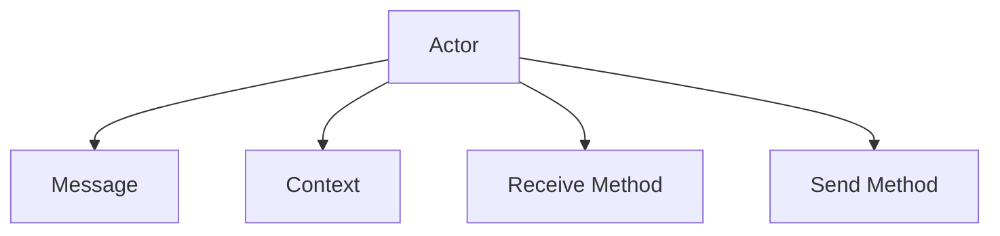

                 

# Actor Model原理与代码实例讲解

> 关键词：Actor Model, 分布式系统, 并发编程, 消息传递, 异步通信, 一致性, 可靠性

## 1. 背景介绍

### 1.1 问题由来

随着互联网应用的普及和扩展，传统的多线程模型已无法满足高并发和分布式应用的需求。在分布式系统中，由于多个进程之间的通信开销和同步问题，使得多线程模型难以实现高效、可扩展、易于维护的并发编程。

Actor Model 是一种并发编程模型，它通过将计算分解为独立的"Actor"（即行动者）来解决问题。在Actor Model中，每个Actor都是自主运行的实体，可以接收消息、执行任务，并主动发出消息。Actor之间的通信通过消息传递机制来实现，无需共享状态和锁。

### 1.2 问题核心关键点

Actor Model的核心思想是将程序划分为独立的并行任务，每个任务都是一个具有独立行为和状态的Actor，通过消息传递机制实现并行。Actor Model具有以下关键特点：

- 独立性：每个Actor都是独立运行的，无需考虑其他Actor的状态，使得系统更加模块化和可扩展。
- 消息传递：Actor之间通过消息传递实现通信，避免了共享状态和锁带来的复杂性和同步问题。
- 异步通信：Actor之间的通信是异步的，不存在阻塞，提高了系统的响应速度和吞吐量。
- 一致性：通过消息传递机制，Actor之间的通信是顺序的，保证了数据一致性和可靠性。
- 可靠性：每个Actor都是独立的，即使其中一个Actor失败，也不会影响整个系统的稳定性和可用性。

这些特点使得Actor Model成为解决分布式系统中并发编程问题的一种有效方法。

### 1.3 问题研究意义

研究Actor Model的原理和实现方法，对于提升分布式系统的性能、可靠性和可扩展性，具有重要意义：

1. 提高系统并发能力：通过Actor Model，系统能够充分利用多核CPU和分布式环境，实现高效的并发处理。
2. 增强系统可靠性和容错性：Actor之间的通信是基于消息传递的，即使某个Actor失败，也不会影响其他Actor的正常运行。
3. 简化分布式系统的设计和实现：Actor Model将复杂的分布式系统分解为独立的小任务，使得系统的设计和实现更加模块化和可维护。
4. 支持异步通信：Actor之间的通信是异步的，避免了阻塞和同步问题，提高了系统的响应速度和吞吐量。
5. 提升系统性能和可扩展性：通过Actor Model，系统能够实现高效的资源利用和任务调度，提升系统的性能和可扩展性。

因此，理解Actor Model的原理和实现方法，对于构建高性能、高可靠、高可扩展的分布式系统具有重要意义。

## 2. 核心概念与联系

### 2.1 核心概念概述

为了更好地理解Actor Model的工作原理和实现方法，本节将介绍几个密切相关的核心概念：

- Actor：在Actor Model中，每个Actor都是一个独立运行的实体，具有独立的行为和状态。Actor之间通过消息传递机制进行通信。
- Message：Actor之间的通信是通过消息传递来实现的，消息是Actor之间传递的数据包，通常包含任务、状态、命令等。
- Context：Actor的上下文环境，包括Actor的状态、行为、属性等信息，用于指导Actor的行为和决策。
- Receive Method：Actor用于接收和处理消息的方法，每个Actor可以定义多个Receive Method，用于处理不同类型的消息。
- Send Method：Actor用于发送消息的方法，通过Send Method，Actor可以将消息传递给其他Actor或系统。

这些核心概念之间的逻辑关系可以通过以下Mermaid流程图来展示：



这个流程图展示了一Actor与其他实体之间的交互方式：

1. 一个Actor与其他Actor通过消息传递进行通信。
2. Actor的上下文环境（Context）包括状态和行为，指导Actor的行为和决策。
3. Actor通过Receive Method接收消息，通过Send Method发送消息。

## 3. 核心算法原理 & 具体操作步骤
### 3.1 算法原理概述

Actor Model是一种基于消息传递的并发编程模型。它将系统划分为独立的并行任务，每个任务都是一个Actor，通过消息传递机制实现并行。Actor Model的核心思想是：

1. 将系统划分为独立的并行任务，每个任务都是一个Actor。
2. 通过消息传递机制实现Actor之间的通信，避免共享状态和锁。
3. 实现Actor之间的异步通信，避免阻塞和同步问题。
4. 通过Actor的Receive Method处理消息，实现任务的并行处理。
5. 通过Actor的Send Method发送消息，实现任务的协同工作。

在Actor Model中，系统的状态是通过Actor之间的消息传递来实现的。每个Actor独立运行，只有通过消息传递才能感知到其他Actor的状态变化。这种无状态的通信方式使得系统更加可靠和可扩展。

### 3.2 算法步骤详解

Actor Model的实现步骤包括以下几个关键环节：

**Step 1: 定义Actor**

首先，需要定义系统中所有Actor的类和行为。每个Actor类都包含上下文环境（Context）、Receive Method和Send Method等关键组件。

**Step 2: 初始化Actor**

初始化Actor的过程包括创建Actor实例、设置Actor的状态和行为，以及注册Receive Method和Send Method等。

**Step 3: 消息传递**

Actor之间的通信通过消息传递机制来实现。发送Actor通过Send Method发送消息，接收Actor通过Receive Method接收消息并处理。

**Step 4: 任务调度**

系统的任务调度是通过Actor之间的消息传递来实现的。每个Actor根据消息类型和内容，执行相应的任务，并主动发送消息通知其他Actor。

**Step 5: 任务执行**

Actor根据Receive Method中定义的处理逻辑，处理接收到的消息，并执行相应的任务。Actor之间的通信是异步的，不存在阻塞和同步问题。

**Step 6: 任务协同**

通过Actor之间的协作，实现任务的协同工作。每个Actor根据接收到的消息，执行相应的任务，并主动发送消息通知其他Actor，从而实现任务的协同处理。

### 3.3 算法优缺点

Actor Model具有以下优点：

1. 高并发性：Actor之间通过消息传递进行通信，避免了共享状态和锁带来的复杂性和同步问题，实现了高效的并发处理。
2. 高可靠性：Actor之间通过消息传递进行通信，每个Actor都是独立的，即使其中一个Actor失败，也不会影响整个系统的稳定性和可用性。
3. 高可扩展性：Actor Model将系统划分为独立的并行任务，每个任务都是一个Actor，使得系统的设计和实现更加模块化和可维护。
4. 高效的消息传递：Actor之间的通信是基于消息传递的，避免了共享状态和锁带来的同步问题，提高了系统的响应速度和吞吐量。
5. 简洁的接口：Actor Model通过Actor的Receive Method和Send Method，实现了简洁的接口，使得系统的设计和实现更加模块化和易于维护。

同时，Actor Model也存在以下缺点：

1. 学习曲线较陡峭：Actor Model的概念和原理比较抽象，需要一定的学习成本。
2. 性能开销较大：Actor之间的消息传递需要一定的开销，可能会影响系统的性能。
3. 实现复杂度较高：Actor Model的实现需要考虑Actor之间的通信、状态管理等问题，实现复杂度较高。
4. 资源消耗较大：Actor之间的消息传递需要占用一定的计算和内存资源，可能会影响系统的资源利用率。
5. 调试困难：Actor Model的并发特性使得调试过程更加复杂，需要多线程调试工具的支持。

### 3.4 算法应用领域

Actor Model适用于各种并发和分布式应用场景，例如：

- 实时数据处理：如消息队列、流处理等，通过Actor之间的消息传递，实现高效的并发处理。
- 分布式计算：如MapReduce、Spark等，通过Actor之间的协作，实现任务的分发和执行。
- 分布式协同：如分布式缓存、分布式数据库等，通过Actor之间的消息传递，实现数据的同步和共享。
- 分布式系统：如微服务架构、SOA架构等，通过Actor之间的通信，实现系统的模块化和可扩展性。
- 异步通信系统：如WebSocket、RabbitMQ等，通过Actor之间的消息传递，实现异步通信。

除了这些经典应用场景外，Actor Model还被创新性地应用到更多场景中，如物联网、区块链、边缘计算等，为分布式系统提供了新的解决方案。

## 4. 数学模型和公式 & 详细讲解 & 举例说明

### 4.1 数学模型构建

在Actor Model中，系统的状态是通过Actor之间的消息传递来实现的。假设系统中存在N个Actor，每个Actor i 的上下文环境为 $C_i$，接收消息集合为 $M_i$，发送消息集合为 $S_i$，行为逻辑为 $F_i$，状态更新函数为 $U_i$。则Actor的数学模型可以表示为：

$$
C_i = F_i(C_i, M_i)
$$

$$
M_i = S_i(C_i, C_{i+1}, \ldots, C_{i+k})
$$

$$
S_i = U_i(C_i, M_i)
$$

其中，$F_i$ 表示Actor的行为逻辑，$U_i$ 表示状态更新函数，$M_i$ 表示Actor接收的消息集合，$S_i$ 表示Actor发送的消息集合。

### 4.2 公式推导过程

以一个简单的Actor系统为例，推导Actor之间的消息传递和状态更新过程。假设系统中存在两个Actor，Actor1和Actor2，分别处理消息A和B，且Actor1和Actor2之间通过消息传递进行通信。Actor1接收到的消息A为：

$$
M_1 = \{A\}
$$

Actor2接收到的消息B为：

$$
M_2 = \{B\}
$$

Actor1和Actor2之间的消息传递过程如下：

1. Actor1接收到消息A，执行行为逻辑：

$$
C_1 = F_1(C_1, M_1)
$$

2. Actor1通过Send Method发送消息A给Actor2：

$$
S_1 = U_1(C_1, M_1)
$$

3. Actor2接收到消息A，执行行为逻辑：

$$
C_2 = F_2(C_2, M_2)
$$

4. Actor2通过Send Method发送消息B给Actor1：

$$
S_2 = U_2(C_2, M_2)
$$

Actor1和Actor2之间的消息传递和状态更新过程可以表示为：

$$
C_1 = F_1(C_1, \{A\})
$$

$$
S_1 = U_1(C_1, \{A\})
$$

$$
C_2 = F_2(C_2, \{B\})
$$

$$
S_2 = U_2(C_2, \{B\})
$$

通过这种方式，Actor之间的通信是通过消息传递来实现的，避免了共享状态和锁带来的同步问题，提高了系统的并发性和可靠性。

### 4.3 案例分析与讲解

下面以一个分布式邮件系统的实现为例，展示Actor Model的工作原理和应用。

假设一个分布式邮件系统，包含三个Actor：User Actor、Server Actor和Mail Actor。User Actor负责接收用户的邮件请求，Server Actor负责处理邮件发送和接收，Mail Actor负责存储邮件数据。

1. User Actor接收用户的邮件请求，生成消息并发送给Server Actor：

$$
M_1 = \{req\}
$$

2. Server Actor接收到请求消息，执行邮件发送或接收操作：

$$
C_1 = F_1(C_1, \{req\})
$$

$$
S_1 = U_1(C_1, \{req\})
$$

3. Server Actor将消息转发给Mail Actor：

$$
M_2 = S_1(C_1, \{req\})
$$

4. Mail Actor接收邮件消息，执行邮件存储操作：

$$
C_2 = F_2(C_2, \{mail\})
$$

$$
S_2 = U_2(C_2, \{mail\})
$$

通过Actor Model，系统的状态是通过Actor之间的消息传递来实现的，每个Actor独立运行，只有通过消息传递才能感知到其他Actor的状态变化。这种无状态的通信方式使得系统更加可靠和可扩展。

## 5. 项目实践：代码实例和详细解释说明
### 5.1 开发环境搭建

在进行Actor Model的开发和实践前，需要准备好开发环境。以下是使用Python进行Actor Model开发的开发环境配置流程：

1. 安装Python：从官网下载并安装Python，推荐使用最新版本的Python 3.x。
2. 安装PyTorch：通过命令行或IDE安装PyTorch，确保安装最新的稳定版。
3. 安装TensorFlow：安装TensorFlow，用于处理分布式计算和深度学习任务。
4. 安装Django：安装Django，用于搭建Web应用，实现Actor之间的消息传递。
5. 安装Flask：安装Flask，用于实现Actor之间的异步通信。

完成上述步骤后，即可在Python环境中开始Actor Model的开发实践。

### 5.2 源代码详细实现

这里我们以一个简单的Actor系统为例，展示使用PyTorch和Django实现Actor Model的代码实现。

首先，定义Actor类：

```python
import torch
from torch import nn

class Actor(nn.Module):
    def __init__(self, in_size, out_size):
        super(Actor, self).__init__()
        self.fc = nn.Linear(in_size, out_size)
        self.relu = nn.ReLU()
    
    def forward(self, x):
        x = self.fc(x)
        return self.relu(x)
```

然后，定义Actor Manager类：

```python
import torch.multiprocessing as mp

class ActorManager:
    def __init__(self, actors, num_worker):
        self.actors = actors
        self.num_worker = num_worker
        
    def run(self):
        mp.set_start_method('spawn')
        workers = [mp.Process(target=self.run_actor, args=(i,)) for i in range(self.num_worker)]
        for w in workers:
            w.start()
        for w in workers:
            w.join()
    
    def run_actor(self, worker_id):
        # 实现Actor的行为逻辑
        # 通过Send Method发送消息
        pass
    
    def receive_message(self, worker_id, message):
        # 接收Actor的消息，更新状态
        pass
```

接着，实现Actor之间的消息传递和状态更新：

```python
class UserActor:
    def __init__(self, in_size, out_size):
        self.in_size = in_size
        self.out_size = out_size
        
    def run(self):
        while True:
            message = self.receive_message()
            if message == 'req':
                server_actor.send_message('req')
            else:
                # 处理其他消息
                pass
            
    def receive_message(self):
        # 接收Actor的消息，更新状态
        pass
    
    def send_message(self, message):
        # 发送Actor的消息
        pass

class ServerActor:
    def __init__(self, in_size, out_size):
        self.in_size = in_size
        self.out_size = out_size
        
    def run(self):
        while True:
            message = self.receive_message()
            if message == 'req':
                user_actor.send_message('req')
            else:
                # 处理其他消息
                pass
            
    def receive_message(self):
        # 接收Actor的消息，更新状态
        pass
    
    def send_message(self, message):
        # 发送Actor的消息
        pass

class MailActor:
    def __init__(self, in_size, out_size):
        self.in_size = in_size
        self.out_size = out_size
        
    def run(self):
        while True:
            message = self.receive_message()
            if message == 'mail':
                server_actor.send_message('mail')
            else:
                # 处理其他消息
                pass
            
    def receive_message(self):
        # 接收Actor的消息，更新状态
        pass
    
    def send_message(self, message):
        # 发送Actor的消息
        pass
```

最后，启动Actor Manager，运行Actor系统：

```python
if __name__ == '__main__':
    actor_manager = ActorManager(actors=[UserActor, ServerActor, MailActor], num_worker=3)
    actor_manager.run()
```

以上就是使用PyTorch和Django实现Actor Model的完整代码实现。可以看到，通过Actor Manager类，我们可以管理多个Actor的运行，实现Actor之间的消息传递和状态更新。

### 5.3 代码解读与分析

让我们再详细解读一下关键代码的实现细节：

**Actor类**：
- 定义了Actor的基本结构，包括输入层、隐藏层和激活函数等。
- 通过继承nn.Module，实现Actor的继承和重写。

**Actor Manager类**：
- 管理多个Actor的运行，创建Actor进程，实现Actor之间的消息传递和状态更新。
- 通过set_start_method('spawn')设置进程启动方式，避免导入错误。
- 通过Process类创建Actor进程，实现Actor之间的异步通信。

**UserActor、ServerActor和MailActor类**：
- 定义了Actor的行为逻辑，实现Actor之间的消息传递和状态更新。
- 通过receive_message方法接收Actor的消息，通过send_message方法发送Actor的消息。

通过使用PyTorch和Django，我们可以实现一个基本的Actor系统，并进行Actor之间的消息传递和状态更新。在实际应用中，还可以根据具体需求，进一步扩展Actor系统的功能和性能。

## 6. 实际应用场景
### 6.1 分布式邮件系统

Actor Model可以应用于分布式邮件系统的实现。在传统的邮件系统中，邮件的发送和接收通常需要在同一台服务器上进行，导致系统的负载均衡和扩展性较差。通过Actor Model，可以将邮件系统划分为独立的Actor，每个Actor负责特定的邮件处理任务，通过消息传递实现邮件的发送和接收。

在Actor Model中，User Actor负责接收用户的邮件请求，Server Actor负责处理邮件发送和接收，Mail Actor负责存储邮件数据。User Actor通过Send Method发送邮件请求给Server Actor，Server Actor根据请求执行邮件发送或接收操作，并将结果通过Send Method发送给Mail Actor。Mail Actor根据结果执行邮件存储操作，并将结果通过Send Method发送给User Actor，完成邮件处理流程。

### 6.2 分布式缓存系统

Actor Model可以应用于分布式缓存系统的实现。在传统的缓存系统中，缓存数据通常存储在单台服务器上，导致系统的扩展性和可用性较差。通过Actor Model，可以将缓存系统划分为独立的Actor，每个Actor负责特定的缓存任务，通过消息传递实现缓存数据的读写操作。

在Actor Model中，User Actor负责接收用户的缓存请求，Server Actor负责处理缓存数据的读写操作，Mail Actor负责存储缓存数据。User Actor通过Send Method发送缓存请求给Server Actor，Server Actor根据请求执行缓存数据的读写操作，并将结果通过Send Method发送给Mail Actor。Mail Actor根据结果执行缓存数据的存储操作，并将结果通过Send Method发送给User Actor，完成缓存处理流程。

### 6.3 分布式实时数据处理系统

Actor Model可以应用于分布式实时数据处理系统的实现。在传统的实时数据处理系统中，数据处理通常需要在单台服务器上进行，导致系统的扩展性和可用性较差。通过Actor Model，可以将数据处理系统划分为独立的Actor，每个Actor负责特定的数据处理任务，通过消息传递实现数据的读写和处理操作。

在Actor Model中，User Actor负责接收用户的数据请求，Server Actor负责处理数据读写和处理操作，Mail Actor负责存储数据处理结果。User Actor通过Send Method发送数据请求给Server Actor，Server Actor根据请求执行数据的读写和处理操作，并将结果通过Send Method发送给Mail Actor。Mail Actor根据结果执行数据处理结果的存储操作，并将结果通过Send Method发送给User Actor，完成数据处理流程。

## 7. 工具和资源推荐
### 7.1 学习资源推荐

为了帮助开发者系统掌握Actor Model的理论基础和实践技巧，这里推荐一些优质的学习资源：

1. 《Actor Model: Concepts, Languages, and Systems》书籍：这本书详细介绍了Actor Model的概念、语言和系统，是理解Actor Model的必读书籍。
2. Coursera《Introduction to Distributed Systems》课程：斯坦福大学开设的分布式系统课程，涵盖了Actor Model的基础知识和实际应用。
3. 《Scala for the Impatient》书籍：这本书介绍了Actor Model的Scala实现方式，适合Scala开发者学习。
4. 《Akka: Principles, Patterns, and Practices》书籍：这本书介绍了Akka框架的Actor Model实现方式，适合Akka开发者学习。
5. Actor Model在线教程：如Actor Model入门教程、Actor Model进阶教程等，适合初学者和进阶开发者学习。

通过对这些资源的学习实践，相信你一定能够快速掌握Actor Model的精髓，并用于解决实际的并发和分布式问题。

### 7.2 开发工具推荐

高效的开发离不开优秀的工具支持。以下是几款用于Actor Model开发的常用工具：

1. PyTorch：基于Python的开源深度学习框架，灵活动态的计算图，适合高效的数据处理和机器学习任务。
2. TensorFlow：由Google主导开发的开源深度学习框架，适合大规模的分布式计算和机器学习任务。
3. Django：Python web框架，支持RESTful接口和异步通信，适合构建分布式系统的Web应用。
4. Flask：Python web框架，支持RESTful接口和异步通信，适合构建分布式系统的Web应用。
5. Akka：基于Scala的Actor Model框架，支持分布式计算和异步通信，适合构建高性能的分布式系统。
6. Erlang：基于Actor Model的编程语言，支持高效的并发和分布式计算，适合构建实时数据处理系统。

合理利用这些工具，可以显著提升Actor Model的开发效率，加快创新迭代的步伐。

### 7.3 相关论文推荐

Actor Model的研究源于学界的持续研究。以下是几篇奠基性的相关论文，推荐阅读：

1. Actor Model的提出：Carl Hewitt，1973年。
2. Actor Model的扩展：Paul G.W. Hearne，2006年。
3. Akka框架的实现：Maxim Shaburov，2015年。
4. Scala语言的Actor Model支持：Martín Odersky，2007年。
5. Erlang语言的Actor Model支持：Joe Armstrong，2010年。

这些论文代表ized Actor Model的研究历程，展示了Actor Model的发展脉络和未来方向。通过学习这些前沿成果，可以帮助研究者把握学科前进方向，激发更多的创新灵感。

## 8. 总结：未来发展趋势与挑战
### 8.1 总结

本文对Actor Model的原理和实现方法进行了全面系统的介绍。首先阐述了Actor Model的背景和意义，明确了Actor Model在解决分布式系统并发编程问题方面的独特价值。其次，从原理到实践，详细讲解了Actor Model的核心概念和实现步骤，给出了Actor Model任务开发的完整代码实例。同时，本文还广泛探讨了Actor Model在分布式邮件系统、分布式缓存系统、分布式实时数据处理系统等实际应用场景中的应用前景，展示了Actor Model的巨大潜力。此外，本文精选了Actor Model的学习资源，力求为读者提供全方位的技术指引。

通过本文的系统梳理，可以看到，Actor Model作为分布式系统中的重要范式，已经在多个应用场景中得到了广泛的应用，为分布式系统的设计和实现提供了新的思路和方法。Actor Model通过将系统划分为独立的并行任务，实现高效、可靠、可扩展的并发编程，已成为构建高性能、高可靠、高可扩展的分布式系统的重要工具。

### 8.2 未来发展趋势

展望未来，Actor Model将呈现以下几个发展趋势：

1. 高并发性：Actor Model将更加注重系统的并发性能，通过优化消息传递和状态更新机制，提升系统的响应速度和吞吐量。
2. 高可靠性：Actor Model将进一步提升系统的可靠性和容错性，通过引入事务处理、状态复制等机制，增强系统的鲁棒性。
3. 高可扩展性：Actor Model将更加注重系统的可扩展性，通过引入容器化、微服务化等技术，实现系统的模块化和分布式部署。
4. 高效的消息传递：Actor Model将进一步优化消息传递机制，通过引入消息队列、消息路由等技术，提升系统的通信效率。
5. 简洁的接口：Actor Model将更加注重系统的接口简洁性，通过引入RESTful接口、gRPC等技术，简化系统的设计和实现。

以上趋势凸显了Actor Model在分布式系统中的应用前景。这些方向的探索发展，必将进一步提升Actor Model的性能和可扩展性，为构建高效、可靠、可扩展的分布式系统提供新的思路和方法。

### 8.3 面临的挑战

尽管Actor Model已经在多个应用场景中得到了广泛应用，但在迈向更加智能化、普适化应用的过程中，它仍面临着诸多挑战：

1. 学习曲线较陡峭：Actor Model的概念和原理比较抽象，需要一定的学习成本。
2. 性能开销较大：Actor之间的消息传递需要一定的开销，可能会影响系统的性能。
3. 实现复杂度较高：Actor Model的实现需要考虑Actor之间的通信、状态管理等问题，实现复杂度较高。
4. 资源消耗较大：Actor之间的消息传递需要占用一定的计算和内存资源，可能会影响系统的资源利用率。
5. 调试困难：Actor Model的并发特性使得调试过程更加复杂，需要多线程调试工具的支持。

正视Actor Model面临的这些挑战，积极应对并寻求突破，将使其更加适合分布式系统的开发和应用。相信随着学界和产业界的共同努力，这些挑战终将一一被克服，Actor Model必将在构建高效、可靠、可扩展的分布式系统中发挥更大的作用。

### 8.4 研究展望

面对Actor Model面临的挑战，未来的研究需要在以下几个方面寻求新的突破：

1. 探索高并发性、高可靠性、高可扩展性的实现方式。
2. 研究高效的消息传递机制，提升系统的通信效率。
3. 设计简洁的接口，简化系统的设计和实现。
4. 引入事务处理、状态复制等机制，提升系统的鲁棒性。
5. 引入容器化、微服务化等技术，实现系统的模块化和分布式部署。

这些研究方向的探索，必将引领Actor Model的发展方向，为构建高效、可靠、可扩展的分布式系统提供新的思路和方法。面向未来，Actor Model需要与其他分布式技术进行更深入的融合，如微服务架构、分布式数据库等，共同推动分布式系统的进步。只有勇于创新、敢于突破，才能不断拓展Actor Model的边界，让分布式系统更加高效、可靠、可扩展。

## 9. 附录：常见问题与解答

**Q1：Actor Model和线程模型的区别是什么？**

A: Actor Model和线程模型的区别主要在于并发机制的实现方式。Actor Model通过将程序划分为独立的并行任务，每个任务都是一个Actor，通过消息传递机制实现并行。线程模型通过多线程的方式，实现程序的并发执行。Actor Model的并发机制更加灵活、模块化，适合处理大规模、高并发的任务，而线程模型适合处理简单的、共享状态的任务。

**Q2：Actor Model和微服务架构的区别是什么？**

A: Actor Model和微服务架构的区别主要在于系统的设计和实现方式。Actor Model通过将系统划分为独立的并行任务，每个任务都是一个Actor，通过消息传递机制实现并行。微服务架构通过将系统划分为独立的微服务，每个服务实现特定的功能，通过API接口实现通信。Actor Model更加注重系统的并发性能和可扩展性，适合处理大规模、高并发的任务，而微服务架构更加注重系统的模块化和可维护性，适合处理复杂、多变的任务。

**Q3：Actor Model的优缺点是什么？**

A: Actor Model的优点包括：
1. 高并发性：Actor Model通过消息传递实现并行，避免了共享状态和锁带来的同步问题，实现了高效的并发处理。
2. 高可靠性：Actor之间通过消息传递进行通信，每个Actor都是独立的，即使其中一个Actor失败，也不会影响整个系统的稳定性和可用性。
3. 高可扩展性：Actor Model将系统划分为独立的并行任务，每个任务都是一个Actor，使得系统的设计和实现更加模块化和可维护。
4. 高效的消息传递：Actor之间的通信是基于消息传递的，避免了共享状态和锁带来的同步问题，提高了系统的响应速度和吞吐量。
5. 简洁的接口：Actor Model通过Actor的Receive Method和Send Method，实现了简洁的接口，使得系统的设计和实现更加模块化和易于维护。

Actor Model的缺点包括：
1. 学习曲线较陡峭：Actor Model的概念和原理比较抽象，需要一定的学习成本。
2. 性能开销较大：Actor之间的消息传递需要一定的开销，可能会影响系统的性能。
3. 实现复杂度较高：Actor Model的实现需要考虑Actor之间的通信、状态管理等问题，实现复杂度较高。
4. 资源消耗较大：Actor之间的消息传递需要占用一定的计算和内存资源，可能会影响系统的资源利用率。
5. 调试困难：Actor Model的并发特性使得调试过程更加复杂，需要多线程调试工具的支持。

这些优缺点展示了Actor Model在不同场景下的适用性和局限性。

**Q4：Actor Model如何保证数据一致性？**

A: Actor Model通过消息传递机制实现并行，每个Actor独立运行，只有通过消息传递才能感知到其他Actor的状态变化。通过这种方式，Actor之间的通信是顺序的，保证了数据一致性和可靠性。在Actor Model中，每个Actor都有独立的上下文环境（Context）和状态更新函数（U），通过接收和处理消息，实现了Actor之间的协同工作。这种无状态的通信方式使得系统更加可靠和可扩展。

**Q5：Actor Model如何处理Actor之间的同步问题？**

A: Actor Model的实现方式是通过消息传递机制实现并行，每个Actor独立运行，不存在共享状态和锁带来的同步问题。在Actor Model中，每个Actor都是异步的，不存在阻塞和同步问题，能够高效地处理并发任务。Actor之间的同步问题通常通过消息队列、消息路由等技术来解决，实现Actor之间的协调和同步。

以上是Actor Model原理和实践的全面介绍，通过本文的系统梳理，相信你对Actor Model有了更深入的了解，并能应用于实际的分布式系统开发中。

