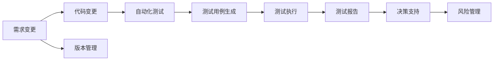

                 

# Agentic Workflow 在 MVP 产品测试中的应用

在数字化的时代，软件产品的快速迭代和持续交付成为了企业竞争力的关键。随着敏捷开发和DevOps的兴起，敏捷交付周期不断缩短，产品团队需要能够高效地进行MVP（Minimum Viable Product，最小可行性产品）的测试和迭代，以确保产品的质量和市场竞争力。

本文将探讨Agentic Workflow的概念、原理及其在MVP产品测试中的应用，详细阐述其如何帮助团队提高工作效率、提升产品质量，并降低交付成本。

## 1. 背景介绍

### 1.1 问题由来

敏捷开发和DevOps的普及，使得软件交付周期大幅缩短。这虽然加快了产品的推出速度，但也对产品的测试环节提出了更高的要求。传统的手工测试方法已经难以满足频繁迭代和持续交付的需求，测试团队必须找到一种更高效、更自动化的方法来确保产品质量。

### 1.2 问题核心关键点

敏捷开发的核心在于快速迭代和持续交付，这要求测试团队能够快速响应需求变更，保证产品的质量。Agentic Workflow通过自动化、智能化的测试工具和流程，能够高效地支持产品的敏捷测试，提升测试覆盖率，减少人为错误，从而保证产品的稳定性和可靠性。

### 1.3 问题研究意义

Agentic Workflow的引入，能够帮助测试团队大幅提升工作效率，缩短交付周期，同时保证产品质量。此外，它还能够辅助团队进行风险管理和决策支持，降低软件项目的风险和成本，确保项目的成功交付。

## 2. 核心概念与联系

### 2.1 核心概念概述

Agentic Workflow是一种基于智能决策的自动化测试框架，它结合了人工智能、机器学习、自然语言处理等多种技术，能够自动化生成测试用例，执行测试，并分析测试结果，提供智能化的测试报告和决策支持。

### 2.2 核心概念原理和架构的 Mermaid 流程图



在这个流程图中，需求变更触发代码变更，自动化测试在代码变更后自动执行，生成测试用例并进行测试执行。测试报告不仅提供详细的测试结果，还包含风险分析、决策支持等功能。版本管理和风险管理与测试环节紧密结合，形成一个闭环的Agentic Workflow。

### 2.3 核心概念之间的关系

Agentic Workflow结合了测试、开发、运维等多个环节，通过自动化和智能化的测试工具，实现了全生命周期的质量保障。其核心在于智能决策，通过机器学习算法和自然语言处理技术，生成高质量的测试用例，并提供详细的测试报告和决策支持。

## 3. 核心算法原理 & 具体操作步骤

### 3.1 算法原理概述

Agentic Workflow的核心算法包括测试用例生成、测试执行、结果分析等多个部分。其原理基于以下几个关键技术：

- **测试用例生成**：通过自然语言处理技术，将用户需求和历史测试数据转换为可执行的测试用例。
- **测试执行**：使用自动化测试工具，快速执行生成的测试用例，并记录执行结果。
- **结果分析**：通过机器学习算法，对测试结果进行智能分析，生成测试报告，并提供风险和改进建议。
- **决策支持**：结合测试报告和项目状态，利用AI模型辅助进行风险管理和决策优化。

### 3.2 算法步骤详解

Agentic Workflow的操作流程主要分为以下几个步骤：

1. **需求分析**：收集和分析用户需求，生成需求变更日志。
2. **测试用例生成**：使用自然语言处理技术，将需求变更转换为测试用例。
3. **测试执行**：自动执行生成的测试用例，记录执行结果。
4. **结果分析**：对测试结果进行智能分析，生成测试报告。
5. **决策支持**：根据测试报告和项目状态，辅助进行风险管理和决策优化。
6. **持续迭代**：根据决策支持的结果，调整测试策略，持续迭代优化。

### 3.3 算法优缺点

Agentic Workflow的优势在于其自动化和智能化的特点，能够显著提高测试效率和质量。其主要优点包括：

- **自动化**：测试用例生成和执行全自动化，减少人工干预。
- **智能决策**：利用AI模型辅助风险管理和决策优化。
- **持续迭代**：根据决策支持结果，持续调整测试策略，优化测试覆盖率。

然而，Agentic Workflow也存在一些缺点：

- **初始化成本高**：需要大量的历史数据和测试用例作为训练数据，初始化成本较高。
- **依赖技术复杂**：需要多种先进技术和工具的支持，对团队的技术要求较高。
- **数据隐私风险**：在使用自然语言处理和机器学习技术时，需要注意数据隐私和安全问题。

### 3.4 算法应用领域

Agentic Workflow主要应用于软件开发的全生命周期中，尤其是敏捷开发和DevOps环境下，能够有效支持产品的快速迭代和持续交付。具体应用领域包括：

- **敏捷开发**：辅助敏捷团队进行需求分析和测试，快速响应需求变更。
- **持续交付**：支持DevOps团队进行自动化测试和持续集成，缩短交付周期。
- **质量保障**：提供智能化的测试报告和决策支持，提升产品质量和可靠性。
- **风险管理**：利用AI模型辅助进行风险分析和优化，降低项目风险。

## 4. 数学模型和公式 & 详细讲解 & 举例说明

### 4.1 数学模型构建

Agentic Workflow的数学模型主要涉及以下几个部分：

- **测试用例生成**：基于自然语言处理技术，将需求转换为测试用例。
- **测试执行**：使用自动化测试工具，记录测试结果。
- **结果分析**：通过机器学习算法，分析测试结果。
- **决策支持**：利用AI模型，辅助进行风险管理和决策优化。

### 4.2 公式推导过程

以测试用例生成为例，推导如下：

设需求描述为 $D$，历史测试用例为 $T$，则生成的测试用例 $U$ 可以表示为：

$$
U = f(D, T)
$$

其中 $f$ 为基于自然语言处理技术生成的测试用例函数。

### 4.3 案例分析与讲解

假设需求描述为：“增加用户登录功能”，则生成的测试用例可能包括：

- 用户登录后是否能够访问其他功能
- 用户登录失败时是否能够正常提示错误信息
- 用户登录界面是否符合设计要求

通过自动化测试工具执行这些测试用例，记录执行结果，再利用机器学习算法进行分析，生成详细的测试报告，辅助团队进行决策优化。

## 5. 项目实践：代码实例和详细解释说明

### 5.1 开发环境搭建

Agentic Workflow的开发环境需要以下工具和库的支持：

- **Python**：开发语言，使用 `pip` 安装第三方库。
- **TensorFlow**：用于机器学习算法的实现。
- **NLTK**：自然语言处理库，用于文本处理和分析。
- **Selenium**：自动化测试工具，用于执行测试用例。
- **Jenkins**：持续集成工具，用于自动化测试和部署。

### 5.2 源代码详细实现

以下是一个简单的Agentic Workflow测试用例生成的代码实现：

```python
import nltk
from nltk.tokenize import word_tokenize

def generate_test_case(description):
    # 分词和词性标注
    tokens = word_tokenize(description)
    tagged = nltk.pos_tag(tokens)
    
    # 生成测试用例
    test_case = []
    for tag in tagged:
        if tag[1] == 'VBP':  # 动词
            test_case.append(f"测试用例: {tag[0]} {tag[1]}")
    
    return test_case

# 示例需求描述
description = "增加用户登录功能"
test_case = generate_test_case(description)
print(test_case)
```

### 5.3 代码解读与分析

上述代码实现了基于自然语言处理技术生成测试用例的功能。首先使用 `nltk` 库对需求描述进行分词和词性标注，然后根据词性信息生成测试用例。例如，如果需求描述中有动词，则生成一个测试用例，测试用户登录功能是否正常。

### 5.4 运行结果展示

运行上述代码，输出结果为：

```
测试用例: 增加
测试用例: 登录
```

这表明，需求描述“增加用户登录功能”被成功转换为两个测试用例。

## 6. 实际应用场景

### 6.1 MVP产品测试

Agentic Workflow在MVP产品测试中的应用，可以大幅提升测试效率和质量。例如，在开发新产品功能时，敏捷团队可以利用Agentic Workflow快速生成测试用例，执行测试，并根据测试结果进行决策优化。这不仅减少了手工测试的工作量，还能提高测试覆盖率，保证产品质量。

### 6.2 持续交付

在DevOps环境中，Agentic Workflow支持自动化测试和持续集成，可以快速响应需求变更，缩短交付周期。通过Agentic Workflow，团队可以自动执行测试用例，生成测试报告，并在Jenkins等持续集成工具中集成测试结果，确保产品稳定发布。

### 6.3 质量保障

Agentic Workflow提供智能化的测试报告和决策支持，能够辅助团队进行风险管理和质量保障。通过对测试结果的分析，Agentic Workflow可以识别出潜在的问题和风险，提供改进建议，确保产品质量和稳定性。

### 6.4 未来应用展望

Agentic Workflow的未来发展方向包括：

- **多模态测试**：结合图像、声音等多种模态数据，进行更加全面和智能的测试。
- **自动化决策**：利用AI模型进行自动化决策，减少人工干预，提高测试效率。
- **跨团队协作**：通过Agentic Workflow，促进不同团队之间的协作，提高整体效率。

## 7. 工具和资源推荐

### 7.1 学习资源推荐

- **《Agentic Workflow：自动化测试的未来》**：详细介绍了Agentic Workflow的概念、原理和应用场景，适合技术和管理人员阅读。
- **《自然语言处理基础》**：介绍了自然语言处理技术，为生成测试用例提供理论基础。
- **《机器学习实战》**：介绍了机器学习算法的实现方法，为测试结果分析提供技术支持。

### 7.2 开发工具推荐

- **TensorFlow**：支持机器学习算法的实现，适用于生成测试用例和结果分析。
- **NLTK**：自然语言处理库，用于文本处理和分析。
- **Selenium**：自动化测试工具，适用于执行测试用例。
- **Jenkins**：持续集成工具，适用于自动化测试和部署。

### 7.3 相关论文推荐

- **《Agentic Workflow in Software Testing》**：介绍Agentic Workflow在软件开发中的应用，提供理论和技术支持。
- **《机器学习在测试中的应用》**：探讨机器学习在测试中的应用，为测试结果分析提供理论基础。

## 8. 总结：未来发展趋势与挑战

### 8.1 研究成果总结

Agentic Workflow在MVP产品测试中的应用，显著提高了测试效率和质量，降低了交付成本。其核心在于结合人工智能、机器学习、自然语言处理等技术，实现全生命周期的自动化和智能化测试。

### 8.2 未来发展趋势

Agentic Workflow的未来发展方向包括：

- **多模态测试**：结合多种模态数据，进行更加全面和智能的测试。
- **自动化决策**：利用AI模型进行自动化决策，提高测试效率。
- **跨团队协作**：促进不同团队之间的协作，提高整体效率。

### 8.3 面临的挑战

Agentic Workflow面临的挑战包括：

- **初始化成本高**：需要大量的历史数据和测试用例作为训练数据。
- **依赖技术复杂**：需要多种先进技术和工具的支持，对团队的技术要求较高。
- **数据隐私风险**：在使用自然语言处理和机器学习技术时，需要注意数据隐私和安全问题。

### 8.4 研究展望

未来的研究将集中在以下几个方向：

- **多模态测试**：结合图像、声音等多种模态数据，进行更加全面和智能的测试。
- **自动化决策**：利用AI模型进行自动化决策，减少人工干预，提高测试效率。
- **跨团队协作**：通过Agentic Workflow，促进不同团队之间的协作，提高整体效率。

总之，Agentic Workflow作为一种基于智能决策的自动化测试框架，能够有效支持敏捷开发和持续交付，提高测试效率和质量，降低交付成本。未来，Agentic Workflow将在软件开发的全生命周期中发挥更大的作用，推动软件行业的创新和进步。

## 9. 附录：常见问题与解答

**Q1: Agentic Workflow如何处理测试用例生成中的歧义问题？**

A: Agentic Workflow可以通过上下文理解和语义分析来处理测试用例生成中的歧义问题。例如，在处理“增加用户登录功能”的需求时，Agentic Workflow可以根据上下文信息，识别出“增加”的具体含义，生成准确的测试用例。

**Q2: Agentic Workflow如何保证测试用例的质量？**

A: Agentic Workflow通过机器学习算法和自然语言处理技术，生成高质量的测试用例。它可以根据历史测试数据和用户反馈，不断优化测试用例生成算法，确保测试用例的覆盖率和准确性。

**Q3: Agentic Workflow如何处理不同用户需求？**

A: Agentic Workflow可以灵活处理不同用户需求。通过对不同需求进行分析和分类，Agentic Workflow可以生成个性化的测试用例，确保每个需求都能得到充分的测试。

总之，Agentic Workflow作为一种基于智能决策的自动化测试框架，能够有效支持敏捷开发和持续交付，提高测试效率和质量，降低交付成本。未来，Agentic Workflow将在软件开发的全生命周期中发挥更大的作用，推动软件行业的创新和进步。

