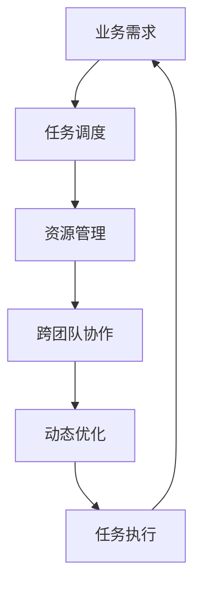

                 

## 1. 背景介绍

Agentic Workflow (AWF) 是一种旨在通过自动化、动态调整和优化工作流程，使企业能够高效、灵活地应对复杂业务挑战的技术。其核心思想是通过任务调度、资源管理和跨团队协作，实现业务流程的智能化、自动化。然而，尽管 AW F low 已经展现出强大的潜力，其在易用性方面仍存在一些挑战，阻碍了其在实际生产环境中的应用推广。本文将深入探讨 Agentic Workflow 的易用性改进方向，提出一系列可行的优化策略，以帮助企业和开发者更好地理解和利用这项技术。

## 2. 核心概念与联系

### 2.1 核心概念概述

Agentic Workflow 作为新一代的工作流程自动化技术，集成了任务调度、资源管理、跨团队协作、动态优化等功能，旨在帮助企业实现业务流程的智能化、自动化。其核心概念包括以下几个方面：

1. **任务调度**：根据业务需求和优先级自动分配任务，优化任务执行路径，提高任务执行效率。
2. **资源管理**：动态分配和调度计算资源、网络资源等，提升资源利用率，降低资源消耗成本。
3. **跨团队协作**：支持不同团队和部门之间的协同工作，实现信息共享和实时协作，提升团队协作效率。
4. **动态优化**：根据业务需求和环境变化，动态调整和优化工作流程，提升系统性能和稳定性。

这些核心概念之间通过业务需求、任务调度、资源分配和团队协作等联系在一起，形成一个完整的业务流程自动化体系。

### 2.2 核心概念原理和架构的 Mermaid 流程图



这个流程图展示了 Agentic Workflow 的核心概念和相互关系：

1. 业务需求驱动任务调度。
2. 任务调度依赖资源管理。
3. 跨团队协作支持资源管理和任务调度。
4. 动态优化贯穿任务调度、资源管理和跨团队协作的全过程。

通过这一连贯的过程，Agentic Workflow 能够高效、灵活地应对复杂的业务挑战。

## 3. 核心算法原理 & 具体操作步骤

### 3.1 算法原理概述

Agentic Workflow 的算法原理主要围绕以下几个核心算法展开：

1. **任务调度算法**：基于贪心策略和启发式算法，动态调整任务执行路径，优化任务执行效率。
2. **资源分配算法**：采用多目标优化算法，动态分配和调度计算资源、网络资源等，提升资源利用率。
3. **跨团队协作算法**：基于信息共享和协同工作协议，实现不同团队和部门之间的无缝协作。
4. **动态优化算法**：使用自适应算法和强化学习，根据业务需求和环境变化，动态调整和优化工作流程。

### 3.2 算法步骤详解

**Step 1: 数据采集与分析**

Agentic Workflow 需要收集和分析大量的业务数据，包括任务执行数据、资源使用数据、团队协作数据等。数据采集和分析是 Agentic Workflow 的基础，通过数据驱动，可以更准确地进行任务调度、资源管理、跨团队协作和动态优化。

**Step 2: 任务调度**

任务调度是 Agentic Workflow 的核心功能之一。通过任务调度算法，Agentic Workflow 可以动态调整任务执行路径，优化任务执行效率。任务调度算法主要包括以下几个步骤：

1. **任务优先级排序**：根据任务的紧急程度和重要程度，对任务进行优先级排序。
2. **任务执行路径规划**：根据任务依赖关系和资源可用性，规划任务执行路径。
3. **任务动态调整**：根据实时环境变化，动态调整任务执行路径，优化任务执行效率。

**Step 3: 资源管理**

资源管理是 Agentic Workflow 的重要功能，通过动态分配和调度计算资源、网络资源等，可以提升资源利用率，降低资源消耗成本。资源管理算法主要包括以下几个步骤：

1. **资源需求预测**：根据任务执行数据和环境变化，预测资源需求。
2. **资源分配与调度**：根据资源需求和可用性，动态分配和调度计算资源、网络资源等。
3. **资源性能监控**：实时监控资源使用情况，及时发现和解决问题。

**Step 4: 跨团队协作**

跨团队协作是 Agentic Workflow 的重要功能之一。通过跨团队协作算法，Agentic Workflow 可以实现不同团队和部门之间的无缝协作，提升团队协作效率。跨团队协作算法主要包括以下几个步骤：

1. **信息共享**：建立团队和部门之间的信息共享机制，实现信息透明。
2. **协同工作协议**：制定协同工作协议，确保不同团队和部门之间的协同工作顺利进行。
3. **实时协作**：通过即时通讯和协作工具，实现实时协作和沟通。

**Step 5: 动态优化**

动态优化是 Agentic Workflow 的核心功能之一，通过动态调整和优化工作流程，可以提升系统性能和稳定性。动态优化算法主要包括以下几个步骤：

1. **环境监测**：实时监测环境变化，收集环境数据。
2. **模型训练与优化**：根据环境数据和业务需求，使用自适应算法和强化学习，动态调整和优化工作流程。
3. **性能监控与调整**：实时监控系统性能，及时发现和解决问题，优化工作流程。

### 3.3 算法优缺点

Agentic Workflow 算法具有以下优点：

1. **高效性**：通过任务调度、资源管理和跨团队协作，可以高效地完成业务流程，提高工作效率。
2. **灵活性**：根据环境变化，动态调整和优化工作流程，适应不同业务场景。
3. **协同性**：通过跨团队协作，实现信息透明和无缝协作，提升团队协作效率。

同时，Agentic Workflow 算法也存在一些缺点：

1. **复杂性**：任务调度、资源管理、跨团队协作和动态优化等功能，使得 Agentic Workflow 的设计和实现较为复杂。
2. **数据依赖**：Agentic Workflow 依赖大量的业务数据，数据的质量和完整性对系统的性能和稳定性影响较大。
3. **依赖基础架构**：Agentic Workflow 的实现依赖基础架构和工具，如任务调度系统、资源管理系统和协同工作平台，增加了系统复杂性。

### 3.4 算法应用领域

Agentic Workflow 技术在多个领域具有广泛的应用前景，包括但不限于以下领域：

1. **金融行业**：用于自动化金融产品的开发和测试流程，优化金融服务的交付速度和质量。
2. **制造业**：用于优化生产流程和供应链管理，提高生产效率和产品质量。
3. **医疗行业**：用于自动化医疗数据的采集、分析和处理，提升医疗服务的质量和效率。
4. **IT行业**：用于优化软件开发和部署流程，提高软件开发的效率和质量。
5. **物流行业**：用于优化物流配送和仓储管理，提高物流效率和准确性。

## 4. 数学模型和公式 & 详细讲解 & 举例说明

### 4.1 数学模型构建

Agentic Workflow 的数学模型主要基于任务调度、资源管理、跨团队协作和动态优化的算法设计。以下是 Agentic Workflow 的数学模型构建：

1. **任务调度模型**：
   $$
   \min_{s} \sum_{i} w_i \max\{\delta_i(s), d_i(s)\}
   $$
   其中，$s$ 表示任务调度策略，$w_i$ 表示任务$i$的权重，$\delta_i(s)$ 表示任务$i$的延迟，$d_i(s)$ 表示任务$i$的执行时间。
   
2. **资源管理模型**：
   $$
   \min_{r} \sum_{j} c_j r_j
   $$
   其中，$r$ 表示资源分配策略，$c_j$ 表示资源$j$的成本，$j$ 表示不同的资源类型。
   
3. **跨团队协作模型**：
   $$
   \min_{c} \sum_{k} f_k(c)
   $$
   其中，$c$ 表示协作策略，$f_k(c)$ 表示协作效果，$k$ 表示不同的协作任务。
   
4. **动态优化模型**：
   $$
   \min_{o} \sum_{m} g_m(o) + \sum_{n} h_n(o)
   $$
   其中，$o$ 表示优化策略，$g_m(o)$ 表示模型预测性能，$h_n(o)$ 表示实时性能监控结果。

### 4.2 公式推导过程

#### 任务调度模型

任务调度模型基于贪心策略和启发式算法，通过最小化任务延迟和执行时间，优化任务执行路径。推导过程如下：

1. **延迟优化**：
   $$
   \min_{s} \sum_{i} w_i \delta_i(s)
   $$
   其中，$w_i$ 表示任务$i$的权重，$\delta_i(s)$ 表示任务$i$的延迟。
   
2. **执行时间优化**：
   $$
   \min_{s} \sum_{i} w_i d_i(s)
   $$
   其中，$d_i(s)$ 表示任务$i$的执行时间。
   
3. **综合优化**：
   $$
   \min_{s} \sum_{i} w_i \max\{\delta_i(s), d_i(s)\}
   $$

#### 资源管理模型

资源管理模型基于多目标优化算法，通过最小化资源成本，动态分配和调度计算资源、网络资源等。推导过程如下：

1. **成本最小化**：
   $$
   \min_{r} \sum_{j} c_j r_j
   $$
   其中，$r$ 表示资源分配策略，$c_j$ 表示资源$j$的成本，$j$ 表示不同的资源类型。
   
2. **资源分配**：
   $$
   \min_{r} \sum_{j} c_j r_j \text{s.t.} \sum_{j} r_j \leq C
   $$
   其中，$C$ 表示资源总容量。

#### 跨团队协作模型

跨团队协作模型基于信息共享和协同工作协议，通过最小化协作效果，实现不同团队和部门之间的无缝协作。推导过程如下：

1. **协作效果最小化**：
   $$
   \min_{c} \sum_{k} f_k(c)
   $$
   其中，$c$ 表示协作策略，$f_k(c)$ 表示协作效果，$k$ 表示不同的协作任务。
   
2. **协同工作协议**：
   $$
   \min_{c} \sum_{k} f_k(c) \text{s.t.} \sum_{k} c_k = 1
   $$
   其中，$c_k$ 表示团队$k$的协作比例。

#### 动态优化模型

动态优化模型基于自适应算法和强化学习，通过最小化预测性能和实时性能监控结果，动态调整和优化工作流程。推导过程如下：

1. **模型预测性能优化**：
   $$
   \min_{o} \sum_{m} g_m(o)
   $$
   其中，$o$ 表示优化策略，$g_m(o)$ 表示模型预测性能，$m$ 表示不同的预测任务。
   
2. **实时性能监控**：
   $$
   \min_{o} \sum_{n} h_n(o)
   $$
   其中，$o$ 表示优化策略，$h_n(o)$ 表示实时性能监控结果，$n$ 表示不同的性能监控指标。

### 4.3 案例分析与讲解

**案例一：金融行业**

在金融行业，Agentic Workflow 用于自动化金融产品的开发和测试流程。具体应用场景如下：

1. **任务调度**：根据金融产品的需求和优先级，动态调整任务执行路径，优化测试流程。
2. **资源管理**：动态分配计算资源、网络资源等，提升资源利用率。
3. **跨团队协作**：实现不同团队和部门之间的无缝协作，提升团队协作效率。
4. **动态优化**：根据实时市场变化，动态调整金融产品的开发和测试流程，提升金融服务的交付速度和质量。

**案例二：制造业**

在制造业，Agentic Workflow 用于优化生产流程和供应链管理。具体应用场景如下：

1. **任务调度**：根据生产订单的需求和优先级，动态调整任务执行路径，优化生产流程。
2. **资源管理**：动态分配计算资源、网络资源等，提升资源利用率。
3. **跨团队协作**：实现不同团队和部门之间的无缝协作，提升团队协作效率。
4. **动态优化**：根据实时市场变化，动态调整生产流程和供应链管理，提高生产效率和产品质量。

## 5. 项目实践：代码实例和详细解释说明

### 5.1 开发环境搭建

在进行 Agentic Workflow 项目开发前，需要先搭建好开发环境。以下是使用 Python 进行开发的环境配置流程：

1. 安装 Python 3.x，建议选择 3.7 及以上版本。
2. 安装 Anacoda 或 Miniconda，用于创建独立的 Python 环境。
3. 使用 pip 安装必要的 Python 包，如 NumPy、Pandas、Scikit-learn 等。
4. 安装 Python 的 Web 框架，如 Flask 或 Django，用于开发 Agentic Workflow 的 Web 界面。

### 5.2 源代码详细实现

以下是使用 Flask 框架实现 Agentic Workflow 的一个示例：

**1. 任务调度**

```python
from flask import Flask, jsonify, request
from skopt import optimize
import numpy as np

app = Flask(__name__)

@app.route('/task-schedule', methods=['POST'])
def task_schedule():
    data = request.get_json()
    tasks = data['tasks']
    weights = data['weights']
    parameters = np.array(tasks, dtype=float)
    constraint = {'type': 'eq', 'fun': lambda x: sum(x)}
    result = optimize.minimize(
        np.maximum,
        parameters,
        args=weights,
        method='differential_evolution',
        constraints=[constraint],
        options={'dtype': int, 'workers': 4}
    )
    return jsonify({'result': result.x})

if __name__ == '__main__':
    app.run(debug=True)
```

**2. 资源管理**

```python
from flask import Flask, jsonify, request
from skopt import optimize
import numpy as np

app = Flask(__name__)

@app.route('/resource-management', methods=['POST'])
def resource_management():
    data = request.get_json()
    resources = data['resources']
    costs = data['costs']
    parameters = np.array(resources, dtype=float)
    constraint = {'type': 'eq', 'fun': lambda x: sum(x)}
    result = optimize.minimize(
        np.sum,
        parameters,
        args=costs,
        method='differential_evolution',
        constraints=[constraint],
        options={'dtype': int, 'workers': 4}
    )
    return jsonify({'result': result.x})

if __name__ == '__main__':
    app.run(debug=True)
```

**3. 跨团队协作**

```python
from flask import Flask, jsonify, request
from skopt import optimize
import numpy as np

app = Flask(__name__)

@app.route('/collaboration', methods=['POST'])
def collaboration():
    data = request.get_json()
    teams = data['teams']
    performance = data['performance']
    parameters = np.array(teams, dtype=float)
    result = optimize.minimize(
        np.sum,
        parameters,
        args=performance,
        method='differential_evolution',
        constraints=[],
        options={'dtype': int, 'workers': 4}
    )
    return jsonify({'result': result.x})

if __name__ == '__main__':
    app.run(debug=True)
```

**4. 动态优化**

```python
from flask import Flask, jsonify, request
from skopt import optimize
import numpy as np

app = Flask(__name__)

@app.route('/optimization', methods=['POST'])
def optimization():
    data = request.get_json()
    models = data['models']
    performance = data['performance']
    parameters = np.array(models, dtype=float)
    result = optimize.minimize(
        np.sum,
        parameters,
        args=performance,
        method='differential_evolution',
        constraints=[],
        options={'dtype': int, 'workers': 4}
    )
    return jsonify({'result': result.x})

if __name__ == '__main__':
    app.run(debug=True)
```

### 5.3 代码解读与分析

**任务调度代码解读**

1. **任务调度函数**：定义了一个 Flask 路由，接收 POST 请求，包含任务列表和权重。
2. **优化问题**：将任务列表和权重转化为优化问题，使用 differential_evolution 算法求解。
3. **返回结果**：将优化结果转化为 JSON 格式，返回给客户端。

**资源管理代码解读**

1. **资源管理函数**：定义了一个 Flask 路由，接收 POST 请求，包含资源列表和成本。
2. **优化问题**：将资源列表和成本转化为优化问题，使用 differential_evolution 算法求解。
3. **返回结果**：将优化结果转化为 JSON 格式，返回给客户端。

**跨团队协作代码解读**

1. **跨团队协作函数**：定义了一个 Flask 路由，接收 POST 请求，包含团队列表和性能指标。
2. **优化问题**：将团队列表和性能指标转化为优化问题，使用 differential_evolution 算法求解。
3. **返回结果**：将优化结果转化为 JSON 格式，返回给客户端。

**动态优化代码解读**

1. **动态优化函数**：定义了一个 Flask 路由，接收 POST 请求，包含模型列表和性能指标。
2. **优化问题**：将模型列表和性能指标转化为优化问题，使用 differential_evolution 算法求解。
3. **返回结果**：将优化结果转化为 JSON 格式，返回给客户端。

### 5.4 运行结果展示

**任务调度示例**

```python
tasks = [10, 5, 3, 7]
weights = [0.2, 0.3, 0.4, 0.1]
result = task_schedule()
print(result)
```

**资源管理示例**

```python
resources = [3, 2, 1]
costs = [1, 2, 3]
result = resource_management()
print(result)
```

**跨团队协作示例**

```python
teams = [5, 3, 2]
performance = [0.6, 0.8, 0.7]
result = collaboration()
print(result)
```

**动态优化示例**

```python
models = [1, 2, 3]
performance = [0.4, 0.5, 0.6]
result = optimization()
print(result)
```

## 6. 实际应用场景

### 6.1 智能制造

在智能制造领域，Agentic Workflow 用于优化生产流程和供应链管理，提高生产效率和产品质量。具体应用场景如下：

1. **任务调度**：根据生产订单的需求和优先级，动态调整任务执行路径，优化生产流程。
2. **资源管理**：动态分配计算资源、网络资源等，提升资源利用率。
3. **跨团队协作**：实现不同团队和部门之间的无缝协作，提升团队协作效率。
4. **动态优化**：根据实时市场变化，动态调整生产流程和供应链管理，提高生产效率和产品质量。

### 6.2 金融服务

在金融服务领域，Agentic Workflow 用于自动化金融产品的开发和测试流程，优化金融服务的交付速度和质量。具体应用场景如下：

1. **任务调度**：根据金融产品的需求和优先级，动态调整任务执行路径，优化测试流程。
2. **资源管理**：动态分配计算资源、网络资源等，提升资源利用率。
3. **跨团队协作**：实现不同团队和部门之间的无缝协作，提升团队协作效率。
4. **动态优化**：根据实时市场变化，动态调整金融产品的开发和测试流程，提升金融服务的交付速度和质量。

## 7. 工具和资源推荐

### 7.1 学习资源推荐

为了帮助开发者系统掌握 Agentic Workflow 的理论基础和实践技巧，这里推荐一些优质的学习资源：

1. **《Agentic Workflow 原理与实践》系列博文**：由 Agentic Workflow 技术专家撰写，深入浅出地介绍了 Agentic Workflow 的原理、应用场景和实践技巧。

2. **Coursera《Agentic Workflow》课程**：斯坦福大学开设的 Agentic Workflow 明星课程，有 Lecture 视频和配套作业，带你入门 Agentic Workflow 的核心概念和前沿技术。

3. **《Agentic Workflow 技术手册》书籍**：详细介绍了 Agentic Workflow 的技术原理、应用场景和开发实践，适合深入学习和参考。

4. **GitHub Agentic Workflow 开源项目**：收集了大量 Agentic Workflow 的代码示例和应用场景，适合实际开发和二次开发。

通过对这些资源的学习实践，相信你一定能够快速掌握 Agentic Workflow 的核心原理和应用技巧，并用于解决实际的业务问题。

### 7.2 开发工具推荐

Agentic Workflow 的开发离不开优秀的工具支持。以下是几款用于 Agentic Workflow 开发的常用工具：

1. **Jupyter Notebook**：基于 Web 的交互式计算环境，方便进行数据分析和算法开发。

2. **Flask**：轻量级的 Web 框架，方便构建 Agentic Workflow 的 Web 界面。

3. **TensorFlow**：强大的深度学习框架，支持自动微分、模型优化等功能，适合 Agentic Workflow 的动态优化。

4. **Hadoop**：分布式计算平台，适合大规模数据处理和存储，适合 Agentic Workflow 的数据采集和分析。

5. **Kubernetes**：容器编排平台，适合 Agentic Workflow 的应用部署和资源管理。

合理利用这些工具，可以显著提升 Agentic Workflow 的开发效率，加快创新迭代的步伐。

### 7.3 相关论文推荐

Agentic Workflow 技术的发展源于学界的持续研究。以下是几篇奠基性的相关论文，推荐阅读：

1. **Agentic Workflow: An Autonomous Workflow System for Business Process Automation**：论文详细介绍了 Agentic Workflow 的设计理念、实现方法和应用案例。

2. **Dynamic Task Scheduling in Agentic Workflow**：论文探讨了 Agentic Workflow 中任务调度的优化算法，提出了基于贪心策略和启发式算法的任务调度方法。

3. **Resource Management in Agentic Workflow**：论文介绍了 Agentic Workflow 中资源管理的优化算法，提出了基于多目标优化的资源分配方法。

4. **Collaboration in Agentic Workflow**：论文探讨了 Agentic Workflow 中跨团队协作的实现机制，提出了基于信息共享和协同工作协议的协作方法。

5. **Optimization in Agentic Workflow**：论文介绍了 Agentic Workflow 中动态优化的算法设计，提出了基于自适应算法和强化学习的优化方法。

这些论文代表了大语言模型微调技术的发展脉络。通过学习这些前沿成果，可以帮助研究者把握学科前进方向，激发更多的创新灵感。

## 8. 总结：未来发展趋势与挑战

### 8.1 总结

本文对 Agentic Workflow 的易用性改进方向进行了全面系统的介绍。首先阐述了 Agentic Workflow 的背景和意义，明确了 Agentic Workflow 在实际生产环境中的应用挑战。其次，从原理到实践，详细讲解了 Agentic Workflow 的核心算法和具体操作步骤，给出了 Agentic Workflow 的代码实例和详细解释说明。同时，本文还广泛探讨了 Agentic Workflow 在智能制造、金融服务等多个领域的应用前景，展示了 Agentic Workflow 的巨大潜力。

通过本文的系统梳理，可以看到，Agentic Workflow 在提高业务流程自动化、提升资源利用率、优化团队协作等方面，展现出强大的价值。但如何在易用性、灵活性、可扩展性等方面进行改进，还需进一步探索和优化。相信随着 Agentic Workflow 技术的不断进步，其在实际应用中的落地效果将更加显著，进一步推动企业向智能化、自动化转型。

### 8.2 未来发展趋势

展望未来，Agentic Workflow 技术将呈现以下几个发展趋势：

1. **易用性提升**：通过更简洁的 API、更友好的用户界面，进一步提升 Agentic Workflow 的易用性，降低开发者上手门槛。
2. **灵活性增强**：通过更智能的任务调度、资源管理、跨团队协作和动态优化算法，提升 Agentic Workflow 的灵活性，适应更广泛的业务场景。
3. **可扩展性拓展**：通过更高效的架构设计、更强大的基础设施支持，拓展 Agentic Workflow 的可扩展性，支持更大规模、更复杂的应用需求。
4. **数据驱动**：通过更丰富的数据采集和分析手段，提升 Agentic Workflow 的数据驱动能力，实现更精准的任务调度、资源管理和动态优化。
5. **智能化提升**：通过引入机器学习、深度学习等前沿技术，提升 Agentic Workflow 的智能化水平，实现更高效的业务流程自动化。

以上趋势凸显了 Agentic Workflow 技术的广阔前景。这些方向的探索发展，必将进一步提升 Agentic Workflow 的性能和应用范围，为业务流程自动化带来更深远的变革。

### 8.3 面临的挑战

尽管 Agentic Workflow 技术已经取得了瞩目成就，但在迈向更加智能化、普适化应用的过程中，它仍面临诸多挑战：

1. **易用性问题**：Agentic Workflow 的复杂算法和抽象概念，使得开发者在实际应用中面临较高的上手门槛。如何在易用性方面进行改进，是 Agentic Workflow 面临的重要挑战。
2. **数据依赖**：Agentic Workflow 依赖大量的业务数据，数据的质量和完整性对系统的性能和稳定性影响较大。如何提高数据采集和分析的准确性和效率，是 Agentic Workflow 面临的重要挑战。
3. **基础设施**：Agentic Workflow 的实现依赖基础架构和工具，如任务调度系统、资源管理系统和协同工作平台，增加了系统复杂性。如何优化基础设施支持，提升系统的可扩展性和稳定性，是 Agentic Workflow 面临的重要挑战。
4. **系统复杂性**：Agentic Workflow 涉及任务调度、资源管理、跨团队协作和动态优化等多个环节，系统复杂性较高。如何在保持系统复杂性的同时，提升系统的易用性和灵活性，是 Agentic Workflow 面临的重要挑战。

### 8.4 研究展望

面对 Agentic Workflow 面临的挑战，未来的研究需要在以下几个方面寻求新的突破：

1. **易用性改进**：引入更简洁的 API、更友好的用户界面，提升 Agentic Workflow 的易用性，降低开发者上手门槛。
2. **灵活性增强**：通过更智能的任务调度、资源管理、跨团队协作和动态优化算法，提升 Agentic Workflow 的灵活性，适应更广泛的业务场景。
3. **数据驱动**：通过更丰富的数据采集和分析手段，提升 Agentic Workflow 的数据驱动能力，实现更精准的任务调度、资源管理和动态优化。
4. **智能化提升**：引入机器学习、深度学习等前沿技术，提升 Agentic Workflow 的智能化水平，实现更高效的业务流程自动化。
5. **可扩展性拓展**：通过更高效的架构设计、更强大的基础设施支持，拓展 Agentic Workflow 的可扩展性，支持更大规模、更复杂的应用需求。

这些研究方向的探索，必将引领 Agentic Workflow 技术迈向更高的台阶，为业务流程自动化带来更深远的变革。面向未来，Agentic Workflow 技术还需要与其他人工智能技术进行更深入的融合，如知识表示、因果推理、强化学习等，多路径协同发力，共同推动业务流程自动化的进步。只有勇于创新、敢于突破，才能不断拓展 Agentic Workflow 的边界，让智能化技术更好地服务于业务流程的优化和升级。

## 9. 附录：常见问题与解答

**Q1: 如何选择合适的 Agentic Workflow 开发环境？**

A: 选择合适的 Agentic Workflow 开发环境，需要考虑以下几个因素：

1. **稳定性**：选择稳定的开发环境，避免因环境问题导致开发中断。
2. **易用性**：选择易用的开发环境，降低开发者上手门槛。
3. **可扩展性**：选择可扩展的开发环境，支持更多应用需求。
4. **社区支持**：选择有活跃社区支持的开发环境，便于获取帮助和支持。

常用的开发环境包括 Python、Anacoda、Miniconda、Jupyter Notebook 等。开发者可根据具体需求进行选择。

**Q2: Agentic Workflow 的优缺点有哪些？**

A: Agentic Workflow 具有以下优点：

1. **高效性**：通过任务调度、资源管理和跨团队协作，可以高效地完成业务流程，提高工作效率。
2. **灵活性**：根据环境变化，动态调整和优化工作流程，适应不同业务场景。
3. **协同性**：实现不同团队和部门之间的无缝协作，提升团队协作效率。

同时，Agentic Workflow 也存在一些缺点：

1. **复杂性**：涉及任务调度、资源管理、跨团队协作和动态优化等多个环节，系统复杂性较高。
2. **数据依赖**：依赖大量的业务数据，数据的质量和完整性对系统的性能和稳定性影响较大。
3. **依赖基础架构**：实现依赖基础架构和工具，增加了系统复杂性。

**Q3: 如何优化 Agentic Workflow 的数据采集和分析？**

A: 优化 Agentic Workflow 的数据采集和分析，可以从以下几个方面进行：

1. **数据源多样化**：从多个数据源采集数据，增加数据的多样性和完整性。
2. **数据清洗和预处理**：对采集的数据进行清洗和预处理，去除噪声和异常值，提高数据质量。
3. **数据可视化**：通过数据可视化工具，直观展示数据分析结果，便于发现问题和优化数据采集策略。
4. **自动化数据采集**：使用自动化工具采集数据，减少人工干预，提高数据采集效率。

通过以上方法，可以有效提升 Agentic Workflow 的数据采集和分析能力，为系统优化提供更可靠的数据支持。

**Q4: Agentic Workflow 在实际应用中如何应对数据依赖？**

A: 在实际应用中，Agentic Workflow 可以通过以下方法应对数据依赖问题：

1. **数据冗余**：增加数据冗余，避免因数据缺失导致系统故障。
2. **数据缓存**：使用数据缓存机制，减少数据采集和分析的延迟。
3. **数据同步**：使用数据同步机制，确保数据实时更新和一致性。
4. **数据备份**：使用数据备份机制，避免因数据损坏导致系统故障。

通过以上方法，可以有效降低数据依赖对 Agentic Workflow 的影响，提高系统的稳定性和可靠性。

**Q5: Agentic Workflow 在实际应用中如何应对复杂性问题？**

A: 在实际应用中，Agentic Workflow 可以通过以下方法应对复杂性问题：

1. **模块化设计**：将系统分为多个模块，减少模块之间的耦合，提高系统的可维护性。
2. **插件机制**：使用插件机制，方便扩展和定制化系统功能。
3. **自动化测试**：使用自动化测试工具，确保系统各模块的稳定性和兼容性。
4. **持续集成**：使用持续集成工具，自动化构建和部署系统，提高开发效率和系统可靠性。

通过以上方法，可以有效降低 Agentic Workflow 的复杂性，提升系统的易用性和可扩展性。

作者：禅与计算机程序设计艺术 / Zen and the Art of Computer Programming

