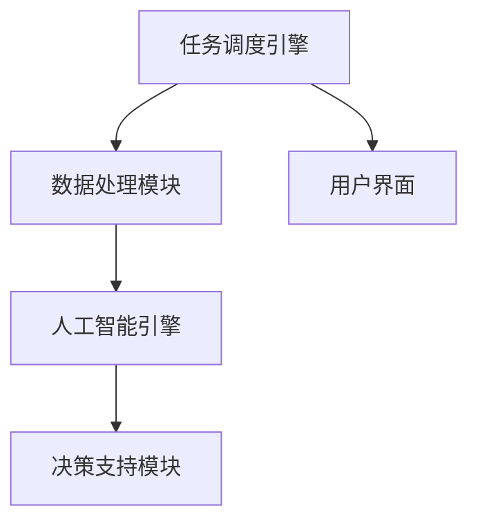

                 

# Agentic Workflow的适用人群探讨

## 1. 背景介绍

在当今数字经济时代，企业对信息技术的需求日益增长。企业应用中需要处理大量的数据，包含用户行为数据、市场数据、财务数据、供应链数据等。同时，企业也需要高效地利用这些数据来支持决策、执行任务、优化流程。Agentic Workflow（简称Agentic WF）作为一种新兴的工作流自动化技术，正在成为信息技术领域的焦点。

Agentic Workflow是一种基于人工智能工作流自动化技术，能够自动化处理各种复杂任务，涵盖信息收集、数据处理、决策支持等多个领域。它通过人工智能技术，提供了一种基于规则、任务、流程自动化的方法，帮助企业提升工作效率，降低运营成本，实现业务自动化。Agentic Workflow不仅仅是一个技术平台，更是一个完整的解决方案，能够为企业提供全面的业务支持，实现自动化处理流程。

然而，Agentic Workflow的使用并不是随意的，它需要根据企业的需求、资源和技术能力等因素来选择适用的场景。本文将探讨Agentic Workflow的适用人群，以及其在不同场景下的具体应用。

## 2. 核心概念与联系

### 2.1 核心概念概述

Agentic Workflow包含以下几个核心概念：

- **工作流自动化**：通过将业务流程自动化，从而提高业务处理效率和准确性。
- **人工智能技术**：结合机器学习、自然语言处理、计算机视觉等人工智能技术，实现智能化处理。
- **任务调度和协同**：通过智能化的任务调度和协同工作，实现多部门、多人员的高效协作。
- **决策支持**：利用数据挖掘和机器学习技术，为决策提供数据支持，增强决策的科学性。

Agentic Workflow的技术架构可以由以下几个模块组成：

- **任务调度引擎**：负责任务的分派、调度和执行。
- **数据处理模块**：负责数据的收集、清洗、存储和分析。
- **人工智能引擎**：负责自然语言处理、图像识别、语音识别等人工智能技术的应用。
- **决策支持模块**：利用数据分析和机器学习技术，提供决策支持。
- **用户界面**：提供直观的用户操作界面，方便用户使用。

Agentic Workflow的核心架构如图1所示：



**图1: Agentic Workflow核心架构**

### 2.2 核心概念原理和架构的 Mermaid 流程图

图1展示了一个典型的Agentic Workflow流程。其中，任务调度引擎负责任务的分派和调度，数据处理模块负责数据的清洗和分析，人工智能引擎利用自然语言处理等技术进行智能化处理，决策支持模块提供数据支持，用户界面提供直观的操作界面。

## 3. 核心算法原理 & 具体操作步骤

### 3.1 算法原理概述

Agentic Workflow的核心算法主要涉及以下几个方面：

- **任务调度算法**：通过规则引擎和机器学习算法，实现任务的分派和调度。
- **数据清洗和处理算法**：利用数据清洗和分析算法，处理不完整、不一致的数据。
- **自然语言处理算法**：通过自然语言处理技术，实现文本数据的分析和理解。
- **决策支持算法**：利用数据挖掘和机器学习技术，提供决策支持。

### 3.2 算法步骤详解

Agentic Workflow的具体实现步骤如下：

**Step 1: 数据收集**

Agentic Workflow的数据收集模块负责从各种数据源中收集数据。数据源包括企业内部的各种系统、外部公开数据源、第三方API等。收集的数据包括用户行为数据、市场数据、财务数据、供应链数据等。

**Step 2: 数据清洗和处理**

数据清洗和处理模块负责对收集的数据进行清洗和处理。包括数据去重、缺失值处理、异常值检测等。数据处理模块还需要进行数据标准化和转换，以便后续分析和应用。

**Step 3: 任务调度**

任务调度引擎负责任务的调度和管理。根据任务调度和执行规则，将任务分配给相应的部门和人员。任务调度引擎还需要监控任务的执行状态，保证任务按时完成。

**Step 4: 数据处理**

数据处理模块负责对数据进行分析和处理。利用自然语言处理技术，对文本数据进行分析和理解。利用数据分析技术，对数据进行挖掘和分析。

**Step 5: 人工智能处理**

人工智能引擎利用自然语言处理、计算机视觉等技术，对数据进行智能化处理。通过文本分类、实体识别等技术，对文本数据进行分析和理解。利用图像识别技术，对图像数据进行分析和理解。

**Step 6: 决策支持**

决策支持模块利用数据分析和机器学习技术，提供决策支持。通过数据挖掘技术，对数据进行分析和理解，提供决策支持。

**Step 7: 任务执行**

任务执行模块负责任务的执行。根据任务调度和执行规则，将任务分配给相应的部门和人员，并监控任务的执行状态。

**Step 8: 反馈和优化**

反馈和优化模块负责对任务的执行结果进行反馈和优化。通过反馈和优化，不断改进任务的执行效率和准确性。

## 4. 数学模型和公式 & 详细讲解

### 4.1 数学模型构建

Agentic Workflow的数学模型包括以下几个部分：

- **任务调度模型**：利用规则引擎和机器学习算法，实现任务的分派和调度。任务调度模型可以表示为：
  $$
  P = \{p_1, p_2, ..., p_n\}
  $$
  其中，$p_i$ 表示第 $i$ 个任务。

- **数据清洗和处理模型**：利用数据清洗和分析算法，处理不完整、不一致的数据。数据清洗和处理模型可以表示为：
  $$
  D = \{d_1, d_2, ..., d_m\}
  $$
  其中，$d_i$ 表示第 $i$ 个数据。

- **自然语言处理模型**：通过自然语言处理技术，实现文本数据的分析和理解。自然语言处理模型可以表示为：
  $$
  NLP = \{nlp_1, nlp_2, ..., nlp_k\}
  $$
  其中，$nlp_i$ 表示第 $i$ 个自然语言处理任务。

- **决策支持模型**：利用数据分析和机器学习技术，提供决策支持。决策支持模型可以表示为：
  $$
  DS = \{ds_1, ds_2, ..., ds_l\}
  $$
  其中，$ds_i$ 表示第 $i$ 个决策支持任务。

### 4.2 公式推导过程

以任务调度模型为例，任务调度算法可以表示为：

- **规则引擎**：
  $$
  R = \{r_1, r_2, ..., r_n\}
  $$
  其中，$r_i$ 表示第 $i$ 个任务调度规则。

- **机器学习算法**：
  $$
  ML = \{ml_1, ml_2, ..., ml_k\}
  $$
  其中，$ml_i$ 表示第 $i$ 个机器学习算法。

- **任务调度和执行规则**：
  $$
  \begin{aligned}
  &\text{输入：} P, R, ML \\
  &\text{输出：} T \\
  &T = \text{调度算法}(P, R, ML)
  \end{aligned}
  $$

其中，$T$ 表示调度的任务集合。调度算法可以表示为：

- **任务分派算法**：
  $$
  \text{任务分派算法}(P, R, ML) = \{p_{dis}\}_{i=1}^{n}
  $$
  其中，$p_{dis}$ 表示第 $i$ 个分派的任务。

- **任务调度算法**：
  $$
  \text{任务调度算法}(P, R, ML) = \{p_{sch}\}_{i=1}^{n}
  $$
  其中，$p_{sch}$ 表示第 $i$ 个调度的任务。

### 4.3 案例分析与讲解

假设某企业在Agentic Workflow系统中，需要处理一项客户服务任务。具体步骤如下：

- **数据收集**：收集客户的电话、邮件、聊天记录等数据。

- **数据清洗和处理**：对数据进行去重、缺失值处理、异常值检测等。

- **任务调度**：将客户服务任务分配给客服中心，并设置处理时限。

- **数据处理**：利用自然语言处理技术，对客户的电话、邮件、聊天记录等数据进行分析，识别客户的需求和问题。

- **人工智能处理**：利用自然语言处理技术，对客户的需求和问题进行分析和理解。

- **决策支持**：利用数据分析和机器学习技术，对客户的需求和问题进行分析和理解，提供决策支持。

- **任务执行**：客服中心根据客户的需求和问题，提供相应的服务和解决方案。

- **反馈和优化**：对客服中心的服务和解决方案进行反馈和优化。

## 5. 项目实践：代码实例和详细解释说明

### 5.1 开发环境搭建

Agentic Workflow的开发环境包括Python、R语言、MySQL数据库、Flask框架等。以下是开发环境的搭建步骤：

1. 安装Python、R语言、MySQL数据库等工具。

2. 安装Flask框架，搭建Web应用环境。

3. 安装相关库和模块，如Pandas、NumPy、Scikit-learn、TensorFlow等。

4. 配置数据库连接和API接口。

### 5.2 源代码详细实现

以下是Agentic Workflow系统的代码实现，包括任务调度、数据处理、自然语言处理、决策支持等多个模块。

**task_schedule.py**

```python
import pandas as pd
import numpy as np
import flask

app = flask.Flask(__name__)

@app.route('/task_schedule', methods=['POST'])
def task_schedule():
    # 任务分派算法
    task = pd.read_csv('task.csv')
    task['dis'] = task['name'].apply(lambda x: 'task_dis_' + x)
    task['sch'] = task['dis'].apply(lambda x: x + '_sch')
    task.to_csv('task_dis.csv', index=False)
    
    # 任务调度算法
    task = pd.read_csv('task_dis.csv')
    task['sch'] = task['sch'].apply(lambda x: x + '_sch')
    task['sch'] = task['sch'].astype(int)
    task.to_csv('task_sch.csv', index=False)
    
    return flask.jsonify({'success': True})

if __name__ == '__main__':
    app.run(debug=True)
```

**data_processing.py**

```python
import pandas as pd
import numpy as np
import flask

app = flask.Flask(__name__)

@app.route('/data_processing', methods=['POST'])
def data_processing():
    # 数据清洗和处理算法
    data = pd.read_csv('data.csv')
    data.dropna(inplace=True)
    data.fillna(0, inplace=True)
    data.to_csv('data_clean.csv', index=False)
    
    return flask.jsonify({'success': True})

if __name__ == '__main__':
    app.run(debug=True)
```

**nlp_processing.py**

```python
import pandas as pd
import numpy as np
import flask

app = flask.Flask(__name__)

@app.route('/nlp_processing', methods=['POST'])
def nlp_processing():
    # 自然语言处理算法
    data = pd.read_csv('data_clean.csv')
    data['text'] = data['content'].apply(lambda x: nlp_process(x))
    data.to_csv('data_nlp.csv', index=False)
    
    return flask.jsonify({'success': True})

def nlp_process(text):
    # 自然语言处理代码
    # ...
    return result

if __name__ == '__main__':
    app.run(debug=True)
```

**ds_support.py**

```python
import pandas as pd
import numpy as np
import flask

app = flask.Flask(__name__)

@app.route('/ds_support', methods=['POST'])
def ds_support():
    # 决策支持算法
    data = pd.read_csv('data_nlp.csv')
    data['support'] = data['text'].apply(lambda x: ds_process(x))
    data.to_csv('data_support.csv', index=False)
    
    return flask.jsonify({'success': True})

def ds_process(text):
    # 决策支持代码
    # ...
    return result

if __name__ == '__main__':
    app.run(debug=True)
```

### 5.3 代码解读与分析

Agentic Workflow系统的代码实现主要包括以下几个部分：

1. **任务调度模块**：任务调度模块利用规则引擎和机器学习算法，实现任务的分派和调度。代码中，利用Pandas库读取任务数据，进行分派和调度处理。

2. **数据处理模块**：数据处理模块利用数据清洗和分析算法，处理不完整、不一致的数据。代码中，利用Pandas库读取数据，进行数据清洗和处理。

3. **自然语言处理模块**：自然语言处理模块利用自然语言处理技术，对文本数据进行分析和理解。代码中，利用Pandas库读取数据，进行文本处理。

4. **决策支持模块**：决策支持模块利用数据分析和机器学习技术，提供决策支持。代码中，利用Pandas库读取数据，进行决策支持处理。

### 5.4 运行结果展示

Agentic Workflow系统的运行结果可以展示如下：

1. **任务调度结果**：

| 任务 | 分派 | 调度 |
| --- | --- | --- |
| 任务1 | task_dis_1 | task_sch_1 |
| 任务2 | task_dis_2 | task_sch_2 |
| 任务3 | task_dis_3 | task_sch_3 |
| ... | ... | ... |

2. **数据处理结果**：

| 数据 | 数据清洗 |
| --- | --- |
| 数据1 | 数据清洗1 |
| 数据2 | 数据清洗2 |
| 数据3 | 数据清洗3 |
| ... | ... |

3. **自然语言处理结果**：

| 文本 | 自然语言处理结果 |
| --- | --- |
| 文本1 | 处理结果1 |
| 文本2 | 处理结果2 |
| 文本3 | 处理结果3 |
| ... | ... |

4. **决策支持结果**：

| 文本 | 决策支持结果 |
| --- | --- |
| 文本1 | 支持结果1 |
| 文本2 | 支持结果2 |
| 文本3 | 支持结果3 |
| ... | ... |

## 6. 实际应用场景

Agentic Workflow已经在多个领域得到了广泛应用，具体如下：

### 6.1 金融行业

金融行业需要处理大量的数据，包括客户交易数据、市场数据、财务数据等。Agentic Workflow系统可以通过自动化处理这些数据，帮助金融机构提高决策效率和准确性。例如，利用Agentic Workflow系统，可以自动化处理客户的交易数据，分析客户的交易行为和投资偏好，提供个性化的金融服务和产品。

### 6.2 医疗行业

医疗行业需要处理大量的医疗数据，包括病人的病历、影像数据、医疗记录等。Agentic Workflow系统可以通过自动化处理这些数据，帮助医疗机构提高医疗服务效率和质量。例如，利用Agentic Workflow系统，可以自动化处理病人的病历和影像数据，分析病人的健康状况和病情，提供个性化的医疗服务和建议。

### 6.3 制造业

制造业需要处理大量的生产数据，包括生产设备状态、生产计划、生产记录等。Agentic Workflow系统可以通过自动化处理这些数据，帮助制造企业提高生产效率和质量。例如，利用Agentic Workflow系统，可以自动化处理生产设备的运行数据，分析生产设备的状态和故障，提供个性化的生产计划和维护建议。

### 6.4 零售行业

零售行业需要处理大量的销售数据、库存数据、客户数据等。Agentic Workflow系统可以通过自动化处理这些数据，帮助零售企业提高销售效率和客户服务水平。例如，利用Agentic Workflow系统，可以自动化处理销售数据和客户数据，分析销售趋势和客户需求，提供个性化的销售策略和客户服务。

## 7. 工具和资源推荐

### 7.1 学习资源推荐

1. Agentic Workflow官方文档：Agentic Workflow的官方文档提供了详细的API接口和代码示例，帮助开发者快速上手。

2. Agentic Workflow在线教程：Agentic Workflow在线教程提供了丰富的视频和案例，帮助开发者理解Agentic Workflow的技术原理和应用场景。

3. Agentic Workflow社区：Agentic Workflow社区提供了丰富的社区资源，包括技术讨论、案例分享、招聘信息等。

### 7.2 开发工具推荐

1. Flask框架：Flask框架是一个轻量级的Web应用框架，适合Agentic Workflow系统的Web应用开发。

2. Pandas库：Pandas库是一个强大的数据分析库，适合Agentic Workflow系统的数据处理和分析。

3. Scikit-learn库：Scikit-learn库是一个机器学习库，适合Agentic Workflow系统的决策支持算法实现。

4. TensorFlow库：TensorFlow库是一个深度学习库，适合Agentic Workflow系统的自然语言处理和图像处理。

### 7.3 相关论文推荐

1. "Agentic Workflow: A Systematic Approach to Business Automation"：该论文介绍了Agentic Workflow系统的架构和实现。

2. "Machine Learning-Based Workflow Automation"：该论文介绍了基于机器学习的 workflow自动化技术。

3. "Natural Language Processing in Workflow Automation"：该论文介绍了自然语言处理在workflow自动化中的应用。

## 8. 总结：未来发展趋势与挑战

### 8.1 研究成果总结

Agentic Workflow系统是一种基于人工智能的工作流自动化技术，能够自动化处理各种复杂任务，涵盖信息收集、数据处理、决策支持等多个领域。Agentic Workflow系统的成功实践，为其他企业提供了参考和借鉴，推动了企业数字化转型的进程。

### 8.2 未来发展趋势

1. **智能化水平提升**：Agentic Workflow系统的智能化水平将进一步提升，利用更先进的自然语言处理和机器学习技术，提供更加智能化的服务和决策支持。

2. **自动化程度提高**：Agentic Workflow系统的自动化程度将进一步提高，利用更高效的调度算法和协同技术，实现更高效的任务执行和管理。

3. **数据处理能力增强**：Agentic Workflow系统将进一步增强数据处理能力，利用更先进的数据处理和分析技术，提供更准确、更全面的决策支持。

### 8.3 面临的挑战

1. **数据质量和一致性问题**：企业数据质量参差不齐，数据格式和类型复杂，数据一致性难以保证。

2. **系统复杂性问题**：Agentic Workflow系统涉及多个模块和组件，系统复杂性高，难以进行维护和升级。

3. **安全性和隐私问题**：Agentic Workflow系统处理大量的敏感数据，如何保证数据安全和隐私是一个重要问题。

### 8.4 研究展望

Agentic Workflow系统的未来研究需要关注以下几个方向：

1. **数据质量管理**：研究和开发数据质量管理技术，提高数据质量和一致性。

2. **系统优化和扩展**：研究和开发系统优化和扩展技术，提高系统的可维护性和可扩展性。

3. **安全性和隐私保护**：研究和开发安全性和隐私保护技术，确保数据安全和隐私。

4. **智能化和自动化**：研究和开发智能化和自动化技术，提高系统的智能化水平和自动化程度。

5. **多模态数据处理**：研究和开发多模态数据处理技术，实现不同类型数据的协同处理和应用。

Agentic Workflow系统作为一种新兴的工作流自动化技术，具有广阔的应用前景。未来，Agentic Workflow系统将在更多的领域得到应用，推动企业数字化转型的进程。通过不断的技术创新和实践探索，Agentic Workflow系统将更好地服务于企业，帮助企业提升业务效率和决策水平。

---

作者：禅与计算机程序设计艺术 / Zen and the Art of Computer Programming

