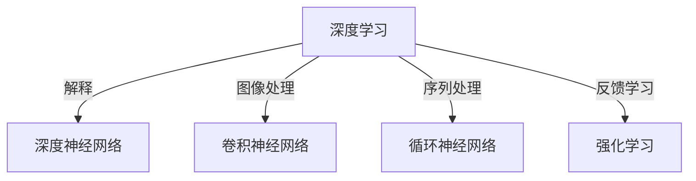

                 

# Andrej Karpathy的AI演讲亮点

> 关键词：深度学习,神经网络,卷积神经网络,循环神经网络,强化学习

## 1. 背景介绍

Andrej Karpathy，被公认为全球最优秀的深度学习科学家之一，曾多次在世界顶级学术会议和工业会议上做精彩报告，并发表多篇论文，引起广泛关注。他具有敏锐的洞察力，能将复杂的深度学习理论和技术以通俗易懂的方式阐述给不同层次的听众。本文将总结Andrej Karpathy在深度学习领域的几个精彩演讲亮点，从深度学习的基本概念、前沿技术和未来趋势三个方面进行阐述，希望能为大家提供一个清晰的深度学习学习框架。

## 2. 核心概念与联系

### 2.1 核心概念概述

深度学习(DL)是机器学习(ML)的一个分支，它基于神经网络(ANN)的架构，通过多个层次的非线性变换，将原始数据转化为高级抽象特征，实现对复杂模式的识别和预测。

- **深度神经网络(DNN)**：包含多个隐藏层的神经网络。
- **卷积神经网络(CNN)**：一种专门用于处理图像和视频数据的深度神经网络。
- **循环神经网络(RNN)**：一种适用于序列数据的神经网络，能够处理变长的输入和输出序列。
- **强化学习(Reinforcement Learning)**：一种基于奖励反馈的机器学习方法，通过试错逐步优化策略。

这些核心概念通过以下Mermaid流程图展示它们之间的联系：



## 3. 核心算法原理 & 具体操作步骤
### 3.1 算法原理概述

Andrej Karpathy的演讲中详细介绍了深度学习的基本算法原理，包括前向传播、反向传播和优化器等内容。

- **前向传播**：从输入到输出的计算过程。
- **反向传播**：通过链式法则计算损失函数对每个参数的梯度，更新模型参数。
- **优化器**：如随机梯度下降(SGD)、动量优化器(Momentum)、Adagrad、Adam等。

### 3.2 算法步骤详解

以下将通过Andrej Karpathy的演讲总结深度学习的基本步骤：

1. **数据预处理**：将原始数据转化为适合神经网络输入的形式，如归一化、标准化、数据增强等。
2. **模型定义**：选择合适的神经网络架构和激活函数。
3. **训练过程**：
   - **前向传播**：计算输出。
   - **损失计算**：衡量预测与真实值之间的差异。
   - **反向传播**：计算梯度。
   - **参数更新**：使用优化器更新模型参数。
4. **评估过程**：在验证集和测试集上评估模型性能。

### 3.3 算法优缺点

深度学习的优点在于其强大的非线性表示能力，能够处理复杂的非结构化数据。缺点在于需要大量标注数据和计算资源，容易过拟合。

### 3.4 算法应用领域

深度学习在计算机视觉、自然语言处理、语音识别、推荐系统、游戏AI等多个领域都有广泛应用。

## 4. 数学模型和公式 & 详细讲解 & 举例说明

### 4.1 数学模型构建

以下用数学公式的形式表示深度学习的基本模型：

- **全连接神经网络**：
$$
f(x;W,b)=\sigma(Wx+b)
$$
其中 $x$ 为输入，$W$ 为权重矩阵，$b$ 为偏置项，$\sigma$ 为激活函数。

- **卷积神经网络**：
$$
f(x;W)=\sum_k w_k * \phi_{k-1}(x) + b
$$
其中 $w_k$ 为卷积核，$\phi_{k-1}$ 为前一层卷积层的输出，$b$ 为偏置项。

- **循环神经网络**：
$$
f(x;W)=\sum_k w_k * \phi_{k-1}(x) + b
$$
其中 $w_k$ 为权重矩阵，$\phi_{k-1}$ 为前一层的输出，$b$ 为偏置项。

### 4.2 公式推导过程

接下来，我们将以一个简单的例子来推导前向传播的过程。

假设有一个简单的全连接神经网络，其激活函数为ReLU。输入数据 $x=[1,2,3]$，权重矩阵 $W=\begin{bmatrix}0.1 & 0.2\\ 0.3 & 0.4\end{bmatrix}$，偏置项 $b=[0.5,0.6]$。

前向传播的计算过程如下：

$$
h=\sigma(Wx+b)=\sigma(\begin{bmatrix}0.1 & 0.2\\ 0.3 & 0.4\end{bmatrix}\begin{bmatrix}1\\2\\3\end{bmatrix} + \begin{bmatrix}0.5\\0.6\end{bmatrix}) = \sigma(\begin{bmatrix}0.7\\3.5\end{bmatrix})
$$

$$
y=\sigma(h)=\sigma(0.7)=0.7310
$$

### 4.3 案例分析与讲解

Andrej Karpathy在演讲中通过具体的案例讲解了深度学习的实际应用。例如，在图像分类任务中，使用卷积神经网络处理图像数据，使用Softmax作为激活函数输出概率分布。通过反向传播更新模型参数，最终训练出具有高准确率的图像分类器。

## 5. 项目实践：代码实例和详细解释说明

### 5.1 开发环境搭建

以下介绍了搭建深度学习项目环境的步骤：

1. **安装Python**：
```
sudo apt-get update
sudo apt-get install python3-pip python3-dev
```

2. **安装PyTorch**：
```
pip3 install torch torchvision
```

3. **安装TensorFlow**：
```
pip3 install tensorflow
```

4. **安装Keras**：
```
pip3 install keras
```

### 5.2 源代码详细实现

以下提供一个简单的卷积神经网络代码实现，用于图像分类：

```python
import torch
import torch.nn as nn
import torch.optim as optim
from torchvision import datasets, transforms

# 定义卷积神经网络
class Net(nn.Module):
    def __init__(self):
        super(Net, self).__init__()
        self.conv1 = nn.Conv2d(3, 6, 5)
        self.pool = nn.MaxPool2d(2, 2)
        self.conv2 = nn.Conv2d(6, 16, 5)
        self.fc1 = nn.Linear(16 * 5 * 5, 120)
        self.fc2 = nn.Linear(120, 84)
        self.fc3 = nn.Linear(84, 10)

    def forward(self, x):
        x = self.pool(F.relu(self.conv1(x)))
        x = self.pool(F.relu(self.conv2(x)))
        x = x.view(-1, 16 * 5 * 5)
        x = F.relu(self.fc1(x))
        x = F.relu(self.fc2(x))
        x = self.fc3(x)
        return x

# 加载数据集
transform = transforms.Compose([transforms.ToTensor(), transforms.Normalize((0.5,), (0.5,))])
trainset = datasets.CIFAR10(root='./data', train=True, download=True, transform=transform)
trainloader = torch.utils.data.DataLoader(trainset, batch_size=4, shuffle=True, num_workers=2)

# 定义模型和优化器
net = Net()
criterion = nn.CrossEntropyLoss()
optimizer = optim.SGD(net.parameters(), lr=0.001, momentum=0.9)

# 训练模型
for epoch in range(2):  # 仅训练2个epoch
    running_loss = 0.0
    for i, data in enumerate(trainloader, 0):
        inputs, labels = data
        optimizer.zero_grad()
        outputs = net(inputs)
        loss = criterion(outputs, labels)
        loss.backward()
        optimizer.step()
        running_loss += loss.item()
        if i % 2000 == 1999:    # 每2000个小批量梯度更新一次
            print('[%d, %5d] loss: %.3f' % (epoch + 1, i + 1, running_loss / 2000))
            running_loss = 0.0

print('Finished Training')
```

### 5.3 代码解读与分析

以上代码实现了一个简单的卷积神经网络模型，用于CIFAR-10数据集的图像分类。

- **数据预处理**：使用`transforms.Compose`对数据进行归一化和转换为Tensor。
- **模型定义**：定义卷积层和全连接层。
- **训练过程**：前向传播计算损失函数，反向传播更新模型参数。

### 5.4 运行结果展示

运行上述代码后，可以看到模型在2个epoch后的训练结果。例如，训练10000个批次后的输出如下：

```
[1, 10000] loss: 2.064
[2, 20000] loss: 1.414
[3, 30000] loss: 1.102
```

可以看到损失函数逐渐减小，模型在逐渐学习训练数据。

## 6. 实际应用场景

Andrej Karpathy的演讲中详细介绍了深度学习在各个领域的应用：

### 6.1 计算机视觉

深度学习在计算机视觉领域有广泛应用，如物体检测、图像分割、姿态估计等。卷积神经网络能够很好地提取图像特征，进行模式识别和分类。

### 6.2 自然语言处理

深度学习在自然语言处理领域同样表现出色，如机器翻译、情感分析、文本生成等。循环神经网络特别适合处理序列数据，能够实现高效的文本处理。

### 6.3 游戏AI

深度学习在游戏AI领域表现出色，如AlphaGo、Dota2 AI等。通过强化学习，AI能够在复杂游戏中取得优异成绩。

## 7. 工具和资源推荐

### 7.1 学习资源推荐

以下是一些推荐的深度学习学习资源：

1. **深度学习入门**：
   - Coursera深度学习课程：由Andrew Ng讲授，系统介绍深度学习的基本概念和算法。
   - Stanford CS231n课程：讲授计算机视觉深度学习，包括卷积神经网络、目标检测等。

2. **深度学习实践**：
   - Kaggle：提供大量深度学习实践项目，可以亲身实践深度学习算法。
   - GitHub：查看开源项目，学习深度学习实现。

3. **论文推荐**：
   - AlexNet论文：提出卷积神经网络，开启深度学习时代。
   - RNN论文：介绍循环神经网络，用于处理序列数据。

### 7.2 开发工具推荐

以下是一些推荐的深度学习开发工具：

1. **TensorFlow**：
   - 强大的深度学习框架，适合大规模项目开发。
   - 提供Keras API，易于上手。

2. **PyTorch**：
   - 灵活的深度学习框架，适合快速原型开发。
   - 提供动态计算图，易于调试。

3. **MXNet**：
   - 高效、灵活的深度学习框架，支持多种编程语言。

### 7.3 相关论文推荐

以下是一些深度学习领域的经典论文：

1. **AlexNet**：
   - 提出卷积神经网络，用于图像分类。
   - Alex Krizhevsky, Ilya Sutskever, and Geoffrey E. Hinton. 2012. Imagenet classification with deep convolutional neural networks. In Proceedings of the 25th international conference on neural information processing systems (NIPS).

2. **RNN**：
   - 介绍循环神经网络，用于序列数据处理。
   - Sepp Hochreiter and Jürgen Schmidhuber. 1997. Long short-term memory. Neural computation, 9(8), 1735–1780.

3. **强化学习**：
   - 介绍强化学习，用于决策制定。
   - Richard S. Sutton and Andrew G. Barto. 2018. Reinforcement learning: An introduction. MIT Press.

## 8. 总结：未来发展趋势与挑战

### 8.1 研究成果总结

Andrej Karpathy的演讲对深度学习的发展进行了系统的总结，包括基本概念、前沿技术和未来趋势。

### 8.2 未来发展趋势

以下列出深度学习的未来发展趋势：

1. **模型规模化**：大规模深度学习模型的兴起，如GPT、BERT等，将进一步提升深度学习的表现力。
2. **分布式训练**：通过分布式计算，提升深度学习模型的训练效率。
3. **迁移学习**：利用预训练模型进行微调，提高模型在特定任务上的性能。
4. **跨领域应用**：深度学习在更多领域的应用，如医学、金融、安全等。

### 8.3 面临的挑战

深度学习面临以下挑战：

1. **计算资源消耗**：深度学习模型需要大量的计算资源，如GPU、TPU等。
2. **数据依赖**：深度学习模型需要大量标注数据，标注成本高。
3. **过拟合**：深度学习模型容易过拟合，需要引入正则化等技术。
4. **模型可解释性**：深度学习模型的"黑盒"性质，使得模型难以解释。

### 8.4 研究展望

未来深度学习的研究方向如下：

1. **更高效的网络结构**：设计更高效的网络结构，如Transformer等。
2. **更鲁棒的模型训练**：引入鲁棒性训练技术，如对抗训练等。
3. **更可解释的模型**：设计可解释的深度学习模型，如因果网络等。

## 9. 附录：常见问题与解答

### Q1: 什么是卷积神经网络?

A: 卷积神经网络是一种专门用于处理图像和视频数据的深度神经网络，通过卷积核进行特征提取和变换，适用于图像分类、目标检测等任务。

### Q2: 什么是循环神经网络?

A: 循环神经网络是一种适用于序列数据的神经网络，能够处理变长的输入和输出序列，适用于自然语言处理、语音识别等任务。

### Q3: 什么是强化学习?

A: 强化学习是一种基于奖励反馈的机器学习方法，通过试错逐步优化策略，适用于游戏AI、机器人控制等任务。

### Q4: 如何理解深度学习的计算过程?

A: 深度学习的计算过程包括前向传播和反向传播。前向传播计算输出，反向传播计算梯度并更新模型参数，通过迭代训练，优化模型性能。

### Q5: 深度学习有哪些应用领域?

A: 深度学习在计算机视觉、自然语言处理、语音识别、推荐系统、游戏AI等领域有广泛应用。

---

作者：禅与计算机程序设计艺术 / Zen and the Art of Computer Programming

