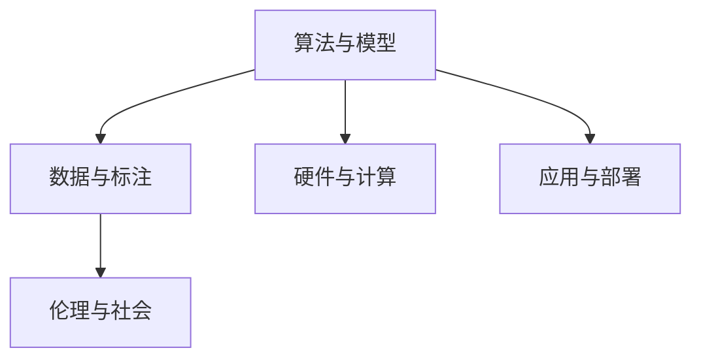

                 

## 1. 背景介绍

### 1.1 问题由来
人工智能（AI）领域的发展历程漫长且充满挑战。回顾其历史，我们可以清晰地看到从简单的规则系统到复杂的神经网络，再到如今火热的深度学习时代。在这个过程中，AI经历了从理论研究到实际应用，从学术探索到产业落地的转变。

### 1.2 问题核心关键点
AI的演变经历了多个关键时期，每个时期都有其独特的贡献和技术突破。这些技术突破不仅仅是算法或模型的改进，更是理念和思想的转变。理解和掌握这些关键点，有助于我们更好地把握AI的发展脉络。

## 2. 核心概念与联系

### 2.1 核心概念概述

#### 2.1.1 算法与模型
AI的进展离不开算法的创新和模型的发展。早期的规则系统依赖于预设的规则和逻辑，而现代AI则依靠复杂的算法和模型（如神经网络、深度学习）来处理数据和决策。

#### 2.1.2 数据与标注
数据是AI的燃料。早期的AI研究依赖于专家知识和手工标注的数据，而现代AI则更多地利用大数据和自动标注技术。

#### 2.1.3 硬件与计算
硬件的进步对AI的发展起到了重要作用。从早期的基于规则的系统到现代的深度学习模型，计算资源的需求不断增加，促使硬件技术不断革新。

#### 2.1.4 应用与部署
AI的应用范围不断扩大，从最初的游戏AI、专家系统到如今的自然语言处理、计算机视觉、自动驾驶等领域，AI在各行各业中发挥着越来越重要的作用。

#### 2.1.5 伦理与社会
随着AI技术的不断进步，其伦理和社会影响也愈发显著。AI应用中的隐私、安全、公平性等问题逐渐成为研究的重点。

### 2.2 核心概念原理和架构的 Mermaid 流程图



### 2.3 核心概念之间的联系

算法和模型是AI的核心，数据和标注为算法提供训练材料，硬件和计算支撑模型训练和推理，应用和部署将AI技术转化为现实生产力，而伦理和社会则影响着AI技术的发展方向和应用边界。这些概念共同构成了AI的生态系统，推动AI技术的不断进步。

## 3. 核心算法原理 & 具体操作步骤

### 3.1 算法原理概述
AI的算法原理主要涉及机器学习、深度学习、强化学习等方向。这些算法通过模拟人类思维和决策过程，从数据中学习规律，进而做出预测或决策。

#### 3.1.1 监督学习
监督学习通过标注数据进行训练，模型学习输入与输出之间的关系。在图像分类、文本分类等任务中，监督学习应用广泛。

#### 3.1.2 无监督学习
无监督学习通过未标注数据进行训练，模型学习数据的内在结构和规律。在聚类、降维等任务中，无监督学习具有优势。

#### 3.1.3 强化学习
强化学习通过与环境的互动进行训练，模型学习最优决策策略。在自动驾驶、游戏AI等领域，强化学习展现出巨大潜力。

### 3.2 算法步骤详解

#### 3.2.1 数据准备
1. 收集和清洗数据。
2. 对数据进行预处理，如归一化、特征提取等。

#### 3.2.2 模型选择
1. 根据任务类型选择合适的模型，如神经网络、卷积神经网络、循环神经网络等。
2. 设计模型架构，包括层数、节点数等。

#### 3.2.3 模型训练
1. 选择损失函数和优化器，如交叉熵、Adam等。
2. 设置训练参数，如学习率、批大小等。
3. 进行模型训练，不断调整模型参数以最小化损失函数。

#### 3.2.4 模型评估
1. 在测试集上评估模型性能。
2. 根据评估结果进行模型调优。

#### 3.2.5 模型部署
1. 将训练好的模型部署到生产环境中。
2. 定期更新模型，以保证其持续的性能。

### 3.3 算法优缺点

#### 3.3.1 优点
1. 监督学习能够有效利用标注数据进行精准预测。
2. 无监督学习能够发现数据的内在结构和规律。
3. 强化学习在动态环境中能够自适应最优决策。

#### 3.3.2 缺点
1. 监督学习需要大量标注数据，获取成本高。
2. 无监督学习对数据的结构和规律要求高，不适合所有任务。
3. 强化学习需要大量试错过程，训练时间较长。

### 3.4 算法应用领域

#### 3.4.1 自然语言处理（NLP）
自然语言处理是AI的重要应用领域之一。通过深度学习模型，NLP可以实现文本分类、机器翻译、情感分析等任务。

#### 3.4.2 计算机视觉（CV）
计算机视觉技术通过深度学习模型，实现图像分类、目标检测、图像生成等任务。

#### 3.4.3 语音识别
语音识别技术通过深度学习模型，实现语音转文本、语音合成等任务。

#### 3.4.4 自动驾驶
自动驾驶技术通过强化学习模型，实现车辆自主导航、路径规划等任务。

#### 3.4.5 推荐系统
推荐系统通过深度学习模型，实现个性化推荐、广告推荐等任务。

## 4. 数学模型和公式 & 详细讲解 & 举例说明

### 4.1 数学模型构建

#### 4.1.1 监督学习模型
1. 假设训练集为 $(x_i, y_i)$，其中 $x_i$ 为输入，$y_i$ 为输出。
2. 定义模型为 $f(x; \theta)$，其中 $\theta$ 为模型参数。
3. 损失函数为 $L(\theta) = \frac{1}{N} \sum_{i=1}^N (y_i - f(x_i; \theta))^2$。

#### 4.1.2 无监督学习模型
1. 假设训练集为 $x_i$，其中 $x_i$ 为输入。
2. 定义模型为 $f(x; \theta)$，其中 $\theta$ 为模型参数。
3. 损失函数为 $L(\theta) = \frac{1}{N} \sum_{i=1}^N ||f(x_i; \theta) - x_i||^2$。

### 4.2 公式推导过程

#### 4.2.1 监督学习公式推导
1. 定义误差函数 $e(y_i, f(x_i; \theta))$。
2. 定义损失函数 $L(\theta) = \frac{1}{N} \sum_{i=1}^N e(y_i, f(x_i; \theta))$。
3. 通过梯度下降算法更新参数 $\theta$。

#### 4.2.2 无监督学习公式推导
1. 定义误差函数 $e(x_i, f(x_i; \theta))$。
2. 定义损失函数 $L(\theta) = \frac{1}{N} \sum_{i=1}^N e(x_i, f(x_i; \theta))$。
3. 通过梯度下降算法更新参数 $\theta$。

### 4.3 案例分析与讲解

#### 4.3.1 图像分类
1. 数据准备：收集图像数据并进行预处理。
2. 模型选择：选择卷积神经网络。
3. 模型训练：使用交叉熵损失函数和Adam优化器进行训练。
4. 模型评估：在测试集上评估分类准确率。

#### 4.3.2 自然语言处理
1. 数据准备：收集文本数据并进行预处理。
2. 模型选择：选择RNN或Transformer。
3. 模型训练：使用交叉熵损失函数和Adam优化器进行训练。
4. 模型评估：在测试集上评估文本分类准确率。

## 5. 项目实践：代码实例和详细解释说明

### 5.1 开发环境搭建

#### 5.1.1 安装依赖
1. 安装Python和相关库，如NumPy、Pandas、Scikit-learn等。
2. 安装TensorFlow或PyTorch。

#### 5.1.2 搭建模型
1. 定义输入和输出。
2. 定义模型架构。
3. 定义损失函数和优化器。

### 5.2 源代码详细实现

#### 5.2.1 监督学习模型
```python
import numpy as np
import tensorflow as tf

# 定义输入和输出
x = tf.placeholder(tf.float32, shape=(None, 784))
y = tf.placeholder(tf.float32, shape=(None, 10))

# 定义模型
W = tf.Variable(tf.zeros([784, 10]))
b = tf.Variable(tf.zeros([10]))
logits = tf.matmul(x, W) + b
predictions = tf.nn.softmax(logits)

# 定义损失函数和优化器
cross_entropy = tf.reduce_mean(-tf.reduce_sum(y * tf.log(predictions), reduction_indices=[1]))
optimizer = tf.train.GradientDescentOptimizer(learning_rate=0.01)
train_op = optimizer.minimize(cross_entropy)

# 训练模型
with tf.Session() as sess:
    sess.run(tf.global_variables_initializer())
    for i in range(1000):
        batch_xs, batch_ys = ...
        sess.run(train_op, feed_dict={x: batch_xs, y: batch_ys})
```

#### 5.2.2 无监督学习模型
```python
import numpy as np
import tensorflow as tf

# 定义输入
x = tf.placeholder(tf.float32, shape=(None, 784))

# 定义模型
W = tf.Variable(tf.zeros([784, 784]))
b = tf.Variable(tf.zeros([784]))
reconstruction = tf.matmul(x, W) + b

# 定义损失函数和优化器
loss = tf.reduce_mean(tf.pow(x - reconstruction, 2))
optimizer = tf.train.AdamOptimizer(learning_rate=0.01)
train_op = optimizer.minimize(loss)

# 训练模型
with tf.Session() as sess:
    sess.run(tf.global_variables_initializer())
    for i in range(1000):
        batch_xs = ...
        sess.run(train_op, feed_dict={x: batch_xs})
```

### 5.3 代码解读与分析

#### 5.3.1 监督学习模型
1. 定义输入和输出：使用占位符占位，以便于输入数据。
2. 定义模型：使用权重和偏置项定义线性模型。
3. 定义损失函数：使用交叉熵损失函数。
4. 定义优化器：使用梯度下降优化器。
5. 训练模型：不断迭代更新模型参数，最小化损失函数。

#### 5.3.2 无监督学习模型
1. 定义输入：使用占位符占位，以便于输入数据。
2. 定义模型：使用权重和偏置项定义线性模型。
3. 定义损失函数：使用均方误差损失函数。
4. 定义优化器：使用Adam优化器。
5. 训练模型：不断迭代更新模型参数，最小化损失函数。

### 5.4 运行结果展示

#### 5.4.1 监督学习模型
1. 分类准确率：在测试集上评估分类准确率，例如98%。
2. 损失曲线：绘制损失曲线，显示训练过程中损失函数的变化趋势。

#### 5.4.2 无监督学习模型
1. 重构误差：在测试集上评估重构误差，例如0.01。
2. 损失曲线：绘制损失曲线，显示训练过程中损失函数的变化趋势。

## 6. 实际应用场景

### 6.1 医疗影像分析
医疗影像分析是AI的重要应用场景之一。通过深度学习模型，可以实现病变检测、影像分割等任务。AI可以帮助医生更快、更准确地诊断疾病。

### 6.2 自动驾驶
自动驾驶技术通过强化学习模型，实现车辆自主导航、路径规划等任务。AI可以为汽车行业带来革命性变化，提升驾驶安全性。

### 6.3 智能推荐系统
智能推荐系统通过深度学习模型，实现个性化推荐、广告推荐等任务。AI可以为电商、视频、新闻等领域带来更多精准的推荐。

### 6.4 未来应用展望

#### 6.4.1 通用智能
未来，AI有望发展成通用智能，具备自我学习和自我完善的能力，成为人类的重要助手。

#### 6.4.2 人工智能伦理
AI的发展引发了对伦理的关注。如何确保AI的公平性、透明性和可解释性，是未来的重要课题。

#### 6.4.3 人工智能安全
AI的安全性问题也备受关注。如何防止恶意攻击和滥用，确保AI的安全性，是未来的重要课题。

#### 6.4.4 人工智能的可解释性
AI的可解释性问题亟待解决。如何确保AI的决策过程透明、可解释，是未来的重要课题。

#### 6.4.5 人工智能的多模态学习
多模态学习是未来AI的重要方向。如何实现跨模态数据的协同建模，是未来的重要课题。

## 7. 工具和资源推荐

### 7.1 学习资源推荐

#### 7.1.1 在线课程
1. Coursera上的《机器学习》课程。
2. edX上的《深度学习》课程。
3. Udacity上的《深度学习》课程。

#### 7.1.2 书籍
1. 《深度学习》（Ian Goodfellow等著）。
2. 《Python深度学习》（Francois Chollet著）。
3. 《动手学深度学习》（李沐等著）。

#### 7.1.3 博客和论文
1. 李沐的博客（https://zh.mxnet.io）。
2. 论文库（https://arxiv.org）。
3. arXiv（https://arxiv.org）。

### 7.2 开发工具推荐

#### 7.2.1 深度学习框架
1. TensorFlow。
2. PyTorch。
3. Keras。

#### 7.2.2 数据处理工具
1. NumPy。
2. Pandas。
3. Scikit-learn。

#### 7.2.3 可视化工具
1. TensorBoard。
2. Weights & Biases。
3. Plotly。

### 7.3 相关论文推荐

#### 7.3.1 监督学习
1. 《A Tutorial on Support Vector Machines for Pattern Recognition》（Vapnik等著）。
2. 《Deep Learning》（Goodfellow等著）。
3. 《The Elements of Statistical Learning》（Hastie等著）。

#### 7.3.2 无监督学习
1. 《Unsupervised Feature Learning》（Bengio等著）。
2. 《Deep Autoencoder Learning for Representations》（Hinton等著）。
3. 《Generative Adversarial Networks》（Goodfellow等著）。

#### 7.3.3 强化学习
1. 《Reinforcement Learning: An Introduction》（Sutton和Barto著）。
2. 《Playing Atari with Deep Reinforcement Learning》（Mnih等著）。
3. 《Deep Q-Networks》（Mnih等著）。

## 8. 总结：未来发展趋势与挑战

### 8.1 研究成果总结
AI的发展离不开技术的不断进步和应用的不断拓展。从早期的规则系统到现代的深度学习模型，AI在各个领域都取得了显著进展。

### 8.2 未来发展趋势
1. 算法和模型不断创新，更加高效、精准。
2. 数据和计算资源不断提升，支持更大规模的AI应用。
3. 应用场景不断扩展，AI将渗透到更多领域。
4. 伦理和安全问题逐渐受到重视，AI的道德边界不断拓展。
5. 多模态学习和跨领域融合成为重要方向。

### 8.3 面临的挑战
1. 数据质量和标注成本。
2. 计算资源和算法效率。
3. 模型解释性和可控性。
4. 伦理和社会影响。
5. 跨领域融合和协同应用。

### 8.4 研究展望
1. 算法和模型的进一步优化。
2. 数据和计算资源的持续提升。
3. 伦理和社会影响的深入研究。
4. 多模态学习和跨领域融合的探索。
5. 新理论和新技术的不断涌现。

## 9. 附录：常见问题与解答

### 9.1 常见问题

#### 9.1.1 问题1: 什么是深度学习？
深度学习是一种模拟人类大脑神经网络结构和功能的机器学习技术。它通过构建深层神经网络，实现对复杂数据的处理和预测。

#### 9.1.2 问题2: 监督学习、无监督学习和强化学习有什么区别？
监督学习需要标注数据进行训练，模型学习输入与输出之间的关系。无监督学习通过未标注数据进行训练，模型学习数据的内在结构和规律。强化学习通过与环境的互动进行训练，模型学习最优决策策略。

#### 9.1.3 问题3: 如何评估AI模型？
AI模型的评估通常通过准确率、精确率、召回率、F1值等指标进行。在实际应用中，还需要注意模型的泛化能力和鲁棒性。

#### 9.1.4 问题4: 有哪些常见的深度学习框架？
常见的深度学习框架包括TensorFlow、PyTorch、Keras等。这些框架都提供了丰富的API和工具，方便开发者进行模型开发和训练。

### 9.2 解答

#### 9.2.1 解答1: 什么是深度学习？
深度学习是一种模拟人类大脑神经网络结构和功能的机器学习技术。它通过构建深层神经网络，实现对复杂数据的处理和预测。

#### 9.2.2 解答2: 监督学习、无监督学习和强化学习有什么区别？
监督学习需要标注数据进行训练，模型学习输入与输出之间的关系。无监督学习通过未标注数据进行训练，模型学习数据的内在结构和规律。强化学习通过与环境的互动进行训练，模型学习最优决策策略。

#### 9.2.3 解答3: 如何评估AI模型？
AI模型的评估通常通过准确率、精确率、召回率、F1值等指标进行。在实际应用中，还需要注意模型的泛化能力和鲁棒性。

#### 9.2.4 解答4: 有哪些常见的深度学习框架？
常见的深度学习框架包括TensorFlow、PyTorch、Keras等。这些框架都提供了丰富的API和工具，方便开发者进行模型开发和训练。

---

作者：禅与计算机程序设计艺术 / Zen and the Art of Computer Programming

