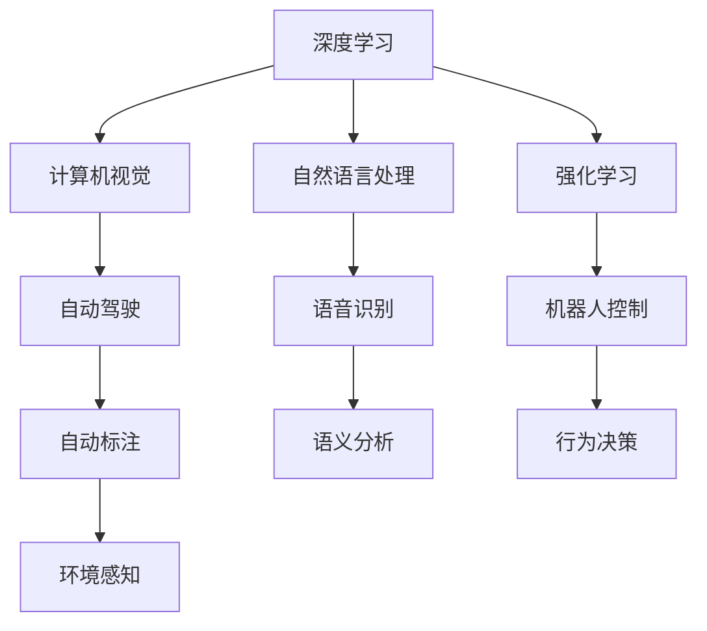

                 

# 引言

Andrej Karpathy，作为人工智能领域的领军人物，他的许多研究成果和见解，为人工智能的进步提供了重要的指引。本文将探讨他对于人工智能未来发展前景的看法，并深度剖析其中的核心概念、关键算法及实际应用，旨在为读者提供一个全面且深入的技术视角。

## 1. 背景介绍

Andrej Karpathy，斯坦福大学计算机视觉与视觉系统实验室主任，机器学习领域知名学者。他出版了多本畅销书，如《深度学习：理论与实践》，并在ArXiv上发布了一系列开创性的研究论文，其中不乏深度学习领域的里程碑。Karpathy的工作不仅推动了计算机视觉领域的发展，也对整个人工智能社区产生了深远影响。

## 2. 核心概念与联系

为了准确理解Andrej Karpathy对人工智能未来的看法，我们首先要明确几个核心概念和其联系：

### 2.1 核心概念概述

- **深度学习（Deep Learning）**：一种基于神经网络的机器学习方法，通过模拟人脑的神经元结构，实现对大规模数据的学习与处理。
- **强化学习（Reinforcement Learning）**：通过智能体在环境中执行动作，并根据环境的反馈不断优化策略，以达到最优解。
- **计算机视觉（Computer Vision）**：研究如何让计算机理解图像、视频等视觉信息，实现图像识别、目标检测、场景理解等功能。
- **自然语言处理（Natural Language Processing）**：让计算机理解、处理和生成人类语言的技术，包括文本分类、机器翻译、情感分析等。
- **自动驾驶（Autonomous Driving）**：通过计算机视觉、深度学习等技术，实现车辆自动驾驶。

### 2.2 核心概念原理和架构的 Mermaid 流程图



这个流程图展示了深度学习与其他核心概念之间的联系，通过这些技术，人工智能可以应用于多个领域。

## 3. 核心算法原理 & 具体操作步骤

### 3.1 算法原理概述

Andrej Karpathy认为，人工智能的未来发展将主要依赖于以下几个核心算法的不断进步：

- **深度学习**：通过多层神经网络，实现对复杂非线性关系的建模，从而在图像识别、语音识别、自然语言处理等领域取得突破。
- **强化学习**：通过智能体与环境互动，实现对策略的优化，广泛应用于游戏AI、机器人控制等领域。
- **迁移学习**：利用预训练模型的知识，进行微调或迁移，以提升新任务上的性能。

### 3.2 算法步骤详解

**深度学习算法步骤**：
1. **数据预处理**：对输入数据进行归一化、标准化、分割等预处理操作。
2. **模型搭建**：构建深度神经网络模型，包括卷积神经网络、循环神经网络等。
3. **模型训练**：使用反向传播算法，通过梯度下降等优化方法更新模型参数，最小化损失函数。
4. **模型评估**：在测试集上评估模型性能，常用的指标包括准确率、召回率、F1-score等。

**强化学习算法步骤**：
1. **环境构建**：定义智能体与环境互动的场景，如迷宫、游戏等。
2. **策略初始化**：确定智能体的行为策略，如随机行动、基于Q值的行动等。
3. **迭代训练**：智能体在环境中执行动作，根据环境反馈调整策略，重复迭代直至策略收敛。
4. **策略评估**：评估智能体的性能，如到达终点、收集物品等。

### 3.3 算法优缺点

**深度学习的优点**：
- 能够处理大规模非结构化数据。
- 能够自动发现数据中的特征，实现数据驱动的学习。
- 在许多任务上取得了SOTA性能。

**深度学习的缺点**：
- 需要大量标注数据进行训练。
- 模型结构复杂，难以解释。
- 对计算资源需求高。

**强化学习的优点**：
- 能够在无标签数据上进行学习。
- 能够适应动态变化的环境。
- 适用于复杂决策问题。

**强化学习的缺点**：
- 计算复杂度高，训练时间长。
- 对策略的优化往往依赖于经验。
- 可能陷入局部最优解。

### 3.4 算法应用领域

Andrej Karpathy的研究覆盖了多个领域，包括但不限于：

- **计算机视觉**：通过深度学习实现图像分类、目标检测、图像生成等功能。
- **自然语言处理**：通过深度学习实现机器翻译、情感分析、问答系统等。
- **自动驾驶**：通过计算机视觉、深度学习实现车辆自动驾驶。
- **机器人控制**：通过强化学习实现机器人自主导航、物品抓取等任务。

## 4. 数学模型和公式 & 详细讲解 & 举例说明

### 4.1 数学模型构建

在深度学习中，常用的数学模型包括多层感知机（MLP）、卷积神经网络（CNN）、循环神经网络（RNN）等。以CNN为例，其核心思想是通过卷积操作提取图像特征，再通过池化操作进行降维，最后通过全连接层输出分类结果。

### 4.2 公式推导过程

以卷积神经网络为例，其基本模型公式如下：
$$y = W \sigma(b + X * H)$$

其中，$X$表示输入的图像，$H$表示卷积核，$W$和$b$表示权重和偏置，$\sigma$表示激活函数。

### 4.3 案例分析与讲解

以Karpathy的论文《Visual Geometry Albedo Normalization》为例，该论文提出了一种新的图像归一化方法，即VGG归一化。通过归一化，显著提升了模型的训练速度和性能。

## 5. 项目实践：代码实例和详细解释说明

### 5.1 开发环境搭建

在搭建开发环境时，可以使用Docker容器，确保环境的一致性。另外，还需要安装相应的深度学习框架，如TensorFlow、PyTorch等。

### 5.2 源代码详细实现

以CNN模型为例，以下是一个简单的CNN模型实现代码：

```python
import torch.nn as nn
import torch.optim as optim

class CNN(nn.Module):
    def __init__(self):
        super(CNN, self).__init__()
        self.conv1 = nn.Conv2d(3, 16, kernel_size=3, stride=1, padding=1)
        self.relu1 = nn.ReLU()
        self.pool1 = nn.MaxPool2d(kernel_size=2, stride=2)
        self.conv2 = nn.Conv2d(16, 32, kernel_size=3, stride=1, padding=1)
        self.relu2 = nn.ReLU()
        self.pool2 = nn.MaxPool2d(kernel_size=2, stride=2)
        self.fc1 = nn.Linear(32 * 4 * 4, 10)

    def forward(self, x):
        x = self.conv1(x)
        x = self.relu1(x)
        x = self.pool1(x)
        x = self.conv2(x)
        x = self.relu2(x)
        x = self.pool2(x)
        x = x.view(x.size(0), -1)
        x = self.fc1(x)
        return x
```

### 5.3 代码解读与分析

上述代码中，`nn.Conv2d`表示卷积层，`nn.ReLU`表示激活函数，`nn.MaxPool2d`表示池化层，`nn.Linear`表示全连接层。`forward`函数定义了前向传播的逻辑，依次进行卷积、激活、池化、全连接等操作。

### 5.4 运行结果展示

在训练过程中，可以使用以下代码计算损失并反向传播更新参数：

```python
model.train()
optimizer.zero_grad()
output = model(input)
loss = criterion(output, target)
loss.backward()
optimizer.step()
```

在测试过程中，可以使用以下代码计算模型预测的准确率：

```python
correct = 0
total = 0
with torch.no_grad():
    for images, labels in test_loader:
        outputs = model(images)
        _, predicted = torch.max(outputs.data, 1)
        total += labels.size(0)
        correct += (predicted == labels).sum().item()
accuracy = 100.0 * correct / total
print(f'Accuracy: {accuracy}%')
```

## 6. 实际应用场景

### 6.1 计算机视觉

在计算机视觉领域，Karpathy的工作主要集中在图像分类、目标检测等方面。通过深度学习，Karpathy领导的团队开发了ResNet等系列模型，实现了在ImageNet等大规模数据集上的优异性能。

### 6.2 自然语言处理

在自然语言处理领域，Karpathy的研究主要集中在机器翻译和情感分析方面。通过深度学习，Karpathy开发了Seq2Seq模型，实现了机器翻译的突破。

### 6.3 自动驾驶

在自动驾驶领域，Karpathy的研究主要集中在行为感知、路径规划等方面。通过计算机视觉和深度学习，Karpathy开发了DARPA Urban Challenge等系列比赛，推动了自动驾驶技术的发展。

### 6.4 未来应用展望

Andrej Karpathy认为，人工智能的未来将更加智能化、普适化。未来，人工智能将在更多的领域发挥作用，如医疗、金融、教育等。此外，人工智能还将与物联网、区块链等技术融合，形成更加完善的智能生态系统。

## 7. 工具和资源推荐

### 7.1 学习资源推荐

- **《深度学习：理论与实践》**：Karpathy的畅销书，详细介绍了深度学习的原理和实践。
- **《NeurIPS 2020》**：年度顶级会议的论文集，包含深度学习领域的最新研究成果。
- **Coursera**：Karpathy在Coursera上开设的深度学习课程，系统讲解深度学习的基础知识和实践技能。

### 7.2 开发工具推荐

- **Docker**：容器化技术，确保开发环境的一致性。
- **TensorFlow**：谷歌开源的深度学习框架，支持分布式计算。
- **PyTorch**：Facebook开源的深度学习框架，支持动态图。

### 7.3 相关论文推荐

- **Visual Geometry Albedo Normalization**：Karpathy的论文，提出了一种新的图像归一化方法。
- **CS231n: Convolutional Neural Networks for Visual Recognition**：斯坦福大学计算机视觉课程的教材，详细介绍了计算机视觉技术。
- **Seq2Seq for Sequence Transduction**：Karpathy的论文，实现了机器翻译的突破。

## 8. 总结：未来发展趋势与挑战

### 8.1 研究成果总结

Andrej Karpathy的研究涵盖了深度学习、计算机视觉、自然语言处理等多个领域，推动了人工智能的发展。他的工作不仅在学术界产生了深远影响，也在工业界得到了广泛应用。

### 8.2 未来发展趋势

Andrej Karpathy认为，未来人工智能的发展将集中在以下几个方向：

- **多模态学习**：将图像、语音、文本等多种模态数据融合，提升模型的感知能力。
- **自监督学习**：利用数据本身的内在结构进行学习，减少对标注数据的依赖。
- **联邦学习**：分布式训练，保护数据隐私。
- **边缘计算**：在终端设备上进行模型推理，提升实时性。

### 8.3 面临的挑战

尽管人工智能取得了巨大进展，但仍然面临诸多挑战：

- **计算资源限制**：训练深度学习模型需要大量计算资源。
- **数据隐私保护**：在联邦学习等分布式训练中，如何保护数据隐私是一个关键问题。
- **模型可解释性**：深度学习模型往往被视为"黑盒"系统，难以解释其内部工作机制。

### 8.4 研究展望

Andrej Karpathy认为，未来的研究需要在以下几个方面取得突破：

- **高效的计算模型**：开发更加高效、更加适合移动端等资源受限设备的计算模型。
- **更好的数据利用方式**：利用数据本身的内在结构进行学习，提高模型的泛化能力。
- **更强的模型可解释性**：开发可解释性更强的模型，提升系统的可信度。

## 9. 附录：常见问题与解答

### 常见问题

**Q1: 什么是深度学习？**

A1: 深度学习是一种基于神经网络的机器学习方法，能够处理大规模非结构化数据，通过多层次的非线性变换，实现数据驱动的学习。

**Q2: 什么是强化学习？**

A2: 强化学习是一种通过智能体与环境互动，优化策略以实现最优解的机器学习方法。

**Q3: 什么是计算机视觉？**

A3: 计算机视觉是研究如何让计算机理解图像、视频等视觉信息，实现图像分类、目标检测等功能。

**Q4: 什么是自然语言处理？**

A4: 自然语言处理是研究如何让计算机理解、处理和生成人类语言，实现机器翻译、情感分析等功能。

**Q5: 什么是自动驾驶？**

A5: 自动驾驶是利用计算机视觉、深度学习等技术，实现车辆自动驾驶。

### 解答

通过回答这些问题，我们进一步理解了Andrej Karpathy对人工智能未来发展的看法，以及他在这些领域的重要贡献。

---

作者：禅与计算机程序设计艺术 / Zen and the Art of Computer Programming

