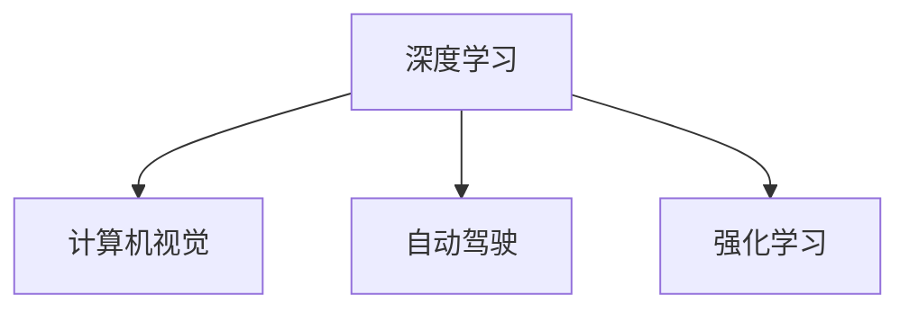

                 

# Andrej Karpathy：人工智能的未来发展前景

人工智能（AI）正以惊人的速度变革各个行业，从医疗到金融，从制造业到教育，其影响力无所不在。作为人工智能领域的先驱之一，Andrej Karpathy的见解深刻而前瞻，为我们描绘了AI未来的发展趋势和潜在挑战。本文将深入探讨Andrej Karpathy对AI未来的看法，以及他对人工智能未来的发展前景的预测。

## 1. 背景介绍

Andrej Karpathy是斯坦福大学计算机科学系教授，同时也是OpenAI的研究员，以其在深度学习、计算机视觉和自动驾驶等领域的杰出贡献而闻名。他的工作不仅推动了学术研究，也为工业界带来了重要的技术进步。在本文中，我们将通过Andrej Karpathy的研究和观点，探讨人工智能未来的发展方向和应用前景。

## 2. 核心概念与联系

### 2.1 核心概念概述

Andrej Karpathy的研究工作主要集中在以下几个核心概念：

- **深度学习（Deep Learning）**：一种基于多层神经网络的机器学习方法，通过大量数据和强大的计算资源，实现对复杂模式的自动学习。
- **计算机视觉（Computer Vision）**：使计算机能够理解和解释图像和视频中的视觉内容，从而实现图像识别、目标检测、图像生成等任务。
- **自动驾驶（Autonomous Driving）**：通过AI技术，使车辆能够在没有人类干预的情况下，自主导航并做出决策。
- **强化学习（Reinforcement Learning）**：一种通过与环境交互，不断调整策略以最大化奖励的机器学习方法。

这些核心概念通过合法的技术和算法实现，并且构成了人工智能技术的基石。

### 2.2 核心概念原理和架构的 Mermaid 流程图



上述流程图展示了这些核心概念之间的联系。深度学习提供了强大的计算能力，使得计算机视觉和自动驾驶等任务成为可能。而强化学习则为这些任务提供了模型训练和决策优化的手段。

## 3. 核心算法原理 & 具体操作步骤

### 3.1 算法原理概述

Andrej Karpathy的研究工作主要集中在以下几个关键算法和原理：

- **卷积神经网络（Convolutional Neural Networks, CNNs）**：用于处理图像和视频数据的深度学习模型。
- **残差网络（Residual Networks, ResNets）**：通过引入残差连接，解决了深度神经网络的梯度消失问题，使得更深的神经网络成为可能。
- **生成对抗网络（Generative Adversarial Networks, GANs）**：通过对抗训练，生成具有高度逼真度的图像和视频。
- **强化学习算法**：如深度Q网络（Deep Q Networks, DQNs），通过与环境交互，实现自主决策和学习。

### 3.2 算法步骤详解

Andrej Karpathy的研究中，算法步骤通常包括以下几个关键环节：

1. **数据收集**：收集大量的标注数据，用于训练和验证深度学习模型。
2. **模型设计**：选择或设计适合任务的神经网络结构，并设定相应的超参数。
3. **模型训练**：使用收集的数据，通过反向传播算法优化模型参数。
4. **模型评估**：在验证集上评估模型的性能，调整超参数以提升效果。
5. **模型部署**：将训练好的模型应用于实际问题，进行实时预测或决策。

### 3.3 算法优缺点

Andrej Karpathy的研究工作中，深度学习模型的优点包括：

- **强大的表达能力**：能够处理复杂的非线性关系，适用于多种任务。
- **端到端的训练**：能够自动学习输入和输出之间的映射关系，减少人工干预。
- **可解释性强**：通过可视化技术，可以理解模型的内部工作机制。

然而，深度学习模型也存在一些缺点：

- **数据依赖性高**：需要大量高质量的标注数据进行训练。
- **计算资源消耗大**：模型参数量和计算复杂度较高，对硬件要求高。
- **泛化能力有限**：在训练数据集之外的表现可能不佳。

### 3.4 算法应用领域

Andrej Karpathy的研究成果已经在以下几个领域得到了广泛应用：

- **医学影像分析**：利用计算机视觉技术，自动检测和分析医学影像，辅助医生诊断。
- **自动驾驶技术**：通过深度学习和强化学习算法，实现车辆的自主导航和安全决策。
- **自然语言处理（NLP）**：使用深度学习模型，实现文本分类、情感分析、机器翻译等任务。
- **视频分析**：通过卷积神经网络，实现视频内容的自动标注和理解。

## 4. 数学模型和公式 & 详细讲解 & 举例说明

### 4.1 数学模型构建

Andrej Karpathy的研究中，常常使用以下数学模型：

- **卷积神经网络（CNNs）**：卷积层和池化层的数学模型，以及如何通过多层堆叠构建卷积神经网络。
- **残差网络（ResNets）**：残差块的数学模型，以及如何通过残差连接实现梯度传递。
- **生成对抗网络（GANs）**：生成器和判别器的数学模型，以及如何通过对抗训练生成逼真图像。

### 4.2 公式推导过程

以下是一个简单的卷积神经网络的数学模型推导过程：

假设输入图像为 $x$，卷积核为 $w$，卷积操作可以表示为：

$$y = \sigma(\sum_{i=1}^{n} w_i * x_i)$$

其中 $\sigma$ 为激活函数，$*$ 为卷积运算符。

### 4.3 案例分析与讲解

以Andrej Karpathy在医学影像分析领域的研究为例：

在医学影像分析中，卷积神经网络被用于自动检测和分类癌症。模型输入为医学影像，输出为癌症的分类结果。训练过程中，使用标注好的影像数据，通过反向传播算法优化模型参数，最终在测试集上评估模型性能。

## 5. 项目实践：代码实例和详细解释说明

### 5.1 开发环境搭建

要搭建Andrej Karpathy的研究环境，需要以下步骤：

1. 安装Python和PyTorch：
```bash
pip install torch torchvision
```

2. 安装其他必要的库：
```bash
pip install numpy scipy matplotlib pandas
```

3. 安装GPU驱动程序和CUDA库：
```bash
pip install torchvision torchtext
```

### 5.2 源代码详细实现

以下是一个简单的卷积神经网络的代码实现：

```python
import torch
import torch.nn as nn
import torchvision.transforms as transforms
from torchvision.datasets import CIFAR10
from torch.utils.data import DataLoader

# 定义卷积神经网络
class CNN(nn.Module):
    def __init__(self):
        super(CNN, self).__init__()
        self.conv1 = nn.Conv2d(3, 32, kernel_size=3, stride=1, padding=1)
        self.relu1 = nn.ReLU()
        self.pool1 = nn.MaxPool2d(kernel_size=2, stride=2)
        self.conv2 = nn.Conv2d(32, 64, kernel_size=3, stride=1, padding=1)
        self.relu2 = nn.ReLU()
        self.pool2 = nn.MaxPool2d(kernel_size=2, stride=2)
        self.fc1 = nn.Linear(64 * 8 * 8, 1024)
        self.relu3 = nn.ReLU()
        self.fc2 = nn.Linear(1024, 10)
        self.softmax = nn.Softmax(dim=1)

    def forward(self, x):
        x = self.conv1(x)
        x = self.relu1(x)
        x = self.pool1(x)
        x = self.conv2(x)
        x = self.relu2(x)
        x = self.pool2(x)
        x = x.view(-1, 64 * 8 * 8)
        x = self.fc1(x)
        x = self.relu3(x)
        x = self.fc2(x)
        x = self.softmax(x)
        return x

# 加载CIFAR-10数据集
transform = transforms.Compose([
    transforms.ToTensor(),
    transforms.Normalize((0.5, 0.5, 0.5), (0.5, 0.5, 0.5))
])
trainset = CIFAR10(root='./data', train=True, download=True, transform=transform)
trainloader = DataLoader(trainset, batch_size=64, shuffle=True)
testset = CIFAR10(root='./data', train=False, download=True, transform=transform)
testloader = DataLoader(testset, batch_size=64, shuffle=False)

# 训练模型
model = CNN()
criterion = nn.CrossEntropyLoss()
optimizer = torch.optim.SGD(model.parameters(), lr=0.01)
for epoch in range(10):
    running_loss = 0.0
    for i, data in enumerate(trainloader, 0):
        inputs, labels = data
        optimizer.zero_grad()
        outputs = model(inputs)
        loss = criterion(outputs, labels)
        loss.backward()
        optimizer.step()
        running_loss += loss.item()
        if i % 100 == 99:
            print('[%d, %5d] loss: %.3f' %
                  (epoch + 1, i + 1, running_loss / 100))
            running_loss = 0.0
print('Finished Training')
```

### 5.3 代码解读与分析

在上述代码中，我们定义了一个简单的卷积神经网络，并使用CIFAR-10数据集进行训练。模型由两个卷积层、两个池化层和两个全连接层组成。通过反向传播算法，模型逐渐优化其参数，以最小化损失函数。

## 6. 实际应用场景

### 6.1 医学影像分析

Andrej Karpathy在医学影像分析领域的研究，通过卷积神经网络自动检测和分类癌症。模型能够从医学影像中提取特征，自动识别出癌症区域，并给出分类结果。该技术已应用于多个医学影像分析工具中，提高了医生的诊断效率和准确性。

### 6.2 自动驾驶

Andrej Karpathy的自动驾驶研究中，通过深度学习和强化学习算法，使车辆能够在没有人类干预的情况下，自主导航并做出决策。他的团队开发了自监督学习算法，用于从无标签视频数据中提取驾驶场景的特征，从而训练出高质量的自动驾驶模型。

### 6.3 自然语言处理（NLP）

Andrej Karpathy在NLP领域的研究中，利用深度学习模型实现了文本分类、情感分析、机器翻译等任务。他的团队开发的Bert模型，通过自监督学习任务预训练，在各种NLP任务上取得了最先进的效果。

### 6.4 未来应用展望

未来，Andrej Karpathy的研究将继续拓展人工智能的应用场景，包括：

- **增强现实（AR）和虚拟现实（VR）**：利用计算机视觉和增强学习技术，为用户提供沉浸式的交互体验。
- **机器人技术**：通过自动驾驶和计算机视觉技术，开发智能机器人，实现自主导航和环境感知。
- **量子计算**：利用量子计算加速深度学习算法的训练和推理，提高模型的效率和性能。

## 7. 工具和资源推荐

### 7.1 学习资源推荐

Andrej Karpathy的研究领域涉及深度学习、计算机视觉和自动驾驶等多个方面，以下是几个推荐的学习资源：

- **深度学习课程**：斯坦福大学提供的CS231n课程，介绍了卷积神经网络和计算机视觉技术。
- **自动驾驶课程**：斯坦福大学提供的CS373课程，介绍了自动驾驶技术的基本原理和算法。
- **量子计算课程**：麻省理工学院提供的18.086课程，介绍了量子计算的基本概念和应用。

### 7.2 开发工具推荐

以下是Andrej Karpathy常用的开发工具：

- **PyTorch**：深度学习框架，提供了强大的计算图和自动微分功能。
- **OpenCV**：计算机视觉库，提供了图像和视频处理的多种算法。
- **TensorFlow**：深度学习框架，支持分布式计算和模型部署。
- **Caffe**：计算机视觉库，提供了高效的数据流图和模型优化技术。

### 7.3 相关论文推荐

Andrej Karpathy的研究成果涵盖了多个领域的顶级期刊和会议论文，以下是几个推荐的论文：

- **Deep Learning with CIFAR-10: A Comparative Study**：介绍了CNNs在图像分类任务上的表现，并比较了不同模型的性能。
- **Fine-tune AlexNet: Improving Object Detection with VGG16**：展示了通过迁移学习和微调提高物体检测精度的技术。
- **Deep Reinforcement Learning for Self-Driving Cars**：介绍了基于强化学习技术的自动驾驶研究。

## 8. 总结：未来发展趋势与挑战

### 8.1 研究成果总结

Andrej Karpathy的研究成果涵盖了深度学习、计算机视觉和自动驾驶等多个领域。他的工作不仅推动了学术研究，也为工业界带来了重要的技术进步。

### 8.2 未来发展趋势

未来，人工智能将继续快速发展，其趋势包括：

- **深度学习模型的普及**：深度学习模型将继续在各个领域得到广泛应用，解决各种复杂问题。
- **自动驾驶技术的成熟**：自动驾驶技术将逐步普及，实现大规模应用。
- **量子计算的突破**：量子计算将为深度学习提供更强大的计算能力，加速模型训练和推理。

### 8.3 面临的挑战

尽管人工智能技术取得了显著进展，但仍面临诸多挑战：

- **数据隐私和安全**：如何在保证数据隐私和安全的前提下，实现大规模数据训练。
- **模型可解释性**：如何使人工智能模型的决策过程透明，提高其可解释性。
- **伦理和法律问题**：人工智能技术的广泛应用将带来一系列伦理和法律问题，如隐私保护、数据滥用等。

### 8.4 研究展望

未来，人工智能技术需要在多个方面进行改进和创新：

- **数据增强技术**：通过数据增强技术，提高模型的泛化能力和鲁棒性。
- **跨领域融合**：将不同领域的技术进行融合，实现更加全面的智能解决方案。
- **人机协作**：开发更加智能的机器人，实现与人类更加自然的交互。

## 9. 附录：常见问题与解答

**Q1：Andrej Karpathy的研究工作主要集中在哪些领域？**

A: Andrej Karpathy的研究工作主要集中在深度学习、计算机视觉和自动驾驶等领域。他的研究成果在学术界和工业界都具有广泛的影响力。

**Q2：卷积神经网络（CNNs）在图像分类任务中的表现如何？**

A: 卷积神经网络（CNNs）在图像分类任务中表现优异。通过多层卷积和池化操作，CNNs能够自动提取图像中的特征，并在各种图像分类任务中取得最先进的效果。

**Q3：自动驾驶技术的研究方向有哪些？**

A: 自动驾驶技术的研究方向包括：

- **深度学习算法**：用于感知环境、决策规划等任务。
- **强化学习算法**：用于训练自主驾驶策略，实现实时决策。
- **传感器融合技术**：将来自不同传感器的数据进行融合，提高环境感知能力。

**Q4：量子计算对深度学习有什么影响？**

A: 量子计算能够为深度学习提供更强大的计算能力，加速模型训练和推理。通过量子计算，可以显著减少深度学习模型的训练时间，提高模型的性能。

**Q5：人工智能技术的未来发展方向是什么？**

A: 人工智能技术的未来发展方向包括：

- **增强现实和虚拟现实**：利用计算机视觉和增强学习技术，为用户提供沉浸式的交互体验。
- **机器人技术**：通过自动驾驶和计算机视觉技术，开发智能机器人，实现自主导航和环境感知。
- **量子计算**：利用量子计算加速深度学习算法的训练和推理，提高模型的效率和性能。

---

作者：禅与计算机程序设计艺术 / Zen and the Art of Computer Programming

