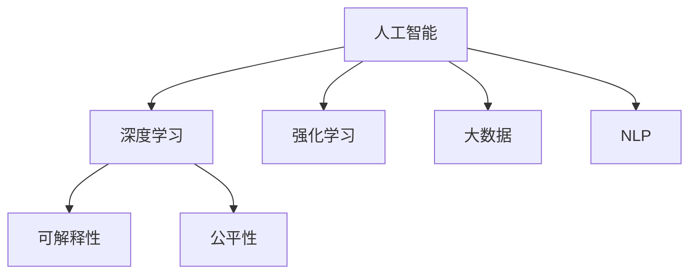

                 

## 1. 背景介绍

### 1.1 问题由来
人工智能(AI)自诞生以来，经历了数次浪潮，从早期专家系统到统计学习，再到深度学习和强化学习，每一步都伴随着技术突破和应用落地。当前，AI技术正处于第三次浪潮的高峰期，深度学习模型在图像识别、语音识别、自然语言处理(NLP)等领域取得了巨大进展，推动了人工智能的广泛应用。

### 1.2 问题核心关键点
当前AI技术面临的最大挑战之一是如何平衡技术进步与伦理、社会和经济的可持续性。随着AI技术的不断进步，人们开始担忧其可能带来的就业失业、隐私安全、决策透明、公平公正等问题。如何构建一个健康、平衡、可持续的人工智能发展环境，成为AI领域需要重点关注的问题。

### 1.3 问题研究意义
研究AI技术的未来发展挑战，有助于我们更好地理解其潜在的社会影响，制定合理的政策框架，引导AI技术的健康发展。这对于确保AI技术的正面效应，实现AI技术的普惠性应用，具有重要意义。

## 2. 核心概念与联系

### 2.1 核心概念概述

为更好地理解AI技术面临的未来发展挑战，本节将介绍几个密切相关的核心概念：

- 人工智能(AI)：以数据、算法和计算为基础，使机器能够执行智能任务的技术。
- 深度学习(Deep Learning)：基于神经网络模型，通过多层次非线性变换对数据进行抽象和学习的技术。
- 强化学习(Reinforcement Learning)：通过智能体与环境的交互，学习最优策略以最大化累积奖励的技术。
- 大数据(Big Data)：涉及数据的采集、存储、处理、分析和可视化的技术，是AI技术发展的基础。
- 自然语言处理(NLP)：使计算机能够理解、处理和生成自然语言的技术。
- 可解释性(Explainability)：使AI模型的决策过程透明可理解，便于人类理解和干预的技术。
- 公平性(Fairness)：确保AI系统在处理不同群体时，不偏袒、不歧视，保持公正的技术。

这些核心概念之间的逻辑关系可以通过以下Mermaid流程图来展示：



这个流程图展示了几大核心概念及其之间的关系：

1. 人工智能技术包含了深度学习、强化学习、大数据处理和自然语言处理等子领域，是AI技术的基础。
2. 深度学习和大数据为AI技术提供了强大的数据支持和算法支持，是AI技术取得突破的关键。
3. 可解释性和公平性是AI技术应用的伦理和政策基础，是确保AI技术健康发展的保障。

## 3. 核心算法原理 & 具体操作步骤

### 3.1 算法原理概述

AI技术的未来发展挑战涉及多个层面，包括技术进步、伦理问题、社会影响等。本节将重点介绍一些核心算法的原理和操作步骤。

### 3.2 算法步骤详解

**Step 1: 技术进步挑战**
- **数据依赖问题**：AI模型需要大量数据进行训练，但数据获取和标注成本高，可能存在数据偏差和隐私泄露问题。
- **模型复杂性问题**：大规模模型需要强大的计算资源，可能导致资源耗尽、推理效率低下等问题。
- **模型可解释性问题**：深度模型“黑盒”性质，难以解释模型决策过程，可能导致决策不透明、不可控。

**Step 2: 伦理问题挑战**
- **就业失业问题**：AI技术可能取代人类工作，导致就业岗位减少，就业结构改变。
- **隐私安全问题**：AI技术可能涉及敏感数据，数据泄露和滥用问题难以避免。
- **决策公平性问题**：AI系统可能存在偏见和歧视，决策结果对不同群体不公平。

**Step 3: 社会影响挑战**
- **技术普及问题**：AI技术的普及需要教育和技术支持的普及，可能存在“数字鸿沟”问题。
- **国际竞争问题**：AI技术是未来竞争的重要领域，国家之间的技术竞争可能带来新的地缘政治风险。
- **文化冲突问题**：AI技术的普及可能带来新的文化和价值观念冲突，需要合理引导和规范。

**Step 4: 研究方法挑战**
- **多学科融合问题**：AI技术的进步需要多学科的交叉合作，包括计算机科学、数学、伦理学等。
- **跨领域应用问题**：AI技术需要在不同领域进行应用，需要进行跨领域的模型适配和优化。
- **模型公平性问题**：AI模型需要在不同群体之间保持公平，需要考虑不同群体的特征和需求。

### 3.3 算法优缺点

**AI技术的优势**：
- **自动化与效率提升**：AI技术可以自动执行复杂任务，提升工作效率。
- **决策优化**：AI模型可以优化决策过程，提高决策质量。
- **创新驱动**：AI技术可以驱动新产品的创新和应用，推动产业发展。

**AI技术的劣势**：
- **数据依赖**：AI模型需要大量数据进行训练，数据获取和标注成本高，可能存在数据偏差和隐私泄露问题。
- **计算资源需求**：大规模模型需要强大的计算资源，可能导致资源耗尽、推理效率低下等问题。
- **模型复杂性**：深度模型“黑盒”性质，难以解释模型决策过程，可能导致决策不透明、不可控。
- **伦理问题**：AI系统可能存在偏见和歧视，决策结果对不同群体不公平。
- **社会影响**：AI技术的普及可能导致就业结构改变、数据隐私泄露、决策不透明等问题。

### 3.4 算法应用领域

AI技术已经在诸多领域取得了显著成果，以下是几个典型的应用领域：

- **医疗健康**：AI技术可以辅助诊断、治疗和药物研发，提高医疗服务的质量和效率。
- **金融服务**：AI技术可以应用于风险评估、智能投顾、欺诈检测等领域，提升金融服务的安全性和便捷性。
- **交通运输**：AI技术可以应用于自动驾驶、智能交通管理、物流优化等领域，提升交通运输的效率和安全性。
- **零售电商**：AI技术可以应用于个性化推荐、库存管理、供应链优化等领域，提升零售电商的运营效率和用户体验。
- **智能制造**：AI技术可以应用于智能工厂、质量控制、设备维护等领域，提升制造业的生产效率和产品质量。

## 4. 数学模型和公式 & 详细讲解 & 举例说明

### 4.1 数学模型构建

在AI技术中，数学模型是理解和应用的基础。以下是一个简单的线性回归模型：

$$y = \theta_0 + \theta_1 x_1 + \theta_2 x_2$$

其中，$y$ 是输出，$x_1$ 和 $x_2$ 是输入特征，$\theta_0$、$\theta_1$ 和 $\theta_2$ 是模型参数。

### 4.2 公式推导过程

以线性回归模型的最小二乘法为例，推导最小化误差函数的过程如下：

$$\hat{y} = \theta_0 + \theta_1 x_1 + \theta_2 x_2$$

设训练集为 $D=\{(x_i,y_i)\}_{i=1}^N$，其中 $x_i = [1,x_{i1},x_{i2}]$，$y_i$ 是真实的标签，$\hat{y}_i$ 是模型预测的输出。

最小二乘法的目标是最小化误差函数：

$$E = \frac{1}{2N} \sum_{i=1}^N (y_i - \hat{y}_i)^2$$

通过求导并令导数等于零，可以得到参数的更新公式：

$$\frac{\partial E}{\partial \theta_0} = -\frac{1}{N} \sum_{i=1}^N (y_i - \hat{y}_i) = 0$$
$$\frac{\partial E}{\partial \theta_1} = -\frac{1}{N} \sum_{i=1}^N (y_i - \hat{y}_i)x_{i1} = 0$$
$$\frac{\partial E}{\partial \theta_2} = -\frac{1}{N} \sum_{i=1}^N (y_i - \hat{y}_i)x_{i2} = 0$$

解以上方程组，可以得到参数 $\theta_0$、$\theta_1$ 和 $\theta_2$ 的更新公式：

$$\theta_0 = \frac{1}{N} \sum_{i=1}^N y_i$$
$$\theta_1 = \frac{1}{N} \sum_{i=1}^N (y_i - \hat{y}_i)x_{i1}$$
$$\theta_2 = \frac{1}{N} \sum_{i=1}^N (y_i - \hat{y}_i)x_{i2}$$

### 4.3 案例分析与讲解

以图像识别为例，使用卷积神经网络(CNN)模型进行图像分类。CNN模型由多个卷积层、池化层和全连接层组成，可以自动学习图像的特征表示。通过反向传播算法，模型可以更新参数，提高分类准确率。

## 5. 项目实践：代码实例和详细解释说明

### 5.1 开发环境搭建

在进行AI项目实践前，我们需要准备好开发环境。以下是使用Python进行TensorFlow开发的环境配置流程：

1. 安装Anaconda：从官网下载并安装Anaconda，用于创建独立的Python环境。

2. 创建并激活虚拟环境：
```bash
conda create -n tf-env python=3.8 
conda activate tf-env
```

3. 安装TensorFlow：根据CUDA版本，从官网获取对应的安装命令。例如：
```bash
conda install tensorflow -c conda-forge
```

4. 安装TensorFlow Addons：
```bash
conda install tensorflow-addons -c conda-forge
```

5. 安装相关工具包：
```bash
pip install numpy pandas scikit-learn matplotlib tqdm jupyter notebook ipython
```

完成上述步骤后，即可在`tf-env`环境中开始AI项目实践。

### 5.2 源代码详细实现

下面以图像分类任务为例，给出使用TensorFlow实现CNN模型的PyTorch代码实现。

首先，定义CNN模型：

```python
import tensorflow as tf
from tensorflow.keras import layers

model = tf.keras.Sequential([
    layers.Conv2D(32, (3,3), activation='relu', input_shape=(28, 28, 1)),
    layers.MaxPooling2D((2,2)),
    layers.Flatten(),
    layers.Dense(10, activation='softmax')
])
```

接着，定义训练和评估函数：

```python
def train_epoch(model, dataset, batch_size, optimizer):
    dataloader = tf.data.Dataset.from_tensor_slices(dataset).shuffle(1000).batch(batch_size).repeat()
    model.compile(optimizer=optimizer, loss='categorical_crossentropy', metrics=['accuracy'])
    model.fit(dataloader, validation_data=validation_dataset, epochs=5)

def evaluate(model, dataset, batch_size):
    dataloader = tf.data.Dataset.from_tensor_slices(dataset).batch(batch_size).repeat()
    model.evaluate(dataloader)
```

最后，启动训练流程并在测试集上评估：

```python
epochs = 5
batch_size = 32

optimizer = tf.keras.optimizers.Adam(learning_rate=0.001)
train_epoch(model, train_dataset, batch_size, optimizer)
evaluate(model, test_dataset, batch_size)
```

以上就是使用TensorFlow对CNN模型进行图像分类任务开发的完整代码实现。可以看到，得益于TensorFlow的强大封装，我们可以用相对简洁的代码完成模型的训练和评估。

### 5.3 代码解读与分析

让我们再详细解读一下关键代码的实现细节：

**CNN模型定义**：
- `tf.keras.Sequential`：定义一个序列模型，包含多个层次的堆叠。
- `Conv2D`：卷积层，用于提取图像特征。
- `MaxPooling2D`：池化层，用于降维和特征提取。
- `Flatten`：展平层，将多维张量展平为一维向量。
- `Dense`：全连接层，用于分类输出。

**训练和评估函数**：
- `train_epoch`：在训练集上进行训练，并使用验证集进行验证。
- `evaluate`：在测试集上进行评估。
- `compile`：配置模型的优化器和损失函数。

**训练流程**：
- 定义总的epoch数和batch size，开始循环迭代
- 每个epoch内，在训练集上进行训练，并使用验证集进行验证
- 所有epoch结束后，在测试集上进行评估

可以看到，TensorFlow提供了完整的API和工具，使得AI模型的开发和部署变得简便高效。开发者可以将更多精力放在模型设计、超参数调整等高层逻辑上，而不必过多关注底层的实现细节。

当然，工业级的系统实现还需考虑更多因素，如模型的保存和部署、超参数的自动搜索、更灵活的任务适配层等。但核心的AI模型开发流程基本与此类似。

## 6. 实际应用场景

### 6.1 智能医疗

AI技术在医疗领域的应用前景广阔，包括疾病诊断、药物研发、个性化治疗等方面。智能医疗系统可以通过分析患者的历史数据和基因信息，预测疾病风险、推荐治疗方案，甚至进行智能辅助诊断。

### 6.2 金融科技

AI技术在金融领域的应用包括风险评估、智能投顾、欺诈检测等。智能金融系统可以通过分析大量的交易数据和市场信息，预测股票价格、优化投资组合，甚至实现智能交易。

### 6.3 智能制造

AI技术在智能制造中的应用包括预测性维护、质量控制、供应链优化等。智能制造系统可以通过分析生产数据和设备状态，预测设备故障、优化生产流程，甚至实现自动化生产。

### 6.4 智能交通

AI技术在智能交通中的应用包括自动驾驶、智能交通管理、车辆调度等。智能交通系统可以通过分析交通数据和路况信息，实现自动驾驶、智能导航，甚至优化交通流量。

## 7. 工具和资源推荐

### 7.1 学习资源推荐

为了帮助开发者系统掌握AI技术的理论基础和实践技巧，这里推荐一些优质的学习资源：

1. 《深度学习》系列博文：由AI专家撰写，深入浅出地介绍了深度学习的原理和应用，适合初学者入门。

2. 《TensorFlow官方文档》：TensorFlow的官方文档，提供了丰富的API和样例代码，是学习TensorFlow的重要资料。

3. 《Reinforcement Learning: An Introduction》书籍：由AI大师Sutton和Barto合著，全面介绍了强化学习的理论和实践，是学习强化学习的重要参考资料。

4. 《动手学深度学习》书籍：由李沐等人编写，结合理论与实践，适合深入学习深度学习的开发者。

5. 《Python深度学习》书籍：由Francois Chollet合著，全面介绍了TensorFlow和Keras的使用方法，适合使用深度学习进行实际应用的开发者。

通过对这些资源的学习实践，相信你一定能够快速掌握AI技术的精髓，并用于解决实际的AI问题。

### 7.2 开发工具推荐

高效的开发离不开优秀的工具支持。以下是几款用于AI项目开发的常用工具：

1. TensorFlow：由Google主导开发的开源深度学习框架，生产部署方便，适合大规模工程应用。

2. PyTorch：基于Python的开源深度学习框架，灵活动态的计算图，适合快速迭代研究。

3. Keras：高层API，用于快速搭建深度学习模型，支持TensorFlow和PyTorch。

4. Weights & Biases：模型训练的实验跟踪工具，可以记录和可视化模型训练过程中的各项指标，方便对比和调优。

5. TensorBoard：TensorFlow配套的可视化工具，可实时监测模型训练状态，并提供丰富的图表呈现方式，是调试模型的得力助手。

6. Jupyter Notebook：交互式开发环境，方便进行模型训练和调试。

合理利用这些工具，可以显著提升AI项目的开发效率，加快创新迭代的步伐。

### 7.3 相关论文推荐

AI技术的发展源于学界的持续研究。以下是几篇奠基性的相关论文，推荐阅读：

1. AlexNet: ImageNet Classification with Deep Convolutional Neural Networks：提出卷积神经网络(CNN)模型，开创了深度学习在计算机视觉领域的应用。

2. ResNet: Deep Residual Learning for Image Recognition：提出残差网络(ResNet)模型，解决了深度网络训练中的梯度消失问题，使深度学习模型能够更深层化。

3. Google's AlphaGo Zero: Mastering the Game of Go without Human Knowledge：提出AlphaGo Zero模型，展示了深度强化学习在复杂游戏领域的突破。

4. TensorFlow: A System for Large-Scale Machine Learning：介绍TensorFlow的架构和设计理念，展示了深度学习模型的广泛应用。

5. Reinforcement Learning: An Introduction：全面介绍了强化学习的理论和实践，是学习强化学习的重要参考资料。

这些论文代表了大AI技术的发展脉络。通过学习这些前沿成果，可以帮助研究者把握学科前进方向，激发更多的创新灵感。

## 8. 总结：未来发展趋势与挑战

### 8.1 总结

本文对AI技术的未来发展挑战进行了全面系统的介绍。首先阐述了AI技术面临的最大挑战之一是如何平衡技术进步与伦理、社会和经济的可持续性。其次，从技术进步、伦理问题、社会影响等层面，详细讲解了AI技术的发展方向和可能带来的影响。

通过本文的系统梳理，可以看到，AI技术在未来仍需面对诸多挑战，包括技术进步、伦理问题、社会影响等。只有在这些方面取得突破，才能确保AI技术的健康发展，实现普惠性应用。

### 8.2 未来发展趋势

展望未来，AI技术将呈现以下几个发展趋势：

1. **多模态融合**：AI技术将在视觉、语音、自然语言等多模态数据上进行融合，提升对现实世界的理解和建模能力。

2. **跨领域应用**：AI技术将在不同领域进行应用，需要进行跨领域的模型适配和优化，以实现更广泛的应用场景。

3. **伦理与安全**：AI技术将在伦理、安全等方面进行加强，确保AI技术的透明、公正、安全。

4. **普惠与可控**：AI技术将在普惠性、可控性方面进行改进，确保技术的应用符合人类价值观和伦理道德。

5. **自适应与演化**：AI技术将在自适应、演化等方面进行改进，确保技术在不断变化的环境中保持高效和稳健。

6. **人机协同**：AI技术将在人机协同方面进行改进，提升人类与机器的协作能力，实现更高效、更智能的交互。

### 8.3 面临的挑战

尽管AI技术已经取得了显著成果，但在迈向更加智能化、普适化应用的过程中，仍面临诸多挑战：

1. **技术瓶颈**：深度学习模型面临计算资源、数据获取和标注成本等问题，需要解决技术瓶颈。

2. **伦理问题**：AI系统可能存在偏见和歧视，决策结果对不同群体不公平，需要解决伦理问题。

3. **社会影响**：AI技术的普及可能带来就业结构改变、数据隐私泄露等问题，需要解决社会影响。

4. **可解释性**：深度模型“黑盒”性质，难以解释模型决策过程，需要解决可解释性问题。

5. **资源消耗**：大规模模型需要强大的计算资源，可能导致资源耗尽、推理效率低下等问题，需要解决资源消耗问题。

6. **安全与隐私**：AI系统可能涉及敏感数据，数据泄露和滥用问题难以避免，需要解决安全与隐私问题。

### 8.4 研究展望

面对AI技术面临的诸多挑战，未来的研究需要在以下几个方面寻求新的突破：

1. **多学科融合**：AI技术的发展需要多学科的交叉合作，包括计算机科学、数学、伦理学等。

2. **跨领域应用**：AI技术需要在不同领域进行应用，需要进行跨领域的模型适配和优化。

3. **模型公平性**：AI模型需要在不同群体之间保持公平，需要考虑不同群体的特征和需求。

4. **可解释性与透明**：需要开发更加可解释性和透明的AI模型，便于人类理解和干预。

5. **资源优化**：需要开发更加参数高效和计算高效的AI模型，优化资源消耗。

6. **安全与隐私保护**：需要开发更加安全与隐私保护的AI模型，保障数据和模型安全。

这些研究方向的探索，必将引领AI技术的未来发展，为构建健康、平衡、可持续的人工智能发展环境提供有力支撑。

## 9. 附录：常见问题与解答

**Q1：AI技术的发展是否会取代人类工作？**

A: AI技术的发展可能会取代部分人类工作，但同时也将创造新的就业机会。AI技术可以自动化繁琐、重复的工作，提高生产效率，但也需要人类进行监督、维护和管理。因此，AI技术的发展需要合理规划，确保就业结构的稳定。

**Q2：AI技术的应用是否存在伦理问题？**

A: AI技术的应用确实存在伦理问题，如数据隐私、决策透明、偏见歧视等。需要在AI系统的设计和应用过程中，加强伦理审查和监管，确保AI技术的应用符合人类价值观和伦理道德。

**Q3：AI技术的应用是否存在安全问题？**

A: AI技术的应用确实存在安全问题，如数据泄露、恶意攻击等。需要在AI系统的设计和应用过程中，加强安全防护和隐私保护，确保数据和模型安全。

**Q4：AI技术的应用是否存在可解释性问题？**

A: AI技术的“黑盒”性质确实存在可解释性问题，如深度模型难以解释决策过程。需要在AI系统的设计和应用过程中，开发更加可解释性和透明的AI模型，便于人类理解和干预。

**Q5：AI技术的应用是否存在资源消耗问题？**

A: AI技术的应用确实存在资源消耗问题，如大规模模型需要强大的计算资源，可能导致资源耗尽、推理效率低下等问题。需要在AI系统的设计和应用过程中，开发更加参数高效和计算高效的AI模型，优化资源消耗。

通过本文的系统梳理，可以看到，AI技术在未来仍需面对诸多挑战，需要在技术进步、伦理问题、社会影响等方面进行全方位的探索和突破。只有在这些方面取得平衡和突破，才能确保AI技术的健康发展，实现普惠性应用。

---

作者：禅与计算机程序设计艺术 / Zen and the Art of Computer Programming

