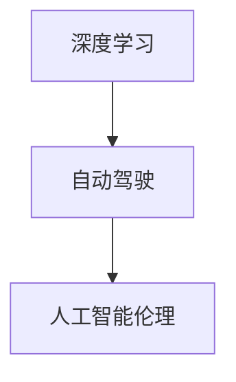

                 

# Andrej Karpathy：人工智能的未来发展方向

## 1. 背景介绍

Andrej Karpathy，是人工智能领域的一位杰出专家，同时也是一位计算机程序设计艺术大师。他的工作广泛涵盖了深度学习、计算机视觉和自动驾驶等领域，并对这些技术的发展产生了深远的影响。本文将探讨Andrej Karpathy对人工智能未来发展方向的见解，重点聚焦在深度学习、自动驾驶和人工智能伦理等多个方面。

## 2. 核心概念与联系

### 2.1 核心概念概述

为了更好地理解Andrej Karpathy的观点，我们先梳理一些核心概念：

- **深度学习**：一种基于神经网络，通过多层非线性变换学习输入数据表示的机器学习技术。
- **自动驾驶**：利用计算机视觉、深度学习和传感器技术，让车辆实现自主导航和驾驶的智能交通系统。
- **人工智能伦理**：研究如何设计和应用人工智能技术，确保其在道德、法律和社会层面上的负责任和公平性。

这些概念之间的联系在于，深度学习是自动驾驶技术的基础，而自动驾驶的发展又推动了人工智能伦理研究的深入。

### 2.2 核心概念原理和架构的 Mermaid 流程图



## 3. 核心算法原理 & 具体操作步骤

### 3.1 算法原理概述

Andrej Karpathy认为，深度学习技术将在未来继续保持其主导地位，并将在多个领域得到更广泛的应用。以下是他对深度学习未来发展方向的几个关键见解：

1. **可解释性**：尽管深度学习在许多任务上取得了巨大成功，但其“黑盒”性质仍是一个挑战。Karpathy强调，未来需要更多关注模型的可解释性，使开发者和用户能够理解模型的决策过程。

2. **自动化与可扩展性**：自动化模型训练和部署将成为趋势，使得研究人员和工程师能够快速迭代和部署深度学习模型。

3. **多模态学习**：深度学习将不再局限于图像、文本和语音等单一模态的数据，而是能够处理多模态数据，如同时考虑图像和语音信息的任务。

4. **自监督学习**：自监督学习方法将使深度学习模型能够在没有大量标注数据的情况下进行训练，扩展其在更多场景中的应用。

### 3.2 算法步骤详解

1. **数据准备**：收集和预处理数据，确保数据的多样性和代表性。
2. **模型设计**：选择合适的深度学习架构，如卷积神经网络(CNN)、循环神经网络(RNN)或Transformer等。
3. **训练与调参**：使用优化算法（如Adam、SGD等）和损失函数对模型进行训练，并进行超参数调优。
4. **模型评估与部署**：在验证集上评估模型性能，并将模型部署到实际应用环境中。

### 3.3 算法优缺点

**优点**：
- **高准确性**：深度学习在许多任务上已经超越了人类专家的水平。
- **可扩展性**：深度学习模型可以通过添加更多层和神经元来提升性能。
- **广泛应用**：深度学习已经应用于图像识别、自然语言处理、自动驾驶等多个领域。

**缺点**：
- **计算资源需求高**：训练深度学习模型需要大量的计算资源和硬件支持。
- **可解释性差**：深度学习模型通常被视为“黑盒”，难以理解其内部决策过程。
- **数据依赖**：深度学习模型需要大量标注数据进行训练，否则性能难以提升。

### 3.4 算法应用领域

Andrej Karpathy认为，深度学习将在以下领域得到更广泛的应用：

1. **计算机视觉**：如自动驾驶、医学影像诊断等。
2. **自然语言处理**：如机器翻译、语音识别、情感分析等。
3. **推荐系统**：如电子商务平台的商品推荐、新闻网站的文章推荐等。
4. **游戏AI**：如AlphaGo在围棋、星际争霸等游戏中的表现。

## 4. 数学模型和公式 & 详细讲解 & 举例说明

### 4.1 数学模型构建

Andrej Karpathy指出，深度学习模型通常可以表示为多层神经网络，其中每一层都由一组权重和偏置组成。以卷积神经网络(CNN)为例，其数学模型可以表示为：

$$
f(x; \theta) = \sigma\left(\sum_i w_i \sigma\left(\sum_j v_{ij} \sigma\left(\sum_k u_{ijk} x_k + b_{ijk}\right) + b_i\right) + b\right)
$$

其中，$x$ 为输入数据，$\theta$ 为模型参数，$\sigma$ 为激活函数，$w_i$、$v_{ij}$、$u_{ijk}$ 为权重矩阵，$b_i$、$b_{ijk}$ 为偏置项。

### 4.2 公式推导过程

以卷积神经网络为例，其前向传播过程可以表示为：

1. **卷积层**：
$$
\text{Conv}(x, w) = \text{ReLU}(\text{Conv}_2(x, w_2) + b_2)
$$
其中，$x$ 为输入数据，$w$ 为卷积核，$\text{Conv}_2$ 表示卷积操作，$\text{ReLU}$ 为激活函数，$b_2$ 为偏置项。

2. **池化层**：
$$
\text{Pooling}(\text{Conv}_2(x, w_2) + b_2) = \max(\text{Pooling}_2(\text{Conv}_2(x, w_2) + b_2))
$$
其中，$\text{Pooling}_2$ 表示池化操作。

3. **全连接层**：
$$
\text{FC}(\text{Pooling}(\text{Conv}_2(x, w_2) + b_2)) = \sigma\left(\sum_i w_i \sigma\left(\sum_j v_{ij} \sigma\left(\sum_k u_{ijk} x_k + b_{ijk}\right) + b_i\right) + b\right)
$$
其中，$\text{FC}$ 表示全连接层。

### 4.3 案例分析与讲解

以手写数字识别为例，使用MNIST数据集。首先，将输入的28x28图像经过卷积和池化层进行特征提取，然后通过全连接层输出数字类别。训练过程中，使用交叉熵损失函数进行优化，最小化模型输出与真实标签之间的差异。

## 5. 项目实践：代码实例和详细解释说明

### 5.1 开发环境搭建

为了进行深度学习项目实践，首先需要搭建好开发环境。以下是使用Python和TensorFlow搭建开发环境的步骤：

1. **安装Python和TensorFlow**：
```bash
conda create -n tf_env python=3.7
conda activate tf_env
conda install tensorflow -c pytorch
```

2. **安装其他依赖**：
```bash
pip install numpy matplotlib scikit-learn
```

### 5.2 源代码详细实现

以下是一个简单的卷积神经网络代码实现，用于手写数字识别：

```python
import tensorflow as tf
from tensorflow.keras import datasets, layers, models

# 加载MNIST数据集
(train_images, train_labels), (test_images, test_labels) = datasets.mnist.load_data()

# 数据预处理
train_images = train_images.reshape((60000, 28, 28, 1))
test_images = test_images.reshape((10000, 28, 28, 1))
train_images, test_images = train_images / 255.0, test_images / 255.0

# 构建卷积神经网络
model = models.Sequential([
    layers.Conv2D(32, (3, 3), activation='relu', input_shape=(28, 28, 1)),
    layers.MaxPooling2D((2, 2)),
    layers.Conv2D(64, (3, 3), activation='relu'),
    layers.MaxPooling2D((2, 2)),
    layers.Conv2D(64, (3, 3), activation='relu'),
    layers.Flatten(),
    layers.Dense(64, activation='relu'),
    layers.Dense(10, activation='softmax')
])

# 编译模型
model.compile(optimizer='adam',
              loss='sparse_categorical_crossentropy',
              metrics=['accuracy'])

# 训练模型
model.fit(train_images, train_labels, epochs=5, 
          validation_data=(test_images, test_labels))
```

### 5.3 代码解读与分析

1. **数据加载与预处理**：将MNIST数据集加载到TensorFlow中，并对图像进行归一化处理。
2. **模型构建**：使用Sequential模型构建卷积神经网络，包含卷积层、池化层和全连接层。
3. **模型编译**：使用Adam优化器和交叉熵损失函数编译模型。
4. **模型训练**：使用训练集对模型进行训练，并在验证集上评估模型性能。

### 5.4 运行结果展示

训练完成后，可以使用测试集对模型进行评估：

```python
test_loss, test_acc = model.evaluate(test_images, test_labels, verbose=2)
print(f'Test accuracy: {test_acc * 100:.2f}%')
```

## 6. 实际应用场景

### 6.1 自动驾驶

Andrej Karpathy在自动驾驶领域的研究非常深入，他认为，自动驾驶技术将成为未来交通的重要组成部分。未来，自动驾驶车辆将能够实时感知周围环境，做出智能决策，实现高效、安全的自主导航。

### 6.2 游戏AI

Karpathy在《AlphaGo》项目中展示了深度学习的巨大潜力。通过深度学习和强化学习技术，AlphaGo能够在下围棋中击败人类顶尖棋手，推动了人工智能在游戏领域的突破。

### 6.3 医疗影像分析

深度学习在医疗影像分析领域也取得了显著成果，如利用卷积神经网络对医学影像进行分类和分析，帮助医生进行诊断和治疗决策。

### 6.4 未来应用展望

Andrej Karpathy认为，未来人工智能将更加注重可解释性和公平性。模型决策过程的可解释性将使开发者和用户能够更好地理解和信任模型。同时，通过公平性设计，确保不同群体能够公平地受益于人工智能技术。

## 7. 工具和资源推荐

### 7.1 学习资源推荐

1. **Coursera课程**：Andrej Karpathy在Coursera上开设的深度学习课程，涵盖深度学习基础和高级应用。
2. **arXiv论文**：Karpathy在arXiv上发表的深度学习论文，涵盖了自动驾驶、计算机视觉等多个领域。
3. **GitHub代码**：Karpathy在GitHub上发布的深度学习项目，包括自动驾驶、游戏AI等。

### 7.2 开发工具推荐

1. **TensorFlow**：由Google开发的深度学习框架，支持分布式计算和多种硬件平台。
2. **PyTorch**：由Facebook开发的深度学习框架，支持动态计算图和高效的模型训练。
3. **Keras**：一个高级深度学习框架，提供简单易用的API和多种预训练模型。

### 7.3 相关论文推荐

1. **《Playing Atari with Deep Reinforcement Learning》**：Karpathy在Nature上发表的论文，展示了深度强化学习在玩游戏中的应用。
2. **《Deep Reinforcement Learning for Robotic Arm Control》**：Karpathy在《Journal of Machine Learning Research》上发表的论文，展示了深度学习在机器人控制中的应用。

## 8. 总结：未来发展趋势与挑战

### 8.1 研究成果总结

Andrej Karpathy在深度学习、自动驾驶和人工智能伦理等多个领域取得了重要研究成果。他强调了可解释性、自动化与可扩展性、多模态学习、自监督学习的重要性，并对未来人工智能发展趋势进行了深刻洞察。

### 8.2 未来发展趋势

1. **深度学习的应用范围将进一步扩大**：深度学习将在更多领域得到应用，如自动驾驶、游戏AI、医疗影像等。
2. **深度学习的可解释性将得到更多关注**：未来需要更多可解释的深度学习模型，增强模型的透明度和可信度。
3. **多模态学习将成为趋势**：深度学习模型将能够处理图像、语音、文本等多种模态数据，提升模型的鲁棒性和泛化能力。

### 8.3 面临的挑战

1. **计算资源的需求**：深度学习模型训练和推理需要大量的计算资源和硬件支持。
2. **模型的可解释性**：深度学习模型的“黑盒”性质使得其决策过程难以理解和解释。
3. **数据依赖**：深度学习模型需要大量标注数据进行训练，否则性能难以提升。

### 8.4 研究展望

未来，研究者将需要在计算资源优化、模型可解释性增强、数据自动标注等方面进行深入探索。同时，通过多模态学习、自监督学习等方法，提升深度学习的灵活性和鲁棒性，推动人工智能技术的进一步发展。

## 9. 附录：常见问题与解答

**Q1：深度学习在自动驾驶中的应用主要有哪些？**

A：深度学习在自动驾驶中的应用主要包括以下几个方面：

1. **计算机视觉**：使用卷积神经网络(CNN)对图像进行特征提取和分类，实现目标检测、车道线识别等功能。
2. **传感器融合**：将激光雷达、摄像头、雷达等多种传感器数据进行融合，增强环境感知能力。
3. **决策制定**：使用强化学习、深度学习等方法，实现智能决策制定，如避障、车道保持等功能。

**Q2：深度学习的可解释性为什么重要？**

A：深度学习的可解释性重要，原因如下：

1. **增强信任度**：可解释的模型能够使开发者和用户更好地理解其决策过程，增强信任度。
2. **发现错误**：通过解释模型输出，可以更容易地发现模型错误和缺陷，进行修复。
3. **法规合规**：许多行业对人工智能的决策过程有明确的法规要求，可解释性是确保合规的重要手段。

**Q3：多模态学习如何实现？**

A：多模态学习可以通过以下几种方式实现：

1. **融合特征**：将不同模态的数据特征进行融合，如将图像和文本特征结合，增强模型的泛化能力。
2. **跨模态训练**：使用跨模态的训练数据，训练能够同时处理不同模态的模型。
3. **注意力机制**：通过注意力机制，使模型能够关注不同模态的信息，实现更有效的特征提取。

**Q4：如何应对深度学习的计算资源需求？**

A：应对深度学习的计算资源需求，可以采取以下几种策略：

1. **分布式训练**：使用分布式计算框架，如TensorFlow、PyTorch等，进行大规模模型训练。
2. **模型压缩**：通过量化、剪枝等技术，减小模型参数量，降低计算资源需求。
3. **模型并行**：使用模型并行技术，将模型划分为多个子模型，并行计算，提高训练速度。

作者：禅与计算机程序设计艺术 / Zen and the Art of Computer Programming

