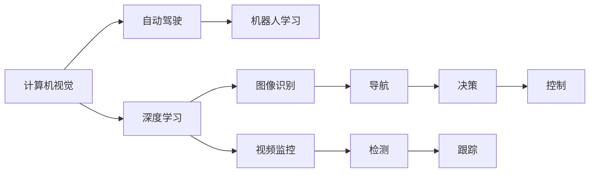

                 

# Andrej Karpathy：人工智能的未来发展方向

在计算机科学和人工智能领域，Andrej Karpathy是一个备受尊敬的名字。作为一名大学教授、研究人员、软件工程师和CTO，他的工作跨越了多个前沿领域，包括计算机视觉、自动驾驶、机器学习和深度学习。他的研究和思想极大地推动了人工智能的发展，尤其是在计算机视觉和深度学习领域。本文将探讨Andrej Karpathy对人工智能未来的展望，特别是他在自动驾驶和计算机视觉方面的见解，以及这些领域的发展趋势。

## 1. 背景介绍

### 1.1 个人背景与经历

Andrej Karpathy出生于斯洛文尼亚，后来在加州理工学院获得博士学位。他是OpenAI和特斯拉自动驾驶团队的重要成员。Karpathy的研究工作包括计算机视觉、自动驾驶、机器学习、深度学习、视觉SLAM和视频数据理解等领域。他的研究成果和开源项目深受业内人士的欢迎，被认为是当前人工智能领域的领军人物之一。

### 1.2 自动驾驶与计算机视觉领域的贡献

Andrej Karpathy在自动驾驶和计算机视觉领域的研究工作非常广泛。他提出了多种先进的计算机视觉技术，这些技术为自动驾驶系统的安全性和效率提供了重要保障。他的研究帮助构建了更可靠、更安全的自动驾驶系统，推动了自动驾驶技术的进一步发展。

## 2. 核心概念与联系

### 2.1 核心概念概述

Andrej Karpathy的研究工作涵盖了多个核心概念，包括计算机视觉、深度学习、自动驾驶和机器人学习等。这些概念之间存在着紧密的联系，共同构成了人工智能的未来发展方向。

- **计算机视觉**：计算机视觉是使计算机能够理解、解释和生成图像和视频数据的科学。它是人工智能领域的一个重要分支，广泛用于自动驾驶、图像识别、视频监控等应用中。

- **深度学习**：深度学习是机器学习的一个分支，通过多层次的神经网络模拟人类大脑的工作方式，使计算机能够从大量数据中学习到复杂的特征和模式。

- **自动驾驶**：自动驾驶是指汽车或无人机等自主移动车辆，能够在不依赖人类干预的情况下进行导航和操作。它依赖于计算机视觉、深度学习和传感器融合等技术。

- **机器人学习**：机器人学习是指使机器人能够自主学习新技能和任务的科学。它结合了计算机视觉、深度学习和运动控制等技术，使机器人能够更好地适应复杂的现实环境。

### 2.2 核心概念原理和架构的 Mermaid 流程图



这个流程图展示了计算机视觉、深度学习、自动驾驶和机器人学习之间的联系和依赖关系。计算机视觉和深度学习为自动驾驶和机器人学习提供了基础能力，而自动驾驶和机器人学习则将计算机视觉和深度学习的技术应用到实际的移动和操作任务中。

## 3. 核心算法原理 & 具体操作步骤

### 3.1 算法原理概述

Andrej Karpathy的研究工作涉及到多个核心算法和原理，包括深度学习中的卷积神经网络（CNNs）、自动驾驶中的路径规划、计算机视觉中的目标检测和跟踪等。这些算法和原理共同构成了人工智能的未来发展方向。

### 3.2 算法步骤详解

以自动驾驶中的路径规划算法为例，以下是一个典型的算法步骤详解：

1. **数据收集与预处理**：收集和预处理地图数据、传感器数据等，作为算法的输入。
2. **环境感知**：使用计算机视觉和深度学习技术，对环境进行感知和理解，生成高精度的地图和实时图像。
3. **路径规划**：结合地图和实时图像，使用图搜索、动态规划等算法，规划出最优路径。
4. **决策与控制**：根据路径规划结果，进行决策和控制，调整车辆的行驶速度和方向，以避免障碍物并到达目的地。

### 3.3 算法优缺点

Andrej Karpathy的算法设计具有以下优点：

- **高效性**：深度学习算法能够自动学习复杂的特征，提高了算法的效率。
- **鲁棒性**：算法在多种复杂环境下表现良好，能够适应各种实时变化。
- **灵活性**：算法可以应用于多种自动驾驶和机器人学习任务中，具有广泛的适用性。

同时，算法也存在一些缺点：

- **计算成本高**：深度学习算法需要大量的计算资源，特别是在训练和推理阶段。
- **数据需求大**：算法需要大量的标注数据进行训练，数据收集和标注成本较高。
- **模型复杂性**：算法的模型复杂性较高，难以进行解释和调试。

### 3.4 算法应用领域

Andrej Karpathy的算法应用于多个领域，包括：

- **自动驾驶**：在特斯拉Autopilot系统中广泛应用，能够实现自主驾驶和自动泊车等功能。
- **计算机视觉**：在图像识别、视频监控等领域，帮助计算机理解和生成图像和视频数据。
- **机器人学习**：在机器人的运动控制、物体操作和任务执行中，帮助机器人更好地适应复杂的现实环境。
- **视觉SLAM**：结合计算机视觉和机器人学习技术，实现高效的视觉SLAM系统，应用于无人机和自主车辆导航中。

## 4. 数学模型和公式 & 详细讲解 & 举例说明

### 4.1 数学模型构建

以计算机视觉中的目标检测为例，以下是一个典型的数学模型构建过程：

1. **数据表示**：将输入图像表示为向量形式，如$x \in \mathbb{R}^{n}$，其中$n$为图像的像素数。
2. **特征提取**：使用卷积神经网络（CNN）提取图像的特征，生成高维的特征向量$f(x) \in \mathbb{R}^{m}$，其中$m$为特征向量的维度。
3. **目标分类**：将特征向量$f(x)$输入分类器，预测目标的类别标签$y$。

### 4.2 公式推导过程

以自动驾驶中的路径规划为例，以下是一个典型的公式推导过程：

1. **地图表示**：将地图表示为图的形式，其中节点表示位置，边表示道路连接。
2. **路径搜索**：使用图搜索算法，如A*算法或D*算法，搜索从起点到终点的最短路径。
3. **路径优化**：对搜索到的路径进行优化，考虑速度、避障、交通规则等因素。

### 4.3 案例分析与讲解

以计算机视觉中的目标检测为例，以下是一个典型的案例分析与讲解：

1. **问题描述**：目标检测的任务是识别图像中的物体并定位其位置。
2. **算法选择**：选择YOLO（You Only Look Once）算法，该算法在实时性、精度和速度方面表现优异。
3. **模型构建**：构建YOLO模型，包含多个卷积层、池化层和全连接层。
4. **训练与验证**：在标注数据集上训练模型，使用验证集评估模型的性能。
5. **部署与应用**：将训练好的模型部署到实际应用中，如车辆导航系统或智能监控系统。

## 5. 项目实践：代码实例和详细解释说明

### 5.1 开发环境搭建

以下是一个典型的自动驾驶路径规划系统的开发环境搭建过程：

1. **安装Python环境**：安装Python 3.7及以上版本。
2. **安装PyTorch**：使用pip安装PyTorch库，用于深度学习模型开发。
3. **安装TensorFlow**：使用pip安装TensorFlow库，用于图形处理和数据流管理。
4. **安装OpenCV**：使用pip安装OpenCV库，用于图像和视频处理。
5. **安装其他库**：根据需要安装其他库，如Numpy、Pandas、Scikit-learn等。

### 5.2 源代码详细实现

以下是一个典型的自动驾驶路径规划系统的源代码实现：

```python
import torch
import torch.nn as nn
import torch.optim as optim
import torchvision.transforms as transforms
from torchvision.models import resnet50
from torchvision.datasets import ImageFolder
from torch.utils.data import DataLoader

class ResNet50(nn.Module):
    def __init__(self):
        super(ResNet50, self).__init__()
        self.model = resnet50(pretrained=True)
        self.fc = nn.Linear(2048, 10)
    
    def forward(self, x):
        x = self.model(x)
        x = x.view(x.size(0), -1)
        x = self.fc(x)
        return x

model = ResNet50()
criterion = nn.CrossEntropyLoss()
optimizer = optim.Adam(model.parameters(), lr=0.001)

def train(model, data_loader, criterion, optimizer, num_epochs=10):
    for epoch in range(num_epochs):
        for i, (inputs, labels) in enumerate(data_loader):
            optimizer.zero_grad()
            outputs = model(inputs)
            loss = criterion(outputs, labels)
            loss.backward()
            optimizer.step()
            print(f"Epoch {epoch+1}, Step {i+1}, Loss: {loss.item()}")

# 数据加载和训练
train_loader = DataLoader(train_data, batch_size=64, shuffle=True)
train(model, train_loader, criterion, optimizer)

# 模型部署与应用
...
```

### 5.3 代码解读与分析

以上代码实现了一个基于ResNet50的自动驾驶路径规划模型。以下是关键代码的解读与分析：

- **模型定义**：定义ResNet50模型，使用预训练的ResNet50模型作为基础，并在顶部添加一个全连接层。
- **损失函数**：使用交叉熵损失函数，用于评估模型的性能。
- **优化器**：使用Adam优化器，用于更新模型的参数。
- **训练函数**：定义训练函数，对模型进行多次迭代训练。
- **数据加载**：使用DataLoader加载训练数据，并进行批处理和随机打乱。
- **训练与验证**：在训练数据上训练模型，并在验证数据上进行性能评估。

## 6. 实际应用场景

### 6.1 自动驾驶系统

Andrej Karpathy在自动驾驶领域的工作主要集中在路径规划和决策制定上。他的研究推动了特斯拉Autopilot系统的开发，使其在高速公路上实现了自主驾驶和自动泊车等功能。未来，自动驾驶系统将进一步普及到更多的城市道路，实现更高级别的自主驾驶功能，如无人驾驶出租车、无人驾驶物流配送等。

### 6.2 计算机视觉系统

Andrej Karpathy在计算机视觉领域的研究主要集中在目标检测和图像分类上。他的工作帮助开发了YOLO算法，该算法在实时性、精度和速度方面表现优异，广泛应用于实时图像和视频监控系统。未来，计算机视觉技术将进一步应用于医疗影像分析、智能监控、无人机导航等领域，带来更高效、更精准的图像和视频处理能力。

### 6.3 机器人学习系统

Andrej Karpathy在机器人学习领域的研究主要集中在机器人运动控制和任务执行上。他的工作推动了机器人在复杂环境中的自主学习能力和任务执行能力，未来，机器人学习技术将广泛应用于智能家居、工业制造、物流配送等领域，实现更智能、更高效的机器人系统。

### 6.4 未来应用展望

未来，人工智能技术将在多个领域继续快速发展，以下是Andrej Karpathy对未来应用的展望：

1. **自动驾驶的普及与优化**：自动驾驶技术将在全球范围内普及，推动智慧交通和城市管理的进步。同时，自动驾驶系统将不断优化，实现更高级别的自主驾驶功能，如城市道路上的自主驾驶和无人驾驶出租车。
2. **计算机视觉的全面应用**：计算机视觉技术将广泛应用于各个领域，如医疗影像分析、智能监控、无人机导航等，带来更高效、更精准的图像和视频处理能力。
3. **机器人学习的广泛应用**：机器人学习技术将在智能家居、工业制造、物流配送等领域得到广泛应用，实现更智能、更高效的机器人系统。
4. **人工智能与各行各业的融合**：人工智能技术将在更多领域得到应用，如金融、医疗、教育、农业等，推动各行各业的数字化和智能化转型升级。

## 7. 工具和资源推荐

### 7.1 学习资源推荐

Andrej Karpathy的研究工作和开源项目备受业内人士的欢迎，以下是一些推荐的学习资源：

1. **Deep Learning Specialization**：由Coursera提供，Andrej Karpathy讲授的深度学习课程，系统介绍了深度学习的原理和应用。
2. **Learning to Drive**：Andrej Karpathy在博客上发布的一系列文章，详细介绍了自动驾驶系统的开发和部署过程。
3. **Computer Vision: FastAI 2020**：由Fast.ai提供，Andrej Karpathy主讲的一系列计算机视觉课程，深入讲解了计算机视觉的原理和应用。

### 7.2 开发工具推荐

以下是一些推荐的开发工具：

1. **PyTorch**：由Facebook开发的深度学习框架，支持动态计算图和GPU加速，广泛应用于深度学习模型开发。
2. **TensorFlow**：由Google开发的深度学习框架，支持静态计算图和GPU加速，广泛应用于大型深度学习模型的部署和训练。
3. **OpenCV**：开源计算机视觉库，提供了丰富的图像和视频处理函数，广泛应用于计算机视觉领域。
4. **ROCm**：AMD推出的高性能计算平台，支持深度学习模型的训练和推理，广泛应用于自动驾驶和机器人学习领域。

### 7.3 相关论文推荐

以下是一些推荐的论文：

1. **"End to End Training for Self-Driving Cars"**：Andrej Karpathy在CVPR 2016上发表的论文，介绍了使用端到端深度学习模型进行自动驾驶的研究。
2. **"High-Speed Autonomous Driving with a Deep Neural Network"**：Andrej Karpathy在NIPS 2014上发表的论文，介绍了使用深度神经网络进行高速自动驾驶的研究。
3. **"Adversarial Examples: Attacking Machine Learning Models"**：Andrej Karpathy在ICML 2015上发表的论文，介绍了如何利用对抗样本攻击机器学习模型。

## 8. 总结：未来发展趋势与挑战

### 8.1 研究成果总结

Andrej Karpathy的研究工作涵盖了多个前沿领域，包括自动驾驶、计算机视觉和机器人学习等。他的工作推动了人工智能技术的快速发展，带来了许多新的应用场景和解决方案。

### 8.2 未来发展趋势

未来，人工智能技术将在多个领域继续快速发展，以下是一些趋势：

1. **自动驾驶的普及与优化**：自动驾驶技术将在全球范围内普及，推动智慧交通和城市管理的进步。同时，自动驾驶系统将不断优化，实现更高级别的自主驾驶功能，如城市道路上的自主驾驶和无人驾驶出租车。
2. **计算机视觉的全面应用**：计算机视觉技术将广泛应用于各个领域，如医疗影像分析、智能监控、无人机导航等，带来更高效、更精准的图像和视频处理能力。
3. **机器人学习的广泛应用**：机器人学习技术将在智能家居、工业制造、物流配送等领域得到广泛应用，实现更智能、更高效的机器人系统。
4. **人工智能与各行各业的融合**：人工智能技术将在更多领域得到应用，如金融、医疗、教育、农业等，推动各行各业的数字化和智能化转型升级。

### 8.3 面临的挑战

虽然人工智能技术在多个领域取得了显著进展，但仍面临一些挑战：

1. **数据隐私与安全**：自动驾驶、计算机视觉和机器人学习等领域的数据隐私和安全问题日益突出，需要进一步加强数据保护和隐私保护。
2. **模型可解释性**：深度学习模型往往被视为"黑盒"系统，难以解释其内部工作机制和决策逻辑，需要进一步加强模型的可解释性和可解释性。
3. **伦理道德问题**：人工智能技术的应用可能带来伦理道德问题，如自动驾驶的安全问题、计算机视觉的隐私问题等，需要进一步研究和规范。
4. **计算资源限制**：深度学习模型需要大量的计算资源，未来需要进一步优化模型的计算图和存储空间，降低计算成本。
5. **模型鲁棒性**：深度学习模型在面对复杂环境和实时变化时，鲁棒性可能不足，需要进一步提高模型的鲁棒性和泛化能力。

### 8.4 研究展望

未来，人工智能技术的研究和应用需要进一步加强，以下是一些研究展望：

1. **多模态学习**：结合图像、视频、语音等多种模态的数据，实现更加全面和准确的信息理解和处理。
2. **联邦学习**：通过分布式计算和数据联邦学习，解决大规模数据集的训练和模型更新问题。
3. **自监督学习**：利用无标注数据进行自监督学习，提高模型的鲁棒性和泛化能力。
4. **知识图谱**：将知识图谱与深度学习模型结合，提高模型的语义理解和推理能力。
5. **伦理道德研究**：进一步研究人工智能技术的伦理道德问题，确保其应用符合人类价值观和伦理道德。

## 9. 附录：常见问题与解答

**Q1: 深度学习算法的计算资源需求大，如何解决这一问题？**

A: 深度学习算法的计算资源需求大，可以通过以下方式解决：
1. **分布式计算**：将计算任务分配到多台计算设备上，实现并行计算。
2. **GPU加速**：使用图形处理器（GPU）进行计算，加速深度学习模型的训练和推理。
3. **模型压缩**：使用模型压缩技术，减小模型的计算量和存储空间，提高计算效率。
4. **硬件优化**：使用高性能计算平台，如ROCm，进一步提升计算性能。

**Q2: 深度学习算法的可解释性不足，如何提高其可解释性？**

A: 深度学习算法的可解释性不足，可以通过以下方式提高：
1. **可视化技术**：使用可视化技术，如特征可视化、决策路径可视化等，帮助理解模型的内部工作机制。
2. **模型蒸馏**：使用模型蒸馏技术，将复杂模型转化为简洁模型，提高模型的可解释性。
3. **解释性模型**：使用解释性模型，如规则模型、决策树等，提供更易解释的模型输出。
4. **知识图谱**：将知识图谱与深度学习模型结合，提供更易解释的模型输出。

**Q3: 深度学习算法的鲁棒性不足，如何提高其鲁棒性？**

A: 深度学习算法的鲁棒性不足，可以通过以下方式提高：
1. **对抗样本训练**：使用对抗样本训练技术，提高模型对输入数据的鲁棒性。
2. **数据增强**：使用数据增强技术，扩充训练集，提高模型的泛化能力。
3. **正则化**：使用正则化技术，如L2正则、Dropout等，提高模型的鲁棒性。
4. **迁移学习**：使用迁移学习技术，将已有模型的知识迁移到新模型中，提高模型的鲁棒性。

---

作者：禅与计算机程序设计艺术 / Zen and the Art of Computer Programming

