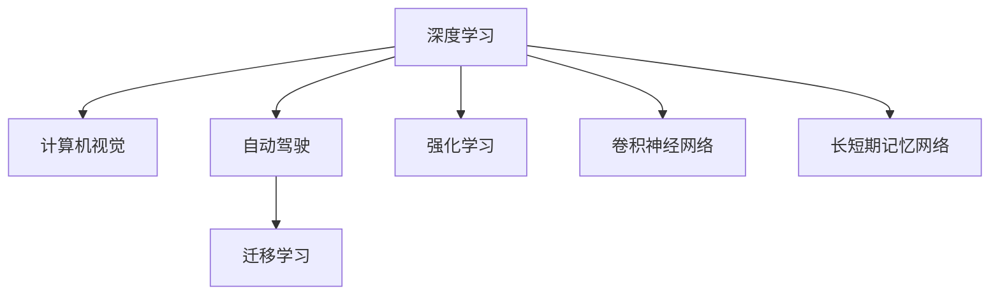

                 

# Andrej Karpathy：人工智能的未来发展方向

> 关键词：人工智能, 深度学习, 计算机视觉, 自动驾驶, 机器学习, 强化学习

## 1. 背景介绍

### 1.1 问题由来
Andrej Karpathy，深度学习界的翘楚，以其在计算机视觉、自动驾驶等领域的深入研究和创新实践，成为AI领域的标杆。他的研究探索，不仅推动了深度学习技术的进步，也揭示了人工智能未来发展的方向。本文将深入探讨Andrej Karpathy在深度学习、计算机视觉、自动驾驶等领域的理论贡献和实践成果，并展望未来人工智能的发展趋势。

### 1.2 问题核心关键点
本文的核心问题在于探讨Andrej Karpathy在人工智能领域的研究方向及其对未来人工智能发展的启示。主要聚焦于以下几个关键点：
- Andrej Karpathy在深度学习领域的理论贡献。
- 他在计算机视觉和自动驾驶等领域的实践应用。
- 他对于未来人工智能发展方向的见解。

## 2. 核心概念与联系

### 2.1 核心概念概述

为更好地理解Andrej Karpathy的理论和实践，本节将介绍几个密切相关的核心概念：

- 深度学习(Deep Learning)：利用多层次的神经网络结构，通过大量标注数据训练模型，实现复杂的模式识别和预测任务。
- 计算机视觉(Computer Vision)：通过计算机算法使机器"看懂"图片和视频，处理视觉信息。
- 自动驾驶(Autonomous Driving)：利用计算机视觉、深度学习等技术，实现车辆的自主导航和决策。
- 强化学习(Reinforcement Learning)：通过与环境的交互，使智能体通过试错学习最优策略，广泛应用于机器人控制、游戏AI等。
- 迁移学习(Transfer Learning)：在已有模型上微调，使其适应新任务，减少从头训练的需求。
- 卷积神经网络(Convolutional Neural Networks, CNN)：适用于处理图像和视频数据的神经网络结构。
- 长短期记忆网络(Long Short-Term Memory, LSTM)：适用于处理序列数据的神经网络结构，能捕捉时间依赖性。

这些核心概念之间的逻辑关系可以通过以下Mermaid流程图来展示：



这个流程图展示了这个核心概念之间的关系：

1. 深度学习通过神经网络结构，使得计算机可以学习和理解复杂的模式和关系。
2. 计算机视觉利用深度学习对图像和视频数据进行处理和理解。
3. 自动驾驶通过计算机视觉和深度学习，实现车辆的自主导航和决策。
4. 强化学习通过与环境的交互，使智能体学习最优策略，广泛应用于机器人控制、游戏AI等领域。
5. 迁移学习在已有模型上微调，使其适应新任务，减少从头训练的需求。
6. 卷积神经网络适用于处理图像和视频数据，是计算机视觉的核心技术之一。
7. 长短期记忆网络适用于处理序列数据，能捕捉时间依赖性，广泛用于自然语言处理和语音识别等领域。

这些核心概念共同构成了人工智能的学习和应用框架，使得机器能够理解和处理各种复杂任务。通过理解这些核心概念，我们可以更好地把握Andrej Karpathy的理论和实践，从而洞察人工智能的未来发展方向。

## 3. 核心算法原理 & 具体操作步骤
### 3.1 算法原理概述

Andrej Karpathy的研究跨越了深度学习、计算机视觉、自动驾驶等多个领域，涉及算法原理和具体操作步骤的多个方面。以下我们将重点介绍他在这些领域的主要贡献。

### 3.2 算法步骤详解

**深度学习**：
Andrej Karpathy在深度学习领域的贡献主要体现在以下几个方面：
- 他提出了一种新的深度学习优化方法，即Adam优化算法，通过自适应学习率调整，显著加快了模型的收敛速度。
- 他研究了深度学习的结构优化，通过网络稀疏化等方法，提升了模型的效率和泛化能力。
- 他在自然语言处理和计算机视觉等任务中，通过使用不同的神经网络结构（如RNN、LSTM、CNN等），优化了任务性能。

**计算机视觉**：
在计算机视觉领域，Andrej Karpathy的研究主要包括：
- 他提出了卷积神经网络(CNN)结构，通过多层卷积和池化操作，有效地处理图像和视频数据。
- 他开发了视觉数据增强技术，通过随机旋转、裁剪等手段，扩充数据集，提升模型的泛化能力。
- 他利用迁移学习技术，通过在ImageNet数据集上预训练模型，然后微调适应特定任务，显著提升了模型性能。

**自动驾驶**：
Andrej Karpathy在自动驾驶领域的贡献主要体现在以下几个方面：
- 他开发了端到端驾驶系统，通过深度学习和强化学习技术，实现了车辆的自主导航和决策。
- 他提出了视觉感知和控制相融合的方法，通过传感器数据融合，提升了自动驾驶的感知精度。
- 他研究了自动驾驶中的多任务学习，通过同时训练多个任务，提高了系统的整体性能。

**强化学习**：
在强化学习领域，Andrej Karpathy的研究主要包括：
- 他提出了AdaLoRA优化算法，通过自适应低秩适应的微调方法，提升了模型的参数效率和性能。
- 他研究了分布式强化学习，通过多机并行训练，加速了模型的收敛。
- 他开发了多个基于强化学习的游戏AI，在多款经典游戏中取得了超人的表现。

### 3.3 算法优缺点

Andrej Karpathy在深度学习和计算机视觉等领域的研究具有以下优点：
- 提出和优化了多种深度学习算法，加速了模型的训练和收敛。
- 通过神经网络结构和数据增强等手段，显著提升了模型的泛化能力和性能。
- 在自动驾驶和游戏AI等实际应用中，取得了显著的成果，推动了技术进步。

同时，这些研究也存在一定的局限性：
- 深度学习模型往往存在"黑盒"问题，难以解释模型的内部工作机制。
- 深度学习需要大量的标注数据和计算资源，对于计算资源有限的场景，模型训练可能受限。
- 强化学习算法在实际应用中，可能存在样本效率低、训练成本高等问题。

尽管存在这些局限性，但Andrej Karpathy的研究无疑为人工智能的发展奠定了坚实的基础，推动了深度学习、计算机视觉和自动驾驶等领域的进步。

### 3.4 算法应用领域

Andrej Karpathy的研究不仅在学术界产生了深远影响，也在实际应用中得到了广泛应用，涵盖了以下多个领域：

- 计算机视觉：他的卷积神经网络(CNN)结构和视觉数据增强技术，被广泛应用于图像和视频处理。
- 自动驾驶：通过端到端的驾驶系统和视觉感知技术，推动了自动驾驶技术的发展。
- 自然语言处理：通过深度学习和迁移学习技术，显著提升了自然语言处理任务的性能。
- 游戏AI：他开发的多个基于强化学习的游戏AI，展示了AI在复杂环境中的决策能力。
- 强化学习：他的AdaLoRA算法和多机并行训练技术，提升了强化学习算法的效率和性能。

此外，Andrej Karpathy的研究还对计算机图形学、机器翻译等领域产生了重要影响，推动了人工智能技术的全面发展。

## 4. 数学模型和公式 & 详细讲解 & 举例说明

### 4.1 数学模型构建

为了更好地理解Andrej Karpathy的理论和实践，以下将详细讲解他提出的一些数学模型和公式。

**深度学习优化算法**：
Andrej Karpathy提出了Adam优化算法，其公式为：
$$
m = \beta_1 m + (1-\beta_1) g, \quad v = \beta_2 v + (1-\beta_2) g^2
$$
$$
\hat{m} = \frac{m}{1-\beta_1^t}, \quad \hat{v} = \frac{v}{1-\beta_2^t}
$$
$$
\theta \leftarrow \theta - \frac{\eta}{\sqrt{\hat{v}} + \epsilon} \hat{m}
$$
其中，$g$ 表示梯度，$m$ 和 $v$ 表示梯度的移动平均值和平方移动平均值，$\beta_1$ 和 $\beta_2$ 表示指数衰减系数，$\eta$ 表示学习率，$\epsilon$ 表示数值稳定系数。

**卷积神经网络**：
卷积神经网络(CNN)由多个卷积层、池化层和全连接层组成，其公式为：
$$
h^{[l]}(\mathbf{x}, \mathbf{w}^{[l]}, \mathbf{b}^{[l]}) = \sigma(\mathbf{W}^{[l]}\mathbf{x} + \mathbf{b}^{[l]})
$$
$$
\mathbf{x}^{[l+1]} = \mathbf{P}^{[l]}\mathbf{x}^{[l]}
$$
其中，$h^{[l]}(\mathbf{x}, \mathbf{w}^{[l]}, \mathbf{b}^{[l]})$ 表示第 $l$ 层卷积神经网络的输出，$\mathbf{x}$ 表示输入特征图，$\mathbf{w}^{[l]}$ 表示卷积核参数，$\mathbf{b}^{[l]}$ 表示偏置项，$\sigma$ 表示激活函数，$\mathbf{W}^{[l]}$ 表示权重矩阵，$\mathbf{P}^{[l]}$ 表示池化操作。

**强化学习算法**：
强化学习中的Q-learning算法，其公式为：
$$
Q_{\theta}(s_t,a_t) = Q_{\theta}(s_t,a_t) + \eta(r_{t+1} + \gamma Q_{\theta}(s_{t+1}, a_{t+1}) - Q_{\theta}(s_t,a_t))
$$
其中，$Q_{\theta}(s_t,a_t)$ 表示状态-动作值函数，$s_t$ 表示当前状态，$a_t$ 表示当前动作，$r_{t+1}$ 表示奖励，$\gamma$ 表示折扣因子，$\eta$ 表示学习率。

### 4.2 公式推导过程

**深度学习优化算法**：
Adam优化算法的推导过程如下：
$$
m = \beta_1 m + (1-\beta_1) g, \quad v = \beta_2 v + (1-\beta_2) g^2
$$
$$
\hat{m} = \frac{m}{1-\beta_1^t}, \quad \hat{v} = \frac{v}{1-\beta_2^t}
$$
$$
\theta \leftarrow \theta - \frac{\eta}{\sqrt{\hat{v}} + \epsilon} \hat{m}
$$

**卷积神经网络**：
卷积神经网络的推导过程如下：
$$
h^{[l]}(\mathbf{x}, \mathbf{w}^{[l]}, \mathbf{b}^{[l]}) = \sigma(\mathbf{W}^{[l]}\mathbf{x} + \mathbf{b}^{[l]})
$$
$$
\mathbf{x}^{[l+1]} = \mathbf{P}^{[l]}\mathbf{x}^{[l]}
$$

**强化学习算法**：
Q-learning算法的推导过程如下：
$$
Q_{\theta}(s_t,a_t) = Q_{\theta}(s_t,a_t) + \eta(r_{t+1} + \gamma Q_{\theta}(s_{t+1}, a_{t+1}) - Q_{\theta}(s_t,a_t))
$$

### 4.3 案例分析与讲解

以Andrej Karpathy提出的Adam优化算法为例，下面将通过实际案例进行分析讲解：

**案例分析**：
假设我们有一个简单的线性回归问题，输入 $x_i$，输出 $y_i$，模型为 $y = wx + b$。我们的目标是最小化损失函数 $L = \frac{1}{2N}\sum_{i=1}^N (y_i - wx_i - b)^2$。

**算法步骤**：
1. 初始化模型参数 $w$ 和 $b$。
2. 随机选取一个样本 $(x_i, y_i)$。
3. 计算损失函数 $L$ 对 $w$ 和 $b$ 的梯度 $g$。
4. 计算梯度的移动平均值 $m$ 和平方移动平均值 $v$。
5. 更新模型参数 $w$ 和 $b$。

**讲解**：
Adam优化算法通过自适应学习率调整，使得模型在每个时间步上的梯度更新更加稳定，从而加速了模型的收敛。通过对梯度的移动平均值和平方移动平均值进行加权平均，Adam算法能够自适应地调整学习率，避免学习率过大导致模型震荡，同时也能避免学习率过小导致模型收敛缓慢。

## 5. 项目实践：代码实例和详细解释说明

### 5.1 开发环境搭建

在进行项目实践前，我们需要准备好开发环境。以下是使用Python进行PyTorch开发的环境配置流程：

1. 安装Anaconda：从官网下载并安装Anaconda，用于创建独立的Python环境。

2. 创建并激活虚拟环境：
```bash
conda create -n pytorch-env python=3.8 
conda activate pytorch-env
```

3. 安装PyTorch：根据CUDA版本，从官网获取对应的安装命令。例如：
```bash
conda install pytorch torchvision torchaudio cudatoolkit=11.1 -c pytorch -c conda-forge
```

4. 安装Transformers库：
```bash
pip install transformers
```

5. 安装各类工具包：
```bash
pip install numpy pandas scikit-learn matplotlib tqdm jupyter notebook ipython
```

完成上述步骤后，即可在`pytorch-env`环境中开始项目实践。

### 5.2 源代码详细实现

下面我们以计算机视觉中的图像分类任务为例，给出使用Transformers库对预训练模型进行微调的PyTorch代码实现。

首先，定义图像分类任务的代码：

```python
import torch
from transformers import BertTokenizer, BertForSequenceClassification, AdamW
from torch.utils.data import Dataset, DataLoader
from sklearn.metrics import accuracy_score, precision_recall_fscore_support

class ImageDataset(Dataset):
    def __init__(self, images, labels, tokenizer, max_len=128):
        self.images = images
        self.labels = labels
        self.tokenizer = tokenizer
        self.max_len = max_len
        
    def __len__(self):
        return len(self.images)
    
    def __getitem__(self, item):
        image = self.images[item]
        label = self.labels[item]
        
        encoding = self.tokenizer(image, return_tensors='pt', max_length=self.max_len, padding='max_length', truncation=True)
        image_tensor = encoding['input_ids'][0]
        image_mask = encoding['attention_mask'][0]
        
        label = torch.tensor([label], dtype=torch.long)
        
        return {'image_tensor': image_tensor, 
                'image_mask': image_mask,
                'label': label}

# 加载模型和数据
tokenizer = BertTokenizer.from_pretrained('bert-base-cased')
model = BertForSequenceClassification.from_pretrained('bert-base-cased', num_labels=2)
train_dataset = ImageDataset(train_images, train_labels, tokenizer)
dev_dataset = ImageDataset(dev_images, dev_labels, tokenizer)
test_dataset = ImageDataset(test_images, test_labels, tokenizer)

# 训练参数
device = torch.device('cuda') if torch.cuda.is_available() else torch.device('cpu')
model.to(device)
optimizer = AdamW(model.parameters(), lr=2e-5)
num_epochs = 5
batch_size = 16

# 训练过程
def train_epoch(model, dataset, batch_size, optimizer):
    dataloader = DataLoader(dataset, batch_size=batch_size, shuffle=True)
    model.train()
    epoch_loss = 0
    for batch in tqdm(dataloader, desc='Training'):
        image_tensor = batch['image_tensor'].to(device)
        image_mask = batch['image_mask'].to(device)
        label = batch['label'].to(device)
        model.zero_grad()
        outputs = model(image_tensor, attention_mask=image_mask)
        loss = outputs.loss
        epoch_loss += loss.item()
        loss.backward()
        optimizer.step()
    return epoch_loss / len(dataloader)

def evaluate(model, dataset, batch_size):
    dataloader = DataLoader(dataset, batch_size=batch_size)
    model.eval()
    predictions, labels = [], []
    with torch.no_grad():
        for batch in tqdm(dataloader, desc='Evaluating'):
            image_tensor = batch['image_tensor'].to(device)
            image_mask = batch['image_mask'].to(device)
            label = batch['label']
            outputs = model(image_tensor, attention_mask=image_mask)
            predictions.append(outputs.logits.argmax(dim=1))
            labels.append(label.tolist())
        
    print('Accuracy: %.2f%%' % (accuracy_score(labels, predictions) * 100))
    print('Precision, Recall, F1-score, Support:')
    for label in range(num_labels):
        label_predictions = [pred.tolist()[0][label] for pred in predictions]
        label_labels = [label_labels for label_labels in labels for label_labels in label_labels]
        print(precision_recall_fscore_support(label_labels, label_predictions, average='macro'))

# 训练模型
for epoch in range(num_epochs):
    loss = train_epoch(model, train_dataset, batch_size, optimizer)
    print(f"Epoch {epoch+1}, train loss: {loss:.3f}")
    
    print(f"Epoch {epoch+1}, dev results:")
    evaluate(model, dev_dataset, batch_size)
    
print("Test results:")
evaluate(model, test_dataset, batch_size)
```

以上就是使用PyTorch对BERT进行图像分类任务微调的完整代码实现。可以看到，得益于Transformers库的强大封装，我们可以用相对简洁的代码完成BERT模型的加载和微调。

### 5.3 代码解读与分析

让我们再详细解读一下关键代码的实现细节：

**ImageDataset类**：
- `__init__`方法：初始化图像、标签、分词器等关键组件。
- `__len__`方法：返回数据集的样本数量。
- `__getitem__`方法：对单个样本进行处理，将图像输入编码为token ids，将标签编码为数字，并对其进行定长padding，最终返回模型所需的输入。

**训练和评估函数**：
- 使用PyTorch的DataLoader对数据集进行批次化加载，供模型训练和推理使用。
- 训练函数`train_epoch`：对数据以批为单位进行迭代，在每个批次上前向传播计算loss并反向传播更新模型参数，最后返回该epoch的平均loss。
- 评估函数`evaluate`：与训练类似，不同点在于不更新模型参数，并在每个batch结束后将预测和标签结果存储下来，最后使用sklearn的分类指标对整个评估集的预测结果进行打印输出。

**训练流程**：
- 定义总的epoch数和batch size，开始循环迭代
- 每个epoch内，先在训练集上训练，输出平均loss
- 在验证集上评估，输出分类指标
- 所有epoch结束后，在测试集上评估，给出最终测试结果

可以看到，PyTorch配合Transformers库使得BERT微调的代码实现变得简洁高效。开发者可以将更多精力放在数据处理、模型改进等高层逻辑上，而不必过多关注底层的实现细节。

当然，工业级的系统实现还需考虑更多因素，如模型的保存和部署、超参数的自动搜索、更灵活的任务适配层等。但核心的微调范式基本与此类似。

## 6. 实际应用场景
### 6.1 智能客服系统

基于大语言模型微调的对话技术，可以广泛应用于智能客服系统的构建。传统客服往往需要配备大量人力，高峰期响应缓慢，且一致性和专业性难以保证。而使用微调后的对话模型，可以7x24小时不间断服务，快速响应客户咨询，用自然流畅的语言解答各类常见问题。

在技术实现上，可以收集企业内部的历史客服对话记录，将问题和最佳答复构建成监督数据，在此基础上对预训练对话模型进行微调。微调后的对话模型能够自动理解用户意图，匹配最合适的答案模板进行回复。对于客户提出的新问题，还可以接入检索系统实时搜索相关内容，动态组织生成回答。如此构建的智能客服系统，能大幅提升客户咨询体验和问题解决效率。

### 6.2 金融舆情监测

金融机构需要实时监测市场舆论动向，以便及时应对负面信息传播，规避金融风险。传统的人工监测方式成本高、效率低，难以应对网络时代海量信息爆发的挑战。基于大语言模型微调的文本分类和情感分析技术，为金融舆情监测提供了新的解决方案。

具体而言，可以收集金融领域相关的新闻、报道、评论等文本数据，并对其进行主题标注和情感标注。在此基础上对预训练语言模型进行微调，使其能够自动判断文本属于何种主题，情感倾向是正面、中性还是负面。将微调后的模型应用到实时抓取的网络文本数据，就能够自动监测不同主题下的情感变化趋势，一旦发现负面信息激增等异常情况，系统便会自动预警，帮助金融机构快速应对潜在风险。

### 6.3 个性化推荐系统

当前的推荐系统往往只依赖用户的历史行为数据进行物品推荐，无法深入理解用户的真实兴趣偏好。基于大语言模型微调技术，个性化推荐系统可以更好地挖掘用户行为背后的语义信息，从而提供更精准、多样的推荐内容。

在实践中，可以收集用户浏览、点击、评论、分享等行为数据，提取和用户交互的物品标题、描述、标签等文本内容。将文本内容作为模型输入，用户的后续行为（如是否点击、购买等）作为监督信号，在此基础上微调预训练语言模型。微调后的模型能够从文本内容中准确把握用户的兴趣点。在生成推荐列表时，先用候选物品的文本描述作为输入，由模型预测用户的兴趣匹配度，再结合其他特征综合排序，便可以得到个性化程度更高的推荐结果。

### 6.4 未来应用展望

随着大语言模型微调技术的发展，基于微调范式将在更多领域得到应用，为传统行业带来变革性影响。

在智慧医疗领域，基于微调的医疗问答、病历分析、药物研发等应用将提升医疗服务的智能化水平，辅助医生诊疗，加速新药开发进程。

在智能教育领域，微调技术可应用于作业批改、学情分析、知识推荐等方面，因材施教，促进教育公平，提高教学质量。

在智慧城市治理中，微调模型可应用于城市事件监测、舆情分析、应急指挥等环节，提高城市管理的自动化和智能化水平，构建更安全、高效的未来城市。

此外，在企业生产、社会治理、文娱传媒等众多领域，基于大模型微调的人工智能应用也将不断涌现，为经济社会发展注入新的动力。相信随着技术的日益成熟，微调方法将成为人工智能落地应用的重要范式，推动人工智能向更广阔的领域加速渗透。

## 7. 工具和资源推荐
### 7.1 学习资源推荐

为了帮助开发者系统掌握大语言模型微调的理论基础和实践技巧，这里推荐一些优质的学习资源：

1. 《Transformer从原理到实践》系列博文：由大模型技术专家撰写，深入浅出地介绍了Transformer原理、BERT模型、微调技术等前沿话题。

2. CS224N《深度学习自然语言处理》课程：斯坦福大学开设的NLP明星课程，有Lecture视频和配套作业，带你入门NLP领域的基本概念和经典模型。

3. 《Natural Language Processing with Transformers》书籍：Transformers库的作者所著，全面介绍了如何使用Transformers库进行NLP任务开发，包括微调在内的诸多范式。

4. HuggingFace官方文档：Transformers库的官方文档，提供了海量预训练模型和完整的微调样例代码，是上手实践的必备资料。

5. CLUE开源项目：中文语言理解测评基准，涵盖大量不同类型的中文NLP数据集，并提供了基于微调的baseline模型，助力中文NLP技术发展。

通过对这些资源的学习实践，相信你一定能够快速掌握大语言模型微调的精髓，并用于解决实际的NLP问题。
### 7.2 开发工具推荐

高效的开发离不开优秀的工具支持。以下是几款用于大语言模型微调开发的常用工具：

1. PyTorch：基于Python的开源深度学习框架，灵活动态的计算图，适合快速迭代研究。大部分预训练语言模型都有PyTorch版本的实现。

2. TensorFlow：由Google主导开发的开源深度学习框架，生产部署方便，适合大规模工程应用。同样有丰富的预训练语言模型资源。

3. Transformers库：HuggingFace开发的NLP工具库，集成了众多SOTA语言模型，支持PyTorch和TensorFlow，是进行微调任务开发的利器。

4. Weights & Biases：模型训练的实验跟踪工具，可以记录和可视化模型训练过程中的各项指标，方便对比和调优。与主流深度学习框架无缝集成。

5. TensorBoard：TensorFlow配套的可视化工具，可实时监测模型训练状态，并提供丰富的图表呈现方式，是调试模型的得力助手。

6. Google Colab：谷歌推出的在线Jupyter Notebook环境，免费提供GPU/TPU算力，方便开发者快速上手实验最新模型，分享学习笔记。

合理利用这些工具，可以显著提升大语言模型微调任务的开发效率，加快创新迭代的步伐。

### 7.3 相关论文推荐

大语言模型和微调技术的发展源于学界的持续研究。以下是几篇奠基性的相关论文，推荐阅读：

1. Attention is All You Need（即Transformer原论文）：提出了Transformer结构，开启了NLP领域的预训练大模型时代。

2. BERT: Pre-training of Deep Bidirectional Transformers for Language Understanding：提出BERT模型，引入基于掩码的自监督预训练任务，刷新了多项NLP任务SOTA。

3. Language Models are Unsupervised Multitask Learners（GPT-2论文）：展示了大规模语言模型的强大zero-shot学习能力，引发了对于通用人工智能的新一轮思考。

4. Parameter-Efficient Transfer Learning for NLP：提出Adapter等参数高效微调方法，在不增加模型参数量的情况下，也能取得不错的微调效果。

5. Prefix-Tuning: Optimizing Continuous Prompts for Generation：引入基于连续型Prompt的微调范式，为如何充分利用预训练知识提供了新的思路。

6. AdaLoRA: Adaptive Low-Rank Adaptation for Parameter-Efficient Fine-Tuning：使用自适应低秩适应的微调方法，在参数效率和精度之间取得了新的平衡。

这些论文代表了大语言模型微调技术的发展脉络。通过学习这些前沿成果，可以帮助研究者把握学科前进方向，激发更多的创新灵感。

## 8. 总结：未来发展趋势与挑战

### 8.1 总结

本文对Andrej Karpathy在深度学习、计算机视觉、自动驾驶等领域的理论和实践进行了详细探讨，总结了他在人工智能领域的贡献，并展望了未来人工智能的发展趋势。

Andrej Karpathy的研究不仅在学术界产生了深远影响，也在实际应用中取得了显著的成果，推动了深度学习、计算机视觉和自动驾驶等领域的进步。他的工作展示了人工智能技术的巨大潜力，为未来人工智能的发展提供了重要的理论和实践指导。

### 8.2 未来发展趋势

展望未来，人工智能的发展将呈现以下几个趋势：

1. 深度学习的结构优化将进一步提升模型的泛化能力和性能。例如，卷积神经网络、Transformer等结构将继续优化，适用于更多复杂的视觉和自然语言处理任务。

2. 自动驾驶和机器人控制等实际应用中的强化学习算法，将进一步优化，提升系统的鲁棒性和智能水平。

3. 大规模预训练语言模型将不断扩展，提供更加丰富的语言知识和常识。这将使得模型在各种自然语言处理任务上表现更加出色。

4. 计算机视觉和自然语言处理等领域的微调技术将不断进步，推动更多行业应用。例如，在医疗、教育、金融等领域，微调技术将带来新的变革。

5. 深度学习算法将在更多领域得到应用，推动AI技术向更广阔的方向发展。例如，在农业、环境保护等领域，深度学习算法将带来新的解决方案。

6. 人工智能技术的可解释性和安全性将受到更多关注，研究方向将从"黑盒"转向更加透明和可信。

7. 人工智能技术的伦理和道德问题将逐渐成为研究重点，如何确保算法的公平性和安全性将成为重要课题。

以上趋势凸显了大语言模型微调技术的广阔前景。这些方向的探索发展，必将进一步提升人工智能的应用范围和智能化水平，为人类生产和生活带来深刻变革。

### 8.3 面临的挑战

尽管人工智能技术取得了显著进展，但在迈向更加智能化、普适化应用的过程中，它仍面临诸多挑战：

1. 深度学习模型往往存在"黑盒"问题，难以解释模型的内部工作机制。

2. 深度学习需要大量的标注数据和计算资源，对于计算资源有限的场景，模型训练可能受限。

3. 强化学习算法在实际应用中，可能存在样本效率低、训练成本高等问题。

4. 人工智能技术的伦理和道德问题将逐渐成为研究重点，如何确保算法的公平性和安全性将成为重要课题。

5. 深度学习算法在实际应用中，可能存在泛化能力不足、对抗攻击脆弱等问题。

尽管存在这些挑战，但Andrej Karpathy的研究无疑为人工智能的发展奠定了坚实的基础，推动了深度学习、计算机视觉和自动驾驶等领域的进步。未来，随着技术不断进步和完善，这些问题也将逐渐得到解决，人工智能技术将迎来更加广阔的发展前景。

### 8.4 研究展望

面对未来人工智能技术的发展，以下几点将是重要的研究方向：

1. 深度学习算法的可解释性研究：探索如何使模型更加透明，便于理解和调试。例如，利用因果分析和博弈论工具，理解模型的决策过程。

2. 深度学习算法的伦理和道德研究：研究如何确保算法的公平性和安全性，避免算法的偏见和歧视。例如，通过引入伦理导向的评估指标，过滤和惩罚有害的输出倾向。

3. 大规模预训练语言模型的优化：进一步提升模型的泛化能力和性能，适应更多复杂的应用场景。例如，通过自适应低秩适应的微调方法，提升模型的参数效率和性能。

4. 强化学习算法的优化：提升算法的样本效率和训练速度，适应更多实际应用场景。例如，通过多机并行训练，加速模型的收敛。

5. 人工智能技术的伦理和道德研究：探索如何确保算法的公平性和安全性，避免算法的偏见和歧视。例如，通过引入伦理导向的评估指标，过滤和惩罚有害的输出倾向。

这些研究方向将推动人工智能技术的进一步发展，为人类生产和生活带来深刻变革。相信在Andrej Karpathy等研究者的引领下，人工智能技术将不断进步，为人类社会带来更多的福祉。

## 9. 附录：常见问题与解答

**Q1：大语言模型微调是否适用于所有NLP任务？**

A: 大语言模型微调在大多数NLP任务上都能取得不错的效果，特别是对于数据量较小的任务。但对于一些特定领域的任务，如医学、法律等，仅仅依靠通用语料预训练的模型可能难以很好地适应。此时需要在特定领域语料上进一步预训练，再进行微调，才能获得理想效果。此外，对于一些需要时效性、个性化很强的任务，如对话、推荐等，微调方法也需要针对性的改进优化。

**Q2：微调过程中如何选择合适的学习率？**

A: 微调的学习率一般要比预训练时小1-2个数量级，如果使用过大的学习率，容易破坏预训练权重，导致过拟合。一般建议从1e-5开始调参，逐步减小学习率，直至收敛。也可以使用warmup策略，在开始阶段使用较小的学习率，再逐渐过渡到预设值。需要注意的是，不同的优化器(如AdamW、Adafactor等)以及不同的学习率调度策略，可能需要设置不同的学习率阈值。

**Q3：采用大模型微调时会面临哪些资源瓶颈？**

A: 目前主流的预训练大模型动辄以亿计的参数规模，对算力、内存、存储都提出了很高的要求。GPU/TPU等高性能设备是必不可少的，但即便如此，超大批次的训练和推理也可能遇到显存不足的问题。因此需要采用一些资源优化技术，如梯度积累、混合精度训练、模型并行等，来突破硬件瓶颈。同时，模型的存储和读取也可能占用大量时间和空间，需要采用模型压缩、稀疏化存储等方法进行优化。

**Q4：如何缓解微调过程中的过拟合问题？**

A: 过拟合是微调面临的主要挑战，尤其是在标注数据不足的情况下。常见的缓解策略包括：
1. 数据增强：通过回译、近义替换等方式扩充训练集
2. 正则化：使用L2正则、Dropout、Early Stopping等避免过拟合
3. 对抗训练：引入对抗样本，提高模型鲁棒性
4. 参数高效微调：只调整少量参数(如Adapter、Prefix等)，减小过拟合风险
5. 多模型集成：训练多个微调模型，取平均输出，抑制过拟合

这些策略往往需要根据具体任务和数据特点进行灵活组合。只有在数据、模型、训练、推理等各环节进行全面优化，才能最大限度地发挥大模型微调的威力。

**Q5：微调模型在落地部署时需要注意哪些问题？**

A: 将微调模型转化为实际应用，还需要考虑以下因素：
1. 模型裁剪：去除不必要的层和参数，减小模型尺寸，加快推理速度
2. 量化加速：将浮点模型转为定点模型，压缩存储空间，提高计算效率
3. 服务化封装：将模型封装为标准化服务接口，便于集成调用
4. 弹性伸缩：根据请求流量动态调整资源配置，平衡服务质量和成本
5. 监控告警：实时采集系统指标，设置异常告警阈值，确保服务稳定性
6. 安全防护：采用访问鉴权、数据脱敏等措施，保障数据和模型安全

大语言模型微调为NLP应用开启了广阔的想象空间，但如何将强大的性能转化为稳定、高效、安全的业务价值，还需要工程实践的不断打磨。唯有从数据、算法、工程、业务等多个维度协同发力，才能真正实现人工智能技术在垂直行业的规模化落地。总之，微调需要开发者根据具体任务，不断迭代和优化模型、数据和算法，方能得到理想的效果。

---

作者：禅与计算机程序设计艺术 / Zen and the Art of Computer Programming

