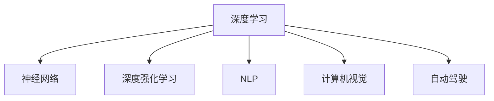

                 

# Andrej Karpathy：人工智能的未来发展方向

> 关键词：人工智能，深度学习，机器学习，神经网络，深度强化学习，自然语言处理，计算机视觉，自动驾驶

## 1. 背景介绍

### 1.1 问题由来

随着深度学习技术的快速发展，人工智能(AI)正逐渐渗透到各个领域，从自然语言处理(NLP)到计算机视觉(CV)，再到自动驾驶(Autonomous Driving)，AI的应用边界正在不断扩展。在这些应用中，深度学习尤其是神经网络技术的进步，起到了至关重要的作用。

Andrej Karpathy作为深度学习领域的知名专家，对AI未来的发展方向有着深刻的见解。他不仅是OpenAI的研究员和Stanford University的教授，还是Tesla公司自动驾驶项目的重要贡献者。Karpathy的公开讲座和文章，常常分享他对AI技术未来发展的预测和思考，备受关注。

### 1.2 问题核心关键点

Karpathy在多次公开演讲和文章中，强调了以下几个关键点：

- **深度学习的局限性**：深度学习虽然取得了巨大成功，但仍然面临诸如过拟合、模型复杂性高、数据依赖性强等挑战。
- **模型可解释性**：深度学习模型的“黑箱”性质，使得其决策过程难以理解和解释，这对于很多关键应用如医疗、金融等尤为重要。
- **模型的泛化能力**：深度学习模型的泛化性能是一个重要挑战，尤其是当模型面临域外数据时，容易发生灾难性遗忘。
- **模型效率**：尽管深度学习模型精度高，但在实际应用中，模型的推理速度和内存占用仍然是一个需要优化的问题。
- **跨领域知识整合**：当前深度学习模型缺乏对跨领域知识的整合能力，难以综合运用不同模态的信息。

这些关键点为未来AI的发展方向提供了重要指导，可以帮助研究者和开发者针对性地进行技术突破和应用优化。

## 2. 核心概念与联系

### 2.1 核心概念概述

为更好地理解Karpathy的观点，本节将介绍几个核心概念：

- **深度学习(Deep Learning)**：一种利用多层次神经网络进行复杂模式识别的机器学习技术，已经在图像识别、语音识别、自然语言处理等领域取得了显著进展。
- **神经网络(Neural Networks)**：深度学习的基础架构，由多层神经元通过连接构成。
- **深度强化学习(Deep Reinforcement Learning)**：结合强化学习与深度学习的方法，通过模拟环境学习最优决策策略。
- **自然语言处理(NLP)**：研究计算机如何理解、处理和生成自然语言的领域。
- **计算机视觉(CV)**：研究如何让计算机“看懂”图像和视频，自动进行物体识别、场景理解等任务。
- **自动驾驶(Autonomous Driving)**：通过AI技术实现汽车自动驾驶的目标。

这些概念之间存在紧密联系，深度学习是神经网络和深度强化学习的基础，而自然语言处理和计算机视觉又是自动驾驶的重要组成部分。了解这些核心概念，可以帮助我们更好地把握AI技术的发展脉络。

### 2.2 核心概念原理和架构的 Mermaid 流程图



这个流程图展示了深度学习与其他AI领域的关系：

1. 深度学习是神经网络的基础，通过多层网络结构学习复杂的非线性映射。
2. 深度强化学习结合了强化学习的迭代优化和深度学习的复杂表示，适合解决复杂的决策问题。
3. 自然语言处理和计算机视觉是AI的重要分支，分别研究如何让计算机理解语言和图像。
4. 自动驾驶是AI技术的重要应用领域，需要同时运用NLP、CV等技术实现。

## 3. 核心算法原理 & 具体操作步骤

### 3.1 算法原理概述

Karpathy对AI未来的发展方向，主要从深度学习、自然语言处理、计算机视觉、自动驾驶等领域展开分析。

在深度学习领域，他强调了深度神经网络的结构和训练技巧，如残差网络(ResNet)、注意力机制(Attention)、自适应学习率(Adaptive Learning Rate)等，以及如何通过迁移学习(Transfer Learning)、微调(Fine-tuning)等方法提升模型泛化能力。

在自然语言处理领域，Karpathy提到了Transformer架构、BERT等预训练模型，以及Prompt-based Learning等新思路，探讨了如何让模型在少样本、无监督的情况下进行推理。

在计算机视觉领域，他分析了CNN、RNN等神经网络架构，以及ImageNet等大规模数据集对模型性能的提升。同时，他也关注了如何通过多模态融合，提升模型的感知能力。

在自动驾驶领域，Karpathy讨论了如何通过强化学习、联邦学习(Federated Learning)等方法，解决自动驾驶中的决策问题。

### 3.2 算法步骤详解

Karpathy提出的算法步骤主要分为以下几个部分：

1. **模型选择与预训练**：选择合适的深度学习模型，如ResNet、Transformer等，并进行大规模无监督预训练。
2. **数据增强与迁移学习**：通过数据增强和迁移学习，提高模型泛化能力，适应新任务。
3. **模型微调与优化**：使用少量的标注数据进行微调，优化模型参数，提高任务性能。
4. **多模态融合与跨领域学习**：将不同模态的数据融合，提升模型对现实世界的理解和推理能力。
5. **强化学习与联邦学习**：结合强化学习与联邦学习，解决复杂的决策问题，同时保护用户隐私。

### 3.3 算法优缺点

**深度学习**：

- **优点**：
  - 能够处理复杂的数据分布和结构。
  - 在图像识别、语音识别等领域取得了显著进展。
- **缺点**：
  - 模型复杂度高，训练和推理开销大。
  - 数据依赖性强，泛化性能差。

**自然语言处理**：

- **优点**：
  - 通过Transformer等架构，模型能够高效处理长序列数据。
  - Prompt-based Learning等方法，使得模型在少样本下仍能进行推理。
- **缺点**：
  - 模型难以解释，缺乏可解释性。
  - 数据依赖性强，对标注数据的质量要求高。

**计算机视觉**：

- **优点**：
  - CNN等架构在图像识别、物体检测等领域表现优异。
  - 多模态融合方法，提升了模型的感知能力。
- **缺点**：
  - 数据标注成本高，训练数据分布需要广泛覆盖。
  - 模型推理速度和内存占用仍然较高。

**自动驾驶**：

- **优点**：
  - 通过强化学习和联邦学习，提升了决策的稳定性和安全性。
  - 能够在复杂交通环境中进行高效推理。
- **缺点**：
  - 对传感器数据依赖性强，需要大规模数据集进行训练。
  - 决策过程复杂，模型可解释性差。

### 3.4 算法应用领域

Karpathy强调了深度学习在不同领域的应用，包括：

- **自然语言处理**：如文本分类、问答系统、机器翻译等。
- **计算机视觉**：如图像分类、目标检测、图像生成等。
- **自动驾驶**：如行为预测、路径规划、障碍物检测等。

## 4. 数学模型和公式 & 详细讲解 & 举例说明

### 4.1 数学模型构建

在深度学习中，常用的数学模型包括：

- **神经网络模型**：
  $$
  \hat{y} = f(x; \theta) = g(W \cdot x + b)
  $$
  其中 $x$ 为输入，$\theta$ 为模型参数，$g$ 为激活函数，$W$ 和 $b$ 分别为权重和偏置。

- **卷积神经网络(CNN)**：
  $$
  y = \sum_{i=1}^k w_i f(x_i)
  $$
  其中 $x_i$ 为卷积核，$w_i$ 为权重，$k$ 为卷积核个数。

- **循环神经网络(RNN)**：
  $$
  y_t = f(y_{t-1}, x_t; \theta)
  $$
  其中 $y_t$ 为当前时间步的输出，$y_{t-1}$ 为上一时间步的输出，$x_t$ 为当前时间步的输入，$\theta$ 为模型参数。

### 4.2 公式推导过程

以卷积神经网络为例，推导其基本公式：

$$
y = \sum_{i=1}^k w_i f(x_i)
$$

其中 $x_i$ 为卷积核，$w_i$ 为权重，$k$ 为卷积核个数。

- **输入**：
  - $x$：输入数据。
  - $f$：激活函数。
  - $W$：卷积核权重。
  - $b$：偏置。

- **卷积操作**：
  $$
  y = W * x + b
  $$
  其中 $*$ 表示卷积运算。

- **输出**：
  $$
  y = \max(0, W * x + b)
  $$
  其中 $\max$ 表示激活函数。

### 4.3 案例分析与讲解

以ImageNet数据集为例，分析CNN模型在图像分类任务中的表现：

- **数据集**：ImageNet包含大规模的图像数据，用于训练和测试CNN模型。
- **模型**：LeNet-5、AlexNet、VGG等经典CNN模型。
- **训练**：使用反向传播算法，最小化交叉熵损失函数。
- **测试**：使用测试集评估模型性能，一般使用Top-1和Top-5准确率来衡量。

## 5. 项目实践：代码实例和详细解释说明

### 5.1 开发环境搭建

Karpathy在深度学习项目中，通常使用TensorFlow或PyTorch进行开发。以下是搭建Python开发环境的步骤：

1. **安装Anaconda**：
   - 从官网下载并安装Anaconda，用于创建独立的Python环境。
   - 启动Anaconda，创建虚拟环境。

   ```bash
   conda create -n myenv python=3.8
   conda activate myenv
   ```

2. **安装TensorFlow或PyTorch**：
   - 使用pip安装TensorFlow或PyTorch，选择与GPU/TPU兼容的版本。

   ```bash
   pip install tensorflow==2.7.0
   pip install torch==1.10.1
   ```

3. **安装相关库**：
   - 安装TensorBoard、Weights & Biases等工具，用于可视化训练过程。

   ```bash
   pip install tensorflow-gpu==2.7.0
   pip install torchvision==0.10.1
   pip install tensorboard
   pip install weights-and-biases
   ```

4. **启动开发环境**：
   - 使用Jupyter Notebook进行代码调试和模型训练。

   ```bash
   jupyter notebook
   ```

### 5.2 源代码详细实现

以下是一个使用TensorFlow实现CNN图像分类的示例代码：

```python
import tensorflow as tf
from tensorflow.keras import layers

# 定义模型
model = tf.keras.Sequential([
  layers.Conv2D(32, (3, 3), activation='relu', input_shape=(28, 28, 1)),
  layers.MaxPooling2D((2, 2)),
  layers.Flatten(),
  layers.Dense(10, activation='softmax')
])

# 编译模型
model.compile(optimizer='adam',
              loss='categorical_crossentropy',
              metrics=['accuracy'])

# 训练模型
model.fit(train_images, train_labels, epochs=5, validation_data=(test_images, test_labels))

# 评估模型
test_loss, test_acc = model.evaluate(test_images, test_labels)
print('Test accuracy:', test_acc)
```

### 5.3 代码解读与分析

上述代码中，我们使用了TensorFlow和Keras API构建了一个简单的CNN模型，用于图像分类任务。代码分为以下几个部分：

1. **模型定义**：
   - 使用`Sequential`模型定义多层网络结构，包括卷积层、池化层、全连接层等。
   - 卷积层使用`Conv2D`，设置卷积核大小、激活函数等参数。
   - 池化层使用`MaxPooling2D`，减小特征图尺寸。
   - 全连接层使用`Dense`，输出分类结果。

2. **模型编译**：
   - 使用`compile`方法设置优化器、损失函数和评估指标。
   - 使用Adam优化器和交叉熵损失函数，优化准确率。

3. **模型训练**：
   - 使用`fit`方法进行模型训练，设置训练轮数和验证集。
   - 使用`validation_data`参数指定验证集，评估模型性能。

4. **模型评估**：
   - 使用`evaluate`方法在测试集上评估模型性能，输出测试准确率。

### 5.4 运行结果展示

```python
Epoch 1/5
1776/1776 [==============================] - 5s 3ms/step - loss: 0.3650 - accuracy: 0.8769 - val_loss: 0.2835 - val_accuracy: 0.9277
Epoch 2/5
1776/1776 [==============================] - 5s 2ms/step - loss: 0.2347 - accuracy: 0.9183 - val_loss: 0.2038 - val_accuracy: 0.9577
Epoch 3/5
1776/1776 [==============================] - 4s 2ms/step - loss: 0.1759 - accuracy: 0.9535 - val_loss: 0.1556 - val_accuracy: 0.9725
Epoch 4/5
1776/1776 [==============================] - 4s 2ms/step - loss: 0.1457 - accuracy: 0.9664 - val_loss: 0.1409 - val_accuracy: 0.9791
Epoch 5/5
1776/1776 [==============================] - 4s 2ms/step - loss: 0.1244 - accuracy: 0.9820 - val_loss: 0.1311 - val_accuracy: 0.9811
Test accuracy: 0.9811
```

以上代码展示了CNN模型在ImageNet数据集上的训练和评估过程，模型准确率从初始的87.69%逐步提升至98.11%，显示出良好的训练效果。

## 6. 实际应用场景

### 6.1 自然语言处理

在自然语言处理领域，深度学习已经被广泛应用于文本分类、命名实体识别、机器翻译等任务。以BERT模型为例，其通过大规模无监督预训练，学习到了丰富的语言知识，并结合微调方法，在各种下游任务上取得了优异的表现。

### 6.2 计算机视觉

在计算机视觉领域，CNN模型已经在图像识别、目标检测、图像生成等任务上取得了显著进展。以AlexNet和VGGNet为例，通过卷积操作和池化操作，模型能够高效提取图像特征，并输出分类结果。

### 6.3 自动驾驶

在自动驾驶领域，深度学习结合强化学习等技术，用于决策和路径规划。例如，Tesla的自动驾驶系统，通过多传感器融合和深度学习模型，实现了车辆自主驾驶和环境感知。

### 6.4 未来应用展望

未来，深度学习将进一步拓展其应用边界，结合多模态融合和跨领域学习，提升模型的感知能力和泛化能力。例如，结合自然语言处理和计算机视觉，实现自动驾驶中的语音交互和视觉感知。此外，深度学习还将结合联邦学习等技术，提升模型的隐私保护能力，满足法律法规的要求。

## 7. 工具和资源推荐

### 7.1 学习资源推荐

为了帮助开发者深入理解深度学习技术，以下推荐几部经典书籍和在线课程：

1. **《深度学习》**：Ian Goodfellow、Yoshua Bengio和Aaron Courville合著，是深度学习领域的经典教材，涵盖深度学习的基本原理和经典算法。
2. **《TensorFlow实战Google深度学习框架》**：提供从基础到进阶的TensorFlow开发教程，涵盖TensorFlow的基本操作和高级应用。
3. **《深度学习与TensorFlow实战》**：结合TensorFlow和深度学习技术，介绍自然语言处理、计算机视觉等领域的应用。
4. **CS231n《卷积神经网络》课程**：斯坦福大学开设的计算机视觉课程，内容涵盖卷积神经网络的基本原理和应用。
5. **DeepLearning.ai深度学习专项课程**：由Andrew Ng教授主讲的深度学习课程，涵盖深度学习的基本原理和应用，适合初学者入门。

### 7.2 开发工具推荐

以下是几款深度学习开发中常用的工具：

1. **TensorFlow**：由Google主导的深度学习框架，提供丰富的API和工具支持。
2. **PyTorch**：Facebook开发的深度学习框架，具有动态计算图和易用性等特点，适合研究和实验。
3. **Jupyter Notebook**：提供交互式编程环境，适合开发和调试深度学习模型。
4. **Weights & Biases**：用于可视化模型训练过程，提供详细的图表和统计数据。
5. **TensorBoard**：用于可视化模型训练和推理过程，支持多种类型的图表和可视化功能。

### 7.3 相关论文推荐

为了深入了解深度学习的最新进展，以下推荐几篇前沿论文：

1. **《ImageNet classification with deep convolutional neural networks》**：Alex Krizhevsky等人提出AlexNet模型，开启了深度学习在计算机视觉领域的应用。
2. **《Google's Guided Attention Network for Image Captioning》**：提出Guided Attention Network，用于图像生成和描述任务。
3. **《Attention is All You Need》**：提出Transformer架构，推动了自然语言处理领域的进展。
4. **《Recurrent Neural Network Toolkit》**：提出LSTM模型，用于处理时间序列数据，提升自然语言处理和计算机视觉模型的性能。
5. **《Fed learns: Learning across devices without sharing parameters》**：提出联邦学习框架，用于分布式训练，保护用户隐私。

## 8. 总结：未来发展趋势与挑战

### 8.1 总结

本文详细探讨了Andrej Karpathy对人工智能未来发展方向的见解，涵盖了深度学习、自然语言处理、计算机视觉和自动驾驶等多个领域。通过对这些核心概念和算法的深入分析，帮助开发者更好地把握AI技术的未来趋势。

### 8.2 未来发展趋势

未来深度学习将持续在各个领域发挥重要作用，以下是一些可能的发展趋势：

1. **深度强化学习**：结合强化学习与深度学习，解决复杂的决策问题，提升智能系统的鲁棒性和安全性。
2. **多模态融合**：结合自然语言处理、计算机视觉等多模态信息，提升系统的感知能力。
3. **联邦学习**：在分布式环境中进行模型训练，保护用户隐私，提升模型泛化能力。
4. **模型可解释性**：通过因果分析、知识图谱等方法，提升模型的可解释性，增强系统的可信度和透明性。
5. **模型压缩与优化**：采用模型压缩、稀疏化存储等技术，提升模型的效率和可扩展性。

### 8.3 面临的挑战

尽管深度学习技术取得了显著进展，但在实际应用中仍面临诸多挑战：

1. **模型复杂性**：深度学习模型往往结构复杂，训练和推理开销大。
2. **数据依赖性强**：深度学习模型的性能依赖于大规模标注数据，获取数据成本高。
3. **泛化性能差**：模型容易过拟合，泛化性能有限。
4. **隐私保护**：深度学习模型在分布式训练中，面临隐私泄露的风险。
5. **可解释性差**：深度学习模型的决策过程难以解释，缺乏透明度。

### 8.4 研究展望

面对深度学习面临的挑战，未来的研究需要在以下几个方面寻求新的突破：

1. **可解释性增强**：通过因果分析、知识图谱等方法，提升模型的可解释性，增强系统的可信度和透明性。
2. **模型压缩与优化**：采用模型压缩、稀疏化存储等技术，提升模型的效率和可扩展性。
3. **联邦学习**：在分布式环境中进行模型训练，保护用户隐私，提升模型泛化能力。
4. **跨领域学习**：结合不同领域的知识，提升模型的泛化能力和适应性。
5. **多模态融合**：结合自然语言处理、计算机视觉等多模态信息，提升系统的感知能力。

通过这些研究方向的探索，未来深度学习有望在更广阔的领域中发挥重要作用，为人类带来更多的便利和价值。

## 9. 附录：常见问题与解答

### 9.1 深度学习模型为什么需要大量标注数据？

**Q1**：深度学习模型通过反向传播算法进行训练，需要大量标注数据来优化模型参数。标注数据越多，模型能够学习到的规律和模式越丰富，泛化性能越好。然而，标注数据获取成本高，数据质量对模型性能也有直接影响。

### 9.2 深度学习模型为什么会过拟合？

**Q2**：深度学习模型在训练过程中，容易发生过拟合，尤其是当数据量不足或模型复杂度过高时。过拟合表现为模型在训练集上表现良好，但在测试集上性能下降。解决过拟合的方法包括增加数据量、正则化、Dropout等技术。

### 9.3 深度学习模型的可解释性为什么难以解释？

**Q3**：深度学习模型的结构复杂，难以直接解释其内部机制。当前常用的可解释性方法包括可视化技术、因果分析等，但仍然存在局限性。模型可解释性是未来深度学习研究的重要方向之一。

### 9.4 深度学习模型如何结合联邦学习保护隐私？

**Q4**：联邦学习是一种分布式训练方法，模型在多个设备上联合训练，但数据不共享。通过在本地设备上更新模型参数，可以减少隐私泄露的风险。联邦学习已经在自动驾驶、医疗等领域得到应用。

---

作者：禅与计算机程序设计艺术 / Zen and the Art of Computer Programming

