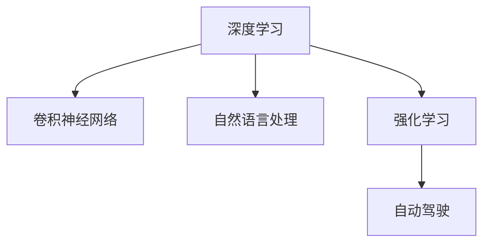

                 

# Andrej Karpathy：人工智能的未来发展机遇

> 关键词：人工智能,深度学习,深度神经网络,卷积神经网络,计算机视觉,自然语言处理,强化学习,自动驾驶,未来展望

## 1. 背景介绍

### 1.1 问题由来

在过去十年中，人工智能(AI)领域取得了飞速的发展。这一进步离不开深度学习(Deep Learning)技术的突破，尤其是深度神经网络(Deep Neural Networks, DNNs)的广泛应用。深度学习技术已广泛应用于计算机视觉、自然语言处理、自动驾驶等多个领域，并取得了一系列令人瞩目的成果。

本系列文章旨在深入探讨深度学习技术的核心概念和实际应用，重点介绍人工智能领域的最新进展和未来发展方向。本文将首先回顾Andrej Karpathy博士在深度学习领域的贡献，并分析其对未来AI发展的洞见。

### 1.2 问题核心关键点

Andrej Karpathy博士，作为人工智能领域的领军人物，在深度学习，尤其是计算机视觉领域，做出了重要贡献。其研究成果不仅推动了AI技术的发展，还为AI的未来发展方向提供了深刻的洞见。本文将重点探讨以下几个关键问题：

- Andrej Karpathy博士的主要研究方向和贡献
- 深度学习技术在计算机视觉中的应用
- 深度学习技术在自然语言处理中的最新进展
- 深度学习在自动驾驶中的实践和未来展望
- AI技术的未来发展方向和机遇

## 2. 核心概念与联系

### 2.1 核心概念概述

为更好地理解Andrej Karpathy博士的贡献及其对AI未来的展望，本节将介绍几个密切相关的核心概念：

- **深度学习(Deep Learning)**：一种基于人工神经网络的机器学习方法，通过多层次的神经网络模型，实现复杂的特征提取和模式识别。
- **卷积神经网络(Convolutional Neural Networks, CNNs)**：一种广泛应用于计算机视觉中的深度学习模型，通过卷积层、池化层等结构，实现图像特征的提取和分类。
- **自然语言处理(Natural Language Processing, NLP)**：研究如何让计算机理解和处理人类语言的技术，包括机器翻译、语音识别、文本分类等任务。
- **强化学习(Reinforcement Learning, RL)**：一种通过试错学习，逐步优化决策策略的方法，常用于游戏AI、自动驾驶等需要智能决策的场景。
- **自动驾驶(Autonomous Driving)**：使用AI技术实现车辆自主导航和决策的系统，包括环境感知、路径规划、行为控制等。

这些核心概念之间的逻辑关系可以通过以下Mermaid流程图来展示：



这个流程图展示了许多关键概念之间的关系：

1. 深度学习是所有这些技术的基础。
2. CNNs是深度学习在计算机视觉领域的重要应用。
3. NLP利用深度学习处理文本数据。
4. RL利用深度学习优化决策策略。
5. 自动驾驶是强化学习在实际应用中的重要场景。

## 3. 核心算法原理 & 具体操作步骤
### 3.1 算法原理概述

深度学习技术，特别是卷积神经网络(CNNs)，在计算机视觉任务中展现了强大的能力。其核心思想是通过多层次的非线性变换，自动提取输入数据的特征表示，并通过全连接层进行分类或回归。

本节将详细探讨Andrej Karpathy博士在卷积神经网络方面的贡献，及其对未来AI发展的展望。

### 3.2 算法步骤详解

#### 3.2.1 CNNs的层次结构

卷积神经网络通常由以下几个层次组成：

1. **卷积层(Convolutional Layer)**：通过卷积运算提取输入数据的局部特征。
2. **池化层(Pooling Layer)**：通过降采样操作减少特征图的大小，提高计算效率。
3. **全连接层(Fully Connected Layer)**：将特征图转换为分类或回归的输出。

具体步骤如下：

1. **初始化卷积核(Filter)**：设定卷积核的尺寸和数量，用于提取输入数据的特征。
2. **前向传播(Forward Propagation)**：对输入数据进行卷积运算，得到特征图。
3. **池化操作(Pooling)**：对特征图进行降采样操作，减少计算量。
4. **反向传播(Backward Propagation)**：通过计算梯度，更新卷积核的参数，优化模型。

#### 3.2.2 CNNs的优化技巧

为提高CNNs的性能，Andrej Karpathy提出以下优化技巧：

1. **数据增强(Data Augmentation)**：通过对输入数据进行旋转、翻转、裁剪等操作，生成更多的训练样本。
2. **批标准化(Batch Normalization)**：通过对每个批次的特征进行标准化处理，提高模型的稳定性。
3. **残差连接(Residual Connection)**：通过跨层连接，提高网络的表达能力。
4. **梯度裁剪(Gradient Clipping)**：通过限制梯度的最大值，避免梯度爆炸。

### 3.3 算法优缺点

#### 3.3.1 优点

- **自动特征提取**：CNNs可以自动学习输入数据的特征表示，无需手动设计特征提取器。
- **处理大规模数据**：CNNs能够处理大规模图像数据，通过并行计算加速训练过程。
- **高准确性**：在图像分类、目标检测等任务中，CNNs已展现出接近人类的性能。

#### 3.3.2 缺点

- **参数量庞大**：CNNs的参数量通常很大，训练过程复杂且易过拟合。
- **计算资源需求高**：高参数量和高并行计算需求，对计算资源提出了较高的要求。
- **可解释性差**：CNNs的内部机制复杂，难以解释其决策过程。

### 3.4 算法应用领域

CNNs在计算机视觉领域的应用广泛，包括但不限于：

- **图像分类**：如识别手写数字、分类动物等。
- **目标检测**：如在图像中定位物体位置和类别。
- **人脸识别**：如在视频中识别特定人物。
- **医疗影像分析**：如检测病变区域、分析X光片等。
- **自动驾驶**：如环境感知、行为预测等。

此外，CNNs在自然语言处理领域也有重要应用，如文本分类、情感分析、机器翻译等。

## 4. 数学模型和公式 & 详细讲解 & 举例说明

### 4.1 数学模型构建

本节将使用数学语言对卷积神经网络的结构和优化方法进行更加严格的刻画。

设输入数据为 $x \in \mathbb{R}^m$，卷积核为 $w \in \mathbb{R}^n$，卷积运算为 $f(x, w) = x * w$，池化操作为 $h(x) = \frac{1}{s} \sum_{i=1}^s x_i$，其中 $s$ 为池化核大小。

卷积神经网络的总体结构可表示为：

$$
y = f(w_1 \ast f(w_2 \ast \cdots f(w_l \ast x) \cdots), p)
$$

其中 $y \in \mathbb{R}^k$ 为输出结果，$w_i \in \mathbb{R}^n$ 为第 $i$ 层的卷积核，$f(\cdot)$ 为卷积运算，$p$ 为池化操作。

### 4.2 公式推导过程

以简单的二维卷积为例，假设输入数据大小为 $n \times n$，卷积核大小为 $m \times m$，步幅为 $1$，填充为 $0$。卷积运算可表示为：

$$
f(x, w) = \sum_{i=1}^m \sum_{j=1}^m x_{i-1,j-1} \times w_{i,j}
$$

池化操作可表示为：

$$
h(x) = \frac{1}{s \times s} \sum_{i=1}^s \sum_{j=1}^s f(x_{i-1,j-1}, w)
$$

### 4.3 案例分析与讲解

假设训练一个手写数字识别模型，使用MNIST数据集。模型结构为：

- 输入数据大小为 $28 \times 28$，卷积核大小为 $3 \times 3$，步幅为 $1$，填充为 $0$。
- 卷积层有多个，每个卷积层后接一个ReLU激活函数和一个MaxPooling层。
- 全连接层将特征图转换为10个输出节点，用于分类。

使用交叉熵损失函数进行训练，定义优化器，进行前向传播和反向传播，更新模型参数。

## 5. 项目实践：代码实例和详细解释说明

### 5.1 开发环境搭建

在进行CNNs实践前，我们需要准备好开发环境。以下是使用Python进行Keras开发的环境配置流程：

1. 安装Anaconda：从官网下载并安装Anaconda，用于创建独立的Python环境。

2. 创建并激活虚拟环境：
```bash
conda create -n cnn-env python=3.8 
conda activate cnn-env
```

3. 安装必要的Python包：
```bash
pip install tensorflow==2.6.0 keras==2.8.0 matplotlib
```

完成上述步骤后，即可在`cnn-env`环境中开始CNNs实践。

### 5.2 源代码详细实现

这里我们以手写数字识别任务为例，给出使用Keras实现卷积神经网络的代码实现。

```python
from tensorflow.keras.datasets import mnist
from tensorflow.keras.models import Sequential
from tensorflow.keras.layers import Conv2D, MaxPooling2D, Flatten, Dense
from tensorflow.keras.utils import to_categorical
import matplotlib.pyplot as plt

# 加载MNIST数据集
(x_train, y_train), (x_test, y_test) = mnist.load_data()

# 数据预处理
x_train = x_train.reshape(-1, 28, 28, 1) / 255.0
x_test = x_test.reshape(-1, 28, 28, 1) / 255.0
y_train = to_categorical(y_train)
y_test = to_categorical(y_test)

# 构建卷积神经网络模型
model = Sequential()
model.add(Conv2D(32, kernel_size=(3, 3), activation='relu', input_shape=(28, 28, 1)))
model.add(MaxPooling2D(pool_size=(2, 2)))
model.add(Conv2D(64, kernel_size=(3, 3), activation='relu'))
model.add(MaxPooling2D(pool_size=(2, 2)))
model.add(Flatten())
model.add(Dense(128, activation='relu'))
model.add(Dense(10, activation='softmax'))

# 编译模型
model.compile(optimizer='adam', loss='categorical_crossentropy', metrics=['accuracy'])

# 训练模型
model.fit(x_train, y_train, epochs=10, batch_size=32, validation_data=(x_test, y_test))

# 评估模型
model.evaluate(x_test, y_test)

# 绘制训练过程
plt.plot(model.history.history['accuracy'], label='train')
plt.plot(model.history.history['val_accuracy'], label='test')
plt.legend()
plt.show()
```

### 5.3 代码解读与分析

让我们再详细解读一下关键代码的实现细节：

**数据预处理**：
- 将输入数据从二维数组转换为四维张量，并归一化到 [0,1] 区间。
- 将标签进行one-hot编码，方便模型训练。

**模型构建**：
- 使用`Sequential`模型容器，依次添加卷积层、池化层、全连接层。
- 卷积层使用3x3的卷积核，ReLU激活函数，步幅为1，填充为0。
- 池化层使用2x2的池化核，降低特征图大小。
- 全连接层使用128个神经元，输出层有10个节点，softmax激活函数。

**模型训练**：
- 使用`compile`方法设置优化器、损失函数和评估指标。
- 使用`fit`方法进行模型训练，定义训练轮数、批大小。
- 在每个epoch结束时，使用`evaluate`方法评估模型在测试集上的性能。

**模型评估与可视化**：
- 使用`evaluate`方法计算模型在测试集上的损失和准确率。
- 使用`plot`方法绘制训练过程，观察模型在训练和测试集上的性能变化。

可以看到，Keras提供了简单易用的接口，能够快速构建和训练卷积神经网络。开发者可以专注于模型的设计，而不必过多关注底层实现细节。

## 6. 实际应用场景

### 6.1 智能视频监控

卷积神经网络在计算机视觉中的应用不仅仅局限于图像分类。在智能视频监控领域，CNNs能够实时监测视频流，自动检测和报警异常行为，提升公共安全的保障水平。

通过训练CNNs模型，可以自动检测视频帧中的异常行为，如闯入、打斗等。模型能够自动学习行为特征，并实时输出检测结果。监控系统可以根据检测结果，进行报警或人工干预，保障公共安全。

### 6.2 医疗影像分析

在医疗影像分析领域，卷积神经网络已展现出巨大的潜力。通过训练CNNs模型，可以对X光片、CT、MRI等影像数据进行自动分析，辅助医生诊断疾病。

例如，使用CNNs模型可以检测肺结节、肿瘤等病变区域，快速准确地识别疾病。医疗影像分析系统可以将检测结果输出给医生，辅助诊断和治疗决策，提高医疗服务效率和质量。

### 6.3 自然语言处理

尽管卷积神经网络在图像领域表现出色，但在文本处理方面也有广泛应用。通过将文本转换为向量表示，CNNs可以用于文本分类、情感分析、机器翻译等任务。

例如，使用CNNs模型可以对新闻文章进行分类，判断其情感倾向，进行舆情监测。模型能够自动学习文本特征，提高情感分析的准确率。

### 6.4 自动驾驶

在自动驾驶领域，卷积神经网络被广泛应用于环境感知和行为预测。通过训练CNNs模型，可以识别路标、车辆、行人等环境要素，并进行行为预测和路径规划。

例如，使用CNNs模型可以实时识别交通标志和红绿灯，辅助车辆进行路径规划。模型能够自动学习环境要素和行为模式，提高自动驾驶的安全性和可靠性。

## 7. 工具和资源推荐

### 7.1 学习资源推荐

为了帮助开发者系统掌握深度学习技术，这里推荐一些优质的学习资源：

1. **《深度学习》(Deep Learning) by Ian Goodfellow, Yoshua Bengio, Aaron Courville**：全面介绍了深度学习的基本概念和核心技术，是深度学习领域的经典教材。
2. **CS231n: Convolutional Neural Networks for Visual Recognition**：斯坦福大学开设的计算机视觉课程，涵盖了CNNs的核心算法和应用，有Lecture视频和配套作业。
3. **自然语言处理综述：CS224N (Stanford)**：斯坦福大学开设的自然语言处理课程，介绍了NLP中的核心技术和应用。
4. **强化学习综述：CS294 (UC Berkeley)**：加州伯克利大学开设的强化学习课程，涵盖了强化学习的基本理论和应用。
5. **TensorFlow官方文档**：提供了丰富的深度学习资源和样例代码，适合快速上手实践。
6. **Keras官方文档**：提供了Keras框架的使用指南和样例代码，适合快速构建深度学习模型。

通过对这些资源的学习实践，相信你一定能够快速掌握深度学习技术的精髓，并用于解决实际的计算机视觉和自然语言处理问题。

### 7.2 开发工具推荐

高效的开发离不开优秀的工具支持。以下是几款用于深度学习开发的常用工具：

1. **TensorFlow**：由Google主导开发的深度学习框架，生产部署方便，适合大规模工程应用。
2. **PyTorch**：Facebook开发的深度学习框架，灵活动态的计算图，适合快速迭代研究。
3. **Keras**：基于TensorFlow和Theano的高级深度学习框架，提供简单易用的API。
4. **OpenCV**：开源计算机视觉库，提供丰富的图像处理和分析功能。
5. **NLTK**：自然语言处理工具包，提供了文本处理和分析的常用工具。
6. **TensorBoard**：TensorFlow配套的可视化工具，可实时监测模型训练状态，提供丰富的图表呈现方式。

合理利用这些工具，可以显著提升深度学习任务的开发效率，加快创新迭代的步伐。

### 7.3 相关论文推荐

深度学习技术的不断发展，离不开学界的持续研究。以下是几篇奠基性的相关论文，推荐阅读：

1. **AlexNet: One Millisecond Image Classification with Deep Convolutional Neural Networks**：提出了深度卷积神经网络，在ImageNet图像分类任务中刷新了SOTA。
2. **ResNet: Deep Residual Learning for Image Recognition**：提出了残差连接，解决了深度网络训练中的梯度消失问题，进一步提升了深度神经网络的性能。
3. **InceptionNet: Going Deeper with Convolutions**：提出了Inception模块，通过多尺度卷积和并行处理，提高了卷积神经网络的性能。
4. **RNN: Learning Phrase Representations using RNN Encoder–Decoder for Statistical Machine Translation**：提出了循环神经网络(RNN)，用于机器翻译任务，取得了显著的进展。
5. **Transformer: Attention Is All You Need**：提出了自注意力机制(Transformer)，显著提升了NLP任务的性能。

这些论文代表了大规模深度学习模型的发展脉络。通过学习这些前沿成果，可以帮助研究者把握学科前进方向，激发更多的创新灵感。

## 8. 总结：未来发展趋势与挑战

### 8.1 总结

本文对卷积神经网络在深度学习中的应用进行了全面系统的介绍。首先回顾了Andrej Karpathy博士在计算机视觉领域的贡献，并探讨了卷积神经网络的核心算法和实际应用。通过这些内容，读者可以深入理解卷积神经网络的工作原理和优化方法。

通过本文的系统梳理，可以看到，卷积神经网络在计算机视觉和自然语言处理领域已展现出强大的能力，为AI技术的发展提供了坚实的基础。未来，伴随技术的不断进步，卷积神经网络的应用将更加广泛，成为推动AI技术发展的关键引擎。

### 8.2 未来发展趋势

展望未来，深度学习技术将继续引领AI领域的发展，呈现以下几个趋势：

1. **模型规模持续增大**：随着算力成本的下降和数据规模的扩张，深度学习模型的参数量将进一步增大，模型性能也将随之提升。
2. **模型的多样性增加**：除了卷积神经网络，未来将涌现更多类型的深度学习模型，如循环神经网络、变分自编码器等。
3. **模型的可解释性增强**：深度学习模型的复杂性和黑盒特性，使其可解释性不足。未来将开发更多可解释的模型，提高模型的透明性。
4. **模型的鲁棒性提升**：深度学习模型在面对对抗攻击、噪声干扰等情况时，容易出现鲁棒性不足的问题。未来将研究鲁棒性强的模型，提高系统的稳定性和可靠性。
5. **模型的高效性增强**：深度学习模型的计算资源消耗大，未来将研究更加高效的模型结构和算法，降低计算成本。
6. **模型的融合与集成**：深度学习模型可以与其他技术（如强化学习、自然语言处理）进行融合，形成更加全面、智能的系统。

以上趋势凸显了深度学习技术的广阔前景。这些方向的探索发展，将进一步推动深度学习模型的性能提升和应用范围拓展。

### 8.3 面临的挑战

尽管深度学习技术取得了显著的进展，但在迈向更加智能化、普适化应用的过程中，仍面临诸多挑战：

1. **数据量的限制**：深度学习模型需要大量的标注数据进行训练，获取高质量的标注数据成本较高。如何利用无监督学习和自监督学习，降低数据依赖，是未来研究的重点。
2. **计算资源的限制**：深度学习模型计算资源消耗大，对计算硬件提出了较高的要求。如何降低计算成本，提高模型效率，是未来研究的关键。
3. **模型的可解释性不足**：深度学习模型内部的黑盒特性，使其难以解释其决策过程。如何提高模型的透明性和可解释性，是未来研究的重要方向。
4. **模型的鲁棒性不足**：深度学习模型在面对对抗攻击、噪声干扰等情况时，容易出现鲁棒性不足的问题。如何提高模型的稳定性和可靠性，是未来研究的关键。
5. **模型的泛化能力不足**：深度学习模型在面对不同领域的数据时，泛化能力不足。如何提高模型的泛化能力，使其在多样化的数据上表现稳定，是未来研究的重要方向。
6. **模型的安全性和隐私保护**：深度学习模型可能存在数据泄露和隐私保护问题。如何保护用户数据隐私，增强模型的安全性，是未来研究的重要方向。

正视深度学习面临的这些挑战，积极应对并寻求突破，将使深度学习技术更加成熟，为AI领域的发展带来新的动力。

### 8.4 研究展望

未来的深度学习研究将集中在以下几个方向：

1. **无监督学习和自监督学习**：利用无标签数据进行训练，降低对标注数据的依赖。
2. **模型的高效性和可解释性**：开发高效模型结构，提高模型的透明性和可解释性。
3. **模型的鲁棒性和泛化能力**：提高模型的鲁棒性和泛化能力，使其在多样化的数据上表现稳定。
4. **模型的融合与集成**：将深度学习模型与其他技术（如强化学习、自然语言处理）进行融合，形成更加全面、智能的系统。
5. **模型的安全性和隐私保护**：保护用户数据隐私，增强模型的安全性。

这些方向的研究将进一步推动深度学习技术的成熟，为AI领域的发展提供坚实的技术基础。

## 9. 附录：常见问题与解答

**Q1: 深度学习模型的可解释性不足，如何改进？**

A: 深度学习模型的可解释性不足是一个重要的研究方向。目前，可以通过以下方法改进：
1. **可视化**：使用可视化工具，如梯度热力图、活度热图等，分析模型内部特征。
2. **简化模型**：设计更简单、更紧凑的模型结构，减少模型复杂性。
3. **可解释性技术**：使用可解释性技术，如LIME、SHAP等，生成模型决策的解释。

**Q2: 深度学习模型容易过拟合，如何防止？**

A: 深度学习模型容易过拟合，可以通过以下方法防止：
1. **数据增强**：通过旋转、翻转、裁剪等操作，生成更多的训练样本。
2. **正则化**：使用L2正则、Dropout等正则化技术，防止模型过拟合。
3. **早停法**：在训练过程中，及时停止训练，避免模型过拟合。
4. **模型集成**：通过训练多个模型，取平均输出，防止模型过拟合。

**Q3: 深度学习模型计算资源消耗大，如何优化？**

A: 深度学习模型计算资源消耗大，可以通过以下方法优化：
1. **模型压缩**：通过剪枝、量化等方法，减少模型参数量。
2. **并行计算**：使用GPU、TPU等高性能计算硬件，提高计算效率。
3. **混合精度训练**：使用定点数训练，减少内存占用和计算速度。
4. **分布式训练**：使用分布式计算框架，提高训练速度。

**Q4: 深度学习模型在实际应用中如何部署？**

A: 深度学习模型在实际应用中，可以通过以下方式部署：
1. **模型裁剪**：去除不必要的层和参数，减小模型尺寸。
2. **模型量化**：将浮点模型转为定点模型，压缩存储空间。
3. **服务化封装**：将模型封装为标准化服务接口，便于集成调用。
4. **弹性伸缩**：根据请求流量动态调整资源配置，平衡服务质量和成本。
5. **监控告警**：实时采集系统指标，设置异常告警阈值，确保服务稳定性。

**Q5: 深度学习模型在自动驾驶中的应用前景？**

A: 深度学习模型在自动驾驶领域有着广泛的应用前景，具体包括：
1. **环境感知**：使用卷积神经网络，实时检测路标、车辆、行人等环境要素。
2. **行为预测**：使用循环神经网络，预测其他车辆的行驶轨迹和行为模式。
3. **路径规划**：使用深度学习模型，优化路径规划算法，提高自动驾驶的安全性和可靠性。

总之，深度学习技术在自动驾驶领域具有广阔的应用前景，能够提升驾驶体验和安全性，推动自动驾驶技术的发展。

---

作者：禅与计算机程序设计艺术 / Zen and the Art of Computer Programming

