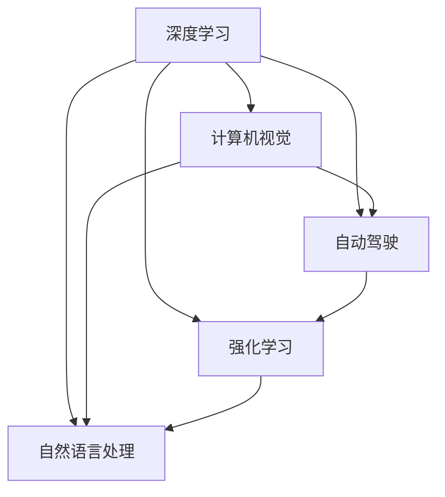

                 

# Andrej Karpathy：人工智能的未来发展目标

> 关键词：Andrej Karpathy, 人工智能, 未来发展目标, 深度学习, 计算机视觉, 自动驾驶, 强化学习, 自然语言处理

## 1. 背景介绍

Andrej Karpathy，深度学习领域的知名学者和工程师，曾任特斯拉自动驾驶部主管、斯坦福大学教授、Facebook AI首席AI科学家等职。其关于人工智能未来的发展目标，曾在多个场合发表，并引起广泛关注。本文将从Andrej Karpathy的观点出发，深入探讨人工智能的未来方向和技术突破。

## 2. 核心概念与联系

### 2.1 核心概念概述

Andrej Karpathy的演讲和文章中，涉及多个核心概念，包括深度学习、计算机视觉、自动驾驶、强化学习、自然语言处理等。这些概念紧密相连，共同构成了人工智能领域的研究框架和技术架构。

- **深度学习**：通过构建神经网络模型，训练大量数据，实现复杂的模式识别和预测。
- **计算机视觉**：让计算机具备识别和理解图像、视频等视觉信息的能力。
- **自动驾驶**：结合计算机视觉和深度学习，实现车辆的自主驾驶，提高道路安全和交通效率。
- **强化学习**：通过试错和反馈机制，让计算机学习最优策略，应用于游戏、机器人控制等领域。
- **自然语言处理**：使计算机具备理解和生成人类语言的能力，广泛应用于聊天机器人、语音识别等应用。

这些概念之间存在相互依赖和促进的关系，深度学习为其他领域提供了基本的技术手段，而具体应用场景（如计算机视觉、自动驾驶）则推动了技术进步。强化学习和自然语言处理作为两种重要的学习范式，拓展了深度学习的应用范围和深度。

### 2.2 核心概念原理和架构的 Mermaid 流程图



## 3. 核心算法原理 & 具体操作步骤

### 3.1 算法原理概述

Andrej Karpathy强调，深度学习模型的设计需要遵循“三层体系”：数据预处理层、模型主体层和结果解释层。这一体系在计算机视觉和自然语言处理等领域均有广泛应用。

- **数据预处理层**：通过数据清洗、增强、归一化等手段，提高数据质量，为模型训练提供良好的输入。
- **模型主体层**：基于神经网络构建的深度学习模型，通过训练数据学习特征表示。
- **结果解释层**：对模型的输出进行解释和优化，确保模型可解释性，提升应用效果。

这一体系的核心在于数据的处理和模型的训练，通过不断迭代优化，提升模型的性能和泛化能力。

### 3.2 算法步骤详解

Andrej Karpathy提出的深度学习模型构建和训练步骤如下：

1. **数据收集与预处理**：
   - 收集大量的标注数据，进行数据清洗和增强。
   - 对数据进行归一化、标准化等预处理。
   - 采用数据增强技术，如随机裁剪、旋转、翻转等，增加数据多样性。

2. **模型设计**：
   - 选择合适的深度学习框架，如PyTorch、TensorFlow等。
   - 设计合适的神经网络结构，如卷积神经网络（CNN）、循环神经网络（RNN）、变换器（Transformer）等。
   - 确定模型超参数，如学习率、批大小、迭代轮数等。

3. **模型训练**：
   - 使用GPU或TPU等高性能设备，加速模型训练。
   - 采用优化器（如SGD、Adam等）更新模型参数。
   - 监控训练过程中的损失函数和验证集准确率，防止过拟合。

4. **结果解释**：
   - 通过可视化工具（如TensorBoard）监控训练过程。
   - 采用特征可视化技术，如t-SNE、热力图等，解释模型的学习过程。
   - 采用模型蒸馏、集成学习等技术，提升模型性能。

### 3.3 算法优缺点

#### 优点

- **泛化能力强**：深度学习模型可以通过大规模数据训练，学习到通用的特征表示，具备较强的泛化能力。
- **自动特征提取**：模型可以自动从原始数据中提取高层次特征，无需人工设计。
- **可解释性强**：通过可视化工具和技术，可以解释模型的决策过程，增强模型可解释性。

#### 缺点

- **计算资源消耗大**：深度学习模型需要大量的计算资源和时间进行训练，对硬件要求较高。
- **模型复杂度高**：深层神经网络的结构复杂，难以调试和优化。
- **过拟合风险高**：当训练数据不足时，深度学习模型容易过拟合，泛化性能下降。

### 3.4 算法应用领域

Andrej Karpathy认为，深度学习技术已经广泛应用于多个领域，包括计算机视觉、自然语言处理、自动驾驶等。具体应用如下：

- **计算机视觉**：应用于图像分类、目标检测、图像生成等领域。如使用CNN模型进行图像分类、使用GAN模型进行图像生成等。
- **自然语言处理**：应用于文本分类、情感分析、机器翻译等领域。如使用RNN模型进行文本分类、使用Transformer模型进行机器翻译等。
- **自动驾驶**：应用于自动驾驶车辆的控制和决策。如使用深度学习模型进行道路感知、障碍物检测等。

## 4. 数学模型和公式 & 详细讲解 & 举例说明

### 4.1 数学模型构建

Andrej Karpathy的深度学习模型构建基于以下数学模型：

$$
\min_{\theta} \frac{1}{N} \sum_{i=1}^N \ell(x_i, y_i; \theta)
$$

其中，$x_i$ 为输入数据，$y_i$ 为标签，$\ell$ 为损失函数，$\theta$ 为模型参数。

### 4.2 公式推导过程

以计算机视觉中的目标检测为例，目标检测模型通常使用卷积神经网络（CNN）进行特征提取和分类。目标检测的数学模型为：

$$
\min_{\theta} \frac{1}{N} \sum_{i=1}^N \left( \ell_{cls}(y_i, \hat{y}_i) + \ell_{reg}(x_i, \hat{x}_i) \right)
$$

其中，$\ell_{cls}$ 为分类损失，$\ell_{reg}$ 为回归损失，$\hat{y}_i$ 为模型预测的分类标签，$\hat{x}_i$ 为模型预测的目标位置。

### 4.3 案例分析与讲解

以目标检测任务为例，Andrej Karpathy详细讲解了使用R-CNN模型进行目标检测的流程：

1. **数据准备**：收集标注数据集，包含图像和目标框。
2. **特征提取**：使用CNN模型提取图像特征。
3. **目标检测**：在特征图上滑动窗口，进行边界框回归和分类。
4. **非极大值抑制**：对重叠框进行非极大值抑制，保留最优框。
5. **后处理**：对检测结果进行后处理，去除误检和漏检。

## 5. 项目实践：代码实例和详细解释说明

### 5.1 开发环境搭建

Andrej Karpathy推荐使用PyTorch框架进行深度学习开发。以下是搭建PyTorch开发环境的详细步骤：

1. 安装Anaconda：从官网下载并安装Anaconda。
2. 创建虚拟环境：
```bash
conda create -n pytorch-env python=3.8
conda activate pytorch-env
```

3. 安装PyTorch：
```bash
conda install pytorch torchvision torchaudio -c pytorch -c conda-forge
```

4. 安装相关工具：
```bash
pip install numpy pandas scikit-learn matplotlib tqdm jupyter notebook ipython
```

### 5.2 源代码详细实现

以下是使用PyTorch实现目标检测任务的代码：

```python
import torch
import torch.nn as nn
import torch.optim as optim
from torchvision import datasets, transforms, models

# 数据预处理
data_transforms = {
    'train': transforms.Compose([
        transforms.RandomResizedCrop(224),
        transforms.RandomHorizontalFlip(),
        transforms.ToTensor(),
        transforms.Normalize([0.485, 0.456, 0.406], [0.229, 0.224, 0.225])
    ]),
    'val': transforms.Compose([
        transforms.Resize(256),
        transforms.CenterCrop(224),
        transforms.ToTensor(),
        transforms.Normalize([0.485, 0.456, 0.406], [0.229, 0.224, 0.225])
    ])
}

# 加载数据集
data_dir = 'path/to/data'
image_datasets = {x: datasets.ImageFolder(os.path.join(data_dir, x), data_transforms[x]) for x in ['train', 'val']}
dataloaders = {x: torch.utils.data.DataLoader(image_datasets[x], batch_size=4, shuffle=True) for x in ['train', 'val']}

# 定义模型
model = models.resnet18(pretrained=False)
num_ftrs = model.fc.in_features
model.fc = nn.Linear(num_ftrs, 2)

# 定义损失函数和优化器
criterion = nn.CrossEntropyLoss()
optimizer = optim.SGD(model.parameters(), lr=0.001, momentum=0.9)

# 训练模型
device = torch.device('cuda' if torch.cuda.is_available() else 'cpu')
model.to(device)
for epoch in range(25):
    running_loss = 0.0
    for i, data in enumerate(dataloaders['train']):
        inputs, labels = data[0].to(device), data[1].to(device)
        optimizer.zero_grad()
        outputs = model(inputs)
        loss = criterion(outputs, labels)
        loss.backward()
        optimizer.step()
        running_loss += loss.item()
        if i % 100 == 99:
            print('[%d, %5d] loss: %.3f' % (epoch + 1, i + 1, running_loss / 100))
            running_loss = 0.0

print('Finished Training')
```

### 5.3 代码解读与分析

该代码实现了一个简单的目标检测模型，使用了预训练的ResNet18模型进行特征提取，并添加了一个全连接层进行分类。通过在训练集上进行梯度下降优化，不断调整模型参数，最终得到目标检测模型。

## 6. 实际应用场景

### 6.1 智能家居

Andrej Karpathy认为，未来的智能家居将通过深度学习实现更加智能化的生活体验。智能家居设备可以自主学习用户的习惯和需求，提供个性化的服务，如自动调节室内温度、灯光、音乐等。

### 6.2 医疗诊断

深度学习在医疗诊断领域也具有广阔的应用前景。通过分析患者的医学影像、基因数据等，深度学习模型可以辅助医生进行疾病诊断和治疗方案的制定。

### 6.3 自动驾驶

自动驾驶技术将深度学习推向了新的高度。通过计算机视觉和强化学习，自动驾驶车辆可以实现自主导航、避障、交通信号识别等功能，提升道路安全和交通效率。

## 7. 工具和资源推荐

### 7.1 学习资源推荐

1. **《深度学习》（Deep Learning）**：Ian Goodfellow等人所著，全面介绍了深度学习的基本概念和算法，适合入门学习。
2. **《计算机视觉：算法与应用》（Computer Vision: Algorithms and Applications）**：Richard Szeliski所著，介绍了计算机视觉的基本理论和应用。
3. **《自动驾驶》（Autonomous Driving）**：Andrej Karpathy等人所著，详细讲解了自动驾驶技术的实现方法和最新进展。
4. **《强化学习与智能系统》（Reinforcement Learning: An Introduction）**：Richard Sutton等人所著，介绍了强化学习的基本理论和方法。

### 7.2 开发工具推荐

1. **PyTorch**：灵活高效的深度学习框架，支持动态计算图，适合快速迭代研究。
2. **TensorFlow**：由Google开发，生产部署方便，支持分布式训练和推理。
3. **TensorBoard**：用于可视化模型训练和推理过程的强大工具。
4. **Jupyter Notebook**：交互式编程环境，方便代码调试和数据可视化。

### 7.3 相关论文推荐

1. **ImageNet大规模视觉识别竞赛（ILSVRC）**：由Andrej Karpathy等人主导，展示了深度学习在图像识别领域的强大能力。
2. **COCO数据集和目标检测任务**：Andrej Karpathy等人主导的计算机视觉数据集和任务，推动了目标检测技术的发展。
3. **自动驾驶技术的最新进展**：Andrej Karpathy等人发表的论文和演讲，介绍了自动驾驶技术的最新突破。

## 8. 总结：未来发展趋势与挑战

### 8.1 研究成果总结

Andrej Karpathy的研究成果涵盖了深度学习在计算机视觉、自动驾驶、强化学习等领域的广泛应用，推动了人工智能技术的不断进步。通过不断探索和创新，Andrej Karpathy在人工智能领域取得了举世瞩目的成就。

### 8.2 未来发展趋势

Andrej Karpathy认为，人工智能的未来发展趋势将包括以下几个方面：

1. **多模态学习**：深度学习将逐步具备处理多模态数据的能力，如图像、音频、文本等，实现跨模态信息的融合。
2. **元学习**：通过学习如何快速学习新任务，深度学习模型可以提升其适应性，加速新任务的开发和部署。
3. **跨领域应用**：深度学习将逐步应用于更多领域，如医疗、金融、制造等，推动各行各业的数字化转型。

### 8.3 面临的挑战

尽管深度学习技术取得了显著进展，但在其应用过程中仍面临诸多挑战：

1. **数据质量和数量不足**：深度学习模型需要大量的高质量数据进行训练，而获取数据往往需要较高的成本和时间。
2. **模型复杂度提升**：深层神经网络的结构和参数量不断增加，导致训练和推理成本上升。
3. **模型可解释性不足**：深度学习模型的决策过程缺乏可解释性，难以理解和调试。
4. **计算资源消耗大**：深度学习模型对硬件要求较高，需要高性能计算资源进行训练和推理。
5. **伦理和安全问题**：深度学习模型的输出容易受到数据偏差的影响，可能带来伦理和安全问题。

### 8.4 研究展望

Andrej Karpathy认为，未来的研究需要在以下几个方向进行突破：

1. **可解释性增强**：通过模型蒸馏、集成学习等方法，增强模型的可解释性，使其更加透明和可信。
2. **计算效率优化**：采用模型压缩、量化等技术，优化深度学习模型的计算效率和推理速度。
3. **跨模态融合**：实现多模态数据的融合，提升深度学习模型的泛化能力和应用范围。
4. **元学习研究**：深入研究元学习机制，加速新任务的开发和部署，提升模型的适应性。
5. **伦理和安全性保障**：在模型设计中引入伦理导向，确保模型的输出符合人类价值观和道德标准。

## 9. 附录：常见问题与解答

**Q1：深度学习在计算机视觉中的应用前景如何？**

A: 深度学习在计算机视觉中具有广泛的应用前景。通过学习图像特征，深度学习模型可以实现图像分类、目标检测、图像生成等任务，推动计算机视觉技术的发展。

**Q2：如何处理过拟合问题？**

A: 过拟合问题可以通过数据增强、正则化等方法进行缓解。数据增强可以扩充训练集，增加数据多样性；正则化可以限制模型参数的变化，防止过拟合。

**Q3：如何使用深度学习进行目标检测？**

A: 目标检测通常使用卷积神经网络（CNN）进行特征提取和分类。通过在特征图上滑动窗口，进行边界框回归和分类，最后进行非极大值抑制，得到最终检测结果。

**Q4：未来深度学习技术的发展方向有哪些？**

A: 未来深度学习技术的发展方向包括多模态学习、元学习、跨领域应用等。多模态学习可以实现跨模态信息的融合，提升模型的泛化能力；元学习可以加速新任务的开发和部署，提升模型的适应性；跨领域应用将深度学习技术推向更多行业，推动各行各业的数字化转型。

---

作者：禅与计算机程序设计艺术 / Zen and the Art of Computer Programming

