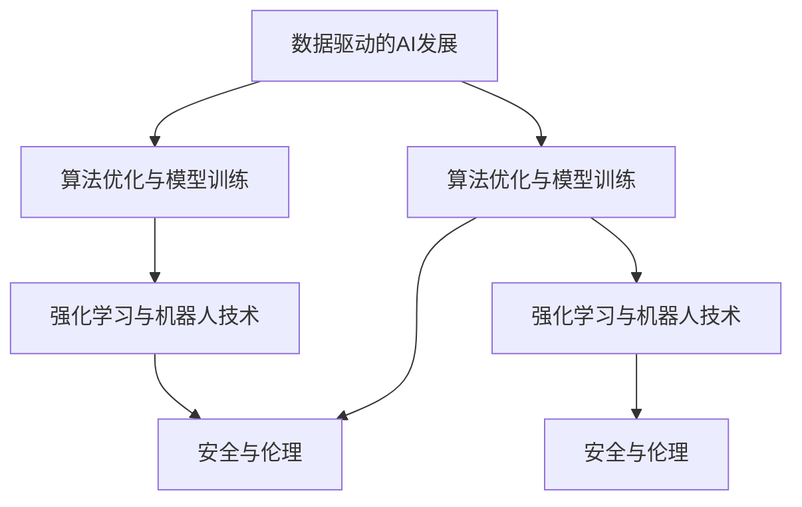

                 

# Andrej Karpathy：人工智能的未来发展策略

> 关键词：AI发展策略, 未来技术趋势, 数据驱动, 算法优化, 机器人技术, 安全与伦理

## 1. 背景介绍

在当今数字化时代，人工智能（AI）技术正以惊人的速度发展和应用，极大地改变了人们的工作和生活方式。作为OpenAI的首席AI科学家，Andrej Karpathy博士不仅是机器学习领域的领军人物，更是未来AI技术发展的重要思想引领者。本文将深入探讨Andrej Karpathy博士在AI领域的思想与观点，分析人工智能的未来发展策略。

## 2. 核心概念与联系

### 2.1 核心概念概述

Andrej Karpathy博士在AI领域的核心概念主要包括以下几个方面：

- **数据驱动的AI发展**：强调在AI研究与开发中，高质量数据的价值不可替代。
- **算法优化与模型训练**：持续追求更高效的算法和更准确的模型训练方法。
- **强化学习与机器人技术**：通过强化学习实现AI在机器人、自动驾驶等复杂系统中的应用。
- **安全与伦理**：在AI技术应用中，确保算法的公正性、透明性，防止偏见与滥用。

这些概念之间相互联系，共同构成了Andrej Karpathy博士在AI技术发展上的核心策略。

### 2.2 核心概念原理和架构的 Mermaid 流程图



这个流程图展示了数据、算法、应用与伦理四个关键环节之间的联系。数据驱动是AI发展的基石，算法优化与模型训练是提升AI性能的核心，强化学习与机器人技术代表了AI的应用前沿，而安全与伦理则是确保AI技术可持续发展的保障。

## 3. 核心算法原理 & 具体操作步骤

### 3.1 算法原理概述

Andrej Karpathy博士强调，AI的发展应以数据为核心，通过不断优化算法和模型训练方法，提升AI的性能与效率。此外，他特别重视强化学习在复杂系统中的应用，如机器人技术，以实现高效、鲁棒的AI控制。

### 3.2 算法步骤详解

1. **数据收集与预处理**：收集高质量、多样化的数据集，并进行清洗、标注等预处理工作。
2. **模型设计与训练**：选择合适的算法与模型结构，进行模型的设计与训练。
3. **算法优化与评估**：通过交叉验证等方法，优化模型参数，评估模型性能。
4. **强化学习应用**：将优化后的模型应用于机器人、自动驾驶等复杂系统中，通过反馈与调整，不断提升系统的性能。

### 3.3 算法优缺点

**优点**：
- 数据驱动的AI发展策略使得AI模型更具普适性和泛化能力。
- 算法优化与模型训练方法使得AI模型能够不断提升性能，适应新的应用场景。
- 强化学习在复杂系统中的应用，实现了AI与实际环境的高度融合。

**缺点**：
- 数据收集与预处理需要大量的人力与资源投入。
- 模型设计与训练的复杂性，使得模型优化难度较大。
- 强化学习需要大量的试验与调整，对资源需求较高。

### 3.4 算法应用领域

Andrej Karpathy博士提出的AI发展策略，在多个领域得到了广泛应用：

- **自动驾驶**：通过强化学习，实现车辆对环境的高度适应与自主驾驶。
- **机器人控制**：通过优化算法与模型训练，提升机器人在复杂环境中的操作效率与准确性。
- **医疗诊断**：利用高质量数据与AI模型，提升疾病的早期诊断与治疗效果。
- **自然语言处理**：通过数据驱动与模型训练，提升AI对语言的理解和生成能力。

## 4. 数学模型和公式 & 详细讲解 & 举例说明

### 4.1 数学模型构建

在AI模型构建中，Andrej Karpathy博士特别注重模型的数学表达与算法优化。以下是典型的AI模型数学模型构建过程：

1. **输入层**：接收输入数据，转化为向量形式。
2. **隐藏层**：通过一系列线性变换与非线性激活函数，提取输入数据的特征。
3. **输出层**：根据模型目标，输出预测结果或损失函数。

以简单的线性回归模型为例，其数学模型如下：

$$
\min_{\theta} \frac{1}{N}\sum_{i=1}^N (y_i - \theta^T x_i)^2
$$

其中，$\theta$为模型参数，$x_i$为输入数据，$y_i$为输出目标。

### 4.2 公式推导过程

以线性回归模型为例，其推导过程如下：

1. **代价函数**：
$$
J(\theta) = \frac{1}{2N}\sum_{i=1}^N (y_i - \hat{y}_i)^2
$$

2. **梯度下降**：
$$
\frac{\partial J(\theta)}{\partial \theta} = -\frac{1}{N}\sum_{i=1}^N (y_i - \hat{y}_i)x_i
$$

3. **参数更新**：
$$
\theta = \theta - \alpha \frac{\partial J(\theta)}{\partial \theta}
$$

其中，$\alpha$为学习率，控制模型参数更新的步长。

### 4.3 案例分析与讲解

以卷积神经网络（CNN）为例，分析其在图像识别中的应用。

卷积神经网络通过多层卷积操作，提取图像的局部特征，并通过池化操作降低特征维度，最终输出图像的类别预测。其数学模型构建如下：

1. **卷积层**：
$$
f_i^{(l)}(x) = \sum_{j} \sigma_i^l(x) * w_i^j + b_i^j
$$

2. **池化层**：
$$
\text{Pooling}(x_i) = \max_{i} x_i
$$

3. **输出层**：
$$
\hat{y} = softmax(\text{Linear}(z))
$$

其中，$\sigma_i^l$为激活函数，$w_i^j$为卷积核，$b_i^j$为偏置项，$softmax$为输出函数。

## 5. 项目实践：代码实例和详细解释说明

### 5.1 开发环境搭建

在进行AI模型实践前，需要先搭建好开发环境。以下是常用的开发环境配置流程：

1. **安装Python**：安装Python 3.x版本，并配置环境变量。
2. **安装依赖库**：使用pip安装常用的机器学习库，如TensorFlow、PyTorch等。
3. **配置GPU**：安装CUDA和cuDNN，并配置NVIDIA Driver，以支持GPU加速。

### 5.2 源代码详细实现

以下是使用PyTorch进行图像分类任务的代码实现：

```python
import torch
import torch.nn as nn
import torch.optim as optim
from torchvision import datasets, transforms

# 定义卷积神经网络模型
class CNN(nn.Module):
    def __init__(self):
        super(CNN, self).__init__()
        self.conv1 = nn.Conv2d(3, 16, kernel_size=3, stride=1, padding=1)
        self.conv2 = nn.Conv2d(16, 32, kernel_size=3, stride=1, padding=1)
        self.pool = nn.MaxPool2d(kernel_size=2, stride=2)
        self.fc1 = nn.Linear(32*8*8, 64)
        self.fc2 = nn.Linear(64, 10)

    def forward(self, x):
        x = self.pool(F.relu(self.conv1(x)))
        x = self.pool(F.relu(self.conv2(x)))
        x = x.view(-1, 32*8*8)
        x = F.relu(self.fc1(x))
        x = self.fc2(x)
        return x

# 定义模型训练函数
def train_model(model, train_loader, val_loader, epochs, learning_rate):
    optimizer = optim.SGD(model.parameters(), lr=learning_rate, momentum=0.9)
    criterion = nn.CrossEntropyLoss()

    for epoch in range(epochs):
        model.train()
        for i, (inputs, labels) in enumerate(train_loader):
            optimizer.zero_grad()
            outputs = model(inputs)
            loss = criterion(outputs, labels)
            loss.backward()
            optimizer.step()

        model.eval()
        with torch.no_grad():
            val_loss = 0
            correct = 0
            total = 0
            for inputs, labels in val_loader:
                outputs = model(inputs)
                _, predicted = torch.max(outputs.data, 1)
                val_loss += criterion(outputs, labels).item()
                total += labels.size(0)
                correct += (predicted == labels).sum().item()

        print(f"Epoch {epoch+1}, Loss: {val_loss/len(val_loader):.4f}, Accuracy: {100*correct/total:.2f}%")

# 加载数据集并进行预处理
transform = transforms.Compose([
    transforms.ToTensor(),
    transforms.Normalize((0.5, 0.5, 0.5), (0.5, 0.5, 0.5))
])
train_dataset = datasets.CIFAR10(root='./data', train=True, download=True, transform=transform)
test_dataset = datasets.CIFAR10(root='./data', train=False, download=True, transform=transform)
train_loader = torch.utils.data.DataLoader(train_dataset, batch_size=64, shuffle=True)
val_loader = torch.utils.data.DataLoader(test_dataset, batch_size=64, shuffle=False)

# 实例化模型并进行训练
model = CNN()
train_model(model, train_loader, val_loader, epochs=10, learning_rate=0.001)
```

### 5.3 代码解读与分析

代码主要分为以下几个部分：

1. **卷积神经网络模型**：定义了卷积层、池化层和全连接层，构建了完整的CNN模型。
2. **模型训练函数**：实现了模型在训练集上的前向传播与反向传播，并计算损失函数。
3. **数据集加载与预处理**：使用torchvision库加载CIFAR-10数据集，并进行归一化处理。
4. **模型实例化与训练**：实例化CNN模型，并使用SGD优化器进行模型训练。

## 6. 实际应用场景

### 6.1 自动驾驶

Andrej Karpathy博士在自动驾驶领域的应用，通过强化学习技术，实现了对复杂环境的高度适应与自主驾驶。

强化学习在自动驾驶中的应用流程如下：

1. **环境建模**：通过传感器数据，构建车辆与环境的三维模型。
2. **行动选择**：基于模型预测与历史经验，选择最优的驾驶行动。
3. **结果反馈**：根据车辆的状态与环境变化，调整行动策略。

通过不断迭代训练，强化学习模型能够实时适应多变的驾驶环境，实现高效、鲁棒的自主驾驶。

### 6.2 机器人控制

在机器人控制领域，Andrej Karpathy博士通过优化算法与模型训练，提升了机器人在复杂环境中的操作效率与准确性。

机器人在实际应用中的控制流程如下：

1. **目标规划**：根据任务需求，生成机器人移动路径。
2. **动态调整**：根据环境反馈，实时调整机器人的运动策略。
3. **路径执行**：控制机器人沿着预定路径进行操作。

通过优化算法与模型训练，机器人能够高效、精确地完成各种复杂的任务，如抓取、搬运等。

### 6.3 医疗诊断

Andrej Karpathy博士在医疗诊断领域的应用，利用高质量数据与AI模型，提升了疾病的早期诊断与治疗效果。

医疗诊断中的AI模型构建流程如下：

1. **数据收集**：收集患者的各类医疗数据，如CT、MRI等。
2. **模型训练**：使用深度学习模型对数据进行训练，提取特征与模式。
3. **结果分析**：利用训练好的模型，对新患者的数据进行预测，辅助医生进行诊断。

通过AI技术的应用，医疗诊断的准确性与效率得到了显著提升，有助于早期发现疾病，提升治疗效果。

## 7. 工具和资源推荐

### 7.1 学习资源推荐

为了帮助开发者深入理解AI技术，Andrej Karpathy博士推荐了以下学习资源：

1. **Deep Learning Specialization**：由Andrew Ng教授主讲的Coursera课程，涵盖了深度学习的基础理论与应用实践。
2. **Deep Reinforcement Learning**：由David Silver教授主讲的强化学习课程，深入讲解了强化学习的基本概念与算法。
3. **《Hands-On Machine Learning with Scikit-Learn, Keras, and TensorFlow》**：由Aurélien Géron所著，详细介绍了机器学习库的实际应用。

### 7.2 开发工具推荐

以下是Andrej Karpathy博士推荐的开发工具：

1. **PyTorch**：Python深度学习框架，具有动态图特性，便于模型迭代与优化。
2. **TensorFlow**：Google开源的深度学习框架，支持分布式训练与部署。
3. **Jupyter Notebook**：交互式开发环境，便于进行数据探索与模型实验。
4. **Google Colab**：免费的云环境，支持GPU与TPU加速，方便进行大规模计算。

### 7.3 相关论文推荐

以下是Andrej Karpathy博士推荐的相关论文：

1. **Playing Atari with Deep Reinforcement Learning**：由Ian Goodfellow等作者，首次展示了深度强化学习在玩游戏中的应用。
2. **Deep Residual Learning for Image Recognition**：由Kaiming He等作者，提出了残差网络结构，提升了图像分类模型的性能。
3. **Detecting And Discriminating Against Adversarial Examples**：由Andrej Karpathy博士与Dario Amodei等作者，探讨了对抗样本对AI模型的影响与防御方法。

## 8. 总结：未来发展趋势与挑战

### 8.1 研究成果总结

Andrej Karpathy博士的研究成果涵盖了深度学习、强化学习、自动驾驶等多个前沿领域。通过不断的技术探索与算法优化，他推动了AI技术的持续进步。

### 8.2 未来发展趋势

未来，AI技术将在以下几个方向继续发展：

1. **深度强化学习**：通过深度学习与强化学习相结合，实现更高效、更鲁棒的复杂系统控制。
2. **跨模态学习**：结合视觉、语音、文本等多种模态数据，实现更加全面的AI理解与生成。
3. **联邦学习**：通过分布式计算与数据联邦，提升AI模型的泛化能力与隐私保护。
4. **自适应学习**：开发自适应算法，使AI模型能够根据环境变化自动调整模型参数，提升应用效果。

### 8.3 面临的挑战

AI技术的发展仍面临诸多挑战：

1. **数据质量与获取**：高质量数据获取成本高，数据质量与多样性不足。
2. **模型复杂度与优化**：深度学习模型复杂度不断提升，优化难度增加。
3. **模型安全性与伦理**：AI模型的偏见与滥用问题，需要更加严格的监管与伦理规范。
4. **计算资源与效率**：大规模模型的训练与推理需要高性能计算资源，效率问题亟需解决。

### 8.4 研究展望

未来的研究将在以下几个方向寻求突破：

1. **自监督学习**：通过自监督任务提升模型泛化能力，减少对标注数据的依赖。
2. **模型压缩与加速**：开发模型压缩与加速技术，提升计算效率与资源利用率。
3. **模型解释与透明**：开发模型解释工具，增强模型的可解释性与透明度。
4. **伦理与安全**：在AI模型开发与应用中，融入伦理与安全考量，确保技术的可持续发展。

## 9. 附录：常见问题与解答

### Q1：AI模型训练需要多少数据？

A：AI模型的训练需要根据模型的复杂度与任务需求，确定合适的数据量。一般而言，数据量越大，模型性能越好。

### Q2：AI模型如何避免过拟合？

A：避免过拟合的方法包括数据增强、正则化、早停等。数据增强通过增加数据多样性，减少模型对特定数据的依赖。正则化通过引入惩罚项，限制模型复杂度。早停通过监控验证集性能，防止模型过度拟合训练数据。

### Q3：AI模型的解释性如何保障？

A：AI模型的解释性可以通过模型可视化、特征重要性分析等方式进行保障。模型可视化通过可视化输出，帮助理解模型的决策过程。特征重要性分析通过分析模型的关键特征，提高模型的可解释性。

### Q4：AI模型如何确保安全性？

A：AI模型的安全性可以通过数据脱敏、模型对抗性训练等方式进行保障。数据脱敏通过去除敏感信息，保护用户隐私。模型对抗性训练通过引入对抗样本，提升模型的鲁棒性，防止模型被攻击。

---

作者：禅与计算机程序设计艺术 / Zen and the Art of Computer Programming

