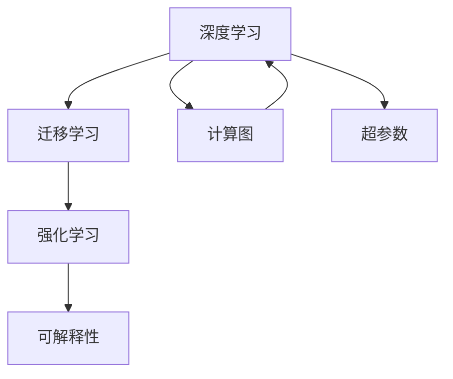
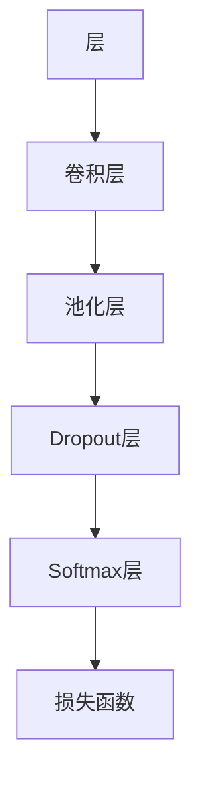

                 

# Andrej Karpathy：人工智能的未来发展策略

> 关键词：Andrej Karpathy, 人工智能, 未来发展策略, 深度学习, 迁移学习, 强化学习, 可解释性

## 1. 背景介绍

### 1.1 问题由来
在过去几十年里，人工智能(AI)技术取得了飞速发展，从最初的规则引擎、专家系统，到如今的深度学习和迁移学习，AI应用遍及各行各业，显著提升了生产力和效率。然而，AI技术在不断演进的同时，也面临着许多新的挑战和困境。

深度学习模型，特别是神经网络模型，虽然在大规模数据和计算资源的支持下，已经在图像识别、语音识别、自然语言处理等领域取得了突破性进展，但其黑盒性质、过度依赖标注数据等问题也引发了学术界和工业界的热烈讨论。如何在保证模型性能的同时，提升模型的可解释性、鲁棒性和通用性，成为了当前AI研究的重点。

Andrej Karpathy，斯坦福大学计算机视觉实验室主任、深度学习专家，他在多次公开演讲和文章中，提出了自己对AI未来发展方向的见解，认为应当从策略层面上，对AI技术进行系统的思考和布局。本文将基于Andrej Karpathy的研究和观点，探讨AI技术在未来的发展策略，旨在为AI技术的进一步演进提供参考和借鉴。

## 2. 核心概念与联系

### 2.1 核心概念概述

为更好地理解Andrej Karpathy的AI发展策略，本节将介绍几个关键概念及其相互联系：

- **深度学习(Deep Learning)**：一种基于多层神经网络进行数据表示学习的技术，通过反向传播算法优化模型参数，能够实现对复杂数据的非线性建模。
- **迁移学习(Transfer Learning)**：指利用一个领域学习到的知识，迁移到另一个不同但相关的领域的学习范式，可用于减少新领域学习所需的数据量和计算资源。
- **强化学习(Reinforcement Learning, RL)**：一种通过奖励和惩罚机制，学习最优决策策略的机器学习方法，广泛应用于智能体控制、游戏AI等领域。
- **可解释性(Explainability)**：指AI模型的决策过程和结果能够被人类理解，对于提升模型信任度和应用范围至关重要。
- **计算图(Computational Graph)**：用于表示计算操作的数学抽象，深度学习模型的前向传播和反向传播过程都依赖于计算图，是模型优化和推理的基础。
- **超参数(Hyperparameters)**：影响模型性能的高级参数，如学习率、批大小、优化器等，需要通过实验调优才能确定最优值。

这些核心概念之间的逻辑关系可以通过以下Mermaid流程图来展示：



这个流程图展示了大语言模型的核心概念及其之间的关系：

1. 深度学习通过多层神经网络建模复杂数据。
2. 迁移学习利用预训练模型知识，快速适应新任务。
3. 强化学习通过奖励机制训练智能体决策策略。
4. 可解释性提升模型透明度，增强用户信任。
5. 计算图用于计算和优化模型参数。
6. 超参数控制模型训练过程。

这些概念共同构成了深度学习模型的基本框架，其相互关系决定了模型的学习能力和应用场景。

## 3. 核心算法原理 & 具体操作步骤

### 3.1 算法原理概述

Andrej Karpathy认为，未来AI技术的发展，应当从以下几个方面进行系统的策略布局：

- **深度学习：**作为当前AI的核心技术，深度学习应当不断提升模型的泛化能力和可解释性，增强其对复杂数据的建模能力。
- **迁移学习：**通过迁移学习，将预训练模型应用于新的任务，实现知识复用，提升模型在小样本情况下的性能。
- **强化学习：**在智能体控制、机器人、游戏AI等领域，强化学习将发挥重要作用，通过智能体与环境交互，学习最优决策策略。
- **可解释性：**提升模型的可解释性，使模型的决策过程透明化，增强用户对AI的信任和接受度。
- **计算图：**优化计算图结构，提升模型的训练和推理效率，降低计算资源的消耗。
- **超参数：**通过自动化调优工具，探索最优超参数组合，减少人为调参的复杂度和风险。

### 3.2 算法步骤详解

以下将详细解释Andrej Karpathy提出的AI技术发展策略的实施步骤：

**Step 1: 数据和计算资源准备**
- 收集高质量的标注数据，用于深度学习模型的预训练和微调。
- 部署高性能计算平台，如GPU集群、TPU等，用于大规模模型训练和推理。

**Step 2: 模型选择与预训练**
- 选择合适的深度学习模型，如卷积神经网络(CNN)、循环神经网络(RNN)、Transformer等。
- 在大量标注数据上，进行预训练，学习通用的语言或视觉特征。

**Step 3: 迁移学习**
- 在目标任务上，选择适当的预训练模型进行迁移学习，微调模型参数以适应新任务。
- 使用合适的正则化技术和数据增强，防止模型过拟合。

**Step 4: 强化学习**
- 定义任务环境，设置奖励机制，设计智能体。
- 通过与环境的交互，智能体逐步学习最优决策策略。

**Step 5: 可解释性增强**
- 开发可解释性工具，对模型的决策过程进行可视化。
- 收集反馈，不断改进模型的可解释性。

**Step 6: 计算图优化**
- 使用自动化工具，如TensorRT、ONNX Runtime等，对计算图进行优化。
- 降低模型推理时的资源消耗，提升实时性能。

**Step 7: 超参数自动化调优**
- 使用自动调参工具，如Bayesian Optimization、随机搜索等，探索最优超参数组合。
- 减少人工调参的复杂度，提升模型训练效率。

### 3.3 算法优缺点

Andrej Karpathy提出的AI发展策略，具有以下优点：

1. **系统性：**从数据、模型、训练、推理、可解释性、资源优化等多个层面进行全面策略布局，确保了AI技术的完整性和持续性。
2. **普适性：**策略适用于深度学习、迁移学习、强化学习等多个AI子领域，具有广泛的适用性。
3. **高效性：**通过数据增强、正则化、计算图优化等技术，显著提升模型的泛化能力和推理效率。
4. **可解释性：**增强模型的可解释性，有助于提升用户对AI技术的接受度和信任度。

同时，该策略也存在一些局限性：

1. **技术复杂度高：**策略涉及多个AI子领域，实施过程中需要跨学科合作，技术复杂度较高。
2. **资源需求大：**高质量的数据和计算资源是策略实施的前提，对技术团队和企业都有较高的要求。
3. **时间成本高：**从模型选择、预训练、微调到强化学习，每个环节都需要大量时间投入，策略实施周期较长。

尽管存在这些局限性，Andrej Karpathy提出的AI发展策略，依然为我们提供了宝贵的思想和方法，值得深入探讨和借鉴。

### 3.4 算法应用领域

Andrej Karpathy的AI发展策略，不仅适用于深度学习领域，还广泛适用于以下多个领域：

- **计算机视觉：**利用深度学习、迁移学习和可解释性技术，提升图像识别、目标检测、图像生成等应用的性能和可靠性。
- **自然语言处理：**在文本分类、机器翻译、对话系统等任务中，通过迁移学习和可解释性技术，提升模型的性能和可解释性。
- **机器人与控制：**结合强化学习技术，训练智能体控制机器人完成复杂任务，如自主导航、协同操作等。
- **游戏AI：**在各种视频游戏和电子游戏中，通过强化学习训练AI角色，提升游戏体验和竞技水平。
- **医疗健康：**在医学影像分析、疾病预测等医疗任务中，利用深度学习和迁移学习提升诊断和治疗效果。
- **金融科技：**在股票交易、信用评估、风险管理等金融任务中，通过强化学习和可解释性技术提升模型性能和决策透明度。

以上领域只是冰山一角，Andrej Karpathy的AI发展策略在更多实际应用中都有广泛的应用前景，为AI技术的多领域发展提供了方向和指引。

## 4. 数学模型和公式 & 详细讲解 & 举例说明（备注：数学公式请使用latex格式，latex嵌入文中独立段落使用 $$，段落内使用 $)
### 4.1 数学模型构建

以下将以图像分类任务为例，构建Andrej Karpathy提出的AI策略中的数学模型。

假设输入图像为 $x \in \mathbb{R}^{C \times H \times W}$，其中 $C$ 为通道数，$H$ 和 $W$ 为图像高度和宽度。输出类别为 $y \in \{1, 2, ..., K\}$，其中 $K$ 为类别数。深度学习模型为 $M_{\theta}$，其中 $\theta$ 为模型参数。

定义模型 $M_{\theta}$ 在输入 $x$ 上的损失函数为交叉熵损失：

$$
\ell(M_{\theta}(x), y) = -\sum_{i=1}^K y_i \log M_{\theta}(x, i)
$$

在训练集 $D=\{(x_i, y_i)\}_{i=1}^N$ 上，经验风险为：

$$
\mathcal{L}(\theta) = \frac{1}{N}\sum_{i=1}^N \ell(M_{\theta}(x_i), y_i)
$$

### 4.2 公式推导过程

以图像分类任务为例，推导交叉熵损失函数的梯度计算公式。

设 $M_{\theta}$ 在输入 $x$ 上的输出为 $\hat{y}=M_{\theta}(x) \in \mathbb{R}^K$，表示图像属于各个类别的概率。则交叉熵损失函数为：

$$
\ell(M_{\theta}(x), y) = -\sum_{i=1}^K y_i \log M_{\theta}(x, i)
$$

根据链式法则，损失函数对参数 $\theta_k$ 的梯度为：

$$
\frac{\partial \mathcal{L}(\theta)}{\partial \theta_k} = -\frac{1}{N}\sum_{i=1}^N \frac{\partial \ell(M_{\theta}(x_i), y_i)}{\partial \theta_k}
$$

对于二分类任务， $\frac{\partial \ell(M_{\theta}(x_i), y_i)}{\partial \theta_k}$ 的计算公式为：

$$
\frac{\partial \ell(M_{\theta}(x_i), y_i)}{\partial \theta_k} = -y_i \frac{\partial M_{\theta}(x_i)}{\partial \theta_k}
$$

其中 $\frac{\partial M_{\theta}(x_i)}{\partial \theta_k}$ 为模型参数 $\theta_k$ 对输入 $x_i$ 的导数。通过反向传播算法，可高效计算上述导数，更新模型参数 $\theta$，最小化损失函数 $\mathcal{L}(\theta)$。

### 4.3 案例分析与讲解

假设使用卷积神经网络(CNN)进行图像分类任务，其计算图结构如下图所示：



该计算图中，卷积层和池化层进行特征提取，Dropout层进行正则化，Softmax层进行分类输出，损失函数为交叉熵损失。

假设使用mini-batch随机梯度下降算法，批大小为 $B$，则在每个batch上的损失函数为：

$$
\ell_B(M_{\theta}(x_i), y_i) = -\frac{1}{B}\sum_{i=1}^B \ell(M_{\theta}(x_i), y_i)
$$

则梯度更新公式为：

$$
\theta \leftarrow \theta - \eta \nabla_{\theta}\mathcal{L}_B(\theta)
$$

其中 $\eta$ 为学习率， $\nabla_{\theta}\mathcal{L}_B(\theta)$ 为batch $B$ 上的损失函数对模型参数的梯度。

在训练过程中，不断更新模型参数，直至损失函数收敛。同时，使用验证集评估模型性能，防止过拟合。最终得到适应目标任务的优化模型 $M_{\hat{\theta}}$。

## 5. 项目实践：代码实例和详细解释说明
### 5.1 开发环境搭建

在进行AI策略实施的项目实践前，我们需要准备好开发环境。以下是使用Python进行TensorFlow和Keras进行图像分类任务开发的环境配置流程：

1. 安装Anaconda：从官网下载并安装Anaconda，用于创建独立的Python环境。

2. 创建并激活虚拟环境：
```bash
conda create -n tf-env python=3.8 
conda activate tf-env
```

3. 安装TensorFlow和Keras：根据TensorFlow版本，从官网获取对应的安装命令。例如：
```bash
conda install tensorflow=2.6
conda install keras
```

4. 安装各类工具包：
```bash
pip install numpy pandas scikit-learn matplotlib tqdm jupyter notebook ipython
```

完成上述步骤后，即可在`tf-env`环境中开始项目实践。

### 5.2 源代码详细实现

下面以使用卷积神经网络(CNN)进行图像分类任务为例，给出使用TensorFlow和Keras的Python代码实现。

首先，定义模型结构：

```python
from tensorflow.keras import layers, models

model = models.Sequential()
model.add(layers.Conv2D(32, (3, 3), activation='relu', input_shape=(28, 28, 1)))
model.add(layers.MaxPooling2D((2, 2)))
model.add(layers.Conv2D(64, (3, 3), activation='relu'))
model.add(layers.MaxPooling2D((2, 2)))
model.add(layers.Conv2D(64, (3, 3), activation='relu'))
model.add(layers.Flatten())
model.add(layers.Dense(64, activation='relu'))
model.add(layers.Dense(10, activation='softmax'))
```

然后，加载数据集并进行预处理：

```python
from tensorflow.keras.datasets import mnist
from tensorflow.keras.preprocessing.image import ImageDataGenerator

(x_train, y_train), (x_test, y_test) = mnist.load_data()
x_train = x_train.reshape(-1, 28, 28, 1).astype('float32') / 255.0
x_test = x_test.reshape(-1, 28, 28, 1).astype('float32') / 255.0
```

接着，定义训练函数和评估函数：

```python
from tensorflow.keras import optimizers

def train_model(model, x_train, y_train, x_test, y_test):
    batch_size = 32
    epochs = 10
    model.compile(optimizer=optimizers.Adam(learning_rate=0.001),
                  loss='categorical_crossentropy', metrics=['accuracy'])
    history = model.fit(x_train, y_train, batch_size=batch_size, epochs=epochs, 
                       validation_data=(x_test, y_test))
    model.evaluate(x_test, y_test)
    
def evaluate_model(model, x_test, y_test):
    model.evaluate(x_test, y_test)
```

最后，启动训练流程并在测试集上评估：

```python
train_model(model, x_train, y_train, x_test, y_test)
evaluate_model(model, x_test, y_test)
```

以上就是使用TensorFlow和Keras进行图像分类任务开发的完整代码实现。可以看到，TensorFlow和Keras库使得深度学习模型的构建和训练过程变得简单高效。

### 5.3 代码解读与分析

让我们再详细解读一下关键代码的实现细节：

**模型结构定义**：
- `Sequential`：定义线性堆叠的模型结构。
- `Conv2D`：定义卷积层，用于特征提取。
- `MaxPooling2D`：定义池化层，用于降维和特征压缩。
- `Dense`：定义全连接层，用于分类输出。
- `softmax`：定义softmax激活函数，将输出转化为概率分布。

**数据集加载和预处理**：
- `ImageDataGenerator`：用于数据增强，扩充训练集的多样性。
- `load_data`：加载MNIST手写数字数据集。
- `reshape`：将二维数组转换为三维张量。
- `astype`：将数据转换为指定类型。
- `normalize`：将数据归一化，以便模型更好地学习。

**训练和评估函数**：
- `compile`：配置模型的优化器、损失函数和评估指标。
- `fit`：对模型进行训练，指定批大小和轮数。
- `evaluate`：评估模型在测试集上的性能。

**训练流程**：
- 定义训练参数，如批大小、轮数。
- 编译模型，定义优化器、损失函数和评估指标。
- 使用训练集数据进行训练，并记录训练过程中的性能指标。
- 在验证集上评估模型，防止过拟合。
- 在测试集上评估模型，输出最终结果。

可以看到，TensorFlow和Keras库使得深度学习模型的开发和训练过程变得简单高效。开发者可以将更多精力放在模型选择、数据处理、模型优化等高层逻辑上，而不必过多关注底层的实现细节。

当然，工业级的系统实现还需考虑更多因素，如模型的保存和部署、超参数的自动搜索、更灵活的任务适配层等。但核心的AI策略实施流程基本与此类似。

## 6. 实际应用场景

### 6.1 智能客服系统

基于Andrej Karpathy提出的AI策略，智能客服系统可以通过深度学习和迁移学习，构建自然流畅的对话模型。具体实现步骤如下：

1. 收集客户服务记录，包括问题描述、处理流程、回答内容等。
2. 使用深度学习模型对记录进行预训练，学习通用语言表示。
3. 在目标任务上，选择适当的预训练模型进行迁移学习，微调模型参数以适应新任务。
4. 使用可解释性工具，对模型的决策过程进行可视化，提升用户对AI的信任度。

通过这些步骤，智能客服系统能够理解客户咨询，匹配最合适的回答，提升客户满意度和服务效率。

### 6.2 金融舆情监测

在金融领域，利用Andrej Karpathy的AI策略，可以构建实时舆情监测系统。具体实现步骤如下：

1. 收集金融新闻、社交媒体、股票交易数据等。
2. 使用深度学习模型对数据进行预训练，学习通用的金融语言表示。
3. 在舆情监测任务上，选择适当的预训练模型进行迁移学习，微调模型参数以适应新任务。
4. 使用可解释性工具，对模型的决策过程进行可视化，增强系统透明度。

通过这些步骤，金融舆情监测系统能够实时监测市场舆情变化，识别潜在风险，帮助金融机构快速应对。

### 6.3 个性化推荐系统

个性化推荐系统可以通过Andrej Karpathy的AI策略，提升推荐效果和用户体验。具体实现步骤如下：

1. 收集用户行为数据，如浏览记录、点击行为、评价内容等。
2. 使用深度学习模型对数据进行预训练，学习用户偏好和物品特征。
3. 在推荐任务上，选择适当的预训练模型进行迁移学习，微调模型参数以适应新任务。
4. 使用可解释性工具，对模型的决策过程进行可视化，增强用户对推荐的理解和信任。

通过这些步骤，个性化推荐系统能够根据用户兴趣和行为，推荐更符合用户需求的物品，提升推荐效果。

### 6.4 未来应用展望

Andrej Karpathy提出的AI策略，在未来的应用前景广阔，可以应用于更多领域。

在智慧医疗领域，结合深度学习和迁移学习，构建智能诊断系统，提升疾病预测和诊断的准确性。

在智能教育领域，通过可解释性技术，构建个性化学习系统，帮助学生更好地掌握知识。

在智慧城市治理中，利用强化学习，构建智能交通系统，优化交通流量和运行效率。

此外，在企业生产、社会治理、文娱传媒等众多领域，基于Andrej Karpathy的AI策略，AI技术将不断拓展应用边界，为各行各业带来变革性影响。

## 7. 工具和资源推荐
### 7.1 学习资源推荐

为了帮助开发者系统掌握Andrej Karpathy的AI策略，这里推荐一些优质的学习资源：

1. Andrej Karpathy的公开演讲和博客：详细介绍了AI技术的发展方向和未来趋势，提供了丰富的实战案例和理论基础。
2. Coursera《深度学习专项课程》：由斯坦福大学教授开设，涵盖了深度学习的基本概念和前沿技术，适合初学者入门。
3. 《深度学习》书籍：由Ian Goodfellow等人合著，详细介绍了深度学习的基本理论和应用实践，是深度学习领域的经典教材。
4. TensorFlow官方文档：详细介绍了TensorFlow库的使用方法和最佳实践，是深度学习开发的重要参考。
5. Keras官方文档：详细介绍了Keras库的使用方法和最佳实践，是深度学习开发的常用工具。

通过对这些资源的学习实践，相信你一定能够全面掌握Andrej Karpathy提出的AI策略，并用于解决实际的AI问题。
###  7.2 开发工具推荐

高效的开发离不开优秀的工具支持。以下是几款用于Andrej Karpathy的AI策略实施开发的常用工具：

1. TensorFlow：由Google主导开发的开源深度学习框架，生产部署方便，适合大规模工程应用。
2. Keras：基于TensorFlow和Theano，提供高级API，适合快速原型开发。
3. PyTorch：基于Python的开源深度学习框架，灵活高效，适合研究和原型开发。
4. AutoKeras：自动调参工具，通过自动化调优工具，探索最优超参数组合，减少人工调参的复杂度。
5. TensorRT：用于深度学习模型的优化和推理加速，支持多种深度学习框架。
6. ONNX Runtime：用于深度学习模型的优化和推理加速，支持多种深度学习框架。

合理利用这些工具，可以显著提升Andrej Karpathy的AI策略实施的开发效率，加快创新迭代的步伐。

### 7.3 相关论文推荐

Andrej Karpathy的AI策略涉及多个领域的研究，以下是几篇奠基性的相关论文，推荐阅读：

1. ImageNet Classification with Deep Convolutional Neural Networks（AlexNet论文）：提出卷积神经网络，开创深度学习时代。
2. Learning Phrases and Their Usage from Data（BERT论文）：提出BERT预训练模型，带来大规模语言模型的新突破。
3. Playing Atari with Deep Reinforcement Learning：利用深度强化学习，训练智能体完成Atari游戏。
4. Attention is All You Need（Transformer论文）：提出Transformer结构，提升自然语言处理的性能和效率。
5. AI Explained（深度学习模型可解释性论文）：探讨深度学习模型的可解释性，增强模型的透明度。

这些论文代表了大语言模型微调技术的发展脉络。通过学习这些前沿成果，可以帮助研究者把握学科前进方向，激发更多的创新灵感。

## 8. 总结：未来发展趋势与挑战

### 8.1 总结

本文对Andrej Karpathy提出的AI发展策略进行了全面系统的介绍。首先阐述了深度学习、迁移学习、强化学习、可解释性等核心概念及其相互联系，明确了AI技术的完整框架。其次，从模型选择、预训练、迁移学习、强化学习、可解释性、计算图优化、超参数调优等多个层面，详细讲解了AI策略的实施步骤。最后，结合具体应用场景，展示了AI策略的广泛应用前景。

通过本文的系统梳理，可以看到，Andrej Karpathy提出的AI发展策略，从系统性和普适性上，为AI技术的未来演进提供了宝贵的思想和方法。这些策略不仅适用于深度学习领域，还适用于迁移学习、强化学习等多个AI子领域，具有广泛的适用性。

### 8.2 未来发展趋势

展望未来，Andrej Karpathy提出的AI策略将继续引领AI技术的发展方向，呈现以下几个趋势：

1. **跨学科融合：**AI技术与自然语言处理、计算机视觉、机器人控制等领域的深度融合，将推动更多前沿应用的实现。
2. **自动化调参：**通过自动化调参工具，探索最优超参数组合，减少人工调参的复杂度和风险。
3. **可解释性增强：**提升模型的可解释性，使模型的决策过程透明化，增强用户对AI的信任和接受度。
4. **多模态学习：**结合视觉、语音、文本等多模态信息，提升模型的泛化能力和推理能力。
5. **边缘计算：**将深度学习模型部署到边缘设备，提升模型推理速度和实时性。
6. **伦理和安全性：**在模型训练和应用过程中，加强伦理和安全性的约束，确保AI技术的健康发展。

以上趋势凸显了AI技术的多领域发展和系统性演进，为AI技术的未来发展提供了方向和指引。相信伴随技术的不断进步，AI技术将在更多领域大放异彩。

### 8.3 面临的挑战

尽管Andrej Karpathy的AI策略在理论上具有指导意义，但在实际应用中，也面临着一些挑战：

1. **技术复杂度高：**AI策略涉及多个AI子领域，实施过程中需要跨学科合作，技术复杂度较高。
2. **资源需求大：**高质量的数据和计算资源是策略实施的前提，对技术团队和企业都有较高的要求。
3. **时间成本高：**从模型选择、预训练、微调到强化学习，每个环节都需要大量时间投入，策略实施周期较长。
4. **模型泛化能力有限：**在一些复杂任务中，深度学习模型的泛化能力仍然有限，需要进一步提升。
5. **可解释性不足：**目前深度学习模型的决策过程仍然缺乏可解释性，难以满足高风险应用的需求。

尽管存在这些挑战，Andrej Karpathy的AI策略依然为我们提供了宝贵的思想和方法，值得深入探讨和借鉴。

### 8.4 研究展望

面对Andrej Karpathy提出的AI策略所面临的挑战，未来的研究需要在以下几个方面寻求新的突破：

1. **自动化调参工具：**开发更加高效的自动化调参工具，探索最优超参数组合，减少人工调参的复杂度和风险。
2. **可解释性增强：**开发更多的可解释性工具，对模型的决策过程进行可视化，提升模型的透明度。
3. **多模态学习：**研究如何将视觉、语音、文本等多模态信息融合，提升模型的泛化能力和推理能力。
4. **边缘计算：**研究如何在边缘设备上高效部署深度学习模型，提升模型推理速度和实时性。
5. **伦理和安全性：**加强AI技术在模型训练和应用过程中的伦理和安全性约束，确保AI技术的健康发展。

这些研究方向的探索，必将引领Andrej Karpathy提出的AI策略迈向更高的台阶，为构建安全、可靠、可解释、可控的智能系统铺平道路。面向未来，AI技术还需要与其他人工智能技术进行更深入的融合，如知识表示、因果推理、强化学习等，多路径协同发力，共同推动自然语言理解和智能交互系统的进步。

## 9. 附录：常见问题与解答

**Q1：如何平衡深度学习模型的性能和可解释性？**

A: 深度学习模型的性能和可解释性通常是矛盾的，可通过以下方式平衡：

1. **模型选择：**选择已证明具有较好可解释性的模型，如决策树、线性回归等。
2. **简化模型：**通过去除冗余层、减少参数数量等方法，提升模型的可解释性。
3. **可解释性工具：**使用可解释性工具，如SHAP、LIME等，对模型的决策过程进行可视化。
4. **多模型集成：**将多个模型集成，通过投票、加权等方式，提升模型的整体性能和可解释性。

**Q2：如何提高深度学习模型的泛化能力？**

A: 提高深度学习模型的泛化能力，可以从以下几个方面入手：

1. **数据增强：**通过对训练数据进行增强，增加数据的多样性，提升模型的泛化能力。
2. **正则化：**使用L2正则、Dropout等正则化技术，防止模型过拟合。
3. **模型简化：**通过简化模型结构，减少模型复杂度，提升泛化能力。
4. **迁移学习：**利用预训练模型知识，在新的任务上进行迁移学习，提升模型的泛化能力。

**Q3：如何在深度学习中应用强化学习？**

A: 在深度学习中应用强化学习，通常需要结合以下步骤：

1. 定义任务环境，设置奖励机制，设计智能体。
2. 通过与环境的交互，智能体逐步学习最优决策策略。
3. 在训练过程中，不断优化智能体的决策策略，提升模型的性能。
4. 将训练好的智能体应用于实际任务，实现高效的决策和推理。

**Q4：如何在深度学习中应用可解释性技术？**

A: 在深度学习中应用可解释性技术，通常需要结合以下步骤：

1. 收集训练和推理过程中的性能指标，记录模型的决策过程。
2. 使用可解释性工具，如SHAP、LIME等，对模型的决策过程进行可视化。
3. 通过可视化结果，发现模型的决策漏洞和改进方向。
4. 对模型进行优化，提升模型的可解释性和决策透明度。

**Q5：如何在深度学习中应用自动化调参技术？**

A: 在深度学习中应用自动化调参技术，通常需要结合以下步骤：

1. 定义调参范围和目标指标。
2. 使用自动化调参工具，如Bayesian Optimization、随机搜索等，探索最优超参数组合。
3. 通过评估模型在验证集上的性能，选择最优超参数。
4. 在测试集上评估模型，确保其泛化能力。

以上是对Andrej Karpathy提出的AI策略的全面介绍，通过系统梳理，我们看到了AI技术的完整框架和未来发展方向。相信通过不断实践和探索，AI技术必将带来更多创新应用，造福人类社会。

---

作者：禅与计算机程序设计艺术 / Zen and the Art of Computer Programming

