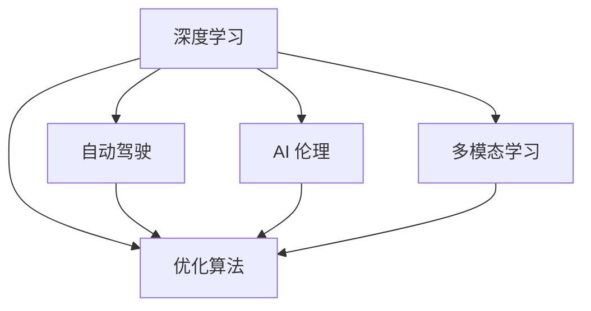

                 

# Andrej Karpathy：人工智能的未来发展规划

## 1. 背景介绍

### 1.1 问题由来
Andrej Karpathy 是一位国际知名的 AI 研究者和工程师，目前任职于 Tesla 的 AI 部门。作为一名深度学习领域的先驱，他拥有丰富的研究和教学经验，对人工智能的未来发展有着深刻的见解。在本文中，我们将探讨 Karpathy 对 AI 未来规划的看法，重点关注其在自动驾驶、AI 伦理、AI 技术演进等领域的见解。

### 1.2 问题核心关键点
Karpathy 在 AI 领域的研究和实践，主要集中在以下几个关键点：

1. **自动驾驶**：Karpathy 领导的 Tesla Autopilot 团队，正在开发世界领先的自动驾驶技术，目标是实现完全自主的汽车。
2. **AI 伦理**：Karpathy 强调 AI 技术发展的伦理责任，主张透明、可解释的 AI 系统。
3. **AI 技术演进**：Karpathy 关注 AI 技术的持续创新，提出多种新方法和模型。
4. **多模态学习**：Karpathy 认为 AI 系统应具备处理多模态数据的能力，包括图像、语音、文本等。
5. **深度学习优化**：Karpathy 在深度学习优化方面有深入研究，提出诸如 RNN、GAN 等技术。

这些关键点构成了 Karpathy 对 AI 未来发展规划的主要方向，为我们打开了一扇通往未来 AI 世界的窗户。

## 2. 核心概念与联系

### 2.1 核心概念概述

在探讨 Karpathy 的 AI 未来发展规划时，我们需要先了解一些核心概念：

- **深度学习**：一种基于多层神经网络的学习方法，通过反向传播算法优化权重，以实现复杂的非线性映射。
- **自动驾驶**：指通过传感器、摄像头、雷达等设备，实现车辆的自主导航、避障等功能。
- **AI 伦理**：涉及 AI 技术的开发、应用、评估等环节中应遵循的伦理原则和社会责任。
- **多模态学习**：指 AI 系统能够同时处理多种数据模态（如图像、语音、文本）的能力。
- **优化算法**：用于优化深度学习模型的算法，如随机梯度下降、Adam 等。

这些概念之间存在紧密的联系，共同构成了 Karpathy 对 AI 未来发展规划的基石。

### 2.2 核心概念原理和架构的 Mermaid 流程图



这个流程图展示了深度学习在自动驾驶、AI 伦理、多模态学习、优化算法等中的应用，以及它们之间的相互联系。深度学习是这些概念的核心，而自动驾驶、AI 伦理、多模态学习、优化算法等则是其具体的应用领域和优化方法。

## 3. 核心算法原理 & 具体操作步骤

### 3.1 算法原理概述

Karpathy 对 AI 未来发展规划的核心算法原理主要集中在以下几个方面：

1. **深度学习优化**：通过改进优化算法，提高深度学习模型的训练效率和性能。
2. **自动驾驶技术**：结合计算机视觉、传感器数据融合等技术，实现车辆的自主驾驶。
3. **AI 伦理设计**：设计透明、可解释的 AI 系统，确保其决策过程的公正性和安全性。
4. **多模态学习**：开发能够同时处理图像、语音、文本等多模态数据的 AI 模型。

### 3.2 算法步骤详解

1. **深度学习优化**：
   - **选择合适的优化算法**：如 Adam、SGD 等。
   - **设置超参数**：如学习率、批量大小等。
   - **进行反向传播**：计算梯度，更新权重。
   - **评估和调整**：使用验证集评估模型性能，调整超参数。

2. **自动驾驶技术**：
   - **传感器数据采集**：通过摄像头、雷达等设备获取环境信息。
   - **目标检测和跟踪**：使用深度学习模型检测和跟踪车辆周围的物体。
   - **决策制定**：结合环境信息、车辆状态等信息，制定驾驶策略。
   - **模型训练和验证**：在模拟环境中训练模型，验证其在现实环境中的表现。

3. **AI 伦理设计**：
   - **透明性**：设计可解释的 AI 模型，确保其决策过程透明。
   - **公平性**：确保模型在处理不同群体数据时，不存在偏见。
   - **安全性**：确保模型在各种异常情况下的稳定性。

4. **多模态学习**：
   - **数据预处理**：将多模态数据转换为统一的表示形式。
   - **模型设计**：设计能够处理多模态数据的神经网络结构。
   - **模型训练**：联合训练多模态数据，提高模型的泛化能力。

### 3.3 算法优缺点

**深度学习优化**的优点包括：
- **高效性**：能够快速收敛到最优解。
- **灵活性**：适应多种模型结构。

缺点包括：
- **过拟合风险**：需要大量数据。
- **计算资源需求高**：需要高性能的硬件设备。

**自动驾驶技术**的优点包括：
- **提升安全性**：减少交通事故。
- **提高效率**：节省驾驶时间。

缺点包括：
- **技术复杂**：涉及多种技术领域。
- **法规限制**：面临监管挑战。

**AI 伦理设计**的优点包括：
- **提升信任度**：增加用户对 AI 系统的信任。
- **减少法律风险**：确保系统符合伦理标准。

缺点包括：
- **实施难度大**：设计复杂。
- **技术依赖**：需要高水平的 AI 技术支持。

**多模态学习**的优点包括：
- **提升性能**：融合多模态数据，提高模型的准确性。
- **应用广泛**：适用于多种应用场景。

缺点包括：
- **数据处理复杂**：需要处理多种数据格式。
- **模型复杂**：需要设计复杂的神经网络结构。

### 3.4 算法应用领域

Karpathy 的 AI 未来发展规划在以下几个领域具有广泛的应用：

1. **自动驾驶**：应用于无人驾驶车辆，提升道路安全和效率。
2. **医疗**：用于图像诊断、语音识别等，提高医疗服务质量。
3. **金融**：用于风险评估、欺诈检测等，增强金融安全。
4. **教育**：用于个性化学习、智能辅导等，提升教育效果。
5. **智能家居**：用于智能设备控制、环境监测等，提升生活品质。

这些应用领域展示了 AI 技术在现实世界中的广泛潜力，为我们提供了 AI 未来发展的方向。

## 4. 数学模型和公式 & 详细讲解 & 举例说明

### 4.1 数学模型构建

Karpathy 在 AI 规划中，构建了多个数学模型来描述其核心算法原理。以下是几个关键的数学模型：

- **神经网络模型**：描述深度学习模型的结构和参数。
- **目标检测模型**：用于自动驾驶中的物体检测和跟踪。
- **伦理评价模型**：用于评估 AI 系统的公平性和透明度。

### 4.2 公式推导过程

以神经网络模型为例，其核心公式为反向传播算法：

$$
\frac{\partial C}{\partial W} = \frac{\partial C}{\partial A} \cdot \frac{\partial A}{\partial Z} \cdot \frac{\partial Z}{\partial W}
$$

其中，$C$ 为损失函数，$A$ 为激活函数，$Z$ 为权重矩阵 $W$ 的输出，$\frac{\partial C}{\partial A}$ 为梯度。

### 4.3 案例分析与讲解

假设我们有一张图片，需要检测其中的汽车。我们可以使用深度学习模型来训练一个目标检测模型，具体步骤如下：

1. **数据预处理**：将图片转换为统一的大小，并进行归一化。
2. **特征提取**：使用卷积神经网络提取图片的特征。
3. **分类**：将提取的特征输入到全连接层进行分类，输出汽车和非汽车的概率。
4. **回归**：对分类结果进行回归，输出汽车位置的坐标。

## 5. 项目实践：代码实例和详细解释说明

### 5.1 开发环境搭建

要进行 AI 项目的开发，我们需要一个合适的开发环境。以下是一些推荐的开发工具：

1. **Python**：用于编写 AI 代码的主要语言。
2. **PyTorch**：深度学习库，支持动态计算图。
3. **TensorFlow**：深度学习库，支持静态计算图。
4. **Jupyter Notebook**：交互式编程环境，便于调试和演示。

### 5.2 源代码详细实现

以下是一个简单的自动驾驶目标检测模型的代码实现：

```python
import torch
import torchvision
from torchvision.models.detection.faster_rcnn import FastRCNNPredictor

# 加载预训练模型
model = torchvision.models.detection.fasterrcnn_resnet50_fpn(pretrained=True)

# 修改输出类别数为 1
in_features = model.roi_heads.box_predictor.cls_score.in_features
model.roi_heads.box_predictor = FastRCNNPredictor(in_features, 1)

# 训练模型
model.train()
optimizer = torch.optim.SGD(model.parameters(), lr=0.001, momentum=0.9)
for epoch in range(100):
    for inputs, targets in train_loader:
        optimizer.zero_grad()
        outputs = model(inputs)
        loss = criterion(outputs, targets)
        loss.backward()
        optimizer.step()

# 测试模型
model.eval()
with torch.no_grad():
    for inputs, targets in test_loader:
        outputs = model(inputs)
        loss = criterion(outputs, targets)
        predictions = outputs.softmax(1)
```

### 5.3 代码解读与分析

这段代码实现了一个基于 Faster R-CNN 的目标检测模型，用于自动驾驶中检测汽车。代码主要分为以下几个步骤：

1. **加载预训练模型**：使用 PyTorch 加载预训练的 Faster R-CNN 模型。
2. **修改输出类别数**：将输出类别数修改为 1，只检测汽车。
3. **训练模型**：使用 SGD 优化器训练模型，进行 100 次迭代。
4. **测试模型**：在测试集上评估模型的性能。

## 6. 实际应用场景

### 6.1 智能城市

Karpathy 认为，AI 技术可以应用于智慧城市建设中，提升城市管理水平。例如，通过 AI 系统分析城市交通数据，优化交通流量，减少拥堵；通过 AI 系统监测环境数据，提升城市环境质量。

### 6.2 医疗健康

在医疗健康领域，Karpathy 提出，AI 系统可以用于图像诊断、药物研发等。例如，使用深度学习模型分析医学影像，帮助医生快速诊断疾病；使用 AI 系统预测药物效果，加速新药研发进程。

### 6.3 金融服务

在金融服务领域，Karpathy 认为，AI 系统可以用于风险评估、欺诈检测等。例如，使用 AI 系统分析交易数据，识别异常行为，预防欺诈行为；使用 AI 系统评估信用风险，提高贷款审批效率。

### 6.4 未来应用展望

Karpathy 认为，未来 AI 技术将变得更加智能化、普适化。例如，自动驾驶车辆将在全球范围内普及，AI 系统将更加广泛地应用于各个行业。同时，AI 技术将更加注重伦理和社会责任，确保其安全性和公正性。

## 7. 工具和资源推荐

### 7.1 学习资源推荐

以下是一些推荐的学习资源：

1. **Deep Learning Specialization**：Andrew Ng 在 Coursera 上开设的深度学习课程，系统讲解深度学习原理和应用。
2. **PyTorch 官方文档**：PyTorch 的官方文档，包含丰富的教程和示例代码。
3. **《深度学习》书籍**：Ian Goodfellow 等编写的深度学习经典教材。
4. **OpenAI Blog**：OpenAI 的博客，分享 AI 研究的最新进展和应用案例。
5. **Arxiv.org**：arXiv.org 是 AI 领域的预印本数据库，可以查阅最新的研究成果。

### 7.2 开发工具推荐

以下是一些推荐的开发工具：

1. **PyTorch**：用于深度学习开发的动态计算图框架。
2. **TensorFlow**：用于深度学习开发的静态计算图框架。
3. **Jupyter Notebook**：交互式编程环境，便于调试和演示。
4. **Weights & Biases**：用于模型训练的实验跟踪工具，可以记录和可视化模型训练过程中的各项指标。
5. **TensorBoard**：TensorFlow 配套的可视化工具，可以实时监测模型训练状态，并提供丰富的图表呈现方式。

### 7.3 相关论文推荐

以下是一些推荐的论文：

1. **ImageNet Classification with Deep Convolutional Neural Networks**：Alex Krizhevsky 等在 NIPS 2012 上提出的深度学习模型，取得 ImageNet 图像分类任务的 SOTA 结果。
2. **Generative Adversarial Nets**：Ian Goodfellow 等在 NIPS 2014 上提出的 GAN 模型，用于生成逼真的图像和视频。
3. **Multi-task Learning**：Thomas Dietterich 等在 KDD 1995 上提出的多任务学习，用于提升模型的泛化能力。

## 8. 总结：未来发展趋势与挑战

### 8.1 研究成果总结

Karpathy 对 AI 未来发展规划的研究，主要集中在深度学习优化、自动驾驶技术、AI 伦理设计、多模态学习等领域。这些研究成果展示了 AI 技术的广阔前景，为未来 AI 的发展奠定了坚实的基础。

### 8.2 未来发展趋势

Karpathy 认为，未来 AI 技术将持续进步，主要发展趋势包括：

1. **深度学习优化**：更加高效、灵活的优化算法将出现，提高深度学习模型的训练效率和性能。
2. **自动驾驶技术**：自动驾驶车辆将普及，提升道路安全和效率。
3. **AI 伦理设计**：透明、可解释的 AI 系统将逐渐普及，提升用户信任。
4. **多模态学习**：AI 系统将具备处理多模态数据的能力，提高模型的泛化能力。
5. **跨领域应用**：AI 技术将广泛应用于各个领域，提升生活质量。

### 8.3 面临的挑战

Karpathy 认为，未来 AI 技术面临的挑战包括：

1. **数据隐私**：如何保护用户数据隐私，避免数据滥用。
2. **伦理问题**：AI 系统可能引发伦理问题，需要制定相应的法律法规。
3. **技术复杂性**：AI 技术复杂性高，需要高水平的技术支持。
4. **社会接受度**：AI 系统在社会中的接受度需要提升，避免公众对 AI 的恐慌。

### 8.4 研究展望

Karpathy 对 AI 未来发展的展望主要集中在以下几个方面：

1. **透明性和可解释性**：设计透明、可解释的 AI 系统，确保用户信任。
2. **多模态融合**：开发能够处理多模态数据的 AI 模型，提升模型的泛化能力。
3. **伦理设计**：设计符合伦理标准的 AI 系统，确保系统的公正性和安全性。
4. **跨领域应用**：将 AI 技术应用于各个领域，提升生活质量。

## 9. 附录：常见问题与解答

**Q1: 深度学习优化的具体方法有哪些？**

A: 深度学习优化的具体方法包括：

1. **随机梯度下降（SGD）**：每次迭代更新模型参数。
2. **动量优化（Momentum）**：加入动量项，加速收敛。
3. **自适应学习率优化算法**：如 Adam、Adagrad、RMSprop 等，自适应调整学习率。
4. **梯度裁剪（Gradient Clipping）**：限制梯度大小，防止梯度爆炸或消失。

**Q2: 自动驾驶技术面临的主要挑战有哪些？**

A: 自动驾驶技术面临的主要挑战包括：

1. **技术复杂性**：需要整合多种技术，如计算机视觉、传感器数据融合等。
2. **法规限制**：需要符合各国法规，如道路测试、上路规定等。
3. **安全性**：需要确保系统在各种异常情况下的稳定性。
4. **数据依赖**：需要大量高质量的训练数据。

**Q3: AI 伦理设计的主要内容是什么？**

A: AI 伦理设计的主要内容包括：

1. **透明性**：设计可解释的 AI 模型，确保其决策过程透明。
2. **公平性**：确保模型在处理不同群体数据时，不存在偏见。
3. **安全性**：确保模型在各种异常情况下的稳定性。

**Q4: 多模态学习的具体应用有哪些？**

A: 多模态学习的具体应用包括：

1. **图像和文本融合**：使用深度学习模型结合图像和文本信息，提高识别准确性。
2. **语音和文本融合**：使用深度学习模型结合语音和文本信息，提高语音识别准确性。
3. **视频和文本融合**：使用深度学习模型结合视频和文本信息，提高视频内容理解能力。

**Q5: 未来 AI 技术发展的方向是什么？**

A: 未来 AI 技术发展的方向包括：

1. **深度学习优化**：更加高效、灵活的优化算法将出现。
2. **自动驾驶技术**：自动驾驶车辆将普及，提升道路安全和效率。
3. **AI 伦理设计**：透明、可解释的 AI 系统将逐渐普及。
4. **多模态学习**：AI 系统将具备处理多模态数据的能力。
5. **跨领域应用**：AI 技术将广泛应用于各个领域，提升生活质量。

作者：禅与计算机程序设计艺术 / Zen and the Art of Computer Programming

