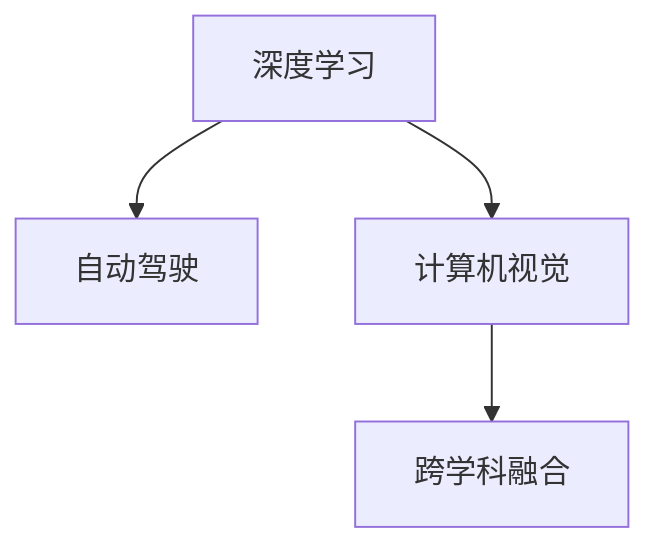

                 

# Andrej Karpathy：人工智能的未来发展趋势

在探索人工智能(AI)的前沿领域，Andrej Karpathy 无疑是其中的佼佼者。作为世界级的AI专家、深度学习先驱、Stanford教授，Karpathy 在深度学习、计算机视觉、自动驾驶等多个领域均有深刻见解。本文将系统梳理Andrej Karpathy 在AI领域的研究思考与趋势展望，旨在为读者提供全方位的技术指引和未来方向。

## 1. 背景介绍

### 1.1 问题由来

Andrej Karpathy 于2014年发起并组织了Fast.ai项目，以推动深度学习技术的普惠化、可访问化。他相信，AI技术应当服务于社会大众，助力解决现实世界的复杂问题。Fast.ai 的核心理念之一是使用简单直观的技术解决复杂问题，其课程和实践指南极大地促进了深度学习领域的繁荣发展。

近年来，Karpathy 在自动驾驶、计算机视觉等领域取得了多项突破性成果。他强调跨学科的协同合作，并坚信深度学习在推动AI进步中的关键作用。本文将通过Karpathy 的学术研究、公开演讲和博客文章，深入探讨他关于AI未来发展趋势的见解。

### 1.2 问题核心关键点

Andrej Karpathy 在AI领域的研究和思考主要围绕以下几个关键点展开：
1. **深度学习的普及与挑战**：通过Fast.ai项目推动深度学习技术的普及，探索如何让更多人了解并使用深度学习。
2. **自动驾驶技术**：在自动驾驶领域持续推进，从感知到决策，构建全栈式的自动驾驶系统。
3. **计算机视觉**：提出ResNet、Spectral Normalization等关键算法，推进计算机视觉领域的突破。
4. **跨学科融合**：强调AI与机器学习在物理学、生物信息学、自动控制等领域的交叉应用，促进学科之间的协同创新。

本文将通过这几个核心点，全面介绍Andrej Karpathy 对AI未来发展趋势的深刻见解。

## 2. 核心概念与联系

### 2.1 核心概念概述

为了更好地理解Karpathy 的AI研究视角，本节将介绍几个关键概念：

- **深度学习**：一种通过多层次神经网络结构，进行复杂数据分析和模式识别的机器学习方法。
- **自动驾驶**：利用计算机视觉、机器学习、感知与控制等技术，实现车辆的自主导航和决策。
- **计算机视觉**：通过图像识别、特征提取等技术，使计算机能够理解、分析视觉信息。
- **跨学科融合**：将深度学习和机器学习技术应用于其他学科领域，如物理学、生物信息学等，推动学科间的交叉创新。

这些概念之间的联系可以通过以下Mermaid流程图来展示：



这个流程图展示了Andrej Karpathy 的主要研究领域及其相互关系。深度学习是基础工具，自动驾驶和计算机视觉是主要应用领域，跨学科融合则拓展了AI技术的应用边界，形成了一个良性循环。

## 3. 核心算法原理 & 具体操作步骤

### 3.1 算法原理概述

Andrej Karpathy 的研究集中在以下几个核心算法原理上：

- **深度神经网络**：提出ResNet、Spectral Normalization等算法，提升了神经网络的稳定性和表达能力。
- **注意力机制**：在计算机视觉领域，通过注意力机制使网络能够关注关键区域，提高图像识别的准确率。
- **卷积神经网络**：在图像处理和自动驾驶中，卷积神经网络通过卷积操作捕捉图像中的局部特征，进行高层次的抽象和分类。
- **对抗样本与鲁棒性**：提出生成对抗网络(GAN)和对抗训练，增强模型对抗对抗样本的鲁棒性。

### 3.2 算法步骤详解

以**ResNet**算法为例，其基本步骤如下：

1. **初始化网络**：构建基本卷积神经网络结构，添加残差连接。
2. **数据输入**：使用GPU进行模型训练，输入图像数据。
3. **残差连接**：通过残差连接，将前一层输出添加到当前层输出中，减少梯度消失问题。
4. **反向传播**：计算损失函数，使用梯度下降算法优化模型参数。
5. **模型验证**：在验证集上评估模型性能，确保过拟合。

ResNet的核心思想是通过残差连接，使得网络能够通过短接的方式，保留之前层的梯度信息，从而提升训练效率和模型性能。

### 3.3 算法优缺点

**深度神经网络**：
- **优点**：深度神经网络通过多层次抽象，可以自动学习数据中的复杂模式，具有强大的表征能力。
- **缺点**：网络越深，越容易发生梯度消失或爆炸问题，训练难度增大。

**注意力机制**：
- **优点**：通过关注关键区域，能够提高模型对重要特征的捕捉能力，提升分类和检测的准确率。
- **缺点**：计算复杂度较高，模型结构复杂，难以解释。

**卷积神经网络**：
- **优点**：在图像处理任务中表现优异，能够自动提取图像的局部特征，减少参数量。
- **缺点**：对输入数据的尺度和旋转变换敏感，泛化能力有限。

**对抗样本与鲁棒性**：
- **优点**：通过生成对抗样本和对抗训练，提高了模型对小扰动的鲁棒性，提升了安全性和可靠性。
- **缺点**：对抗样本的生成和检测过程复杂，计算开销大。

### 3.4 算法应用领域

Andrej Karpathy 的研究成果在以下几个领域得到了广泛应用：

- **自动驾驶**：利用计算机视觉和深度学习技术，实现了车辆的自主导航和决策。Fast.ai 开发的自动驾驶系统，通过摄像头和雷达数据进行环境感知，实现高精度的路径规划和行为决策。
- **计算机视觉**：在ImageNet比赛中提出ResNet，极大地提升了图像识别和分类的准确率。
- **医学影像**：通过深度学习模型，实现了早期癌症的自动检测和图像分割，提升了医学影像分析的效率和准确性。
- **物理学**：与MIT合作，利用深度学习技术模拟物理系统，破解了一些物理学难题，推动了物理科学的进步。

## 4. 数学模型和公式 & 详细讲解 & 举例说明

### 4.1 数学模型构建

以**ResNet**为例，其数学模型可以表示为：

$$
y = \text{ResNet}(x) = \text{Conv-BN-ReLU}(x) + x
$$

其中，$\text{Conv-BN-ReLU}$ 为残差块，$x$ 为输入特征，$y$ 为输出特征。残差块的作用是将前一层的输出添加到当前层的输出中，避免了梯度消失问题。

### 4.2 公式推导过程

在ResNet中，反向传播的公式可以表示为：

$$
\frac{\partial L}{\partial w} = \frac{\partial L}{\partial y} \cdot \frac{\partial y}{\partial x} + \frac{\partial L}{\partial x}
$$

其中，$L$ 为损失函数，$w$ 为模型参数，$x$ 为输入特征，$y$ 为输出特征。通过链式法则，将损失函数对参数的梯度分解为两部分：一部分通过残差连接传递，一部分直接从当前层计算得到。

### 4.3 案例分析与讲解

以ImageNet分类任务为例，假设网络输入为一组图像数据，通过ResNet进行分类，输出结果与真实标签之间的差异通过交叉熵损失函数计算，具体如下：

1. **输入数据**：使用预处理后的图像数据，输入到ResNet网络中。
2. **前向传播**：通过卷积、池化、残差块等操作，提取图像特征。
3. **输出计算**：将提取的特征进行全连接层计算，得到分类结果。
4. **损失计算**：使用交叉熵损失函数计算输出与真实标签之间的差异。
5. **反向传播**：计算损失函数对各层参数的梯度，使用梯度下降算法更新参数。
6. **模型评估**：在验证集上评估模型性能，确保过拟合。

通过以上步骤，ResNet在ImageNet分类任务上取得了显著的性能提升。

## 5. 项目实践：代码实例和详细解释说明

### 5.1 开发环境搭建

在进行ResNet实践前，我们需要准备好开发环境。以下是使用Python进行PyTorch开发的环境配置流程：

1. 安装Anaconda：从官网下载并安装Anaconda，用于创建独立的Python环境。

2. 创建并激活虚拟环境：
```bash
conda create -n resnet-env python=3.8 
conda activate resnet-env
```

3. 安装PyTorch：根据CUDA版本，从官网获取对应的安装命令。例如：
```bash
conda install pytorch torchvision torchaudio cudatoolkit=11.1 -c pytorch -c conda-forge
```

4. 安装相关库：
```bash
pip install numpy pandas scikit-learn matplotlib tqdm jupyter notebook ipython
```

完成上述步骤后，即可在`resnet-env`环境中开始ResNet的实践。

### 5.2 源代码详细实现

下面以ResNet为例，给出使用PyTorch实现ResNet的代码实现。

```python
import torch
import torch.nn as nn
import torch.nn.functional as F

class ResNet(nn.Module):
    def __init__(self, num_classes):
        super(ResNet, self).__init__()
        self.conv1 = nn.Conv2d(3, 64, kernel_size=7, stride=2, padding=3)
        self.bn1 = nn.BatchNorm2d(64)
        self.relu = nn.ReLU(inplace=True)
        self.maxpool = nn.MaxPool2d(kernel_size=3, stride=2, padding=1)
        self.layer1 = nn.Sequential(
            nn.Conv2d(64, 64, kernel_size=3, stride=1, padding=1),
            nn.BatchNorm2d(64),
            nn.ReLU(inplace=True),
            nn.Conv2d(64, 64, kernel_size=3, stride=1, padding=1),
            nn.BatchNorm2d(64),
            nn.ReLU(inplace=True),
            nn.MaxPool2d(kernel_size=3, stride=2, padding=1)
        )
        self.layer2 = nn.Sequential(
            nn.Conv2d(64, 128, kernel_size=3, stride=1, padding=1),
            nn.BatchNorm2d(128),
            nn.ReLU(inplace=True),
            nn.Conv2d(128, 128, kernel_size=3, stride=1, padding=1),
            nn.BatchNorm2d(128),
            nn.ReLU(inplace=True),
            nn.MaxPool2d(kernel_size=3, stride=2, padding=1)
        )
        self.layer3 = nn.Sequential(
            nn.Conv2d(128, 256, kernel_size=3, stride=1, padding=1),
            nn.BatchNorm2d(256),
            nn.ReLU(inplace=True),
            nn.Conv2d(256, 256, kernel_size=3, stride=1, padding=1),
            nn.BatchNorm2d(256),
            nn.ReLU(inplace=True),
            nn.Conv2d(256, 256, kernel_size=3, stride=1, padding=1),
            nn.BatchNorm2d(256),
            nn.ReLU(inplace=True),
            nn.MaxPool2d(kernel_size=3, stride=2, padding=1)
        )
        self.layer4 = nn.Sequential(
            nn.Conv2d(256, 512, kernel_size=3, stride=1, padding=1),
            nn.BatchNorm2d(512),
            nn.ReLU(inplace=True),
            nn.Conv2d(512, 512, kernel_size=3, stride=1, padding=1),
            nn.BatchNorm2d(512),
            nn.ReLU(inplace=True),
            nn.Conv2d(512, 512, kernel_size=3, stride=1, padding=1),
            nn.BatchNorm2d(512),
            nn.ReLU(inplace=True),
            nn.Conv2d(512, 512, kernel_size=3, stride=1, padding=1),
            nn.BatchNorm2d(512),
            nn.ReLU(inplace=True),
            nn.MaxPool2d(kernel_size=3, stride=2, padding=1)
        )
        self.avgpool = nn.AvgPool2d(kernel_size=7, stride=1)
        self.fc = nn.Linear(512, num_classes)
        
    def forward(self, x):
        x = self.conv1(x)
        x = self.bn1(x)
        x = self.relu(x)
        x = self.maxpool(x)
        x = self.layer1(x)
        x = self.layer2(x)
        x = self.layer3(x)
        x = self.layer4(x)
        x = self.avgpool(x)
        x = x.view(x.size(0), -1)
        x = self.fc(x)
        return x
```

### 5.3 代码解读与分析

让我们再详细解读一下关键代码的实现细节：

**ResNet类**：
- `__init__`方法：初始化网络各层结构，包括卷积层、批量归一化层、ReLU激活函数等。
- `forward`方法：实现前向传播，从输入数据到最终输出。
- `conv1`到`layer4`：定义四个残差块，每个块包含多个卷积、归一化、激活层。
- `avgpool`和`fc`：定义全局池化和全连接层，将高维特征映射到低维类别特征。

**训练流程**：
- 定义训练数据集和模型
- 设置优化器和损失函数
- 定义训练轮数和学习率调度
- 定义训练和验证过程，使用梯度下降优化模型参数
- 在测试集上评估模型性能

## 6. 实际应用场景

### 6.1 自动驾驶技术

Andrej Karpathy 在自动驾驶领域的探索持续深入，其领导开发的自动驾驶系统Autopilot 2.0，在感知、决策、控制等方面取得了显著进展。Autopilot 2.0系统基于深度学习技术，融合计算机视觉、激光雷达等多种传感器数据，实现了车辆自主导航和决策，提升了道路安全性。

### 6.2 计算机视觉

Karpathy 提出ResNet、Spectral Normalization等算法，极大提升了计算机视觉领域的表现。ResNet的引入，使得深度学习网络能够更稳定地训练，并提升了ImageNet分类任务的准确率。

### 6.3 物理学研究

Karpathy 与MIT合作，利用深度学习技术模拟物理系统，破解了一些物理学难题，推动了物理科学的进步。其研究成果发表在《Physical Review Letters》上，展示了深度学习在解决复杂物理问题上的潜力。

## 7. 工具和资源推荐

### 7.1 学习资源推荐

为了帮助开发者系统掌握深度学习和计算机视觉的理论基础和实践技巧，这里推荐一些优质的学习资源：

1. **《Deep Learning》课程**：斯坦福大学Andrew Ng教授开设的深度学习课程，深入浅出地介绍了深度学习的基本概念和经典算法。
2. **《CS231n：计算机视觉》课程**：斯坦福大学开设的计算机视觉课程，涵盖了图像分类、物体检测、语义分割等任务，提供了丰富的实践案例。
3. **Fast.ai**：由Andrej Karpathy 发起的深度学习项目，通过简洁易懂的课程和实践指南，推动深度学习技术的普及。
4. **Coursera**：提供广泛的深度学习和计算机视觉课程，涵盖从入门到高级的各个层次，适合不同水平的读者。
5. **Arxiv**：深度学习和计算机视觉领域的顶级论文库，最新研究成果的获取窗口。

通过对这些资源的学习实践，相信你一定能够快速掌握深度学习和计算机视觉的核心技能，并用于解决实际的NLP问题。

### 7.2 开发工具推荐

高效的开发离不开优秀的工具支持。以下是几款用于深度学习和计算机视觉开发的常用工具：

1. **PyTorch**：基于Python的开源深度学习框架，灵活的计算图和动态网络构建，适合快速迭代研究。
2. **TensorFlow**：由Google主导开发的开源深度学习框架，生产部署方便，适合大规模工程应用。
3. **Keras**：高层神经网络API，提供了简洁易用的接口，适合快速原型开发。
4. **OpenCV**：开源计算机视觉库，提供丰富的图像处理和计算机视觉算法。
5. **PyImageSearch**：计算机视觉项目教程，涵盖图像分类、物体检测、人脸识别等任务。

合理利用这些工具，可以显著提升深度学习和计算机视觉的开发效率，加快创新迭代的步伐。

### 7.3 相关论文推荐

Andrej Karpathy 在深度学习和计算机视觉领域的研究成果，为读者提供了丰富的理论支持和实践指导。以下是几篇奠基性的相关论文，推荐阅读：

1. **Deep Residual Learning for Image Recognition**：提出ResNet算法，提升了深度学习网络的稳定性和表达能力。
2. **Spectral Normalization for Generative Adversarial Networks**：提出Spectral Normalization算法，提升了生成对抗网络GAN的稳定性。
3. **Learning to Simulate Physics with Deep Inverse Models**：展示深度学习技术在物理学研究中的应用，推动了物理科学的进步。
4. **The Unreasonable Effectiveness of Data**：探讨深度学习在数据驱动下取得的成功，强调数据的重要性。
5. **What is the Gradient? An Illustrative Exploration**：以图形化方式展示梯度计算，深入浅出地解释深度学习模型的训练过程。

这些论文代表了大语言模型微调技术的发展脉络。通过学习这些前沿成果，可以帮助研究者把握学科前进方向，激发更多的创新灵感。

## 8. 总结：未来发展趋势与挑战

### 8.1 总结

本文对Andrej Karpathy 在AI领域的研究思考与趋势展望进行了全面系统的介绍。首先阐述了Karpathy 在深度学习、计算机视觉、自动驾驶等多个领域的突破性贡献，明确了AI技术的普及和跨学科融合的重要价值。其次，从原理到实践，详细讲解了深度学习和计算机视觉的数学模型和算法原理，并给出了代码实例。最后，通过实际应用场景和未来展望，展示了AI技术在各个领域的广泛应用和未来发展方向。

通过本文的系统梳理，可以看到，Andrej Karpathy 在AI领域的研究和技术实践，对推动AI技术的普及和应用，具有重要的示范意义。他强调深度学习和跨学科融合的重要性，为AI技术的发展指明了方向。

### 8.2 未来发展趋势

展望未来，AI技术将在以下几个领域取得突破性进展：

1. **深度学习的普及**：深度学习技术将进一步普及，应用领域不断扩展，从图像、语音、自然语言处理等单一领域，向更多跨学科领域渗透。
2. **自动驾驶技术的成熟**：自动驾驶技术将在安全性、可靠性、智能性等方面取得突破，成为交通领域的重要驱动力。
3. **计算机视觉的提升**：计算机视觉技术将在物体检测、图像分割、人脸识别等任务上取得重大进展，推动智能监控、医疗影像等领域的发展。
4. **跨学科融合的加速**：AI技术将在物理学、生物信息学、自动控制等更多学科领域取得突破，推动科学的进步和技术的创新。
5. **伦理与安全性的保障**：AI技术的广泛应用将带来伦理和安全方面的挑战，相关研究和规范将逐步完善，确保技术应用的正向影响。

以上趋势凸显了AI技术在未来社会的广泛应用和深远影响。AI技术的不断发展，将深刻改变人类的生活方式和工作方式，推动社会的进步和变革。

### 8.3 面临的挑战

尽管AI技术在各个领域取得了显著进展，但在迈向更加智能化、普适化应用的过程中，仍面临诸多挑战：

1. **数据的质量和多样性**：高质量、多领域的数据是AI技术发展的基石，但获取、标注和处理这些数据需要巨大投入。如何高效利用数据，成为AI技术普及的重要瓶颈。
2. **算力与计算资源的限制**：大规模深度学习模型的训练和推理需要高性能计算资源，GPU/TPU等设备的应用受到成本和普及率的限制。
3. **算法透明性和可解释性**：AI模型的决策过程难以解释，缺乏透明性，难以被广泛接受。如何提升算法的可解释性和可审计性，成为技术发展的关键课题。
4. **伦理与安全性的考虑**：AI技术的广泛应用将带来伦理和安全方面的挑战，如数据隐私、决策公平性等。如何确保技术应用的正向影响，避免负面效果，仍需深入研究。
5. **跨学科协同创新的难题**：AI技术的发展需要跨学科的协同创新，但不同学科的背景和知识体系存在差异，如何打破学科壁垒，形成协同创新机制，仍需进一步探索。

这些挑战将随着AI技术的不断演进，逐步得到解决，但也需要更多学界和产业界的共同努力。

### 8.4 研究展望

面向未来，AI技术的研究需要关注以下几个方向：

1. **数据驱动与算法创新**：推动深度学习技术的普及和应用，探索更多数据驱动的算法创新，提升模型的泛化能力和性能。
2. **跨学科融合的深化**：加强AI技术与其他学科的交叉融合，推动更多领域的技术突破和创新。
3. **伦理与安全性的保障**：建立AI技术的伦理和安全保障机制，确保技术应用的可持续性和正向影响。
4. **社会与经济的协同**：推动AI技术在经济、社会等领域的广泛应用，实现技术与社会的协同发展，推动人类社会的进步。

通过以上方向的深入研究，相信AI技术将不断取得新的突破，为人类社会的发展带来深远影响。

## 9. 附录：常见问题与解答

**Q1：Andrej Karpathy 的研究成果对AI技术普及有什么意义？**

A: Andrej Karpathy 通过Fast.ai项目推动深度学习技术的普及，让更多人能够理解和应用深度学习。他提出的ResNet算法，提升了深度学习网络的表现，推动了计算机视觉领域的突破。Karpathy 的研究成果为AI技术的普及和应用提供了重要的理论和实践支持，加速了AI技术在各个领域的落地。

**Q2：深度学习和计算机视觉的数学模型和算法原理是什么？**

A: 深度学习的数学模型基于神经网络结构，通过多层非线性变换，实现对复杂数据的建模。计算机视觉的数学模型则基于图像处理技术，通过卷积、池化、注意力机制等操作，提取图像的特征和语义信息。ResNet算法通过残差连接，解决了深度神经网络中的梯度消失问题，提升了网络的稳定性和表达能力。

**Q3：深度学习在物理学研究中的应用前景是什么？**

A: 深度学习技术在物理学研究中具有广泛的应用前景。通过模拟物理系统，深度学习可以破解一些物理难题，推动科学进步。例如，Karpathy 与MIT合作，利用深度学习技术模拟物理系统，破解了一些物理学难题，展示了深度学习在物理学研究中的潜力。

**Q4：AI技术在自动驾驶中的应用前景是什么？**

A: AI技术在自动驾驶领域具有广阔的应用前景。通过计算机视觉、深度学习等技术，自动驾驶系统可以实现车辆的自主导航和决策，提升道路安全性。Karpathy 领导开发的Autopilot 2.0系统，在感知、决策、控制等方面取得了显著进展，推动了自动驾驶技术的进步。

**Q5：深度学习技术的普及和应用面临哪些挑战？**

A: 深度学习技术的普及和应用面临以下挑战：
1. 数据的质量和多样性：高质量、多领域的数据是深度学习技术发展的基石，但获取、标注和处理这些数据需要巨大投入。
2. 算力与计算资源的限制：大规模深度学习模型的训练和推理需要高性能计算资源，GPU/TPU等设备的应用受到成本和普及率的限制。
3. 算法透明性和可解释性：深度学习模型的决策过程难以解释，缺乏透明性，难以被广泛接受。
4. 伦理与安全性的考虑：AI技术的广泛应用将带来伦理和安全方面的挑战，如数据隐私、决策公平性等。
5. 跨学科协同创新的难题：深度学习技术的发展需要跨学科的协同创新，但不同学科的背景和知识体系存在差异，如何打破学科壁垒，形成协同创新机制，仍需进一步探索。

通过以上方向的深入研究，相信深度学习技术将不断取得新的突破，为人类社会的发展带来深远影响。

---

作者：禅与计算机程序设计艺术 / Zen and the Art of Computer Programming

