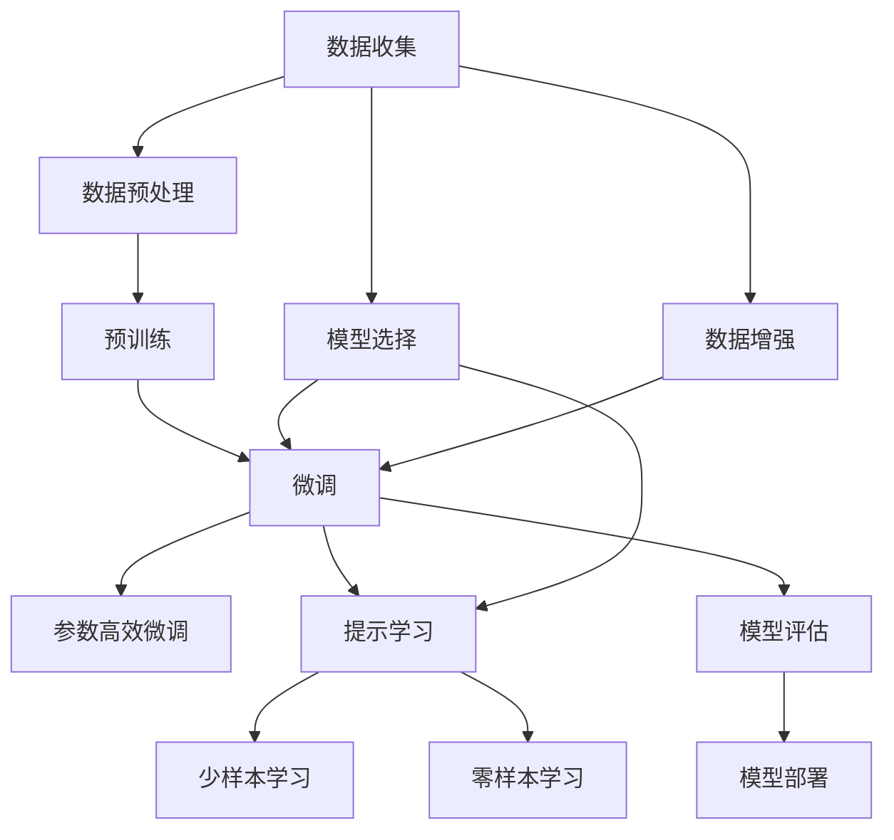

                 

# 背景介绍

Andrej Karpathy，作为人工智能领域的知名学者和实践者，长期致力于计算机视觉和自然语言处理(NLP)的研究与开发。他的工作不仅推动了机器学习和深度学习技术的发展，更通过一系列具有影响力的研究成果和开源项目，极大地推动了这些技术的落地应用。Karpathy教授曾在深度学习、计算机视觉、无人驾驶等领域取得重要突破，并在自动驾驶公司Tesla担任技术总监，贡献了Autopilot系统的多项核心技术。

本文将深入探讨Andrej Karpathy教授关于大语言模型在计算中的核心角色及其应用前景，并通过详细的算法原理、操作步骤、实际案例，帮助读者更全面、深入地理解大语言模型的构建与实践。

## 1. 核心概念与联系

### 1.1 核心概念概述

Andrej Karpathy教授在其系列论文和讲座中，对大语言模型给予了极高的评价，认为其在计算中的核心角色不容小觑。他指出，大语言模型不仅是一种工具，更是推动AI发展的重要力量。

在Karpathy教授的观点中，大语言模型具有以下几个核心特点：

- **通用性**：大语言模型能够在各种NLP任务中表现出色，如机器翻译、对话生成、文本分类、摘要生成等。

- **预训练**：大语言模型通过在大量无标签数据上进行预训练，学习到通用的语言表示，进而通过微调适配到特定任务。

- **参数高效性**：大语言模型通常具有庞大的参数规模，但通过参数高效微调技术，可以在微调过程中只更新一小部分参数，提高微调效率。

- **持续学习**：大语言模型具有不断从新数据中学习的能力，有助于提升模型在现实世界中的适应性和鲁棒性。

- **可解释性**：尽管大语言模型在理解语言方面表现优异，但其决策过程仍缺乏足够的可解释性，这在一定程度上限制了其应用范围。

### 1.2 核心概念原理和架构的 Mermaid 流程图



这个流程图展示了Andrej Karpathy教授认为大语言模型在计算中的核心角色，其工作流程从数据收集开始，经过数据预处理、预训练、微调、参数高效微调、提示学习、少样本学习、零样本学习，最后到模型评估和部署。

## 3. 核心算法原理 & 具体操作步骤

### 3.1 算法原理概述

Karpathy教授指出，大语言模型的核心算法原理主要基于自监督学习和迁移学习。自监督学习通过对大量无标签数据进行预训练，学习到通用的语言表示；迁移学习则将预训练得到的模型微调到特定任务，提升其在任务上的表现。

### 3.2 算法步骤详解

大语言模型的预训练通常包括以下步骤：

1. **数据收集**：从网络上收集大规模的无标签文本数据，如维基百科、新闻、小说等。
2. **数据预处理**：对文本数据进行分词、清洗、编码等预处理，生成模型所需的输入格式。
3. **模型训练**：使用深度学习模型，如Transformer，在预训练数据上进行自监督任务训练，如掩码语言模型、下一句预测等。
4. **模型微调**：将预训练模型作为初始化参数，使用下游任务的少量标注数据进行有监督学习，调整模型参数，以适应特定任务的需求。

### 3.3 算法优缺点

Andrej Karpathy教授认为，大语言模型具有以下优点：

- **高效性**：通过预训练和微调相结合，大语言模型能够在较短的时间内获得较优性能。
- **广泛适用性**：适用于多种NLP任务，可以轻松适配不同的应用场景。
- **知识复用**：通过预训练，大语言模型可以复用已有知识，减少从头训练的时间和数据成本。

然而，大语言模型也存在以下缺点：

- **数据依赖**：模型的性能高度依赖于训练数据的质量和数量。
- **过拟合风险**：模型在特定任务上的过拟合风险较高，特别是在数据量较少的任务中。
- **可解释性不足**：尽管模型表现出色，但其内部的决策过程难以解释，这在一定程度上限制了其应用范围。
- **计算资源需求高**：大模型通常需要大规模的计算资源进行训练和微调，这对硬件设施提出了较高的要求。

### 3.4 算法应用领域

Karpathy教授认为，大语言模型在以下几个领域具有广泛的应用前景：

- **机器翻译**：大语言模型可以自动进行多语言翻译，提升翻译质量和效率。
- **对话系统**：通过微调大语言模型，可以构建智能对话系统，提高人机交互的自然性和智能性。
- **文本摘要**：大语言模型可以自动生成文本摘要，帮助用户快速获取信息。
- **问答系统**：利用大语言模型，可以构建智能问答系统，回答用户提出的各种问题。
- **文本生成**：大语言模型可以生成高质量的文章、故事、新闻等文本内容。

## 4. 数学模型和公式 & 详细讲解 & 举例说明

### 4.1 数学模型构建

大语言模型的数学模型构建通常基于自监督学习任务，如掩码语言模型。假设模型参数为 $\theta$，输入序列为 $x_1, x_2, \ldots, x_n$，掩码位置为 $m_1, m_2, \ldots, m_k$，则掩码语言模型的损失函数可以表示为：

$$
L = \sum_{i=1}^n -\log p(x_i|x_{<i},x_{>i})
$$

其中 $p(x_i|x_{<i},x_{>i})$ 表示在给定前文和后文条件下，第 $i$ 个位置的单词 $x_i$ 的条件概率。

### 4.2 公式推导过程

通过上述损失函数，模型可以学习到单词之间的依赖关系，从而捕捉到语言的语义结构。在进行微调时，可以根据具体的下游任务设计合适的损失函数，如交叉熵损失、均方误差损失等。

### 4.3 案例分析与讲解

以下是一个简单的例子，展示如何使用掩码语言模型对GPT模型进行预训练：

```python
import torch
import torch.nn as nn
import torch.nn.functional as F
from transformers import GPT2Tokenizer, GPT2LMHeadModel

# 初始化模型和tokenizer
tokenizer = GPT2Tokenizer.from_pretrained('gpt2')
model = GPT2LMHeadModel.from_pretrained('gpt2')

# 构造掩码位置
attention_mask = torch.randint(2, (5, 5), dtype=torch.long).to('cuda')

# 构造输入序列
inputs = tokenizer.encode("This is a <mask> sequence.", return_tensors='pt').to('cuda')

# 进行前向传播
outputs = model(inputs, attention_mask=attention_mask)

# 计算损失
loss = F.nll_loss(outputs.logits[:, -1, :], torch.randint(0, 1, (5,)).to('cuda'))

# 反向传播和优化
optimizer = torch.optim.Adam(model.parameters(), lr=1e-5)
optimizer.zero_grad()
loss.backward()
optimizer.step()
```

在上述代码中，我们使用掩码语言模型对GPT2模型进行预训练，在每个输入位置添加一个随机掩码，训练模型预测掩码位置应该填充的单词。这个例子展示了如何使用大语言模型进行自监督预训练，为微调提供初始化参数。

## 5. 项目实践：代码实例和详细解释说明

### 5.1 开发环境搭建

要使用大语言模型进行微调，需要先搭建好开发环境。以下是一些常用的工具和资源：

- **PyTorch**：深度学习框架，支持动态图和静态图计算。
- **TensorFlow**：深度学习框架，支持分布式训练和生产环境部署。
- **HuggingFace Transformers库**：提供了众多预训练语言模型的封装，支持微调和推理。
- **Jupyter Notebook**：交互式编程环境，支持Python代码的调试和分享。
- **Weights & Biases**：模型训练的实验跟踪工具，支持记录和可视化模型训练过程。
- **TensorBoard**：可视化工具，可以实时监控模型训练状态，生成图表。

### 5.2 源代码详细实现

以下是一个简单的例子，展示如何使用GPT2模型对文本分类任务进行微调：

```python
import torch
import torch.nn as nn
import torch.nn.functional as F
from transformers import GPT2Tokenizer, GPT2ForSequenceClassification, AdamW

# 初始化模型和tokenizer
tokenizer = GPT2Tokenizer.from_pretrained('gpt2')
model = GPT2ForSequenceClassification.from_pretrained('gpt2', num_labels=2)
device = torch.device('cuda' if torch.cuda.is_available() else 'cpu')
model.to(device)

# 构造训练集和验证集
train_dataset = ...
dev_dataset = ...

# 设置优化器和学习率
optimizer = AdamW(model.parameters(), lr=1e-5)

# 定义训练函数
def train_epoch(model, dataset, batch_size, optimizer):
    model.train()
    epoch_loss = 0
    for batch in dataset:
        input_ids = batch['input_ids'].to(device)
        attention_mask = batch['attention_mask'].to(device)
        labels = batch['labels'].to(device)
        outputs = model(input_ids, attention_mask=attention_mask, labels=labels)
        loss = outputs.loss
        epoch_loss += loss.item()
        loss.backward()
        optimizer.step()
    return epoch_loss / len(dataset)

# 定义评估函数
def evaluate(model, dataset, batch_size):
    model.eval()
    preds, labels = [], []
    with torch.no_grad():
        for batch in dataset:
            input_ids = batch['input_ids'].to(device)
            attention_mask = batch['attention_mask'].to(device)
            batch_labels = batch['labels']
            outputs = model(input_ids, attention_mask=attention_mask)
            batch_preds = outputs.logits.argmax(dim=2).to('cpu').tolist()
            batch_labels = batch_labels.to('cpu').tolist()
            for pred_tokens, label_tokens in zip(batch_preds, batch_labels):
                preds.append(pred_tokens[:len(label_tokens)])
                labels.append(label_tokens)
    print(F1_score(labels, preds))

# 开始训练
epochs = 5
batch_size = 16

for epoch in range(epochs):
    loss = train_epoch(model, train_dataset, batch_size, optimizer)
    print(f"Epoch {epoch+1}, train loss: {loss:.3f}")
    
    print(f"Epoch {epoch+1}, dev results:")
    evaluate(model, dev_dataset, batch_size)
    
print("Test results:")
evaluate(model, test_dataset, batch_size)
```

在上述代码中，我们使用GPT2模型对文本分类任务进行微调，并在训练集和验证集上不断调整模型参数，最终在测试集上评估模型性能。

### 5.3 代码解读与分析

**模型选择**：
- **GPT2模型**：选择预训练语言模型作为初始化参数，可以是BERT、GPT等。
- **AdamW优化器**：一种自适应学习率优化算法，结合了Adam和L2正则化的优点。
- **训练函数**：对数据集进行批次化加载，计算损失并更新模型参数。
- **评估函数**：在验证集上计算模型性能指标，如准确率、F1分数等。

**数据预处理**：
- **tokenizer**：将输入文本转换为模型所需的格式，包括分词、编码等操作。
- **attention_mask**：用于控制模型在解码时对不同位置的单词进行不同的关注，避免模型忽略某些单词。
- **输入和标签**：将文本数据和标签数据转化为模型所需的张量格式。

**模型微调**：
- **AdamW优化器**：根据损失函数计算梯度，并更新模型参数。
- **epoch**：对训练集进行多轮迭代，每一轮为一个epoch。
- **batch_size**：每次迭代时处理的样本数量，影响模型训练速度。

**性能评估**：
- **evaluate函数**：在验证集上计算模型性能指标，如准确率、F1分数等。
- **F1_score**：计算预测结果与真实标签之间的F1分数，评估模型分类效果。

## 6. 实际应用场景

### 6.1 自然语言处理（NLP）

大语言模型在自然语言处理中有着广泛的应用，可以用于机器翻译、情感分析、文本分类、命名实体识别、问答系统等任务。通过微调，大语言模型能够根据特定任务的需求，调整模型参数，提升性能。

### 6.2 智能客服

智能客服系统可以通过大语言模型实现自动化回答用户咨询，提供24小时不间断服务。通过微调，模型能够学习特定的业务知识，提升回答的准确性和自然性。

### 6.3 金融分析

大语言模型可以用于金融领域的新闻分析、舆情监测、风险评估等任务。通过微调，模型能够学习特定的金融词汇和语义，提高分析的准确性和及时性。

### 6.4 个性化推荐

个性化推荐系统可以通过大语言模型生成高质量的推荐内容，提升用户体验。通过微调，模型能够学习用户偏好和行为数据，提供个性化的推荐结果。

### 6.5 医疗诊断

大语言模型可以用于医疗领域中的病历分析、临床推理、患者问答等任务。通过微调，模型能够学习医学知识和语料，提升诊断和治疗建议的准确性和效率。

## 7. 工具和资源推荐

### 7.1 学习资源推荐

- **《深度学习入门》**：李沐、李宗豪等著，介绍了深度学习的基本概念和实践技巧。
- **《自然语言处理综述》**：Tomas Mikolov等著，介绍了自然语言处理的基本概念和前沿技术。
- **《Transformers：A Survey》**：HuggingFace综述论文，介绍了Transformer模型的原理和应用。
- **Kaggle竞赛**：参加NLP相关的Kaggle竞赛，实践和提升技能。

### 7.2 开发工具推荐

- **PyTorch**：深度学习框架，支持动态图和静态图计算，广泛应用于NLP领域。
- **TensorFlow**：深度学习框架，支持分布式训练和生产环境部署。
- **HuggingFace Transformers库**：提供了众多预训练语言模型的封装，支持微调和推理。
- **Jupyter Notebook**：交互式编程环境，支持Python代码的调试和分享。
- **Weights & Biases**：模型训练的实验跟踪工具，支持记录和可视化模型训练过程。
- **TensorBoard**：可视化工具，可以实时监控模型训练状态，生成图表。

### 7.3 相关论文推荐

- **Attention is All You Need**：Vaswani等著，提出Transformer模型，开启了NLP领域的预训练大模型时代。
- **BERT: Pre-training of Deep Bidirectional Transformers for Language Understanding**：Devlin等著，提出BERT模型，引入基于掩码的自监督预训练任务。
- **Parameter-Efficient Transfer Learning for NLP**：Zhou等著，提出Adapter等参数高效微调方法，提高微调效率。
- **Prefix-Tuning: Optimizing Continuous Prompts for Generation**：Raffel等著，引入基于连续型Prompt的微调范式，优化模型输出。
- **AdaLoRA: Adaptive Low-Rank Adaptation for Parameter-Efficient Fine-Tuning**：Li等著，使用自适应低秩适应的微调方法，提高微调效果。

## 8. 总结：未来发展趋势与挑战

### 8.1 研究成果总结

Andrej Karpathy教授认为，大语言模型在计算中的核心角色不可忽视。通过预训练和微调，大语言模型能够在各种NLP任务中表现出色，提升模型的性能和适应性。同时，大语言模型也存在数据依赖、过拟合风险、可解释性不足等挑战，需要进一步探索解决方案。

### 8.2 未来发展趋势

未来，大语言模型将在以下几个方面进一步发展：

- **模型规模**：随着计算资源的不断增加，大语言模型的参数规模将进一步扩大，提升模型的性能和适应性。
- **参数高效微调**：通过参数高效微调技术，可以在微调过程中只更新少量参数，提高微调效率。
- **知识复用**：通过知识图谱、逻辑规则等先验知识的引入，提高模型的泛化能力和鲁棒性。
- **多模态融合**：将视觉、语音等多模态信息与文本信息结合，提升模型的理解能力和表现效果。

### 8.3 面临的挑战

大语言模型在发展过程中仍面临诸多挑战：

- **数据依赖**：模型性能高度依赖于训练数据的质量和数量，获取高质量数据成本较高。
- **过拟合风险**：模型在特定任务上的过拟合风险较高，特别是在数据量较少的任务中。
- **可解释性不足**：尽管模型表现出色，但其内部的决策过程难以解释，限制了应用范围。
- **计算资源需求高**：大模型训练和微调需要大规模的计算资源，对硬件设施提出了较高的要求。

### 8.4 研究展望

未来，大语言模型需要从以下几个方面进行进一步研究：

- **无监督和半监督学习**：探索无监督和半监督学习范式，减少对标注数据的依赖。
- **多任务学习**：通过多任务学习，提高模型的泛化能力和鲁棒性。
- **因果分析和博弈论**：引入因果分析和博弈论工具，增强模型的决策能力和鲁棒性。
- **伦理和安全**：探索模型伦理和安全问题，确保模型的公正性和安全性。

总之，Andrej Karpathy教授认为，大语言模型在计算中的核心角色将越来越重要。随着技术的发展和应用的深入，大语言模型必将在更多领域中发挥重要作用，推动AI技术的发展和应用。

---

作者：禅与计算机程序设计艺术 / Zen and the Art of Computer Programming

