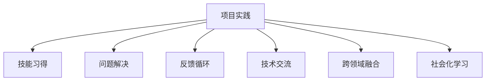

                 

# Andrej Karpathy：通过做项目来获得奖励

在人工智能领域，Andrej Karpathy无疑是一位备受尊敬的先驱者。作为一名科技创业者、特斯拉的AI负责人、斯坦福大学计算机科学教授，Karpathy不仅在学术界和工业界都有着极高的声誉，其对于人工智能教育和实践的贡献也深远影响了一代又一代的开发者。本文将通过分析Karpathy的实践经验，探讨如何通过项目实践提升技能，并获得相应的奖励和认可。

## 1. 背景介绍

### 1.1 问题由来
Andrej Karpathy在机器学习和人工智能领域的研究和实践已超过20年，期间积累了丰富的项目经验，尤其是在计算机视觉和深度学习方面。他的工作不仅涵盖了从基础研究到实际应用的全过程，更延伸到了教育和技术传播。Karpathy非常重视项目实践在技能提升和职业发展中的重要性，并强调通过实际项目来学习和成长。

### 1.2 问题核心关键点
Karpathy认为，项目实践对于技能提升和职业发展具有关键作用，主要有以下几个方面：
- **技能习得**：通过解决实际问题，可以掌握所需技能，并将理论知识应用到实践中。
- **问题解决**：项目实践帮助开发者解决复杂问题，增强分析、设计和编程能力。
- **反馈循环**：实践中获得的反馈可以指导改进，逐步优化解决方案。
- **技术交流**：项目实践促进了开发者间的交流合作，借鉴他人经验。

## 2. 核心概念与联系

### 2.1 核心概念概述

为了更好地理解项目实践如何帮助提升技能，我们将介绍几个核心概念：

- **项目实践（Project-based Learning）**：通过具体项目，进行技能训练和经验积累的过程。项目实践强调实际问题解决，而非单纯理论学习。
- **反馈循环（Feedback Loop）**：在项目实践中，从反馈中不断改进解决方案，优化学习效果。
- **跨领域融合（Interdisciplinary Fusion）**：项目实践往往涉及多领域知识，促进跨领域融合和综合能力的提升。
- **社会化学习（Social Learning）**：通过团队协作和开源项目，交流合作，共同提升技能。

### 2.2 核心概念原理和架构的 Mermaid 流程图



## 3. 核心算法原理 & 具体操作步骤

### 3.1 算法原理概述

Karpathy强调，通过项目实践获得奖励，并非简单的“苦劳”，而是要通过高效的项目管理和持续的反馈循环，不断提升自己的技能。

### 3.2 算法步骤详解

#### 步骤1：明确项目目标和需求
项目实践的第一步，是明确项目的目标和需求。这包括确定项目类型（如开发新功能、改进现有系统等），理解业务需求和用户期望。

#### 步骤2：设计方案和原型
根据项目目标，设计一个可行的方案和初步的原型。这一步通常涉及算法选择、架构设计、界面原型等。

#### 步骤3：实现和测试
在明确了方案和原型后，进行代码实现和单元测试。这是项目实践中技术实现的阶段。

#### 步骤4：持续反馈和优化
在开发过程中，不断从用户反馈、测试结果、同行评审中获取反馈，根据反馈进行优化。这包括修改代码、调整算法、改进用户体验等。

#### 步骤5：发布和维护
项目完成后，发布到生产环境，并持续进行维护和更新。确保系统稳定、高效运行，并根据新需求进行迭代升级。

### 3.3 算法优缺点

#### 优点
- **实战经验**：项目实践提供了真实的实战经验，帮助开发者更好地理解和应用所学知识。
- **技能提升**：项目实践涉及多方面技能，包括编程、设计、沟通、团队协作等，全面提升个人能力。
- **创新和创造**：通过项目实践，可以探索新的解决方案，推动技术创新。
- **职业发展**：高质量的项目成果可以提升个人职业声誉，获得更好的发展机会。

#### 缺点
- **时间和精力投入大**：项目实践需要大量时间和精力投入，短期内可能影响其他任务。
- **资源和工具依赖**：高质量的项目实践需要相应的资源和工具支持，可能存在成本问题。
- **失败风险**：项目实践有可能失败，需要承担一定风险。

### 3.4 算法应用领域

项目实践广泛应用于各个技术领域，包括但不限于：

- **软件开发**：通过实际软件开发项目，提升编码、测试、部署等技能。
- **数据科学**：通过数据分析和机器学习项目，提升数据处理、模型训练和应用能力。
- **计算机视觉**：通过图像处理和计算机视觉项目，提升算法实现和应用能力。
- **自然语言处理**：通过自然语言处理项目，提升语言模型训练、文本分析能力。
- **人工智能**：通过AI研究和应用项目，提升算法设计、模型优化和系统集成能力。

## 4. 数学模型和公式 & 详细讲解 & 举例说明

### 4.1 数学模型构建

在项目实践中，数学模型常常是解决实际问题的关键。以下以计算机视觉项目为例，说明如何构建数学模型：

#### 4.2 公式推导过程

在计算机视觉项目中，常见的数学模型包括卷积神经网络（CNN）、回归模型、分类模型等。以CNN为例，其基本结构可以表示为：

$$
y = W \times x + b
$$

其中，$x$ 为输入数据，$W$ 为权重矩阵，$b$ 为偏置项，$y$ 为输出。

### 4.3 案例分析与讲解

以Karpathy自己的项目——视觉问答系统Visual Genome为例，该项目主要通过图像和文本的匹配，实现自动化的视觉问答。在项目中，使用了CNN和LSTM等模型，通过多层次特征提取和融合，实现了高效的图像-文本匹配和推理。

## 5. 项目实践：代码实例和详细解释说明

### 5.1 开发环境搭建

为了进行项目实践，首先需要搭建好开发环境。以计算机视觉项目为例，以下是Python环境搭建的步骤：

1. 安装Python和相关库，如NumPy、Pandas、Matplotlib、OpenCV等。
2. 安装深度学习框架，如TensorFlow或PyTorch。
3. 配置GPU加速，确保项目能够高效运行。

### 5.2 源代码详细实现

以下是一个简单的计算机视觉项目——图像分类器（Image Classifier）的实现示例：

```python
import tensorflow as tf
from tensorflow.keras import layers

model = tf.keras.Sequential([
    layers.Conv2D(32, (3, 3), activation='relu', input_shape=(224, 224, 3)),
    layers.MaxPooling2D((2, 2)),
    layers.Conv2D(64, (3, 3), activation='relu'),
    layers.MaxPooling2D((2, 2)),
    layers.Conv2D(128, (3, 3), activation='relu'),
    layers.MaxPooling2D((2, 2)),
    layers.Flatten(),
    layers.Dense(10, activation='softmax')
])

model.compile(optimizer='adam',
              loss='categorical_crossentropy',
              metrics=['accuracy'])

model.fit(train_images, train_labels, epochs=10, validation_data=(test_images, test_labels))
```

### 5.3 代码解读与分析

在上述代码中，使用了卷积神经网络（CNN）进行图像分类。主要步骤包括：
- 定义模型结构，包含卷积层、池化层和全连接层。
- 编译模型，设置优化器、损失函数和评估指标。
- 训练模型，使用训练集和验证集进行多轮迭代训练。

### 5.4 运行结果展示

训练完成后，模型可以对新的图像进行分类预测，展示其准确性。

```python
predictions = model.predict(test_images)
```

## 6. 实际应用场景

### 6.1 智能驾驶
Andrej Karpathy在特斯拉工作期间，推动了自动驾驶技术的发展。通过项目实践，他和团队不断优化算法、硬件和软件系统，使得特斯拉的自动驾驶系统逐渐成熟。

### 6.2 图像处理
Karpathy在计算机视觉领域的研究成果，广泛应用于图像处理、图像识别、图像生成等多个场景，如医学影像分析、目标检测等。

### 6.3 自然语言处理
Karpathy还涉及自然语言处理项目，如问答系统、语言模型训练等。通过实际项目，提升了自己的语言理解和处理能力。

## 7. 工具和资源推荐

### 7.1 学习资源推荐

为了提升项目实践能力，以下是一些推荐的资源：

- **在线课程**：Coursera、edX等平台上的机器学习和深度学习课程，如斯坦福大学Andrew Ng的机器学习课程。
- **书籍**：《深度学习》（Ian Goodfellow）、《动手学深度学习》（李沐）等经典教材。
- **开源项目**：GitHub上的深度学习项目，如TensorFlow、PyTorch等框架的官方教程和示例代码。

### 7.2 开发工具推荐

以下是一些常用的开发工具，可用于项目实践：

- **Python**：作为数据科学和机器学习的主流语言，Python提供了丰富的库和框架支持。
- **Jupyter Notebook**：用于编写和共享数据科学项目，支持多语言的代码实现和可视化。
- **Git**：用于版本控制和代码管理，支持多人协作和代码历史追踪。
- **TensorBoard**：用于可视化模型的训练过程和结果，帮助开发者调试和优化模型。

### 7.3 相关论文推荐

以下是几篇Karpathy的重要论文，推荐阅读：

- "Deep Learning for Self-Driving Cars"：介绍了深度学习在自动驾驶中的应用。
- "Learning to Discover Cross-Domain Relations with Graph Networks"：研究了多领域数据融合的算法。
- "Neural Architecture Search with Reinforcement Learning"：探讨了深度学习架构搜索的强化学习算法。

## 8. 总结：未来发展趋势与挑战

### 8.1 研究成果总结

通过项目实践，Andrej Karpathy在多个领域取得了丰硕的研究成果，推动了深度学习和计算机视觉技术的发展。

### 8.2 未来发展趋势

未来，项目实践将继续发挥重要作用，推动技术创新和产业发展。以下是几个趋势：

- **跨领域融合**：未来项目实践将更多涉及跨领域融合，如计算机视觉与自然语言处理的结合。
- **实时性**：未来项目实践将更加注重实时性，提高系统的响应速度和稳定性。
- **可解释性**：未来项目实践将重视模型的可解释性，提升系统的透明性和可理解性。

### 8.3 面临的挑战

尽管项目实践在技能提升和职业发展中具有重要价值，但也面临一些挑战：

- **资源限制**：高质量的项目实践需要相应的资源和工具支持，存在成本问题。
- **技术复杂性**：大型项目涉及多方面技能，技术复杂性高，需要投入大量时间和精力。
- **团队协作**：高质量的项目实践需要团队协作，如何高效管理团队是一个挑战。

### 8.4 研究展望

未来，项目实践的研究将围绕以下几个方向展开：

- **自动化工具**：开发更多自动化工具，提高项目实践的效率和质量。
- **跨学科融合**：促进跨学科融合，提升项目实践的创新能力。
- **开放平台**：建立更多开放平台，促进开发者之间的交流合作。

## 9. 附录：常见问题与解答

### Q1：项目实践是否适用于所有技术领域？

A: 项目实践适用于几乎所有技术领域，包括软件开发、数据科学、计算机视觉、自然语言处理等。不同领域的项目实践方法和目标略有差异，但基本思路相同。

### Q2：如何选择合适的项目实践方向？

A: 选择合适的项目实践方向需要考虑个人兴趣、职业目标和市场需求。可以从自己熟悉的领域入手，逐步扩展到其他领域。

### Q3：项目实践是否需要团队协作？

A: 高质量的项目实践通常需要团队协作，但也可以在独立模式下完成。团队协作可以分享知识和资源，提升项目效率和质量。

### Q4：如何提升项目实践的效率？

A: 提升项目实践效率的方法包括使用自动化工具、分阶段任务管理、代码版本控制等。同时，合理分配时间和资源，确保项目按时完成。

---

作者：禅与计算机程序设计艺术 / Zen and the Art of Computer Programming

