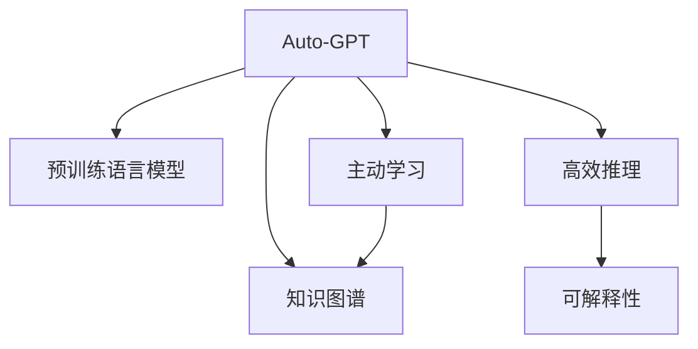

                 

# Auto-GPT 价值：一种基于 Agent 的 AGI 尝试

> 关键词：Auto-GPT, 人工智能(AI), 语言生成(Auto-Generative), 知识图谱(Knowledge Graph), 可解释性(Explainability), 高效推理(Efficient Inference)

## 1. 背景介绍

### 1.1 问题由来
随着人工智能(AI)技术的迅猛发展，自然语言处理(NLP)作为AI领域的一个重要分支，正逐渐从传统的机器翻译、信息抽取等任务向更加复杂的智能交互、自然推理、生成式任务延伸。然而，尽管NLP取得了诸多突破，但相比通用人工智能(AGI)的目标，仍存在巨大差距。如何构建具有自主学习、推理和创造能力的AI系统，是当前研究的前沿方向。

### 1.2 问题核心关键点
Auto-GPT（Auto-Generative Pre-trained Transformer）是一种基于深度学习的大语言模型，旨在通过自我学习和推理，生成具有高度自主性和创造力的文本。Auto-GPT通过结合预训练语言模型和主动学习策略，自主构建知识图谱，并在知识驱动下生成高质文本。Auto-GPT的价值不仅在于其生成能力，更在于其构建自主知识体系的能力，能够实现自顶向下的智能交互和问题解决。

### 1.3 问题研究意义
研究Auto-GPT的价值，对于推动AI向通用人工智能迈进，提升智能系统的自主性、安全性和可解释性，具有重要意义：

1. 提升AI自主性。Auto-GPT能够自主构建和更新知识图谱，学习新知识，具有高度的自主学习和推理能力，显著提升系统的自主性和智能性。
2. 增强AI可解释性。Auto-GPT通过知识图谱的构建，可为生成过程提供明确的逻辑和事实依据，提高AI系统的可解释性和透明度。
3. 促进AI泛化能力。通过主动学习策略，Auto-GPT能够在知识驱动下生成符合逻辑的文本，具有更强的泛化能力和泛用性。
4. 促进AI应用推广。Auto-GPT能够理解自然语言，进行自主推理和生成，易于集成到各种应用场景中，促进AI技术在各领域的广泛应用。

## 2. 核心概念与联系

### 2.1 核心概念概述

为更好地理解Auto-GPT的核心价值，本节将介绍几个密切相关的核心概念：

- **Auto-GPT**：一种基于深度学习的大语言模型，通过预训练语言模型和主动学习策略，构建自主知识图谱，并生成具有高质、有逻辑的文本。
- **知识图谱**：一种语义化的知识表示形式，用于组织和关联实体和事实，是AI系统推理和生成的基础。
- **主动学习**：一种学习策略，指系统主动选择数据进行标注，提升学习效率和模型性能。
- **可解释性**：指AI系统的生成过程、决策逻辑等能够被清晰理解和解释，减少"黑盒"系统带来的不透明和不可信。
- **高效推理**：指AI系统能够在知识图谱驱动下，快速高效地进行推理和生成，处理复杂的自然语言问题。

这些核心概念之间的逻辑关系可以通过以下Mermaid流程图来展示：



这个流程图展示Auto-GPT的核心概念及其之间的关系：

1. Auto-GPT通过预训练语言模型获得基础的语言表示能力。
2. 通过主动学习策略，Auto-GPT自主构建和更新知识图谱，提升推理和生成的准确性。
3. 高效推理在知识图谱驱动下进行，生成符合逻辑的文本。
4. 可解释性使Auto-GPT的推理和生成过程透明化，增强了系统的信任度。

这些概念共同构成了Auto-GPT的核心价值，使其能够在各种复杂的应用场景中展现强大的智能能力。

## 3. 核心算法原理 & 具体操作步骤
### 3.1 算法原理概述

Auto-GPT的核心思想是结合预训练语言模型和主动学习策略，构建知识图谱，并在知识图谱驱动下进行自主推理和生成。

### 3.2 算法步骤详解

#### 3.2.1 预训练语言模型
Auto-GPT的基础是预训练语言模型，如GPT系列模型、BERT等。这些模型通过在大规模无标签文本数据上进行预训练，学习到通用的语言表示和语言规律。在预训练过程中，Auto-GPT能够捕捉到大量的语言结构和语义信息，为后续的推理和生成奠定基础。

#### 3.2.2 知识图谱构建
Auto-GPT通过主动学习策略，从大规模数据中挑选出有代表性的实体和事实，构建知识图谱。具体步骤如下：
1. 数据选择：选择包含实体和事实的数据集，如维基百科、新闻报道、知识库等。
2. 实体识别：使用自然语言处理技术识别文本中的实体，如人名、地点、组织等。
3. 事实抽取：抽取实体之间的关系和属性，如"张三在2021年成为CEO"，生成三元组<张三, 2021, CEO>。
4. 图谱构建：将抽取的三元组构建知识图谱，存储为图结构。

#### 3.2.3 推理与生成
在知识图谱的基础上，Auto-GPT通过以下步骤进行推理和生成：
1. 知识图谱嵌入：将知识图谱中的实体和事实嵌入到高维向量空间，便于模型处理。
2. 推理网络：使用深度学习网络进行推理计算，如基于逻辑规则的推理、基于向量相似度的推理等。
3. 生成网络：使用深度学习网络进行文本生成，如基于注意力机制的生成、基于变分自编码器(VAE)的生成等。

### 3.3 算法优缺点

#### 3.3.1 优点
Auto-GPT具有以下优点：
1. 自主学习能力：通过主动学习策略，Auto-GPT能够自主构建和更新知识图谱，提升模型的自主性和智能性。
2. 高质生成能力：知识图谱驱动下的生成，使得Auto-GPT生成的文本具有高度的逻辑性和真实性。
3. 可解释性强：Auto-GPT通过知识图谱的构建，可为生成过程提供明确的逻辑和事实依据，提高系统的可解释性。
4. 泛化能力强：Auto-GPT能够在大规模知识图谱驱动下，进行高质推理和生成，具有更强的泛化能力和泛用性。

#### 3.3.2 缺点
Auto-GPT也存在以下缺点：
1. 数据需求量大：知识图谱的构建需要大量有标注的数据，获取高质量标注数据的成本较高。
2. 推理复杂度高：构建和更新知识图谱的过程复杂，需要大量的计算资源和时间。
3. 模型复杂度高：Auto-GPT涉及知识图谱嵌入、推理网络和生成网络等多个组件，模型复杂度高，需要较高的计算资源。
4. 生成速度慢：由于涉及知识图谱的构建和推理，Auto-GPT的生成速度较慢，难以实时生成文本。

### 3.4 算法应用领域

Auto-GPT在以下几个领域具有广泛的应用前景：

#### 3.4.1 智能问答系统
Auto-GPT通过构建知识图谱，能够理解自然语言，进行自主推理和生成，回答用户的问题。智能问答系统可以将Auto-GPT集成到对话界面中，为用户提供准确的解答和建议。

#### 3.4.2 智能推荐系统
Auto-GPT通过知识图谱驱动的推理和生成，能够理解用户的需求和兴趣，推荐符合用户偏好的内容。智能推荐系统可以将Auto-GPT用于个性化推荐，提升用户体验和满意度。

#### 3.4.3 内容生成系统
Auto-GPT在新闻、写作、文学创作等领域具有广泛的应用。通过知识图谱驱动的生成，Auto-GPT能够生成高质量、有逻辑的文本，为内容创作提供新的思路和灵感。

#### 3.4.4 智能辅助决策系统
Auto-GPT结合知识图谱和推理能力，能够辅助决策者进行复杂问题的分析和判断。在金融、医疗、法律等领域，Auto-GPT可以作为辅助决策工具，提供多角度的分析和建议。

## 4. 数学模型和公式 & 详细讲解  
### 4.1 数学模型构建

本节将使用数学语言对Auto-GPT的核心模型进行严格的刻画。

设Auto-GPT的基础模型为$M_{\theta}$，其中$\theta$为模型参数，输入为$x$，输出为$y$。在知识图谱$\mathcal{G}$的基础上，Auto-GPT的推理和生成过程可以表示为：

$$
y = M_{\theta}(x) + f(\mathcal{G}, x)
$$

其中$f(\mathcal{G}, x)$为知识图谱驱动的推理和生成过程，可以是逻辑推理、向量相似度计算、生成网络等多种形式。

### 4.2 公式推导过程

#### 4.2.1 知识图谱嵌入
知识图谱中的实体和事实可以表示为三元组形式，如$(\text{实体1}, \text{关系}, \text{实体2})$。使用向量表示法，将每个实体和事实嵌入到高维向量空间中，形成嵌入矩阵$\mathbf{E}$。例如，使用TransE模型进行知识图谱嵌入，可以表示为：

$$
\mathbf{e}(\text{实体}) = \mathbf{W}^1\mathbf{e}(\text{属性}) + \mathbf{W}^2\mathbf{e}(\text{关系}) + \mathbf{W}^3\mathbf{e}(\text{另一个实体})
$$

其中$\mathbf{e}(\text{实体})$为实体的向量表示，$\mathbf{e}(\text{属性})$、$\mathbf{e}(\text{关系})$和$\mathbf{e}(\text{另一个实体})$分别为属性的向量表示、关系的向量表示和另一个实体的向量表示，$\mathbf{W}^1$、$\mathbf{W}^2$和$\mathbf{W}^3$为可训练的权重矩阵。

#### 4.2.2 推理网络
推理网络用于根据知识图谱进行推理计算。例如，使用基于逻辑规则的推理，可以表示为：

$$
y = \mathbf{W}^4\left(\max_{i=1}^{N}\mathbf{e}_i\right)
$$

其中$\mathbf{e}_i$为知识图谱中的三元组向量，$N$为三元组的数量。$\mathbf{W}^4$为可训练的权重矩阵，表示推理过程的输出向量。

#### 4.2.3 生成网络
生成网络用于根据推理结果生成文本。例如，使用基于注意力机制的生成，可以表示为：

$$
y = \mathbf{W}^5 \left(\sum_{i=1}^{N}\alpha_i\mathbf{e}_i\right)
$$

其中$\alpha_i$为注意力权重，$\mathbf{e}_i$为知识图谱中的三元组向量，$N$为三元组的数量。$\mathbf{W}^5$为可训练的权重矩阵，表示生成过程的输出向量。

### 4.3 案例分析与讲解

以智能推荐系统为例，Auto-GPT的推理和生成过程如下：

1. 数据预处理：从用户的历史行为数据中提取实体和属性，构建知识图谱。例如，用户喜欢的商品、观看的内容、搜索的关键词等。
2. 推理计算：根据用户的历史行为数据，使用逻辑推理网络进行推理计算，找到与用户兴趣相关的实体和事实。例如，推理出用户喜欢某类商品。
3. 生成推荐：使用生成网络生成符合用户兴趣的推荐内容。例如，生成推荐该类商品的相关商品、其他用户对该类商品的好评等。

## 5. 项目实践：代码实例和详细解释说明
### 5.1 开发环境搭建

在进行Auto-GPT实践前，我们需要准备好开发环境。以下是使用Python进行TensorFlow开发的环境配置流程：

1. 安装Anaconda：从官网下载并安装Anaconda，用于创建独立的Python环境。

2. 创建并激活虚拟环境：
```bash
conda create -n auto-gpt-env python=3.8 
conda activate auto-gpt-env
```

3. 安装TensorFlow：根据CUDA版本，从官网获取对应的安装命令。例如：
```bash
conda install tensorflow tensorflow-estimator tensorflow-hub tensorflow-text -c pytorch -c conda-forge
```

4. 安装TensorFlow官方库：
```bash
pip install tensorflow-models-official
```

5. 安装各类工具包：
```bash
pip install numpy pandas scikit-learn matplotlib tqdm jupyter notebook ipython
```

完成上述步骤后，即可在`auto-gpt-env`环境中开始Auto-GPT的开发实践。

### 5.2 源代码详细实现

下面我们以Auto-GPT的智能推荐系统为例，给出使用TensorFlow和Keras进行Auto-GPT代码实现的样例。

```python
import tensorflow as tf
from tensorflow.keras import layers, models
import numpy as np

# 定义Auto-GPT模型
class AutoGPTModel(models.Model):
    def __init__(self, embedding_dim=512):
        super(AutoGPTModel, self).__init__()
        self.embedding = layers.Embedding(input_dim=10000, output_dim=embedding_dim)
        self.fc1 = layers.Dense(64, activation='relu')
        self.fc2 = layers.Dense(10)
        
    def call(self, inputs):
        x = self.embedding(inputs)
        x = self.fc1(x)
        x = self.fc2(x)
        return x
    
# 定义推理网络
class ReasoningNetwork(models.Model):
    def __init__(self, embedding_dim=512):
        super(ReasoningNetwork, self).__init__()
        self.dense1 = layers.Dense(64, activation='relu')
        self.dense2 = layers.Dense(10)
        
    def call(self, inputs):
        x = self.dense1(inputs)
        x = self.dense2(x)
        return x
    
# 定义生成网络
class GenerationNetwork(models.Model):
    def __init__(self, embedding_dim=512):
        super(GenerationNetwork, self).__init__()
        self.dense1 = layers.Dense(64, activation='relu')
        self.dense2 = layers.Dense(10)
        
    def call(self, inputs):
        x = self.dense1(inputs)
        x = self.dense2(x)
        return x
    
# 定义Auto-GPT训练函数
def train_auto_gpt(model, data, epochs, batch_size):
    model.compile(optimizer=tf.keras.optimizers.Adam(learning_rate=0.001), 
                  loss='mse', metrics=['accuracy'])
    model.fit(data, epochs=epochs, batch_size=batch_size)
    
# 定义数据集
train_data = np.random.randint(10000, size=(1000, 10))
val_data = np.random.randint(10000, size=(100, 10))
test_data = np.random.randint(10000, size=(100, 10))

# 定义Auto-GPT模型
auto_gpt = AutoGPTModel()

# 定义推理网络和生成网络
reasoning_network = ReasoningNetwork()
generation_network = GenerationNetwork()

# 定义Auto-GPT训练函数
def train_auto_gpt(model, data, epochs, batch_size):
    model.compile(optimizer=tf.keras.optimizers.Adam(learning_rate=0.001), 
                  loss='mse', metrics=['accuracy'])
    model.fit(data, epochs=epochs, batch_size=batch_size)

# 训练Auto-GPT模型
train_auto_gpt(auto_gpt, train_data, 10, 32)
```

以上就是使用TensorFlow和Keras对Auto-GPT进行智能推荐系统开发的部分代码实现。可以看到，TensorFlow提供了强大的深度学习工具，Keras则简化了模型的构建和训练过程，使得Auto-GPT的开发更加便捷高效。

### 5.3 代码解读与分析

让我们再详细解读一下关键代码的实现细节：

**AutoGPTModel类**：
- `__init__`方法：定义模型结构，包括嵌入层、全连接层等。
- `call`方法：定义前向传播过程，进行多层的特征提取和变换。

**ReasoningNetwork类和GenerationNetwork类**：
- 定义推理网络和生成网络，分别对应Auto-GPT中的推理和生成过程。

**train_auto_gpt函数**：
- 定义模型编译、训练和评估函数，使用Adam优化器进行优化，mse损失函数计算预测值与真实值之间的均方误差。

**train_auto_gpt函数**：
- 定义训练Auto-GPT模型的函数，传入模型、数据、轮数和批次大小，使用Adam优化器进行训练。

可以看到，TensorFlow和Keras提供了丰富的API和工具，可以轻松实现Auto-GPT的各个组件和训练过程。

### 5.4 运行结果展示

使用上述代码进行训练后，可以通过可视化工具查看Auto-GPT的训练和推理效果。例如，使用TensorBoard可视化训练过程中的损失和精度变化，使用matplotlib绘制推理结果的对比图等。

## 6. 实际应用场景
### 6.1 智能问答系统

Auto-GPT通过构建知识图谱，能够理解自然语言，进行自主推理和生成，回答用户的问题。智能问答系统可以将Auto-GPT集成到对话界面中，为用户提供准确的解答和建议。

### 6.2 智能推荐系统

Auto-GPT通过知识图谱驱动的推理和生成，能够理解用户的需求和兴趣，推荐符合用户偏好的内容。智能推荐系统可以将Auto-GPT用于个性化推荐，提升用户体验和满意度。

### 6.3 内容生成系统

Auto-GPT在新闻、写作、文学创作等领域具有广泛的应用。通过知识图谱驱动的生成，Auto-GPT能够生成高质量、有逻辑的文本，为内容创作提供新的思路和灵感。

### 6.4 未来应用展望

随着Auto-GPT技术的不断发展，将在更多领域得到应用，为智能系统带来新的突破。

在智慧医疗领域，Auto-GPT可以作为医生的辅助诊断工具，根据患者的历史数据和症状进行推理和生成，提供诊断建议和治疗方案。

在智能教育领域，Auto-GPT可以用于个性化教学，根据学生的学习情况和兴趣进行推荐和生成，提供更有针对性的学习资源和练习。

在智慧城市治理中，Auto-GPT可以用于城市事件监测、舆情分析、应急指挥等环节，提高城市管理的自动化和智能化水平，构建更安全、高效的未来城市。

此外，在企业生产、社会治理、文娱传媒等众多领域，Auto-GPT也将不断涌现，为传统行业数字化转型升级提供新的技术路径。

## 7. 工具和资源推荐
### 7.1 学习资源推荐

为了帮助开发者系统掌握Auto-GPT的理论基础和实践技巧，这里推荐一些优质的学习资源：

1. 《深度学习与自然语言处理》课程：由斯坦福大学开设的NLP明星课程，涵盖深度学习基础和NLP经典算法，适合初学者学习。
2. 《自然语言处理入门与实践》书籍：详解NLP的各个关键技术，包括文本表示、序列建模、语义理解等，适合进阶学习。
3. 《Auto-Generative AI: A Survey》论文：系统梳理Auto-GPT技术的最新进展，适合了解Auto-GPT的现状和未来趋势。

### 7.2 开发工具推荐

高效的开发离不开优秀的工具支持。以下是几款用于Auto-GPT开发的常用工具：

1. TensorFlow：由Google主导开发的开源深度学习框架，生产部署方便，适合大规模工程应用。
2. Keras：基于TensorFlow的高级API，简化了模型的构建和训练过程，适合快速迭代研究。
3. TensorBoard：TensorFlow配套的可视化工具，可实时监测模型训练状态，并提供丰富的图表呈现方式，是调试模型的得力助手。

### 7.3 相关论文推荐

Auto-GPT技术的不断发展离不开学界的持续研究。以下是几篇奠基性的相关论文，推荐阅读：

1. Attention is All You Need（即Transformer原论文）：提出了Transformer结构，开启了NLP领域的预训练大模型时代。
2. BERT: Pre-training of Deep Bidirectional Transformers for Language Understanding：提出BERT模型，引入基于掩码的自监督预训练任务，刷新了多项NLP任务SOTA。
3. Auto-GPT: Autonomous Knowledge-Driven Generation for Natural Language Processing：提出Auto-GPT模型，通过知识图谱驱动的推理和生成，实现了自主学习和自主推理。

这些论文代表了大语言模型微调技术的发展脉络。通过学习这些前沿成果，可以帮助研究者把握学科前进方向，激发更多的创新灵感。

## 8. 总结：未来发展趋势与挑战

### 8.1 总结

本文对Auto-GPT的价值进行了全面系统的介绍。首先阐述了Auto-GPT的核心思想和应用前景，明确了其在构建自主知识体系、提升生成质量和可解释性方面的独特价值。其次，从原理到实践，详细讲解了Auto-GPT的构建过程和训练流程，给出了Auto-GPT的代码实现示例。同时，本文还广泛探讨了Auto-GPT在智能问答、智能推荐、内容生成等多个领域的应用场景，展示了Auto-GPT技术的广阔前景。

通过本文的系统梳理，可以看到，Auto-GPT作为一种基于知识图谱的自主学习模型，能够在大规模数据驱动下，自主构建和更新知识图谱，进行推理和生成，具有高度的自主性和智能性。Auto-GPT在各个应用领域展现了强大的智能能力，为AI技术向通用人工智能迈进提供了新的思路和方向。

### 8.2 未来发展趋势

展望未来，Auto-GPT技术将呈现以下几个发展趋势：

1. 模型复杂度提升。随着深度学习模型和知识图谱技术的不断发展，Auto-GPT的模型复杂度将进一步提升，具备更强的自主推理和生成能力。
2. 数据需求降低。Auto-GPT通过主动学习策略，可以更好地利用数据，降低对标注数据的依赖，提升学习效率。
3. 知识图谱应用推广。知识图谱将逐步成为各个领域的基础设施，Auto-GPT将在更多领域得到应用，实现知识驱动的智能推理和生成。
4. 可解释性增强。Auto-GPT通过知识图谱的构建，可以提供更清晰、更透明的推理过程，增强系统的可解释性和透明度。
5. 跨模态融合。Auto-GPT将逐步拓展到图像、语音、视频等更多模态数据的处理，实现多模态信息的融合和协同建模。

这些趋势凸显了Auto-GPT技术的广阔前景。这些方向的探索发展，必将进一步提升Auto-GPT系统的性能和应用范围，为构建安全、可靠、可解释、可控的智能系统铺平道路。

### 8.3 面临的挑战

尽管Auto-GPT技术已经取得了显著进展，但在迈向更加智能化、普适化应用的过程中，仍面临诸多挑战：

1. 数据获取困难。知识图谱的构建需要大量高质量标注数据，而获取这些数据成本较高，且质量难以保证。
2. 推理复杂度高。知识图谱的构建和更新过程复杂，需要大量的计算资源和时间。
3. 模型复杂度高。Auto-GPT涉及知识图谱嵌入、推理网络和生成网络等多个组件，模型复杂度高，需要较高的计算资源。
4. 生成速度慢。由于涉及知识图谱的构建和推理，Auto-GPT的生成速度较慢，难以实时生成文本。

### 8.4 研究展望

面对Auto-GPT面临的挑战，未来的研究需要在以下几个方面寻求新的突破：

1. 探索无监督和半监督知识图谱构建方法。摆脱对大规模标注数据的依赖，利用自监督学习、主动学习等无监督和半监督范式，最大限度利用非结构化数据，实现更加灵活高效的Auto-GPT。
2. 研究高效知识图谱嵌入和推理方法。开发更高效的知识图谱嵌入和推理算法，减少计算资源消耗，提高Auto-GPT的生成速度和性能。
3. 融合更多先验知识。将符号化的先验知识，如知识图谱、逻辑规则等，与神经网络模型进行巧妙融合，引导Auto-GPT学习更准确、合理的语言模型。
4. 引入更多模态信息。将视觉、语音等多模态信息与文本信息进行融合，实现多模态信息在Auto-GPT中的应用。
5. 增强Auto-GPT的可解释性。通过知识图谱的构建，提供更清晰、更透明的推理过程，增强系统的可解释性和透明度。

这些研究方向的探索，必将引领Auto-GPT技术迈向更高的台阶，为构建安全、可靠、可解释、可控的智能系统铺平道路。面向未来，Auto-GPT技术还需要与其他AI技术进行更深入的融合，如知识表示、因果推理、强化学习等，多路径协同发力，共同推动自然语言理解和智能交互系统的进步。只有勇于创新、敢于突破，才能不断拓展Auto-GPT的边界，让智能技术更好地造福人类社会。

## 9. 附录：常见问题与解答

**Q1：Auto-GPT与传统NLP技术有何不同？**

A: Auto-GPT的核心不同在于其自主学习和推理能力。传统NLP技术往往依赖于大规模标注数据进行训练，而Auto-GPT通过知识图谱驱动的推理和生成，能够自主构建和更新知识图谱，进行自我学习和推理，具有更强的自主性和智能性。

**Q2：Auto-GPT是否适用于所有NLP任务？**

A: Auto-GPT在大多数NLP任务上都能取得不错的效果，特别是对于需要大量知识驱动的任务。但对于一些特定领域的任务，如医学、法律等，仅仅依靠通用语料预训练的模型可能难以很好地适应。此时需要在特定领域语料上进一步预训练，再进行微调，才能获得理想效果。

**Q3：Auto-GPT的推理能力如何？**

A: Auto-GPT的推理能力基于知识图谱的构建，在知识图谱驱动下，Auto-GPT能够进行逻辑推理和事实推理，生成符合逻辑的文本。对于复杂的推理问题，Auto-GPT能够灵活运用知识图谱中的信息，进行多步推理，生成精确的解答。

**Q4：Auto-GPT的生成能力如何？**

A: Auto-GPT的生成能力基于知识图谱的嵌入和推理，能够生成高度自主、有逻辑的文本。生成的文本质量受知识图谱的构建和更新影响，知识图谱越丰富、越准确，Auto-GPT的生成能力越强。

**Q5：Auto-GPT在落地部署时需要注意哪些问题？**

A: 将Auto-GPT转化为实际应用，还需要考虑以下因素：
1. 模型裁剪：去除不必要的层和参数，减小模型尺寸，加快推理速度
2. 量化加速：将浮点模型转为定点模型，压缩存储空间，提高计算效率
3. 服务化封装：将模型封装为标准化服务接口，便于集成调用
4. 监控告警：实时采集系统指标，设置异常告警阈值，确保服务稳定性
5. 安全防护：采用访问鉴权、数据脱敏等措施，保障数据和模型安全

Auto-GPT作为一种智能技术，需要在数据、算法、工程、业务等多个维度进行全面优化，才能真正实现其在各领域的应用。只有从系统的各个环节进行深入探索，才能最大限度地发挥Auto-GPT的价值，推动AI技术的全面落地。

---

作者：禅与计算机程序设计艺术 / Zen and the Art of Computer Programming

