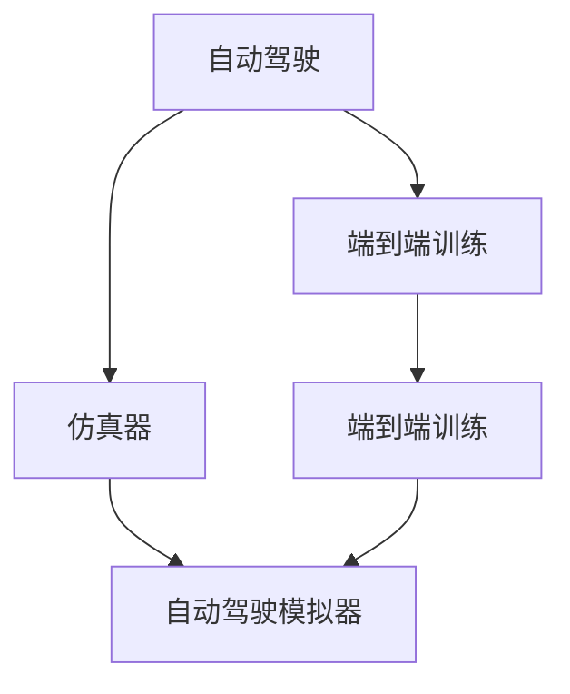

                 

# CARLA等仿真器在端到端自动驾驶中的应用

> 关键词：自动驾驶,端到端,仿真器,端到端训练,自动驾驶模拟器,汽车行驶仿真,交通流模拟,车辆感知,环境理解,路径规划,行为决策,自动驾驶算法

## 1. 背景介绍

自动驾驶技术已经逐步进入现实生活，从最初的辅助驾驶功能到全自动驾驶汽车，已不再遥远。然而，要实现高质量的自动驾驶，测试和验证是必不可少的环节。真实道路测试不仅成本高昂，且受到环境、法规等因素的限制，难以全面覆盖各种复杂场景。因此，自动驾驶系统需要在仿真环境中进行充分测试和训练，确保其安全性和可靠性。

## 2. 核心概念与联系

### 2.1 核心概念概述

为更好地理解端到端自动驾驶在仿真器中的应用，本节将介绍几个关键概念：

- 自动驾驶(Autonomous Driving, AD)：指汽车在无需人工干预的情况下，能够安全、高效地完成行驶任务。涉及感知、决策、控制等环节，通常包括L1-L5五个级别。
- 端到端(End-to-End)：指从传感器输入到决策控制输出，整个驾驶决策过程由深度学习模型实现，中间没有传统传感器、规则或人工干预。
- 仿真器(Simulator)：通过软件模拟真实世界的物理场景和行为，提供虚拟环境以供自动驾驶系统测试和训练。常见的仿真器包括CARLA、GAIL、Simulink等。
- 端到端训练(End-to-End Training)：指在仿真环境中，直接从传感器输入数据到车辆控制输出的全链条模型训练。旨在通过单向输入输出，避免中间层的干扰，简化训练流程。
- 自动驾驶模拟器(Autonomous Driving Simulator)：一种专门用于测试和验证自动驾驶系统的仿真工具。能够模拟各种交通场景，评估系统的安全性和可靠性。

这些概念之间的逻辑关系可以通过以下Mermaid流程图来展示：



这个流程图展示了这个领域的核心概念及其之间的关系：

1. 自动驾驶系统通过感知模块获取传感器数据，决策模块输出控制命令。
2. 端到端训练在仿真环境中直接处理传感器数据，输出控制命令，避免中间层的干扰。
3. 仿真器提供虚拟环境，支持自动驾驶系统的测试和训练。
4. 自动驾驶模拟器是仿真器的一种，专门用于自动驾驶系统的测试。

## 3. 核心算法原理 & 具体操作步骤

### 3.1 算法原理概述

端到端自动驾驶训练的核心原理是，利用深度学习模型直接从传感器输入到车辆控制输出的全链条训练，避免中间层的复杂处理，简化训练过程，提升模型泛化能力。在仿真环境中，通过生成各种复杂、多样化的交通场景，自动驾驶系统可以不断适应新环境和新任务，从而提高系统整体性能。

### 3.2 算法步骤详解

#### 3.2.1 数据收集与预处理

端到端训练的第一步是收集和预处理数据。数据包括传感器数据(如摄像头、激光雷达、雷达等)和车辆控制数据(如转向、加速、刹车等)。

数据预处理包括：

- 传感器数据校正和融合：对摄像头、激光雷达、雷达等数据进行校正和融合，消除时间同步误差。
- 数据增强：通过旋转、缩放、翻转等方式，扩充训练数据集，增强模型泛化能力。
- 数据归一化：将数据按一定规则归一化，便于模型处理。

#### 3.2.2 搭建端到端模型

搭建端到端模型包括：

- 选择合适的网络结构：如CNN、RNN、Transformer等。
- 设计输入输出接口：输入为传感器数据，输出为车辆控制数据。
- 损失函数设计：通常使用交叉熵损失或均方误差损失。
- 优化器选择：如Adam、SGD等。

#### 3.2.3 模型训练

模型训练的主要步骤如下：

- 划分训练集、验证集、测试集。
- 设置训练参数：如学习率、批大小、迭代轮数等。
- 训练模型：在仿真器生成的交通场景中，使用模型进行端到端训练，通过反向传播更新模型参数。
- 评估模型：在验证集上评估模型性能，调整训练参数。
- 重复训练：直到模型在测试集上表现达到预期。

#### 3.2.4 部署与测试

模型训练完成后，部署到实际车辆中进行测试和验证。测试过程包括：

- 传感器数据采集：使用实际车辆传感器采集道路数据。
- 模型推理：将传感器数据输入训练好的模型，输出车辆控制指令。
- 控制指令执行：根据模型输出控制指令，进行实际车辆控制。
- 反馈调整：根据实际行驶结果，反馈调整模型参数，提升系统性能。

### 3.3 算法优缺点

#### 3.3.1 优点

- 简化训练流程：端到端训练避免了中间层的复杂处理，简化了训练过程。
- 提升泛化能力：模型直接从传感器数据到控制指令进行训练，提升了模型的泛化能力。
- 降低开发成本：端到端训练减少了对传统硬件和规则的依赖，降低了开发成本。
- 提高测试效率：在仿真环境中，模型可以快速进行测试和调试，提高测试效率。

#### 3.3.2 缺点

- 数据需求高：需要大量的传感器数据进行训练，难以获取完全符合实际环境的仿真数据。
- 模型复杂度高：端到端模型通常参数量较大，训练和推理效率不高。
- 环境匹配性差：仿真环境的真实性难以完全匹配实际环境，可能导致训练偏差。
- 鲁棒性不足：在实际驾驶中，难以保证模型在各种复杂场景下的鲁棒性。

### 3.4 算法应用领域

端到端自动驾驶技术在汽车、物流、智慧城市等领域有广泛的应用前景：

- 汽车行业：用于开发自动驾驶汽车，提高行驶安全性和驾驶体验。
- 物流行业：用于物流无人车的路径规划和行为决策，提升运输效率和安全性。
- 智慧城市：用于智慧交通系统的管理，提高交通流量调控能力。

## 4. 数学模型和公式 & 详细讲解

### 4.1 数学模型构建

在端到端训练中，我们通常采用神经网络模型进行训练。以感知模块为例，其输入为传感器数据，输出为环境理解结果。定义输入为 $x \in \mathbb{R}^n$，输出为 $y \in \mathbb{R}^m$，其中 $m$ 为环境理解结果的维度。

常见的神经网络模型包括：

- CNN：适用于图像处理任务，提取空间特征。
- RNN：适用于序列数据，提取时序特征。
- Transformer：适用于多模态数据，提取全局特征。

### 4.2 公式推导过程

以CNN模型为例，其输入 $x$ 经过卷积层、池化层等处理后，输出特征图 $z \in \mathbb{R}^k$。定义 $w \in \mathbb{R}^{k \times m}$ 为权重矩阵，$b \in \mathbb{R}^m$ 为偏置向量。模型的输出 $y$ 为：

$$
y = \sigma(wz + b)
$$

其中 $\sigma$ 为激活函数，通常使用ReLU、Sigmoid等。

### 4.3 案例分析与讲解

以端到端自动驾驶系统中的车辆感知为例，通过图像处理技术，将摄像头数据转化为车辆周围环境的语义信息。模型设计如下：

- 输入层：摄像头图像数据，大小为 $m \times n \times c$，$m$ 为图像高度，$n$ 为图像宽度，$c$ 为通道数。
- 卷积层：对图像数据进行卷积操作，提取局部特征。
- 池化层：对卷积后的特征图进行池化操作，降维提纯。
- 全连接层：将池化后的特征图转化为向量，输出环境理解结果。

模型训练的损失函数为均方误差损失：

$$
L = \frac{1}{N} \sum_{i=1}^N (y_i - \hat{y}_i)^2
$$

其中 $y_i$ 为真实标签，$\hat{y}_i$ 为模型预测结果。

## 5. 项目实践：代码实例和详细解释说明

### 5.1 开发环境搭建

在进行端到端自动驾驶的仿真训练前，需要先准备好开发环境。以下是使用Python进行PyTorch开发的环境配置流程：

1. 安装Anaconda：从官网下载并安装Anaconda，用于创建独立的Python环境。

2. 创建并激活虚拟环境：
```bash
conda create -n pytorch-env python=3.8 
conda activate pytorch-env
```

3. 安装PyTorch：根据CUDA版本，从官网获取对应的安装命令。例如：
```bash
conda install pytorch torchvision torchaudio cudatoolkit=11.1 -c pytorch -c conda-forge
```

4. 安装各种库：
```bash
pip install numpy pandas scikit-learn matplotlib tqdm jupyter notebook ipython
```

完成上述步骤后，即可在`pytorch-env`环境中开始端到端自动驾驶的仿真训练。

### 5.2 源代码详细实现

这里我们以端到端自动驾驶中车辆感知模块为例，给出使用PyTorch的代码实现。

首先，定义感知模块的输入和输出：

```python
import torch
import torch.nn as nn
import torch.nn.functional as F

class PerceptionModule(nn.Module):
    def __init__(self, in_channels=3, out_channels=32):
        super(PerceptionModule, self).__init__()
        self.conv1 = nn.Conv2d(in_channels, out_channels, kernel_size=3, stride=1, padding=1)
        self.conv2 = nn.Conv2d(out_channels, out_channels, kernel_size=3, stride=1, padding=1)
        self.pool = nn.MaxPool2d(kernel_size=2, stride=2)
        
    def forward(self, x):
        x = self.conv1(x)
        x = F.relu(x)
        x = self.pool(x)
        x = self.conv2(x)
        x = F.relu(x)
        x = self.pool(x)
        return x
```

接着，定义模型训练过程：

```python
import torch.optim as optim
from torch.utils.data import DataLoader

# 定义训练集
train_dataset = ...
train_loader = DataLoader(train_dataset, batch_size=16, shuffle=True)

# 定义模型和优化器
model = PerceptionModule()
optimizer = optim.Adam(model.parameters(), lr=1e-3)

# 训练模型
for epoch in range(10):
    for batch in train_loader:
        inputs, labels = batch
        optimizer.zero_grad()
        outputs = model(inputs)
        loss = F.mse_loss(outputs, labels)
        loss.backward()
        optimizer.step()
        print(f"Epoch: {epoch+1}, Loss: {loss.item()}")
```

最后，对模型进行测试：

```python
# 定义测试集
test_dataset = ...
test_loader = DataLoader(test_dataset, batch_size=16, shuffle=False)

# 测试模型
with torch.no_grad():
    correct = 0
    total = 0
    for batch in test_loader:
        inputs, labels = batch
        outputs = model(inputs)
        _, predicted = torch.max(outputs.data, 1)
        total += labels.size(0)
        correct += (predicted == labels).sum().item()
    print(f"Accuracy: {100 * correct / total:.2f}%")
```

以上就是使用PyTorch进行端到端车辆感知模块训练的完整代码实现。可以看到，利用PyTorch的模块化设计，代码实现简洁高效。

### 5.3 代码解读与分析

让我们再详细解读一下关键代码的实现细节：

**PerceptionModule类**：
- `__init__`方法：初始化感知模块的卷积层和池化层。
- `forward`方法：对输入数据进行卷积、激活、池化等处理，最终输出环境理解结果。

**训练过程**：
- 定义训练集和测试集，使用DataLoader将数据按批加载。
- 定义模型和优化器，使用Adam优化器进行训练。
- 在每个epoch中，对训练集进行迭代，计算损失函数，更新模型参数，并输出当前epoch的损失值。
- 在测试集中评估模型，计算准确率并输出。

## 6. 实际应用场景

### 6.1 智能交通系统

端到端自动驾驶技术可以应用于智能交通系统的建设中。通过在交通场景中对自动驾驶汽车进行测试和训练，可以优化交通信号控制、车流管理等，提升整个交通系统的运行效率。

例如，在城市交叉路口，使用端到端模型对自动驾驶汽车进行测试，可以优化信号灯的时长和相位，减少车辆等待时间，提高路口通行效率。此外，通过监控自动驾驶汽车的行为，还可以发现并纠正违规行为，保障道路交通安全。

### 6.2 无人驾驶出租车

无人驾驶出租车利用端到端自动驾驶技术，可以在复杂的城市道路环境中实现自主行驶。通过在仿真环境中进行充分的测试和训练，确保模型在各种场景下都能稳定行驶。

在实际应用中，无人驾驶出租车可以通过云端远程监控和调度，提供更高效、安全、便捷的出行服务。同时，无人驾驶出租车还能对实时路况进行监控和分析，为城市交通管理提供数据支持。

### 6.3 自动驾驶货车

自动驾驶货车可以利用端到端自动驾驶技术，提高货物运输的效率和安全性。在仿真环境中，对货车进行路径规划和行为决策的训练，确保其在复杂道路环境下能够安全行驶。

在实际应用中，自动驾驶货车可以实时监控车辆状态和道路环境，动态调整行驶策略，优化货物配送路径。同时，通过车辆之间的通信，实现车队协同行驶，提高运输效率。

## 7. 工具和资源推荐

### 7.1 学习资源推荐

为了帮助开发者系统掌握端到端自动驾驶的理论基础和实践技巧，这里推荐一些优质的学习资源：

1. 《深度学习与自动驾驶》系列博文：由深度学习领域专家撰写，全面介绍自动驾驶中的深度学习模型和训练方法。

2. 《AutoDrive: 自动驾驶技术》课程：清华大学开设的自动驾驶技术课程，涵盖自动驾驶中的感知、决策、控制等多个环节，适合初学者入门。

3. 《Autonomous Vehicles: Systems and Control》书籍：国际上关于自动驾驶技术的经典教材，涵盖了自动驾驶系统的各个环节，适合深度学习爱好者。

4. NVIDIA官方文档：NVIDIA提供的深度学习平台和自动驾驶工具包，提供了丰富的工具和样例代码，是实践自动驾驶技术的必备资料。

5. ARGO AI开源项目：美国自动驾驶公司Argo AI的代码开源项目，包含了多个自动驾驶模块的实现，适合学习和复现自动驾驶算法。

通过对这些资源的学习实践，相信你一定能够快速掌握端到端自动驾驶的精髓，并用于解决实际的自动驾驶问题。

### 7.2 开发工具推荐

高效的开发离不开优秀的工具支持。以下是几款用于端到端自动驾驶开发的常用工具：

1. PyTorch：基于Python的开源深度学习框架，灵活动态的计算图，适合快速迭代研究。大部分自动驾驶模型都有PyTorch版本的实现。

2. TensorFlow：由Google主导开发的开源深度学习框架，生产部署方便，适合大规模工程应用。同样有丰富的自动驾驶模型资源。

3. CARLA：由卡尔斯鲁尔理工学院开发的自动驾驶模拟器，可以模拟各种交通场景，支持自动驾驶系统的测试和训练。

4. GAIL：由卡尔斯鲁尔理工学院开发的自动驾驶模拟器，具有高仿真性和真实性，支持多传感器融合和行为决策的训练。

5. OpenDrive：由OpenSimSimulations开发的自动驾驶模拟器，支持多模态数据融合和场景生成，适用于大规模自动驾驶系统测试。

6. UGVsim：由俄亥俄州立大学开发的自动驾驶模拟器，适用于无人地面车辆(UGV)的测试和训练。

合理利用这些工具，可以显著提升端到端自动驾驶任务的开发效率，加快创新迭代的步伐。

### 7.3 相关论文推荐

端到端自动驾驶技术的发展源于学界的持续研究。以下是几篇奠基性的相关论文，推荐阅读：

1. End-to-End Training for Self-Driving Cars（端到端训练无人驾驶汽车）：提出了一种端到端训练框架，直接从传感器输入到车辆控制输出的全链条训练。

2. Deep Blueprints: From Parameterized Control Policies to Control Networks（深度蓝图：从参数化控制策略到控制网络）：提出了一种基于神经网络的蓝图学习算法，用于端到端自动驾驶系统的训练。

3. Deep Driving: Vision-Based Navigation of Robotic Vehicles with On-Board Supervised Learning（深度驾驶：基于视觉的自动驾驶汽车导航）：提出了一种基于深度学习的自动驾驶算法，能够在复杂道路环境中自主行驶。

4. Deep Learning for Autonomous Driving: A Survey and Outlook（深度学习在自动驾驶中的应用：综述与展望）：对自动驾驶中的深度学习技术进行了全面综述，涵盖了感知、决策、控制等多个环节。

5. Autonomous Driving: A Review of Models, Techniques, and Systems（自动驾驶：模型、技术和系统的综述）：对自动驾驶领域中的主要技术和算法进行了综述，适合了解整个自动驾驶技术体系。

这些论文代表了大语言模型微调技术的发展脉络。通过学习这些前沿成果，可以帮助研究者把握学科前进方向，激发更多的创新灵感。

## 8. 总结：未来发展趋势与挑战

### 8.1 总结

本文对端到端自动驾驶技术在仿真器中的应用进行了全面系统的介绍。首先阐述了端到端自动驾驶的基本原理和应用背景，明确了在仿真环境中进行端到端训练的独特优势。其次，从原理到实践，详细讲解了端到端训练的数学模型和操作步骤，给出了端到端自动驾驶的完整代码实现。同时，本文还探讨了端到端自动驾驶在智能交通、无人驾驶出租车、自动驾驶货车等多个领域的应用前景，展示了端到端训练范式的巨大潜力。此外，本文精选了端到端自动驾驶的各类学习资源，力求为读者提供全方位的技术指引。

通过本文的系统梳理，可以看到，端到端自动驾驶技术已经在多个领域展现出了巨大的应用前景，成为自动驾驶技术的重要发展方向。得益于仿真环境的强大支撑，模型能够在大规模数据下进行高效训练，极大提升了系统性能和可靠性。未来，伴随仿真技术的不断进步和算力成本的下降，端到端自动驾驶技术必将在更多领域得到广泛应用，推动自动驾驶技术进入实用化阶段。

### 8.2 未来发展趋势

展望未来，端到端自动驾驶技术将呈现以下几个发展趋势：

1. 仿真环境的多样化：仿真环境将更加真实、多样，覆盖各种复杂场景，提升模型的泛化能力。
2. 模型的精细化：模型结构和训练方法将进一步优化，提升模型的精度和效率。
3. 数据的多元化：通过多模态数据融合，提升感知和决策的准确性。
4. 系统的协同化：通过车联网技术，实现车辆之间的协同行驶，提高整个系统的效率和安全性。
5. 法规标准的规范：自动驾驶系统的测试和验证将受到法规和标准的规范，提升系统安全性。
6. 场景生成的自动化：通过自动化场景生成技术，提高仿真环境的生成效率，降低开发成本。

以上趋势凸显了端到端自动驾驶技术的广阔前景。这些方向的探索发展，必将进一步提升自动驾驶系统的性能和应用范围，为人类出行方式带来深刻变革。

### 8.3 面临的挑战

尽管端到端自动驾驶技术已经取得了瞩目成就，但在迈向更加智能化、普适化应用的过程中，它仍面临着诸多挑战：

1. 数据需求高：需要大量的传感器数据进行训练，难以获取完全符合实际环境的仿真数据。
2. 模型复杂度高：端到端模型通常参数量较大，训练和推理效率不高。
3. 环境匹配性差：仿真环境的真实性难以完全匹配实际环境，可能导致训练偏差。
4. 鲁棒性不足：在实际驾驶中，难以保证模型在各种复杂场景下的鲁棒性。
5. 法规限制：自动驾驶系统需要遵守各国法规和标准，可能面临政策障碍。
6. 安全性问题：自动驾驶系统涉及人命关天，安全性问题需要进一步保障。

### 8.4 研究展望

面对端到端自动驾驶所面临的挑战，未来的研究需要在以下几个方面寻求新的突破：

1. 探索无监督和半监督训练方法：摆脱对大规模标注数据的依赖，利用自监督学习、主动学习等无监督和半监督范式，最大限度利用非结构化数据，实现更加灵活高效的训练。
2. 研究参数高效和计算高效的训练范式：开发更加参数高效的训练方法，在固定大部分预训练参数的同时，只更新极少量的任务相关参数。同时优化模型的计算图，减少前向传播和反向传播的资源消耗，实现更加轻量级、实时性的部署。
3. 引入更多先验知识：将符号化的先验知识，如知识图谱、逻辑规则等，与神经网络模型进行巧妙融合，引导训练过程学习更准确、合理的语言模型。同时加强不同模态数据的整合，实现视觉、语音等多模态信息与文本信息的协同建模。
4. 结合因果分析和博弈论工具：将因果分析方法引入训练模型，识别出模型决策的关键特征，增强输出解释的因果性和逻辑性。借助博弈论工具刻画人机交互过程，主动探索并规避模型的脆弱点，提高系统稳定性。
5. 纳入伦理道德约束：在模型训练目标中引入伦理导向的评估指标，过滤和惩罚有偏见、有害的输出倾向。同时加强人工干预和审核，建立模型行为的监管机制，确保输出符合人类价值观和伦理道德。

这些研究方向的探索，必将引领端到端自动驾驶技术迈向更高的台阶，为构建安全、可靠、可解释、可控的智能系统铺平道路。面向未来，端到端自动驾驶技术还需要与其他人工智能技术进行更深入的融合，如知识表示、因果推理、强化学习等，多路径协同发力，共同推动自动驾驶技术进步。只有勇于创新、敢于突破，才能不断拓展自动驾驶的边界，让智能技术更好地造福人类社会。

## 9. 附录：常见问题与解答

**Q1：端到端训练和传统训练有何不同？**

A: 端到端训练与传统训练的主要区别在于，端到端训练直接在传感器输入到车辆控制输出的全链条上进行训练，避免了中间层的复杂处理，简化了训练过程。传统训练需要分别对感知、决策和控制等各个环节进行训练，容易出现信息传递误差和复杂度爆炸。

**Q2：端到端训练的数据需求如何？**

A: 端到端训练需要大量的传感器数据进行训练，通常包括摄像头、激光雷达、雷达等数据。这些数据需要覆盖各种复杂场景，以确保模型在不同环境下都能稳定工作。然而，这些数据的获取和标注成本较高，需要耗费大量时间和精力。

**Q3：端到端训练的模型复杂度如何？**

A: 端到端训练的模型通常参数量较大，如Transformer模型，动辄亿级参数，这使得模型的训练和推理效率不高。为了提高模型效率，研究者们正在探索参数高效训练方法，如Adapter、LoRA等，在固定大部分预训练参数的同时，只更新极少量的任务相关参数。

**Q4：端到端训练的环境匹配性如何？**

A: 端到端训练的仿真环境需要尽可能真实地模拟实际道路环境，以保证训练数据的真实性和泛化能力。然而，仿真环境的真实性难以完全匹配实际环境，可能导致训练偏差。为了提高仿真环境的真实性，研究者们正在探索多种仿真技术，如高保真度渲染、多传感器融合等，以提升模型在实际环境中的鲁棒性。

**Q5：端到端训练的安全性如何？**

A: 端到端训练的自动驾驶系统需要保证在各种复杂场景下的安全性。然而，在实际驾驶中，模型的鲁棒性仍然是一个挑战。为了提高系统的安全性，研究者们正在探索多种增强技术，如对抗训练、鲁棒性训练等，以增强模型在对抗攻击和异常情况下的稳定性。

总之，端到端自动驾驶技术的发展还需要在多个方面进行优化和改进，以应对实际应用中的各种挑战。只有不断探索和创新，才能实现自动驾驶技术的广泛应用，推动智能交通的持续进步。

---

作者：禅与计算机程序设计艺术 / Zen and the Art of Computer Programming

