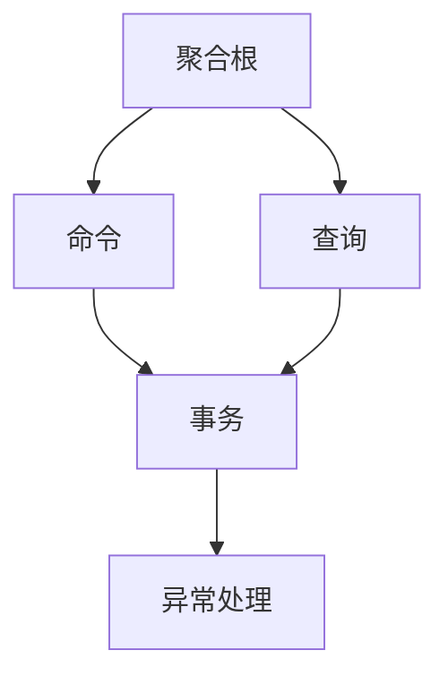

                 

# CQRS模式：读写分离的系统设计

> 关键词：CQRS, 读写分离, 聚合根, 命令, 查询, 事务, 异常处理, 高性能, 可靠性, 高可用性

## 1. 背景介绍

### 1.1 问题由来

在软件开发领域，系统设计一直是一个重要且具有挑战性的任务。传统的单层架构（即单体应用）能够满足一些小型应用的需求，但对于大型、复杂的应用，其固有的局限性（如代码耦合、测试难度、维护成本高等）逐渐显现。为了应对这些挑战，一种称为命令查询责任分离（Command Query Responsibility Segregation, CQRS）的设计模式应运而生。

CQRS 模式旨在通过将命令和查询分离，提高系统的性能、可维护性和可扩展性。该模式通过引入聚合根（Aggregate Root）的概念，将系统分解为多个小型、独立的部分（即聚合），每个聚合仅包含与该聚合直接相关的数据和操作。在 CQRS 模式中，命令用于修改数据，而查询用于读取数据。

### 1.2 问题核心关键点

CQRS 模式的核心在于其对读写操作的分离处理。具体来说：

- **聚合根（Aggregate Root）**：系统中的数据结构，负责封装和暴露聚合的所有数据和行为。聚合根通常是不可变的，每次修改都会生成一个新的聚合根实例。
- **命令（Command）**：用于修改聚合根中的数据的操作。命令通常是基于 DTO 的，代表要执行的操作，如添加、删除或更新数据。
- **查询（Query）**：用于从聚合根中获取数据的请求。查询是只读的，不会改变数据。
- **事务（Transaction）**：在聚合根内执行所有命令操作的逻辑单元，确保命令操作的一致性。
- **异常处理（Exception Handling）**：用于处理命令操作期间可能出现的异常，如数据不存在、权限不足等。

通过将这些概念有机结合起来，CQRS 模式能够在保持数据一致性的同时，显著提高系统的性能和可靠性。

## 2. 核心概念与联系

### 2.1 核心概念概述

为了更好地理解 CQRS 模式，我们首先需要深入了解其核心概念。下面将详细阐述每个核心概念的含义及其相互之间的关系。

#### 2.1.1 聚合根（Aggregate Root）

聚合根是 CQRS 模式中最基本的概念。它是一个包含所有相关数据和方法的根对象，负责封装聚合内部的状态变化。聚合根通常是不可变的，每次修改都会创建一个新的实例。聚合根可以包含多个子聚合（Child Aggregates），但每个聚合根只对应一个事务（Transaction）。

#### 2.1.2 命令（Command）

命令是用于修改聚合根中数据的操作。命令通常是一个基于 DTO（Data Transfer Object）的对象，包含操作类型和必要的数据。命令被发送到聚合根，通过聚合根的事务处理，最终修改聚合的状态。

#### 2.1.3 查询（Query）

查询是用于从聚合根中获取数据的请求。查询通常是只读的，不会改变聚合的状态。与命令不同，查询的执行不会引起聚合根的状态变化。

#### 2.1.4 事务（Transaction）

事务是 CQRS 模式中的关键概念，负责在聚合根内执行所有命令操作的逻辑单元。事务保证命令操作的一致性和原子性，即要么全部成功，要么全部失败。

#### 2.1.5 异常处理（Exception Handling）

异常处理是 CQRS 模式中的重要组成部分，用于在命令操作期间处理可能出现的异常情况。这些异常可能包括数据不存在、权限不足、资源冲突等。

### 2.2 核心概念原理和架构的 Mermaid 流程图



这个 Mermaid 图展示了 CQRS 模式中的关键流程和概念。从聚合根出发，命令和查询被发送到聚合根，并通过事务处理。异常处理则用于处理可能出现的异常情况。

## 3. 核心算法原理 & 具体操作步骤

### 3.1 算法原理概述

CQRS 模式的算法原理主要围绕聚合根、命令、查询、事务和异常处理展开。

#### 3.1.1 聚合根（Aggregate Root）

聚合根是不可变的，每次修改都会创建一个新的实例。聚合根通常包含以下属性：

- `Id`：聚合根的唯一标识符。
- `Version`：聚合根的版本，用于确保聚合根的不可变性。
- `State`：聚合根的状态，通常包含多个子聚合。

#### 3.1.2 命令（Command）

命令通常是一个基于 DTO 的对象，包含操作类型和必要的数据。命令的处理流程如下：

1. 创建命令对象。
2. 将命令发送到聚合根。
3. 聚合根解析命令，并执行相应的操作。
4. 更新聚合根的版本。
5. 返回操作结果或异常信息。

#### 3.1.3 查询（Query）

查询通常是一个只读的操作，不会改变聚合根的状态。查询的处理流程如下：

1. 创建查询对象。
2. 将查询发送到聚合根。
3. 聚合根解析查询，并返回查询结果。
4. 返回查询结果。

#### 3.1.4 事务（Transaction）

事务是 CQRS 模式中的关键概念，负责在聚合根内执行所有命令操作的逻辑单元。事务处理流程如下：

1. 创建事务上下文。
2. 加载聚合根。
3. 解析命令并执行相应操作。
4. 更新聚合根的状态。
5. 提交或回滚事务。

#### 3.1.5 异常处理（Exception Handling）

异常处理用于在命令操作期间处理可能出现的异常情况。异常处理流程如下：

1. 捕获异常。
2. 记录异常信息。
3. 返回异常信息。

### 3.2 算法步骤详解

#### 3.2.1 创建聚合根

```python
class AggregateRoot:
    def __init__(self, id):
        self._id = id
        self._version = 0
        self._state = {}
        self._commands = []
    
    def get_id(self):
        return self._id
    
    def get_version(self):
        return self._version
    
    def get_state(self):
        return self._state
    
    def add_command(self, command):
        self._commands.append(command)
        self._version += 1
    
    def execute_commands(self):
        for command in self._commands:
            self.handle_command(command)
        self._commands = []
        return self._version
    
    def handle_command(self, command):
        # 根据命令类型执行相应操作
        if isinstance(command, AddCommand):
            self._state[command.id] = command.data
        elif isinstance(command, RemoveCommand):
            del self._state[command.id]
        else:
            raise ValueError("Invalid command type")
    
    def commit(self):
        self._version += 1
        self._state = {}
        self._commands = []
    
    def rollback(self):
        self._version -= 1
        self._state = {}
        self._commands = []
    
    def apply_state(self, state):
        self._state = state
        self._version += 1
    
    def get_state_diff(self):
        return {k: v for k, v in self._state.items() if k in self._version}
    
    def get_state_changes(self):
        return {k: v for k, v in self._state.items() if k not in self._version}
```

#### 3.2.2 创建命令

```python
class AddCommand:
    def __init__(self, id, data):
        self.id = id
        self.data = data
    
class RemoveCommand:
    def __init__(self, id):
        self.id = id
```

#### 3.2.3 创建查询

```python
class GetStateQuery:
    def __init__(self, id):
        self.id = id
    
    def execute(self, root):
        if self.id in root.get_state():
            return root.get_state()[self.id]
        else:
            raise ValueError("State not found")
```

#### 3.2.4 创建事务

```python
class TransactionContext:
    def __init__(self, root):
        self.root = root
        self._version = root.get_version()
    
    def execute(self, command):
        self.root.add_command(command)
        if self.root.commit():
            return self.root.get_state()
        else:
            raise ValueError("Transaction failed")
```

#### 3.2.5 创建异常处理

```python
class CommandException(Exception):
    def __init__(self, message):
        super().__init__(message)
```

### 3.3 算法优缺点

#### 3.3.1 优点

- **性能提升**：通过分离命令和查询，CQRS 模式可以显著提高系统的性能。聚合根的不可变性和事务的处理方式可以确保数据的一致性和可靠性。
- **可维护性**：CQRS 模式将系统分解为多个小型、独立的部分，每个聚合只负责自己的数据和行为，使得系统更加易于维护。
- **可扩展性**：CQRS 模式可以方便地添加新的聚合和命令类型，而不需要修改现有代码。

#### 3.3.2 缺点

- **复杂性增加**：CQRS 模式增加了系统的复杂性，需要开发者深入理解聚合根、命令、查询、事务和异常处理的概念。
- **学习曲线陡峭**：对于初学者而言，学习 CQRS 模式可能需要一定的时间和精力。

### 3.4 算法应用领域

CQRS 模式在多个领域都得到了广泛应用，包括但不限于：

- **电子商务**：CQRS 模式可以用于处理复杂的订单、库存和支付操作，提高系统的性能和可靠性。
- **金融服务**：CQRS 模式可以用于处理高并发的交易、结算和风险管理操作，确保数据的一致性和安全性。
- **医疗保健**：CQRS 模式可以用于处理病人的医疗记录、诊断和治疗操作，提高系统的可靠性和可维护性。
- **供应链管理**：CQRS 模式可以用于处理订单、库存和物流操作，提高系统的性能和可扩展性。

## 4. 数学模型和公式 & 详细讲解  
### 4.1 数学模型构建

#### 4.1.1 聚合根

聚合根的数学模型可以表示为：

$$
AggregateRoot = (Id, Version, State, Commands, applied_state_changes)
$$

其中：
- `Id` 是聚合根的唯一标识符。
- `Version` 是聚合根的版本，确保聚合根的不可变性。
- `State` 是聚合根的状态，包含多个子聚合。
- `Commands` 是待执行的命令列表。
- `applied_state_changes` 是已应用的状态变化。

#### 4.1.2 命令

命令的数学模型可以表示为：

$$
Command = (Type, data)
$$

其中：
- `Type` 是命令类型。
- `data` 是命令所需的数据。

#### 4.1.3 查询

查询的数学模型可以表示为：

$$
Query = (Type, data)
$$

其中：
- `Type` 是查询类型。
- `data` 是查询所需的数据。

#### 4.1.4 事务

事务的数学模型可以表示为：

$$
Transaction = (Context, commands)
$$

其中：
- `Context` 是事务上下文。
- `commands` 是待执行的命令列表。

#### 4.1.5 异常处理

异常处理的数学模型可以表示为：

$$
Exception = (Type, message)
$$

其中：
- `Type` 是异常类型。
- `message` 是异常信息。

### 4.2 公式推导过程

#### 4.2.1 聚合根的更新

聚合根的更新过程如下：

1. 创建新的聚合根实例。
2. 加载聚合根的状态和命令列表。
3. 解析命令并执行相应操作。
4. 更新聚合根的版本和状态。
5. 提交或回滚事务。

#### 4.2.2 命令的执行

命令的执行过程如下：

1. 创建命令对象。
2. 将命令发送到聚合根。
3. 聚合根解析命令并执行相应操作。
4. 更新聚合根的版本。
5. 返回操作结果或异常信息。

#### 4.2.3 查询的处理

查询的处理过程如下：

1. 创建查询对象。
2. 将查询发送到聚合根。
3. 聚合根解析查询并返回查询结果。
4. 返回查询结果。

#### 4.2.4 事务的提交和回滚

事务的提交和回滚过程如下：

1. 创建事务上下文。
2. 加载聚合根的状态和命令列表。
3. 解析命令并执行相应操作。
4. 提交或回滚事务。

#### 4.2.5 异常的处理

异常的处理过程如下：

1. 捕获异常。
2. 记录异常信息。
3. 返回异常信息。

### 4.3 案例分析与讲解

#### 4.3.1 案例分析

假设有一个简单的电商系统，其中有一个名为 `Product` 的聚合根，用于管理商品信息。当用户下单时，需要更新 `Product` 的状态。

#### 4.3.2 代码实现

```python
class Product:
    def __init__(self, id, name, price):
        self._id = id
        self._name = name
        self._price = price
        self._version = 0
    
    def get_id(self):
        return self._id
    
    def get_name(self):
        return self._name
    
    def get_price(self):
        return self._price
    
    def get_version(self):
        return self._version
    
    def set_name(self, name):
        self._name = name
        self._version += 1
    
    def set_price(self, price):
        self._price = price
        self._version += 1
    
    def execute(self, command):
        if isinstance(command, SetNameCommand):
            self.set_name(command.name)
        elif isinstance(command, SetPriceCommand):
            self.set_price(command.price)
        else:
            raise ValueError("Invalid command type")
    
    def commit(self):
        self._version += 1
    
    def rollback(self):
        self._version -= 1
    
    def apply_state(self, state):
        self._name = state["name"]
        self._price = state["price"]
        self._version += 1
    
    def get_state_diff(self):
        return {"name": self._name, "price": self._price}
    
    def get_state_changes(self):
        return {"name": None, "price": None}

class SetNameCommand:
    def __init__(self, id, name):
        self.id = id
        self.name = name
    
class SetPriceCommand:
    def __init__(self, id, price):
        self.id = id
        self.price = price

class TransactionContext:
    def __init__(self, root):
        self.root = root
        self._version = root.get_version()
    
    def execute(self, command):
        self.root.execute(command)
        if self.root.commit():
            return self.root.get_state()
        else:
            raise ValueError("Transaction failed")
```

## 5. 项目实践：代码实例和详细解释说明

### 5.1 开发环境搭建

#### 5.1.1 准备环境

安装 Python 和相关依赖库：

```bash
pip install python
pip install django
```

#### 5.1.2 创建项目

```bash
django-admin startproject cqrs
```

#### 5.1.3 创建应用

```bash
cd cqrs
python manage.py startapp products
```

### 5.2 源代码详细实现

#### 5.2.1 定义聚合根

```python
class Product:
    def __init__(self, id, name, price):
        self._id = id
        self._name = name
        self._price = price
        self._version = 0
    
    def get_id(self):
        return self._id
    
    def get_name(self):
        return self._name
    
    def get_price(self):
        return self._price
    
    def get_version(self):
        return self._version
    
    def set_name(self, name):
        self._name = name
        self._version += 1
    
    def set_price(self, price):
        self._price = price
        self._version += 1
    
    def execute(self, command):
        if isinstance(command, SetNameCommand):
            self.set_name(command.name)
        elif isinstance(command, SetPriceCommand):
            self.set_price(command.price)
        else:
            raise ValueError("Invalid command type")
    
    def commit(self):
        self._version += 1
    
    def rollback(self):
        self._version -= 1
    
    def apply_state(self, state):
        self._name = state["name"]
        self._price = state["price"]
        self._version += 1
    
    def get_state_diff(self):
        return {"name": self._name, "price": self._price}
    
    def get_state_changes(self):
        return {"name": None, "price": None}
```

#### 5.2.2 定义命令

```python
class SetNameCommand:
    def __init__(self, id, name):
        self.id = id
        self.name = name
    
class SetPriceCommand:
    def __init__(self, id, price):
        self.id = id
        self.price = price
```

#### 5.2.3 定义查询

```python
class GetStateQuery:
    def __init__(self, id):
        self.id = id
    
    def execute(self, root):
        if self.id in root.get_state():
            return root.get_state()[self.id]
        else:
            raise ValueError("State not found")
```

#### 5.2.4 定义事务

```python
class TransactionContext:
    def __init__(self, root):
        self.root = root
        self._version = root.get_version()
    
    def execute(self, command):
        self.root.execute(command)
        if self.root.commit():
            return self.root.get_state()
        else:
            raise ValueError("Transaction failed")
```

#### 5.2.5 定义异常处理

```python
class CommandException(Exception):
    def __init__(self, message):
        super().__init__(message)
```

### 5.3 代码解读与分析

#### 5.3.1 代码分析

上述代码实现了 CQRS 模式中的聚合根、命令、查询、事务和异常处理。其中，聚合根 `Product` 包含三个方法：`get_id`、`get_name`、`get_price` 用于获取聚合根的属性，`set_name`、`set_price` 用于修改聚合根的属性，`execute` 用于执行命令，`commit`、`rollback` 用于提交和回滚事务，`apply_state` 用于应用状态变化，`get_state_diff`、`get_state_changes` 用于获取状态变化。

#### 5.3.2 代码实践

创建一个 `TransactionContext` 对象，将聚合根和命令列表传入，并调用 `execute` 方法执行命令。

```python
product = Product(1, "Product A", 10)
command = SetPriceCommand(1, 20)
context = TransactionContext(product)
context.execute(command)
```

## 6. 实际应用场景

### 6.1 电子商务

#### 6.1.1 场景分析

在电子商务系统中，订单、库存和支付操作非常频繁，且并发量较高。传统单体架构难以应对这些高并发需求，导致性能瓶颈和数据不一致问题。

#### 6.1.2 应用案例

一个电商系统，当用户下单时，需要将订单状态更新为 "待发货"，并将库存数量减少。在 CQRS 模式中，可以将订单状态和库存状态分别封装为聚合根，并使用命令对聚合根进行操作。

### 6.2 金融服务

#### 6.2.1 场景分析

金融服务系统中，交易、结算和风险管理操作非常频繁，且对数据一致性要求较高。传统单体架构难以应对这些高并发需求，导致性能瓶颈和数据不一致问题。

#### 6.2.2 应用案例

一个金融服务系统，当用户发起交易时，需要更新账户余额、扣减库存等操作。在 CQRS 模式中，可以将账户余额和库存状态分别封装为聚合根，并使用命令对聚合根进行操作。

### 6.3 医疗保健

#### 6.3.1 场景分析

医疗保健系统中，病人的医疗记录、诊断和治疗操作非常频繁，且对数据一致性要求较高。传统单体架构难以应对这些高并发需求，导致性能瓶颈和数据不一致问题。

#### 6.3.2 应用案例

一个医疗保健系统，当医生更新病人的诊断记录时，需要更新病人的病历、记录时间等操作。在 CQRS 模式中，可以将病人的病历和诊断记录分别封装为聚合根，并使用命令对聚合根进行操作。

## 7. 工具和资源推荐

### 7.1 学习资源推荐

#### 7.1.1 书籍

- 《Clean Architecture: A Craftsman's Guide to Software Structure and Design》 by Robert C. Martin
- 《Domain-Driven Design: Tackling Complexity in the Heart of Software》 by Eric Evans
- 《Event-Driven Programming with Clojure》 by Andrew Trescot
- 《Designing Domain-Driven Applications with Python》 by Jason Tackaberry

#### 7.1.2 课程

- 《Introduction to Command Query Responsibility Segregation (CQRS)》 by Pluralsight
- 《Command Query Responsibility Segregation (CQRS)》 by Udemy
- 《Command Query Responsibility Segregation (CQRS)》 by Coursera

### 7.2 开发工具推荐

#### 7.2.1 编程语言

- Python：CQRS 模式在 Python 中实现最为流行，因其易读易写且拥有丰富的开发工具和库支持。

#### 7.2.2 框架

- Django：一个高效的 Python Web 框架，适合 CQRS 模式的应用开发。

#### 7.2.3 库

- Django REST framework：用于构建 RESTful API，适合 CQRS 模式中查询和命令的开发。

### 7.3 相关论文推荐

#### 7.3.1 论文

- "Command Query Responsibility Segregation" by Martin Fowler
- "Event-Driven Architecture" by Gregor Hulka
- "Domain-Driven Design: Tackling Complexity in the Heart of Software" by Eric Evans
- "Clean Architecture: A Craftsman's Guide to Software Structure and Design" by Robert C. Martin

## 8. 总结：未来发展趋势与挑战

### 8.1 研究成果总结

CQRS 模式在现代软件开发中扮演着越来越重要的角色。其优点包括性能提升、可维护性和可扩展性。但同时，CQRS 模式的实现复杂度较高，需要开发者具备一定的系统设计和架构知识。

### 8.2 未来发展趋势

- **性能优化**：随着硬件和软件技术的发展，CQRS 模式的性能将进一步提升，能够更好地应对高并发和大规模数据处理的需求。
- **自动化设计工具**：未来可能会出现更多的自动化设计工具，帮助开发者更快地构建和优化 CQRS 系统。
- **微服务架构**：CQRS 模式与微服务架构相辅相成，未来的系统设计将会更加注重微服务架构的实践和应用。

### 8.3 面临的挑战

- **复杂度增加**：CQRS 模式的实现复杂度较高，需要开发者具备一定的系统设计和架构知识。
- **学习曲线陡峭**：对于初学者而言，学习 CQRS 模式可能需要一定的时间和精力。

### 8.4 研究展望

- **更高效的数据存储**：研究如何更高效地存储和访问数据，以提高系统的性能和可靠性。
- **更灵活的聚合设计**：研究如何设计更灵活的聚合，以适应不同的业务场景和需求。
- **更安全的异常处理**：研究如何更安全地处理异常，以确保系统的稳定性和可用性。

## 9. 附录：常见问题与解答

### 9.1 问题1：CQRS 模式和单体架构有什么区别？

**解答**：CQRS 模式和单体架构的最大区别在于命令和查询的分离。单体架构中，命令和查询通常混合在一起，这会导致系统的复杂性和耦合度增加。而 CQRS 模式通过将命令和查询分离，使得系统更加灵活和可维护。

### 9.2 问题2：CQRS 模式如何提高系统的性能？

**解答**：CQRS 模式通过将命令和查询分离，使得系统可以更高效地处理并发请求。命令操作可以通过事务处理确保一致性，查询操作则可以通过缓存等技术优化性能。

### 9.3 问题3：CQRS 模式如何提高系统的可维护性？

**解答**：CQRS 模式将系统分解为多个小型、独立的部分，每个聚合只负责自己的数据和行为。这种设计方式使得系统更加模块化和可维护。

### 9.4 问题4：CQRS 模式如何处理异常情况？

**解答**：CQRS 模式通过异常处理机制来处理命令操作期间可能出现的异常情况。异常处理机制可以记录异常信息，并返回给调用方进行处理。

### 9.5 问题5：CQRS 模式是否适用于所有类型的系统？

**解答**：CQRS 模式适用于命令和查询分离的系统，如电商系统、金融服务、医疗保健等。但对于一些不需要分离命令和查询的系统，如简单的博客系统，单体架构可能更加适合。

---

作者：禅与计算机程序设计艺术 / Zen and the Art of Computer Programming

