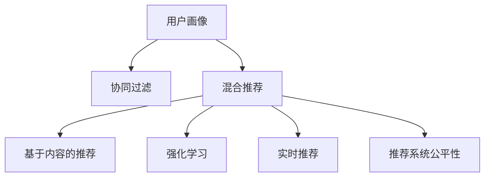

                 

# CUI中的个性化推荐与用户体验详细提升

> 关键词：用户画像, 协同过滤, 混合推荐, 模型融合, 基于内容的推荐, 强化学习, 实时推荐, 推荐系统, 用户体验, 推荐算法, 数据挖掘

## 1. 背景介绍

### 1.1 问题由来

随着互联网的普及和智能设备的广泛应用，用户的在线行为越来越频繁，对信息获取的需求也日益多元化、个性化。用户不仅希望推荐系统能提供多样化的内容，还希望系统能够理解用户的兴趣、需求和行为，推送与其匹配的内容。这对推荐系统提出了更高的要求，需要其在个性化推荐方面有更深入的挖掘和探索。

个性化推荐系统（Personalized Recommendation Systems, PRS）是指通过分析用户的历史行为和偏好，为用户推荐符合其兴趣和需求的内容。其在CUI（Computing User Interface，计算机用户界面）中的应用广泛，包括电商平台的商品推荐、视频网站的内容推荐、音乐平台的曲目推荐、新闻网站的文章推荐等。良好的个性化推荐能够显著提升用户体验，增强用户黏性，推动业务增长。

### 1.2 问题核心关键点

目前，个性化推荐系统的主要挑战包括：

1. **用户画像构建**：如何准确描述用户特征，构建用户画像。
2. **推荐算法设计**：如何选择合适的推荐算法，提高推荐精度。
3. **数据处理和利用**：如何高效处理海量数据，挖掘有用信息。
4. **算法模型融合**：如何融合多种推荐算法，提升综合性能。
5. **用户体验优化**：如何平衡推荐效果和用户感知，提升用户体验。
6. **推荐系统公平性**：如何在推荐过程中避免偏见，保证公平性。

## 2. 核心概念与联系

### 2.1 核心概念概述

在CUI中，个性化推荐系统的构建涉及以下几个核心概念：

- **用户画像**：描述用户属性、兴趣、行为等特征的抽象模型。用户画像的构建是推荐系统个性化推荐的基础。
- **协同过滤**：利用用户间相似性推荐物品的推荐算法，基于用户历史行为和物品关联关系进行推荐。
- **混合推荐**：结合多种推荐算法，综合利用不同推荐方法的优点，提升推荐效果。
- **基于内容的推荐**：根据物品的属性和特征，匹配用户兴趣，进行推荐。
- **强化学习**：通过用户互动和反馈，不断调整推荐策略，提升推荐效果。
- **实时推荐**：根据用户当前行为，实时生成推荐，提高用户满意度。
- **推荐系统公平性**：在推荐过程中考虑用户的多样性，避免对特定用户群体的偏见。

这些核心概念之间的关系可以通过以下Mermaid流程图来展示：



这个流程图展示了几大核心概念之间的关系：

1. **用户画像**：是构建个性化推荐系统的基础，为协同过滤、混合推荐等算法提供输入。
2. **协同过滤、混合推荐**：是推荐系统的主要算法，协同过滤和混合推荐通常结合使用，以提升推荐效果。
3. **基于内容的推荐、强化学习、实时推荐**：是推荐算法的重要组成部分，提升推荐系统的多样性和实时性。
4. **推荐系统公平性**：是在推荐过程中需要考虑的一个重要指标，避免对特定用户群体的偏见。

这些概念共同构成了CUI中个性化推荐系统的核心框架，使其能够在各种场景下实现高效、准确的个性化推荐。通过理解这些核心概念，我们可以更好地把握推荐系统的构建原理和优化方向。

## 3. 核心算法原理 & 具体操作步骤
### 3.1 算法原理概述

个性化推荐系统的核心原理是利用用户的历史行为和兴趣，预测用户对未交互物品的偏好，从而进行推荐。常见的推荐算法包括协同过滤、基于内容的推荐、混合推荐、强化学习等。

协同过滤算法基于用户间的相似性进行推荐，其基本原理是通过计算用户之间的相似度，将相似用户对物品的评分传递给目标用户，预测目标用户对未交互物品的评分，进而进行推荐。

基于内容的推荐算法利用物品的属性和特征，与用户的兴趣进行匹配，推荐用户可能感兴趣的物品。其核心在于构建物品特征向量，计算用户和物品之间的相似度。

混合推荐算法结合协同过滤和基于内容的推荐，综合利用不同算法的优点，提升推荐效果。常见的混合推荐方法包括基于加权平均、集成学习的混合推荐算法等。

强化学习算法通过用户与系统的互动，不断调整推荐策略，提升推荐效果。其核心在于构建推荐模型的奖惩机制，通过用户反馈调整模型参数，提高推荐准确性。

### 3.2 算法步骤详解

个性化推荐系统的构建通常包括以下几个关键步骤：

**Step 1: 数据预处理**
- 收集用户历史行为数据，如浏览、点击、评分等。
- 清洗、去噪、归一化处理原始数据，提高数据质量。
- 将数据进行划分，构建训练集、验证集和测试集。

**Step 2: 用户画像构建**
- 通过用户历史行为和属性信息，构建用户画像。
- 常用的方法包括基于朴素贝叶斯、聚类算法等构建用户画像。
- 可以使用TF-IDF、LDA等方法提取用户兴趣向量。

**Step 3: 算法选择与模型训练**
- 根据数据特点和应用场景，选择合适的推荐算法。
- 训练算法模型，并使用验证集进行调参和优化。
- 常见的算法包括协同过滤、基于内容的推荐、混合推荐、强化学习等。

**Step 4: 推荐结果生成**
- 利用训练好的推荐模型，对用户进行物品推荐。
- 结合多种推荐算法的结果，生成综合推荐列表。
- 可以使用排序算法对推荐结果进行排序，提升推荐效果。

**Step 5: 推荐结果反馈**
- 收集用户对推荐结果的反馈数据，如点击、评分等。
- 使用反馈数据对推荐模型进行优化和调整。
- 可以通过A/B测试等方法评估推荐效果，不断改进推荐系统。

### 3.3 算法优缺点

个性化推荐系统的优点包括：

1. 提升用户体验：通过个性化推荐，用户能够更快地找到感兴趣的内容，提升满意度。
2. 增加用户黏性：个性化推荐能够使用户在平台上停留时间更长，增加用户黏性。
3. 提高业务收入：个性化推荐能够增加用户的购买行为，提升业务收入。
4. 数据驱动：个性化推荐系统能够根据用户行为数据，进行动态调整，实现精准推荐。

个性化推荐系统的缺点包括：

1. 数据隐私问题：用户行为数据涉及隐私，需要进行合理的保护和处理。
2. 数据稀疏性问题：用户行为数据可能存在稀疏性，影响推荐效果。
3. 模型复杂性问题：推荐系统通常需要构建复杂的模型，对算法设计和实现要求较高。
4. 算法公平性问题：推荐系统可能存在偏见，对特定用户群体产生不公平的影响。

### 3.4 算法应用领域

个性化推荐系统在CUI中的应用广泛，包括但不限于以下几个领域：

1. **电商平台**：推荐用户可能感兴趣的商品，增加购买率。
2. **视频网站**：推荐用户可能感兴趣的视频内容，增加观看时长。
3. **音乐平台**：推荐用户可能感兴趣的音乐曲目，增加播放次数。
4. **新闻网站**：推荐用户可能感兴趣的文章，增加点击率。
5. **社交平台**：推荐用户可能感兴趣的朋友和内容，增加平台黏性。
6. **在线教育**：推荐用户可能感兴趣的学习资源，提升学习效果。

## 4. 数学模型和公式 & 详细讲解  
### 4.1 数学模型构建

在个性化推荐系统中，常用的数学模型包括协同过滤模型、基于内容的推荐模型和强化学习模型。

**协同过滤模型**：假设用户对物品的评分服从正态分布，利用用户间的相似度进行推荐。

**基于内容的推荐模型**：假设用户对物品的评分与物品的特征向量相关，利用物品特征进行推荐。

**强化学习模型**：假设推荐系统与用户互动，通过奖惩机制调整推荐策略，提升推荐效果。

### 4.2 公式推导过程

**协同过滤模型**：假设用户$u$对物品$i$的评分服从正态分布$N(\mu, \sigma^2)$，其中$\mu = \alpha_u + \beta_i$，$\alpha_u$和$\beta_i$分别代表用户和物品的评分偏置，$\sigma^2$为方差。利用用户间的相似度$sim(u,v)$，计算目标用户$u$对未交互物品$i$的评分预测值：

$$
\hat{r}_{ui} = \alpha_u + \beta_i + \sum_{j \in I_u} \frac{\hat{r}_{uj} sim(u,v_j)}{\sum_{j \in I_u} \hat{r}_{uj} sim(u,v_j)}
$$

其中，$I_u$代表用户$u$已交互物品的集合，$sim(u,v)$表示用户$u$和用户$v$的相似度。

**基于内容的推荐模型**：假设物品$i$的特征向量为$\vec{p_i}$，用户$u$的兴趣向量为$\vec{q_u}$，利用向量余弦相似度计算推荐结果：

$$
\hat{r}_{ui} = \vec{p_i} \cdot \vec{q_u}
$$

其中，$\vec{p_i}$和$\vec{q_u}$分别代表物品和用户的特征向量，$\cdot$表示向量点积。

**强化学习模型**：假设推荐系统通过用户行为获得奖励，奖励函数为$R(r_{ui}, r_{uj})$，其中$r_{ui}$和$r_{uj}$分别代表用户$u$对物品$i$和$j$的评分。推荐系统在每个时间步$t$，选择推荐物品$i$，获得的累积奖励为：

$$
R_t = \sum_{t=1}^{T} \gamma^{t-1} R(r_{ui}, r_{uj})
$$

其中，$\gamma$为折现因子，$T$为时间步数。

### 4.3 案例分析与讲解

下面以电商平台的商品推荐为例，详细分析个性化推荐系统的实现过程。

假设电商平台拥有大量用户行为数据，包括用户$u$对商品$i$的评分$r_{ui}$，利用协同过滤算法进行推荐，步骤如下：

1. 收集用户历史行为数据，构建用户和商品的全局评分矩阵$R$。
2. 计算用户$u$和用户$v$的相似度$sim(u,v)$，通常使用余弦相似度或皮尔逊相关系数。
3. 利用相似度$sim(u,v)$计算用户$u$对未交互商品$i$的评分预测值$\hat{r}_{ui}$。
4. 根据预测评分$\hat{r}_{ui}$，选择推荐结果。

基于内容的推荐算法实现类似，但需要根据商品的属性和特征，构建商品特征向量，计算用户兴趣向量，最终计算推荐结果。

## 5. 项目实践：代码实例和详细解释说明
### 5.1 开发环境搭建

在进行个性化推荐系统开发前，需要准备好开发环境。以下是使用Python进行推荐系统开发的常见环境配置流程：

1. 安装Anaconda：从官网下载并安装Anaconda，用于创建独立的Python环境。

2. 创建并激活虚拟环境：
```bash
conda create -n recommendation-env python=3.8 
conda activate recommendation-env
```

3. 安装PyTorch、TensorFlow、Pandas等常用工具包：
```bash
conda install pytorch torchvision torchaudio cudatoolkit=11.1 -c pytorch -c conda-forge
conda install tensorflow pandas matplotlib scikit-learn
```

4. 安装推荐系统相关的库：
```bash
conda install --channel https://anaconda.org/astanin/recommenders-fast -c astanin pyrec-lightfm pyrec-als
```

5. 安装Jupyter Notebook，配置环境变量：
```bash
pip install jupyter notebook
```

6. 启动Jupyter Notebook，开始开发实践。

完成上述步骤后，即可在`recommendation-env`环境中开始推荐系统开发。

### 5.2 源代码详细实现

下面我们以协同过滤算法实现商品推荐为例，给出使用FastFM库的PyTorch代码实现。

首先，定义数据处理函数：

```python
import numpy as np
from fastfm import Cross
from torch.utils.data import Dataset
import torch

class RecommendationDataset(Dataset):
    def __init__(self, train_matrix, test_matrix, item_features):
        self.train_matrix = train_matrix
        self.test_matrix = test_matrix
        self.item_features = item_features
        self.train_matrix = np.array(train_matrix, dtype=np.float32)
        self.test_matrix = np.array(test_matrix, dtype=np.float32)
        self.item_features = np.array(item_features, dtype=np.float32)
        
    def __len__(self):
        return len(self.train_matrix)
    
    def __getitem__(self, item):
        train_row, train_col, train_val = self.train_matrix[item]
        test_row, test_col, test_val = self.test_matrix[item]
        item_features = self.item_features[test_col]
        return {'train_row': train_row, 'train_col': train_col, 'train_val': train_val,
                'test_row': test_row, 'test_col': test_col, 'test_val': test_val,
                'item_features': item_features}
```

然后，定义模型和优化器：

```python
from torch.optim import Adam

model = Cross()
optimizer = Adam(model.parameters(), lr=0.001)
```

接着，定义训练和评估函数：

```python
from fastFM importFMTrainer
from sklearn.metrics import mean_squared_error

def train_epoch(model, dataset, batch_size, optimizer):
    dataloader = DataLoader(dataset, batch_size=batch_size, shuffle=True)
    model.train()
    epoch_loss = 0
    for batch in tqdm(dataloader, desc='Training'):
        train_row = batch['train_row']
        train_col = batch['train_col']
        train_val = batch['train_val']
        test_row = batch['test_row']
        test_col = batch['test_col']
        test_val = batch['test_val']
        item_features = batch['item_features']
        
        predict = model.predict(test_row, test_col, item_features)
        loss = mean_squared_error(test_val, predict)
        epoch_loss += loss
        optimizer.zero_grad()
        loss.backward()
        optimizer.step()
    return epoch_loss / len(dataloader)

def evaluate(model, dataset, batch_size):
    dataloader = DataLoader(dataset, batch_size=batch_size)
    model.eval()
    preds, labels = [], []
    with torch.no_grad():
        for batch in tqdm(dataloader, desc='Evaluating'):
            train_row = batch['train_row']
            train_col = batch['train_col']
            train_val = batch['train_val']
            test_row = batch['test_row']
            test_col = batch['test_col']
            test_val = batch['test_val']
            item_features = batch['item_features']
            
            predict = model.predict(test_row, test_col, item_features)
            batch_preds = predict.tolist()
            batch_labels = test_val.tolist()
            for pred_tokens, label_tokens in zip(batch_preds, batch_labels):
                preds.append(pred_tokens[:len(label_tokens)])
                labels.append(label_tokens)
                
    print(mean_squared_error(labels, preds))
```

最后，启动训练流程并在测试集上评估：

```python
epochs = 10
batch_size = 128

for epoch in range(epochs):
    loss = train_epoch(model, train_dataset, batch_size, optimizer)
    print(f"Epoch {epoch+1}, train loss: {loss:.3f}")
    
    print(f"Epoch {epoch+1}, test RMSE:")
    evaluate(model, test_dataset, batch_size)
```

以上就是使用FastFM库对商品推荐系统进行协同过滤算法的Python代码实现。可以看到，FastFM库提供了简单易用的接口，可以快速构建协同过滤模型，并进行微调。

### 5.3 代码解读与分析

让我们再详细解读一下关键代码的实现细节：

**RecommendationDataset类**：
- `__init__`方法：初始化训练集、测试集和商品特征矩阵，进行数据预处理。
- `__len__`方法：返回数据集的样本数量。
- `__getitem__`方法：对单个样本进行处理，提取训练和测试集的相关数据。

**训练和评估函数**：
- 使用FastFM库的FMTrainer进行模型训练，计算平均均方误差，评估模型性能。
- 在训练过程中，使用Adam优化器进行梯度更新，以最小化损失函数。

**训练流程**：
- 定义总的epoch数和batch size，开始循环迭代
- 每个epoch内，先在训练集上训练，输出平均损失
- 在测试集上评估，输出RMSE
- 所有epoch结束后，输出最终测试结果

可以看到，FastFM库使得协同过滤算法的实现变得简洁高效。开发者可以将更多精力放在数据处理、模型改进等高层逻辑上，而不必过多关注底层的实现细节。

当然，工业级的系统实现还需考虑更多因素，如模型的保存和部署、超参数的自动搜索、更灵活的任务适配层等。但核心的协同过滤算法基本与此类似。

## 6. 实际应用场景
### 6.1 智能客服系统

智能客服系统通过个性化推荐，能够提升用户体验，解决用户问题，增强用户黏性。具体而言，可以通过分析用户的历史咨询记录和偏好，推荐相关的解答文章、常见问题解答等，快速响应用户问题，提升用户满意度。

在技术实现上，可以收集用户的历史咨询记录和标签，将问题-答案对作为监督数据，在此基础上对预训练语言模型进行微调。微调后的模型能够根据用户问题生成相关解答，提升智能客服系统的智能水平。

### 6.2 金融舆情监测

金融舆情监测系统通过个性化推荐，能够实时监控市场舆论动向，提供及时、准确的信息。具体而言，可以通过分析用户在新闻、社交媒体等平台上的评论和互动，推荐相关的市场分析报告、专家解读等，帮助用户及时了解市场动态。

在技术实现上，可以收集用户的互动记录和偏好，将新闻、评论等文本数据作为输入，在此基础上对预训练语言模型进行微调。微调后的模型能够根据用户的兴趣和需求，推荐相关的新闻和分析报告，提升舆情监测系统的准确性和及时性。

### 6.3 个性化推荐系统

个性化推荐系统通过个性化推荐，能够提升用户购物体验，增加用户购买行为。具体而言，可以通过分析用户的历史购物行为和偏好，推荐相关的商品、广告等，提升用户的购物体验和购买意愿。

在技术实现上，可以收集用户的购物行为数据，构建用户画像，在此基础上对协同过滤、基于内容的推荐等算法进行微调。微调后的模型能够根据用户的兴趣和需求，推荐相关的商品和广告，提升个性化推荐的效果。

### 6.4 未来应用展望

随着推荐系统的发展，个性化推荐将应用到更多的场景中，为各个行业带来变革性影响。

在智慧医疗领域，个性化推荐系统可以通过分析用户的健康数据，推荐相关的医疗资源、健康知识等，提升用户的健康管理水平。

在智能教育领域，个性化推荐系统可以通过分析学生的学习行为和偏好，推荐相关的学习资源、辅导方案等，提升学生的学习效果。

在智能城市治理中，个性化推荐系统可以通过分析市民的出行数据、消费习惯等，推荐相关的城市服务、优惠活动等，提升市民的生活质量。

此外，在企业生产、社会治理、文娱传媒等众多领域，个性化推荐系统也将不断涌现，为各行各业带来新的价值。相信随着技术的不断进步，推荐系统将为人类生活带来更加智能化、个性化的体验。

## 7. 工具和资源推荐
### 7.1 学习资源推荐

为了帮助开发者系统掌握个性化推荐系统的理论基础和实践技巧，这里推荐一些优质的学习资源：

1. 《推荐系统实战》系列博文：由大模型技术专家撰写，深入浅出地介绍了推荐系统的工作原理、经典算法和实践方法。

2. Coursera《Recommender Systems》课程：斯坦福大学开设的推荐系统课程，涵盖推荐系统的基础概念、算法设计和评估指标。

3.《推荐系统》书籍：该书由推荐系统领域的权威专家编写，系统地介绍了推荐系统的理论基础和实际应用。

4. Apache Spark MLlib：Spark机器学习库，提供了多种推荐算法和工具，适合工业级推荐系统开发。

5. PyTorch Lightning：一个基于PyTorch的轻量级机器学习框架，适合快速开发和部署推荐系统。

通过对这些资源的学习实践，相信你一定能够快速掌握个性化推荐系统的精髓，并用于解决实际的推荐问题。

### 7.2 开发工具推荐

高效的开发离不开优秀的工具支持。以下是几款用于个性化推荐系统开发的常用工具：

1. PyTorch：基于Python的开源深度学习框架，灵活动态的计算图，适合快速迭代研究。大部分推荐算法都有PyTorch版本的实现。

2. TensorFlow：由Google主导开发的开源深度学习框架，生产部署方便，适合大规模工程应用。同样有丰富的推荐算法资源。

3. FastFM：一个用于高维稀疏特征矩阵的机器学习库，提供多种协同过滤算法，支持分布式计算。

4. Apache Spark：一个分布式计算框架，支持多种数据处理和机器学习算法，适合大规模推荐系统开发。

5. Amazon SageMaker：亚马逊提供的机器学习服务，提供多种推荐算法和工具，适合工业级推荐系统开发。

6. Jupyter Notebook：一个交互式编程环境，支持多种编程语言，适合数据分析和模型开发。

合理利用这些工具，可以显著提升推荐系统的开发效率，加快创新迭代的步伐。

### 7.3 相关论文推荐

个性化推荐系统的发展源于学界的持续研究。以下是几篇奠基性的相关论文，推荐阅读：

1. The BellKor 2011 Recommendation Challenge Dataset：提供了多个推荐系统数据集，包括Amazon、Flixster等平台的用户行为数据。

2. Field-aware Factorization Machines with Logistic Calibration for Large-scale Recommender Systems：提出场感知因子机器学习算法，提升推荐效果。

3. Contextual Hybrid Matrix Factorization for Recommender Systems：提出混合推荐算法，结合协同过滤和基于内容的推荐。

4. Deep Collaborative Filtering Using Matrix Factorization Techniques：提出基于矩阵分解的协同过滤算法，提升推荐效果。

5. Dopamine：一个强化学习框架，提供多种推荐算法和实验环境，适合研究推荐系统的强化学习应用。

这些论文代表了个性化推荐系统的发展脉络。通过学习这些前沿成果，可以帮助研究者把握学科前进方向，激发更多的创新灵感。

## 8. 总结：未来发展趋势与挑战
### 8.1 总结

本文对个性化推荐系统的核心概念和实现过程进行了全面系统的介绍。首先阐述了推荐系统在CUI中的重要应用，明确了推荐系统个性化推荐的核心价值。其次，从原理到实践，详细讲解了协同过滤、基于内容的推荐等算法的工作原理和关键步骤，给出了推荐系统开发的完整代码实例。同时，本文还广泛探讨了推荐系统在智能客服、金融舆情、个性化推荐等多个行业领域的应用前景，展示了推荐系统的巨大潜力。此外，本文精选了推荐系统的各类学习资源，力求为读者提供全方位的技术指引。

通过本文的系统梳理，可以看到，个性化推荐系统正成为CUI中不可或缺的重要组成部分，极大地提升了用户的使用体验和平台黏性。未来，随着推荐系统的发展，其应用场景将更加广泛，为用户带来更加智能化、个性化的服务。

### 8.2 未来发展趋势

展望未来，个性化推荐系统的发展趋势主要包括以下几个方面：

1. **深度学习应用**：随着深度学习技术的进步，基于深度学习的推荐算法将逐渐取代传统的协同过滤算法，提升推荐效果。

2. **多模态推荐**：未来的推荐系统将不仅仅是基于文本的推荐，还将利用多模态信息，如音频、图像、视频等，提升推荐效果和用户满意度。

3. **实时推荐**：未来的推荐系统将更加注重实时性，通过实时分析用户行为，实时生成推荐结果，提升用户满意度。

4. **强化学习优化**：未来的推荐系统将更多地利用强化学习技术，通过用户反馈不断调整推荐策略，提升推荐效果。

5. **跨平台协同**：未来的推荐系统将实现跨平台协同，不同平台的数据和推荐结果可以互相补充，提升推荐效果。

6. **个性化推荐系统将更加智能和多样化**：未来的推荐系统将能够更加精准地理解用户需求，提供更加个性化的推荐服务。

### 8.3 面临的挑战

尽管个性化推荐系统已经取得了显著的进展，但在迈向更加智能化、普适化应用的过程中，它仍面临诸多挑战：

1. **数据隐私问题**：推荐系统涉及大量用户数据，如何保护用户隐私是一个重要问题。

2. **数据稀疏性问题**：推荐系统数据通常存在稀疏性，影响推荐效果。

3. **推荐算法复杂性问题**：推荐系统通常需要构建复杂的模型，对算法设计和实现要求较高。

4. **推荐系统公平性问题**：推荐系统可能存在偏见，对特定用户群体产生不公平的影响。

5. **推荐系统鲁棒性问题**：推荐系统可能对数据变化敏感，需要不断优化和调整。

6. **推荐系统实时性问题**：推荐系统需要实时处理用户行为数据，对计算资源要求较高。

7. **推荐系统可扩展性问题**：推荐系统需要处理海量数据，需要考虑系统的可扩展性。

### 8.4 研究展望

面对推荐系统面临的诸多挑战，未来的研究需要在以下几个方面寻求新的突破：

1. **深度学习算法优化**：探索新的深度学习算法，提高推荐效果和效率。

2. **多模态数据融合**：探索新的多模态数据融合方法，提升推荐效果和用户满意度。

3. **实时推荐系统优化**：探索新的实时推荐系统设计，提升系统的实时性和可靠性。

4. **推荐系统公平性研究**：研究推荐系统的公平性问题，避免对特定用户群体产生不公平的影响。

5. **推荐系统鲁棒性研究**：研究推荐系统的鲁棒性问题，提高系统对数据变化的适应性。

6. **推荐系统实时性优化**：研究推荐系统的实时性问题，提高系统的计算效率和处理能力。

7. **推荐系统可扩展性研究**：研究推荐系统的可扩展性问题，提高系统的可处理能力和可维护性。

这些研究方向的探索，必将引领个性化推荐系统迈向更高的台阶，为构建智能推荐系统铺平道路。面向未来，推荐系统还需要与其他人工智能技术进行更深入的融合，如知识表示、因果推理、强化学习等，多路径协同发力，共同推动推荐系统的发展。只有勇于创新、敢于突破，才能不断拓展推荐系统的边界，让推荐技术更好地造福人类社会。

## 9. 附录：常见问题与解答

**Q1：推荐系统如何构建用户画像？**

A: 用户画像的构建是推荐系统的基础。常见的构建方法包括：

1. **基于协同过滤的画像**：利用用户历史行为数据，通过协同过滤算法构建用户画像。

2. **基于内容的画像**：利用用户对物品的评分和反馈，通过基于内容的推荐算法构建用户画像。

3. **基于混合推荐的画像**：结合多种推荐算法，综合利用不同算法的优点，构建用户画像。

4. **基于深度学习的画像**：利用深度学习算法，从用户行为数据中提取用户兴趣和偏好，构建用户画像。

这些方法可以单独使用，也可以结合使用，根据数据特点和应用场景选择合适的方法。

**Q2：推荐系统如何选择推荐算法？**

A: 推荐算法的选择需要根据数据特点和应用场景进行综合考虑：

1. **数据稀疏性问题**：当数据稀疏性较高时，选择协同过滤算法较为合适。

2. **数据实时性要求**：当需要实时生成推荐结果时，选择实时推荐算法较为合适。

3. **数据多样性要求**：当需要利用多模态信息进行推荐时，选择多模态推荐算法较为合适。

4. **数据个性化要求**：当需要提供个性化推荐时，选择基于内容的推荐算法较为合适。

5. **数据可解释性要求**：当需要提供可解释性推荐时，选择基于深度学习的推荐算法较为合适。

**Q3：推荐系统如何处理数据隐私问题？**

A: 推荐系统涉及大量用户数据，数据隐私问题需要特别关注。常见的处理方式包括：

1. **数据匿名化**：对用户数据进行匿名化处理，保护用户隐私。

2. **数据加密**：对用户数据进行加密处理，防止数据泄露。

3. **数据去标识化**：对用户数据进行去标识化处理，防止数据泄露。

4. **隐私保护算法**：使用隐私保护算法，如差分隐私、联邦学习等，保护用户隐私。

这些方法可以单独使用，也可以结合使用，根据数据特点和应用场景选择合适的方法。

**Q4：推荐系统如何提高推荐效果？**

A: 推荐效果的提高需要从多个方面进行优化：

1. **数据质量**：提高数据质量，清洗、去噪、归一化处理原始数据。

2. **算法优化**：选择适合的数据特点和应用场景的推荐算法，并进行算法优化。

3. **特征工程**：提取高质量的特征，构建高质量的特征向量。

4. **模型优化**：优化推荐模型，提高模型精度和泛化能力。

5. **数据增强**：通过数据增强，扩充训练集，提高推荐效果。

6. **模型融合**：融合多种推荐算法，综合利用不同算法的优点。

这些优化方法可以单独使用，也可以结合使用，根据数据特点和应用场景选择合适的方法。

**Q5：推荐系统如何在推荐过程中避免偏见？**

A: 推荐系统可能存在偏见，对特定用户群体产生不公平的影响。为避免偏见，可以采取以下措施：

1. **公平性评估**：在推荐过程中进行公平性评估，避免对特定用户群体产生不公平的影响。

2. **数据去偏差**：对数据进行去偏差处理，避免数据中的偏见。

3. **算法公平性**：选择公平性较好的推荐算法，避免算法偏见。

4. **用户反馈机制**：建立用户反馈机制，及时发现和纠正推荐偏差。

这些措施可以单独使用，也可以结合使用，根据数据特点和应用场景选择合适的方法。

---

作者：禅与计算机程序设计艺术 / Zen and the Art of Computer Programming

