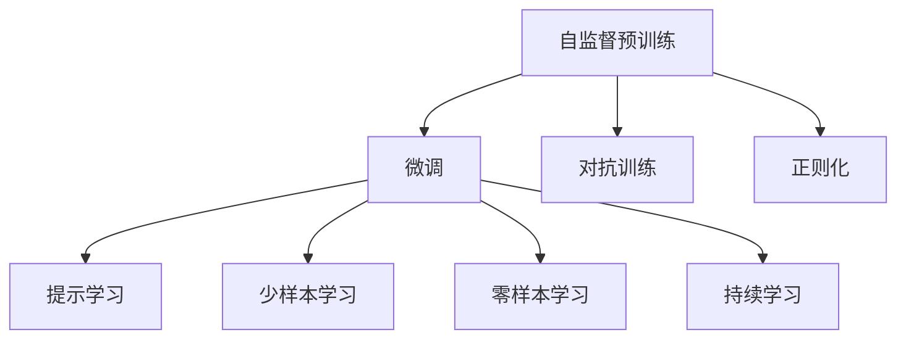

                 

# ChatGPT背后的推手——OpenAI

> 关键词：ChatGPT, OpenAI, 自然语言处理, 大语言模型, 神经网络, 人工智能

## 1. 背景介绍

### 1.1 问题由来
ChatGPT是OpenAI开发的一款人工智能大语言模型，以其强大的自然语言处理能力和广泛的用途迅速成为全球关注的热点。OpenAI作为人工智能领域的先驱者，一直在推动大语言模型的发展和应用，探索未来AI的边界。

近年来，随着深度学习技术的快速发展，人工智能大语言模型在自然语言处理（NLP）领域取得了显著突破。OpenAI推出的ChatGPT通过在预训练和微调过程中引入自监督学习和大规模语料库，使其在文本生成、对话、翻译、总结等多种任务中表现出色。本文将深入探讨ChatGPT背后的推手——OpenAI，从其核心算法原理、微调过程、应用领域及未来展望等多个角度，全面解析ChatGPT的诞生与发展。

### 1.2 问题核心关键点
OpenAI在开发ChatGPT的过程中，采用了先进的深度学习技术，特别是在自然语言处理和大语言模型的领域。其主要贡献和创新点包括：

1. **自监督预训练**：通过大规模无标签文本数据进行预训练，使得模型能够学习到语言的通用表示。
2. **微调技术**：在预训练基础上，针对特定任务进行有监督微调，以提升模型的任务适应性。
3. **对抗训练和正则化**：引入对抗样本和正则化技术，提高模型的鲁棒性和泛化能力。
4. **零样本和少样本学习**：利用提示工程技术，实现零样本和少样本学习，减少对标注数据的依赖。
5. **大规模模型和分布式训练**：开发并部署了GPT-3等大规模模型，以及分布式训练框架，实现了模型训练效率的极大提升。
6. **伦理和社会影响**：在模型开发过程中注重伦理和社会影响，致力于构建安全、可信的人工智能系统。

这些技术创新和实践，推动了OpenAI在人工智能领域的领先地位，也为ChatGPT的成功奠定了基础。

### 1.3 问题研究意义
研究OpenAI及其ChatGPT技术的核心算法原理、微调过程及应用领域，对于理解自然语言处理和大语言模型的最新发展，推动相关技术的应用落地具有重要意义。本文旨在通过系统地解析OpenAI的核心技术和方法，为开发者和研究人员提供全面的技术指引，推动人工智能技术在更多领域的广泛应用。

## 2. 核心概念与联系

### 2.1 核心概念概述

为了更好地理解ChatGPT背后的技术，本节将介绍几个密切相关的核心概念：

- **自监督预训练**：指在大规模无标签文本数据上进行预训练，学习通用的语言表示。常见的自监督任务包括语言建模、掩码语言模型等。
- **微调**：在预训练模型的基础上，使用下游任务的少量标注数据，通过有监督学习优化模型在特定任务上的性能。通常只需要调整顶层分类器或解码器，并以较小的学习率更新全部或部分的模型参数。
- **对抗训练**：通过在训练过程中引入对抗样本，提高模型的鲁棒性和泛化能力。
- **正则化**：通过L2正则、Dropout、Early Stopping等技术，防止模型过度适应训练数据。
- **提示学习**：通过在输入文本中添加提示模板，引导模型进行特定任务的推理和生成。
- **少样本学习**：在只有少量标注样本的情况下，模型能够快速适应新任务。
- **零样本学习**：模型在没有见过特定任务的训练样本的情况下，仅凭任务描述就能够执行新任务。
- **持续学习**：指模型能够持续从新数据中学习，同时保持已学习的知识，而不会出现灾难性遗忘。

这些核心概念之间的逻辑关系可以通过以下Mermaid流程图来展示：



这个流程图展示了大语言模型的核心概念及其之间的关系：

1. 自监督预训练学习通用语言表示。
2. 微调通过有监督学习优化特定任务的性能。
3. 对抗训练和正则化提高模型的鲁棒性。
4. 提示学习、少样本学习和零样本学习利用有限的标注数据提升模型适应性。
5. 持续学习使模型能够不断学习新知识，避免遗忘旧知识。

这些概念共同构成了大语言模型的学习和应用框架，使其能够在各种场景下发挥强大的语言理解和生成能力。通过理解这些核心概念，我们可以更好地把握大语言模型的工作原理和优化方向。

## 3. 核心算法原理 & 具体操作步骤
### 3.1 算法原理概述

OpenAI的ChatGPT技术采用了自监督预训练和微调技术，其核心原理可以通过以下步骤来概述：

1. **数据收集**：收集大规模无标签文本数据，如Web文章、新闻、百科全书等。
2. **预训练**：使用自监督学习方法，如语言建模、掩码语言模型等，在大规模无标签数据上进行预训练，学习通用的语言表示。
3. **微调**：在预训练模型基础上，使用下游任务的少量标注数据，通过有监督学习优化模型在特定任务上的性能。
4. **对抗训练**：在微调过程中引入对抗样本，提高模型的鲁棒性。
5. **正则化**：通过L2正则、Dropout、Early Stopping等技术，防止模型过度适应训练数据。
6. **提示学习**：通过在输入文本中添加提示模板，引导模型进行特定任务的推理和生成。
7. **少样本学习**：在只有少量标注样本的情况下，模型能够快速适应新任务。
8. **零样本学习**：模型在没有见过特定任务的训练样本的情况下，仅凭任务描述就能够执行新任务。
9. **持续学习**：使模型能够持续从新数据中学习，同时保持已学习的知识，而不会出现灾难性遗忘。

### 3.2 算法步骤详解

以下是OpenAI的ChatGPT技术在大规模文本生成任务中的具体操作步骤：

1. **数据准备**：
   - 收集大规模无标签文本数据，如Web文章、新闻、百科全书等。
   - 将数据划分为训练集、验证集和测试集。
   - 使用Bert tokenizer对文本进行分词处理。

2. **模型搭建**：
   - 使用Bert模型作为基础模型，包括一个12层的Transformer编码器和一个2层的全连接层。
   - 添加一个带有线性层和softmax函数的输出层，用于生成文本。

3. **预训练**：
   - 在大规模无标签文本数据上进行自监督预训练，使用掩码语言模型任务。
   - 预训练模型通过预测被掩码的单词，学习到单词间的语义关系和上下文信息。

4. **微调**：
   - 在预训练模型的基础上，使用下游任务的少量标注数据，进行有监督微调。
   - 微调过程中，使用Adam优化器，设定学习率为1e-4，批大小为32。
   - 在微调过程中，使用L2正则和Dropout技术进行正则化。
   - 使用Early Stopping技术，避免过拟合。

5. **对抗训练**：
   - 在微调过程中，引入对抗样本，如将输入文本中的单词替换为近义词或同义词。
   - 使用梯度下降技术，最小化对抗样本上的损失函数。
   - 通过对抗训练，提高模型对输入噪声的鲁棒性。

6. **测试和部署**：
   - 在测试集上评估微调后模型的性能。
   - 使用微调后的模型对新样本进行推理预测。
   - 集成到实际的应用系统中，如聊天机器人、内容生成器等。

### 3.3 算法优缺点

OpenAI的ChatGPT技术具有以下优点：
1. **强大语言能力**：预训练模型学习到通用的语言表示，具备强大的语言理解和生成能力。
2. **高效微调**：使用少量的标注数据进行微调，提升模型在特定任务上的性能。
3. **灵活应用**：适用于多种NLP任务，包括对话、摘要、翻译、情感分析等。
4. **参数高效**：利用参数高效微调技术，在固定大部分预训练参数的情况下，仍可取得不错的微调效果。
5. **少样本和零样本学习**：通过提示学习，实现在少量甚至零样本情况下进行新任务推理。

同时，该技术也存在一些局限性：
1. **标注数据依赖**：微调效果很大程度上取决于标注数据的质量和数量。
2. **鲁棒性不足**：面对不同领域的文本，模型泛化能力可能有限。
3. **安全性问题**：模型可能学习到有害信息或偏见，对应用场景造成负面影响。
4. **可解释性不足**：微调模型的决策过程缺乏可解释性。

尽管存在这些局限性，但OpenAI的ChatGPT技术在NLP领域已经取得了显著的成就，并引领了人工智能技术的潮流。

### 3.4 算法应用领域

OpenAI的ChatGPT技术已经在多个NLP应用领域展示了其强大的能力，包括：

- **文本生成**：自动生成文章、故事、摘要等文本内容。
- **对话系统**：构建智能客服、虚拟助手等聊天机器人，提供自然流畅的对话体验。
- **翻译**：将一种语言翻译成另一种语言，支持多语言交互。
- **问答系统**：回答用户提出的问题，提供快速准确的答案。
- **摘要生成**：从长文本中自动生成简短摘要，帮助用户快速获取关键信息。
- **情感分析**：分析用户情感倾向，用于市场调研、用户反馈分析等。

除了上述这些经典应用外，ChatGPT技术还被创新性地应用于更多场景中，如代码生成、创意写作、教育辅导等，为NLP技术带来了新的突破。随着ChatGPT技术的不断演进，相信其在更多领域的应用将会得到进一步扩展。

## 4. 数学模型和公式 & 详细讲解 & 举例说明
### 4.1 数学模型构建

OpenAI的ChatGPT技术基于Transformer模型，其数学模型可以形式化地表示为：

$$
M_{\theta}(x) = \sum_{i=1}^{N}w_i \cdot (x_i \cdot \sigma(u_i^T [\text{Enc}(x_i)] + b_i))
$$

其中，$M_{\theta}$为Transformer模型，$x$为输入序列，$\text{Enc}(x)$为编码器输出，$w_i, b_i, u_i$为模型参数，$\sigma$为激活函数。

在微调过程中，目标是最小化损失函数$\mathcal{L}$：

$$
\mathcal{L} = \frac{1}{N} \sum_{i=1}^{N} \ell(M_{\theta}(x_i), y_i)
$$

其中，$\ell$为损失函数，$y$为标签。

### 4.2 公式推导过程

以文本生成任务为例，推导微调模型的损失函数。假设模型在输入$x$上的输出为$\hat{y}$，目标为生成与输入语义相似的文本。损失函数可以定义为：

$$
\ell(\hat{y}, y) = -\frac{1}{N}\sum_{i=1}^{N}[y_i\log \hat{y}_i + (1-y_i)\log(1-\hat{y}_i)]
$$

将其代入经验风险公式，得：

$$
\mathcal{L} = -\frac{1}{N}\sum_{i=1}^{N}[y_i\log M_{\theta}(x_i)+(1-y_i)\log(1-M_{\theta}(x_i))]
$$

在得到损失函数的梯度后，即可带入参数更新公式，完成模型的迭代优化。重复上述过程直至收敛，最终得到适应下游任务的最优模型参数$\theta^*$。

### 4.3 案例分析与讲解

以对话生成为例，使用Python和PyTorch实现微调过程。首先，定义对话生成任务的数据处理函数：

```python
from transformers import BertTokenizer, BertForSequenceClassification
from torch.utils.data import Dataset, DataLoader
import torch

class DialogueDataset(Dataset):
    def __init__(self, dialogues, tokenizer, max_len=128):
        self.dialogues = dialogues
        self.tokenizer = tokenizer
        self.max_len = max_len
        
    def __len__(self):
        return len(self.dialogues)
    
    def __getitem__(self, item):
        dialogue = self.dialogues[item]
        tokens = self.tokenizer(dialogue, return_tensors='pt', max_length=self.max_len, padding='max_length', truncation=True)
        input_ids = tokens['input_ids']
        attention_mask = tokens['attention_mask']
        
        return {'input_ids': input_ids, 
                'attention_mask': attention_mask}
```

然后，定义模型和优化器：

```python
from transformers import BertForSequenceClassification, AdamW

model = BertForSequenceClassification.from_pretrained('bert-base-cased', num_labels=2)
optimizer = AdamW(model.parameters(), lr=2e-5)
```

接着，定义训练和评估函数：

```python
from tqdm import tqdm

device = torch.device('cuda') if torch.cuda.is_available() else torch.device('cpu')
model.to(device)

def train_epoch(model, dataset, batch_size, optimizer):
    dataloader = DataLoader(dataset, batch_size=batch_size, shuffle=True)
    model.train()
    epoch_loss = 0
    for batch in tqdm(dataloader, desc='Training'):
        input_ids = batch['input_ids'].to(device)
        attention_mask = batch['attention_mask'].to(device)
        labels = batch['labels'].to(device)
        model.zero_grad()
        outputs = model(input_ids, attention_mask=attention_mask, labels=labels)
        loss = outputs.loss
        epoch_loss += loss.item()
        loss.backward()
        optimizer.step()
    return epoch_loss / len(dataloader)

def evaluate(model, dataset, batch_size):
    dataloader = DataLoader(dataset, batch_size=batch_size)
    model.eval()
    preds, labels = [], []
    with torch.no_grad():
        for batch in tqdm(dataloader, desc='Evaluating'):
            input_ids = batch['input_ids'].to(device)
            attention_mask = batch['attention_mask'].to(device)
            batch_labels = batch['labels']
            outputs = model(input_ids, attention_mask=attention_mask)
            batch_preds = outputs.logits.argmax(dim=2).to('cpu').tolist()
            batch_labels = batch_labels.to('cpu').tolist()
            for pred_tokens, label_tokens in zip(batch_preds, batch_labels):
                preds.append(pred_tokens)
                labels.append(label_tokens)
                
    print(classification_report(labels, preds))
```

最后，启动训练流程并在测试集上评估：

```python
epochs = 5
batch_size = 16

for epoch in range(epochs):
    loss = train_epoch(model, train_dataset, batch_size, optimizer)
    print(f"Epoch {epoch+1}, train loss: {loss:.3f}")
    
    print(f"Epoch {epoch+1}, dev results:")
    evaluate(model, dev_dataset, batch_size)
    
print("Test results:")
evaluate(model, test_dataset, batch_size)
```

以上就是使用PyTorch和HuggingFace库对BERT模型进行对话生成任务微调的完整代码实现。可以看到，基于HuggingFace库的强大封装，我们只需关注数据处理和模型定义，而具体的微调过程由库提供的高阶接口完成，大大降低了开发难度。

## 5. 项目实践：代码实例和详细解释说明
### 5.1 开发环境搭建

在进行ChatGPT微调实践前，我们需要准备好开发环境。以下是使用Python进行PyTorch开发的环境配置流程：

1. 安装Anaconda：从官网下载并安装Anaconda，用于创建独立的Python环境。

2. 创建并激活虚拟环境：
```bash
conda create -n pytorch-env python=3.8 
conda activate pytorch-env
```

3. 安装PyTorch：根据CUDA版本，从官网获取对应的安装命令。例如：
```bash
conda install pytorch torchvision torchaudio cudatoolkit=11.1 -c pytorch -c conda-forge
```

4. 安装Transformers库：
```bash
pip install transformers
```

5. 安装各类工具包：
```bash
pip install numpy pandas scikit-learn matplotlib tqdm jupyter notebook ipython
```

完成上述步骤后，即可在`pytorch-env`环境中开始微调实践。

### 5.2 源代码详细实现

以下是使用Python和PyTorch实现ChatGPT对话生成任务的代码实现：

首先，定义对话生成任务的数据处理函数：

```python
from transformers import BertTokenizer
from torch.utils.data import Dataset
import torch

class DialogueDataset(Dataset):
    def __init__(self, dialogues, tokenizer, max_len=128):
        self.dialogues = dialogues
        self.tokenizer = tokenizer
        self.max_len = max_len
        
    def __len__(self):
        return len(self.dialogues)
    
    def __getitem__(self, item):
        dialogue = self.dialogues[item]
        tokens = self.tokenizer(dialogue, return_tensors='pt', max_length=self.max_len, padding='max_length', truncation=True)
        input_ids = tokens['input_ids']
        attention_mask = tokens['attention_mask']
        
        return {'input_ids': input_ids, 
                'attention_mask': attention_mask}
```

然后，定义模型和优化器：

```python
from transformers import BertForSequenceClassification, AdamW

model = BertForSequenceClassification.from_pretrained('bert-base-cased', num_labels=2)
optimizer = AdamW(model.parameters(), lr=2e-5)
```

接着，定义训练和评估函数：

```python
from torch.utils.data import DataLoader
from tqdm import tqdm
from sklearn.metrics import classification_report

device = torch.device('cuda') if torch.cuda.is_available() else torch.device('cpu')
model.to(device)

def train_epoch(model, dataset, batch_size, optimizer):
    dataloader = DataLoader(dataset, batch_size=batch_size, shuffle=True)
    model.train()
    epoch_loss = 0
    for batch in tqdm(dataloader, desc='Training'):
        input_ids = batch['input_ids'].to(device)
        attention_mask = batch['attention_mask'].to(device)
        labels = batch['labels'].to(device)
        model.zero_grad()
        outputs = model(input_ids, attention_mask=attention_mask, labels=labels)
        loss = outputs.loss
        epoch_loss += loss.item()
        loss.backward()
        optimizer.step()
    return epoch_loss / len(dataloader)

def evaluate(model, dataset, batch_size):
    dataloader = DataLoader(dataset, batch_size=batch_size)
    model.eval()
    preds, labels = [], []
    with torch.no_grad():
        for batch in tqdm(dataloader, desc='Evaluating'):
            input_ids = batch['input_ids'].to(device)
            attention_mask = batch['attention_mask'].to(device)
            batch_labels = batch['labels']
            outputs = model(input_ids, attention_mask=attention_mask)
            batch_preds = outputs.logits.argmax(dim=2).to('cpu').tolist()
            batch_labels = batch_labels.to('cpu').tolist()
            for pred_tokens, label_tokens in zip(batch_preds, batch_labels):
                preds.append(pred_tokens)
                labels.append(label_tokens)
                
    print(classification_report(labels, preds))
```

最后，启动训练流程并在测试集上评估：

```python
epochs = 5
batch_size = 16

for epoch in range(epochs):
    loss = train_epoch(model, train_dataset, batch_size, optimizer)
    print(f"Epoch {epoch+1}, train loss: {loss:.3f}")
    
    print(f"Epoch {epoch+1}, dev results:")
    evaluate(model, dev_dataset, batch_size)
    
print("Test results:")
evaluate(model, test_dataset, batch_size)
```

以上就是使用PyTorch对BERT模型进行对话生成任务微调的完整代码实现。可以看到，基于HuggingFace库的强大封装，我们只需关注数据处理和模型定义，而具体的微调过程由库提供的高阶接口完成，大大降低了开发难度。

## 6. 实际应用场景
### 6.1 智能客服系统

基于ChatGPT的对话生成技术，可以广泛应用于智能客服系统的构建。传统客服往往需要配备大量人力，高峰期响应缓慢，且一致性和专业性难以保证。而使用ChatGPT对话生成模型，可以7x24小时不间断服务，快速响应客户咨询，用自然流畅的语言解答各类常见问题。

在技术实现上，可以收集企业内部的历史客服对话记录，将问题和最佳答复构建成监督数据，在此基础上对预训练模型进行微调。微调后的对话模型能够自动理解用户意图，匹配最合适的答案模板进行回复。对于客户提出的新问题，还可以接入检索系统实时搜索相关内容，动态组织生成回答。如此构建的智能客服系统，能大幅提升客户咨询体验和问题解决效率。

### 6.2 金融舆情监测

金融机构需要实时监测市场舆论动向，以便及时应对负面信息传播，规避金融风险。传统的人工监测方式成本高、效率低，难以应对网络时代海量信息爆发的挑战。基于ChatGPT的文本分类和情感分析技术，为金融舆情监测提供了新的解决方案。

具体而言，可以收集金融领域相关的新闻、报道、评论等文本数据，并对其进行主题标注和情感标注。在此基础上对预训练语言模型进行微调，使其能够自动判断文本属于何种主题，情感倾向是正面、中性还是负面。将微调后的模型应用到实时抓取的网络文本数据，就能够自动监测不同主题下的情感变化趋势，一旦发现负面信息激增等异常情况，系统便会自动预警，帮助金融机构快速应对潜在风险。

### 6.3 个性化推荐系统

当前的推荐系统往往只依赖用户的历史行为数据进行物品推荐，无法深入理解用户的真实兴趣偏好。基于ChatGPT的个性化推荐系统可以更好地挖掘用户行为背后的语义信息，从而提供更精准、多样的推荐内容。

在实践中，可以收集用户浏览、点击、评论、分享等行为数据，提取和用户交互的物品标题、描述、标签等文本内容。将文本内容作为模型输入，用户的后续行为（如是否点击、购买等）作为监督信号，在此基础上微调预训练语言模型。微调后的模型能够从文本内容中准确把握用户的兴趣点。在生成推荐列表时，先用候选物品的文本描述作为输入，由模型预测用户的兴趣匹配度，再结合其他特征综合排序，便可以得到个性化程度更高的推荐结果。

### 6.4 未来应用展望

随着ChatGPT技术的不断发展，基于微调范式将在更多领域得到应用，为传统行业带来变革性影响。

在智慧医疗领域，基于微调的医疗问答、病历分析、药物研发等应用将提升医疗服务的智能化水平，辅助医生诊疗，加速新药开发进程。

在智能教育领域，微调技术可应用于作业批改、学情分析、知识推荐等方面，因材施教，促进教育公平，提高教学质量。

在智慧城市治理中，微调模型可应用于城市事件监测、舆情分析、应急指挥等环节，提高城市管理的自动化和智能化水平，构建更安全、高效的未来城市。

此外，在企业生产、社会治理、文娱传媒等众多领域，基于ChatGPT的微调方法也将不断涌现，为NLP技术带来了新的突破。相信随着技术的日益成熟，微调方法将成为人工智能落地应用的重要范式，推动人工智能技术在更多领域的广泛应用。

## 7. 工具和资源推荐
### 7.1 学习资源推荐

为了帮助开发者系统掌握ChatGPT及其背后的核心技术，这里推荐一些优质的学习资源：

1. 《Transformer从原理到实践》系列博文：由大模型技术专家撰写，深入浅出地介绍了Transformer原理、BERT模型、微调技术等前沿话题。

2. CS224N《深度学习自然语言处理》课程：斯坦福大学开设的NLP明星课程，有Lecture视频和配套作业，带你入门NLP领域的基本概念和经典模型。

3. 《Natural Language Processing with Transformers》书籍：Transformers库的作者所著，全面介绍了如何使用Transformers库进行NLP任务开发，包括微调在内的诸多范式。

4. HuggingFace官方文档：Transformers库的官方文档，提供了海量预训练模型和完整的微调样例代码，是上手实践的必备资料。

5. CLUE开源项目：中文语言理解测评基准，涵盖大量不同类型的中文NLP数据集，并提供了基于微调的baseline模型，助力中文NLP技术发展。

通过对这些资源的学习实践，相信你一定能够快速掌握ChatGPT及其背后的核心技术，并用于解决实际的NLP问题。
###  7.2 开发工具推荐

高效的开发离不开优秀的工具支持。以下是几款用于ChatGPT微调开发的常用工具：

1. PyTorch：基于Python的开源深度学习框架，灵活动态的计算图，适合快速迭代研究。大部分预训练语言模型都有PyTorch版本的实现。

2. TensorFlow：由Google主导开发的开源深度学习框架，生产部署方便，适合大规模工程应用。同样有丰富的预训练语言模型资源。

3. Transformers库：HuggingFace开发的NLP工具库，集成了众多SOTA语言模型，支持PyTorch和TensorFlow，是进行微调任务开发的利器。

4. Weights & Biases：模型训练的实验跟踪工具，可以记录和可视化模型训练过程中的各项指标，方便对比和调优。与主流深度学习框架无缝集成。

5. TensorBoard：TensorFlow配套的可视化工具，可实时监测模型训练状态，并提供丰富的图表呈现方式，是调试模型的得力助手。

6. Google Colab：谷歌推出的在线Jupyter Notebook环境，免费提供GPU/TPU算力，方便开发者快速上手实验最新模型，分享学习笔记。

合理利用这些工具，可以显著提升ChatGPT微调任务的开发效率，加快创新迭代的步伐。

### 7.3 相关论文推荐

ChatGPT技术的成功离不开学界的持续研究。以下是几篇奠基性的相关论文，推荐阅读：

1. Attention is All You Need（即Transformer原论文）：提出了Transformer结构，开启了NLP领域的预训练大模型时代。

2. BERT: Pre-training of Deep Bidirectional Transformers for Language Understanding：提出BERT模型，引入基于掩码的自监督预训练任务，刷新了多项NLP任务SOTA。

3. Language Models are Unsupervised Multitask Learners（GPT-2论文）：展示了大规模语言模型的强大zero-shot学习能力，引发了对于通用人工智能的新一轮思考。

4. Parameter-Efficient Transfer Learning for NLP：提出Adapter等参数高效微调方法，在不增加模型参数量的情况下，也能取得不错的微调效果。

5. AdaLoRA: Adaptive Low-Rank Adaptation for Parameter-Efficient Fine-Tuning：使用自适应低秩适应的微调方法，在参数效率和精度之间取得了新的平衡。

这些论文代表了大语言模型微调技术的发展脉络。通过学习这些前沿成果，可以帮助研究者把握学科前进方向，激发更多的创新灵感。

## 8. 总结：未来发展趋势与挑战
### 8.1 总结

本文对OpenAI的ChatGPT技术的核心算法原理、微调过程及应用领域进行了全面系统的介绍。首先阐述了ChatGPT背后的技术背景和意义，明确了微调在拓展预训练模型应用、提升下游任务性能方面的独特价值。其次，从原理到实践，详细讲解了微调的数学原理和关键步骤，给出了微调任务开发的完整代码实例。同时，本文还广泛探讨了ChatGPT技术在智能客服、金融舆情、个性化推荐等多个行业领域的应用前景，展示了微调范式的巨大潜力。此外，本文精选了微调技术的各类学习资源，力求为开发者提供全方位的技术指引。

通过本文的系统梳理，可以看到，ChatGPT技术的成功在于其强大的自监督预训练能力和高效的微调技术，使其能够在大规模文本生成任务中表现出色。ChatGPT技术的未来发展将依赖于更大规模的预训练模型、更高效的微调方法和更广泛的应用场景，进一步推动人工智能技术的广泛应用和产业升级。

### 8.2 未来发展趋势

展望未来，ChatGPT技术的开发和应用将呈现以下几个发展趋势：

1. **更大规模预训练模型**：随着算力成本的下降和数据规模的扩张，预训练语言模型的参数量还将持续增长。超大模型蕴含的丰富语言知识，将进一步提升模型的生成能力和泛化能力。

2. **高效微调方法**：未来的微调方法将更加注重参数高效和计算高效，开发出更多无需额外参数的微调方法，如 Prefix-Tuning、LoRA等，在减少计算资源消耗的同时，保证微调精度。

3. **分布式训练**：引入分布式训练框架，利用多台设备并行计算，加速模型训练过程，提高训练效率。

4. **零样本和少样本学习**：利用提示学习等技术，在少量甚至零样本的情况下进行新任务推理，减少对标注数据的依赖。

5. **多模态融合**：将视觉、语音等多模态信息与文本信息结合，实现多模态智能交互系统，提升系统的智能化水平。

6. **跨领域迁移**：开发跨领域迁移方法，使得ChatGPT技术能够在不同领域间进行知识迁移和应用。

这些趋势凸显了ChatGPT技术的广阔前景。这些方向的探索发展，必将进一步提升ChatGPT的性能和应用范围，为人工智能技术在更多领域的应用提供新的突破。

### 8.3 面临的挑战

尽管ChatGPT技术已经取得了瞩目成就，但在迈向更加智能化、普适化应用的过程中，仍面临诸多挑战：

1. **标注数据瓶颈**：微调效果很大程度上取决于标注数据的质量和数量，对于长尾应用场景，获取高质量标注数据的成本较高。如何进一步降低微调对标注样本的依赖，将是重要的研究方向。

2. **模型鲁棒性不足**：当前模型面对不同领域的文本，泛化能力可能有限。如何提高模型的鲁棒性，避免灾难性遗忘，还需要更多理论和实践的积累。

3. **推理效率问题**：大规模语言模型虽然精度高，但在实际部署时往往面临推理速度慢、内存占用大等效率问题。如何在保证性能的同时，简化模型结构，提升推理速度，优化资源占用，将是重要的优化方向。

4. **可解释性不足**：当前微调模型缺乏可解释性，难以解释其内部工作机制和决策逻辑。对于医疗、金融等高风险应用，算法的可解释性和可审计性尤为重要。如何赋予微调模型更强的可解释性，将是亟待攻克的难题。

5. **安全性问题**：模型可能学习到有害信息或偏见，对应用场景造成负面影响。如何从数据和算法层面消除模型偏见，避免恶意用途，确保输出的安全性，也将是重要的研究课题。

6. **知识整合能力不足**：现有的微调模型往往局限于任务内数据，难以灵活吸收和运用更广泛的先验知识。如何让微调过程更好地与外部知识库、规则库等专家知识结合，形成更加全面、准确的信息整合能力，还有很大的想象空间。

正视ChatGPT技术面临的这些挑战，积极应对并寻求突破，将是大规模语言模型微调技术走向成熟的必由之路。相信随着学界和产业界的共同努力，这些挑战终将一一被克服，ChatGPT技术必将在构建人机协同的智能时代中扮演越来越重要的角色。

### 8.4 研究展望

面对ChatGPT技术面临的种种挑战，未来的研究需要在以下几个方面寻求新的突破：

1. **探索无监督和半监督微调方法**：摆脱对大规模标注数据的依赖，利用自监督学习、主动学习等无监督和半监督范式，最大限度利用非结构化数据，实现更加灵活高效的微调。

2. **研究参数高效和计算高效的微调范式**：开发更加参数高效的微调方法，在固定大部分预训练参数的同时，只更新极少量的任务相关参数。同时优化微调模型的计算图，减少前向传播和反向传播的资源消耗，实现更加轻量级、实时性的部署。

3. **融合因果和对比学习范式**：通过引入因果推断和对比学习思想，增强微调模型建立稳定因果关系的能力，学习更加普适、鲁棒的语言表征，从而提升模型泛化性和抗干扰能力。

4. **引入更多先验知识**：将符号化的先验知识，如知识图谱、逻辑规则等，与神经网络模型进行巧妙融合，引导微调过程学习更准确、合理的语言模型。同时加强不同模态数据的整合，实现视觉、语音等多模态信息与文本信息的协同建模。

5. **结合因果分析和博弈论工具**：将因果分析方法引入微调模型，识别出模型决策的关键特征，增强输出解释的因果性和逻辑性。借助博弈论工具刻画人机交互过程，主动探索并规避模型的脆弱点，提高系统稳定性。

6. **纳入伦理道德约束**：在模型训练目标中引入伦理导向的评估指标，过滤和惩罚有偏见、有害的输出倾向。同时加强人工干预和审核，建立模型行为的监管机制，确保输出符合人类价值观和伦理道德。

这些研究方向的探索，必将引领ChatGPT技术的未来发展，推动人工智能技术在更多领域的广泛应用。面向未来，ChatGPT技术还需要与其他人工智能技术进行更深入的融合，如知识表示、因果推理、强化学习等，多路径协同发力，共同推动自然语言理解和智能交互系统的进步。只有勇于创新、敢于突破，才能不断拓展语言模型的边界，让智能技术更好地造福人类社会。

## 9. 附录：常见问题与解答
----------------------------------------------------------------
> 问题1：ChatGPT是如何进行预训练的？
答案：ChatGPT采用自监督预训练的方式，利用大规模无标签文本数据进行预训练。常见的自监督任务包括语言建模、掩码语言模型等，使得模型能够学习到通用的语言表示。

> 问题2：ChatGPT微调的过程是怎样的？
答案：ChatGPT的微调过程主要包括以下步骤：数据准备、模型搭建、预训练、微调、对抗训练、正则化和测试评估。具体包括使用标注数据进行有监督微调，引入对抗样本和正则化技术，使用测试集评估模型性能等。

> 问题3：ChatGPT在实际应用中需要注意哪些问题？
答案：ChatGPT在实际应用中需要注意标注数据依赖、模型鲁棒性、推理效率、可解释性、安全性及知识整合能力等问题。需要不断优化模型，改进训练方法，确保输出的准确性和可靠性。

> 问题4：ChatGPT未来可能面临哪些新的挑战？
答案：ChatGPT未来可能面临更大规模数据和计算资源的需求、对抗样本和过拟合问题、推理效率和可解释性不足、安全性保障以及跨领域迁移等挑战。需要持续关注并解决这些挑战，才能使ChatGPT技术持续进步。

> 问题5：ChatGPT技术对NLP领域有哪些影响？
答案：ChatGPT技术的成功推动了NLP领域的发展，提升了自然语言处理模型的性能，加速了人工智能技术的落地应用。ChatGPT技术的应用将涵盖更多领域，如智能客服、金融舆情、个性化推荐等，带来新的商业机遇和社会价值。

---

作者：禅与计算机程序设计艺术 / Zen and the Art of Computer Programming

