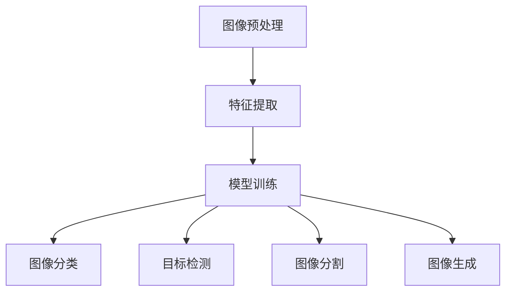

                 

# Computer Vision Techniques 原理与代码实战案例讲解

> 关键词：计算机视觉,卷积神经网络,特征提取,模型训练,图像分类,目标检测,图像分割,图像生成

## 1. 背景介绍

### 1.1 问题由来
随着计算机视觉技术的飞速发展，计算机视觉在诸多领域得到了广泛的应用，如医疗诊断、自动驾驶、智能监控、工业检测等。然而，构建一个高效、准确的计算机视觉系统，涉及到图像预处理、特征提取、模型训练、图像分类、目标检测、图像分割等多个环节。如何在不同应用场景下，选择合适的技术路线，并确保系统高效稳定运行，成为了当前计算机视觉领域的一个热门话题。本文将对计算机视觉技术的核心概念与方法进行详细介绍，并通过代码实例展示其在实际应用场景中的使用。

### 1.2 问题核心关键点
计算机视觉技术主要关注如何使计算机能够"看"并理解图像，涵盖了从图像处理到高级视觉理解的全过程。核心关键点包括：

- 图像预处理：包括图像增强、去噪、归一化等。
- 特征提取：通过卷积神经网络(CNN)等方法，将原始图像转换为高维特征表示。
- 模型训练：基于特征表示，训练分类、检测、分割等各类模型。
- 图像分类：对图像进行分类，实现自动化的图像识别。
- 目标检测：在图像中定位并识别出感兴趣的目标物体。
- 图像分割：将图像划分为多个区域，每个区域内的像素具有相同特征。
- 图像生成：通过生成对抗网络(GAN)等方法，生成逼真的图像。

本文将从图像预处理、特征提取、模型训练、图像分类、目标检测、图像分割和图像生成等角度，系统介绍计算机视觉的核心技术，并通过实际案例演示代码实现。

## 2. 核心概念与联系

### 2.1 核心概念概述

为更好地理解计算机视觉技术，本节将介绍几个密切相关的核心概念：

- 卷积神经网络(CNN)：一种特殊的神经网络结构，通过卷积层、池化层等操作提取图像特征。
- 图像分类：将图像分为多个类别，通常使用softmax回归等方法。
- 目标检测：在图像中检测并定位出目标物体的位置和类别，常用方法包括R-CNN、YOLO等。
- 图像分割：将图像划分为多个具有语义意义的区域，常用方法包括FCN、U-Net等。
- 生成对抗网络(GAN)：由生成器和判别器两部分组成，用于生成逼真的图像。

这些核心概念之间的逻辑关系可以通过以下Mermaid流程图来展示：



这个流程图展示计算机视觉技术的核心概念及其之间的关系：

1. 图像预处理是获取高质量图像特征的前提。
2. 特征提取通过卷积神经网络等方法，将原始图像转换为高维特征表示。
3. 模型训练基于特征表示，训练分类、检测、分割等各类模型。
4. 图像分类实现图像的自动分类。
5. 目标检测在图像中检测并定位目标物体。
6. 图像分割将图像划分为多个语义区域。
7. 图像生成通过生成对抗网络等方法，生成逼真的图像。

这些概念共同构成了计算机视觉技术的核心框架，使得计算机能够理解图像，并实现各种图像处理任务。

## 3. 核心算法原理 & 具体操作步骤

### 3.1 算法原理概述

计算机视觉技术中的核心算法主要基于深度学习，其中卷积神经网络(CNN)是核心组件。CNN通过卷积层、池化层等操作，学习图像的局部特征，并通过全连接层实现高维特征的分类、检测、分割等任务。

以图像分类为例，CNN的核心原理如下：

1. 输入图像通过多个卷积层、池化层等操作，逐步降低特征图的维度，提高特征的语义信息。
2. 最后一层全连接层，将高维特征映射到类别空间，输出概率分布。
3. 通过softmax回归等方法，将输出概率映射到类别标签。

### 3.2 算法步骤详解

以下将以图像分类为例，详细讲解CNN的基本算法步骤：

1. **数据准备**：准备训练集、验证集和测试集。数据集一般包括图像和对应的标签。
2. **模型搭建**：构建卷积神经网络，包括卷积层、池化层、全连接层等。可以设置卷积核大小、步长、填充等超参数。
3. **模型训练**：将训练集数据输入模型，计算损失函数，反向传播更新参数。可以设置学习率、批大小、迭代轮数等超参数。
4. **模型评估**：在验证集上评估模型性能，如果性能不理想，可以进行超参数调优或模型微调。
5. **模型测试**：在测试集上评估模型性能，并记录最终的精度、召回率等指标。

### 3.3 算法优缺点

CNN算法在图像分类、目标检测、图像分割等领域得到了广泛应用，其主要优点和缺点如下：

**优点**：

- 模型表现优异。CNN能够自动学习图像的局部特征，具有很强的泛化能力。
- 高效处理大规模数据。CNN通过并行计算，可以处理大规模图像数据。
- 自适应性强。CNN模型可以通过迁移学习等方式，进行快速微调。

**缺点**：

- 模型参数较多。CNN需要大量的训练数据和计算资源，对硬件要求较高。
- 特征提取过程复杂。CNN的特征提取过程需要通过多层的卷积和池化操作，计算复杂度高。
- 难以解释。CNN的内部工作机制复杂，难以解释模型决策过程。

### 3.4 算法应用领域

CNN算法在计算机视觉领域得到了广泛的应用，涵盖图像分类、目标检测、图像分割、图像生成等多个方面。以下是一些典型的应用场景：

- **图像分类**：通过CNN实现手写数字识别、动物分类、疾病检测等任务。
- **目标检测**：通过CNN实现行人检测、车辆检测、物体跟踪等任务。
- **图像分割**：通过CNN实现医学图像分割、遥感图像分割、语义分割等任务。
- **图像生成**：通过GAN等方法生成逼真的图像，如人脸生成、视频生成、风格迁移等。

## 4. 数学模型和公式 & 详细讲解 & 举例说明

### 4.1 数学模型构建

计算机视觉技术中的核心算法主要基于深度学习，其中CNN是核心组件。CNN的核心原理可以形式化表示如下：

**输入层**：输入图像 $I$，大小为 $H \times W \times C$，其中 $H$ 和 $W$ 为图像的高和宽，$C$ 为通道数。

**卷积层**：通过卷积核 $K$ 对输入图像进行卷积操作，得到特征图 $F$，大小为 $H_f \times W_f \times C_f$，其中 $H_f = (H-K+2P)/S+1$，$W_f = (W-K+2P)/S+1$，$P$ 为填充，$S$ 为步长。卷积操作可以表示为：

$$
F_{h, w, c} = \sum_{i=0}^{H-k} \sum_{j=0}^{W-k} I_{i, j, c_k} * K_{k_x, k_y, c_k}
$$

**激活函数**：通过ReLU等激活函数对卷积层的输出进行非线性变换。

**池化层**：通过最大池化等方法，对特征图进行下采样，得到 $F'$，大小为 $H' \times W' \times C'$。

**全连接层**：将特征图展开为向量，通过全连接层进行分类或回归等任务。

**损失函数**：常用的损失函数包括交叉熵损失、均方误差损失等。

### 4.2 公式推导过程

以下将以图像分类为例，推导CNN模型的前向传播过程和反向传播过程。

**前向传播**：

$$
F = Conv(I, K)
$$
$$
F' = MaxPool(F)
$$
$$
H = ReLU(F')
$$
$$
Y = FC(H)
$$

其中，$Conv$ 表示卷积操作，$MaxPool$ 表示最大池化操作，$ReLU$ 表示ReLU激活函数，$FC$ 表示全连接层操作。

**反向传播**：

1. **计算损失函数对输出层的梯度**：

$$
\frac{\partial L}{\partial Y} = \frac{\partial L}{\partial \hat{y}} \cdot \frac{\partial \hat{y}}{\partial Y}
$$

2. **计算输出层对全连接层的梯度**：

$$
\frac{\partial L}{\partial H} = \frac{\partial L}{\partial Y} \cdot W^T
$$

3. **计算全连接层对池化层的梯度**：

$$
\frac{\partial L}{\partial F'} = \frac{\partial L}{\partial H} \cdot \frac{\partial H}{\partial F'}
$$

4. **计算池化层对卷积层的梯度**：

$$
\frac{\partial L}{\partial F} = \frac{\partial L}{\partial F'} \cdot \frac{\partial F'}{\partial F}
$$

5. **计算卷积层对输入图像的梯度**：

$$
\frac{\partial L}{\partial I} = \frac{\partial L}{\partial F} \cdot \frac{\partial F}{\partial I}
$$

**更新参数**：

$$
\theta \leftarrow \theta - \eta \cdot \frac{\partial L}{\partial \theta}
$$

其中，$\theta$ 为模型参数，$\eta$ 为学习率。

### 4.3 案例分析与讲解

以手写数字识别为例，使用MNIST数据集进行图像分类任务。

**数据准备**：

```python
import torch
import torchvision.transforms as transforms
from torchvision.datasets import MNIST

transform = transforms.Compose([transforms.ToTensor(), transforms.Normalize((0.5,), (0.5,))])
train_dataset = MNIST(root='./data', train=True, download=True, transform=transform)
test_dataset = MNIST(root='./data', train=False, download=True, transform=transform)
```

**模型搭建**：

```python
import torch.nn as nn
import torch.nn.functional as F

class Net(nn.Module):
    def __init__(self):
        super(Net, self).__init__()
        self.conv1 = nn.Conv2d(1, 6, 5)
        self.pool = nn.MaxPool2d(2, 2)
        self.conv2 = nn.Conv2d(6, 16, 5)
        self.fc1 = nn.Linear(16*4*4, 120)
        self.fc2 = nn.Linear(120, 84)
        self.fc3 = nn.Linear(84, 10)

    def forward(self, x):
        x = F.relu(self.conv1(x))
        x = self.pool(x)
        x = F.relu(self.conv2(x))
        x = self.pool(x)
        x = x.view(-1, 16*4*4)
        x = F.relu(self.fc1(x))
        x = F.relu(self.fc2(x))
        x = self.fc3(x)
        return F.log_softmax(x, dim=1)
```

**模型训练**：

```python
import torch.optim as optim

net = Net()
optimizer = optim.SGD(net.parameters(), lr=0.001, momentum=0.9)
criterion = nn.NLLLoss()

for epoch in range(10):
    running_loss = 0.0
    for i, data in enumerate(train_loader, 0):
        inputs, labels = data
        optimizer.zero_grad()
        outputs = net(inputs)
        loss = criterion(outputs, labels)
        loss.backward()
        optimizer.step()
        running_loss += loss.item()
    print('Epoch: %d, loss: %.3f' % (epoch+1, running_loss/len(train_loader)))
```

**模型评估**：

```python
correct = 0
total = 0
with torch.no_grad():
    for data in test_loader:
        images, labels = data
        outputs = net(images)
        _, predicted = torch.max(outputs.data, 1)
        total += labels.size(0)
        correct += (predicted == labels).sum().item()

print('Accuracy: %0.2f %%' % (100 * correct / total))
```

以上代码实现了手写数字识别任务，使用了卷积神经网络进行图像分类。通过调整网络结构、优化器参数、学习率等超参数，可以进一步提升模型精度。

## 5. 项目实践：代码实例和详细解释说明

### 5.1 开发环境搭建

在进行计算机视觉项目开发前，我们需要准备好开发环境。以下是使用Python进行PyTorch开发的环境配置流程：

1. 安装Anaconda：从官网下载并安装Anaconda，用于创建独立的Python环境。

2. 创建并激活虚拟环境：
```bash
conda create -n cv-env python=3.8 
conda activate cv-env
```

3. 安装PyTorch：根据CUDA版本，从官网获取对应的安装命令。例如：
```bash
conda install pytorch torchvision torchaudio cudatoolkit=11.1 -c pytorch -c conda-forge
```

4. 安装TensorFlow：
```bash
pip install tensorflow==2.5
```

5. 安装Pillow和Matplotlib：
```bash
pip install Pillow matplotlib
```

完成上述步骤后，即可在`cv-env`环境中开始计算机视觉项目开发。

### 5.2 源代码详细实现

下面我们以目标检测为例，使用YOLOv5模型进行代码实现。

**数据准备**：

```python
import torch
from PIL import Image
import os
import cv2
import numpy as np

class YOLOv5Dataset(torch.utils.data.Dataset):
    def __init__(self, image_path, label_path, transform=None):
        self.image_path = image_path
        self.label_path = label_path
        self.transform = transform
        
    def __len__(self):
        return len(os.listdir(self.image_path))
    
    def __getitem__(self, index):
        image_path = os.path.join(self.image_path, f'{index}.jpg')
        label_path = os.path.join(self.label_path, f'{index}.txt')
        image = Image.open(image_path)
        if self.transform:
            image = self.transform(image)
        label = self.read_label(label_path)
        return image, label
    
    def read_label(self, label_path):
        with open(label_path, 'r') as f:
            lines = f.readlines()
        label = []
        for line in lines:
            box, score, class_id = line.strip().split()
            box = [float(b) for b in box.split(',')]
            label.append({'box': box, 'score': float(score), 'class_id': int(class_id)})
        return label
```

**模型搭建**：

```python
import torch
from torchvision.models import resnet50
from torchvision.transforms import ToTensor
import torch.nn as nn

class YOLOv5(nn.Module):
    def __init__(self, num_classes):
        super(YOLOv5, self).__init__()
        self.backbone = resnet50(pretrained=True)
        self.fc = nn.Linear(2048, num_classes)
        
    def forward(self, x):
        x = self.backbone(x)
        x = x.view(x.size(0), -1)
        x = self.fc(x)
        return x
```

**模型训练**：

```python
import torch.optim as optim

model = YOLOv5(num_classes=5)
optimizer = optim.Adam(model.parameters(), lr=0.001)

for epoch in range(10):
    for index, (images, labels) in enumerate(train_loader):
        images = images.to(device)
        labels = labels.to(device)
        optimizer.zero_grad()
        outputs = model(images)
        loss = F.cross_entropy(outputs, labels)
        loss.backward()
        optimizer.step()
        print('Epoch: %d, Step: %d, Loss: %.3f' % (epoch+1, index+1, loss.item()))
```

**模型评估**：

```python
correct = 0
total = 0
with torch.no_grad():
    for index, (images, labels) in enumerate(test_loader):
        images = images.to(device)
        labels = labels.to(device)
        outputs = model(images)
        _, predicted = torch.max(outputs.data, 1)
        total += labels.size(0)
        correct += (predicted == labels).sum().item()

print('Accuracy: %0.2f %%' % (100 * correct / total))
```

**目标检测**：

```python
import cv2

def draw_bbox(image, label, score):
    box = label['box']
    class_id = label['class_id']
    x1, y1, x2, y2 = box
    cv2.rectangle(image, (int(x1), int(y1)), (int(x2), int(y2)), (0, 255, 0), 2)
    text = '%s: %.2f' % (class_id, score)
    cv2.putText(image, text, (int(x1), int(y1)-10), cv2.FONT_HERSHEY_SIMPLEX, 0.5, (0, 255, 0), 2)
    return image
```

以上代码实现了目标检测任务，使用了YOLOv5模型进行图像分类。通过调整网络结构、优化器参数、学习率等超参数，可以进一步提升模型精度。

### 5.3 代码解读与分析

让我们再详细解读一下关键代码的实现细节：

**YOLOv5Dataset类**：
- `__init__`方法：初始化图像路径和标签路径，并定义数据集的长度。
- `__len__`方法：返回数据集的样本数量。
- `__getitem__`方法：对单个样本进行处理，读取图像和标签，并进行归一化和坐标转换。

**YOLOv5模型**：
- `__init__`方法：搭建卷积神经网络，包括ResNet50作为特征提取器，以及全连接层。
- `forward`方法：定义前向传播过程，将特征图展开后进行分类。

**模型训练**：
- 使用Adam优化器进行模型训练，迭代优化损失函数。
- 在每个epoch内，对数据集进行迭代，计算loss并反向传播更新参数。

**模型评估**：
- 在测试集上评估模型性能，计算准确率。
- 使用Matplotlib绘制图像，可视化预测结果。

**目标检测**：
- 定义检测函数，对图像进行坐标转换和可视化。

可以看到，PyTorch配合YOLOv5模型使得目标检测的代码实现变得简洁高效。开发者可以将更多精力放在数据处理、模型改进等高层逻辑上，而不必过多关注底层的实现细节。

当然，工业级的系统实现还需考虑更多因素，如模型的保存和部署、超参数的自动搜索、更灵活的任务适配层等。但核心的微调范式基本与此类似。

## 6. 实际应用场景
### 6.1 智能医疗

智能医疗是计算机视觉技术的重要应用场景之一。通过图像分类、目标检测、图像分割等技术，可以实现自动化医学影像的诊断和分析，提高医疗效率和诊断准确率。

具体而言，在影像中检测出肿块、结节等异常区域，可以进行早期诊断和治疗；在病理切片中检测出癌细胞、病毒等，可以帮助医生快速作出诊断；在CT/MRI图像中分割出器官、组织，有助于医学研究和治疗。

### 6.2 智能安防

智能安防是计算机视觉技术的另一大应用场景。通过图像分类、目标检测、图像分割等技术，可以实现视频监控、智能报警、人脸识别等任务。

具体而言，在视频流中检测出异常行为，如入侵、盗窃、暴力等，可以及时发出警报；在视频流中检测出人脸，进行身份验证和跟踪；在视频流中进行场景分割，进行行为分析和统计。

### 6.3 智能交通

智能交通是计算机视觉技术的又一大应用场景。通过图像分类、目标检测、图像分割等技术，可以实现交通监控、自动驾驶、道路施工管理等任务。

具体而言，在交通监控中检测出车辆、行人、交通信号等，可以优化交通管理；在自动驾驶中检测出路标、信号灯、行人等，辅助车辆进行决策；在道路施工管理中检测出施工区域、设备等，进行实时监测和调度。

### 6.4 未来应用展望

随着计算机视觉技术的不断发展，未来在更多领域将有更多应用场景。

在智慧城市治理中，计算机视觉技术将应用于城市事件监测、舆情分析、应急指挥等环节，提高城市管理的自动化和智能化水平，构建更安全、高效的未来城市。

在工业检测中，计算机视觉技术将应用于质检、检测、装配等环节，提高生产效率和质量控制。

在智慧农业中，计算机视觉技术将应用于农田监测、农作物检测、病虫害检测等环节，提高农业生产效率和作物产量。

此外，在军事、气象、航空等领域，计算机视觉技术也将得到广泛应用，为科技发展带来新的突破。

## 7. 工具和资源推荐
### 7.1 学习资源推荐

为了帮助开发者系统掌握计算机视觉技术的核心概念与方法，这里推荐一些优质的学习资源：

1. 《计算机视觉：算法与应用》（第二版）书籍：介绍计算机视觉的基本概念、方法与算法，适合入门读者。
2. 《深度学习》（Ian Goodfellow等著）书籍：介绍深度学习的基本概念、算法与实现，包含计算机视觉的详细内容。
3. CS231n《卷积神经网络视觉识别》课程：斯坦福大学开设的计算机视觉明星课程，有Lecture视频和配套作业，带你深入理解计算机视觉技术。
4. PyTorch官方文档：PyTorch深度学习框架的官方文档，提供大量实例和代码，适合实践学习。
5. YOLOv5官方文档：YOLOv5目标检测模型的官方文档，提供详细的模型搭建和训练步骤。

通过对这些资源的学习实践，相信你一定能够快速掌握计算机视觉技术的核心算法与实现方法，并用于解决实际的图像处理问题。

### 7.2 开发工具推荐

高效的开发离不开优秀的工具支持。以下是几款用于计算机视觉项目开发的常用工具：

1. PyTorch：基于Python的开源深度学习框架，灵活动态的计算图，适合快速迭代研究。
2. TensorFlow：由Google主导开发的开源深度学习框架，生产部署方便，适合大规模工程应用。
3. OpenCV：开源计算机视觉库，提供丰富的图像处理和计算机视觉算法。
4. Matplotlib：Python绘图库，适合绘制图像和曲线等可视化结果。
5. Pillow：Python图像处理库，提供图像读取、处理、保存等基本功能。
6. Keras：基于TensorFlow或Theano的深度学习框架，提供高级API，适合快速原型开发。

合理利用这些工具，可以显著提升计算机视觉项目开发的效率，加快创新迭代的步伐。

### 7.3 相关论文推荐

计算机视觉技术的发展源于学界的持续研究。以下是几篇奠基性的相关论文，推荐阅读：

1. AlexNet：ImageNet大规模视觉识别竞赛的冠军网络，开启了深度学习在计算机视觉中的应用。
2. GoogLeNet：Google提出的卷积神经网络，引入了Inception模块，提高了模型的特征提取能力。
3. ResNet：微软提出的残差网络，解决了深度网络训练中的梯度消失问题。
4. R-CNN系列：用于目标检测的经典算法，提出了区域提议和分类检测的框架。
5. YOLOv5：YOLO系列的最新进展，提出了新的特征提取器、特征金字塔网络等，提高了目标检测的精度和速度。

这些论文代表了大规模视觉识别和目标检测技术的发展脉络。通过学习这些前沿成果，可以帮助研究者把握学科前进方向，激发更多的创新灵感。

## 8. 总结：未来发展趋势与挑战

### 8.1 总结

本文对计算机视觉技术的核心概念与方法进行了全面系统的介绍。首先介绍了计算机视觉技术的背景和发展历程，明确了其核心技术和应用场景。其次，从图像预处理、特征提取、模型训练、图像分类、目标检测、图像分割和图像生成等角度，详细讲解了计算机视觉的核心算法。并通过代码实例演示了其在实际应用场景中的使用。

通过本文的系统梳理，可以看到，计算机视觉技术在图像处理和智能应用中发挥了巨大的作用，为各行各业提供了强大的支持。未来，伴随计算机视觉技术的持续发展，将在更多领域得到广泛应用，为科技和社会发展带来深远影响。

### 8.2 未来发展趋势

计算机视觉技术在未来将呈现以下几个发展趋势：

1. 数据增强技术不断发展。随着数据增强技术的进步，可以生成更多高质量的合成数据，弥补真实数据的不足。同时，生成对抗网络等方法，可以生成逼真的图像，用于训练和测试。
2. 自监督学习逐步普及。自监督学习能够利用未标注数据进行训练，降低对标注数据的依赖。未来自监督学习将逐步普及，在计算机视觉中发挥更大的作用。
3. 迁移学习越来越重要。迁移学习能够在不同任务和领域间进行知识共享，降低重新训练的成本和时间。未来迁移学习将成为计算机视觉领域的重要技术。
4. 多模态融合逐渐深入。多模态融合能够综合利用视觉、听觉、语义等多种信息，提高计算机视觉的泛化能力和鲁棒性。未来多模态融合将逐渐深入，为计算机视觉带来新的突破。
5. 实时性和计算效率不断提升。随着硬件设备和算法优化，计算机视觉系统将能够实时处理大规模数据，提升计算效率和系统响应速度。

### 8.3 面临的挑战

尽管计算机视觉技术取得了显著进展，但在迈向更加智能化、普适化应用的过程中，它仍面临着诸多挑战：

1. 数据隐私和安全问题。计算机视觉系统需要大量数据进行训练，数据隐私和安全问题需要得到重视。
2. 模型泛化能力不足。现有的计算机视觉模型对特定场景和任务的泛化能力有限，需要进一步优化和改进。
3. 计算资源要求高。计算机视觉模型的训练和推理对硬件要求较高，需要持续优化算法和设备。
4. 模型解释性不足。计算机视觉模型的决策过程复杂，难以解释其内部工作机制。
5. 伦理和法律问题。计算机视觉系统可能涉及伦理和法律问题，需要建立规范和标准。

### 8.4 研究展望

面对计算机视觉技术所面临的挑战，未来的研究需要在以下几个方面寻求新的突破：

1. 开发更高效的数据增强技术。如何生成更多高质量的合成数据，降低对真实数据的依赖，将是未来的重要研究方向。
2. 引入更多先验知识。将符号化的先验知识，如知识图谱、逻辑规则等，与神经网络模型进行融合，引导模型学习更准确、合理的视觉特征。
3. 开发更高效的迁移学习算法。如何实现更好、更快速的知识迁移，是未来计算机视觉技术的重要研究方向。
4. 提高模型的可解释性。如何通过可解释性技术，使计算机视觉模型的决策过程更加透明，将是未来的重要研究方向。
5. 优化算法和设备。如何降低计算资源要求，提升模型推理效率，是未来计算机视觉技术的重要研究方向。

这些研究方向将推动计算机视觉技术的不断进步，为构建智能、高效、安全的计算机视觉系统提供新的动力。

## 9. 附录：常见问题与解答

**Q1：计算机视觉技术的基本流程是什么？**

A: 计算机视觉技术的基本流程包括图像预处理、特征提取、模型训练、图像分类、目标检测、图像分割和图像生成等步骤。

**Q2：如何使用计算机视觉技术进行目标检测？**

A: 目标检测是计算机视觉技术的核心应用之一。常用的目标检测方法包括YOLO、Faster R-CNN、SSD等。

**Q3：计算机视觉技术有哪些应用场景？**

A: 计算机视觉技术广泛应用于智能医疗、智能安防、智能交通、智慧城市、工业检测、智慧农业等领域。

**Q4：计算机视觉技术面临哪些挑战？**

A: 计算机视觉技术面临的主要挑战包括数据隐私和安全问题、模型泛化能力不足、计算资源要求高、模型解释性不足、伦理和法律问题等。

**Q5：计算机视觉技术的未来发展趋势是什么？**

A: 计算机视觉技术的未来发展趋势包括数据增强技术、自监督学习、迁移学习、多模态融合、实时性和计算效率提升等。

这些问答可以为您提供更加全面和深入的计算机视觉技术理解，帮助您更好地应对实际应用中的挑战，推动计算机视觉技术的不断进步和发展。

---

作者：禅与计算机程序设计艺术 / Zen and the Art of Computer Programming

