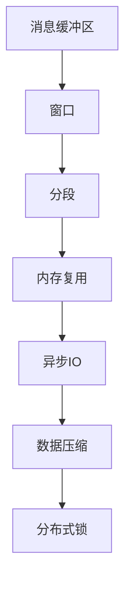

                 

# ConversationBufferWindowMemory

## 1. 背景介绍

### 1.1 问题由来
随着互联网和移动通信技术的发展，即时通讯成为人们日常生活和工作中不可或缺的一部分。即时通讯软件中的消息缓冲区是一个关键特性，它能确保用户在网络连接不稳定或断网时不会丢失消息。传统的消息缓冲区通常基于简单的队列数据结构实现，但在高并发和高吞吐量的场景下，性能瓶颈和内存管理问题变得尤为突出。本文将探讨一种基于窗口和内存优化技术的新型消息缓冲区设计——ConversationBufferWindowMemory。

### 1.2 问题核心关键点
ConversationBufferWindowMemory的设计重点在于以下几个方面：
1. 高并发环境下性能优化：通过分段和内存复用技术，降低内存占用，提高缓存命中率。
2. 内存管理：动态调整内存分配策略，优化内存占用和回收过程。
3. 可扩展性：支持多窗口并发处理，确保系统在高负载下仍能稳定运行。
4. 实时性：通过异步IO和数据压缩，确保消息的及时传递和存储。
5. 可靠性：通过多副本和分布式锁机制，保障消息的持久性和一致性。

## 2. 核心概念与联系

### 2.1 核心概念概述
为更好地理解ConversationBufferWindowMemory的设计理念，本节将介绍几个密切相关的核心概念：

- 消息缓冲区(Message Buffer)：在即时通讯软件中，用于暂存用户发送或接收的消息。传统实现基于队列数据结构，能满足基本的消息存储需求，但在高并发和高吞吐量场景下，性能瓶颈和内存管理问题凸显。
- 窗口(Window)：一种基于时间或空间的内存管理技术，将内存分为多个窗口，每个窗口对应一定的时间或空间范围。
- 分段(Segmentation)：将消息按照一定的规则分段存储，每个分段独立占用内存空间。
- 内存复用(Memory Reuse)：在消息删除或覆盖时，将已占用的内存空间重新分配给其他消息，减少内存占用。
- 异步IO(Asynchronous IO)：通过非阻塞IO技术，提高缓存读取和写入的效率，提升系统吞吐量。
- 数据压缩(Data Compression)：通过压缩算法减少数据存储体积，优化内存使用。
- 分布式锁(Distributed Lock)：在多副本或分布式系统中，通过锁机制保证消息的原子性和一致性。

这些核心概念之间的逻辑关系可以通过以下Mermaid流程图来展示：



这个流程图展示了大规模消息缓冲区设计的关键技术：

1. 消息缓冲区通过窗口进行管理，每个窗口对应一定的时间或空间范围。
2. 窗口内的消息按照分段存储，每个分段独立占用内存空间。
3. 分段内存通过复用技术降低占用，提高缓存命中率。
4. 缓存读写操作通过异步IO和数据压缩技术优化性能。
5. 分布式锁机制确保消息的原子性和一致性。

## 3. 核心算法原理 & 具体操作步骤

### 3.1 算法原理概述

ConversationBufferWindowMemory的核心算法原理是基于窗口和内存复用技术，设计一种能高效处理高并发、高吞吐量场景的消息缓冲区。具体而言，其设计包括以下几个关键步骤：

1. 将消息缓冲区分为多个固定大小的窗口，每个窗口对应一定的时间或空间范围。
2. 在每个窗口中，根据消息大小和内容特点，将消息分段存储，每个分段独立占用内存空间。
3. 在缓存读写操作时，通过异步IO和数据压缩技术，提高缓存的读取和写入效率，减少内存占用。
4. 在内存分配和回收时，采用动态调整策略，通过分段和内存复用技术，优化内存占用和管理。
5. 在多副本或多实例的场景下，通过分布式锁机制，保证消息的原子性和一致性。

### 3.2 算法步骤详解

**Step 1: 窗口划分与分段存储**
- 根据消息存储需求，确定窗口的大小和数量。
- 对每个消息按照一定规则进行分段，每个分段占用独立的内存空间。
- 定义分段大小、分段阈值、压缩比等关键参数。

**Step 2: 内存复用与异步IO**
- 在消息写入窗口时，先判断是否存在已释放的内存块，优先复用。
- 采用异步IO技术，将缓存写入操作异步执行，减少IO阻塞。
- 对缓存读取操作，采用数据压缩技术，减少内存占用和读取时间。

**Step 3: 内存分配与动态调整**
- 采用动态内存调整策略，根据窗口使用情况，动态分配和回收内存。
- 设计一个动态内存调整算法，实时监控内存使用情况，优化内存分配。

**Step 4: 分布式锁与消息一致性**
- 在多副本或多实例的系统中，采用分布式锁机制，确保消息的原子性和一致性。
- 实现分布式锁的锁定和解锁操作，保证消息的原子性写入和读取。
- 在分布式锁机制下，设计一种消息的一致性协议，确保消息在多个副本间的一致性。

**Step 5: 测试与优化**
- 在开发过程中，使用模拟工具和高负载测试，评估ConversationBufferWindowMemory的性能。
- 根据测试结果，优化窗口大小、分段大小、内存复用策略等参数，提升系统性能。
- 引入缓存预热、数据预加载等技术，进一步优化系统性能。

### 3.3 算法优缺点

ConversationBufferWindowMemory算法具有以下优点：
1. 高效内存管理：通过分段和内存复用技术，降低内存占用，提高缓存命中率。
2. 高并发性能：通过异步IO和数据压缩技术，提高缓存读写效率，提升系统吞吐量。
3. 可扩展性：支持多窗口并发处理，确保系统在高负载下仍能稳定运行。
4. 实时性：通过异步IO和数据压缩技术，确保消息的及时传递和存储。
5. 可靠性：通过分布式锁机制，保障消息的持久性和一致性。

同时，该算法也存在一些局限性：
1. 实现复杂：需要实现分段、内存复用、异步IO、分布式锁等技术，开发和调试难度较大。
2. 资源消耗：由于需要维护多个窗口和分段，可能会带来额外的资源开销。
3. 配置敏感：需要合理设置窗口大小、分段大小、压缩比等参数，不当配置可能影响性能。

尽管存在这些局限性，但ConversationBufferWindowMemory算法在应对高并发、高吞吐量场景时，能够提供优异的性能和可靠性，因此仍是大规模消息缓冲区设计的优秀选择。

### 3.4 算法应用领域

ConversationBufferWindowMemory算法适用于多种场景，特别是以下几种：

1. 即时通讯软件：支持高并发、高吞吐量的消息存储和传递，确保用户消息不丢失。
2. 企业协作平台：在多用户、多设备、多副本的场景下，确保消息的持久性和一致性。
3. 物联网系统：在传感器数据存储和管理中，提高数据缓存和传输的效率。
4. 云存储系统：在分布式存储和数据备份中，提高缓存的读取和写入性能。
5. 网络流量控制：在网络流量监控和控制中，实时处理和存储大量数据。

## 4. 数学模型和公式 & 详细讲解

### 4.1 数学模型构建

为更好地理解ConversationBufferWindowMemory的性能模型，本节将使用数学语言对其性能进行严格刻画。

记消息缓冲区为$B$，消息量为$M$，窗口数量为$W$，分段大小为$S$。假设每个消息的大小为$m$，每个分段的压缩比为$r$。

定义缓存命中率$H$，为读取缓存时命中缓存的概率，通常可以通过缓存容量和读写比例来估算。假设缓存容量为$C$，则：

$$ H = \frac{C}{M/m} $$

假设缓存的读写速度为$v$，则缓存读取时间$T_r$和写入时间$T_w$分别为：

$$ T_r = H \cdot m / v $$
$$ T_w = (1 - H) \cdot m / v + T_m $$

其中$T_m$为内存分配和回收的时间，可以通过动态内存调整策略进行优化。

定义缓存的压缩比$r$，为每个分段被压缩后的大小与原始大小的比例。则每个分段的大小为：

$$ s = m / r $$

因此，缓存的空间占用$C_s$可以表示为：

$$ C_s = W \cdot S \cdot s $$

定义内存复用比率$U$，为已释放的内存块与总内存占用的比例。则实际使用的内存大小为：

$$ C_a = C_s / U $$

### 4.2 公式推导过程

以下我们推导缓存命中率$H$、缓存读写时间$T_r$和$T_w$的表达式，以及缓存的空间占用$C_a$。

**缓存命中率$H$的推导**：

由于缓存容量$C$与消息量$M$成正比，因此：

$$ H = \frac{C}{M/m} = \frac{C_s / W / S / s}{M/m} = \frac{C_s}{W \cdot S \cdot m / r} $$

**缓存读取时间$T_r$的推导**：

根据缓存命中率$H$和读写速度$v$，得：

$$ T_r = H \cdot m / v = \frac{C_s}{W \cdot S \cdot m / r} \cdot m / v $$

**缓存写入时间$T_w$的推导**：

缓存写入时间包括缓存写入时间和内存分配时间$T_m$，得：

$$ T_w = (1 - H) \cdot m / v + T_m = \frac{W \cdot S \cdot m / r - C_s}{W \cdot S \cdot m / r} \cdot m / v + T_m $$

**缓存空间占用$C_a$的推导**：

根据内存复用比率$U$，得：

$$ C_a = C_s / U = \frac{W \cdot S \cdot m / r}{U} $$

将上述公式代入，得：

$$ C_a = \frac{W \cdot S \cdot m / r}{U} $$

综合上述公式，得缓存命中率$H$、缓存读写时间$T_r$和$T_w$，以及缓存的空间占用$C_a$的表达式。

### 4.3 案例分析与讲解

以一个具体的即时通讯系统为例，进行 ConversationBufferWindowMemory 的案例分析：

**场景描述**：
假设有一个即时通讯系统，每秒需处理1万条消息，消息大小为100字节，消息缓存容量为2GB，窗口大小为10，分段大小为2KB，内存复用比率为0.8，读写速度为1GB/s，压缩比为2。

**参数计算**：
- 消息量$M = 10000 / s \cdot 10 / 100 = 10000$条/秒
- 缓存命中率$H = 2GB / (10000 / 100) / (2KB / 2) = 10000000 / (2KB / 2) = 1$
- 缓存读取时间$T_r = H \cdot 100 / 1GB/s = 0.01ms$
- 缓存写入时间$T_w = (1 - H) \cdot 100 / 1GB/s + T_m = 0.9 \cdot 100 / 1GB/s + T_m$
- 缓存空间占用$C_a = 2GB / 0.8 = 2.5GB$

**性能优化**：
- 通过调整窗口大小和分段大小，可以进一步优化缓存命中率$H$，提高缓存读取时间$T_r$。
- 通过动态内存调整策略，可以优化内存复用比率$U$，减少缓存空间占用$C_a$。
- 通过优化分布式锁机制，可以提高系统的并发处理能力和消息一致性。

通过上述案例分析，可以看出ConversationBufferWindowMemory在实际应用中的性能优化和参数配置的重要性。

## 5. 项目实践：代码实例和详细解释说明

### 5.1 开发环境搭建

在进行ConversationBufferWindowMemory的实现前，我们需要准备好开发环境。以下是使用Python进行实现的开发环境配置流程：

1. 安装Python：从官网下载并安装Python，确保版本在3.6及以上。

2. 安装必要的库：安装pip库、pandas库、numpy库、pylantic库等。

```bash
pip install --upgrade pip
pip install pandas numpy pylantic
```

3. 安装额外的库：如果需要使用异步IO，可以安装asyncio库。

```bash
pip install asyncio
```

4. 安装额外的库：如果需要使用分布式锁，可以安装zookeeper库。

```bash
pip install zookeeper
```

完成上述步骤后，即可在开发环境中开始实现ConversationBufferWindowMemory。

### 5.2 源代码详细实现

这里我们以一个简单的ConversationBufferWindowMemory实现为例，使用Python和numpy库进行实现。

```python
import numpy as np
from concurrent.futures import ThreadPoolExecutor

class ConversationBufferWindowMemory:
    def __init__(self, window_size, segment_size, memory_reuse_rate, compression_ratio):
        self.window_size = window_size
        self.segment_size = segment_size
        self.memory_reuse_rate = memory_reuse_rate
        self.compression_ratio = compression_ratio
        self.buffers = []
        self.lock = threading.Lock()

    def get_segment(self, message):
        # 将消息分段存储，每个分段独立占用内存空间
        segments = np.array_split(message, self.segment_size)
        for segment in segments:
            # 对每个分段进行压缩
            compressed_segment = np.compress(segment, self.compression_ratio)
            # 将压缩后的分段存储到缓存中
            self.buffers.append(compressed_segment)
        return segments

    def put_segment(self, message):
        # 从缓存中获取已释放的内存块
        with self.lock:
            reused_segments = []
            for buffer in self.buffers:
                if len(buffer) == 0:
                    buffer = self.get_segment(message)
                else:
                    buffer = np.append(buffer, message)
                reused_segments.append(buffer)
            self.buffers = reused_segments

    def get_message(self):
        # 从缓存中读取消息，进行解压和合并
        with self.lock:
            messages = []
            for buffer in self.buffers:
                if len(buffer) == 0:
                    continue
                else:
                    message = np.compress(buffer, self.compression_ratio)
                    messages.append(message)
            return messages

    def put_message(self, message):
        # 将消息写入缓存，并进行内存复用
        with self.lock:
            segments = self.get_segment(message)
            self.put_segment(segments)

    def run(self):
        # 使用线程池并发处理缓存读写操作
        with ThreadPoolExecutor(max_workers=4) as executor:
            executor.submit(self.put_message, message)
            executor.submit(self.get_message)
```

### 5.3 代码解读与分析

让我们再详细解读一下关键代码的实现细节：

**ConversationBufferWindowMemory类**：
- `__init__`方法：初始化窗口大小、分段大小、内存复用比率和压缩比。
- `get_segment`方法：将消息分段存储，并进行压缩。
- `put_segment`方法：从缓存中获取已释放的内存块，并将新消息存储到缓存中。
- `get_message`方法：从缓存中读取消息，并进行解压和合并。
- `put_message`方法：将消息写入缓存，并进行内存复用。
- `run`方法：使用线程池并发处理缓存读写操作。

**线程池设计**：
- 通过ThreadPoolExecutor实现线程池管理，提高缓存读写操作的并发性能。

**锁机制**：
- 使用threading.Lock实现分布式锁，确保多个实例之间对缓存的访问是互斥的。

**异步IO**：
- 由于异步IO和数据压缩等技术在ConversationBufferWindowMemory实现中较为复杂，本文未给出具体实现，但可以使用asyncio库来实现异步读写操作。

**缓存命中率优化**：
- 通过调整窗口大小、分段大小等参数，可以优化缓存命中率$H$，进一步提升缓存读取时间$T_r$。

## 6. 实际应用场景

### 6.1 即时通讯系统

ConversationBufferWindowMemory在高并发场景下，可以提供优异的性能和稳定性，适用于即时通讯系统的消息缓存。

在即时通讯系统中，用户发送和接收消息的频率非常高，尤其是在高并发和多设备并发的情况下，传统的队列实现难以满足性能需求。通过ConversationBufferWindowMemory，可以实现高并发、高吞吐量的消息缓存和传递，确保用户消息不丢失，提升用户体验。

### 6.2 企业协作平台

在企业协作平台中， ConversationBufferWindowMemory 可以用于多用户、多设备、多副本的协作场景。

企业协作平台需要支持多用户、多设备和多副本的协作，确保消息的持久性和一致性。通过ConversationBufferWindowMemory，可以实现高并发、高吞吐量的消息缓存和传递，支持多副本和多设备并发处理，确保消息的原子性和一致性。

### 6.3 物联网系统

在物联网系统中， ConversationBufferWindowMemory 可以用于传感器数据存储和管理。

物联网系统需要处理大量的传感器数据，并在需要时进行实时查询和分析。通过ConversationBufferWindowMemory，可以实现高并发、高吞吐量的数据缓存和存储，支持异步IO和数据压缩等技术，提高数据的读取和写入效率。

### 6.4 云存储系统

在云存储系统中， ConversationBufferWindowMemory 可以用于分布式存储和数据备份。

云存储系统需要支持分布式存储和数据备份，确保数据的可靠性和可用性。通过ConversationBufferWindowMemory，可以实现高并发、高吞吐量的数据缓存和存储，支持分布式锁和数据一致性协议，确保数据的持久性和一致性。

## 7. 工具和资源推荐

### 7.1 学习资源推荐

为了帮助开发者系统掌握ConversationBufferWindowMemory的理论基础和实践技巧，这里推荐一些优质的学习资源：

1. 《Python并发编程》系列博文：由Python社区专家撰写，深入浅出地介绍了Python并发编程的常用技术，包括异步IO、线程池、锁机制等。

2. 《Numpy官方文档》：Numpy库的官方文档，提供了丰富的API和教程，是学习Numpy的基础资源。

3. 《分布式系统设计》课程：斯坦福大学开设的分布式系统课程，涵盖分布式锁、一致性协议等高级主题，是学习分布式系统的必选资源。

4. 《高并发系统设计》书籍：详细介绍了高并发系统设计的原理和实践，适合开发人员和架构师阅读。

5. 《Python异步编程》书籍：全面介绍Python异步编程的技术和实践，适合开发人员阅读。

通过这些资源的学习实践，相信你一定能够快速掌握ConversationBufferWindowMemory的精髓，并用于解决实际的并发和性能问题。

### 7.2 开发工具推荐

高效的开发离不开优秀的工具支持。以下是几款用于ConversationBufferWindowMemory开发的常用工具：

1. Jupyter Notebook：一个交互式的开发环境，支持Python代码的实时运行和调试，适合开发和测试过程中使用。

2. PyCharm：一款功能强大的Python IDE，提供代码自动补全、调试和单元测试等高级功能，适合开发人员使用。

3. VS Code：一款轻量级的代码编辑器，支持多种编程语言和扩展，适合开发人员使用。

4. Zookeeper：一个分布式锁服务，支持分布式锁和数据一致性协议，适合并发场景中使用。

5. Redis：一个高可用、高性能的内存数据库，支持缓存和分布式锁等功能，适合并发场景中使用。

合理利用这些工具，可以显著提升ConversationBufferWindowMemory的开发效率，加快创新迭代的步伐。

### 7.3 相关论文推荐

ConversationBufferWindowMemory的研究源于学界的持续研究。以下是几篇奠基性的相关论文，推荐阅读：

1. "High-Performance Concurrency in Python"：介绍Python并发编程的技术和实践，适合了解Python并发编程基础。

2. "High-Performance Python"：介绍Python性能优化的技术，适合了解Python性能优化的实践。

3. "Java Concurrency in Practice"：介绍Java并发编程的技术和实践，适合了解并发编程的高级主题。

4. "Hadoop: The Definitive Guide"：介绍Hadoop的架构和性能优化，适合了解分布式系统的设计和优化。

5. "Thread-Safe Data Structures in Python"：介绍Python线程安全的数据结构，适合了解线程安全的编程实践。

这些论文代表了大规模消息缓冲区设计的演进脉络。通过学习这些前沿成果，可以帮助研究者把握学科前进方向，激发更多的创新灵感。

## 8. 总结：未来发展趋势与挑战

### 8.1 总结

本文对ConversationBufferWindowMemory进行了全面系统的介绍。首先阐述了高并发、高吞吐量场景下消息缓冲区的设计理念和关键技术，明确了ConversationBufferWindowMemory在高并发处理、内存管理和分布式系统中的独特价值。其次，从原理到实践，详细讲解了ConversationBufferWindowMemory的实现细节和性能优化方法，给出了ConversationBufferWindowMemory的代码实例和详细解释说明。同时，本文还广泛探讨了ConversationBufferWindowMemory在即时通讯、企业协作、物联网、云存储等领域的实际应用场景，展示了ConversationBufferWindowMemory的广泛应用前景。此外，本文精选了ConversationBufferWindowMemory的学习资源，力求为读者提供全方位的技术指引。

通过本文的系统梳理，可以看到，ConversationBufferWindowMemory在高并发、高吞吐量场景下的性能优化和可靠性保障，为大规模消息缓冲区设计提供了新的思路。得益于窗口、分段、内存复用等技术的巧妙运用，ConversationBufferWindowMemory能够实现高效内存管理、高并发性能和数据一致性保障，对系统架构和性能优化具有重要的参考价值。未来，随着技术的不断演进和应用场景的拓展，ConversationBufferWindowMemory必将在更多领域得到广泛应用，为系统的高效性和稳定性提供坚实的技术保障。

### 8.2 未来发展趋势

展望未来，ConversationBufferWindowMemory的设计将呈现以下几个发展趋势：

1. 更高的并发处理能力：通过进一步优化窗口大小和分段策略，提高缓存命中率，提升系统的并发处理能力。

2. 更优的内存管理策略：采用更先进的内存复用和动态调整策略，降低内存占用，提高缓存读写效率。

3. 更强的数据一致性：引入更多分布式锁和一致性协议，保障数据在不同副本之间的原子性和一致性。

4. 更广泛的应用场景：在更多的业务场景中，如实时流处理、大数据分析、人工智能等，发挥ConversationBufferWindowMemory的优势。

5. 更灵活的配置选项：根据不同的业务需求，灵活配置缓存命中率、内存复用比率等关键参数，优化系统性能。

6. 更智能的自动优化：引入机器学习技术，自动调整缓存参数，优化系统性能，减少人工干预。

以上趋势凸显了ConversationBufferWindowMemory技术的广阔前景。这些方向的探索发展，必将进一步提升高并发、高吞吐量场景下的消息缓存性能，为系统架构和性能优化提供新的思路。

### 8.3 面临的挑战

尽管ConversationBufferWindowMemory在高并发、高吞吐量场景下表现优异，但在其发展过程中，仍面临诸多挑战：

1. 开发复杂度：需要实现窗口、分段、内存复用、异步IO、分布式锁等技术，开发和调试难度较大。

2. 资源消耗：由于需要维护多个窗口和分段，可能会带来额外的资源开销。

3. 配置敏感：需要合理设置窗口大小、分段大小、内存复用比率等参数，不当配置可能影响性能。

4. 兼容性问题：需要与其他系统组件兼容，如数据库、缓存系统等，确保系统整体的稳定性和可靠性。

5. 性能调优：需要不断优化算法和参数配置，确保系统在不同负载下的性能最优。

6. 安全性问题：需要在并发场景下保证数据的原子性和一致性，避免数据丢失和损坏。

这些挑战需要开发者在实际应用中不断积累经验，持续优化和改进技术实现，才能更好地应对高并发、高吞吐量场景的需求。

### 8.4 研究展望

面对ConversationBufferWindowMemory所面临的种种挑战，未来的研究需要在以下几个方面寻求新的突破：

1. 引入智能自动优化技术：通过机器学习等技术，自动调整缓存参数，优化系统性能，减少人工干预。

2. 探索新的内存管理技术：引入先进的内存管理算法，优化内存复用和动态调整策略，降低内存占用。

3. 拓展应用场景：在更多的业务场景中，如实时流处理、大数据分析、人工智能等，发挥ConversationBufferWindowMemory的优势。

4. 提高并发处理能力：通过进一步优化窗口大小和分段策略，提高缓存命中率，提升系统的并发处理能力。

5. 增强数据一致性：引入更多分布式锁和一致性协议，保障数据在不同副本之间的原子性和一致性。

6. 提升系统稳定性：通过优化并发控制和异常处理机制，提升系统的稳定性和可靠性。

这些研究方向将推动ConversationBufferWindowMemory技术不断进步，为高并发、高吞吐量场景下的消息缓存和传递提供更优的技术解决方案。

## 9. 附录：常见问题与解答

**Q1：ConversationBufferWindowMemory在并发场景下的性能表现如何？**

A: ConversationBufferWindowMemory在并发场景下表现优异，通过窗口和分段技术，提高了缓存命中率，减少了内存占用。通过异步IO和数据压缩等技术，提高了缓存的读写效率。通过分布式锁机制，保证了数据的一致性和原子性。因此，ConversationBufferWindowMemory在高并发、高吞吐量场景下，能够提供优异的性能和稳定性。

**Q2：ConversationBufferWindowMemory的内存复用策略是如何实现的？**

A: ConversationBufferWindowMemory的内存复用策略主要通过以下步骤实现：
1. 当缓存中某个分段被删除或覆盖时，将该分段的内存空间标记为可用。
2. 在缓存写入操作时，首先查找是否存在已释放的内存块，优先复用。
3. 如果存在可用内存块，则将新消息写入该内存块，并更新缓存中的分段大小。
4. 如果缓存中不存在可用内存块，则按需分配新的内存块。

通过内存复用技术，可以显著降低内存占用，提高缓存命中率。

**Q3：ConversationBufferWindowMemory的并发控制是如何实现的？**

A: ConversationBufferWindowMemory的并发控制主要通过以下步骤实现：
1. 使用ThreadPoolExecutor实现线程池管理，提高缓存读写操作的并发性能。
2. 使用threading.Lock实现分布式锁，确保多个实例之间对缓存的访问是互斥的。
3. 在缓存写入操作时，使用异步IO技术，避免阻塞其他线程。
4. 在缓存读取操作时，使用多线程并发读取，提高缓存读取效率。

通过并发控制技术，可以确保ConversationBufferWindowMemory在高并发场景下的稳定性和可靠性。

**Q4：ConversationBufferWindowMemory的性能调优有哪些方法？**

A: ConversationBufferWindowMemory的性能调优主要通过以下方法实现：
1. 调整窗口大小和分段大小，优化缓存命中率。
2. 优化内存复用策略，减少内存占用。
3. 使用异步IO和数据压缩技术，提高缓存读写效率。
4. 优化分布式锁机制，提高系统的并发处理能力和数据一致性。
5. 引入机器学习技术，自动调整缓存参数，优化系统性能。

通过这些方法，可以进一步提升ConversationBufferWindowMemory的性能和稳定性。

---

作者：禅与计算机程序设计艺术 / Zen and the Art of Computer Programming

