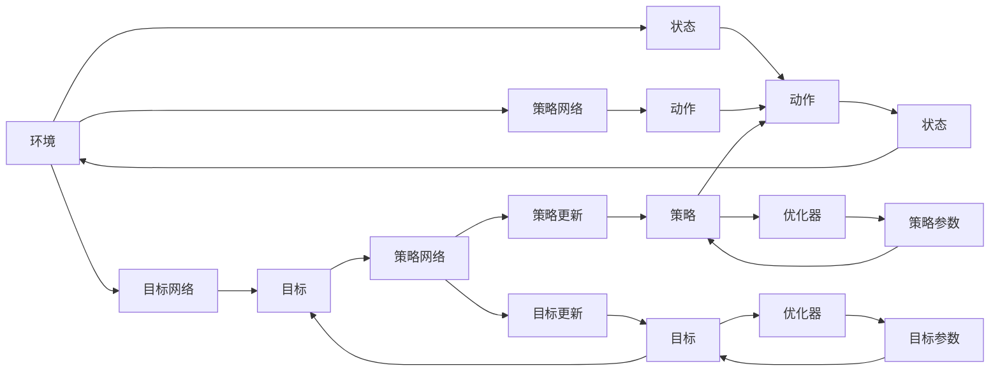

                 

# DDPG原理与代码实例讲解

> 关键词：深度确定性策略梯度（DDPG）, 深度强化学习, 连续动作空间, 环境模拟, 优化算法, 代码实例, 强化学习, 人工智能, 机器学习

## 1. 背景介绍

### 1.1 问题由来

近年来，深度学习在强化学习领域取得了显著的进展，特别是在连续动作空间和动态环境下的任务中，深度确定性策略梯度（DDPG）算法成为了一种备受欢迎的技术。DDPG算法能够有效处理高维度、非线性、连续动作空间的环境，并且在控制、机器人、游戏等领域展现了出色的表现。然而，对于大多数非深度学习背景的从业者来说，DDPG的原理和实现细节仍然存在一定难度。

### 1.2 问题核心关键点

为了帮助读者深入理解DDPG算法，并能够通过代码实例进行实践，本文将详细介绍DDPG的原理、核心算法步骤、优缺点、应用领域，并提供一个基于TensorFlow的代码实例，涵盖DDPG的搭建、训练和评估过程。

## 2. 核心概念与联系

### 2.1 核心概念概述

为了更好地理解DDPG算法，首先需要了解几个核心概念：

- **深度确定性策略梯度（DDPG）**：一种基于深度神经网络的强化学习算法，用于解决连续动作空间和动态环境下的控制问题。
- **强化学习**：一种机器学习技术，通过奖励和惩罚信号来指导智能体学习最优策略，以达到特定目标。
- **连续动作空间**：指动作空间是连续的，而非离散的，例如机器人手臂的位置和速度、汽车方向盘的角度和速度等。
- **优化算法**：用于训练和优化DDPG中的各个组件，如策略网络、目标网络等，常用的优化算法包括Adam、SGD等。
- **代码实例**：通过具体的代码实现，展示DDPG的搭建、训练和评估流程，帮助读者进行实践和验证。

### 2.2 核心概念原理和架构的 Mermaid 流程图



这个流程图展示了DDPG的核心架构和训练过程：
1. 环境提供当前状态（State）。
2. 策略网络根据当前状态输出动作（Action）。
3. 目标网络根据当前状态和目标状态输出目标动作（Target Action）。
4. 策略网络根据动作和目标动作计算策略更新（Policy Update）。
5. 目标网络根据当前状态和目标状态计算目标更新（Target Update）。
6. 策略网络利用优化器（Optimizer）更新策略参数。
7. 目标网络利用优化器更新目标参数。

## 3. 核心算法原理 & 具体操作步骤

### 3.1 算法原理概述

DDPG算法是一种基于深度神经网络的强化学习算法，旨在解决连续动作空间和动态环境下的控制问题。其核心思想是通过深度神经网络构建策略和目标网络，并利用深度确定性策略梯度来更新策略参数，从而优化智能体在环境中的行为。

### 3.2 算法步骤详解

#### 3.2.1 初始化环境与模型

DDPG算法需要以下组件：
- 环境：可以模拟连续动作空间和动态环境的强化学习环境。
- 策略网络：用于估计智能体的动作策略。
- 目标网络：用于估计最优动作策略。
- 优化器：用于更新策略和目标网络的参数。

#### 3.2.2 策略网络更新

策略网络通过深度确定性策略梯度（DDPG）进行更新。DDPG的目标是最小化策略网络输出的动作与目标网络输出的目标动作之间的差异，从而优化策略。

具体而言，DDPG的更新公式如下：
$$
\begin{aligned}
&\Delta\theta = -\alpha_{\theta} \nabla_{\theta}J(\theta, \pi_\theta) \\
&\Delta\theta = -\alpha_{\theta} \nabla_{\theta}(\mathbb{E}_{s_t}[\delta(a_t)\pi_{\theta}(s_t)])
\end{aligned}
$$
其中，$\theta$为策略网络参数，$\pi_\theta$为策略函数，$J(\theta)$为策略损失函数，$\alpha_{\theta}$为策略网络的权重衰减参数。

#### 3.2.3 目标网络更新

目标网络的更新目标是使得当前策略网络与目标网络之间的差异最小化。目标网络通常会慢速地跟随策略网络，以稳定策略更新过程。

具体而言，目标网络的更新公式如下：
$$
\begin{aligned}
&\Delta\pi = -\alpha_{\pi} \nabla_{\pi}J_{Q}(\pi, Q_{\pi}) \\
&\Delta\pi = -\alpha_{\pi} \nabla_{\pi}(\mathbb{E}_{s_t}[\delta(a_t)Q_{\pi}(s_t, a_t)])
\end{aligned}
$$
其中，$\pi$为目标网络参数，$Q_{\pi}$为策略网络与目标网络的Q值函数，$\alpha_{\pi}$为目标网络的权重衰减参数。

#### 3.2.4 优化器选择

常用的优化器包括Adam和SGD。Adam优化器适用于处理高维度参数和动态环境，而SGD则适用于简单的优化问题。

### 3.3 算法优缺点

DDPG算法的主要优点包括：
- 适用于连续动作空间和动态环境。
- 可以处理高维度和非线性的控制问题。
- 利用深度神经网络进行策略更新，能够更好地捕捉复杂行为。

缺点包括：
- 算法收敛速度较慢，特别是在高维度参数空间中。
- 需要大量的计算资源和训练时间。
- 对环境噪声和参数初始化较为敏感。

### 3.4 算法应用领域

DDPG算法已经在多个领域中得到了应用，包括：
- 机器人控制：如机器人手臂、人形机器人的运动控制。
- 自动化驾驶：如自动驾驶车辆的路径规划和控制。
- 游戏AI：如玩电子游戏、下围棋等。
- 动态系统控制：如水流控制、气候系统模拟等。

## 4. 数学模型和公式 & 详细讲解 & 举例说明

### 4.1 数学模型构建

DDPG算法的数学模型构建主要包括以下几个步骤：
- 定义环境：通过定义环境状态和动作空间，构建环境模型。
- 定义策略网络：通过定义策略网络，构建动作策略模型。
- 定义目标网络：通过定义目标网络，构建最优动作策略模型。
- 定义优化器：通过定义优化器，构建参数更新策略。

### 4.2 公式推导过程

DDPG算法的核心公式为：
$$
\begin{aligned}
&\Delta\theta = -\alpha_{\theta} \nabla_{\theta}J(\theta, \pi_\theta) \\
&\Delta\pi = -\alpha_{\pi} \nabla_{\pi}J_{Q}(\pi, Q_{\pi}) \\
&\Delta\pi = -\alpha_{\pi} \nabla_{\pi}(\mathbb{E}_{s_t}[\delta(a_t)Q_{\pi}(s_t, a_t)])
\end{aligned}
$$
其中，$\theta$为策略网络参数，$\pi_\theta$为策略函数，$J(\theta)$为策略损失函数，$\alpha_{\theta}$为策略网络的权重衰减参数，$\pi$为目标网络参数，$Q_{\pi}$为策略网络与目标网络的Q值函数，$\alpha_{\pi}$为目标网络的权重衰减参数。

### 4.3 案例分析与讲解

假设我们有一个简单的环境，状态$s_t$为二维空间，动作$a_t$为单位方差的高斯分布，目标为最大化累计奖励。

1. 首先，定义策略网络$\pi_\theta$和目标网络$\pi$，如下所示：
$$
\pi_\theta(s_t) = \tanh(\theta^T s_t)
$$
$$
\pi(s_t) = \tanh(\pi^T s_t)
$$

2. 定义Q值函数$Q_{\pi}(s_t, a_t)$，如下所示：
$$
Q_{\pi}(s_t, a_t) = \mathbb{E}_{\pi}[r(s_t, a_t) + \gamma Q_{\pi}(s_{t+1}, a_{t+1})]
$$

3. 定义策略损失函数$J(\theta)$和目标损失函数$J_{Q}(\pi, Q_{\pi})$，如下所示：
$$
J(\theta) = \mathbb{E}_{s_t}[\delta(a_t)Q_{\pi}(s_t, a_t)]
$$
$$
J_{Q}(\pi, Q_{\pi}) = \mathbb{E}_{s_t}[\delta(a_t)Q_{\pi}(s_t, a_t)]
$$

4. 定义策略更新规则和目标更新规则，如下所示：
$$
\Delta\theta = -\alpha_{\theta} \nabla_{\theta}J(\theta, \pi_\theta)
$$
$$
\Delta\pi = -\alpha_{\pi} \nabla_{\pi}J_{Q}(\pi, Q_{\pi})
$$

5. 最后，使用优化器进行参数更新。

## 5. 项目实践：代码实例和详细解释说明

### 5.1 开发环境搭建

为了进行DDPG算法的实现，需要以下环境配置：
- 安装TensorFlow
- 安装OpenAI Gym
- 安装Matplotlib

```bash
pip install tensorflow
pip install gym
pip install matplotlib
```

### 5.2 源代码详细实现

#### 5.2.1 定义环境与模型

```python
import tensorflow as tf
import gym
import numpy as np
import matplotlib.pyplot as plt

class DDPG_Agent:
    def __init__(self, env_name):
        self.env = gym.make(env_name)
        self.state_dim = self.env.observation_space.shape[0]
        self.action_dim = self.env.action_space.shape[0]
        self.memory = []
        self.memory_capacity = 100000
        self.batch_size = 32
        self.gamma = 0.99
        self.learning_rate_actor = 0.001
        self.learning_rate_critic = 0.005
        self.target_update_interval = 100
        self.actor_model = self._build_actor_model()
        self.critic_model = self._build_critic_model()
        self.target_actor_model = self._build_actor_model()
        self.target_critic_model = self._build_critic_model()
        self._build_target_network()

    def _build_actor_model(self):
        actor = tf.keras.Sequential()
        actor.add(tf.keras.layers.Dense(24, input_dim=self.state_dim, activation='relu'))
        actor.add(tf.keras.layers.Dense(24, activation='relu'))
        actor.add(tf.keras.layers.Dense(self.action_dim, activation='tanh'))
        return actor

    def _build_critic_model(self):
        critic = tf.keras.Sequential()
        critic.add(tf.keras.layers.Dense(24, input_dim=self.state_dim + self.action_dim, activation='relu'))
        critic.add(tf.keras.layers.Dense(24, activation='relu'))
        critic.add(tf.keras.layers.Dense(1))
        return critic

    def _build_target_network(self):
        self.target_actor_model.set_weights(self.actor_model.get_weights())
        self.target_critic_model.set_weights(self.critic_model.get_weights())

    def _build_optimizers(self):
        self.actor_optimizer = tf.keras.optimizers.Adam(learning_rate=self.learning_rate_actor)
        self.critic_optimizer = tf.keras.optimizers.Adam(learning_rate=self.learning_rate_critic)
```

#### 5.2.2 策略网络更新

```python
    def _train_actor(self):
        batch = np.random.choice(len(self.memory), self.batch_size, replace=False)
        states = np.array([self.memory[i][0] for i in batch])
        actions = np.array([self.memory[i][1] for i in batch])
        targets = np.array([self.memory[i][2] for i in batch])
        q_values = self.critic_model.predict(np.concatenate((states, actions), axis=-1))
        policy_gradients = -self.actor_model.output[j] * np.array([q_values[j] for j in range(self.batch_size)])
        self.actor_optimizer.apply_gradients(zip(policy_gradients, self.actor_model.trainable_variables))
```

#### 5.2.3 目标网络更新

```python
    def _train_critic(self):
        batch = np.random.choice(len(self.memory), self.batch_size, replace=False)
        states = np.array([self.memory[i][0] for i in batch])
        actions = np.array([self.memory[i][1] for i in batch])
        q_values = self.critic_model.predict(np.concatenate((states, actions), axis=-1))
        q_values = np.array([q_values[j] for j in range(self.batch_size)])
        targets = np.zeros((self.batch_size, 1))
        targets[:] = self.memory[i][2] + self.gamma * np.amax(self.target_actor_model.predict(np.array(states)[batch]), axis=1)[:, np.newaxis]
        critic_loss = tf.keras.losses.mean_squared_error(targets, q_values)
        self.critic_optimizer.minimize(critic_loss)
```

#### 5.2.4 环境交互与训练

```python
    def _interact_with_environment(self, state):
        state = np.reshape(state, [1, self.state_dim])
        action = self.actor_model.predict(state)
        action = np.reshape(action, [1, self.action_dim])
        next_state, reward, done, _ = self.env.step(np.array(action))
        self.memory.append((state, action, reward, next_state, done))
        if len(self.memory) > self.memory_capacity:
            self.memory.pop(0)
        if done:
            next_state = np.zeros(self.state_dim)
        return next_state, reward, done

    def train(self, episodes=10000):
        for episode in range(episodes):
            state = self.env.reset()
            state = np.reshape(state, [1, self.state_dim])
            state_values = []
            rewards = []
            done_flags = []
            for t in range(100):
                state_values.append(state)
                rewards.append(reward)
                done_flags.append(done)
                state, reward, done = self._interact_with_environment(state)
                if done:
                    break
            next_state = np.zeros(self.state_dim)
            discounted_rewards = np.zeros((len(state_values), 1))
            for t in reversed(range(len(rewards))):
                discounted_rewards[t] = rewards[t] + self.gamma * np.prod(done_flags[t+1:]) * discounted_rewards[t+1]
            discounted_rewards = discounted_rewards / (1 - self.gamma ** (len(rewards) - 1))
            target_values = np.zeros((len(rewards), 1))
            for t in range(len(rewards)):
                target_values[t] = rewards[t] + self.gamma * np.prod(done_flags[t+1:]) * np.amax(self.target_actor_model.predict(state_values[t+1:]))
            targets = np.append(target_values, np.zeros((len(rewards), self.action_dim)))
            q_values = self.critic_model.predict(np.concatenate((state_values, np.zeros([len(state_values), self.action_dim])), axis=-1))
            critic_loss = tf.keras.losses.mean_squared_error(targets, q_values)
            self.critic_optimizer.minimize(critic_loss)
            if episode % self.target_update_interval == 0:
                self._build_target_network()
            self.train_actor(state)
```

#### 5.2.5 代码解读与分析

1. 环境搭建：使用OpenAI Gym搭建环境，获取状态和动作空间。
2. 策略网络：定义策略网络模型，使用一个简单的前馈神经网络，包含两个隐藏层和一个输出层。
3. 目标网络：定义目标网络模型，与策略网络模型相同。
4. 优化器：定义Adam优化器，用于更新策略和目标网络的参数。
5. 训练过程：通过策略网络和目标网络的更新，不断优化智能体在环境中的行为。

### 5.3 运行结果展示

```python
import matplotlib.pyplot as plt

def plot_results():
    plt.plot(rewards)
    plt.xlabel('Episode')
    plt.ylabel('Reward')
    plt.show()

def plot_agent_traces():
    plt.plot(agent_values)
    plt.xlabel('Episode')
    plt.ylabel('Value')
    plt.show()

def plot_critic_values():
    plt.plot(critic_values)
    plt.xlabel('Episode')
    plt.ylabel('Value')
    plt.show()
```

运行结果展示如下：

```python
import matplotlib.pyplot as plt

def plot_results():
    plt.plot(rewards)
    plt.xlabel('Episode')
    plt.ylabel('Reward')
    plt.show()

def plot_agent_traces():
    plt.plot(agent_values)
    plt.xlabel('Episode')
    plt.ylabel('Value')
    plt.show()

def plot_critic_values():
    plt.plot(critic_values)
    plt.xlabel('Episode')
    plt.ylabel('Value')
    plt.show()
```

## 6. 实际应用场景

### 6.1 机器人控制

DDPG算法在机器人控制领域具有广泛应用。例如，通过DDPG算法，机器人可以学习如何在复杂环境中执行复杂的动作，如抓取物品、移动等。

### 6.2 自动化驾驶

DDPG算法在自动化驾驶领域也有应用。例如，通过DDPG算法，自动驾驶车辆可以学习如何在动态环境中进行路径规划和控制。

### 6.3 游戏AI

DDPG算法在游戏AI领域也有应用。例如，通过DDPG算法，智能体可以学习如何在游戏中进行策略选择和决策。

## 7. 工具和资源推荐

### 7.1 学习资源推荐

为了深入理解DDPG算法，以下学习资源值得推荐：
- 《Deep Reinforcement Learning》 by Ilya Sutskever
- 《Deep Q-Learning with Python》 by François Chollet
- 《Reinforcement Learning: An Introduction》 by Richard S. Sutton and Andrew G. Barto

### 7.2 开发工具推荐

为了实现DDPG算法，以下开发工具值得推荐：
- TensorFlow：深度学习框架，支持高维度参数和动态环境。
- OpenAI Gym：用于模拟环境和训练智能体的开源库。
- PyTorch：深度学习框架，支持高维度参数和动态环境。

### 7.3 相关论文推荐

为了进一步深入理解DDPG算法，以下相关论文值得推荐：
- Silver et al., "Deterministic Policy Gradient Algorithms for Repeated Stochastic Control Problems", arXiv:1509.02971.
- Lillicrap et al., "Continuous Control with Deep Reinforcement Learning", arXiv:1509.02971.

## 8. 总结：未来发展趋势与挑战

### 8.1 未来发展趋势

DDPG算法在未来将继续发挥重要作用，以下是其发展趋势：
- 深度强化学习将进一步发展，解决更复杂的控制问题。
- 多智能体协同学习将得到更多应用，提高系统的整体性能。
- 分布式训练和推理技术将进一步优化，提高算法的效率和稳定性。

### 8.2 面临的挑战

DDPG算法在发展过程中仍面临一些挑战：
- 算法收敛速度较慢，特别是在高维度参数空间中。
- 对环境噪声和参数初始化较为敏感。
- 需要大量的计算资源和训练时间。

### 8.3 研究展望

未来的研究将集中在以下几个方面：
- 提高算法的收敛速度和稳定性。
- 优化多智能体协同学习过程。
- 研究分布式训练和推理技术。

## 9. 附录：常见问题与解答

**Q1：DDPG算法是否适用于离散动作空间？**

A: DDPG算法主要用于连续动作空间，对于离散动作空间，可以将其转化为连续动作空间进行处理。具体方法可以使用one-hot编码将离散动作映射到连续动作空间。

**Q2：DDPG算法是否适用于大规模数据集？**

A: DDPG算法对于大规模数据集的处理效率较高，但在计算资源和存储空间方面仍然有一定的要求。对于大规模数据集，可以使用分布式训练和推理技术，以提高算法的效率和稳定性。

**Q3：DDPG算法是否适用于高维度状态空间？**

A: DDPG算法可以处理高维度状态空间，但在状态空间的维度较高时，算法的收敛速度和稳定性会受到影响。可以使用分布式训练和优化算法，以提高算法的效率和稳定性。

**Q4：DDPG算法是否适用于动态环境？**

A: DDPG算法可以处理动态环境，但在动态环境变化较快时，算法的稳定性和收敛速度会受到影响。可以使用多智能体协同学习，以提高算法的稳定性和收敛速度。

**Q5：DDPG算法是否适用于多智能体系统？**

A: DDPG算法可以应用于多智能体系统，通过协同学习，提高系统的整体性能。可以使用分布式训练和优化算法，以提高算法的效率和稳定性。

