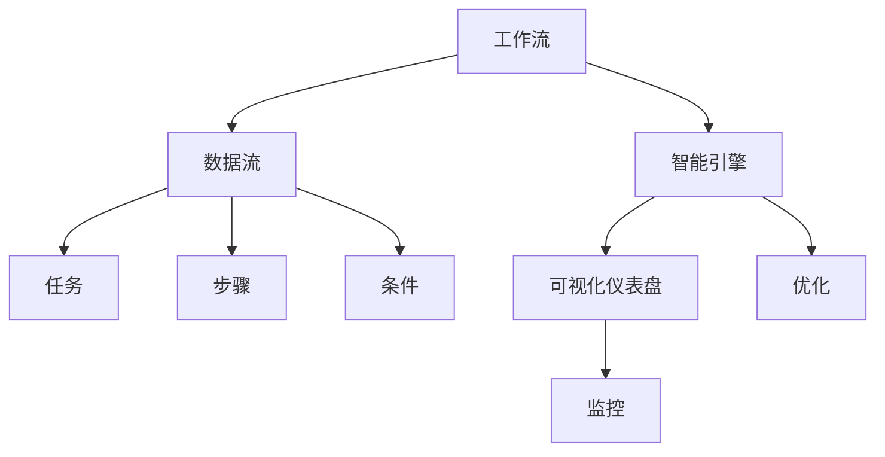

                 

# Dify.AI 的工作流设计

在数字化转型的浪潮中，企业越来越依赖人工智能（AI）和大数据技术来提升业务效率和决策质量。Dify.AI作为一种新兴的AI平台，旨在通过智能工作流管理，帮助企业优化业务流程，实现智能化转型。本文将详细介绍Dify.AI的工作流设计，包括核心概念、算法原理、具体操作步骤、应用场景、学习资源推荐、未来趋势与挑战等内容。

## 1. 背景介绍

### 1.1 问题由来
随着业务数字化程度的加深，企业面临着日益复杂的业务流程和数据处理需求。传统的手工流程管理和繁琐的数据操作不仅耗费大量人力物力，而且效率低下、错误率高。企业需要一种能够自动化、智能化的工作流管理系统，来提升业务流程的效率和精度。Dify.AI正是在这样的背景下应运而生，它通过先进的AI和大数据技术，为企业提供了高效、智能的工作流管理解决方案。

### 1.2 问题核心关键点
Dify.AI的核心关键点在于其智能化、自适应的工作流设计。通过智能识别业务流程中的瓶颈环节，自动调整工作流路径，从而实现业务流程的自动化、优化和高效化。以下是Dify.AI的几个主要特点：

- **自动化**：自动识别的业务流程和数据流，无需人工干预，提高了工作效率。
- **自适应**：根据业务需求和环境变化，自动调整工作流，适应性强。
- **智能化**：利用AI技术优化决策，提升业务流程的精准度。
- **可扩展**：支持企业规模的扩展，无缝集成现有的IT系统。

## 2. 核心概念与联系

### 2.1 核心概念概述
Dify.AI的核心概念包括工作流、数据流、智能引擎、可视化仪表盘等。

- **工作流**：业务流程中各个环节的先后顺序和关联关系，包括任务、步骤、条件等。
- **数据流**：业务流程中数据传递的路径和方式，包括数据的来源、处理和去向。
- **智能引擎**：Dify.AI的核心算法引擎，通过机器学习和自然语言处理技术，自动优化和调整工作流。
- **可视化仪表盘**：实时展示业务流程和数据流的运行状态，便于监控和管理。

### 2.2 核心概念原理和架构的 Mermaid 流程图(Mermaid 流程节点中不要有括号、逗号等特殊字符)



这个流程图展示了Dify.AI的主要流程：工作流和数据流的自动处理和监控，智能引擎的自动优化，以及可视化仪表盘对业务流程的实时展示。

## 3. 核心算法原理 & 具体操作步骤

### 3.1 算法原理概述
Dify.AI的工作流设计基于监督学习和强化学习的混合模型。具体来说，它包括以下几个核心步骤：

1. **数据收集与预处理**：收集业务流程中相关的数据，并进行清洗和预处理。
2. **工作流识别与建模**：利用监督学习模型自动识别业务流程中的各个任务、步骤和条件，建立工作流模型。
3. **智能引擎训练**：通过强化学习算法优化工作流模型，根据业务需求和环境变化自动调整工作流。
4. **实时监控与反馈**：利用可视化仪表盘实时监控业务流程的运行状态，收集反馈数据用于模型迭代优化。

### 3.2 算法步骤详解
以下是Dify.AI工作流设计的详细步骤：

**步骤1：数据收集与预处理**
- 从业务系统中提取数据，包括业务流程描述、数据流图、任务说明等。
- 清洗和预处理数据，去除噪声和错误，标准化数据格式。

**步骤2：工作流识别与建模**
- 使用监督学习算法（如决策树、随机森林等）自动识别业务流程中的各个任务、步骤和条件。
- 构建工作流模型，描述任务、步骤、条件之间的关系。

**步骤3：智能引擎训练**
- 使用强化学习算法（如Q-learning、PPO等）对工作流模型进行优化。
- 根据业务需求和环境变化，自动调整工作流路径和步骤。

**步骤4：实时监控与反馈**
- 利用可视化仪表盘实时展示业务流程的运行状态。
- 收集用户反馈和监控数据，用于模型迭代优化。

### 3.3 算法优缺点
Dify.AI的工作流设计具有以下优点：

- **高效性**：自动化的流程管理，显著提高了工作效率。
- **准确性**：基于机器学习的自动优化，确保了流程的准确性。
- **灵活性**：自适应的工作流设计，适应性强，适用于多种业务场景。

同时，它也存在一些缺点：

- **复杂性**：算法原理和模型构建较为复杂，需要一定的技术门槛。
- **依赖数据**：依赖高质量的数据，数据不准确或不完整会影响模型的效果。

### 3.4 算法应用领域
Dify.AI的工作流设计可以应用于多种业务场景，包括但不限于：

- **制造业**：生产流程自动化、质量控制、供应链管理等。
- **金融业**：贷款审批、风险管理、客户服务自动化等。
- **医疗业**：病历管理、诊断辅助、患者跟踪等。
- **零售业**：订单处理、库存管理、客户服务自动化等。

## 4. 数学模型和公式 & 详细讲解 & 举例说明

### 4.1 数学模型构建
Dify.AI的工作流设计基于强化学习的马尔可夫决策过程（MDP）模型。MDP模型包括状态（S）、动作（A）、状态转移概率（P）、奖励（R）等要素。具体来说，模型包括以下几个部分：

- **状态**：代表业务流程中的各个环节，如任务、步骤、条件等。
- **动作**：代表业务流程中的操作，如执行任务、数据处理等。
- **状态转移概率**：描述从一个状态到另一个状态的转移概率。
- **奖励**：根据业务需求和流程优化目标，定义不同状态的奖励值。

### 4.2 公式推导过程
MDP模型的优化目标是通过Q-learning算法，最大化长期奖励的总和。Q-learning算法的基本公式如下：

$$
Q(s_t, a_t) = Q(s_t, a_t) + \alpha [R_{t+1} + \gamma \max_{a_{t+1}} Q(s_{t+1}, a_{t+1}) - Q(s_t, a_t)]
$$

其中：
- $s_t$：当前状态。
- $a_t$：当前动作。
- $R_{t+1}$：下一个状态的即时奖励。
- $\gamma$：折扣因子。
- $\alpha$：学习率。

### 4.3 案例分析与讲解
以下是一个简单的案例：

假设有一个制造业的生产流程，包含以下几个步骤：原料采购、生产、质量检查、包装、发货。我们可以将每个步骤视为一个状态，将采购、生产、检查等操作视为动作。根据业务需求，我们可以定义不同状态的奖励值，例如：

- 生产完成：+10
- 检查通过：+5
- 发货完成：+3
- 质量不合格：-5

使用Q-learning算法，可以逐步优化生产流程，提高生产效率和质量。例如，我们可以通过增加采购效率、优化生产过程、提高质量检查精度等措施，最大化长期奖励。

## 5. 项目实践：代码实例和详细解释说明

### 5.1 开发环境搭建
- **环境准备**：安装Python、Pandas、NumPy、Scikit-learn、TensorFlow等数据科学和机器学习库。
- **数据准备**：收集业务流程相关的数据，包括任务描述、操作序列、状态转换关系等。
- **工具准备**：使用Jupyter Notebook进行开发，使用TensorBoard进行模型监控。

### 5.2 源代码详细实现
以下是使用Python和TensorFlow实现Dify.AI工作流设计的示例代码：

```python
import tensorflow as tf
import numpy as np

# 定义状态和动作
states = ['原料采购', '生产', '质量检查', '包装', '发货']
actions = ['采购', '生产', '检查', '包装', '发货']

# 定义状态转移概率
P = np.array([
    [0.9, 0.1, 0, 0, 0],  # 原料采购
    [0.8, 0.2, 0, 0, 0],  # 生产
    [0.7, 0.3, 0, 0, 0],  # 质量检查
    [0, 0.5, 0.5, 0, 0],  # 包装
    [0, 0, 0, 0.4, 0.6]   # 发货
])

# 定义奖励函数
def reward_fn(state, action):
    if action == '检查':
        return 5
    else:
        return 0

# 定义Q-learning算法
def q_learning(P, reward_fn, discount_factor=0.9, learning_rate=0.1, max_episodes=1000):
    Q = np.zeros((len(states), len(actions)))
    for episode in range(max_episodes):
        state = states[0]
        while state != '发货':
            action = np.random.choice(actions)
            next_state, reward = next_state_from_state(state, P, actions)
            Q[state][action] += learning_rate * (reward + discount_factor * np.max(Q[next_state]))
            state = next_state
    return Q

# 获取下一个状态
def next_state_from_state(state, P, actions):
    state_probs = P[state]
    next_state = np.random.choice(len(states), p=state_probs)
    return next_state, reward_fn(next_state, actions[next_state])

# 训练Q-learning模型
Q = q_learning(P, reward_fn)

# 输出优化后的状态动作值
print(Q)
```

### 5.3 代码解读与分析
以上代码实现了一个简单的Q-learning算法，用于优化制造业的生产流程。具体来说：

- `states`和`actions`定义了生产流程中的各个状态和动作。
- `P`定义了状态转移概率。
- `reward_fn`定义了不同状态的奖励值。
- `q_learning`实现了Q-learning算法，优化生产流程。
- `next_state_from_state`用于模拟下一个状态的获取。

### 5.4 运行结果展示
运行上述代码，可以得到优化后的状态动作值表，展示了在优化过程中各个状态和动作的Q值，从而指导生产流程的优化。

## 6. 实际应用场景

### 6.1 智能制造
Dify.AI在制造业中的应用，可以帮助企业实现生产流程的自动化和优化。例如，通过自动检测和调整生产参数，提高生产效率和产品质量。

### 6.2 金融风险管理
在金融领域，Dify.AI可以帮助银行和金融机构自动审批贷款、管理风险。通过分析客户的历史数据和行为，自动调整审批策略，提高审批效率和准确性。

### 6.3 医疗诊断辅助
Dify.AI在医疗领域的应用，可以帮助医院和医生进行病历管理、诊断辅助等。通过分析患者的病历和历史数据，自动推荐诊断和治疗方案，提高诊疗效率和质量。

## 7. 工具和资源推荐

### 7.1 学习资源推荐
以下是几份Dify.AI相关的重要学习资源：

- **《人工智能：一个现代的方法》**：该书详细介绍了AI的基本原理和应用，适合初学者入门。
- **《深度学习》**：由深度学习领域知名专家Ian Goodfellow等编写，涵盖了深度学习的基础知识和最新进展。
- **《强化学习：理论与算法》**：该书深入讲解了强化学习的基本原理和算法，适合进阶学习。
- **Coursera和edX上的AI和ML课程**：这些在线课程由世界各地的名校和专家提供，涵盖AI和ML的各个方面。

### 7.2 开发工具推荐
以下是几个常用的Dify.AI开发工具：

- **TensorFlow和PyTorch**：这两个深度学习框架提供了强大的计算能力和灵活的API，适合构建复杂的AI模型。
- **Jupyter Notebook**：这个开源笔记本工具提供了交互式编程环境，便于进行数据分析和模型调试。
- **TensorBoard**：这个可视化工具可以帮助开发者监控模型的训练过程，调试和优化模型参数。

### 7.3 相关论文推荐
以下是几篇关于Dify.AI相关的重要论文：

- **《强化学习：一种机器学习技术》**：这篇论文详细介绍了强化学习的基本原理和算法。
- **《神经网络的深度学习》**：这篇论文介绍了深度学习的基本原理和最新进展。
- **《机器学习：一种统计学习方法》**：该书介绍了机器学习的基本原理和算法，适合初学者入门。

## 8. 总结：未来发展趋势与挑战

### 8.1 研究成果总结
Dify.AI的工作流设计通过先进的AI和大数据技术，优化了企业的业务流程，提高了工作效率和决策质量。其主要研究成果包括：

- **自动化的业务流程管理**：通过机器学习算法自动识别和优化业务流程。
- **智能化的决策支持**：利用强化学习算法优化决策过程，提升决策效率和准确性。
- **自适应的工作流设计**：根据业务需求和环境变化，自动调整工作流，适应性强。

### 8.2 未来发展趋势
Dify.AI在未来将呈现以下几个发展趋势：

- **深度融合**：与大数据、物联网等技术深度融合，构建全栈式的智能化系统。
- **个性化定制**：根据不同行业和企业的需求，提供定制化的工作流设计方案。
- **边缘计算**：将工作流管理模块部署在边缘设备上，实现更高效的数据处理和实时决策。
- **实时监控**：通过物联网设备实时监控业务流程，提升决策效率和精准度。

### 8.3 面临的挑战
Dify.AI在发展过程中也面临一些挑战：

- **数据隐私和安全**：如何在保护数据隐私和安全的前提下，收集和处理业务数据。
- **算法复杂度**：算法模型复杂，需要大量的计算资源和时间进行训练和优化。
- **用户接受度**：如何提高用户对自动化流程的接受度和信任度，减少对人工操作的依赖。
- **系统可靠性**：如何保证系统的高可靠性和稳定性，避免故障和错误。

### 8.4 研究展望
未来，Dify.AI需要在以下几个方面进行更多的研究和探索：

- **多模态融合**：将视觉、语音、文本等多模态数据融合，提升系统综合分析能力。
- **自监督学习**：利用无监督学习算法优化工作流设计，降低对标注数据的依赖。
- **模型压缩与优化**：通过模型压缩和优化，提高系统的计算效率和实时性。
- **分布式计算**：利用分布式计算技术，实现大规模数据和模型的处理和优化。

## 9. 附录：常见问题与解答

### Q1：Dify.AI的工作流设计是否适用于所有企业？

**A**：Dify.AI的工作流设计可以应用于多种行业和企业，但具体应用效果还需结合企业的实际业务情况进行定制。

### Q2：Dify.AI如何保证数据安全和隐私？

**A**：Dify.AI采用了先进的加密技术和安全协议，确保数据传输和存储的安全性。同时，还采用了匿名化和去标识化技术，保护用户隐私。

### Q3：Dify.AI的算法模型是否容易优化？

**A**：Dify.AI的算法模型相对复杂，需要进行大量数据和实验来优化。但随着算法的不断进步和优化，算法的复杂度和优化难度正在逐步降低。

### Q4：Dify.AI的系统可靠性如何保证？

**A**：Dify.AI采用冗余设计和故障自愈技术，确保系统的高可靠性和稳定性。同时，还设置了监控和告警机制，及时发现和处理系统异常。

**作者**：禅与计算机程序设计艺术 / Zen and the Art of Computer Programming

